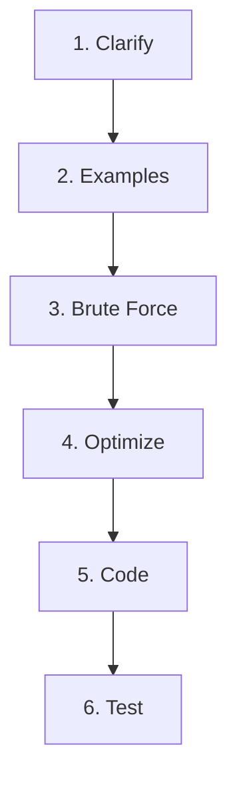

# 1. Complexity and Problem-Solving Framework

> **TL;DR:** Analyse complexity before coding; use the constraint size to pick the algorithm class; follow the 6-step interview framework to stay structured under pressure.

**Interview weight:** P1 — Interviewers watch whether you self-select the right algorithm from constraints, not just whether you eventually find it.

---

## Core Concepts

- **Big-O (O)** — asymptotic upper bound; worst-case guarantee.
- **Big-Omega (Ω)** — asymptotic lower bound; best-case floor.
- **Big-Theta (Θ)** — tight bound; both upper and lower; used when best = worst (e.g. merge sort Θ(n log n)).
- **Amortized** — average cost per operation over a long sequence, even if individual ops spike (e.g. dynamic array doubling).
- **Space complexity** — extra memory beyond input; in-place = O(1) extra (input itself not counted).
- **Recursion stack** — each frame consumes O(1) stack space; total = O(depth). Unbalanced recursion depth O(n) can stack-overflow.

---

## Complexity Classes of Common Operations

| Operation | Data Structure | Time |
| --------- | -------------- | ---- |
| Access by index | Array / `List<T>` | O(1) |
| Search (unsorted) | Array | O(n) |
| Insert/delete (end) | `List<T>` | O(1) amortized |
| Insert/delete (mid) | `List<T>` | O(n) |
| Lookup / insert / delete | `Dictionary<K,V>` | O(1) avg, O(n) worst |
| Insert / delete / min | `SortedSet<T>` / `SortedDictionary` | O(log n) |
| Push / pop | `Stack<T>` / `Queue<T>` | O(1) amortized |
| Heapify | `PriorityQueue<T>` | O(n) |
| Heap insert / extract-min | `PriorityQueue<T>` | O(log n) |
| BFS / DFS | Graph (V,E) | O(V+E) |
| Comparison sort (lower bound) | — | Ω(n log n) |
| Counting sort | — | O(n+k) |

---

## Amortized Analysis — Dynamic Array Doubling

When a `List<T>` doubles capacity (1 → 2 → 4 → 8 …), total copies after n inserts:
1 + 2 + 4 + … + n ≈ 2n → **O(1) amortized** per insert.

Potential-function proof: Φ = 2·(size − capacity/2). Each insert either costs O(1) + Φ↑1, or costs O(capacity) − Φ↓capacity/2, netting O(1) amortized.

---

## Master Theorem

For `T(n) = a·T(n/b) + f(n)`:

| Case | Condition | Result |
| ---- | --------- | ------ |
| 1 | `f(n) = O(n^(log_b a − ε))` | `T(n) = Θ(n^(log_b a))` |
| 2 | `f(n) = Θ(n^(log_b a))` | `T(n) = Θ(n^(log_b a) · log n)` |
| 3 | `f(n) = Ω(n^(log_b a + ε))` and regularity | `T(n) = Θ(f(n))` |

**Quick examples:**
- Merge sort: a=2, b=2, f=Θ(n) → Case 2 → **Θ(n log n)**
- Binary search: a=1, b=2, f=Θ(1) → Case 2 → **Θ(log n)**
- Strassen: a=7, b=2, f=Θ(n²) → Case 1 → **Θ(n^2.81)**

---

## Recursion Tree Analysis

Draw the tree; at each level compute total work; sum levels.

```
T(n) = 2T(n/2) + n
Level 0: n
Level 1: n/2 + n/2 = n
Level 2: n
...
log n levels → Θ(n log n)
```

---

## Constraint Size → Expected Algorithm

| Input size n | Target complexity | Algorithm class |
| ------------ | ----------------- | --------------- |
| n ≤ 20 | O(2^n) or O(n!) | Backtracking, bitmask DP, meet-in-middle |
| n ≤ 400 | O(n³) | Triple-loop DP, Floyd-Warshall |
| n ≤ 3,000 | O(n²) | Two nested loops, O(n²) DP |
| n ≤ 10⁵ | O(n log n) | Sort, binary search, segment tree, heap |
| n ≤ 10⁶ | O(n) | Two pointers, sliding window, prefix sum |
| n ≤ 10⁷ | O(n) tight | Linear scan only, avoid constant-heavy O(n) |
| n ≤ 10¹⁸ | O(log n) | Binary search, fast exponentiation, matrix exponentiation |

> Rule of thumb: CPUs do ~10⁸ simple ops/sec. Budget 1–2 seconds → budget 10⁸ ops.

---

## 6-Step Interview Problem-Solving Framework



### Step-by-step detail

**1. Clarify (2 min)**
- Input/output types, size, uniqueness, sorted? Empty/null? Integer range (overflow risk)?
- Mutate input allowed? Return new structure or in-place?
- State your assumptions out loud before proceeding.

**2. Examples (1 min)**
- Walk through 1 small example manually, 1 edge case (empty, single element, all-same).
- Derive expected output. Write on whiteboard/IDE comment.

**3. Brute Force (1 min)**
- State the naïve O(n²) or O(n!) solution and its complexity.
- Do NOT code it unless asked. Its purpose: establish a baseline and show you understand the problem.

**4. Optimize (3–5 min)**
- Identify the bottleneck (the "hot" loop/lookup).
- Apply patterns: sort first, two pointers, hashmap for O(1) lookup, DP to avoid recomputation.
- State the new complexity and get interviewer buy-in before coding.

**5. Code (10–15 min)**
- Use meaningful variable names. Write helper methods for clarity.
- Code the happy path first, then handle edge cases inline (don't add later).
- Think aloud: "I'm using a dictionary here to get O(1) lookup..."

**6. Test (3–5 min)**
- Run your examples from Step 2 mentally/on paper.
- Add edge cases: empty input, single element, duplicates, negatives, overflow.
- Ask: "Should I write unit tests?" — often impresses interviewers.

---

## How to Verbalize Approach

Use this script pattern:
> "Given the constraint n ≤ 10⁵, I need O(n log n) or better.
> The brute force would be O(n²) — two nested loops.
> I can eliminate the inner loop by sorting first / using a hashmap / maintaining a running variable.
> That gives me O(n log n) / O(n). Let me walk through an example to verify, then code it."

---

## Edge Cases & Invariants Checklist

**Input edge cases:**
- Empty collection / null input
- Single element
- All elements identical
- Already sorted (ascending/descending)
- Integer overflow (use `long` if n up to 10⁹ and multiplied)
- Negative numbers where algorithm assumes positives

**Loop invariant checklist:**
- What is true at the start of each iteration?
- Is the invariant maintained after each step?
- Does it hold at termination and give the correct result?

**Common bugs:**
- Off-by-one in binary search (`lo <= hi` vs `lo < hi`; return `lo` vs `lo-1`)
- Modifying a collection while iterating it
- Uninitialized `best`/`max` (use `int.MinValue`, not `0`, when values can be negative)
- Stack overflow from O(n) recursion depth on n = 10⁵

---

## Comparison

| Notation | Meaning | When to cite |
| -------- | ------- | ------------ |
| O(f) | Worst-case upper bound | Almost always |
| Ω(f) | Best-case lower bound | Proving algorithm optimality |
| Θ(f) | Tight bound | When best ≈ worst |
| Amortized O(f) | Average over sequence | Dynamic resize, splay trees |

---

## Interview Questions

**Q1. What is the difference between O, Ω, and Θ?**
A: O is an upper bound (worst case), Ω is a lower bound (best case), Θ is a tight bound when both coincide. Most interview discussions use O because we care about worst case. Say "Θ(n log n)" for merge sort (not just O) when you want to be precise.

**Q2. Why is dynamic array insertion O(1) amortized rather than O(1)?**
A: Occasional doubling copies all elements — O(n) cost. But doublings happen at sizes 1, 2, 4 … n so total copies ≤ 2n. Spread over n inserts → O(1) average. Potential function: Φ = 2·(size − capacity/2); each op consumes Φ to pay for future doubling.

**Q3. Given n ≤ 10⁵ and a 2-second time limit, what complexities are acceptable?**
A: O(n log n) (~1.7M ops) comfortably fits. O(n) is safe. O(n²) = 10¹⁰ — too slow. O(n√n) ≈ 3×10⁷ — borderline. Binary-search-on-answer + O(n) check = O(n log n) — fine.

**Q4. Explain the Master theorem case 2 with an example.**
A: When the work at each level is the same (f(n) = Θ(n^log_b(a))), all log n levels contribute equally. Example: merge sort has a=2, b=2, log_2(2)=1, f(n)=Θ(n) → Case 2 → Θ(n log n).

**Q5. How do you derive the space complexity of a recursive DFS on a tree with n nodes?**
A: Space = recursion call stack depth = tree height. Balanced tree: O(log n). Skewed (linked-list-like): O(n). Iterative DFS with explicit stack uses O(h) heap space but avoids stack-overflow risk on n = 10⁵.

**Q6. What are the first questions you ask when given a new interview problem?**
A: (1) Input type & size — governs algorithm class. (2) Value range — overflow? (3) Duplicate handling. (4) Is input sorted? (5) Can I modify input in place? (6) Expected output format. These 30 seconds prevent wasted coding time.

**Q7. Walk through the 6-step framework on "find two numbers that sum to target in an unsorted array".**
A: Clarify: unique pairs? one answer? → Example: [2,7,11,15], target=9 → [0,1]. Brute: O(n²) nested. Optimize: hashmap complement lookup → O(n). Code: iterate, check `dict.ContainsKey(target-num)`. Test: empty, duplicates, negative numbers.

**Q8. When does Big-O analysis mislead you in practice?**
A: (1) Hidden constants — O(n log n) with large constant can lose to O(n²) for small n. (2) Cache effects — O(n²) with sequential memory access often beats O(n log n) with random access for n < 10⁴. (3) Amortized worst-case — a single O(n) resize in a tight real-time loop may cause latency spikes even if amortized is O(1). Always benchmark; use `BenchmarkDotNet` in C# for production code.

**Q9. How does the "binary search on the answer" technique work?**
A: When the answer is monotonic (if X is feasible, so is X-1), binary search the answer space. Check feasibility in O(n). Total: O(n log(answer_range)). Example: "Minimum speed to eat all bananas in H hours" — binary search on speed, check feasibility in O(n).

**Q10. What is the recursion-tree analysis of T(n) = T(n/3) + T(2n/3) + n?**
A: Longest branch = right branch, depth = log_{3/2}(n). Each level sums to n. Total = n · log_{3/2}(n) = O(n log n). (This is the recurrence for quicksort with worst-split 1/3:2/3 partition.)

**Q11. How would you check if your algorithm is correct without running it?**
A: (1) Identify the loop invariant and prove it holds at each iteration. (2) Prove termination (loop variable strictly approaches bound). (3) Trace the edge cases mentally. (4) Check postcondition matches the problem statement.

**Q12. A colleague says "just use a hash map, it's O(1)." What would you add?**
A: Hash map is O(1) **average**. Worst case is O(n) with collisions (e.g., all keys hash to same bucket). In adversarial inputs or with poor hash functions, this degrades. C# `Dictionary` mitigates with randomized hashing per process (ASLR-seeded). Also: hash operations have larger constants than array access, so for small n, an array or sorted scan may be faster.

**Q13. (Senior) You designed an O(n log n) solution. The interviewer pushes for O(n). How do you approach it?**
A: Ask what the log factor comes from — usually sorting or a balanced-BST/heap. Ask: is the input already sorted? Can I use a linear-time structure (counting sort, radix sort, prefix sum, two pointers) instead? Often the answer is a monotonic structure or a counting technique that avoids comparison sorting.

---

## Quick Recap

- O = upper bound; Θ = tight; Ω = lower. Most interviews: O is enough.
- Amortized O(1): dynamic array doubling distributes O(n) resize over n inserts.
- Master theorem Case 2 = same work each level → multiply by log n.
- Constraint table: n≤20 → bitmask/backtrack; n≤3000 → O(n²); n≤10⁵ → O(n log n); n≤10⁶ → O(n).
- 6 steps: Clarify → Examples → Brute → Optimize → Code → Test. Never skip Clarify.
- Loop invariant + termination = correctness proof without running code.
- Hash map: O(1) avg, O(n) worst; be honest about this in interviews.
