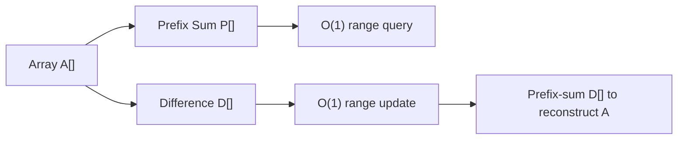

# 2. Arrays, Strings and Matrix

> **TL;DR:** Master prefix sums, difference arrays, and in-place tricks; they unlock O(n) solutions to problems that look O(n²).

**Interview weight:** P1 — The most common coding-round topic. Prefix sum and Kadane appear in ~30% of medium problems.

---

## Core Concepts

- **Dynamic array** — contiguous heap block; `List<T>` in C#. Append O(1) amortized, random access O(1), insert/delete mid O(n).
- **Prefix sum** — `P[i] = P[i-1] + A[i-1]`; range sum `[l,r]` = `P[r+1] - P[l]` in O(1) after O(n) build.
- **Difference array** — supports range add in O(1), reconstruct in O(n). Inverse of prefix sum.
- **Kadane's algorithm** — max subarray sum in O(n) via greedy: extend or restart.
- **Dutch National Flag** — 3-way partition in O(n), O(1) space (Dijkstra's algorithm).
- **Cyclic sort** — for arrays with values in [1..n]; place each element at its index in O(n).
- **`Span<T>` / `ReadOnlySpan<char>`** — stack-allocated slice of array/string; zero-copy, zero-allocation parsing.

---

## Prefix Sum (1D)

```csharp
// Build
int[] A = { 1, 2, 3, 4, 5 };
int n = A.Length;
int[] P = new int[n + 1];          // P[0] = 0
for (int i = 0; i < n; i++)
    P[i + 1] = P[i] + A[i];

// Range sum [l, r] inclusive
int RangeSum(int l, int r) => P[r + 1] - P[l];
```

---

## Difference Array (range update in O(1))

```csharp
// Add val to A[l..r] inclusive, O(1) per update
int[] diff = new int[n + 1];
void RangeAdd(int l, int r, int val)
{
    diff[l] += val;
    diff[r + 1] -= val;
}
// Reconstruct A by prefix-summing diff
int running = 0;
for (int i = 0; i < n; i++) { running += diff[i]; A[i] += running; }
```

---

## 2D Prefix Sum

```csharp
// P[i][j] = sum of rectangle (0,0) to (i-1,j-1)
int[,] P = new int[rows + 1, cols + 1];
for (int i = 1; i <= rows; i++)
    for (int j = 1; j <= cols; j++)
        P[i, j] = grid[i-1][j-1] + P[i-1, j] + P[i, j-1] - P[i-1, j-1];

// Sum of sub-rectangle (r1,c1) to (r2,c2) — all 1-indexed
int SubRect(int r1, int c1, int r2, int c2)
    => P[r2,c2] - P[r1-1,c2] - P[r2,c1-1] + P[r1-1,c1-1];
```

---

## Kadane's Algorithm — Maximum Subarray

```csharp
int MaxSubarray(int[] A)
{
    int best = A[0], cur = A[0];
    for (int i = 1; i < A.Length; i++)
    {
        cur = Math.Max(A[i], cur + A[i]);  // extend or restart
        best = Math.Max(best, cur);
    }
    return best;
}
// O(n) time, O(1) space.  Handles all-negative arrays.
```

**Canonical problems:**
- LeetCode 53 — Maximum Subarray (template above)
- LeetCode 918 — Maximum Sum Circular Subarray: `max(kadane, totalSum - kadane_on_negated)`
- LeetCode 152 — Maximum Product Subarray: track both min and max (sign flips)

---

## Dutch National Flag (3-way partition)

```csharp
void DutchFlag(int[] A)   // 0s, 1s, 2s
{
    int lo = 0, mid = 0, hi = A.Length - 1;
    while (mid <= hi)
    {
        if (A[mid] == 0)      { Swap(A, lo++, mid++); }
        else if (A[mid] == 1) { mid++; }
        else                  { Swap(A, mid, hi--); }
    }
}
```

**Canonical problems:**
- LeetCode 75 — Sort Colors (template above)
- LeetCode 905 — Sort Array by Parity
- LeetCode 2161 — Partition Array According to Pivot

---

## Cyclic Sort

When values are in range [1..n], sort in O(n) by placing `A[i]` at index `A[i]-1`:

```csharp
void CyclicSort(int[] A)
{
    int i = 0;
    while (i < A.Length)
    {
        int j = A[i] - 1;           // correct index for A[i]
        if (A[i] != A[j]) Swap(A, i, j);
        else i++;
    }
}
// After: A[i] == i+1 if present; else A[i] is a duplicate/missing marker.
```

**Canonical problems:**
- LeetCode 448 — Find All Numbers Disappeared in an Array
- LeetCode 442 — Find All Duplicates in an Array
- LeetCode 41 — First Missing Positive

---

## Array Rotation

```csharp
// Rotate right by k: reverse whole, reverse [0..k-1], reverse [k..n-1]
void Rotate(int[] A, int k)
{
    k %= A.Length;
    Reverse(A, 0, A.Length - 1);
    Reverse(A, 0, k - 1);
    Reverse(A, k, A.Length - 1);
}
```

---

## Matrix Operations

### Spiral Traversal

```csharp
IList<int> SpiralOrder(int[][] M)
{
    var res = new List<int>();
    int top = 0, bottom = M.Length - 1, left = 0, right = M[0].Length - 1;
    while (top <= bottom && left <= right)
    {
        for (int c = left;  c <= right;  c++) res.Add(M[top][c]);   top++;
        for (int r = top;   r <= bottom; r++) res.Add(M[r][right]); right--;
        if (top <= bottom)
            for (int c = right; c >= left; c--) res.Add(M[bottom][c]); bottom--;
        if (left <= right)
            for (int r = bottom; r >= top; r--) res.Add(M[r][left]);  left++;
    }
    return res;
}
```

### Rotate 90° In-Place (transpose + reverse rows)

```csharp
void Rotate90(int[][] M)
{
    int n = M.Length;
    // Transpose
    for (int i = 0; i < n; i++)
        for (int j = i + 1; j < n; j++)
            (M[i][j], M[j][i]) = (M[j][i], M[i][j]);
    // Reverse each row
    foreach (var row in M)
        Array.Reverse(row);
}
```

---

## Strings in C#

| Approach | Allocation | When to use |
| -------- | ---------- | ----------- |
| `string +` in loop | O(n²) total | Never in loops |
| `StringBuilder` | O(n) amortized | Building strings incrementally |
| `string.Concat(IEnumerable)` | O(n) | Joining known collection |
| `ReadOnlySpan<char>` / `Span<char>` | Zero (stack) | Parsing sub-strings without allocation |
| `string.AsSpan(start, len)` | Zero | Slicing for comparison/parsing |

```csharp
// Zero-alloc integer parsing from a slice
ReadOnlySpan<char> s = "hello123world".AsSpan(5, 3); // "123"
int val = int.Parse(s);   // No new string allocated
```

---

## Anagram / Palindrome / Compression Patterns

```csharp
// Anagram check: sort or frequency count
bool IsAnagram(string s, string t)
{
    if (s.Length != t.Length) return false;
    int[] freq = new int[26];
    foreach (char c in s) freq[c - 'a']++;
    foreach (char c in t) freq[c - 'a']--;
    return freq.All(x => x == 0);
}

// Palindrome check (two-pointer, ignoring non-alphanumeric)
bool IsPalindrome(string s)
{
    int lo = 0, hi = s.Length - 1;
    while (lo < hi)
    {
        while (lo < hi && !char.IsLetterOrDigit(s[lo])) lo++;
        while (lo < hi && !char.IsLetterOrDigit(s[hi])) hi--;
        if (char.ToLower(s[lo]) != char.ToLower(s[hi])) return false;
        lo++; hi--;
    }
    return true;
}

// Run-length encoding
string Compress(string s)
{
    var sb = new StringBuilder();
    int i = 0;
    while (i < s.Length)
    {
        char c = s[i]; int count = 0;
        while (i < s.Length && s[i] == c) { i++; count++; }
        sb.Append(c);
        if (count > 1) sb.Append(count);
    }
    return sb.Length < s.Length ? sb.ToString() : s;
}
```

---

## Diagram — Prefix Sum & Difference Array



---

## Comparison — In-Place Techniques

| Technique | Space | Time | Use case |
| --------- | ----- | ---- | -------- |
| Two pointers (overwrite) | O(1) | O(n) | Remove duplicates, filter |
| Cyclic sort | O(1) | O(n) | Values in [1..n] range |
| Dutch National Flag | O(1) | O(n) | 3-way partition |
| Reversal trick | O(1) | O(n) | Rotation |
| Transpose + reverse | O(1) | O(n²) | Matrix 90° rotation |

---

## Trade-offs & When to Use

- **Prefix sum** — when multiple range queries on static array; build once, query many.
- **Difference array** — when multiple range updates followed by one reconstruction.
- **Kadane** — max sum subarray; extend to 2D by compressing rows into 1D.
- **Cyclic sort** — only valid when values are consecutive integers in [1..n]; otherwise use sorting.
- **`Span<T>`** — use in hot paths where string slicing causes GC pressure; avoids LOH allocations.

---

## Common Pitfalls

- Prefix sum index: `P[r+1] - P[l]` not `P[r] - P[l]` (off-by-one).
- Kadane with all-negative: initialise `best = A[0]`, not `0`.
- Rotate `k` can exceed `n`; always `k %= n` first.
- Matrix rotation: transpose then reverse rows (not reverse then transpose) for clockwise 90°.
- `StringBuilder` isn't thread-safe; don't share across threads.

---

## Interview Questions

**Q1. What is the time complexity of finding all prefix sums of an array?**
A: O(n) to build, O(1) per query. Total O(n + q) for q queries — optimal since you need to read all n elements at least once.

**Q2. How does Kadane's algorithm handle all-negative arrays?**
A: Initialise `best = cur = A[0]`. When all are negative, restarting at each element is still better than carrying a larger negative, and `best` tracks the least-negative value.

**Q3. Explain the difference array trick and give a use case.**
A: `diff[l] += val; diff[r+1] -= val;` marks range boundaries. Prefix-summing diff reconstructs the updated array. Use case: bulk flight seat reservations — increment booking at day L, decrement at day R+1; prefix-sum gives occupancy at each day.

**Q4. How do you rotate an n×n matrix 90° clockwise in O(1) space?**
A: Transpose (swap `M[i][j]` with `M[j][i]`), then reverse each row. Two O(n²) passes, O(1) extra. Counter-clockwise: reverse each row first, then transpose.

**Q5. Why is string concatenation in a loop O(n²) in C#?**
A: `string` is immutable; each `+` creates a new string copying all previous chars. After k iterations, total copies = 1+2+…+k = O(k²). Fix: `StringBuilder` or `string.Join`.

**Q6. What is `Span<T>` and when do you use it in C# for string processing?**
A: A stack-allocated ref struct representing a contiguous memory slice (array, stack memory, unmanaged). `"hello".AsSpan(1,3)` returns `"ell"` with zero allocation. Use in parsers/hot paths to eliminate GC pressure from substring creation. Cannot be stored on heap (no field in a class).

**Q7. How would you find the maximum sum rectangle in a 2D matrix?**
A: Fix top and bottom row, collapse columns to 1D using prefix sums of each column segment, then run Kadane on the 1D array. O(n²·m) total. For square matrix: O(n³).

**Q8. Describe the Dutch National Flag algorithm and its invariants.**
A: Three regions: `[0..lo-1]` = 0s, `[lo..mid-1]` = 1s, `[mid..hi]` = unknown, `[hi+1..n-1]` = 2s. Invariant maintained after each swap. Loop terminates when `mid > hi`. O(n) with one pass.

**Q9. How do you find the first missing positive in O(n) time and O(1) space?**
A: Cyclic sort: place each value `v` (1 ≤ v ≤ n) at index `v-1`. Then scan; first index where `A[i] != i+1` gives answer. Values outside [1..n] are ignored. LeetCode 41.

**Q10. Given an array of n integers, find all sub-arrays with sum = 0. How?**
A: Prefix sum + hashset. If `P[j] == P[i]`, subarray `(i..j-1]` sums to 0. Store prefix sums in a set; on collision record indices. O(n) time and space.

**Q11. (Senior) In production C# code, you have a tight loop parsing millions of short substrings from a large string. How do you optimise?**
A: Use `ReadOnlySpan<char>` slices via `AsSpan(start, len)` or `MemoryExtensions.Split`. Avoids allocating a `string` per slice, eliminates GC pressure, keeps data cache-hot. If you need async, use `Memory<char>` (not `Span` which can't cross `await`). Profile with `dotnet-trace` / BenchmarkDotNet to confirm.

**Q12. (Senior) How do you extend Kadane's to a 2D variant, and what's the complexity?**
A: Fix top row `r1` from 0 to n-1. For each `r1`, iterate `r2` from `r1` to n-1; maintain a row-sum array (add row `r2`). Run Kadane on row-sum array. Track max rectangle. O(n²·m). With n=m: O(n³). Space O(m).

**Q13. Difference array vs segment tree — when do you pick each?**
A: Difference array: offline, all range-updates before any query, one final prefix-sum scan. O(n+q). Segment tree: online updates/queries interleaved, point queries, or range queries between updates. O(q log n). Difference array is simpler; use it when the access pattern allows.

---

## Quick Recap

- Prefix sum: O(n) build → O(1) range query. Index: `P[r+1] - P[l]`.
- Difference array: O(1) range update → O(n) reconstruct. Inverse of prefix sum.
- Kadane: `cur = max(A[i], cur + A[i])`. Init `best = A[0]` not `0`.
- Dutch flag: 3 pointers (lo/mid/hi), one pass, O(n) O(1).
- Cyclic sort: for [1..n] values; place at index `val-1`; find first mismatch.
- Matrix 90° CW: transpose then reverse each row. O(n²) O(1).
- `Span<char>`: zero-alloc string slicing; can't cross `await` boundaries.
