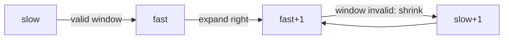

# 3. Two Pointers and Sliding Window

> **TL;DR:** Two pointers reduce O(n²) nested loops to O(n) by maintaining structural invariants about the subarray/subsequence between the pointers.

**Interview weight:** P1 — Appears in ~25% of medium/hard array problems. Recognise by "subarray", "substring", "pair", "at most K" keywords.

---

## Core Concepts

- **Opposite-ends two pointers** — `lo` at 0, `hi` at n−1; move based on comparison. Pre-condition: array is sorted (or monotonic relationship exists).
- **Same-direction two pointers** — `slow` and `fast` both move right; maintain a window `[slow..fast]`. Used for sliding window.
- **Fast/slow pointers** — cycle detection, finding middle of linked list.
- **Fixed-window** — window size k stays constant; slide by advancing both ends.
- **Variable-window** — expand `fast` until constraint violated; shrink `slow` to restore.
- **Shrink condition** — the predicate that triggers moving `slow` forward to maintain a valid window.

---

## Pattern Recognition

| Signal in problem | Pattern |
| ----------------- | ------- |
| "sorted array, find pair with sum" | Opposite-ends |
| "remove duplicates in-place" | Slow/fast same-direction |
| "longest substring with at most K distinct" | Variable window |
| "minimum window substring" | Variable window + hashmap |
| "fixed-size window, max/min sum" | Fixed window |
| "at most K distinct" / "exactly K" | at-most-K trick |
| "cycle in linked list" | Fast/slow (Floyd) |

---

## Opposite-Ends Two Pointers Template

```csharp
// Pre-condition: array sorted or monotonic structure
int lo = 0, hi = A.Length - 1;
while (lo < hi)
{
    int sum = A[lo] + A[hi];
    if (sum == target)      { /* record; move both */ lo++; hi--; }
    else if (sum < target)  { lo++; }
    else                    { hi--; }
}
```

**Canonical problems:**
- LeetCode 167 — Two Sum II (sorted): template above.
- LeetCode 15 — 3Sum: fix one element, two-pointer on the rest. O(n²).
- LeetCode 11 — Container With Most Water: move the shorter side pointer inward.
- LeetCode 42 — Trapping Rain Water: `water += min(maxL, maxR) - A[i]`.

---

## Fixed Sliding Window Template

```csharp
// Sum of every window of size k
int windowSum = 0;
for (int i = 0; i < k; i++) windowSum += A[i];
int maxSum = windowSum;
for (int i = k; i < A.Length; i++)
{
    windowSum += A[i] - A[i - k];   // add new, drop old
    maxSum = Math.Max(maxSum, windowSum);
}
```

**Canonical problems:**
- LeetCode 643 — Maximum Average Subarray I: fixed window sum.
- LeetCode 1456 — Maximum Number of Vowels in a Substring of Given Length.

---

## Variable Sliding Window Template

```csharp
// Longest subarray satisfying a condition
var window = new Dictionary<char, int>();
int slow = 0, best = 0;
for (int fast = 0; fast < s.Length; fast++)
{
    // 1. Expand: add s[fast] to window
    window[s[fast]] = window.GetValueOrDefault(s[fast]) + 1;

    // 2. Shrink: while window violates constraint, advance slow
    while (/* window invalid */)
    {
        window[s[slow]]--;
        if (window[s[slow]] == 0) window.Remove(s[slow]);
        slow++;
    }

    // 3. Update answer (window is always valid here)
    best = Math.Max(best, fast - slow + 1);
}
return best;
```

**Canonical problems:**
- LeetCode 3 — Longest Substring Without Repeating Characters: constraint = all unique chars.
- LeetCode 159 — Longest Substring with At Most Two Distinct Characters.
- LeetCode 76 — Minimum Window Substring: track `have`/`need` counters.
- LeetCode 424 — Longest Repeating Character Replacement: shrink when `(k - maxFreq) > k`.
- LeetCode 1004 — Max Consecutive Ones III: at most K zeros in window.

---

## Window with HashMap Counts

```csharp
// Minimum Window Substring (LeetCode 76)
string MinWindow(string s, string t)
{
    var need = new Dictionary<char, int>();
    foreach (char c in t) need[c] = need.GetValueOrDefault(c) + 1;
    int have = 0, required = need.Count;
    int slow = 0, minLen = int.MaxValue, minStart = 0;
    var window = new Dictionary<char, int>();

    for (int fast = 0; fast < s.Length; fast++)
    {
        char c = s[fast];
        window[c] = window.GetValueOrDefault(c) + 1;
        if (need.ContainsKey(c) && window[c] == need[c]) have++;

        while (have == required)
        {
            if (fast - slow + 1 < minLen) { minLen = fast - slow + 1; minStart = slow; }
            char l = s[slow++];
            window[l]--;
            if (need.ContainsKey(l) && window[l] < need[l]) have--;
        }
    }
    return minLen == int.MaxValue ? "" : s.Substring(minStart, minLen);
}
// O(|s| + |t|) time, O(|t|) space
```

---

## "At Most K → Exactly K" Trick

> `count(exactly K) = count(at most K) - count(at most K-1)`

Works when "at most K" is easy to implement with a variable window.

```csharp
int ExactlyK(int[] A, int k)
    => AtMostK(A, k) - AtMostK(A, k - 1);

int AtMostK(int[] A, int k)
{
    int slow = 0, count = 0, ans = 0;
    for (int fast = 0; fast < A.Length; fast++)
    {
        if (A[fast] != 1) { count = 0; slow = fast + 1; continue; } // domain-specific
        count++;
        while (count > k) { if (A[slow++] == 1) count--; }
        ans += fast - slow + 1;
    }
    return ans;
}
```

**Canonical problems:**
- LeetCode 930 — Binary Subarrays With Sum: exactly K ones.
- LeetCode 992 — Subarrays with K Different Integers.
- LeetCode 1248 — Count Number of Nice Subarrays (odd numbers = K).

---

## Fast / Slow Pointer (Floyd's cycle algorithm for arrays/lists)

```csharp
// Find duplicate in array [1..n] by treating values as next-pointers
int FindDuplicate(int[] A)
{
    int slow = A[0], fast = A[A[0]];
    while (slow != fast) { slow = A[slow]; fast = A[A[fast]]; }
    // Phase 2: find entrance to cycle
    slow = 0;
    while (slow != fast) { slow = A[slow]; fast = A[fast]; }
    return slow;
}
// LeetCode 287 — O(n) time, O(1) space
```

---

## Diagram — Variable Sliding Window



---

## Comparison — Two Pointer Variants

| Variant | Direction | Pre-condition | Typical complexity |
| ------- | --------- | ------------- | ------------------ |
| Opposite-ends | Converging | Sorted / monotonic | O(n) |
| Same-direction (fixed window) | Both right | None | O(n) |
| Same-direction (variable window) | Both right | Valid-window monotonicity | O(n) |
| Fast / slow | Both right, different speeds | Sequence / array | O(n) |

---

## Trade-offs & When to Use

- Opposite-ends requires sorted input. If unsorted, sort first (O(n log n)) or use hashmap.
- Variable window only works if the window validity is **monotonic**: once invalid, only shrinking (not re-expanding) can restore it.
- "At most K" trick: only valid when the answer for K=0 is 0 (subarrays don't start negative counts).
- Fixed window: beware — initialize the first window separately, then slide.

---

## Common Pitfalls

- Variable window: updating answer **after** shrinking, not before. Order must be: expand → shrink → record.
- Forgetting `k %= n` when the window size equals array length.
- Off-by-one in window size: `fast - slow + 1` (inclusive both ends).
- Minimum window: don't forget to check the last valid window after the loop.
- "At most K": ensure the "subtracted" version `AtMostK(k-1)` handles k=0 gracefully (return 0).

---

## Interview Questions

**Q1. When can you use opposite-ends two pointers?**
A: When the array is sorted (or has a monotonic relationship), so that you can definitively decide which pointer to move. If `A[lo] + A[hi] < target`, moving `lo` right can only increase the sum; moving `hi` left can only decrease it. Without this monotonicity, you can't prune safely.

**Q2. What is the time complexity of the variable sliding window and why?**
A: O(n). Each element is added by `fast` exactly once and removed by `slow` at most once → 2n pointer movements total → O(n).

**Q3. Describe the "exactly K = at most K minus at most K-1" trick.**
A: Many "exactly K" window problems are hard to implement directly because the window can't simply be shrunk — satisfying "exact K" is tricky. But "at most K" shrinks cleanly. Since `count(exactly K) = count(at most K) - count(at most K-1)`, run the easier function twice. O(n) total.

**Q4. Given a sorted array, find all unique triplets summing to zero.**
A: Fix index `i` (skip duplicates). Two-pointer on `[i+1..n-1]` for pair summing to `-A[i]`. Skip duplicates when recording. O(n²) time, O(1) extra space.

**Q5. How does the minimum window substring algorithm avoid O(n²)?**
A: `have`/`required` counters tell us when the window satisfies the condition without scanning it each time. Shrinking updates the counters in O(1). Total: O(|s| + |t|).

**Q6. How would you find the longest subarray with sum ≤ K (values can be negative)?**
A: If values can be negative, sliding window doesn't work (shrinking doesn't guarantee sum decreases). Use prefix sums + monotonic deque or segment tree. Sliding window only works when all values ≥ 0 (shrinking always decreases sum).

**Q7. Explain the fast/slow pointer trick for finding a cycle entry point in a linked list.**
A: Phase 1: detect meeting point (slow=1x, fast=2x). If list length=L, cycle length=C, they meet at distance `L-C` from cycle start inside the cycle. Phase 2: reset slow to head, advance both 1 step; they meet at cycle entry. Proof: after phase 1, fast is `L-C` steps ahead inside cycle, so it's `C-(L-C)=2C-L` from entry... simplified: both pointers cover equal additional distance to entry.

**Q8. How do you find the maximum in every window of size k in O(n)?**
A: Monotonic deque (see [Stacks & Queues](05-Stacks-Queues-and-Monotonic-Structures.md)). Remove elements outside window from front; remove smaller elements from back before adding. Front always holds maximum. O(n) total.

**Q9. (Senior) A variable window solution works on small inputs but has high memory usage at scale. What do you check?**
A: The dictionary inside the window can grow to O(distinct chars/values). For Unicode strings, use `int[128]` or `int[26]` instead of `Dictionary<char,int>` for ASCII. Also check if `GetValueOrDefault` is allocating — it doesn't, but avoid `TryGetValue` + new entry patterns in hot loops.

**Q10. Two sum in sorted vs unsorted array — trade-offs?**
A: Sorted → two pointers O(n) time, O(1) space. Unsorted → hashmap O(n) time, O(n) space. If you can sort first (modifying input ok), O(n log n) sort + O(n) scan = O(n log n) with O(1) extra. If you must preserve order, use hashmap.

**Q11. How does LeetCode 76 (Minimum Window Substring) differ from LeetCode 3 (Longest Substring Without Repeating)?**
A: Both use variable window. LC3: constraint is all-unique chars (any repeat = invalid). LC76: constraint is covering all chars in `t` at required frequencies — use `have`/`need` counters. LC3 maximises window length; LC76 minimises. Both O(n).

**Q12. (Senior) How would you parallelise a sliding-window computation over a 1 TB stream?**
A: Partition stream into overlapping chunks (overlap = window_size - 1) across parallel workers. Each worker processes its chunk independently. Merge boundary results. In C#, use `Channel<T>` with dedicated consumer tasks. Ensures no window spans an unprocessed boundary.

---

## Quick Recap

- Opposite-ends: sorted array, converging pointers, O(n).
- Fixed window: slide by `+ A[fast] - A[fast-k]`, O(n).
- Variable window: expand fast, shrink slow while invalid, O(n). Answer after shrink.
- "Exactly K = at most K − at most K-1". Run twice.
- Fast/slow: cycle detection; both pointers, different speeds.
- Window with hashmap: `have`/`need` counters for minimum window.
- Negative values → sliding window breaks. Use prefix sums instead.
