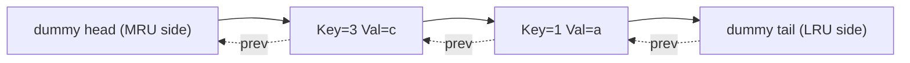

# 4. Linked Lists

> **TL;DR:** Linked lists reward pointer manipulation mastery; dummy heads and two-pointer traversal eliminate most edge cases. LRU/LFU cache design is the canonical senior-level application.

**Interview weight:** P1 — Floyd cycle detection and LRU cache appear in interviews at all levels. LFU is a Staff/senior signal.

---

## Core Concepts

- **Singly linked list** — each node holds `value` + `next`. O(n) access; O(1) insert/delete at known pointer.
- **Doubly linked list** — `prev` + `next`; O(1) delete of a known node. Required for LRU.
- **Circular list** — tail.next → head. Used in round-robin schedulers.
- **Dummy head (sentinel)** — a fake node before head; eliminates special-casing of empty list or first-node deletions.

```csharp
public class ListNode
{
    public int Val;
    public ListNode Next;
    public ListNode(int val = 0, ListNode next = null) { Val = val; Next = next; }
}
```

---

## Reverse — Iterative & Recursive

```csharp
// Iterative O(n) O(1)
ListNode Reverse(ListNode head)
{
    ListNode prev = null, cur = head;
    while (cur != null)
    {
        var next = cur.Next;
        cur.Next = prev;
        prev = cur;
        cur = next;
    }
    return prev;
}

// Recursive O(n) O(n) stack
ListNode ReverseRec(ListNode head)
{
    if (head?.Next == null) return head;
    var newHead = ReverseRec(head.Next);
    head.Next.Next = head;
    head.Next = null;
    return newHead;
}
```

---

## Floyd's Cycle Detection

**Phase 1 — Detect cycle:** slow moves 1 step, fast moves 2. If they meet, cycle exists.

**Phase 2 — Find entry:** reset slow to head; advance both 1 step. They meet at cycle entry.

**Proof of Phase 2:**
Let: `F` = distance from head to cycle entry, `C` = cycle length, meeting point is `a` steps into cycle.
At meeting: slow traveled `F+a`, fast traveled `F+a+nC`. Fast = 2×slow → `F+a = nC` → `F = nC - a`.
Reset slow to head: slow needs `F` steps to reach entry; fast needs `nC - a = F` steps from meeting point to reach entry. They arrive simultaneously.

```csharp
ListNode DetectCycleEntry(ListNode head)
{
    var slow = head; var fast = head;
    while (fast?.Next != null)
    {
        slow = slow.Next;
        fast = fast.Next.Next;
        if (slow == fast)
        {
            slow = head;
            while (slow != fast) { slow = slow.Next; fast = fast.Next; }
            return slow;  // cycle entry
        }
    }
    return null;  // no cycle
}
```

---

## Find Middle (Fast/Slow)

```csharp
ListNode FindMiddle(ListNode head)
{
    var slow = head; var fast = head;
    while (fast?.Next != null) { slow = slow.Next; fast = fast.Next.Next; }
    return slow;  // for even-length: returns second of two middles
}
```

---

## Merge Two Sorted Lists

```csharp
ListNode Merge(ListNode l1, ListNode l2)
{
    var dummy = new ListNode();
    var cur = dummy;
    while (l1 != null && l2 != null)
    {
        if (l1.Val <= l2.Val) { cur.Next = l1; l1 = l1.Next; }
        else                  { cur.Next = l2; l2 = l2.Next; }
        cur = cur.Next;
    }
    cur.Next = l1 ?? l2;
    return dummy.Next;
}
// O(m+n) time, O(1) space
```

---

## Merge K Sorted Lists

```csharp
ListNode MergeKLists(ListNode[] lists)
{
    // Use min-heap on (value, list-index)
    var pq = new PriorityQueue<ListNode, int>();
    foreach (var l in lists) if (l != null) pq.Enqueue(l, l.Val);
    var dummy = new ListNode(); var cur = dummy;
    while (pq.Count > 0)
    {
        var node = pq.Dequeue();
        cur.Next = node; cur = cur.Next;
        if (node.Next != null) pq.Enqueue(node.Next, node.Next.Val);
    }
    return dummy.Next;
}
// O(n log k) — n total nodes, k lists
```

---

## Reorder List (LeetCode 143)

> Reorder: L0→L1→…→Ln-1→Ln becomes L0→Ln→L1→Ln-1→…

1. Find middle (fast/slow).
2. Reverse second half.
3. Interleave two halves.

---

## Palindrome Linked List

1. Find middle. 2. Reverse second half. 3. Compare. 4. Restore (optional). O(n) O(1).

---

## Copy List with Random Pointer (LeetCode 138)

```csharp
// Dictionary<original, copy> — O(n) time and space
Node CopyRandomList(Node head)
{
    if (head == null) return null;
    var map = new Dictionary<Node, Node>();
    var cur = head;
    while (cur != null) { map[cur] = new Node(cur.Val); cur = cur.Next; }
    cur = head;
    while (cur != null)
    {
        map[cur].Next   = cur.Next   != null ? map[cur.Next]   : null;
        map[cur].Random = cur.Random != null ? map[cur.Random] : null;
        cur = cur.Next;
    }
    return map[head];
}
// O(1) space variant: weave copies into original list, set random, then separate.
```

---

## LRU Cache — Full Implementation

**Structure:** `Dictionary<int, DllNode>` for O(1) lookup + doubly linked list (DLL) for O(1) move-to-front and O(1) evict-from-tail.



```csharp
public class LRUCache
{
    private class Node
    {
        public int Key, Val;
        public Node Prev, Next;
        public Node(int k = 0, int v = 0) { Key = k; Val = v; }
    }

    private readonly int _cap;
    private readonly Dictionary<int, Node> _map;
    private readonly Node _head, _tail; // sentinels: head=MRU side, tail=LRU side

    public LRUCache(int capacity)
    {
        _cap = capacity;
        _map = new Dictionary<int, Node>(capacity);
        _head = new Node(); _tail = new Node();
        _head.Next = _tail; _tail.Prev = _head;
    }

    public int Get(int key)
    {
        if (!_map.TryGetValue(key, out var node)) return -1;
        MoveToFront(node);
        return node.Val;
    }

    public void Put(int key, int value)
    {
        if (_map.TryGetValue(key, out var node))
        {
            node.Val = value;
            MoveToFront(node);
            return;
        }
        if (_map.Count == _cap)
        {
            var lru = _tail.Prev;   // LRU node
            Remove(lru);
            _map.Remove(lru.Key);
        }
        var fresh = new Node(key, value);
        InsertFront(fresh);
        _map[key] = fresh;
    }

    private void Remove(Node n)
    {
        n.Prev.Next = n.Next;
        n.Next.Prev = n.Prev;
    }
    private void InsertFront(Node n)
    {
        n.Next = _head.Next; n.Prev = _head;
        _head.Next.Prev = n; _head.Next = n;
    }
    private void MoveToFront(Node n) { Remove(n); InsertFront(n); }
}
// All ops O(1). Space O(capacity).
```

---

## LFU Cache Design

**Concept:** Evict the least frequently used key. On frequency tie, evict LRU among them.

**Data structures:**
- `Dictionary<int, (int val, int freq)>` — key → (value, frequency).
- `Dictionary<int, LinkedList<int>>` — freq → doubly linked list of keys (insertion order = LRU order within frequency).
- `int minFreq` — track current minimum frequency.

**Operations (all O(1)):**
- `Get(key)`: look up value, increment freq, move key from `freqMap[freq]` to `freqMap[freq+1]`. Update `minFreq` if `freqMap[minFreq]` is now empty.
- `Put(key, val)`: if exists, same as get + update val. If new: evict `freqMap[minFreq]`'s tail if at capacity; insert key into `freqMap[1]`; set `minFreq = 1`.

---

## Comparison — Singly vs Doubly vs Circular

| Aspect | Singly | Doubly | Circular |
| ------ | ------ | ------ | -------- |
| Space per node | 1 pointer | 2 pointers | 1 or 2 |
| Delete known node | O(n) — need prev | O(1) | O(1) with 2 ptrs |
| Reverse traversal | No | Yes | No |
| LRU implementation | No — can't delete tail in O(1) | Yes | No |
| Use cases | Simple traversal, stacks | LRU, deques, editors | Round-robin, Josephus |

---

## Trade-offs & When to Use

- Use dummy head whenever head node can be deleted (avoids `if head == null` checks).
- Prefer iterative reverse in production — recursive reverse risks stack overflow for n > 10⁴.
- LRU: `Dictionary + DLL` beats `LinkedList<T>` (C# BCL) alone because BCL `LinkedList.Find` is O(n).
- LFU is O(1) only with the two-hashmap design above; naive approaches are O(log n) with heap.

---

## Common Pitfalls

- Forgetting to set `tail.Prev = head` in the sentinel setup.
- In LRU `Put`: check existing key first before checking capacity — updating an existing key doesn't consume capacity.
- Cycle detection: use `fast?.Next != null`, not just `fast != null`, to avoid NRE.
- Reverse recursive: `head.Next.Next = head; head.Next = null` — order matters; break the old link after creating the new one.

---

## Interview Questions

**Q1. Why do we use a dummy head node in linked list problems?**
A: It eliminates special cases for inserting/deleting the first node. The real head is always `dummy.Next`. Code stays uniform — no `if (head == null)` branches. Especially useful in merge and reverse-k-group problems.

**Q2. Prove that Floyd's Phase 2 correctly finds the cycle entry.**
A: See proof in [Floyd's Cycle Detection](#floyds-cycle-detection) above. Key insight: when slow resets to head, both pointers are exactly `F` steps from the cycle entry, so they meet there.

**Q3. How does the LRU cache achieve O(1) for all operations?**
A: Dictionary gives O(1) lookup by key. Doubly linked list gives O(1) insert/delete of a known node (using the stored pointer from the dictionary). "Move to front" = remove + insert front = O(1) DLL ops.

**Q4. What is the space complexity of the LRU cache?**
A: O(capacity) — dictionary holds at most `capacity` entries; DLL holds at most `capacity` + 2 sentinel nodes.

**Q5. How do you detect a cycle without the fast/slow pointer?**
A: HashSet of visited node references — O(n) time and space. Floyd's is O(n) time, O(1) space. HashSet is simpler to implement under pressure; use it if space isn't constrained.

**Q6. How do you reverse a linked list in groups of K?**
A: Recursive: reverse K nodes, recurse on remainder, link tail of reversed group to head of next result. Iterative: track prevGroupTail, count K nodes ahead, reverse, relink. O(n) time.

**Q7. How do you check if a linked list is a palindrome in O(n) time and O(1) space?**
A: (1) Find middle with slow/fast. (2) Reverse second half. (3) Compare from head and reversed-half head. (4) Restore second half (optional, good practice). O(n) O(1).

**Q8. What is the difference between LRU and LFU eviction?**
A: LRU evicts the least recently accessed key regardless of frequency. LFU evicts the least frequently accessed key (on tie: least recently used among those). LFU favors items accessed many times historically; LRU favors recency. LFU is harder to implement O(1); used in TF-IDF-like caching scenarios.

**Q9. Why can't you use C#'s built-in `LinkedList<T>` to implement O(1) LRU?**
A: `LinkedList<T>.Find(value)` is O(n). You need O(1) node access. Solution: store `LinkedListNode<T>` directly in the dictionary, bypassing `Find`. Then `list.Remove(node)` and `list.AddFirst(node)` are O(1).

**Q10. How do you merge K sorted lists efficiently?**
A: Min-heap of size K holding each list's current head. Extract min → add to result → push next from same list. O(n log K) where n = total nodes.

**Q11. Explain "copy list with random pointer" and its O(1) space solution.**
A: O(n) space: use a dictionary mapping original → copy nodes. O(1) space trick: interweave copies (A → A' → B → B' …). Set `A'.Random = A.Random.Next` (since random's copy is always the next node). Then separate the two lists. O(n) time, O(1) extra space.

**Q12. (Senior) How would you design a thread-safe LRU cache in C#?**
A: Wrap all reads and writes in a `ReaderWriterLockSlim` (read lock for `Get`, write lock for `Put`). Or use `ConcurrentDictionary` for the map but still need a write lock around the DLL operations (DLL mutations are not atomic). Alternatively, use a `lock` on the entire cache for simplicity — contention is low if cache is partitioned by key hash (sharded LRU). For very high throughput, consider `Microsoft.Extensions.Caching.Memory` which uses internal locking.

**Q13. (Senior) LRU vs SLAB cache — when does LRU fail?**
A: LRU suffers "cache pollution" on sequential scans: a linear scan of n items evicts all warm cache entries even if the scan data is never reused. Solutions: ARC (Adaptive Replacement Cache) tracks both recency and frequency; CLOCK eviction approximates LRU with less overhead; MySQL InnoDB uses a "young/old" split in the buffer pool to protect hot pages from scan pollution.

---

## Quick Recap

- Dummy head: always use when head itself can be removed.
- Reverse iterative: `prev=null; while cur: save next, point back, advance`.
- Floyd cycle: meet → reset slow to head → advance both 1 step → meet at entry.
- Find middle: slow/fast; slow stops at middle when fast reaches end.
- Merge K lists: min-heap, O(n log K).
- LRU: `Dictionary<key, DllNode>` + DLL with sentinels. All ops O(1).
- LFU: freq→LRU-ordered key list + min-freq tracker. All ops O(1).
