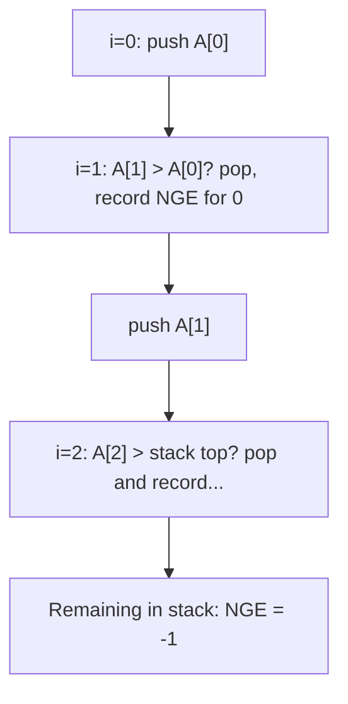

# 5. Stacks, Queues and Monotonic Structures

> **TL;DR:** Stacks/queues are O(1) push/pop; monotonic stacks reduce "next greater/smaller" class problems from O(n²) to O(n) via a single pass.

**Interview weight:** P1 — Monotonic stack (histogram, rain water, stock span) and sliding-window max deque appear frequently in medium/hard rounds.

---

## Core Concepts

- **Stack** — LIFO; `push`/`pop`/`peek` all O(1). C#: `Stack<T>`.
- **Queue** — FIFO; `enqueue`/`dequeue` O(1). C#: `Queue<T>`.
- **Deque (double-ended queue)** — O(1) push/pop at both ends. C#: `LinkedList<T>` or `ArrayDeque` workaround with `LinkedList`.
- **Monotonic stack** — stack maintained in strictly increasing or decreasing order of elements. Elements are popped when a "better" element arrives.
- **Monotonic deque** — deque maintained so front is always the current window maximum/minimum. Used in sliding-window max.

---

## Queue with 2 Stacks

```csharp
public class MyQueue
{
    private Stack<int> _in = new(), _out = new();

    public void Enqueue(int x) => _in.Push(x);

    public int Dequeue()
    {
        if (_out.Count == 0)
            while (_in.Count > 0) _out.Push(_in.Pop()); // lazy transfer
        return _out.Pop();
    }

    public int Peek()
    {
        if (_out.Count == 0)
            while (_in.Count > 0) _out.Push(_in.Pop());
        return _out.Peek();
    }
}
// Each element moved at most once: Dequeue O(1) amortized.
```

---

## Stack with 1 Queue (LIFO via rotation)

```csharp
public class MyStack
{
    private Queue<int> _q = new();

    public void Push(int x)
    {
        _q.Enqueue(x);
        for (int i = 0; i < _q.Count - 1; i++) _q.Enqueue(_q.Dequeue()); // rotate
    }
    public int Pop()  => _q.Dequeue();
    public int Top()  => _q.Peek();
}
// Push O(n); pop/top O(1). Used only to satisfy "implement stack using queue" puzzles.
```

---

## Min-Stack in O(1)

```csharp
public class MinStack
{
    private Stack<int> _s   = new();
    private Stack<int> _min = new();

    public void Push(int val)
    {
        _s.Push(val);
        _min.Push(_min.Count == 0 ? val : Math.Min(val, _min.Peek()));
    }
    public void Pop()       { _s.Pop(); _min.Pop(); }
    public int  Top()       => _s.Peek();
    public int  GetMin()    => _min.Peek();
}
// _min tracks running minimum in sync with _s. All ops O(1).
```

---

## Monotonic Stack Patterns

### Next Greater Element

```csharp
int[] NextGreater(int[] A)
{
    int n = A.Length;
    int[] res = Enumerable.Repeat(-1, n).ToArray();
    var stack = new Stack<int>(); // indices, decreasing value order
    for (int i = 0; i < n; i++)
    {
        while (stack.Count > 0 && A[stack.Peek()] < A[i])
            res[stack.Pop()] = A[i];
        stack.Push(i);
    }
    return res;
}
// O(n) — each index pushed and popped at most once.
```

**Canonical problems:**
- LeetCode 496 — Next Greater Element I
- LeetCode 503 — Next Greater Element II (circular: iterate twice, index `% n`)
- LeetCode 901 — Online Stock Span: accumulate span counts while popping

### Largest Rectangle in Histogram (LeetCode 84)

```csharp
int LargestRectangle(int[] heights)
{
    var stack = new Stack<int>(); // increasing heights (indices)
    int max = 0;
    int n = heights.Length;
    for (int i = 0; i <= n; i++)
    {
        int h = i < n ? heights[i] : 0; // sentinel
        while (stack.Count > 0 && heights[stack.Peek()] > h)
        {
            int height = heights[stack.Pop()];
            int width  = stack.Count == 0 ? i : i - stack.Peek() - 1;
            max = Math.Max(max, height * width);
        }
        stack.Push(i);
    }
    return max;
}
// O(n) time, O(n) space.
```

### Trapping Rain Water (LeetCode 42)

```csharp
// Two-pointer O(n) O(1) — alternative to monotonic stack
int Trap(int[] height)
{
    int lo = 0, hi = height.Length - 1, maxL = 0, maxR = 0, water = 0;
    while (lo < hi)
    {
        if (height[lo] < height[hi])
        {
            maxL = Math.Max(maxL, height[lo]);
            water += maxL - height[lo++];
        }
        else
        {
            maxR = Math.Max(maxR, height[hi]);
            water += maxR - height[hi--];
        }
    }
    return water;
}
```

---

## Sliding Window Maximum with Deque (LeetCode 239)

```csharp
int[] MaxSlidingWindow(int[] A, int k)
{
    int n = A.Length;
    int[] res = new int[n - k + 1];
    var dq = new LinkedList<int>(); // indices; front = max of current window

    for (int i = 0; i < n; i++)
    {
        // Remove indices out of window
        while (dq.Count > 0 && dq.First.Value < i - k + 1)
            dq.RemoveFirst();
        // Maintain decreasing order — remove smaller elements from back
        while (dq.Count > 0 && A[dq.Last.Value] < A[i])
            dq.RemoveLast();
        dq.AddLast(i);
        if (i >= k - 1) res[i - k + 1] = A[dq.First.Value];
    }
    return res;
}
// O(n) — each element enqueued/dequeued at most once.
```

---

## Valid Parentheses

```csharp
bool IsValid(string s)
{
    var stack = new Stack<char>();
    foreach (char c in s)
    {
        if (c is '(' or '[' or '{') { stack.Push(c); continue; }
        if (stack.Count == 0) return false;
        char top = stack.Pop();
        if (c == ')' && top != '(') return false;
        if (c == ']' && top != '[') return false;
        if (c == '}' && top != '{') return false;
    }
    return stack.Count == 0;
}
```

---

## Infix → Postfix (Shunting-Yard) & Evaluation

```csharp
// Evaluate postfix (RPN) — LeetCode 150
int EvalRPN(string[] tokens)
{
    var stack = new Stack<int>();
    foreach (var t in tokens)
    {
        if (int.TryParse(t, out int num)) { stack.Push(num); continue; }
        int b = stack.Pop(), a = stack.Pop();
        stack.Push(t switch { "+" => a + b, "-" => a - b, "*" => a * b, _ => a / b });
    }
    return stack.Pop();
}

// Basic calculator (infix with +, -, parentheses) — LeetCode 224
int Calculate(string s)
{
    var stack = new Stack<int>();
    int result = 0, num = 0, sign = 1;
    foreach (char c in s)
    {
        if (char.IsDigit(c)) { num = num * 10 + (c - '0'); }
        else if (c == '+') { result += sign * num; num = 0; sign = 1; }
        else if (c == '-') { result += sign * num; num = 0; sign = -1; }
        else if (c == '(') { stack.Push(result); stack.Push(sign); result = 0; sign = 1; }
        else if (c == ')') { result += sign * num; num = 0; result *= stack.Pop(); result += stack.Pop(); }
    }
    return result + sign * num;
}
```

---

## Circular Queue (Ring Buffer)

```csharp
public class CircularQueue
{
    private int[] _buf;
    private int _head, _tail, _size, _cap;

    public CircularQueue(int k) { _buf = new int[k]; _cap = k; }

    public bool EnQueue(int val)
    {
        if (IsFull()) return false;
        _buf[_tail] = val;
        _tail = (_tail + 1) % _cap;
        _size++;
        return true;
    }
    public bool DeQueue()
    {
        if (IsEmpty()) return false;
        _head = (_head + 1) % _cap;
        _size--;
        return true;
    }
    public int Front() => IsEmpty() ? -1 : _buf[_head];
    public int Rear()  => IsEmpty() ? -1 : _buf[(_tail - 1 + _cap) % _cap];
    public bool IsEmpty() => _size == 0;
    public bool IsFull()  => _size == _cap;
}
```

---

## Diagram — Monotonic Stack (Next Greater Element)



---

## Comparison

| Structure | Push | Pop | Peek | Find min | Find max | Window max |
| --------- | ---- | --- | ---- | -------- | -------- | ---------- |
| `Stack<T>` | O(1) | O(1) | O(1) | O(n) | O(n) | N/A |
| Min-Stack | O(1) | O(1) | O(1) | O(1) | O(n) | N/A |
| `Queue<T>` | O(1) | O(1) | O(1) | O(n) | O(n) | N/A |
| Mono Stack | O(1) amort | O(1) amort | O(1) | N/A | O(1)* | N/A |
| Mono Deque | O(1) amort | O(1) amort | O(1) | N/A | O(1) front | O(1) |

*Monotonic stack front = max or min depending on ordering direction.

---

## Trade-offs & When to Use

- **Queue with 2 stacks**: dequeue is O(1) amortized but O(n) worst-case. Prefer `Queue<T>` in production; use 2-stacks only for interview demonstrations.
- **Min-stack**: shadow stack doubles memory. Acceptable for interview; in production, consider lazy min computation or NZEC guards.
- **Monotonic stack vs sorting**: stack is O(n); sorting O(n log n). Always prefer stack for NGE/previous-greater class problems.
- **Deque vs segment tree for window max**: deque O(n) overall, segment tree O(n log n). Use deque for sliding window; segment tree for arbitrary range queries with updates.

---

## Common Pitfalls

- Queue-with-2-stacks: transfer only when `_out` is empty, not every time.
- Monotonic stack: pushing index not value (you need the index for width calculation in histogram).
- Sliding window max: check `dq.First.Value < i - k + 1` (out-of-window eviction) before recording result.
- `Calculate` (infix): handle multi-digit numbers and spaces; flush `num` when operator or `)` seen.
- Circular queue: `(_tail - 1 + _cap) % _cap` for rear — the `+ _cap` prevents negative mod.

---

## Interview Questions

**Q1. How does queue-with-2-stacks achieve O(1) amortized dequeue?**
A: Each element is transferred from `_in` to `_out` at most once. Over k dequeues, worst case is one O(k) transfer then k O(1) dequeues. Total cost = k + k = 2k → O(1) amortized.

**Q2. Why does min-stack work by maintaining a parallel min stack?**
A: Each position in `_min` records the minimum of all elements at or below that position in `_s`. When we pop from `_s`, we pop the corresponding min entry — the invariant is maintained. `GetMin()` is always the top of `_min`.

**Q3. Explain the monotonic stack for "Largest Rectangle in Histogram".**
A: Maintain a stack of indices with increasing heights. When a shorter bar is found, pop and compute: height = popped height, width = current index − new stack top − 1 (or full width if stack empty). The sentinel `0` at end flushes remaining bars. Each index is pushed/popped once → O(n).

**Q4. What is a monotonic deque and how does it differ from a monotonic stack?**
A: Monotonic stack: push/pop only from one end. Monotonic deque: push/pop from both ends. The back is used for maintaining decreasing order (pop smaller elements when adding new); the front is used for evicting out-of-window elements. Enables O(1) window maximum queries.

**Q5. How do you implement the sliding window maximum without a deque?**
A: Segment tree or sparse table on static array: O(1) range max after O(n log n) build. Sparse table is read-only; segment tree supports updates. For the basic problem with static array, deque is simpler and O(n).

**Q6. How would you count the number of valid parentheses subsequences?**
A: Track open-paren count (not a stack). For each char: if `(`, increment; if `)` and count > 0, decrement and increment answer. Return answer. O(n). (Note: counts pairs, not distinct strings.)

**Q7. LeetCode 84 — what's the invariant of the increasing stack approach?**
A: When we pop index `j` because `A[i] < A[j]`, the largest rectangle with height `A[j]` extends from the new stack top + 1 to `i - 1` (the range where everything is ≥ A[j]). Width = `i - stack.Peek() - 1` (or `i` if stack is empty).

**Q8. How would you solve the "daily temperatures" problem (next warmer day)?**
A: Monotonic decreasing stack of indices. When `temps[i] > temps[stack.Peek()]`, pop — answer for that index = `i - poppedIndex`. O(n). LeetCode 739.

**Q9. Implement a stack that supports `push`, `pop`, and `max` in O(1).**
A: Same as min-stack but track `max` instead. `_max.Push(Math.Max(val, _max.Count > 0 ? _max.Peek() : int.MinValue))`. Pop both stacks together.

**Q10. (Senior) How would you design a rate limiter using a sliding window with a queue?**
A: Queue of request timestamps. On each request: remove timestamps older than `now - windowSize` from front. If `queue.Count < limit`, allow and enqueue current timestamp; else reject. O(1) per request amortized (each timestamp enqueued/dequeued once).

**Q11. (Senior) How does the shunting-yard algorithm handle operator precedence?**
A: Operators are pushed to an operator stack. Before pushing, pop any operator with higher or equal precedence and emit it to output. On `)`, pop until matching `(`. Parentheses are never emitted. Result is postfix (RPN). Supports `+`, `-`, `*`, `/`, `^` with correct precedence and associativity rules.

**Q12. (Senior) For the calculator problem, when do you need a stack vs a simple running total?**
A: For `+`/`-` only (no parentheses), a running total + sign variable suffices. Parentheses require saving current result and sign on a stack because each `(` starts a new "sub-expression." When `)` is reached, pop result and sign to combine. Multiplication/division require a separate operator stack (shunting-yard) for precedence.

---

## Quick Recap

- Queue with 2 stacks: lazy transfer from `_in` to `_out` → O(1) amortized dequeue.
- Min-stack: parallel shadow stack tracks running minimum. All ops O(1).
- Monotonic stack: O(n) next-greater/smaller; push index, not value.
- Histogram area: increasing stack, pop when shorter bar found, width = `i - newTop - 1`.
- Sliding window max: decreasing deque, evict old from front, smaller from back.
- Rain water: two-pointer O(n) O(1): add `min(maxL, maxR) - height[i]` per cell.
- Valid parentheses: stack; push open, match close, check empty at end.
