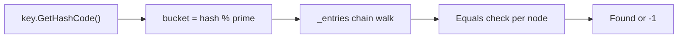

# 6. Hashing — HashMap and HashSet

> **TL;DR:** Hash tables give O(1) average lookup by trading space for time; understanding collision resolution and C# `Dictionary` internals separates senior engineers from junior ones.

**Interview weight:** P1 — Two-sum family and frequency-counting patterns are in nearly every interview. `GetHashCode`/`Equals` contract is a C# senior-specific probe.

---

## Core Concepts

- **Hash function** — maps key to bucket index. Good properties: uniform distribution, deterministic, fast to compute, avalanche effect (small key change → large hash change).
- **Collision** — two distinct keys map to the same bucket. Unavoidable by pigeonhole; must be resolved.
- **Load factor (α)** — `count / capacity`. As α → 1, collision probability rises; C# `Dictionary` resizes (doubles) when α exceeds ~0.72 (prime bucket count keeps distribution uniform).
- **Chaining** — each bucket is a linked list of colliding entries. O(1+α) average lookup; O(n) worst.
- **Open addressing** — on collision, probe for next empty slot. Probing strategies: linear, quadratic, double hashing.

---

## Collision Resolution Comparison

| Strategy | Lookup avg | Lookup worst | Cache friendliness | Delete complexity |
| -------- | ---------- | ------------ | ------------------ | ----------------- |
| Chaining | O(1+α) | O(n) | Poor (pointer chase) | Easy (remove from list) |
| Linear probing | O(1/(1-α)) | O(n) | Excellent (sequential) | Needs tombstone |
| Quadratic probing | O(1/(1-α)) | O(n) | Medium | Needs tombstone |
| Robin Hood hashing | O(1) avg | O(log n) expected | Good | Complex (backward shift) |

**Robin Hood** — on collision, steal slot from the richer entry (smaller probe distance) for the poorer (larger probe distance). Evens out probe sequences; used in Rust's `HashMap`.

---

## C# `Dictionary<K,V>` Internals

`Dictionary<K,V>` uses **chaining with open-addressing-style arrays** (not pointer-linked lists):

- `int[] _buckets` — length = prime ≥ capacity; stores index into `_entries` of the head of a chain.
- `Entry[] _entries` — struct array; each `Entry` = `{ hashCode, next (chain index), key, value }`.
- On `Add(key, val)`: compute `hash = key.GetHashCode()`, bucket = `hash % _buckets.Length`; walk chain to detect duplicate; prepend new entry to chain.
- On resize: double to next prime; rehash all entries.
- `GetHashCode` is called once per operation; `Equals` is called for each chain element with matching `hashCode`.



---

## `GetHashCode` / `Equals` Contract

**Contract (must satisfy both or `Dictionary` breaks):**
1. If `a.Equals(b)` then `a.GetHashCode() == b.GetHashCode()`.
2. `GetHashCode()` must be stable during the object's lifetime as a dictionary key — do NOT use mutable fields.
3. `Equals` must be reflexive, symmetric, transitive, consistent.

**Why mutable keys break dictionaries:**
When a key's hash changes after insertion, the lookup bucket index changes — the entry is "lost" (it's in bucket `oldHash % size` but lookups probe `newHash % size`).

```csharp
// Good immutable value-based key
public sealed class Point
{
    public int X { get; }
    public int Y { get; }
    public Point(int x, int y) { X = x; Y = y; }
    public override bool Equals(object obj) => obj is Point p && p.X == X && p.Y == Y;
    public override int  GetHashCode() => HashCode.Combine(X, Y);
}
```

---

## HashSet

`HashSet<T>` is a `Dictionary<T, bool>` without the value. Same O(1) avg ops: `Add`, `Remove`, `Contains`.

```csharp
var set = new HashSet<int>();
set.Add(1); set.Add(2); set.Add(1); // set = {1, 2}
set.Contains(2); // true — O(1)
set.ExceptWith(other);     // A \ B
set.IntersectWith(other);  // A ∩ B
set.UnionWith(other);      // A ∪ B
```

---

## Frequency Counting Patterns

```csharp
// Count frequencies
var freq = new Dictionary<int, int>();
foreach (int x in nums)
    freq[x] = freq.GetValueOrDefault(x) + 1;

// Top-k most frequent (use min-heap of size k)
var pq = new PriorityQueue<int, int>();
foreach (var (val, cnt) in freq)
{
    pq.Enqueue(val, cnt);
    if (pq.Count > k) pq.Dequeue(); // evict least frequent
}
// LeetCode 347 — Top K Frequent Elements
```

---

## Two-Sum Family

```csharp
// Two Sum (LeetCode 1) — O(n) time, O(n) space
int[] TwoSum(int[] nums, int target)
{
    var map = new Dictionary<int, int>(); // value → index
    for (int i = 0; i < nums.Length; i++)
    {
        int complement = target - nums[i];
        if (map.TryGetValue(complement, out int j)) return [j, i];
        map[nums[i]] = i;
    }
    return [];
}

// Four Sum Count (LeetCode 454) — O(n²)
int FourSumCount(int[] A, int[] B, int[] C, int[] D)
{
    var map = new Dictionary<int, int>();
    foreach (int a in A) foreach (int b in B)
        map[a + b] = map.GetValueOrDefault(a + b) + 1;
    int count = 0;
    foreach (int c in C) foreach (int d in D)
        count += map.GetValueOrDefault(-(c + d));
    return count;
}
```

---

## Group Anagrams

```csharp
// LeetCode 49 — O(n * k log k) where k = max word length
IList<IList<string>> GroupAnagrams(string[] strs)
{
    var map = new Dictionary<string, List<string>>();
    foreach (var s in strs)
    {
        var key = string.Concat(s.OrderBy(c => c)); // sorted chars as key
        if (!map.ContainsKey(key)) map[key] = new List<string>();
        map[key].Add(s);
    }
    return new List<IList<string>>(map.Values);
}
// Alternative key: 26-char frequency string — avoids sort, O(n*k)
```

---

## Subarray Sum Equals K (Prefix Sum + HashMap)

```csharp
// LeetCode 560 — O(n) time, O(n) space
int SubarraySum(int[] nums, int k)
{
    var prefixCount = new Dictionary<int, int> { [0] = 1 };
    int sum = 0, count = 0;
    foreach (int x in nums)
    {
        sum += x;
        count += prefixCount.GetValueOrDefault(sum - k);
        prefixCount[sum] = prefixCount.GetValueOrDefault(sum) + 1;
    }
    return count;
}
// Key insight: subarray[i+1..j] sums to k iff prefix[j] - prefix[i] = k
//              iff prefix[i] = prefix[j] - k was seen before.
```

**Canonical problems:**
- LeetCode 1 — Two Sum
- LeetCode 49 — Group Anagrams
- LeetCode 347 — Top K Frequent Elements
- LeetCode 560 — Subarray Sum Equals K
- LeetCode 128 — Longest Consecutive Sequence (O(n) with HashSet)
- LeetCode 454 — 4Sum II

---

## Longest Consecutive Sequence

```csharp
// LeetCode 128 — O(n) with HashSet
int LongestConsecutive(int[] nums)
{
    var set = new HashSet<int>(nums);
    int best = 0;
    foreach (int n in set)
    {
        if (set.Contains(n - 1)) continue; // only start from sequence beginning
        int len = 1;
        while (set.Contains(n + len)) len++;
        best = Math.Max(best, len);
    }
    return best;
}
```

---

## Consistent Hashing (Pointer)

Consistent hashing distributes keys across nodes so that when a node is added/removed, only `n/k` keys need remapping (not all). Uses a virtual ring of hash slots. Each physical node owns multiple virtual nodes for even distribution.
See [System Design — Consistent Hashing](../05-System-Design-HLD/08-Consistent-Hashing-Sharding-and-Rate-Limiting.md) for full treatment.

---

## Designing a Good `GetHashCode`

```csharp
// Combine multiple fields: use HashCode.Combine (crypto-quality mixing)
public override int GetHashCode()
    => HashCode.Combine(Field1, Field2, Field3);

// For collections as keys (rare — prefer value-type wrappers):
public override int GetHashCode()
{
    var hash = new HashCode();
    foreach (var item in _items) hash.Add(item);
    return hash.ToHashCode();
}
// Never use: XOR alone (commutative → {1,2} same hash as {2,1})
// Never use: mutable fields
// C# randomises seed per-process (ASLR) — HashCode.Combine is not stable across processes.
```

---

## Comparison — HashMap vs HashSet vs SortedDictionary

| Aspect | `Dictionary<K,V>` | `HashSet<T>` | `SortedDictionary<K,V>` |
| ------ | ----------------- | ------------ | ----------------------- |
| Underlying structure | Hash table (chaining) | Hash table | Red-Black tree |
| Lookup | O(1) avg | O(1) avg | O(log n) |
| In-order iteration | No | No | Yes (sorted by key) |
| Memory | Lower | Lowest | Higher (tree nodes) |
| Requires `IComparable` | No | No | Yes |
| Collision impact | Degrades to O(n) | Degrades to O(n) | None |

---

## Trade-offs & When to Use

- `Dictionary`: default for key-value lookup. Fine for 99% of use cases.
- `HashSet`: membership tests, set operations (union/intersect/except).
- `SortedDictionary`: need ordered iteration or range queries. O(log n) but no collision issue.
- Frequency array (`int[26]`): when key space is small and known (ASCII chars) — 10x faster than dictionary, zero GC pressure.

---

## Common Pitfalls

- **Mutable key**: modifying a key after insertion loses the entry.
- **Missing `Equals` override**: two objects with same semantic value but different references hash to same bucket, but `Equals` (reference equality by default) returns false → duplicate entries.
- **`GetValueOrDefault` vs `TryGetValue`**: `GetValueOrDefault` allocates nothing and returns `default` on miss; prefer in hot loops.
- **Concurrent access**: `Dictionary` is not thread-safe. Use `ConcurrentDictionary` or `lock` for multi-threaded code.
- **Dictionary as a key**: `Dictionary` doesn't override `GetHashCode` — uses reference equality. Never use a mutable dictionary as a dictionary key.

---

## Interview Questions

**Q1. What is load factor and why does it matter?**
A: `α = count / capacity`. Higher α means more collisions, degrading average lookup from O(1) toward O(n). C# `Dictionary` resizes (doubles capacity to next prime) when α exceeds ~0.72. After resize: rehash all entries — O(n) but infrequent; amortized O(1) per insert.

**Q2. Explain chaining vs linear probing — trade-offs.**
A: Chaining: simple, handles α > 1, poor cache locality (linked list pointer chase). Linear probing: excellent cache performance (sequential memory), but clustering degrades lookup for α > 0.7; requires tombstone markers for deletes.

**Q3. Why must `GetHashCode` be consistent with `Equals` in C#?**
A: Dictionary uses `GetHashCode` to find the bucket, then `Equals` to confirm the match. If two objects are `Equals` but have different hashes, they land in different buckets — `ContainsKey` returns false incorrectly. This breaks the collection's correctness contract.

**Q4. How does the "subarray sum equals K" problem use prefix sums and a hash map?**
A: Running prefix sum `S[j]`. Subarray `[i+1..j]` sums to K iff `S[j] - S[i] == K` iff `S[i] == S[j] - K`. Before processing index `j`, look up `(S[j] - K)` in the map of previously-seen prefix sums. O(n) time, O(n) space.

**Q5. How do you find the longest consecutive sequence in O(n)?**
A: Load all values into a HashSet. For each value, only start counting if `val-1` is not in the set (so you start from the smallest in each sequence). Walk forward while `val+len` is in the set. O(n) total — each element visited at most twice.

**Q6. What makes Robin Hood hashing better than basic linear probing?**
A: Robin Hood steal from "rich" entries (short probe distances) to limit maximum probe distance. Lookups can abort early when the current slot's probe distance is less than the searched key's probe distance — the key can't be further along. Reduces worst-case probe sequence length from O(n) to O(log n) expected.

**Q7. How would you implement a `FrequencyMap<T>` that is thread-safe in C#?**
A: Use `ConcurrentDictionary<T, int>`. Increment with `AddOrUpdate(key, 1, (k, old) => old + 1)` which is atomic. For bulk reads use snapshot (`ToArray()`). For extremely high throughput, use `Interlocked.Increment` on striped counters and reduce contention by sharding keys.

**Q8. Group anagrams — what is the most efficient key?**
A: 26-character frequency string (one char per letter count) — O(k) to build vs O(k log k) for sorted-char key. For Unicode keys, use a sorted char array and `string(chars)`. The frequency approach avoids sort entirely.

**Q9. How does `HashCode.Combine` differ from XOR-based hashing?**
A: XOR is commutative: `Combine(1,2) == Combine(2,1)` with XOR, producing identical hashes for `(1,2)` and `(2,1)` → many collisions for ordered-pair keys. `HashCode.Combine` uses a non-commutative mixing function (Marvin32 in .NET) that gives different results for different orderings.

**Q10. (Senior) You see a `Dictionary<T,V>` where `T` is a user-defined class. What questions do you ask?**
A: (1) Does `T` override `GetHashCode` and `Equals`? If not, reference equality is used — likely wrong. (2) Is `T` immutable? Mutable keys corrupt the dictionary. (3) Is distribution uniform? Poor `GetHashCode` causes clustering. (4) Is the dictionary accessed from multiple threads? If so, need `ConcurrentDictionary` or synchronisation.

**Q11. (Senior) Explain consistent hashing and why it matters for distributed caches.**
A: Hash nodes and keys onto a ring `[0, 2³²)`. Key → nearest clockwise node. On node addition/removal, only keys between the removed node and its predecessor need remapping (~n/k keys instead of all n). Virtual nodes (each physical node mapped to multiple ring positions) ensure even load distribution. Used in Redis Cluster, Amazon DynamoDB, Cassandra. See [System Design Building Blocks](../05-System-Design-HLD/08-Consistent-Hashing-Sharding-and-Rate-Limiting.md).

**Q12. (Senior) `Dictionary<int, List<int>>` — adding to an inner list while iterating the outer dictionary. Is this safe?**
A: Iterating the outer `Dictionary` while **modifying the outer dictionary** (adding/removing keys) throws `InvalidOperationException`. Modifying only the **inner `List<int>` values** (not the dictionary structure) is safe during iteration. If you must add/remove dictionary keys during iteration, iterate over a snapshot: `foreach (var key in dict.Keys.ToList())`.

---

## Quick Recap

- Load factor α: resize when α > 0.72 in C# Dictionary. Amortized O(1) insert.
- Chaining: linked lists per bucket, poor cache. Linear probing: cache-friendly, clustering.
- C# `Dictionary`: `_buckets` (prime-length) + `_entries` struct array.
- `GetHashCode`/`Equals` contract: equal objects must have equal hashes; never use mutable fields.
- Prefix sum + hashmap: subarray sum = K in O(n) — store `count[prefixSum]`.
- Group anagrams: 26-freq string key — O(k) vs O(k log k) sorted key.
- Thread safety: `ConcurrentDictionary` for concurrent access; `Dictionary` is not thread-safe.
- Consistent hashing: O(log n) key→node lookup on ring; ~n/k remapping on node change.
