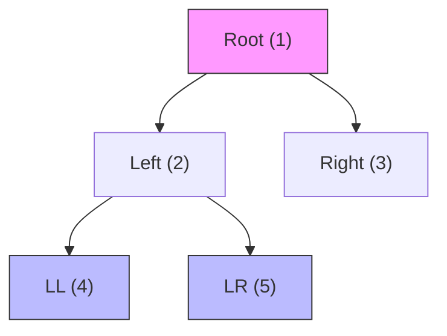
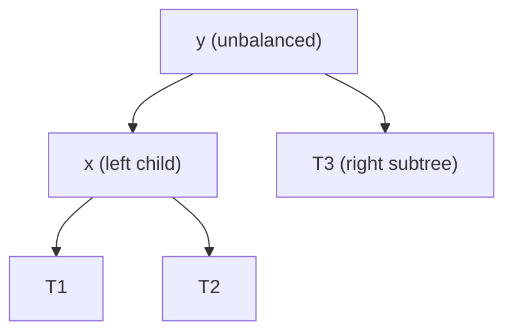

# 7. Trees and BST

> **TL;DR:** Master all traversal forms iteratively (not just recursively), LCA, and BST correctness proofs. B-Trees in database indexes and tree DP on paths are senior-level signals.

**Interview weight:** P1 — Tree traversals and LCA appear in almost every interview loop. Serialisation, BST validation, and balanced-tree theory are common follow-ups.

---

## Core Concepts

- **Binary tree** — each node has at most 2 children. No ordering constraint.
- **BST** — left subtree values < node < right subtree values (strict). Supports O(h) search/insert/delete.
- **Balanced BST** — height h = O(log n). Guarantees O(log n) operations. AVL and Red-Black are the canonical balanced BSTs.
- **Complete binary tree** — all levels full except possibly the last, which is filled left-to-right. Heap property lives here.
- **Height vs depth** — height of a node = longest downward path to a leaf. Depth = distance from root.

```csharp
public class TreeNode
{
    public int Val;
    public TreeNode Left, Right;
    public TreeNode(int val = 0, TreeNode left = null, TreeNode right = null)
    { Val = val; Left = left; Right = right; }
}
```

---

## Traversals

### Recursive (trivial — know the iterative versions)

```csharp
void Inorder(TreeNode root, IList<int> res)
{
    if (root == null) return;
    Inorder(root.Left, res);
    res.Add(root.Val);
    Inorder(root.Right, res);
}
```

### Iterative Inorder (BST sorted output)

```csharp
IList<int> InorderIterative(TreeNode root)
{
    var res = new List<int>();
    var stack = new Stack<TreeNode>();
    var cur = root;
    while (cur != null || stack.Count > 0)
    {
        while (cur != null) { stack.Push(cur); cur = cur.Left; }
        cur = stack.Pop();
        res.Add(cur.Val);
        cur = cur.Right;
    }
    return res;
}
```

### Iterative Preorder

```csharp
IList<int> PreorderIterative(TreeNode root)
{
    var res = new List<int>();
    if (root == null) return res;
    var stack = new Stack<TreeNode>();
    stack.Push(root);
    while (stack.Count > 0)
    {
        var node = stack.Pop();
        res.Add(node.Val);
        if (node.Right != null) stack.Push(node.Right); // right first (LIFO)
        if (node.Left  != null) stack.Push(node.Left);
    }
    return res;
}
```

### Iterative Postorder (reverse of modified preorder)

Push root; push left before right (opposite of preorder); reverse result. Or use two stacks.

### Morris Inorder Traversal (O(1) space, O(n) time)

Threads the tree temporarily: find in-order predecessor, set its right pointer to current, then unwind. No stack needed. Use only when O(1) space is hard-required.

---

## Level Order / BFS

```csharp
IList<IList<int>> LevelOrder(TreeNode root)
{
    var res = new List<IList<int>>();
    if (root == null) return res;
    var q = new Queue<TreeNode>();
    q.Enqueue(root);
    while (q.Count > 0)
    {
        int size = q.Count;
        var level = new List<int>();
        for (int i = 0; i < size; i++)
        {
            var node = q.Dequeue();
            level.Add(node.Val);
            if (node.Left  != null) q.Enqueue(node.Left);
            if (node.Right != null) q.Enqueue(node.Right);
        }
        res.Add(level);
    }
    return res;
}
// Zigzag variant: reverse every other level (use a flag + level.Reverse())
```

---

## Traversal Order Diagram



**Preorder:** 1→2→4→5→3 | **Inorder:** 4→2→5→1→3 | **Postorder:** 4→5→2→3→1 | **Level:** 1→2→3→4→5

---

## Views

- **Left view** — first node at each level (BFS; take `q.Peek()` before inner loop, or first node per level).
- **Right view** — last node at each level (LeetCode 199).
- **Top view** — leftmost and rightmost visible from top; use BFS with horizontal distance tracking.
- **Bottom view** — same as top view but take last node at each horizontal distance.

---

## Height, Diameter, Balance Check

```csharp
// Height — O(n)
int Height(TreeNode root) =>
    root == null ? 0 : 1 + Math.Max(Height(root.Left), Height(root.Right));

// Diameter (longest path through any node) — LeetCode 543
int _diameter = 0;
int DiameterDFS(TreeNode root)
{
    if (root == null) return 0;
    int l = DiameterDFS(root.Left), r = DiameterDFS(root.Right);
    _diameter = Math.Max(_diameter, l + r);
    return 1 + Math.Max(l, r);
}

// Is balanced — O(n) — return -1 as sentinel for unbalanced
int CheckBalance(TreeNode root)
{
    if (root == null) return 0;
    int l = CheckBalance(root.Left);  if (l == -1) return -1;
    int r = CheckBalance(root.Right); if (r == -1) return -1;
    return Math.Abs(l - r) > 1 ? -1 : 1 + Math.Max(l, r);
}
bool IsBalanced(TreeNode root) => CheckBalance(root) != -1;
```

---

## LCA — Lowest Common Ancestor

```csharp
// Binary Tree (LeetCode 236) — O(n)
TreeNode LCA(TreeNode root, TreeNode p, TreeNode q)
{
    if (root == null || root == p || root == q) return root;
    var left  = LCA(root.Left,  p, q);
    var right = LCA(root.Right, p, q);
    if (left != null && right != null) return root; // p and q in different subtrees
    return left ?? right;
}

// BST LCA (LeetCode 235) — O(h) — exploit ordering
TreeNode LCABST(TreeNode root, TreeNode p, TreeNode q)
{
    while (root != null)
    {
        if (p.Val < root.Val && q.Val < root.Val) root = root.Left;
        else if (p.Val > root.Val && q.Val > root.Val) root = root.Right;
        else return root; // split point = LCA
    }
    return null;
}
```

---

## Path Sum Family

```csharp
// All root-to-leaf paths summing to target — LeetCode 113
void PathSumDFS(TreeNode node, int remain, List<int> path, IList<IList<int>> res)
{
    if (node == null) return;
    path.Add(node.Val);
    if (node.Left == null && node.Right == null && remain == node.Val)
        res.Add(new List<int>(path));
    PathSumDFS(node.Left,  remain - node.Val, path, res);
    PathSumDFS(node.Right, remain - node.Val, path, res);
    path.RemoveAt(path.Count - 1); // backtrack
}

// Max path sum through any nodes — LeetCode 124 — tree DP
int _maxPath = int.MinValue;
int MaxGain(TreeNode node)
{
    if (node == null) return 0;
    int l = Math.Max(0, MaxGain(node.Left));   // ignore negative branches
    int r = Math.Max(0, MaxGain(node.Right));
    _maxPath = Math.Max(_maxPath, node.Val + l + r);
    return node.Val + Math.Max(l, r);           // return single-branch gain
}
```

---

## Serialize / Deserialize Binary Tree (LeetCode 297)

```csharp
string Serialize(TreeNode root)
{
    var sb = new StringBuilder();
    void Dfs(TreeNode n) {
        if (n == null) { sb.Append("null,"); return; }
        sb.Append(n.Val).Append(',');
        Dfs(n.Left); Dfs(n.Right);
    }
    Dfs(root);
    return sb.ToString();
}

TreeNode Deserialize(string data)
{
    var q = new Queue<string>(data.Split(','));
    TreeNode Build() {
        var val = q.Dequeue();
        if (val == "null") return null;
        return new TreeNode(int.Parse(val), Build(), Build());
    }
    return Build();
}
// Preorder serialization uniquely encodes a binary tree (null markers included).
```

---

## Validate BST

```csharp
bool IsValidBST(TreeNode root, long min = long.MinValue, long max = long.MaxValue)
{
    if (root == null) return true;
    if (root.Val <= min || root.Val >= max) return false;
    return IsValidBST(root.Left, min, root.Val)
        && IsValidBST(root.Right, root.Val, max);
}
// Pass min/max bounds down recursion; use long to handle int.MinValue/MaxValue edge cases.
```

---

## BST Insert / Delete / Successor

```csharp
TreeNode Insert(TreeNode root, int val)
{
    if (root == null) return new TreeNode(val);
    if (val < root.Val) root.Left  = Insert(root.Left,  val);
    else if (val > root.Val) root.Right = Insert(root.Right, val);
    return root;
}

TreeNode Delete(TreeNode root, int key)
{
    if (root == null) return null;
    if (key < root.Val) { root.Left  = Delete(root.Left,  key); }
    else if (key > root.Val) { root.Right = Delete(root.Right, key); }
    else
    {
        if (root.Left == null)  return root.Right;
        if (root.Right == null) return root.Left;
        // Two children: replace with inorder successor (leftmost of right subtree)
        var succ = root.Right;
        while (succ.Left != null) succ = succ.Left;
        root.Val = succ.Val;
        root.Right = Delete(root.Right, succ.Val);
    }
    return root;
}
```

**Kth Smallest in BST (LeetCode 230):** Iterative inorder; stop at kth node. O(h + k).

---

## BST Rotation Diagram (AVL right rotation)



**After right rotation on y:** x becomes root; x.right = y; y.left = T2.

---

## AVL vs Red-Black vs B-Tree

| Aspect | AVL | Red-Black | B-Tree |
| ------ | --- | --------- | ------ |
| Balance condition | Height diff ≤ 1 | Approx height ≤ 2×min | All leaves same depth |
| Lookup | O(log n) | O(log n) | O(log_t n) |
| Insert/delete rotations | More (strictly balanced) | Fewer (2-3 rotations max) | Split/merge nodes |
| Read-heavy | Better (lower height) | OK | Excellent (high fanout) |
| Write-heavy | OK | Better | Excellent (sequential I/O) |
| Disk/block storage | Poor (small nodes) | Poor | Designed for it |
| Use case | In-memory sorted maps | JVM `TreeMap`, Linux scheduler (CFS) | DB indexes, file systems |

**B-Tree in databases:** Node = disk block (~16 KB). High fanout (hundreds of children) keeps height ≤ 3-4 for millions of rows → 3-4 disk reads per lookup. B+ Tree (leaves contain all values + are linked) is the standard for SQL indexes.
See [Indexing and Query Optimization](../04-Databases/02-Indexing-and-Query-Optimization.md).

---

## Tree DP Pattern

Any problem whose answer at a node depends on children answers is tree DP:
1. Define `f(node)` = what you return from each subtree.
2. At each node: compute from children, update global answer, return single value upward.
3. LeetCode 124 (Max Path Sum), 543 (Diameter), 337 (House Robber III), 968 (Binary Tree Cameras).

---

## Comparison — Tree Problem → Traversal Choice

| Problem type | Best traversal |
| ------------ | -------------- |
| Level-order / BFS queries | BFS (queue) |
| Path from root to leaf | DFS preorder |
| BST sorted output | DFS inorder |
| Bottom-up aggregation (height, diameter) | DFS postorder |
| Shortest path | BFS |
| Serialize uniquely | Preorder with null markers |

---

## Trade-offs & When to Use

- AVL: prefer when reads dominate (lower height). Red-Black: prefer when writes dominate (fewer rotations). C# `SortedDictionary` uses Red-Black internally.
- Morris traversal: academic/low-memory embedded; modifies tree temporarily — risky in concurrent code.
- Iterative traversal: always prefer over recursive for n > 10⁴ (avoids stack overflow).

---

## Common Pitfalls

- Validate BST: passing value bounds, not left/right nodes — handles entire subtree, not just immediate children.
- LCA: base case `if root == p || root == q return root` — works even if one is ancestor of the other.
- Kth smallest: off-by-one on counter. Use a ref/closure variable, not a local that gets copied.
- Delete node: two-children case — copy successor value, then delete successor from right subtree (recursive call with successor's value).
- Height of null = 0, height of leaf = 1 (some problems use 0-indexed height — clarify).

---

## Interview Questions

**Q1. What is the difference between tree height and depth?**
A: Height = longest path downward from the node to a leaf (height of leaf = 0 or 1 depending on convention; clarify). Depth = distance from root to the node (root depth = 0). Height of tree = height of root.

**Q2. Why does iterative inorder traversal need a stack?**
A: Inorder requires going all the way left first, then processing, then going right. The stack saves the parent nodes while traversing left children — we need to return to the parent after exhausting the left subtree.

**Q3. How do you find the LCA of two nodes in a binary tree (not a BST)?**
A: Recursive DFS: if root is null or equals p or q, return root. Recurse left and right. If both return non-null, current root is LCA. If only one side returns non-null, propagate it up. O(n).

**Q4. How does LCA differ in a BST vs a general binary tree?**
A: BST has ordering — LCA is the first node where p and q diverge (one goes left, one goes right, or current node equals one of them). O(h) iterative without recursion. Binary tree LCA requires O(n) DFS since there's no ordering to exploit.

**Q5. How do you serialize and deserialize a binary tree uniquely?**
A: Preorder with explicit null markers. Preorder alone (without nulls) is not unique — `[1,2]` could be left or right child. With null markers, the structure is fully determined. BFS serialization is also valid (used in LeetCode's own format).

**Q6. How do you validate that a tree is a BST?**
A: Pass `(min, max)` bounds down the recursion. `root.Val` must be in `(min, max)`. Left subtree: `(min, root.Val)`. Right subtree: `(root.Val, max)`. Use `long` bounds to avoid collisions with `int.MinValue/MaxValue`.

**Q7. What is the time complexity of BST insert, delete, and search — and when does it degrade?**
A: O(h) for all three. In a balanced BST, h = O(log n). In a skewed BST (e.g., insert sorted elements), h = O(n), degrading all ops to O(n). AVL/Red-Black trees guarantee O(log n) by rebalancing.

**Q8. Explain tree DP for "Maximum Path Sum" (LeetCode 124).**
A: `MaxGain(node)` returns the max gain along a single downward branch. At each node: compute left and right gains (clamp negative to 0). Update global max with `node.Val + leftGain + rightGain`. Return `node.Val + max(leftGain, rightGain)` — only one branch per path. O(n).

**Q9. What is Morris traversal and when would you use it?**
A: Threads the tree: finds inorder predecessor of each node; links its right pointer to the current node. Unlinks during the second visit. O(n) time, O(1) space. Use only when O(1) extra space is mandatory (embedded systems). Avoid in production — temporarily modifies the tree, not thread-safe.

**Q10. (Senior) How does B-Tree differ from BST for database indexes?**
A: B-Tree nodes hold many keys (high fanout, matched to disk block size). Height stays ≤ 4 for millions of rows. BST has fanout 2 → height O(log₂ n) → hundreds of disk reads for large datasets. B+ Tree adds leaf-linking for range scans — sequential I/O instead of random. See [Indexing](../04-Databases/02-Indexing-and-Query-Optimization.md).

**Q11. (Senior) Compare AVL and Red-Black trees for a read-heavy vs write-heavy workload.**
A: AVL: strictly balanced (height diff ≤ 1) → lower height → faster reads. More rotations on insert/delete — slower writes. Red-Black: loosely balanced (height ≤ 2×log n) → more reads per query but fewer rotations → faster writes. Red-Black preferred in practice (JVM `TreeMap`, `std::map` in C++, C# `SortedDictionary`). AVL preferred in read-dominated in-memory structures.

**Q12. (Senior) How do you find the kth smallest element in a BST with a parent pointer (no extra space)?**
A: Morris inorder traversal — thread the tree temporarily, no stack. Decrement counter at each node visit; return when counter = 0. O(n) time, O(1) space. Alternatively, if nodes have subtree counts, binary search down: if `count(left) + 1 == k` return node; if `count(left) >= k` go left; else `k -= count(left) + 1` go right. O(h) with augmented tree.

**Q13. (Senior) Design "Serialize/Deserialize N-ary Tree".**
A: Preorder DFS; serialize as `val childCount child1 child2 …` recursively. Alternatively, use level-order BFS with null separators between levels. Key: encode child count per node (unlike binary tree which always has ≤ 2 well-defined positions).

---

## Quick Recap

- Iterative inorder: push all left nodes, pop, process, go right.
- Level order: BFS with level-size snapshot to separate levels.
- LCA (binary tree): recursive; return root when root == p or q; LCA = node where both sides return non-null.
- LCA (BST): walk toward split point using ordering — O(h).
- Validate BST: pass `(min, max)` bounds, not parent node values.
- Tree DP: define `f(node)` return value, update global answer at each node.
- B-Tree: high fanout → low height → few disk reads. B+ Tree: linked leaves → range scan.
- AVL: read-heavy. Red-Black: write-heavy. C# `SortedDictionary` = Red-Black.
