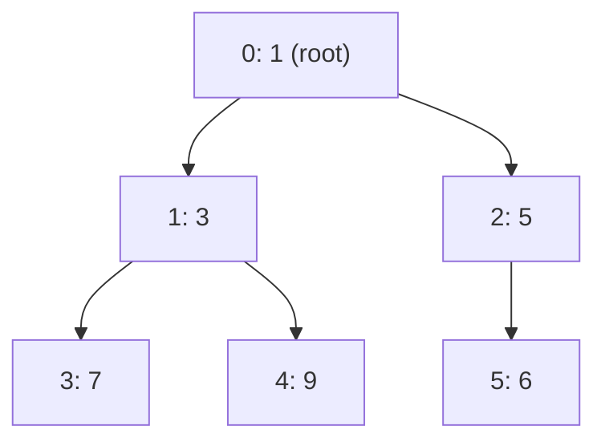

# 8. Heaps and Priority Queues

> **TL;DR:** A heap is a complete binary tree stored as an array; `PriorityQueue<TElement,TPriority>` in .NET 6+ gives you O(log n) insert/extract. Top-K, running median, and merge-K-sorted are the canonical patterns.

**Interview weight:** P1 — appears in ~40% of coding rounds; interviewers test whether you reach for a heap instinctively and know its trade-offs vs `SortedSet`.

---

## Core Concepts

- **Binary heap** — complete binary tree satisfying the heap property (min-heap: parent ≤ children; max-heap: parent ≥ children).
- **Array representation** — for 0-indexed node `i`: left = `2i+1`, right = `2i+2`, parent = `(i-1)/2`.
- **Sift-up (bubble-up)** — after insert at end, swap with parent while heap property violated. O(log n).
- **Sift-down (heapify-down)** — after extract-min (replace root with last element), swap with smaller child repeatedly. O(log n).
- **Build-heap (heapify)** — call sift-down on all internal nodes from `n/2-1` down to 0. **O(n)** — not O(n log n); the sum of heights converges to O(n).
- **Extract-min** — O(log n). **Peek** — O(1). **Decrease-key** — O(log n) with index map.
- **d-ary heap** — reduces height to log_d(n), better cache on extract when d=4; used in Dijkstra.

### O(n) Heapify — Proof Sketch
At height h there are at most ⌈n/2^(h+1)⌉ nodes, each costing O(h). Total = Σ h·n/2^(h+1) = n·Σ h/2^h = O(n) (geometric series converges to 2).

---

## Heap Array / Tree Mapping



Array: `[1, 3, 5, 7, 9, 6]` — level-order traversal.

---

## C# `PriorityQueue<TElement,TPriority>` (.NET 6+)

```csharp
// Min-heap by default (lower priority value = dequeued first)
var pq = new PriorityQueue<string, int>();
pq.Enqueue("task-A", 3);
pq.Enqueue("task-B", 1);
pq.Enqueue("task-C", 2);

while (pq.Count > 0)
{
    pq.TryDequeue(out var item, out var priority); // "task-B"(1), "task-C"(2), "task-A"(3)
    Console.WriteLine($"{item} pri={priority}");
}

// Max-heap: negate priority
pq.Enqueue("item", -score);

// Peek without removing
pq.TryPeek(out var top, out var topPri);
```

- **No `DecreaseKey`** in BCL — use lazy deletion (re-enqueue + skip stale entries).
- For max-heap: pass `Comparer<int>.Create((a,b) => b-a)` or negate priority.

---

## Top-K Pattern

**Goal:** Find K largest (or smallest) elements from a stream/array in O(n log K).

```csharp
// K largest elements — maintain a min-heap of size K
int[] TopK(int[] nums, int k)
{
    var minHeap = new PriorityQueue<int, int>();
    foreach (var n in nums)
    {
        minHeap.Enqueue(n, n);
        if (minHeap.Count > k)
            minHeap.Dequeue(); // evict the smallest
    }
    return minHeap.UnorderedItems.Select(x => x.Element).ToArray();
}
```

- **LeetCode 215: Kth Largest Element** — same pattern, return heap.Peek().
- **LeetCode 347: Top K Frequent Elements** — frequency map + min-heap on frequency.
- **LeetCode 973: K Closest Points to Origin** — max-heap on distance, size K.

---

## Two-Heaps: Running Median

Keep lower half in a **max-heap**, upper half in a **min-heap**. Balance sizes ±1.

```csharp
class MedianFinder
{
    // lower half max-heap (negate priority)
    private PriorityQueue<int, int> _lower = new();
    // upper half min-heap
    private PriorityQueue<int, int> _upper = new();

    public void AddNum(int num)
    {
        _lower.Enqueue(num, -num);          // push to lower
        // ensure lower.max <= upper.min
        _lower.TryPeek(out var lo, out _);
        _upper.TryPeek(out var hi, out _);
        if (_upper.Count > 0 && lo > hi)
        {
            _lower.Dequeue();
            _upper.Enqueue(lo, lo);
        }
        // balance sizes
        if (_lower.Count > _upper.Count + 1) { var v = _lower.Dequeue(); _upper.Enqueue(v, v); }
        if (_upper.Count > _lower.Count)     { var v = _upper.Dequeue(); _lower.Enqueue(v, -v); }
    }

    public double FindMedian()
    {
        if (_lower.Count == _upper.Count)
        {
            _lower.TryPeek(out var a, out _); _upper.TryPeek(out var b, out _);
            return (a + b) / 2.0;
        }
        _lower.TryPeek(out var m, out _);
        return m;
    }
}
```

**LeetCode 295: Find Median from Data Stream.**

---

## Merge K Sorted Lists

**LeetCode 23.** Push head of each list into min-heap keyed by node value. Extract min, advance that list's pointer.

```csharp
ListNode MergeKLists(ListNode[] lists)
{
    var heap = new PriorityQueue<ListNode, int>();
    foreach (var h in lists) if (h != null) heap.Enqueue(h, h.val);
    var dummy = new ListNode(0); var cur = dummy;
    while (heap.Count > 0)
    {
        var node = heap.Dequeue();
        cur.next = node; cur = cur.next;
        if (node.next != null) heap.Enqueue(node.next, node.next.val);
    }
    return dummy.next;
}
```

Time: O(N log K) where N = total nodes, K = number of lists.

---

## Task Scheduler (LeetCode 621)

Greedy + max-heap: always execute the most-frequent remaining task. Track cooldown with a queue.

```csharp
int LeastInterval(char[] tasks, int n)
{
    var freq = new int[26];
    foreach (var t in tasks) freq[t - 'A']++;
    var maxHeap = new PriorityQueue<int, int>(Comparer<int>.Create((a, b) => b - a));
    foreach (var f in freq) if (f > 0) maxHeap.Enqueue(f, f); // max-heap
    int time = 0;
    var cooldown = new Queue<(int freq, int available)>();
    while (maxHeap.Count > 0 || cooldown.Count > 0)
    {
        time++;
        if (maxHeap.Count > 0) { var f = maxHeap.Dequeue(); if (f - 1 > 0) cooldown.Enqueue((f - 1, time + n)); }
        if (cooldown.Count > 0 && cooldown.Peek().available == time) maxHeap.Enqueue(cooldown.Dequeue().freq, cooldown.Peek().freq); // re-enqueue
    }
    return time;
}
```

---

## Canonical Problems

| Problem | LeetCode | Pattern | Approach hint |
| ------- | -------- | ------- | -------------- |
| Kth Largest Element | 215 | Top-K | Min-heap size K; peek = answer |
| Top K Frequent | 347 | Top-K freq | Frequency map + min-heap |
| Find Median from Stream | 295 | Two-heaps | Lower max-heap + upper min-heap |
| Merge K Sorted Lists | 23 | K-way merge | Min-heap on list heads |
| Task Scheduler | 621 | Heap + cooldown | Max-heap + cooldown queue |
| Ugly Number II | 264 | Min-heap dedup | Push multiples of 2,3,5; track seen |
| K Closest Points | 973 | Top-K | Max-heap on distance, size K |
| Reorganize String | 767 | Greedy + heap | Max-heap; alternate most-frequent |

---

## Comparison

| Aspect | Binary Heap | `SortedSet<T>` / `SortedDictionary` | BST (AVL/RB) |
| ------ | ----------- | ----------------------------------- | ------------ |
| Insert | O(log n) | O(log n) | O(log n) |
| Extract-min/max | O(log n) | O(log n) | O(log n) |
| Peek min/max | **O(1)** | O(log n) | O(log n) |
| Search arbitrary | O(n) | **O(log n)** | O(log n) |
| Space | n elements | n + pointers | n + pointers |
| Duplicate keys | Allowed | `SortedDictionary` only | Depends |
| Use when | Only need min/max | Need order + arbitrary access | Ordered traversal + fast search |

---

## Trade-offs & When to Use

- Use heap when you only need the **min or max repeatedly** (Dijkstra, scheduler, top-K).
- Use `SortedSet` when you need **rank queries, predecessor/successor, or range scans**.
- Heap has better **cache locality** than BST (array-backed).
- For **static top-K** in one pass, `Array.Sort` + slice is faster and simpler.
- Heapify O(n) beats inserting one-by-one (n × log n) when building from a full dataset.

## Common Pitfalls

- Off-by-one: heap indices are 0-based in .NET; recheck parent/child formulas.
- Max-heap: negate priority or use custom comparer — don't forget to un-negate when reading.
- Lazy deletion leaves stale entries; always check if dequeued element is still valid.
- `PriorityQueue` does **not** deduplicate equal-priority items.
- Two-heap median: after add, re-peek the tops **after** re-balancing (not before).

---

## Interview Questions

**Q1. What is the time complexity of building a heap from an array?**
A: O(n). Run sift-down from the last internal node to the root; height-weighted node count sums to O(n) by geometric series, not O(n log n) as naive analysis suggests.

**Q2. Why does `PriorityQueue<T,P>` in .NET not support `DecreaseKey`?**
A: The BCL heap doesn't maintain an index map for O(1) element lookup. Workaround: lazy deletion — re-enqueue the updated item and skip the old entry when dequeued (compare against a version or expected priority).

**Q3. How would you implement a max-heap using `PriorityQueue`?**
A: Negate the integer priority on enqueue/dequeue. Alternatively pass `Comparer<int>.Create((a,b) => b.CompareTo(a))` to the constructor.

**Q4. Explain the two-heaps approach for running median.**
A: Lower half in a max-heap, upper half in a min-heap. After each insertion, ensure max(lower) ≤ min(upper) and |size(lower) - size(upper)| ≤ 1. Median is lower.Peek() or average of both tops.

**Q5. What is the difference between heap and priority queue conceptually?**
A: A priority queue is an **abstract data type** (interface: insert, extract-min). A binary heap is the **most common implementation**. Other implementations: Fibonacci heap (amortized O(1) decrease-key), binomial heap.

**Q6. How do you merge K sorted arrays efficiently?**
A: Min-heap of size K holding (value, arrayIndex, elementIndex). Extract min, advance pointer in that array, push next element. O(N log K) total. Same pattern as merge-K-sorted-lists.

**Q7. LeetCode 621 Task Scheduler — walk through your approach.**
A: Frequency count → max-heap. Each "round": pop most-frequent, execute it, schedule rest for after cooldown. Track time. Idle if heap empty but cooldown pending.

**Q8. When would you choose a Fibonacci heap over a binary heap?**
A: Fibonacci heap gives amortized O(1) `decrease-key` and O(1) insert, making Dijkstra O(E + V log V) vs O((E+V) log V). In practice, cache overhead makes it slower for typical graph sizes; used more in theory/competitive programming.

**Q9. How does Kruskal's MST algorithm use a heap?**
A: Sort edges by weight (can use min-heap for streaming input). Then greedily pick edges using Union-Find to skip cycles. Heap is only for ordering — most implementations just sort the edge array.

**Q10. What is a monotonic heap and when is it used?**
A: A heap where elements are maintained in monotonically increasing or decreasing order as you slide a window. Used in "sliding window maximum" (but typically a deque/monotonic deque is preferred over a heap for that problem due to O(1) amortized vs O(log n)).

**Q11. How would you find the Kth smallest element in a sorted matrix?**
A: Min-heap initialized with the first element of each row (or column). Extract min k-1 times, push next in that row. O(k log n). Alternative: binary search on value range O(n log(max-min)).

**Q12. What breaks if you use a heap for Dijkstra when edge weights can be negative?**
A: Heap-based Dijkstra assumes once a node is extracted, its distance is final (greedy correctness). Negative edges break this invariant — a later path could be shorter. Use Bellman-Ford for negative weights.

**Q13. How would you design a real-time leaderboard (top 10 scores) for 10M users?**
A: In-memory: sorted set (Redis ZSET) or min-heap of size 10. On score update, if new score > heap.min, replace. For persistence: Redis ZSET with O(log n) ZADD/ZRANGE. Don't store all 10M in heap — only maintain the top-K boundary.

**Q14. Explain "heapsort" and its practical disadvantages.**
A: Build max-heap O(n), then repeatedly extract-max into sorted position O(n log n). In-place, O(n log n) worst case (better than quicksort worst case). But poor cache locality (sift-down jumps around array) → in practice 2–3x slower than introsort (used by `Array.Sort`).

**Q15. What is a soft heap and where is it relevant in interviews?**
A: A soft heap allows controlled element "corruption" to achieve O(1) amortized operations; used in near-linear MST algorithms. Rarely tested in interviews but demonstrates depth when discussing MST trade-offs.

---

## Quick Recap

- Binary heap: complete tree in array; parent = `(i-1)/2`; children = `2i+1`, `2i+2`.
- Build-heap is **O(n)** not O(n log n); sift-down from last internal node upward.
- `PriorityQueue<TElement,TPriority>` — min by default; negate for max; no `DecreaseKey`.
- **Top-K largest**: min-heap size K — O(n log K).
- **Running median**: two-heaps (lower max-heap + upper min-heap), balanced sizes.
- **Merge K sorted**: min-heap of K heads — O(N log K).
- Heap wins over `SortedSet` when you only need O(1) peek at extremum.
- Lazy deletion pattern: re-enqueue updated items, skip stale on dequeue.
