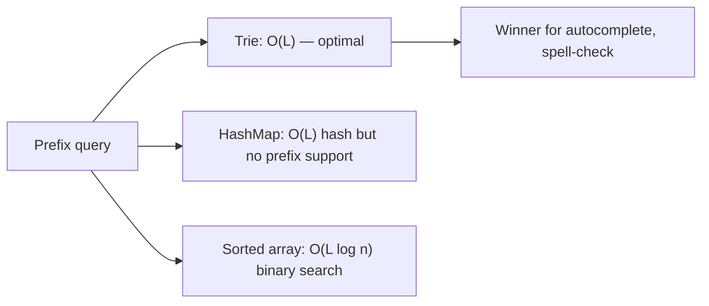

# 9. Tries and String Algorithms

> **TL;DR:** A trie gives O(L) insert/search/prefix-match (L = word length). KMP, Z-algorithm, and Rabin-Karp replace O(nm) naive search with O(n+m) or O(n) average.

**Interview weight:** P1 — trie questions appear in ~25% of coding rounds (autocomplete, word search); string matching theory is probed at senior/staff level for correctness reasoning.

---

## Core Concepts

- **Trie (prefix tree)** — each node represents one character; root = empty; path from root = prefix.
- **Radix tree / compressed trie** — merge chains of single-child nodes into one edge labeled with a substring. Reduces node count; used in routing tables and `ConcurrentDictionary` internals.
- **Suffix trie** — all suffixes of a string; enables O(m) substring search after O(n²) build. Suffix array + LCP array is the practical version.
- **Aho-Corasick** — trie + failure links (like KMP on a trie); multi-pattern search in O(n + Σ|patterns| + matches).

---

## Trie Node Design and Operations (C#)

```csharp
class TrieNode
{
    public TrieNode?[] Children = new TrieNode[26];
    public bool IsEnd;
}

class Trie
{
    private readonly TrieNode _root = new();

    public void Insert(string word)
    {
        var cur = _root;
        foreach (var c in word)
        {
            int i = c - 'a';
            cur.Children[i] ??= new TrieNode();
            cur = cur.Children[i]!;
        }
        cur.IsEnd = true;
    }

    public bool Search(string word)
    {
        var node = Find(word);
        return node?.IsEnd == true;
    }

    public bool StartsWith(string prefix)
    {
        return Find(prefix) != null;
    }

    private TrieNode? Find(string s)
    {
        var cur = _root;
        foreach (var c in s)
        {
            cur = cur.Children[c - 'a'];
            if (cur == null) return null;
        }
        return cur;
    }
}
```

- Time: O(L) insert, search, prefix. Space: O(ALPHABET × nodes) — 26 per node worst case.
- For unicode/large alphabets, use `Dictionary<char, TrieNode>` instead of fixed array.

---

## Autocomplete (LeetCode 1268)

Trie + DFS from prefix node to collect all words with that prefix. Limit to top-3 lexicographically by sorting at insert time or using a bounded heap during DFS.

## Word Search II (LeetCode 212)

Build trie from word list. DFS on grid; traverse trie in parallel. Prune when trie node is null. Mark `IsEnd` null after finding to avoid duplicates.

---

## KMP — Knuth-Morris-Pratt

**Goal:** Find all occurrences of pattern `p` in text `t` in O(n + m), no backtracking.

### LPS (Longest Proper Prefix which is also Suffix) Array

```
p = "ABABC"
lps[0]=0  (A)
lps[1]=0  (AB — no proper prefix=suffix)
lps[2]=1  (ABA — "A" is lps)
lps[3]=2  (ABAB — "AB" is lps)
lps[4]=0  (ABABC — no match)
```

```csharp
int[] BuildLPS(string p)
{
    int m = p.Length;
    var lps = new int[m];
    int len = 0, i = 1;
    while (i < m)
    {
        if (p[i] == p[len]) { lps[i++] = ++len; }
        else if (len > 0)   { len = lps[len - 1]; } // fall back, don't advance i
        else                { lps[i++] = 0; }
    }
    return lps;
}

List<int> KMPSearch(string text, string pattern)
{
    var lps = BuildLPS(pattern);
    var result = new List<int>();
    int i = 0, j = 0;
    while (i < text.Length)
    {
        if (text[i] == pattern[j]) { i++; j++; }
        if (j == pattern.Length)   { result.Add(i - j); j = lps[j - 1]; }
        else if (i < text.Length && text[i] != pattern[j])
            j = j > 0 ? lps[j - 1] : 0; // fall back or advance i
        if (j == 0 && (i >= text.Length || text[i] != pattern[0])) i++;
    }
    return result;
}
```

**LPS construction:** O(m). **Search:** O(n). Total: O(n + m). No extra space beyond lps array.

---

## Z-Algorithm

`Z[i]` = length of longest substring starting at `i` that is also a prefix of the string.

```csharp
int[] ZArray(string s)
{
    int n = s.Length;
    var z = new int[n];
    int l = 0, r = 0;
    for (int i = 1; i < n; i++)
    {
        if (i < r) z[i] = Math.Min(r - i, z[i - l]);
        while (i + z[i] < n && s[z[i]] == s[i + z[i]]) z[i]++;
        if (i + z[i] > r) { l = i; r = i + z[i]; }
    }
    return z;
}
// Pattern search: concat pattern + '$' + text; any Z[i] == pattern.Length is a match.
```

O(n) time. Useful for: "find pattern in text", "count distinct substrings".

---

## Rabin-Karp Rolling Hash

```csharp
bool RabinKarp(string text, string pattern)
{
    const int Base = 31, Mod = 1_000_000_007;
    int m = pattern.Length, n = text.Length;
    if (m > n) return false;
    long ph = 0, th = 0, power = 1;
    for (int i = 0; i < m - 1; i++) power = power * Base % Mod;
    for (int i = 0; i < m; i++)
    {
        ph = (ph * Base + pattern[i]) % Mod;
        th = (th * Base + text[i]) % Mod;
    }
    for (int i = 0; i <= n - m; i++)
    {
        if (ph == th && text.Substring(i, m) == pattern) return true; // verify on hash match
        if (i < n - m)
            th = (th - text[i] * power % Mod + Mod) * Base % Mod + text[i + m];
        th %= Mod;
    }
    return false;
}
```

- O(n+m) average, O(nm) worst (hash collisions). Best for **multi-pattern** search or **duplicate substring** problems.
- **LeetCode 1044: Longest Duplicate Substring** — binary search on length + rolling hash.

---

## Manacher's Algorithm (Conceptual)

Finds all palindromic substrings in O(n) by exploiting mirror symmetry. Transform string to `#a#b#a#` to handle even/odd uniformly. Maintains `center` and `right` boundary of the rightmost palindrome. For interviews: know it exists and its use case; implement only if specifically asked.

---

## Palindrome Patterns

- **LeetCode 5: Longest Palindromic Substring** — expand-around-center O(n²) or Manacher O(n).
- **LeetCode 647: Palindromic Substrings** — count all expansions.
- **LeetCode 131: Palindrome Partitioning** — backtracking + DP precompute `isPalin[i][j]`.
- **LeetCode 214: Shortest Palindrome** — KMP on `s + '#' + reverse(s)`.

---

## String Matching Comparison

| Algorithm | Preprocessing | Search | Space | Best for |
| --------- | ------------- | ------ | ----- | -------- |
| Naive | O(1) | O(nm) | O(1) | Short text/pattern |
| KMP | O(m) | O(n) | O(m) | Single pattern, no backtrack |
| Z-algorithm | O(n+m) | O(n+m) | O(n+m) | Prefix-based queries |
| Rabin-Karp | O(m) | O(n) avg | O(1) | Multi-pattern, rolling hash tricks |
| Aho-Corasick | O(Σ\|pi\|) | O(n + matches) | O(Σ\|pi\|·α) | Many patterns simultaneously |
| Boyer-Moore | O(m+α) | O(n/m) best | O(m+α) | Large alphabets, long patterns |

---

## Trie vs Hash Map vs Sorted Array for Prefix Search



---

## Trade-offs & When to Use

- **Trie** — prefix queries, autocomplete, spell-check, IP routing. Space-heavy for large unicode alphabets (use `Dictionary<char,Node>`).
- **KMP** — single pattern, guaranteed O(n+m), no extra hash randomness.
- **Rabin-Karp** — duplicate/repeated substrings, multiple patterns (with set of hashes).
- **Z-algorithm** — elegant for competitive programming, same complexity as KMP.
- **Aho-Corasick** — virus scanners, firewall DPI, log parsing with many keywords.
- Compressed trie (radix tree) reduces space; used in HTTP router libraries.

## Common Pitfalls

- KMP: `lps` fallback loop — don't advance `i` when falling back via `lps[len-1]`.
- Rabin-Karp: always verify character-by-character on hash match to avoid false positives.
- Trie: forgetting `IsEnd` flag causes false positives in `Search`.
- Rolling hash: use `long` and modular arithmetic; choose large prime mod to minimize collisions.
- Manacher: off-by-one in index transformation (`i/2` for original index).

---

## Interview Questions

**Q1. When would you use a trie over a hash set for storing words?**
A: When you need **prefix queries** (autocomplete, "starts-with"). Hash set gives O(L) exact lookup but cannot enumerate all words with a given prefix without scanning all keys. Trie gives O(L) prefix navigation naturally.

**Q2. Explain the LPS array in KMP and why it enables linear search.**
A: `lps[j]` is the length of the longest proper prefix of `pattern[0..j]` that is also a suffix. On mismatch at `j`, we know the pattern state can be reset to `lps[j-1]` without moving the text pointer — no character in text is re-examined.

**Q3. What is the time and space complexity of building a trie for N words of average length L?**
A: Time O(N·L), Space O(N·L·ALPHABET_SIZE) worst case (26 for lowercase). With `Dictionary` children, space is O(N·L) actual.

**Q4. How does Rabin-Karp handle hash collisions?**
A: Verify the actual substring on hash match. Collisions cause spurious hits but not missed matches (no false negatives). With a good hash/prime, expected O(1) collisions per match → O(n) expected.

**Q5. Compare KMP and Z-algorithm — when would you prefer each?**
A: Both are O(n+m). KMP processes pattern and text separately (online streaming). Z-algorithm requires concatenating pattern+text. KMP is standard in libraries; Z-array is often cleaner to implement in contests.

**Q6. How would you implement autocomplete with ranked suggestions?**
A: Trie where each node stores a min-heap (or sorted list) of top-K words by frequency. On prefix traversal, return the node's heap. Update frequencies on insert/search. Space trade-off: O(K) per node vs O(K per subtree).

**Q7. Word Search II (LeetCode 212) — why is a trie better than checking each word separately?**
A: Without trie, for each of W words run DFS = O(W·4^L). With trie, a single DFS on the grid traverses the trie in parallel; shared prefixes are explored only once → O(4^L + W·L) in practice much faster.

**Q8. How does Aho-Corasick extend KMP to multiple patterns?**
A: Build a trie of all patterns. Add failure links (computed BFS, same idea as KMP's lps). During text scan, follow character edges or failure links — never backtrack in text. Total search O(n + total match output).

**Q9. What is a suffix array and when is it preferred over a suffix trie?**
A: Suffix array stores sorted indices of all suffixes; built in O(n log n) or O(n) with space O(n). Suffix trie is O(n²) space. Suffix array + LCP array enables most suffix operations in O(n log n) with better cache behavior.

**Q10. Explain rolling hash for the "repeated DNA sequences" problem (LeetCode 187).**
A: Slide a window of length 10 over the string; use rolling hash to compute each window's hash in O(1). Store hashes in a set; collect duplicates. Need full string comparison on hash collision to be correct.

**Q11. How do you handle case-insensitive trie lookups?**
A: Normalize to lowercase (or uppercase) on insert and query. Alternatively, expand alphabet to 52 but normalization is simpler and covers unicode edge cases via `char.ToLowerInvariant`.

**Q12. What is the Z-function value of `Z[0]` and why?**
A: By convention `Z[0]` is undefined (or set to 0 or n depending on implementation). The whole string trivially matches itself as a prefix; leaving it 0 avoids confusion in pattern-matching where `Z[i] == m` signals a match.

**Q13. Design a system for efficient wildcard/glob pattern matching against millions of stored strings.**
A: Build a trie of stored strings. For wildcard query `?` and `*`, do DFS on trie with branching at wildcard positions. Prune subtrees early when prefix cannot match. For `*` (any sequence), use BFS with multiple trie positions simultaneously (similar to NFA simulation).

**Q14. What is the space overhead of storing 100K English words in a trie?**
A: Average word length ~5 chars; 100K × 5 = 500K nodes. Each node with fixed 26-child array = 26 pointers × 8 bytes = ~208 bytes/node → ~100 MB. With `Dictionary<char,Node>` children, ~10–30 bytes per actual edge → much lower in practice.

**Q15. How does Manacher's algorithm achieve O(n) for longest palindromic substring?**
A: Inserts separators (`#`) to unify odd/even lengths. Maintains the center and right boundary `(c, r)` of the rightmost palindrome found. For new position `i`, mirrors across `c` to get a lower bound, then expands only beyond `r`. Each character is "expanded past" at most once → O(n).

---

## Quick Recap

- Trie: O(L) insert/search/prefix; use `Dictionary<char,Node>` for large alphabets.
- KMP: LPS array avoids text backtracking; O(n+m) guaranteed.
- Z-algorithm: `Z[i]` = prefix-match length from `i`; concat pattern+'$'+text for search.
- Rabin-Karp: rolling hash O(n) average; always verify on hash match.
- Aho-Corasick: trie + BFS failure links; multi-pattern O(n + output).
- Manacher: O(n) all palindromes; center + right-boundary trick.
- Word Search II: grid DFS + trie, prune on null trie node.
