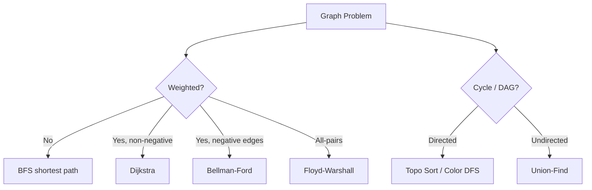
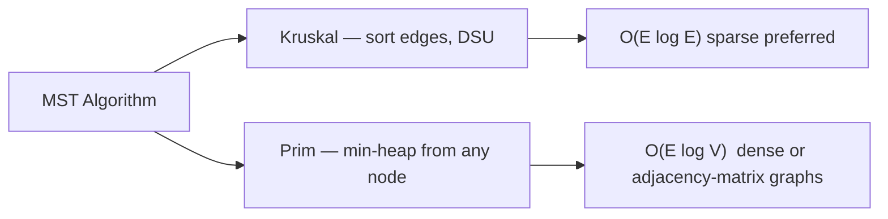

# 10. Graphs

> **TL;DR:** Master BFS/DFS templates, Dijkstra, topological sort, and Union-Find — they cover 90% of graph interview questions. Everything else is a variation.

**Interview weight:** P1 — graphs appear in ~50% of medium/hard coding rounds; senior interviewers also probe design aspects (which representation, which algorithm, why).

---

## Core Concepts

- **Directed vs undirected** — directed edges have source→destination only.
- **Weighted vs unweighted** — edge has a cost; shortest path semantics change.
- **Sparse vs dense** — sparse: E ≈ V; dense: E ≈ V². Guides representation choice.
- **DAG (Directed Acyclic Graph)** — enables topological sort; models task dependencies.
- **Connected component** — maximal subgraph where all nodes are reachable from each other (undirected) or via paths (directed → SCC).

---

## Representations

| Aspect | Adjacency List | Adjacency Matrix | Edge List |
| ------ | -------------- | ---------------- | --------- |
| Space | O(V + E) | O(V²) | O(E) |
| Add edge | O(1) | O(1) | O(1) |
| Check edge (u,v) | O(degree(u)) | **O(1)** | O(E) |
| Iterate neighbors | **O(degree)** | O(V) | O(E) |
| Best for | Sparse graphs (default) | Dense / edge-weight lookup | Simple sorting (Kruskal) |
| C# type | `Dictionary<int,List<int>>` | `int[,]` | `List<(int,int,int)>` |

---

## BFS Template

```csharp
void BFS(int start, Dictionary<int, List<int>> adj, int n)
{
    var visited = new bool[n];
    var queue = new Queue<int>();
    visited[start] = true;
    queue.Enqueue(start);
    while (queue.Count > 0)
    {
        var node = queue.Dequeue();
        foreach (var neighbor in adj[node])
        {
            if (!visited[neighbor])
            {
                visited[neighbor] = true;
                queue.Enqueue(neighbor);
            }
        }
    }
}
```

BFS explores level by level → gives **shortest path in unweighted graph**.

## DFS Template

```csharp
void DFS(int node, Dictionary<int, List<int>> adj, bool[] visited)
{
    visited[node] = true;
    foreach (var neighbor in adj[node])
        if (!visited[neighbor])
            DFS(neighbor, adj, visited);
}
```

DFS iterative: replace recursion with explicit `Stack<int>`. Push neighbors in reverse order for left-to-right traversal.

---

## Graph Overview



---

## Connected Components

```csharp
int CountComponents(int n, int[][] edges)
{
    var adj = new List<int>[n];
    for (int i = 0; i < n; i++) adj[i] = new();
    foreach (var e in edges) { adj[e[0]].Add(e[1]); adj[e[1]].Add(e[0]); }
    var visited = new bool[n];
    int count = 0;
    for (int i = 0; i < n; i++)
        if (!visited[i]) { DFS(i, adj, visited); count++; }
    return count;
}
```

---

## Cycle Detection

### Directed Graph — 3-Color DFS

```csharp
// 0=white(unvisited), 1=gray(in stack), 2=black(done)
bool HasCycleDirected(int n, List<int>[] adj)
{
    var color = new int[n];
    bool DFS(int u)
    {
        color[u] = 1;
        foreach (var v in adj[u])
        {
            if (color[v] == 1) return true;  // back edge → cycle
            if (color[v] == 0 && DFS(v)) return true;
        }
        color[u] = 2;
        return false;
    }
    for (int i = 0; i < n; i++)
        if (color[i] == 0 && DFS(i)) return true;
    return false;
}
```

### Undirected Graph — Parent Tracking / DSU

```csharp
bool HasCycleUndirected(int n, int[][] edges)
{
    var dsu = new DSU(n);
    foreach (var e in edges)
        if (!dsu.Union(e[0], e[1])) return true; // already same component
    return false;
}
```

---

## Topological Sort

### Kahn's Algorithm (BFS, in-degree)

```csharp
int[] TopologicalSort(int n, int[][] prerequisites)
{
    var adj = new List<int>[n];
    var inDegree = new int[n];
    for (int i = 0; i < n; i++) adj[i] = new();
    foreach (var p in prerequisites) { adj[p[1]].Add(p[0]); inDegree[p[0]]++; }
    var queue = new Queue<int>();
    for (int i = 0; i < n; i++) if (inDegree[i] == 0) queue.Enqueue(i);
    var order = new List<int>();
    while (queue.Count > 0)
    {
        var u = queue.Dequeue(); order.Add(u);
        foreach (var v in adj[u]) if (--inDegree[v] == 0) queue.Enqueue(v);
    }
    return order.Count == n ? order.ToArray() : Array.Empty<int>(); // cycle if incomplete
}
```

### DFS-based Topo Sort

DFS; push node to stack **after** all neighbors are processed. Reverse stack = topological order.

---

## Bipartite Check

BFS/DFS 2-coloring. If any neighbor has the same color → not bipartite. **LeetCode 785, 886.**

```csharp
bool IsBipartite(int[][] graph)
{
    int n = graph.Length;
    var color = new int[n]; // 0=unvisited, 1 or -1
    for (int i = 0; i < n; i++)
    {
        if (color[i] != 0) continue;
        var q = new Queue<int>(); q.Enqueue(i); color[i] = 1;
        while (q.Count > 0)
        {
            var u = q.Dequeue();
            foreach (var v in graph[u])
            {
                if (color[v] == 0) { color[v] = -color[u]; q.Enqueue(v); }
                else if (color[v] == color[u]) return false;
            }
        }
    }
    return true;
}
```

---

## Shortest Path Algorithms

| Algorithm | Weights | Negative | SSSP/APSP | Complexity | Notes |
| --------- | ------- | -------- | --------- | ---------- | ----- |
| BFS | Unweighted (unit) | N/A | SSSP | O(V+E) | Exact for unweighted |
| 0-1 BFS | 0 or 1 only | No | SSSP | O(V+E) | Deque; 0-cost→front, 1-cost→back |
| Dijkstra | Non-negative | No | SSSP | O((V+E) log V) | Min-heap; greedy extraction |
| Bellman-Ford | Any | **Yes** | SSSP | O(VE) | Detects negative cycles |
| Floyd-Warshall | Any | Yes (no neg cycle) | **APSP** | O(V³) | Simple DP; dense graphs |
| SPFA | Any | Yes | SSSP | O(VE) worst | Bellman-Ford + queue optimization |

### Dijkstra (C#)

```csharp
int[] Dijkstra(int src, int n, List<(int to, int w)>[] adj)
{
    var dist = new int[n]; Array.Fill(dist, int.MaxValue); dist[src] = 0;
    var pq = new PriorityQueue<int, int>(); pq.Enqueue(src, 0);
    while (pq.Count > 0)
    {
        pq.TryDequeue(out var u, out var d);
        if (d > dist[u]) continue; // stale entry
        foreach (var (v, w) in adj[u])
            if (dist[u] + w < dist[v]) { dist[v] = dist[u] + w; pq.Enqueue(v, dist[v]); }
    }
    return dist;
}
```

---

## Minimum Spanning Tree



### Kruskal

```csharp
int KruskalMST(int n, int[][] edges) // edges: [u, v, weight]
{
    Array.Sort(edges, (a, b) => a[2] - b[2]);
    var dsu = new DSU(n);
    int total = 0;
    foreach (var e in edges)
        if (dsu.Union(e[0], e[1])) total += e[2];
    return total;
}
```

---

## Union-Find (DSU) with Path Compression + Union by Rank

```csharp
class DSU
{
    private int[] _parent, _rank;
    public DSU(int n) { _parent = Enumerable.Range(0, n).ToArray(); _rank = new int[n]; }

    public int Find(int x)
    {
        if (_parent[x] != x) _parent[x] = Find(_parent[x]); // path compression
        return _parent[x];
    }

    // Returns true if union was performed (different components)
    public bool Union(int x, int y)
    {
        int rx = Find(x), ry = Find(y);
        if (rx == ry) return false;
        if (_rank[rx] < _rank[ry]) (rx, ry) = (ry, rx);
        _parent[ry] = rx;
        if (_rank[rx] == _rank[ry]) _rank[rx]++;
        return true;
    }
}
```

- `Find`: amortized O(α(n)) ≈ O(1) with both optimizations.
- Applications: connected components, cycle detection, Kruskal's MST, accounts merge.

---

## Strongly Connected Components (SCC) — Conceptual

**Kosaraju's:**
1. DFS on original graph; push nodes to stack in finish order.
2. Transpose graph (reverse all edges).
3. DFS on transposed graph in reverse finish order → each DFS tree = one SCC.
Time: O(V+E).

**Tarjan's:** Single DFS; uses `disc[]` and `low[]` arrays. Nodes on same stack with same `low` value form an SCC. O(V+E).

---

## Grid as Graph

Treat each cell `(r,c)` as node `r*cols + c`. BFS/DFS with 4 (or 8) directional neighbors.

```csharp
int[] dr = {-1,1,0,0}, dc = {0,0,-1,1};
// neighbor: (r+dr[d], c+dc[d]) for d in 0..3; check bounds
```

**Multi-source BFS:** Push all sources into queue simultaneously (level 0). Used for: distance to nearest 0 (LeetCode 542), rotting oranges (LeetCode 994), walls-and-gates.

---

## Canonical Problems

| Problem | LeetCode | Pattern | Approach |
| ------- | -------- | ------- | -------- |
| Number of Islands | 200 | Connected components | DFS/BFS flood fill |
| Course Schedule | 207 | Cycle detection (directed) | Kahn's / 3-color DFS |
| Course Schedule II | 210 | Topological sort | Kahn's; return order |
| Clone Graph | 133 | BFS + hash map | Map old→new node |
| Network Delay Time | 743 | Dijkstra SSSP | Min-heap Dijkstra |
| Cheapest Flights K Stops | 787 | Bellman-Ford variant | Relax exactly K+1 times |
| Word Ladder | 127 | BFS unweighted | Each word = node |
| Alien Dictionary | — | Topo sort on chars | Build char DAG |
| Accounts Merge | 721 | Union-Find | Union emails by account |
| Redundant Connection | 684 | Cycle detection | DSU; first union failure |
| Pacific Atlantic Water Flow | 417 | Multi-source BFS | BFS from both oceans |
| Minimum Spanning Tree | — | Kruskal / Prim | Sort edges + DSU |

---

## Trade-offs & When to Use

- **BFS** for shortest path (unweighted), level-order, nearest-neighbor.
- **DFS** for cycle detection, topo sort, SCC, backtracking-style path exploration.
- **Dijkstra** for weighted shortest path (non-negative weights); heap-based.
- **Bellman-Ford** when negative weights or detecting negative cycles.
- **Floyd-Warshall** for all-pairs shortest path on small dense graphs (V ≤ 500).
- **Union-Find** for dynamic connectivity, MST, grouping problems.
- **Topological sort** for scheduling, dependency resolution, DAG DP.

## Common Pitfalls

- Not marking visited **before** enqueueing in BFS → duplicate visits, infinite loops.
- Forgetting to handle disconnected graphs (outer loop over all nodes).
- Directed vs undirected: adding edge in both directions for undirected.
- Dijkstra with negative weights gives wrong answers silently.
- Kahn's: if result length < n, there's a cycle — return empty/null.
- DSU without path compression or union by rank is O(n) per operation worst case.

---

## Interview Questions

**Q1. BFS vs DFS — when to choose which?**
A: BFS for shortest path (unweighted), minimum steps, level-by-level processing. DFS for cycle detection, topological sort, exploring all paths, connected components, SCC. DFS uses O(depth) stack space; BFS uses O(width) queue space.

**Q2. How does 0-1 BFS work and when is it used?**
A: Uses a `Deque` instead of queue. Edges with weight 0 push neighbor to front; weight 1 push to back. Maintains invariant that deque is always sorted, giving O(V+E) Dijkstra-equivalent for 0/1 weights. Used in: minimum flips grid, min cost path with at-most-one special move.

**Q3. Why is Dijkstra incorrect with negative edge weights?**
A: Dijkstra's greedy extraction assumes the extracted node has its final shortest distance. A negative edge discovered later could provide a shorter path to an already-extracted node, violating the invariant. Bellman-Ford re-relaxes all edges V-1 times, catching this.

**Q4. Explain Union-Find with path compression and union by rank.**
A: Path compression: during `Find`, make every node on the path point directly to the root. Union by rank: always attach the shorter tree under the taller one. Together: amortized O(α(n)) ≈ O(1) per operation. Without them: O(n) worst case.

**Q5. How do you detect a cycle in a directed graph?**
A: 3-color DFS: white (unvisited), gray (in current DFS stack), black (fully processed). A back edge to a gray node = cycle. Kahn's: if topological sort yields fewer than V nodes, a cycle exists.

**Q6. What is the time complexity of Kruskal's vs Prim's MST?**
A: Kruskal: O(E log E) for sorting edges + near-O(E) DSU ops → better for sparse graphs. Prim with binary heap: O(E log V) → equivalent; with Fibonacci heap O(E + V log V). Prim is preferred for dense graphs or adjacency-matrix representation.

**Q7. Explain multi-source BFS with an example.**
A: Initialize BFS queue with all source nodes simultaneously at distance 0. BFS naturally computes the minimum distance from ANY source to every other node. Example: "Rotting Oranges" — all rotten oranges at time 0; BFS spreads infection.

**Q8. How would you find strongly connected components?**
A: Kosaraju's: two DFS passes (original + transposed graph). Tarjan's: single DFS with `disc[]`/`low[]`/stack. Both O(V+E). Tarjan's is typically implemented in one pass and avoids building the transposed graph.

**Q9. Design a real-time path-finding system for a navigation app (like Google Maps).**
A: Bidirectional Dijkstra (meet-in-the-middle, ~4x faster). Precompute contraction hierarchies for highway edges. Use A* with geographic heuristic. Segment road network by region; run Dijkstra within segments + inter-segment SSSP. Handle live traffic by updating edge weights and re-running from affected nodes.

**Q10. How does topological sort relate to dynamic programming on DAGs?**
A: Process nodes in topological order; each node's state depends only on predecessors already computed. Longest path in DAG, critical path analysis, coin change on DAG — all follow this pattern: `dp[u] = f(dp[v] for v in predecessors)`.

**Q11. What is the difference between a spanning tree and a minimum spanning tree?**
A: A spanning tree connects all V nodes with exactly V-1 edges (no cycles). An MST is a spanning tree with minimum total edge weight. There may be multiple MSTs if edges have equal weights.

**Q12. How would you find the shortest path in a maze with portals?**
A: Model portals as 0-weight edges between portal endpoints. Use 0-1 BFS (normal moves = weight 1, portals = weight 0) or Dijkstra with portal edges weighted 0. Multi-level BFS if portals are one-directional.

**Q13. Explain why Floyd-Warshall uses O(V³) time and when it's appropriate.**
A: Three nested loops: for each intermediate node k, relax all pairs (i,j) via k. V² pairs × V intermediate nodes = V³. Appropriate when V ≤ ~500 and you need all-pairs. At V=1000, 10⁹ operations is too slow.

**Q14. In a distributed system, how would you detect if a microservice dependency graph has a circular dependency?**
A: Build a directed graph of service dependencies. Run topological sort (Kahn's). If result count < number of services, there's a cycle — report the nodes with remaining in-degree > 0 as part of the cycle. Can be run as part of CI/CD configuration validation.

**Q15. What is the time complexity of BFS/DFS when the graph is given as an adjacency matrix vs adjacency list?**
A: Adjacency matrix: O(V²) — must scan entire row for each node's neighbors. Adjacency list: O(V+E). For sparse graphs (E << V²), list is dramatically faster. Matrix only justified for dense graphs or O(1) edge existence queries.

---

## Quick Recap

- Adjacency list: O(V+E) space, default choice for sparse graphs.
- BFS = shortest path unweighted; DFS = cycle, topo, SCC.
- Directed cycle: 3-color DFS (gray = in-stack). Undirected: DSU or parent-track DFS.
- Topological sort: Kahn's (BFS + in-degree) or DFS post-order.
- Dijkstra: min-heap, non-negative weights, O((V+E) log V).
- Bellman-Ford: negative weights OK, O(VE), detects negative cycles.
- DSU with path compression + union by rank: O(α(n)) ≈ O(1).
- Kruskal: sort edges + DSU → MST in O(E log E).
- Multi-source BFS: push all sources at time 0 simultaneously.
