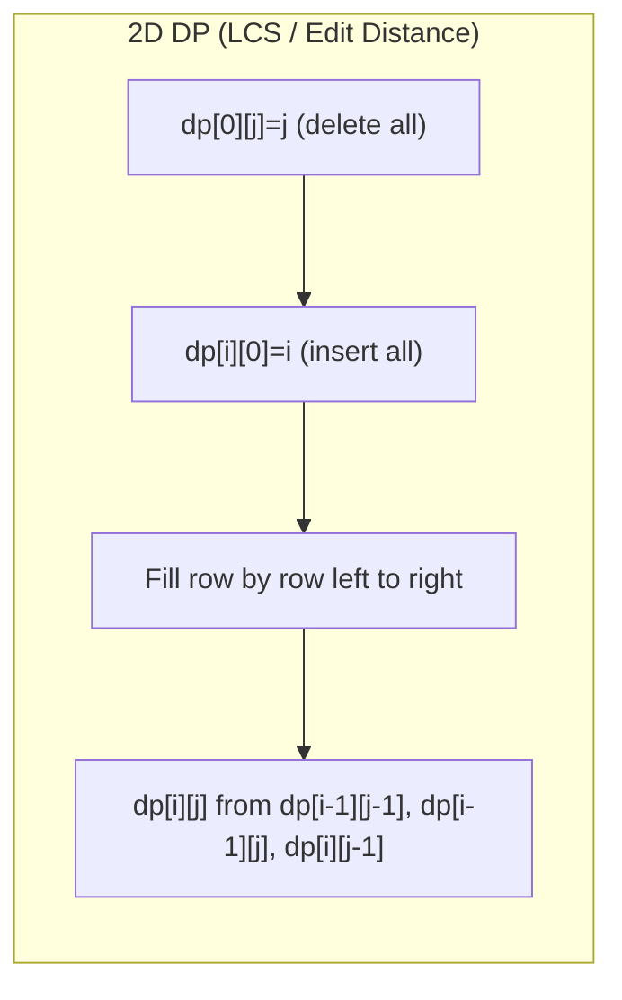

# 11. Dynamic Programming

> **TL;DR:** DP = recursion with overlapping subproblems + optimal substructure. Identify the state, write the recurrence, then mechanically convert to bottom-up tabulation. 90% of DP problems fit into 10 families.

**Interview weight:** P1 — DP is the most common "hard" topic; interviewers at senior level expect you to identify the pattern quickly and discuss state design trade-offs.

---

## Core Concepts

- **Overlapping subproblems** — same subproblem computed multiple times in naive recursion.
- **Optimal substructure** — optimal solution built from optimal solutions of subproblems.
- **State** — the minimum information needed to fully characterize a subproblem.
- **Recurrence** — how a state's value is computed from smaller states.
- **Memoization (top-down)** — recursive + `Dictionary` / array cache. Write naturally, add cache.
- **Tabulation (bottom-up)** — fill a table iteratively in dependency order. Usually faster (no call overhead, better cache).
- **Space optimization** — if current row depends only on previous row(s), drop earlier rows.

---

## Memoization vs Tabulation

| Aspect | Memoization (top-down) | Tabulation (bottom-up) |
| ------ | ---------------------- | ---------------------- |
| Code style | Recursive, natural | Iterative, explicit order |
| Space | Call stack + cache | Table only |
| Computes | Only needed states | All states in order |
| Cache | `Dictionary` or array | Array, exact size known |
| Overflow risk | Deep recursion (stack overflow) | None |
| Easier to write | When recurrence is obvious | When iteration order is clear |
| Preferred when | State space large but sparse | Dense, all states needed |

---

## Recurrence → Iterative Conversion Recipe

1. Write recursive function with clear parameters (the state).
2. Add `memo[state]` lookup and store.
3. Identify base cases and evaluation order (what must be computed first).
4. Create table of same dimensions; fill base cases.
5. Loop in correct order (often `i` from 0 or 1 to n); fill `dp[i]` from `dp[i-1]` etc.
6. Check if only last 1–2 rows/values are needed → reduce to O(1)/O(n) space.

---

## DP Table Fill Order



---

## Family 1 — 0/1 Knapsack

**State:** `dp[i][w]` = max value using first `i` items with weight limit `w`.
**Recurrence:** `dp[i][w] = max(dp[i-1][w], dp[i-1][w-wt[i]] + val[i])` if `w >= wt[i]`.

```csharp
int Knapsack(int[] weights, int[] values, int capacity)
{
    int n = weights.Length;
    var dp = new int[capacity + 1];
    for (int i = 0; i < n; i++)
        for (int w = capacity; w >= weights[i]; w--) // reverse to avoid reuse
            dp[w] = Math.Max(dp[w], dp[w - weights[i]] + values[i]);
    return dp[capacity];
}
```

Space: O(W). Time: O(nW). **LeetCode 416 (Partition Equal Subset Sum)**, **494 (Target Sum)**.

---

## Family 2 — Unbounded Knapsack / Coin Change

Items can be reused. Inner loop forward (not reversed).

```csharp
int CoinChange(int[] coins, int amount)
{
    var dp = new int[amount + 1]; Array.Fill(dp, amount + 1);
    dp[0] = 0;
    for (int a = 1; a <= amount; a++)
        foreach (var c in coins)
            if (c <= a) dp[a] = Math.Min(dp[a], dp[a - c] + 1);
    return dp[amount] > amount ? -1 : dp[amount];
}
```

**LeetCode 322 (Coin Change)**, **518 (Coin Change II — count ways)**.

---

## Family 3 — LIS (Longest Increasing Subsequence)

**O(n²):**
```csharp
int LIS_N2(int[] nums)
{
    int n = nums.Length;
    var dp = new int[n]; Array.Fill(dp, 1);
    for (int i = 1; i < n; i++)
        for (int j = 0; j < i; j++)
            if (nums[j] < nums[i]) dp[i] = Math.Max(dp[i], dp[j] + 1);
    return dp.Max();
}
```

**O(n log n) — patience sorting / binary search:**
```csharp
int LIS_NLogN(int[] nums)
{
    var tails = new List<int>();
    foreach (var x in nums)
    {
        int pos = tails.BinarySearch(x);
        if (pos < 0) pos = ~pos;
        if (pos == tails.Count) tails.Add(x);
        else tails[pos] = x;
    }
    return tails.Count;
}
```

**LeetCode 300, 354 (Russian Doll Envelopes — 2D LIS)**, **673 (Number of LIS)**.

---

## Family 4 — LCS and Edit Distance

**LCS Recurrence:** `dp[i][j] = dp[i-1][j-1]+1` if `s1[i]==s2[j]`, else `max(dp[i-1][j], dp[i][j-1])`.

**Edit Distance (LeetCode 72):**
```csharp
int EditDistance(string s, string t)
{
    int m = s.Length, n = t.Length;
    var dp = new int[m + 1, n + 1];
    for (int i = 0; i <= m; i++) dp[i, 0] = i;
    for (int j = 0; j <= n; j++) dp[0, j] = j;
    for (int i = 1; i <= m; i++)
        for (int j = 1; j <= n; j++)
            dp[i, j] = s[i-1] == t[j-1]
                ? dp[i-1, j-1]
                : 1 + Math.Min(dp[i-1, j-1], Math.Min(dp[i-1, j], dp[i, j-1]));
    return dp[m, n];
}
```

**LeetCode 1143 (LCS)**, **72 (Edit Distance)**, **583 (Delete Operations)**.

---

## Family 5 — House Robber / Linear DP

**LeetCode 198:** `dp[i] = max(dp[i-2] + nums[i], dp[i-1])`. Space O(1) with two variables.
**LeetCode 213 (Circular):** Run twice: [0..n-2] and [1..n-1], take max.
**LeetCode 337 (Tree):** DP on tree — return `(rob, skip)` pair per node.

---

## Family 6 — Grid Paths

```csharp
int UniquePaths(int m, int n)
{
    var dp = new int[n]; Array.Fill(dp, 1);
    for (int i = 1; i < m; i++)
        for (int j = 1; j < n; j++)
            dp[j] += dp[j - 1];
    return dp[n - 1];
}
```

**LeetCode 62, 63 (obstacles), 64 (min path sum), 931 (falling path).**

---

## Family 7 — Partition / Subset Sum

Subset sum = 0/1 knapsack with boolean dp.
**LeetCode 416:** Can we partition into two equal halves? Target = sum/2. `dp[w] |= dp[w - num]`.

---

## Family 8 — Palindrome DP

Precompute `isPalin[i][j]` in O(n²). Then use for partition (LeetCode 131, 132).
`isPalin[i][j] = s[i]==s[j] && isPalin[i+1][j-1]` (fill by length).

---

## Family 9 — Bitmask DP (TSP-style)

**State:** `dp[mask][i]` = min cost to visit nodes in `mask`, ending at `i`.
**Recurrence:** `dp[mask|(1<<j)][j] = min(dp[mask][i] + dist[i][j])`.
Time O(2^n · n²). Feasible for n ≤ 20.

```csharp
// TSP skeleton
int n = ...; int[,] dist = ...;
var dp = new int[1 << n, n]; // fill with INF
dp[1, 0] = 0; // start at node 0, mask=1
for (int mask = 1; mask < (1 << n); mask++)
    for (int u = 0; u < n; u++)
    {
        if ((mask & (1 << u)) == 0) continue;
        for (int v = 0; v < n; v++)
            if ((mask & (1 << v)) == 0)
                dp[mask | (1 << v), v] = Math.Min(dp[mask | (1 << v), v], dp[mask, u] + dist[u, v]);
    }
```

**LeetCode 847 (Shortest Path Visiting All Nodes)**, **943 (Find Shortest Superstring)**.

---

## Family 10 — DP on Trees

Return a tuple of values from each subtree. Classic: max independent set on tree = House Robber III.

```csharp
(int rob, int skip) RobTree(TreeNode? node)
{
    if (node == null) return (0, 0);
    var (lr, ls) = RobTree(node.left);
    var (rr, rs) = RobTree(node.right);
    int rob = node.val + ls + rs;
    int skip = Math.Max(lr, ls) + Math.Max(rr, rs);
    return (rob, skip);
}
```

---

## Digit DP (Mention)

Count integers in [L, R] satisfying a property (e.g., no two adjacent same digits). State: `(position, tight, leading_zero, accumulated_sum)`. Memoize by `(pos, tight, ...)`. Rarely appears in standard interviews but common in competitive programming.

---

## Comparison: Common DP Patterns

| Family | Key state | Transition | Classic problem |
| ------ | --------- | ---------- | --------------- |
| 0/1 Knapsack | `dp[w]` | Reverse inner loop | Partition Equal Subset |
| Unbounded Knapsack | `dp[a]` | Forward inner loop | Coin Change |
| LIS | `tails[]` or `dp[i]` | Binary search or O(n²) | Longest Increasing Subseq |
| LCS / Edit Dist | `dp[i][j]` | 2D table | Edit Distance |
| House Robber | `dp[i]` | Two prev values | House Robber I/II/III |
| Grid paths | `dp[j]` rolling | Accumulate left + above | Unique Paths |
| Bitmask | `dp[mask][i]` | Set bits iteration | TSP, Shortest Superstring |
| Palindrome | `isPalin[i][j]` | Expand by length | Palindrome Partitioning |
| Tree DP | `(rob, skip)` pair | Post-order merge | Max Independent Set Tree |
| Interval DP | `dp[i][j]` | Split at k | Matrix Chain, Burst Balloons |

---

## Interval DP (Matrix Chain / Burst Balloons)

`dp[i][j]` = optimal cost for interval [i,j]. Fill by increasing interval length.

```
for len in 2..n:
  for i in 0..n-len:
    j = i + len - 1
    for k in i..j-1:
      dp[i][j] = min/max over split at k
```

**LeetCode 312 (Burst Balloons)**, **1039 (Minimum Score Triangulation)**.

---

## Trade-offs & When to Use

- **Memoization**: prefer when subproblems are sparse or state space is large/irregular.
- **Tabulation**: prefer for dense problems; easier to optimize space.
- **Space optimization**: always ask "does row i depend on row i-2 or earlier?" — if only i-1, use rolling arrays.
- **Bitmask DP**: feasible only for n ≤ 20–22 due to exponential state space.

## Common Pitfalls

- Wrong base cases → off-by-one in final answer.
- 0/1 knapsack: inner loop must go **backwards** to prevent reuse; unbounded must go **forwards**.
- LCS 2D table: forgetting to add 1 for `s[i]==t[j]` case.
- Reversing LIS `tails` array to find actual subsequence (not just length) requires parent tracking.
- Bitmask DP: initialize all states to `int.MaxValue/2` not `int.MaxValue` to avoid overflow on addition.

---

## Interview Questions

**Q1. What are the two conditions required for DP to apply?**
A: (1) Optimal substructure: optimal solution contains optimal solutions to subproblems. (2) Overlapping subproblems: same subproblems recur. Without (1), greedy might work; without (2), divide & conquer suffices.

**Q2. When should you use memoization vs tabulation?**
A: Memoization: recursive flow is natural, state space sparse. Tabulation: iteration order is clear, want to avoid stack overhead, or need to optimize space. Most interview solutions accept either; tabulation is preferred in performance-critical code.

**Q3. How do you design the DP state for a new problem?**
A: Ask "what information do I need at this step to make a correct decision?" Start with the most obvious parameters (index, remaining capacity, etc.). If the recurrence doesn't work, add dimensions. Always try to minimize state dimensions for space/time efficiency.

**Q4. Explain the O(n log n) LIS algorithm.**
A: Maintain `tails[]` where `tails[i]` = smallest tail of all increasing subsequences of length `i+1`. For each `x`, binary search for its position (first element ≥ x) and replace it. The length of `tails` at the end = LIS length. This is patience sorting intuition.

**Q5. 0/1 knapsack — why does the inner loop run backwards in the space-optimized version?**
A: The 2D recurrence uses `dp[i-1][w-wt]`. When collapsing to 1D, processing `w` from high to low ensures `dp[w-wt]` still holds the value from the previous item (i-1), not the current item. Forward loop would allow an item to be picked multiple times.

**Q6. How is Bellman-Ford a DP algorithm?**
A: `dist[k][v]` = shortest path from source to `v` using at most `k` edges. Recurrence: `dist[k][v] = min over edges (u,v) of dist[k-1][u] + w(u,v)`. Fill k from 1 to V-1. The space-optimized version is the standard Bellman-Ford.

**Q7. Explain the difference between Coin Change (min coins) and Coin Change II (count ways).**
A: Both are unbounded knapsack. Min coins: `dp[a] = min(dp[a], dp[a-c]+1)`. Count ways: `dp[a] += dp[a-c]`. For count ways, outer loop must be over coins and inner over amounts (not the reverse) to avoid counting permutations as different combinations.

**Q8. What is digit DP and when is it used?**
A: Count numbers in [0..N] (or [L..R]) satisfying a digit-level constraint. State: `(digit position, is_tight, [accumulated property])`. The `tight` flag indicates whether we're still bounded by N's digits. Used for: count of integers with digit sum divisible by K, no consecutive same digits, etc.

**Q9. How do you recover the actual optimal solution (not just its value) from a DP table?**
A: Track a `parent` or `choice` table alongside `dp`. After filling, backtrack from the final state, following choices. For LCS: backtrack `(i,j)` — if match, go diagonal; else go whichever direction gave the maximum.

**Q10. Can DP be applied to graphs? Give an example.**
A: Yes, if the graph is a DAG (so subproblems have clear dependencies). Longest path in DAG: process nodes in topological order; `dp[u] = max(dp[v] + 1)` for all `(u,v)` edges. Floyd-Warshall is DP on intermediate nodes.

**Q11. Explain "Burst Balloons" and why it requires interval DP.**
A: Standard DP on sequences fails because bursting balloon i changes neighbors of remaining balloons. Key insight: instead of "which to burst first," think "which to burst LAST" in interval [l,r]. `dp[l][r]` = max coins when last balloon in [l,r] is k. Recurrence: `dp[l][r] = max(nums[l-1]*nums[k]*nums[r+1] + dp[l][k-1] + dp[k+1][r])`.

**Q12. How would you optimize space for edit distance?**
A: Current row depends only on the previous row → use two 1D arrays (or a single array with careful variable tracking). Space reduces from O(mn) to O(n). Further: if only the edit distance value (not the alignment) is needed, one array suffices with a `prev` variable.

**Q13. What is the connection between DP and shortest path algorithms?**
A: Both solve optimization problems with optimal substructure. Dijkstra: greedy DP on shortest path states. Bellman-Ford: explicit DP with k-edge relaxation. Floyd-Warshall: DP over intermediate nodes. Any shortest-path problem on a DAG can be solved with linear DP in topological order.

**Q14. Design a solution for "Minimum Cost to Cut a Stick" (LeetCode 1547) — what DP pattern?**
A: Interval DP. State: `dp[i][j]` = min cost to perform all cuts between positions i and j. For each cut point k in (i,j): `dp[i][j] = min(dp[i][k] + dp[k][j] + (j-i))`. Fill by increasing interval length. O(n³) time.

**Q15. How does bitmask DP handle the Travelling Salesman Problem?**
A: State `dp[mask][i]` = min cost to visit exactly the nodes in `mask`, ending at city `i`. Start: `dp[1][0] = 0` (visited city 0). Transition: for each unvisited city `j`, `dp[mask|(1<<j)][j] = min(dp[mask][i] + dist[i][j])`. Answer: `min over i of dp[(1<<n)-1][i] + dist[i][0]`. O(2^n · n²) time, O(2^n · n) space.

---

## Quick Recap

- DP requires optimal substructure + overlapping subproblems.
- Write recurrence first; then convert top-down memo → bottom-up tabulation.
- Space optimize: if only last 1-2 rows needed, use rolling arrays.
- 0/1 knapsack: reverse inner loop. Unbounded: forward inner loop.
- LIS O(n log n): patience sorting with binary search on `tails[]`.
- Edit distance: `dp[i][j]` from diagonal (match), left (insert), up (delete).
- Bitmask DP: O(2^n · n²), max n ≈ 20.
- Interval DP: fill by increasing length; think "last operation" not "first."
- Tree DP: post-order traversal, return tuple of states from each subtree.
