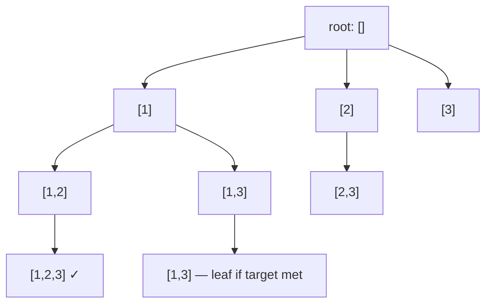

# 12. Greedy, Backtracking, and Divide & Conquer

> **TL;DR:** Greedy makes locally optimal choices that provably yield a global optimum (verify via exchange argument). Backtracking is exhaustive search with pruning. Divide & conquer splits into independent subproblems.

**Interview weight:** P1 — backtracking (subsets, permutations, N-Queens) is a staple medium/hard question; greedy requires correctness reasoning that differentiates senior candidates.

---

## Core Concepts

- **Greedy** — at each step, pick the choice that looks best locally. Requires proof of correctness.
- **Exchange argument** — assume an optimal solution differs from greedy; show swapping the differing choice to greedy's choice doesn't make things worse → greedy optimal.
- **Matroid** — algebraic structure guaranteeing greedy correctness (interval scheduling, Kruskal's MST). Not always testable, but good vocabulary.
- **Backtracking** — DFS over decision tree; undo choices (backtrack) when a path fails a constraint.
- **Pruning** — cut branches of the decision tree early to reduce search space.
- **Divide & Conquer** — split problem into independent subproblems, solve each, combine. No overlapping subproblems (otherwise use DP).

---

## Greedy vs DP

| Aspect | Greedy | Dynamic Programming |
| ------ | ------ | ------------------- |
| Subproblems | Independent after choice | Overlapping |
| Choice | Local optimum | All possibilities explored |
| Correctness | Needs exchange argument | Always correct if recurrence is right |
| Complexity | Usually O(n log n) or O(n) | O(n²) to O(n³) or higher |
| Examples | Interval scheduling, Huffman | Knapsack, LCS, TSP |
| When greedy fails | 0/1 Knapsack (items not divisible) | Use DP instead |

---

## Classic Greedy Problems

### Interval Scheduling (Activity Selection)

Sort by **end time**. Greedily pick each interval that starts ≥ last selected end.

```csharp
int MaxIntervals(int[][] intervals)
{
    Array.Sort(intervals, (a, b) => a[1] - b[1]); // sort by end time
    int count = 1, end = intervals[0][1];
    for (int i = 1; i < intervals.Length; i++)
        if (intervals[i][0] >= end) { count++; end = intervals[i][1]; }
    return count;
}
```

**LeetCode 435 (Non-overlapping Intervals)**, **452 (Minimum Arrows)**, **56 (Merge Intervals — sort by start)**.

### Jump Game (LeetCode 55)

Track the farthest reachable index. If current index > farthest → impossible.

```csharp
bool CanJump(int[] nums)
{
    int reach = 0;
    for (int i = 0; i < nums.Length; i++)
    {
        if (i > reach) return false;
        reach = Math.Max(reach, i + nums[i]);
    }
    return true;
}
```

### Gas Station (LeetCode 134)

If total gas ≥ total cost, a solution always exists. Start from any point where running sum drops below 0 → reset start to next index.

### Huffman Coding (Greedy + Min-Heap)

Build frequency min-heap. Repeatedly extract two minimum-frequency nodes, combine into parent, reinsert. O(n log n). Produces optimal prefix-free encoding.

### Other Canonical Greedy

| Problem | LeetCode | Key greedy insight |
| ------- | -------- | ------------------ |
| Jump Game II | 45 | Track current level's farthest reach (BFS-like) |
| Assign Cookies | 455 | Sort both; greedily match smallest sufficient cookie |
| Partition Labels | 763 | Extend partition end to last occurrence of all chars seen |
| Task Scheduler | 621 | Always schedule most-frequent available task |
| Meeting Rooms II | 253 | Min-heap of end times; add room if no overlap |

---

## Greedy Fails — Use DP Instead

| Problem | Why greedy fails | Use |
| ------- | ---------------- | --- |
| 0/1 Knapsack | Can't take partial item; local best ≠ global | DP |
| Coin Change | Min coins: greedy picks largest coin → may miss smaller combo | DP |
| LCS | "Locally matching" characters may skip globally better alignment | DP |
| Matrix chain mult | Greedy bracket order ≠ minimum operations | Interval DP |
| Shortest path w/ negative edges | Local minimum edge ≠ global shortest path | Bellman-Ford |

---

## Backtracking Template

```csharp
void Backtrack(List<int> current, /* other params */)
{
    if (IsSolution(current))
    {
        result.Add(new List<int>(current));
        return;
    }
    foreach (var choice in GetChoices(current))
    {
        if (!IsValid(current, choice)) continue; // pruning
        current.Add(choice);
        Backtrack(current, /* updated params */);
        current.RemoveAt(current.Count - 1); // undo
    }
}
```

### Subsets (LeetCode 78)

```csharp
void Subsets(int[] nums, int start, List<int> cur, List<List<int>> res)
{
    res.Add(new List<int>(cur));
    for (int i = start; i < nums.Length; i++)
    {
        cur.Add(nums[i]);
        Subsets(nums, i + 1, cur, res);
        cur.RemoveAt(cur.Count - 1);
    }
}
```

### Permutations (LeetCode 46)

```csharp
void Permute(int[] nums, bool[] used, List<int> cur, List<List<int>> res)
{
    if (cur.Count == nums.Length) { res.Add(new List<int>(cur)); return; }
    for (int i = 0; i < nums.Length; i++)
    {
        if (used[i]) continue;
        used[i] = true; cur.Add(nums[i]);
        Permute(nums, used, cur, res);
        used[i] = false; cur.RemoveAt(cur.Count - 1);
    }
}
```

### Combination Sum (LeetCode 39)

Allow reuse: `Backtrack(i, ...)` not `Backtrack(i+1, ...)`. Prune when `remaining < 0`.

### N-Queens (LeetCode 51)

Track which columns and diagonals are occupied. `colUsed`, `diag1[r-c+n]`, `diag2[r+c]`.

```csharp
void Solve(int row, int n, bool[] col, bool[] d1, bool[] d2, char[][] board, List<IList<string>> res)
{
    if (row == n) { res.Add(board.Select(r => new string(r)).ToList()); return; }
    for (int c = 0; c < n; c++)
    {
        if (col[c] || d1[row-c+n] || d2[row+c]) continue;
        col[c] = d1[row-c+n] = d2[row+c] = true; board[row][c] = 'Q';
        Solve(row+1, n, col, d1, d2, board, res);
        col[c] = d1[row-c+n] = d2[row+c] = false; board[row][c] = '.';
    }
}
```

### Sudoku Solver (LeetCode 37)

For each empty cell, try digits 1–9 with row/col/box validity checks. Prune immediately on conflict.

### Word Search (LeetCode 79)

DFS on grid, mark visited by XOR with a sentinel, unmark on backtrack.

---

## Backtracking Decision Tree



Each node = partial solution; leaf = complete solution or dead end.

---

## Divide & Conquer

**Pattern:** `solve(problem) = combine(solve(left), solve(right))`.

### Merge Sort

```csharp
void MergeSort(int[] arr, int l, int r)
{
    if (l >= r) return;
    int mid = (l + r) / 2;
    MergeSort(arr, l, mid); MergeSort(arr, mid+1, r);
    Merge(arr, l, mid, r);
}
```

**LeetCode 315: Count of Smaller Numbers After Self** — augment merge sort to count inversions.

### Quickselect (Kth Smallest in O(n) average)

```csharp
int QuickSelect(int[] nums, int l, int r, int k)
{
    if (l == r) return nums[l];
    int pivot = Partition(nums, l, r);
    if (k == pivot) return nums[k];
    return k < pivot ? QuickSelect(nums, l, pivot-1, k) : QuickSelect(nums, pivot+1, r, k);
}
```

Average O(n), worst O(n²). **LeetCode 215: Kth Largest Element.**

### Closest Pair of Points

1. Sort by x. Split at median.
2. Recurse on both halves → `d = min(d_left, d_right)`.
3. Check strip of width `2d` around the split line.
Time O(n log n).

### Meet-in-the-Middle

Split problem in half; solve each half exhaustively; combine. Reduces O(2^n) to O(2^(n/2) · log(2^(n/2))) = O(2^(n/2) · n). **LeetCode 805 (Split Array Same Average)**, subset sum with large n.

---

## Recursion to Iteration Patterns

| Recursive pattern | Iterative equivalent |
| ----------------- | -------------------- |
| DFS on tree | `Stack<TreeNode>` |
| Merge sort | Bottom-up merge passes |
| Backtracking | Explicit `Stack<State>` + undo log |
| Fibonacci DP | Loop with prev/curr variables |
| Tail recursion | Direct loop (compiler may optimize anyway) |

---

## Trade-offs & When to Use

- **Greedy**: fast O(n log n); verify correctness with exchange argument before trusting.
- **Backtracking**: exponential worst case — always add pruning. Constraint propagation (Sudoku) dramatically reduces search space.
- **Divide & conquer**: works when subproblems are **independent**. If overlapping → DP. If order matters → backtracking.
- **Meet-in-the-middle**: when n ≤ 40 and brute-force 2^n is too slow but 2^20 is fine.

## Common Pitfalls

- Greedy: sorting by wrong criterion (end vs start time for intervals → wrong answer).
- Backtracking: forgetting to undo state changes (e.g., not un-marking visited cells in word search).
- Permutations with duplicates: sort first, skip duplicates with `if (i > start && nums[i] == nums[i-1]) continue`.
- Divide & conquer: off-by-one in `mid = (l+r)/2` vs `(l+r+1)/2` for right-biased split.
- Quickselect: worst-case O(n²) on sorted input → randomize pivot or use median-of-3.

---

## Interview Questions

**Q1. How do you prove a greedy algorithm is correct?**
A: Use the exchange argument: assume an optimal solution O differs from greedy G at some step. Show that "swapping" O's choice at that step to match G's choice produces a solution at least as good. By induction, G's full output is optimal.

**Q2. Why does greedy fail for 0/1 Knapsack?**
A: Items cannot be split. A locally high value/weight ratio item may leave no room for a combination of smaller items with higher total value. Example: capacity=10, items=(9,10) and (5,6),(5,6) — greedy picks 9-weight item (value 10), misses value 12 from two 5-weight items.

**Q3. What is the time complexity of generating all subsets via backtracking?**
A: O(2^n · n) — there are 2^n subsets, each taking O(n) to copy into the result list. With n ≤ 20 this is feasible (~10M operations); n > 25 becomes slow.

**Q4. How does pruning work in the Combination Sum problem?**
A: Sort candidates first. In the inner loop, break (not continue) when `remaining - candidates[i] < 0` — all subsequent candidates are also too large, so the whole branch is pruned. This changes the worst case from O(n^target) to much less in practice.

**Q5. Explain the N-Queens constraint tracking.**
A: Three boolean arrays: `col[]`, `diag1[]` (top-left to bottom-right, key = `row-col+n`), `diag2[]` (top-right to bottom-left, key = `row+col`). A queen conflicts if any of the three is set. Set all three on place, clear on backtrack.

**Q6. When would you use meet-in-the-middle?**
A: When the problem is exponential in n but n ≤ 40. Split into two halves of size n/2; brute-force each (2^20 ≈ 1M entries). Combine: sort one half, binary-search from the other. Total O(2^(n/2) · n). Classic: subset sum with sum target, 4-sum.

**Q7. Compare backtracking vs BFS for generating combinations.**
A: Backtracking (DFS) uses O(depth) space = O(k) for k-combinations. BFS would store all partial combinations at each level → O(C(n,k)·k) space at the widest level. Backtracking is clearly superior for generation tasks.

**Q8. How does quickselect differ from quicksort, and what is its average complexity?**
A: Quickselect only recurses into one partition (where rank k falls), discarding the other. Average recurrence: T(n) = T(n/2) + O(n) → O(n). Quicksort recurses into both: O(n log n). Worst case for both: O(n²) on sorted input with bad pivot choice.

**Q9. Closest pair of points — what is the key step in the strip check?**
A: After finding `d = min(d_left, d_right)`, collect all points within `d` of the dividing line. For each point, check only the next 7 points (sorted by y) in the strip — a geometric argument shows at most 8 points can fit in a 2d × d rectangle. This keeps the combine step O(n).

**Q10. Explain the "Partition Labels" greedy (LeetCode 763).**
A: For each character, track its last occurrence. Iterate left to right; extend current partition end to `max(end, lastOccurrence[c])`. When `i == end`, the current partition is complete — no character in it appears later. Greedy correctness: we must include everything up to the last occurrence of any character seen.

**Q11. How would you detect if a greedy solution is applicable without formal proof?**
A: Heuristics: (1) sorting by a single attribute determines all choices; (2) the problem asks for count or max/min of disjoint intervals; (3) the problem has a "matroid" flavor (independent sets of elements). If unsure, test greedy against DP on small cases — if they always agree, greedy likely works.

**Q12. What is the role of the "undo" step in backtracking and what happens if you skip it?**
A: The undo step restores the state so the next branch explores a clean slate. Skipping it causes state leakage: future branches incorrectly "see" choices from sibling branches, producing wrong results (duplicates, missed paths, or constraint violations).

**Q13. How do you handle duplicates in permutations/subsets backtracking?**
A: Sort the input first. In the loop, skip `nums[i]` if `i > start && nums[i] == nums[i-1]` (for subsets) or `i > 0 && nums[i] == nums[i-1] && !used[i-1]` (for permutations). This ensures each duplicate value is placed in a canonical position only.

**Q14. What is the difference between "combination sum" where reuse is allowed vs not allowed?**
A: Reuse allowed (LeetCode 39): recurse with same index `i` not `i+1`. Reuse not allowed (LeetCode 40): recurse with `i+1`, and skip duplicate values at the same depth level. The start-index parameter controls which candidates are still available.

**Q15. How does Huffman coding achieve optimal prefix-free compression?**
A: Assigns shorter codes to higher-frequency characters. Correctness proof: the two least-frequent symbols must have the longest codes in any optimal encoding (exchange argument). Building bottom-up from a min-heap of frequencies ensures this property at each merge step.

---

## Quick Recap

- Greedy: sort + locally optimal choice; prove with exchange argument.
- Greedy fails when items are indivisible or choices have interdependencies → DP.
- Backtracking: DFS + undo + prune; time O(branching^depth).
- Subsets: 2^n; Permutations: n!; always sort first to handle duplicates.
- N-Queens: col + two diagonal bool arrays; set and unset on recurse/backtrack.
- Divide & conquer: independent subproblems; combine results.
- Quickselect: O(n) average, O(n²) worst; randomize pivot.
- Meet-in-the-middle: splits exponential n into 2^(n/2) — useful for n ≤ 40.
