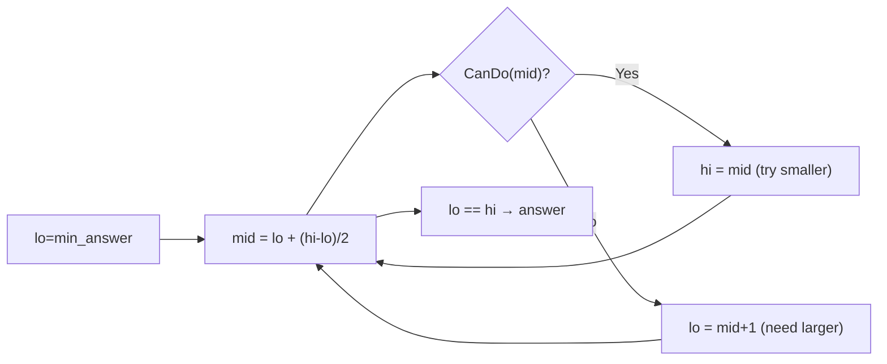

# 13. Sorting, Searching, and Binary Search on Answer

> **TL;DR:** Know when each sort is appropriate. Binary search is not just for sorted arrays — "binary search on the answer" turns hard optimization problems into easy feasibility checks.

**Interview weight:** P1 — binary search on answer and custom sort are tested frequently; interviewers probe off-by-one correctness and when stable/in-place matters.

---

## Core Concepts

- **Comparison sort lower bound** — Ω(n log n) for any comparison-based sort.
- **Stable sort** — equal elements maintain original relative order.
- **In-place sort** — O(1) auxiliary space (ignoring recursion stack).
- **Binary search invariant** — always maintain: answer lies in `[lo, hi]`. Exit when `lo > hi`.
- **Binary search on answer** — if feasibility of a value is monotone (once it works, all larger/smaller also work), binary search over the answer space.

---

## Sorting Algorithm Comparison

| Algorithm | Best | Average | Worst | Space | Stable | In-place | Notes |
| --------- | ---- | ------- | ----- | ----- | ------ | -------- | ----- |
| Quick sort | O(n log n) | O(n log n) | O(n²) | O(log n) | No | Yes | Cache-friendly; pivot choice critical |
| Merge sort | O(n log n) | O(n log n) | O(n log n) | O(n) | **Yes** | No | Preferred for linked lists; guaranteed O(n log n) |
| Heap sort | O(n log n) | O(n log n) | O(n log n) | O(1) | No | Yes | Poor cache locality; rarely used in practice |
| Insertion sort | O(n) | O(n²) | O(n²) | O(1) | Yes | Yes | Fastest for small/nearly-sorted arrays |
| Counting sort | O(n+k) | O(n+k) | O(n+k) | O(k) | Yes | No | Only for integer keys in small range |
| Radix sort | O(nk) | O(nk) | O(nk) | O(n+k) | Yes | No | k = number of digits; beats comparison sort for fixed-width keys |
| Tim sort | O(n) | O(n log n) | O(n log n) | O(n) | **Yes** | No | Hybrid merge+insertion; used in .NET `List.Sort` and Python |
| Intro sort | O(n log n) | O(n log n) | O(n log n) | O(log n) | No | Yes | Hybrid quick+heap; used in `Array.Sort` (.NET) |

---

## C# Sort Internals

- **`Array.Sort`** — introspective sort (quicksort → heapsort fallback at depth limit). **Not stable**. O(n log n).
- **`List<T>.Sort`** — delegates to `Array.Sort`. **Not stable**.
- **`OrderBy` (LINQ)** — merge sort internally. **Stable**. Returns new sequence.
- **`Array.Sort` with `IComparer<T>`** — custom comparison, still not stable.
- For stable in-place sort: use `OrderBy(...).ToArray()` or implement stable sort.

```csharp
// Custom sort: intervals by start time, then by end time desc
intervals.Sort((a, b) => a[0] != b[0] ? a[0] - b[0] : b[1] - a[1]);

// LINQ stable sort by multiple keys
var sorted = items.OrderBy(x => x.Priority).ThenBy(x => x.Name).ToList();

// Custom IComparer
class IntervalComparer : IComparer<int[]>
{
    public int Compare(int[]? a, int[]? b) => a![0] != b![0] ? a[0] - b[0] : b[1] - a[1];
}
Array.Sort(intervals, new IntervalComparer());
```

---

## Binary Search Templates

### Exact Match

```csharp
int BinarySearch(int[] arr, int target)
{
    int lo = 0, hi = arr.Length - 1;
    while (lo <= hi)
    {
        int mid = lo + (hi - lo) / 2; // avoid overflow
        if (arr[mid] == target) return mid;
        if (arr[mid] < target) lo = mid + 1;
        else hi = mid - 1;
    }
    return -1;
}
```

### Lower Bound (first index ≥ target)

```csharp
int LowerBound(int[] arr, int target)
{
    int lo = 0, hi = arr.Length;
    while (lo < hi)
    {
        int mid = lo + (hi - lo) / 2;
        if (arr[mid] < target) lo = mid + 1;
        else hi = mid;
    }
    return lo; // first index where arr[lo] >= target
}
```

### Upper Bound (first index > target)

```csharp
int UpperBound(int[] arr, int target)
{
    int lo = 0, hi = arr.Length;
    while (lo < hi)
    {
        int mid = lo + (hi - lo) / 2;
        if (arr[mid] <= target) lo = mid + 1;
        else hi = mid;
    }
    return lo; // first index where arr[lo] > target
}
```

**Off-by-one rule:** Use `lo < hi` (not `<=`) for lower/upper bound patterns; use `lo <= hi` for exact match. Always use `mid = lo + (hi - lo) / 2` to avoid overflow.

---

## Binary Search on Answer

**Pattern:** The answer lies in a monotone domain [lo, hi]. Write a `bool CanDo(mid)` function. Binary search to find the boundary.



### Koko Eating Bananas (LeetCode 875)

Binary search on speed `k` in `[1, max(piles)]`. `CanFinish(k)` = sum of `ceil(p/k)` ≤ H.

```csharp
int MinEatingSpeed(int[] piles, int h)
{
    int lo = 1, hi = piles.Max();
    while (lo < hi)
    {
        int mid = lo + (hi - lo) / 2;
        int hours = piles.Sum(p => (p + mid - 1) / mid);
        if (hours <= h) hi = mid; else lo = mid + 1;
    }
    return lo;
}
```

### Split Array Largest Sum (LeetCode 410)

Binary search on max-sum. `CanSplit(mid)` = greedy count of pieces with sum ≤ mid ≤ m.

### Ship Packages Within D Days (LeetCode 1011)

Same as split array. Binary search `[max(weights), sum(weights)]`.

### Allocate Books / Painter's Partition

Same pattern — `[max_element, total_sum]`.

### Median of Two Sorted Arrays (LeetCode 4)

Binary search on partition point in smaller array. O(log(min(m,n))).

```csharp
double FindMedianSortedArrays(int[] A, int[] B)
{
    if (A.Length > B.Length) return FindMedianSortedArrays(B, A);
    int m = A.Length, n = B.Length;
    int lo = 0, hi = m;
    while (lo <= hi)
    {
        int i = (lo + hi) / 2, j = (m + n + 1) / 2 - i;
        int maxLeftA  = i == 0 ? int.MinValue : A[i-1];
        int minRightA = i == m ? int.MaxValue  : A[i];
        int maxLeftB  = j == 0 ? int.MinValue : B[j-1];
        int minRightB = j == n ? int.MaxValue  : B[j];
        if (maxLeftA <= minRightB && maxLeftB <= minRightA)
        {
            if ((m + n) % 2 == 1) return Math.Max(maxLeftA, maxLeftB);
            return (Math.Max(maxLeftA, maxLeftB) + Math.Min(minRightA, minRightB)) / 2.0;
        }
        if (maxLeftA > minRightB) hi = i - 1; else lo = i + 1;
    }
    return 0;
}
```

---

## Search in Rotated Sorted Array (LeetCode 33)

Determine which half is sorted, then decide if target is in that half.

```csharp
int Search(int[] nums, int target)
{
    int lo = 0, hi = nums.Length - 1;
    while (lo <= hi)
    {
        int mid = lo + (hi - lo) / 2;
        if (nums[mid] == target) return mid;
        if (nums[lo] <= nums[mid]) // left half sorted
        {
            if (nums[lo] <= target && target < nums[mid]) hi = mid - 1;
            else lo = mid + 1;
        }
        else // right half sorted
        {
            if (nums[mid] < target && target <= nums[hi]) lo = mid + 1;
            else hi = mid - 1;
        }
    }
    return -1;
}
```

---

## Quickselect

Average O(n); uses partition from quicksort. Finds kth smallest without full sort.

```csharp
int QuickSelect(int[] nums, int lo, int hi, int k)
{
    if (lo == hi) return nums[lo];
    int pivot = nums[hi], p = lo;
    for (int i = lo; i < hi; i++)
        if (nums[i] <= pivot) { (nums[i], nums[p]) = (nums[p], nums[i]); p++; }
    (nums[p], nums[hi]) = (nums[hi], nums[p]);
    if (p == k) return nums[p];
    return p > k ? QuickSelect(nums, lo, p - 1, k) : QuickSelect(nums, p + 1, hi, k);
}
```

---

## Canonical Problems

| Problem | LeetCode | Pattern | Key insight |
| ------- | -------- | ------- | ----------- |
| Binary Search | 704 | Exact match | Template: `lo<=hi`, `mid±1` |
| Find First/Last Position | 34 | Lower/upper bound | Two binary searches |
| Search in Rotated Array | 33 | BS on rotated | Identify sorted half |
| Koko Eating Bananas | 875 | BS on answer | Feasibility = hours ≤ H |
| Split Array Largest Sum | 410 | BS on answer | Feasibility = pieces ≤ m |
| Median of Two Sorted Arrays | 4 | BS on partition | Binary search on smaller array |
| Find Minimum in Rotated | 153 | BS on rotated | Minimum always in unsorted half |
| Kth Largest Element | 215 | Quickselect | Partial sort in O(n) avg |
| Count of Range Sum | 327 | Merge sort + BIT | Count inversions variant |

---

## Trade-offs & When to Use

- **Quick sort** for general in-place sorting; randomize pivot to avoid O(n²).
- **Merge sort** when stability required or sorting linked lists (no random access needed).
- **Counting/radix sort** when keys are bounded integers (e.g., scores 0–100, character frequencies).
- **Insertion sort** for small arrays (n < 16) or nearly-sorted — used internally by TimSort.
- **Binary search on answer**: whenever you see "minimize the maximum" or "maximize the minimum" → binary search over that value.
- **Quickselect** for single kth-element queries; for repeated queries build a heap or sort.

## Common Pitfalls

- Integer overflow: `mid = (lo + hi) / 2` overflows if `lo + hi > int.MaxValue`; use `lo + (hi - lo) / 2`.
- Wrong loop condition: use `lo <= hi` for exact match; `lo < hi` for bound-finding.
- Binary search on answer: ensure `CanDo` is truly monotone; find the tightest `[lo, hi]` range.
- Custom `IComparer.Compare` returning incorrect sign (e.g., returning `true/false` cast to int).
- Quickselect: forgetting to handle duplicate pivots can cause infinite loops — use 3-way partition for many duplicates.

---

## Interview Questions

**Q1. Why is `Array.Sort` not stable in .NET and how do you get a stable sort?**
A: `Array.Sort` uses introspective sort (quicksort-based) which is not stable. For a stable sort, use LINQ `OrderBy` (which uses a stable merge sort internally) or copy to a new array. If you need stable in-place on a custom type, implement merge sort.

**Q2. What is the difference between lower_bound and upper_bound?**
A: `lower_bound(target)` = first index i where `arr[i] >= target`. `upper_bound(target)` = first index i where `arr[i] > target`. Count of `target` in sorted array = `upper_bound - lower_bound`.

**Q3. Explain binary search on answer with an example.**
A: "What's the minimum maximum subarray sum when split into k parts?" The answer is monotone: if it's feasible with maximum sum X, it's also feasible with X+1. Binary search: `lo=max(arr)`, `hi=sum(arr)`. `CanSplit(mid)` = greedy number of pieces needed ≤ k. O(n log(sum)) time.

**Q4. How does TimSort achieve O(n) best case?**
A: TimSort detects natural runs (already-sorted sequences) in the data. If the array is already sorted, it's one big run → O(n). Runs shorter than `minRun` (typically 32–64) are extended with insertion sort before merging.

**Q5. How would you sort a nearly-sorted array of n elements where each element is at most k positions from its final position?**
A: Min-heap of size k+1. Slide through array: insert next element into heap, extract min to output. O(n log k). Much better than O(n log n) when k is small.

**Q6. When does binary search on a rotated sorted array fail?**
A: When there are duplicate elements (LeetCode 81). `nums[lo] == nums[mid]` → can't determine which half is sorted. Must fall back to linear scan in the worst case: O(n). Without duplicates (LeetCode 33), always O(log n).

**Q7. Explain quickselect and its worst-case complexity.**
A: Quickselect uses quicksort's partition: after partitioning, the pivot is at its final sorted position. Recurse only into the partition containing rank k. Average T(n) = T(n/2) + O(n) → O(n). Worst case (always picking min/max as pivot): T(n) = T(n-1) + O(n) → O(n²). Randomize pivot or use median-of-3 to avoid.

**Q8. How do you implement a custom stable sort for objects with multiple sort keys in C#?**
A: Use LINQ: `items.OrderBy(x => x.Primary).ThenBy(x => x.Secondary)`. This is stable (preserves relative order of equal elements) and handles multi-key sorting elegantly. Alternatively, implement `IComparer<T>` with multi-key comparison and use `Array.Sort` (but note it's not stable).

**Q9. Median of two sorted arrays — why binary search on the smaller array?**
A: We binary search on the partition index `i` of the smaller array (length m). The corresponding index `j = (m+n+1)/2 - i` for the larger array is then determined. O(log m) ≤ O(log n). Searching on the larger array would also work but with O(log n) — always use the smaller for efficiency.

**Q10. What is introsort and why does .NET use it?**
A: Introsort begins with quicksort (cache-friendly, fast in practice), switches to heapsort when recursion depth exceeds 2·log(n) (to avoid O(n²) worst case), and uses insertion sort for subarrays of size ≤ 16. Result: O(n log n) worst case, O(1) extra space, fast in practice.

**Q11. How would you find the kth smallest element in a sorted matrix?**
A: Binary search on value range [matrix[0,0], matrix[n-1,n-1]]. `CountLE(mid)` = number of elements ≤ mid (O(n) traversal: start top-right, go left if ≤ mid, go down if > mid). Binary search to find smallest mid where CountLE ≥ k. O(n log(max-min)).

**Q12. Why does counting sort require O(k) space and when is it worth it?**
A: Counting sort creates a frequency array of size k (key range). For sorting n integers in [0,k], it's O(n+k). Worth it when k = O(n) — e.g., sorting exam scores (k=100), sorting by character (k=26). Not worth it when k >> n (sparse key space wastes space).

**Q13. How do you binary search on a 2D sorted matrix where each row and column is sorted?**
A: Start at top-right corner. If `matrix[r][c] == target` → found. If `> target` → move left (c--). If `< target` → move down (r++). O(m+n). This is not binary search but a staircase search — O(m+n) is optimal for this structure.

**Q14. How would you implement `Array.BinarySearch` for a custom comparer?**
A: `int idx = Array.BinarySearch(arr, target, new MyComparer())`. Returns index if found, or `~idx` (bitwise complement) of the insertion point if not found. Use `~result` to recover the lower bound when the element isn't present.

**Q15. Explain the "aggressive cows" / "allocate books" problem category and the general solution approach.**
A: These are "minimize the maximum" or "maximize the minimum" problems. Binary search on the answer: the answer space has a clear min and max. The feasibility function (`CanArrange(minDist)` or `CanAllocate(maxPages)`) is monotone. Greedy check in O(n). Total: O(n log(answer_range)).

---

## Quick Recap

- Introsort (`Array.Sort`): not stable; TimSort (`OrderBy`): stable.
- Binary search exact: `lo<=hi`; bound-finding: `lo<hi`; always `lo + (hi-lo)/2`.
- Lower bound = first index ≥ target; upper bound = first index > target.
- Binary search on answer: feasibility function must be monotone; `[lo,hi]` = answer domain.
- Quickselect: O(n) average kth element; randomize pivot.
- Rotated array search: identify the sorted half, then check if target is in it.
- Counting/radix sort: O(n) for bounded integer keys — breaks O(n log n) barrier.
