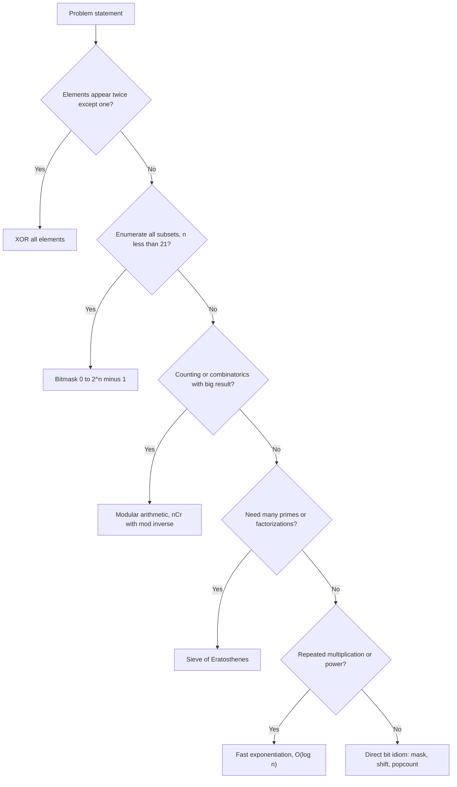

# 14. Bit Manipulation and Math

> **TL;DR:** Bit tricks give O(1) operations that look magical in interviews. Know the 10 core idioms, XOR patterns, modular arithmetic, and sieve — they cover 95% of what's tested.

**Interview weight:** P1 — bit manipulation appears in ~20% of coding rounds; modular arithmetic and combinatorics are required for any counting/probability problem.

---

## Core Concepts

- **Bit position** — 0-indexed from LSB (rightmost). Bit k has value `2^k`.
- **Two's complement** — `-x = ~x + 1`. Explains why `x & -x` isolates lowest set bit.
- **Overflow** — C# `int` is 32-bit signed; use `long` or `checked` keyword to catch overflow.
- **Modular arithmetic** — all operations can overflow; take mod at each step.
- **`BitOperations`** — `System.Numerics.BitOperations` in .NET 3.0+; hardware-accelerated popcount, leading/trailing zeros.

---

## Choosing the Right Bit or Math Tool



---

## Bit Operations Table

| Operation | Expression | Example (x=0b1010=10) |
| --------- | ---------- | --------------------- |
| Set bit k | `x \| (1<<k)` | Set bit 0 → 0b1011=11 |
| Clear bit k | `x & ~(1<<k)` | Clear bit 3 → 0b0010=2 |
| Toggle bit k | `x ^ (1<<k)` | Toggle bit 1 → 0b1000=8 |
| Check bit k | `(x >> k) & 1` | Check bit 1 → 1 (set) |
| Lowest set bit | `x & -x` | → 0b0010=2 |
| Clear lowest set bit | `x & (x-1)` | → 0b1000=8 |
| Is power of two | `x > 0 && (x & (x-1)) == 0` | 8: yes; 10: no |
| Count set bits (popcount) | `BitOperations.PopCount((uint)x)` | 10 → 2 |
| Sign of integer | `x >> 31` | Negative: -1; non-neg: 0 |
| Swap without temp | `a^=b; b^=a; a^=b` | Swaps a and b |

---

## Core Idioms

```csharp
// x & (x-1): removes lowest set bit — count set bits, check power of 2
int Popcount(int x) { int c = 0; while (x != 0) { x &= x-1; c++; } return c; }

// x & -x: isolates lowest set bit — used in Fenwick tree
int lowestBit = x & -x;

// Check if power of 2
bool IsPow2(int x) => x > 0 && (x & (x-1)) == 0;

// Next power of 2 >= n
int NextPow2(int n) => (int)Math.Pow(2, Math.Ceiling(Math.Log2(n)));
// Or: BitOperations.RoundUpToPowerOf2((uint)n)  (.NET 6+)

// Reverse bits
uint ReverseBits(uint n)
{
    uint result = 0;
    for (int i = 0; i < 32; i++) { result = (result << 1) | (n & 1); n >>= 1; }
    return result;
}
```

---

## XOR Tricks

XOR is its own inverse: `a ^ a = 0`, `a ^ 0 = a`.

```csharp
// Single Number I (LeetCode 136): XOR all — pairs cancel
int SingleNumber(int[] nums) => nums.Aggregate(0, (acc, x) => acc ^ x);

// Missing Number (LeetCode 268): XOR indices 0..n with all nums
int MissingNumber(int[] nums)
{
    int xor = nums.Length;
    for (int i = 0; i < nums.Length; i++) xor ^= i ^ nums[i];
    return xor;
}
```

**Single Number II (LeetCode 137) — appears 3× except one:**
Use `ones` and `twos` counters tracking bits mod 3.

**Single Number III (LeetCode 260) — two unique numbers:**
XOR all → `diff = a^b`. Find any set bit in `diff`. Partition nums into two groups by that bit; XOR each group → get `a` and `b`.

---

## Subset Generation via Bitmask

```csharp
// All subsets of nums
for (int mask = 0; mask < (1 << nums.Length); mask++)
{
    var subset = new List<int>();
    for (int i = 0; i < nums.Length; i++)
        if ((mask & (1 << i)) != 0) subset.Add(nums[i]);
    // process subset
}
// O(2^n * n). Feasible for n <= 20.
```

---

## .NET `BitArray` and `BitOperations`

```csharp
using System.Numerics;

// Hardware popcount (much faster than manual loop)
int setBits = BitOperations.PopCount((uint)x);

// Trailing zeros (isolate LSB position)
int trailingZeros = BitOperations.TrailingZeroCount((uint)x);

// Leading zeros
int leadingZeros = BitOperations.LeadingZeroCount((uint)x);

// BitArray for large bit vectors
var ba = new BitArray(1000);
ba[42] = true;
bool isSet = ba[42];
```

---

## Modular Arithmetic

```csharp
const int MOD = 1_000_000_007;

// Fast exponentiation: a^b mod m in O(log b)
long Power(long base, long exp, long mod)
{
    long result = 1; base %= mod;
    while (exp > 0)
    {
        if ((exp & 1) == 1) result = result * base % mod;
        base = base * base % mod;
        exp >>= 1;
    }
    return result;
}

// Modular inverse (Fermat's little theorem; mod must be prime)
long ModInverse(long a, long mod) => Power(a, mod - 2, mod);

// nCr mod p
long NCR(int n, int r, long mod)
{
    if (r > n) return 0;
    long num = 1, den = 1;
    for (int i = 0; i < r; i++)
    {
        num = num * (n - i) % mod;
        den = den * (i + 1) % mod;
    }
    return num * ModInverse(den, mod) % mod;
}
```

---

## GCD / LCM / Euclid

```csharp
int GCD(int a, int b) => b == 0 ? a : GCD(b, a % b);
long LCM(long a, long b) => a / GCD((int)a, (int)b) * b; // divide first to avoid overflow
```

Iterative Euclid: `while(b != 0) { (a, b) = (b, a % b); }`. O(log(min(a,b))).

---

## Sieve of Eratosthenes

```csharp
bool[] SieveOfEratosthenes(int limit)
{
    var isPrime = new bool[limit + 1]; Array.Fill(isPrime, true);
    isPrime[0] = isPrime[1] = false;
    for (int i = 2; i * i <= limit; i++)
        if (isPrime[i])
            for (int j = i * i; j <= limit; j += i)
                isPrime[j] = false;
    return isPrime;
}
```

Time: O(n log log n). Space: O(n). Finds all primes up to n.

**Segmented sieve** — for primes in `[L, R]` where R is huge but R-L is small: sieve up to √R, then mark multiples in `[L, R]` segment. Reduces memory to O(√R + (R-L)).

### Primality Test (single number)

Trial division up to √n: O(√n). For very large numbers use Miller-Rabin probabilistic test.

---

## Combinatorics

- **nCr mod p**: precompute factorials and inverse factorials mod p.
- **Pascal's triangle**: `C[i][j] = C[i-1][j-1] + C[i-1][j]`. O(n²) precompute.
- **Catalan number**: `C_n = C(2n,n)/(n+1)`. Counts valid bracket sequences, BSTs with n nodes, paths in grid not crossing diagonal.

---

## Probability Basics

- **Reservoir sampling** — select k items uniformly from a stream of unknown size n. Keep first k; for item i (i > k), with probability k/i, replace a random element. O(n) time, O(k) space.
- **Random with weights** — prefix sum of weights + binary search into it. For n categories: O(n) build, O(log n) sample.
- **Expected value of XOR** — linearity of expectation; compute per-bit probability independently.

---

## Overflow Handling

```csharp
// Use long for intermediate products
long result = (long)a * b; // a,b are int; product may exceed int.MaxValue

// Checked arithmetic (throws OverflowException)
checked { int x = int.MaxValue + 1; } // throws

// Avoid in binary search
int mid = lo + (hi - lo) / 2; // NOT (lo + hi) / 2
```

---

## Geometry Basics (Interview Level)

- **Cross product** `(b-a) × (c-a)`: positive = c left of a→b, negative = right, 0 = collinear.
- **Point in rectangle**: `x1 <= px <= x2 && y1 <= py <= y2`.
- **Distance squared**: avoid `Math.Sqrt` for comparisons — use `dx*dx + dy*dy`.
- **GCD for reducing fractions** (LeetCode 149: Max Points on a Line).

---

## Comparison: Bit Operations vs Equivalent Arithmetic

| Task | Bit operation | Arithmetic | Notes |
| ---- | ------------- | ---------- | ----- |
| Multiply by 2^k | `x << k` | `x * (1<<k)` | Equivalent; compiler does it anyway |
| Divide by 2^k | `x >> k` | `x / (1<<k)` | Works only for non-negative; sign-extends for negative in C# |
| Modulo power of 2 | `x & (m-1)` | `x % m` | Only when m is power of 2 |
| Check even/odd | `(x & 1) == 0` | `x % 2 == 0` | Equivalent in practice |
| Absolute value | `(x ^ (x>>31)) - (x>>31)` | `Math.Abs(x)` | Use `Math.Abs`; bit version is a curiosity |
| Popcount | `BitOperations.PopCount` | Loop + mod | Hardware is O(1), loop is O(log n) |

---

## Trade-offs & When to Use

- Bitmask DP / subset generation: feasible for n ≤ 20.
- XOR tricks: elegant for "find the odd one out" or "missing element" — O(1) space.
- Modular arithmetic: required for any problem asking "answer mod 10^9+7".
- Sieve: best for "all primes up to N" queries; not for single large number primality.
- `BitOperations.PopCount`: always prefer over manual loop — hardware instruction on modern CPUs.

## Common Pitfalls

- `1 << 32` is undefined behavior in C; in C# it wraps to 0 for `int`. Use `1L << k` for bit 31+.
- Signed right shift (`>>`) preserves sign bit in C# — use `>>>` (unsigned) for logical shift (.NET 7+).
- Modular inverse requires prime modulus; use extended GCD for non-prime modulus.
- Sieve: inner loop starts at `i*i` not `2*i` (those are already marked by earlier primes).
- XOR swap: breaks when `a` and `b` are the same memory location → `a` becomes 0.

---

## Interview Questions

**Q1. What does `x & (x-1)` do and why?**
A: Clears the lowest set bit of x. `x-1` flips all bits from LSB through the lowest set bit. AND with x zeroes that bit and preserves all higher bits. Usage: count set bits (loop until x=0), check power of two (result=0 iff power of two).

**Q2. How does `x & -x` isolate the lowest set bit?**
A: In two's complement, `-x = ~x + 1`. This flips all bits below the lowest set bit (from 0 to 1), flips the lowest set bit (from 1 to 0, with carry propagating), and preserves all higher bits as flipped. AND with x → only the original lowest set bit survives.

**Q3. Explain Single Number II (LeetCode 137) — every element appears 3× except one.**
A: Use two integers `ones` and `twos` to count bits mod 3. `ones = (ones ^ x) & ~twos`, then `twos = (twos ^ x) & ~ones`. After processing all elements, `ones` holds the single number. Alternatively: for each bit position, sum all bits mod 3 → remaining bits form the answer.

**Q4. How do you generate all subsets of an array using bitmasks?**
A: Iterate mask from 0 to 2^n - 1. For each mask, bit k set means include nums[k]. O(2^n · n) total. For n=20: ~20M operations — fast enough. For n>25: too slow; use recursive backtracking instead.

**Q5. Why use `1_000_000_007` (10^9+7) as the modulus?**
A: It's the largest prime below 2^30. Being prime enables modular inverse via Fermat's little theorem. Two numbers < MOD can be multiplied without `long` overflow: `(10^9)^2 = 10^18 < 2^63 − 1 ≈ 9.2×10^18`. Standard in competitive programming and interview problems.

**Q6. What is fast exponentiation and what is its complexity?**
A: Square-and-multiply: if exponent is odd, multiply result by base; always square base; halve exponent. O(log b) multiplications. Used for: modular exponentiation, matrix exponentiation (linear recurrences), computing `x^n` without overflow.

**Q7. How does reservoir sampling work for selecting 1 item uniformly from a stream?**
A: Keep first item. For item i (1-indexed), replace kept item with probability 1/i. Proof: probability any item j survives = (1/j) × (j/(j+1)) × ... × ((n-1)/n) = 1/n. For k items: use same logic but replace one of k items with probability k/i.

**Q8. Explain how the sieve of Eratosthenes works and why it starts the inner loop at i².**
A: For each prime i, mark all multiples as composite. Start at i² because all smaller multiples of i (2i, 3i, ..., (i-1)·i) have already been marked by earlier primes. Starting at 2i would re-mark already-marked numbers, wasting time but not causing errors.

**Q9. How do you compute nCr mod a prime p efficiently for large n?**
A: Precompute factorials and their modular inverses: `fact[i] = fact[i-1] * i % p`, `inv_fact[i] = power(fact[i], p-2, p)`. Then `nCr = fact[n] * inv_fact[r] % p * inv_fact[n-r] % p`. O(n) precomputation, O(1) per query.

**Q10. XOR of all numbers from 1 to n — is there a pattern?**
A: Yes: XOR(1..n) cycles with period 4. If n%4==0: n; n%4==1: 1; n%4==2: n+1; n%4==3: 0. Derived by observing that XOR of consecutive pairs cancels. Used in "missing number" and "XOR of range" problems.

**Q11. How would you check if two rectangles overlap?**
A: They do NOT overlap if one is entirely to the left, right, above, or below the other. `!(r1.right <= r2.left || r2.right <= r1.left || r1.top <= r2.bottom || r2.top <= r1.bottom)`. Use non-strict inequality for touching-only → no overlap.

**Q12. Why should you avoid `Math.Sqrt` in competitive geometry?**
A: Floating-point precision errors. `Math.Sqrt(4.0)` might return `1.9999...` or `2.0000001`. Compare squared distances instead: `dx*dx + dy*dy < r*r` instead of `Math.Sqrt(dx*dx+dy*dy) < r`. Only use `Math.Sqrt` when the exact real value is needed (not for comparisons).

**Q13. What is Catalan number and what problems does it count?**
A: `C_n = C(2n,n)/(n+1)`. Counts: valid parenthesizations of n+1 factors, BSTs with n keys, monotonic lattice paths from (0,0) to (n,n) not crossing the diagonal, triangulations of (n+2)-gon. Appears in: number of BSTs with n distinct keys (LeetCode 96), Decode Ways-like problems.

**Q14. How do you detect integer overflow in C# when it matters?**
A: Use `checked` blocks or `checked` keyword: `checked { result = a * b; }` throws `OverflowException`. Alternatively, use `long` for intermediate results and only truncate to `int` at the end. For modular arithmetic, multiply as `long` and mod: `(long)a * b % MOD`.

**Q15. How would you implement a hash function for (row, col) pairs without allocating a string?**
A: Combine with a bijective formula: `hash = row * LARGE_PRIME + col` where `LARGE_PRIME > max_col`. Or use `HashCode.Combine(row, col)` (.NET Core). For perfect hashing on bounded grid: `row * cols + col` (unique if cols is max column count).

---

## Quick Recap

- `x & (x-1)`: clear lowest set bit. `x & -x`: isolate lowest set bit.
- `x > 0 && (x & (x-1)) == 0`: test power of two.
- XOR: `a^a=0`, `a^0=a` — use for "find the odd one out."
- Subset generation: iterate mask 0 to 2^n - 1; feasible for n ≤ 20.
- Fast exponentiation: O(log b); required for modular inverse (Fermat's little theorem).
- Sieve: O(n log log n), starts inner loop at i².
- `BitOperations.PopCount`: hardware O(1) — always prefer over manual loop.
- Modular arithmetic: take mod at every multiplication to prevent overflow.
