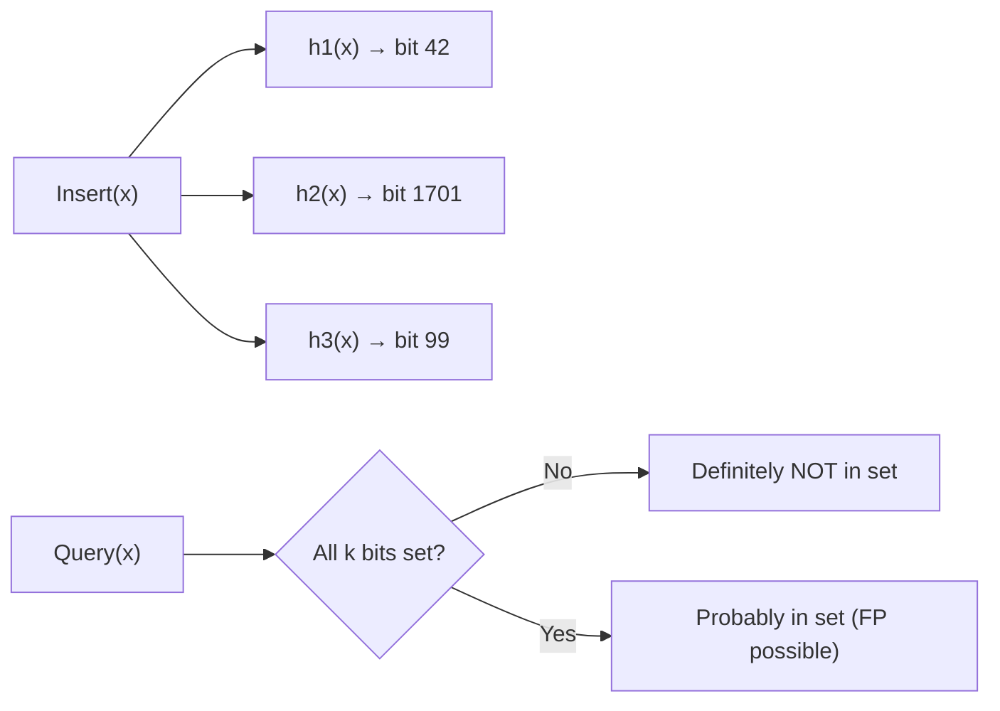

# 15. Advanced Structures — Segment Tree, Fenwick, DSU, Bloom

> **TL;DR:** Segment tree handles arbitrary range queries with point/range updates in O(log n). Fenwick tree is simpler for prefix sums. Bloom filter trades false positives for O(1) space-efficient membership. Know all four for senior-level interviews.

**Interview weight:** P1 for Segment Tree/Fenwick/DSU; P2 for Bloom/HLL/Count-Min (conceptual depth differentiates Staff-level candidates).

---

## Core Concepts

- **Segment tree** — binary tree over array intervals; each node stores aggregate of its range. O(log n) query and update.
- **Fenwick tree (BIT)** — implicit tree using bit manipulation; limited to prefix-sum-style queries but simpler and faster constant.
- **Lazy propagation** — defer range updates in segment tree; propagate lazily on demand.
- **Bloom filter** — probabilistic set; no false negatives; false positive rate tunable by size/hash count.
- **Count-Min Sketch** — probabilistic frequency counter; underestimates never, overestimates bounded.
- **HyperLogLog** — estimates distinct element count in O(1) space; ~1–2% error.

---

## Segment Tree — Build / Query / Point Update

```csharp
class SegmentTree
{
    private int[] _tree;
    private int _n;

    public SegmentTree(int[] arr)
    {
        _n = arr.Length;
        _tree = new int[4 * _n];
        Build(arr, 0, 0, _n - 1);
    }

    private void Build(int[] arr, int node, int start, int end)
    {
        if (start == end) { _tree[node] = arr[start]; return; }
        int mid = (start + end) / 2;
        Build(arr, 2*node+1, start, mid);
        Build(arr, 2*node+2, mid+1, end);
        _tree[node] = _tree[2*node+1] + _tree[2*node+2]; // sum; replace for min/max
    }

    // Range sum query [l, r]
    public int Query(int l, int r) => Query(0, 0, _n-1, l, r);
    private int Query(int node, int start, int end, int l, int r)
    {
        if (r < start || end < l) return 0;              // out of range
        if (l <= start && end <= r) return _tree[node];  // fully covered
        int mid = (start + end) / 2;
        return Query(2*node+1, start, mid, l, r) + Query(2*node+2, mid+1, end, l, r);
    }

    // Point update: set arr[idx] = val
    public void Update(int idx, int val) => Update(0, 0, _n-1, idx, val);
    private void Update(int node, int start, int end, int idx, int val)
    {
        if (start == end) { _tree[node] = val; return; }
        int mid = (start + end) / 2;
        if (idx <= mid) Update(2*node+1, start, mid, idx, val);
        else Update(2*node+2, mid+1, end, idx, val);
        _tree[node] = _tree[2*node+1] + _tree[2*node+2];
    }
}
```

Build: O(n). Query: O(log n). Update: O(log n). Space: O(4n).

---

## Lazy Propagation (Conceptual)

Range updates (add delta to all elements in [l,r]) without lazy: O(n) per update. With lazy:
- Store `lazy[node]` = pending delta not yet pushed to children.
- On query/update touching a node's range, **push down** the lazy value to children first.
- O(log n) range update + range query.

**Useful for:** range add + range sum, range set + range min, etc.

---

## Fenwick Tree (Binary Indexed Tree)

```csharp
class FenwickTree
{
    private int[] _bit;
    private int _n;

    public FenwickTree(int n) { _n = n; _bit = new int[n + 1]; }

    // Add delta to index i (1-indexed)
    public void Update(int i, int delta)
    {
        for (; i <= _n; i += i & -i) _bit[i] += delta;
    }

    // Prefix sum [1..i]
    public int Query(int i)
    {
        int sum = 0;
        for (; i > 0; i -= i & -i) sum += _bit[i];
        return sum;
    }

    // Range sum [l..r]
    public int RangeQuery(int l, int r) => Query(r) - Query(l - 1);
}
```

Build: O(n log n) via updates or O(n) direct construction. Query/Update: O(log n). Space: O(n).

---

## Segment Tree vs Fenwick vs Prefix Sum

| Aspect | Prefix Sum | Fenwick Tree | Segment Tree |
| ------ | ---------- | ------------ | ------------ |
| Build | O(n) | O(n log n) | O(n) |
| Point update | O(n) rebuild | **O(log n)** | **O(log n)** |
| Range query | **O(1)** | O(log n) | O(log n) |
| Range update | O(1) with diff array | O(log n) | O(log n) lazy |
| Supported aggregates | Sum only (or with diff arr) | Sum, XOR | **Any (min, max, GCD, sum)** |
| Code complexity | Simple | Medium | Complex |
| Space | O(n) | O(n) | O(4n) |
| Best for | Static array, range sum only | Dynamic point update + prefix sum | Any dynamic range aggregate |

---

## DSU Recap (Union-Find)

See [Graphs](10-Graphs.md) for full C# implementation. Key applications:

| Application | How DSU is used |
| ----------- | --------------- |
| Connected components | Union nodes, count roots |
| Cycle detection | Union edge; false = cycle |
| Kruskal's MST | Union edge; false = skip |
| Accounts merge | Union same emails → same account |
| Redundant connection | First `Union` returning false |
| Smallest string with swaps | Same component = can permute freely |

DSU with path compression + union by rank: O(α(n)) ≈ O(1) amortized.

---

## LRU / LFU

See [Linked Lists and Caches](../99-Cheatsheets) — these are standalone design problems. Summary:
- **LRU**: `Dictionary<key,Node>` + doubly-linked list. O(1) all ops.
- **LFU**: Two hashmaps + frequency-bucketed linked lists. O(1) all ops.

---

## Bloom Filter

**Concept:** m-bit array + k hash functions. On insert: set k bits. On query: check all k bits — if any 0 → definitely absent; all 1 → probably present (false positive possible).

**False positive rate:** `p ≈ (1 - e^(-kn/m))^k` where n = inserted items, m = bits, k = hash functions.

**Optimal k:** `k = (m/n) · ln 2 ≈ 0.693 · m/n`.

**Sizing formula:** `m = -n·ln(p) / (ln 2)²` bits for desired false-positive rate p.

**Example:** 1M items, 1% FP rate → `m = -1M·ln(0.01)/(0.693²) ≈ 9.6M bits ≈ 1.2 MB`.



**Where used in production:**
- **Databases** (e.g., Cassandra, RocksDB): skip SSTable disk reads for non-existent keys.
- **CDNs**: check if content is in cache before expensive lookup.
- **Distributed caches**: Redis uses Bloom filters to protect against cache miss stampede.
- **Web crawlers**: already-visited URL tracking.

See also: [../05-System-Design-HLD/00-README.md](../05-System-Design-HLD/00-README.md) for system-level cache and CDN patterns.

---

## Count-Min Sketch

**Concept:** d×w integer array + d independent hash functions. On insert: increment `table[i][hi(x)]` for each row i. On query frequency: return `min(table[i][hi(x)])` across rows.

- **No false negatives** for frequency (never underestimates).
- **Overestimates** by at most ε·N with probability 1-δ, where `w = ⌈e/ε⌉`, `d = ⌈ln(1/δ)⌉`.
- Space: O(d·w) = O(ε^-1 · log(1/δ)).
- **Use cases:** network flow analysis, top-k heavy hitters (combine with min-heap), event counting at scale (Flink, Redis).

---

## HyperLogLog

**Concept:** Estimates distinct elements (cardinality) using O(1.5 KB) regardless of data size. Uses the leftmost-zero-bit position of hashed values as a probabilistic estimator. Multiple registers reduce variance.

- **Error rate:** ≈ 1.04/√m where m = number of registers. With m=16384: ~0.8% error.
- **Space:** m · 5-6 bits per register ≈ 12 KB for 0.8% error.
- **Use cases:** unique visitor counting, distinct query counting in analytics, cardinality estimation in Redis (`PFADD`/`PFCOUNT`).

---

## Skip List

- Probabilistic linked list with express lanes (additional forward pointers). Expected O(log n) search, insert, delete.
- Used in: Redis sorted sets (`ZSET`), LevelDB MemTable.
- Simpler to implement than balanced BST; no rotations needed.
- Space: O(n) expected; each node has O(log n) pointers in expectation.

---

## B-Tree / B+Tree vs LSM Tree

| Aspect | B+Tree | LSM Tree |
| ------ | ------ | -------- |
| Structure | Balanced tree, all data in leaves | Log-structured: in-memory buffer + immutable SSTables |
| Write performance | O(log n), in-place update | **O(1) amortized** (append-only) |
| Read performance | **O(log n)** | O(log n) amortized + compaction overhead |
| Write amplification | Low | **High** (compaction rewrites data multiple times) |
| Read amplification | Low | Higher (may check multiple SSTables) |
| Space amplification | Low | Higher (old data retained until compaction) |
| Best for | Read-heavy workloads (SQL DBs: InnoDB, Postgres) | Write-heavy workloads (Cassandra, RocksDB, LevelDB) |
| Crash recovery | WAL + page-level recovery | WAL + compaction replay |

---

## Trade-offs & When to Use

- **Segment tree**: when you need non-prefix aggregates (min, max, GCD) with updates.
- **Fenwick tree**: when prefix sums with point updates suffice — simpler, faster constant.
- **Bloom filter**: when false negatives are unacceptable but false positives are OK; saves expensive lookups. Can't delete (use Counting Bloom Filter for deletions).
- **Count-Min Sketch**: frequency estimation over a stream where exact counts are infeasible.
- **HyperLogLog**: distinct count at massive scale (Redis: 100M elements → 12 KB).
- **LSM tree**: write-heavy storage (Cosmos DB internally, Cassandra, RocksDB).

## Common Pitfalls

- Segment tree with 1-indexed vs 0-indexed arrays — be consistent; `4*n` size buffer is safe.
- Fenwick tree: must use 1-indexed internally; convert input indices.
- Bloom filter deletions: setting bits to 0 corrupts other elements sharing the bit. Use Counting Bloom Filter (counter per cell) to support deletions.
- Lazy propagation: forgetting to push down before recursing into children → stale data.
- Overflow in Fenwick tree: `i += i & -i` on `i=0` causes infinite loop — always start at 1.

---

## Interview Questions

**Q1. When would you choose a Fenwick tree over a segment tree?**
A: Fenwick tree when you only need prefix sum queries with point updates — simpler code, lower constant factor. Segment tree when you need non-prefix aggregates (range min/max/GCD), lazy range updates, or more complex combined queries.

**Q2. What is lazy propagation and why is it needed?**
A: Without it, range updates (e.g., "add 5 to all elements in [l,r]") require O(n) time per update. Lazy propagation stores pending updates at nodes and defers pushing them to children until a query requires their values. This makes range updates O(log n).

**Q3. Explain how a Bloom filter achieves O(1) space-efficient membership testing.**
A: Hash the element k times → k bit positions. On insert, set those bits. On query, check all k bits. False negative impossible (bits set on insert, never cleared). False positive rate decays with m/n ratio and optimal k. Space: m bits regardless of element size.

**Q4. Why can't you delete from a standard Bloom filter?**
A: Bits are shared among elements (collisions in hash positions). Clearing a bit for one element corrupts membership info for other elements that mapped to the same bit. Solution: Counting Bloom Filter — use counters instead of bits; decrement on delete.

**Q5. How is a Bloom filter used in Cassandra/RocksDB?**
A: Each SSTable has a Bloom filter over its keys. On a read for key K, first check the Bloom filter. If it returns "absent," skip the SSTable entirely (no disk I/O). False positives cause unnecessary disk reads (bounded by FP rate). Dramatically reduces read amplification for point lookups of non-existent keys.

**Q6. What is the time complexity of building a segment tree and why?**
A: O(n). The build function visits each of the 2n-1 nodes once. Though it looks like O(n log n), the total work is proportional to the sum of node contributions, which by the geometric series equals O(n) — same argument as heapify.

**Q7. Explain Count-Min Sketch with an example.**
A: Use a 5×2000 integer table. To track event frequency: `Update(event)` increments 5 cells; `Frequency(event)` returns min of those 5 cells. Overcount only when hash collisions cause a cell to be incremented by a different event. Width 2000 gives ε = e/2000 ≈ 0.14% max overcount.

**Q8. What is the difference between HyperLogLog and a hash set for cardinality counting?**
A: Hash set is exact but O(n) space. HyperLogLog is probabilistic (~1% error) but O(1) space (fixed ~12 KB). Redis's `PFADD`/`PFCOUNT` implement HyperLogLog. Use HyperLogLog when counting 10M+ distinct items; use hash set when exact count is required and n is manageable.

**Q9. How does a skip list compare to a balanced BST?**
A: Both give O(log n) expected time for search/insert/delete. Skip list is simpler to implement (no rotations), but uses O(log n) pointers per node (more memory). Balanced BSTs guarantee O(log n) worst case; skip lists are expected O(log n) with randomized levels. Redis uses skip lists for sorted sets because of simpler range operations.

**Q10. When is an LSM tree better than a B+tree?**
A: Write-heavy workloads (time-series, logging, IoT). LSM appends to an in-memory buffer (MemTable) → flushes to immutable SSTables → compacts asynchronously. Writes are O(1) amortized. B+trees do in-place page updates → random I/O for writes. At high write throughput, LSM dramatically reduces write latency at the cost of background CPU (compaction).

**Q11. How would you implement a range frequency query (how many elements in [l,r] equal v) efficiently?**
A: For static array: per-value sorted list of indices. `Count(l,r,v) = upper_bound(v_indices, r) - lower_bound(v_indices, l)`. O(log n) per query. For dynamic: merge sort tree (segment tree of sorted arrays) — O(log²n) per query.

**Q12. Explain the Fenwick tree's `i & -i` trick.**
A: `i & -i` isolates the lowest set bit of i. In Fenwick tree, `tree[i]` stores the prefix sum of `arr[(i - LSB(i))..i]`. Update: `i += i & -i` → move to next responsible ancestor. Query: `i -= i & -i` → strip contribution, move to parent's boundary. O(log n) loops.

**Q13. How would you use a Segment Tree for the "count of range sum" problem (LeetCode 327)?**
A: Compute prefix sums. For each `prefixSum[j]`, count how many previous `prefixSum[i]` fall in `[prefixSum[j]-upper, prefixSum[j]-lower]`. Coordinate compress prefix sums → Fenwick tree for O(n log n) total.

**Q14. What false-positive rate would a Bloom filter need for a practical database use case?**
A: Cassandra typically configures 1–10% FP rate. At 1% with 1M items: ~9.6 MB. At 0.1%: ~14.4 MB. The trade-off is memory vs unnecessary disk I/Os. For SSDs (fast I/O), 1–5% is acceptable; for HDDs (slow I/O), 0.1–1% is preferred.

**Q15. Describe a production scenario where you'd use Count-Min Sketch in a backend system.**
A: Real-time monitoring of API endpoint hit frequencies across 10K endpoints with millions of requests/second. Exact counting requires O(10K) hash map entries (fine). But for **arbitrary user-defined event tracking** (where the key space is unbounded — e.g., user action + item combinations), Count-Min Sketch with fixed memory provides bounded-error frequency estimates. Used in: Flink/Spark Streaming for heavy-hitter detection, ad-click fraud detection.

---

## Quick Recap

- Segment tree: O(n) build, O(log n) query/update; supports any aggregate; 4n space.
- Fenwick tree: O(log n) prefix sum query/update; simpler, lower constant; 1-indexed.
- Lazy propagation: defer range updates; push down before child access.
- Bloom filter: no false negatives; FP rate ≈ (1-e^(-kn/m))^k; can't delete (use Counting BF).
- Count-Min Sketch: frequency estimation; overcount bounded by ε·N with probability 1-δ.
- HyperLogLog: ~1% error cardinality in O(1) space; Redis `PFCOUNT`.
- LSM tree: write-optimized (append); high write amplification during compaction.
- B+tree: read-optimized (in-place); lower read amplification; used in SQL DBs.
