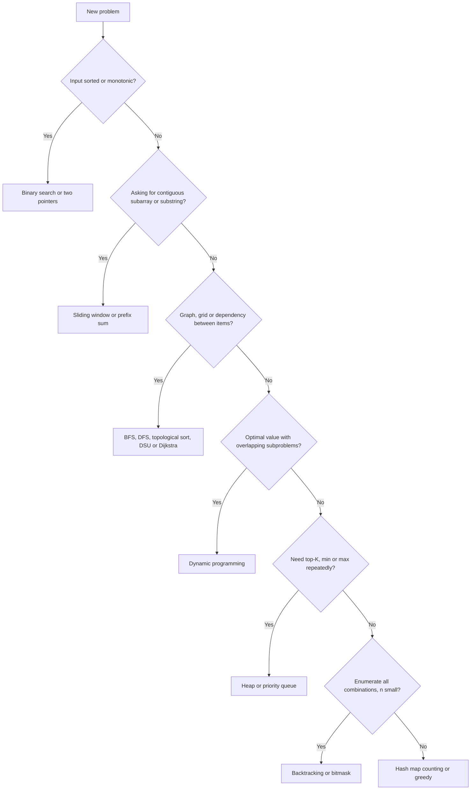

# 16. Pattern Cheatsheet and Problem List

> **TL;DR:** Use the decision table to identify the pattern in < 30 seconds. Then apply the known template. The 100-problem list covers every high-frequency pattern tested at senior level.

**Interview weight:** P1 — this file is a revision accelerator; read it last, or return to it when you can't identify the pattern on a new problem.

---

## Pattern Selection Flow

---

## Problem Smell → Pattern → Complexity Decision Table

| Problem "smell" | Pattern to reach for | Typical complexity |
| --------------- | -------------------- | ------------------ |
| "Subarray / substring with constraint (sum, length, distinct)" | Sliding window or prefix sum | O(n) |
| "Sorted array / search without sort" | Binary search | O(log n) |
| "Minimize maximum / maximize minimum" | Binary search on answer | O(n log(range)) |
| "Top K / Kth largest / smallest" | Min-heap size K | O(n log K) |
| "Running median" | Two heaps | O(n log n) |
| "Merge K sorted things" | K-way heap merge | O(N log K) |
| "Shortest path, unweighted" | BFS | O(V+E) |
| "Shortest path, weighted non-negative" | Dijkstra | O((V+E) log V) |
| "Detect cycle in directed graph / can finish courses" | Topo sort (Kahn's) or 3-color DFS | O(V+E) |
| "Group connected nodes / MST / redundant edge" | Union-Find (DSU) | O(α·E) |
| "Prefix queries on strings / autocomplete" | Trie | O(L) |
| "Pattern matching in string" | KMP / Z-algorithm | O(n+m) |
| "Duplicate substrings / rolling window hash" | Rabin-Karp | O(n) avg |
| "Count / min ways / max value with subproblems" | Dynamic programming | Varies |
| "0/1 item inclusion, weight limit" | 0/1 knapsack DP | O(nW) |
| "Item reuse, target sum" | Unbounded knapsack | O(n·target) |
| "All subsets / enumerate bit patterns" | Bitmask / backtracking | O(2^n) |
| "Permutations / combinations" | Backtracking | O(n!) / O(C(n,k)) |
| "Interval scheduling / max non-overlap" | Greedy sort by end time | O(n log n) |
| "Split into parts to minimize max" | Greedy + binary search on answer | O(n log sum) |
| "Range aggregate with point updates" | Fenwick tree / Segment tree | O(log n) |
| "Multiple queries on subarrays, static" | Prefix sum or sparse table | O(1) query |
| "XOR / find the odd one out" | XOR trick | O(n) |
| "Count elements in range [l,r]" | Sorted list + binary search | O(log n) |
| "Nearest / farthest / bracket balance" | Monotonic stack | O(n) |
| "Sliding window maximum" | Monotonic deque | O(n) |
| "String palindromes" | Expand around center / DP | O(n) / O(n²) |
| "LIS / longest increasing subsequence" | Patience sort + binary search | O(n log n) |
| "N-Queens / Sudoku / constraint CSP" | Backtracking + pruning | Exponential |
| "Closest pair, divide problem by median" | Divide & conquer | O(n log n) |
| "Graph edge weights 0 or 1" | 0-1 BFS (deque) | O(V+E) |
| "All-pairs shortest path (small V)" | Floyd-Warshall | O(V³) |

---

## Complexity Cheat Table — C# Collections

| Collection | Access | Search | Insert (end) | Insert (mid) | Delete | Notes |
| ---------- | ------ | ------ | ------------ | ------------ | ------ | ----- |
| `T[]` array | O(1) | O(n) | N/A (fixed) | N/A | N/A | Fixed size |
| `List<T>` | O(1) | O(n) | O(1) amort. | O(n) | O(n) | Dynamic array; `RemoveAt` is O(n) |
| `LinkedList<T>` | O(n) | O(n) | O(1) | O(1) w/ node | O(1) w/ node | Rarely used; no index access |
| `Dictionary<K,V>` | O(1) avg | O(1) avg | O(1) avg | — | O(1) avg | O(n) worst (hash collision) |
| `HashSet<T>` | — | O(1) avg | O(1) avg | — | O(1) avg | Same as Dictionary |
| `SortedDictionary<K,V>` | O(log n) | O(log n) | O(log n) | O(log n) | O(log n) | Red-Black tree; ordered |
| `SortedSet<T>` | O(log n) | O(log n) | O(log n) | — | O(log n) | Ordered; no duplicates |
| `Queue<T>` | O(1) | O(n) | O(1) amort. | — | O(1) | Dequeue from front |
| `Stack<T>` | O(1) | O(n) | O(1) amort. | — | O(1) | LIFO |
| `PriorityQueue<E,P>` | O(1) peek | — | O(log n) | — | O(log n) | Min by default; no decrease-key |
| `ConcurrentDictionary<K,V>` | O(1) avg | O(1) avg | O(1) avg | — | O(1) avg | Thread-safe; higher constant |

---

## 100 Curated Problems by Pattern

### Two Pointers / Sliding Window (10)

| Problem | LeetCode | Difficulty | Key idea |
| ------- | -------- | ---------- | -------- |
| Two Sum II | 167 | Easy | Converging pointers on sorted array |
| Container With Most Water | 11 | Medium | Maximize width × min-height |
| 3Sum | 15 | Medium | Fix one, two-pointer inner loop |
| Longest Substring Without Repeating | 3 | Medium | Sliding window + char frequency map |
| Minimum Window Substring | 76 | Hard | Expand right; contract left when valid |
| Longest Subarray of 1s after Deletion | 1493 | Medium | Window with at most one 0 |
| Find All Anagrams in a String | 438 | Medium | Fixed-size window + freq array |
| Subarray Sum Equals K | 560 | Medium | Prefix sum + hash map |
| Sliding Window Maximum | 239 | Hard | Monotonic deque |
| Trapping Rain Water | 42 | Hard | Two pointers: max left + max right |

### Binary Search (8)

| Problem | LeetCode | Difficulty | Key idea |
| ------- | -------- | ---------- | -------- |
| Binary Search | 704 | Easy | Template: lo<=hi |
| Find First and Last Position | 34 | Medium | Two binary searches (lower/upper bound) |
| Search in Rotated Sorted Array | 33 | Medium | Identify sorted half |
| Koko Eating Bananas | 875 | Medium | BS on answer: speed |
| Split Array Largest Sum | 410 | Hard | BS on answer: max sum |
| Median of Two Sorted Arrays | 4 | Hard | BS on partition of smaller array |
| Find Minimum in Rotated Array | 153 | Medium | Minimum in unsorted half |
| Capacity to Ship Packages | 1011 | Medium | BS on answer: weight |

### Heaps / Priority Queues (6)

| Problem | LeetCode | Difficulty | Key idea |
| ------- | -------- | ---------- | -------- |
| Kth Largest Element in Array | 215 | Medium | Min-heap size K |
| Top K Frequent Elements | 347 | Medium | Freq map + min-heap |
| Find Median from Data Stream | 295 | Hard | Two heaps |
| Merge K Sorted Lists | 23 | Hard | Min-heap of K heads |
| Task Scheduler | 621 | Medium | Max-heap + cooldown queue |
| K Closest Points to Origin | 973 | Medium | Max-heap on distance |

### Graphs (12)

| Problem | LeetCode | Difficulty | Key idea |
| ------- | -------- | ---------- | -------- |
| Number of Islands | 200 | Medium | DFS/BFS flood fill |
| Clone Graph | 133 | Medium | BFS + hash map old→new |
| Course Schedule | 207 | Medium | Kahn's topological sort |
| Course Schedule II | 210 | Medium | Kahn's; return order |
| Network Delay Time | 743 | Medium | Dijkstra SSSP |
| Cheapest Flights Within K Stops | 787 | Medium | Bellman-Ford K+1 iterations |
| Word Ladder | 127 | Hard | BFS; each word = node |
| Accounts Merge | 721 | Medium | Union-Find on emails |
| Redundant Connection | 684 | Medium | DSU; first false union |
| Pacific Atlantic Water Flow | 417 | Medium | Multi-source BFS from coasts |
| Rotting Oranges | 994 | Medium | Multi-source BFS from all rotten |
| Reconstruct Itinerary | 332 | Hard | Eulerian path via DFS |

### Dynamic Programming (20)

| Problem | LeetCode | Difficulty | Key idea |
| ------- | -------- | ---------- | -------- |
| Climbing Stairs | 70 | Easy | Fibonacci DP |
| House Robber | 198 | Medium | max(dp[i-2]+num, dp[i-1]) |
| House Robber II | 213 | Medium | Run twice on circular array |
| Coin Change | 322 | Medium | Unbounded knapsack |
| Longest Increasing Subsequence | 300 | Medium | O(n log n) patience sort |
| Edit Distance | 72 | Hard | 2D DP; 3 transitions |
| Unique Paths | 62 | Medium | Grid DP |
| Minimum Path Sum | 64 | Medium | Grid DP + in-place |
| Partition Equal Subset Sum | 416 | Medium | 0/1 knapsack bool DP |
| Target Sum | 494 | Medium | Subset sum or knapsack |
| Longest Common Subsequence | 1143 | Medium | 2D LCS table |
| Word Break | 139 | Medium | dp[i] = any split valid |
| Decode Ways | 91 | Medium | 1-2 digit DP with edge cases |
| Burst Balloons | 312 | Hard | Interval DP, last burst |
| Palindrome Partitioning II | 132 | Hard | isPalin precompute + 1D DP |
| Russian Doll Envelopes | 354 | Hard | 2D LIS |
| Maximum Profit in Job Scheduling | 1235 | Hard | Sort by end + BS + DP |
| Shortest Path Visiting All Nodes | 847 | Hard | Bitmask DP + BFS |
| Interleaving String | 97 | Hard | 2D DP boolean table |
| Distinct Subsequences | 115 | Hard | 2D DP counting |

### Backtracking (8)

| Problem | LeetCode | Difficulty | Key idea |
| ------- | -------- | ---------- | -------- |
| Subsets | 78 | Medium | DFS from each index |
| Subsets II | 90 | Medium | Sort + skip duplicate branches |
| Permutations | 46 | Medium | `used[]` boolean array |
| Permutations II | 47 | Medium | Sort + skip same value at same depth |
| Combination Sum | 39 | Medium | Reuse allowed: same i |
| N-Queens | 51 | Hard | col + diag1 + diag2 tracking |
| Sudoku Solver | 37 | Hard | Row/col/box validity, prune early |
| Word Search | 79 | Medium | DFS + in-place marking |

### Greedy (6)

| Problem | LeetCode | Difficulty | Key idea |
| ------- | -------- | ---------- | -------- |
| Jump Game | 55 | Medium | Track farthest reachable |
| Jump Game II | 45 | Medium | BFS level-max reach |
| Non-overlapping Intervals | 435 | Medium | Sort by end; greedy select |
| Minimum Number of Arrows | 452 | Medium | Sort by end; one arrow per overlap |
| Partition Labels | 763 | Medium | Extend to last occurrence |
| Gas Station | 134 | Medium | Total gas check + reset start |

### Tries / String (6)

| Problem | LeetCode | Difficulty | Key idea |
| ------- | -------- | ---------- | -------- |
| Implement Trie | 208 | Medium | Standard trie with IsEnd |
| Word Search II | 212 | Hard | Trie + grid DFS |
| Design Add and Search Words | 211 | Medium | Trie with wildcard DFS |
| Longest Duplicate Substring | 1044 | Hard | BS on length + rolling hash |
| Shortest Palindrome | 214 | Hard | KMP on s + '#' + rev(s) |
| Palindromic Substrings | 647 | Medium | Expand around center |

### Bit Manipulation / Math (8)

| Problem | LeetCode | Difficulty | Key idea |
| ------- | -------- | ---------- | -------- |
| Single Number | 136 | Easy | XOR all |
| Single Number II | 137 | Medium | Bits mod 3 |
| Single Number III | 260 | Medium | XOR split by differing bit |
| Missing Number | 268 | Easy | XOR or sum |
| Reverse Bits | 190 | Easy | Loop 32 times |
| Number of 1 Bits | 191 | Easy | `x &= x-1` loop |
| Power of Two | 231 | Easy | `x & (x-1) == 0` |
| Counting Bits | 338 | Easy | DP: `dp[i] = dp[i>>1] + (i&1)` |

### Divide & Conquer (4)

| Problem | LeetCode | Difficulty | Key idea |
| ------- | -------- | ---------- | -------- |
| Kth Largest Element (Quickselect) | 215 | Medium | Partial partition |
| Count of Smaller Numbers After Self | 315 | Hard | Merge sort + count inversions |
| Median of Two Sorted Arrays | 4 | Hard | Binary search partition |
| Maximum Subarray | 53 | Medium | Kadane's or D&C O(n log n) |

### Advanced Structures (4)

| Problem | LeetCode | Difficulty | Key idea |
| ------- | -------- | ---------- | -------- |
| Range Sum Query - Mutable | 307 | Medium | Fenwick tree or segment tree |
| Count of Range Sum | 327 | Hard | Merge sort / Fenwick + coord compress |
| The Skyline Problem | 218 | Hard | Sweep line + max-heap |
| LRU Cache | 146 | Medium | Dict + doubly linked list |

---

## 7-Day DSA Revision Plan

| Day | Topics | Key problems |
| --- | ------ | ------------ |
| 1 | Arrays, Strings, Two Pointers, Sliding Window | 3, 11, 15, 42, 76, 239 |
| 2 | Binary Search, Heaps, Sorting | 34, 33, 215, 295, 23, 875 |
| 3 | Linked Lists, Stack, Queue, Monotonic Stack | 206, 146, 84, 739, 232 |
| 4 | Trees (BT traversals, BST, LCA) | 102, 104, 236, 230, 543 |
| 5 | Graphs: BFS/DFS, Topo Sort, Dijkstra, DSU | 200, 207, 743, 721, 994 |
| 6 | Dynamic Programming (all families) | 70, 198, 322, 300, 72, 416, 312 |
| 7 | Backtracking, Greedy, Tries, Bit Manipulation | 78, 46, 51, 55, 208, 136 |

---

## 2-Day DSA Blitz Plan

| Day | Focus | Problems |
| --- | ----- | -------- |
| Day 1 AM | Arrays + Binary Search + Heaps | 3, 76, 215, 295, 875 |
| Day 1 PM | Graphs: BFS/DFS/Topo/DSU | 200, 207, 210, 743, 994 |
| Day 2 AM | DP: Knapsack + LCS + House Robber + Grid | 198, 322, 1143, 72, 416 |
| Day 2 PM | Backtracking + Greedy + Quick review | 78, 46, 55, 435, 208 |

---

## Interview Questions

**Q1. Walk me through your approach when you see a new coding problem.**
A: (1) Read and restate in own words. (2) Clarify constraints (n, range, duplicates, edge cases). (3) Identify the pattern from problem "smell." (4) State complexity of naive approach. (5) Reason about the bottleneck → apply the right pattern. (6) Code the solution top-down, naming variables clearly. (7) Trace through an example mentally. (8) State time and space complexity.

**Q2. How do you choose between BFS and DFS for a graph problem?**
A: BFS for shortest path (unweighted), level-by-level processing, minimum steps. DFS for cycle detection, topological sort, connected components, exhaustive path search. BFS uses O(width) queue memory; DFS uses O(depth) stack memory. For deep graphs with small branching factor, DFS is more memory-efficient.

**Q3. When should you prefer memoization over tabulation?**
A: Memoization: when the state space is sparse (not all subproblems are needed), when the recurrence is more naturally expressed recursively, or when the evaluation order is hard to determine. Tabulation: when all states will be computed, when cache overhead matters, or when you need to optimize space with rolling arrays.

**Q4. How do you recognize a "binary search on answer" problem?**
A: Keywords: "minimum maximum," "maximum minimum," "at most K operations." Check: if you define `CanAchieve(x)`, does it have a monotone threshold? (True for all x ≥ threshold, false below it, or vice versa.) If yes, binary search on that threshold. Domain = [worst single element, worst case sum].

**Q5. What is amortized O(1) and how does it apply to `List<T>.Add`?**
A: Amortized analysis spreads the cost of occasional expensive operations over many cheap ones. `List<T>` doubles capacity when full (cost O(n)) but this happens rarely. Total cost for n adds = O(n) (sum of doubling costs: 1+2+4+...+n ≈ 2n). Per-operation amortized cost = O(1).

**Q6. Explain the master theorem and give an example.**
A: `T(n) = aT(n/b) + f(n)`. Compare `f(n)` with `n^(log_b(a))`:
- Case 1: `f(n) = O(n^(log_b(a)-ε))` → T(n) = Θ(n^log_b(a)).
- Case 2: `f(n) = Θ(n^log_b(a))` → T(n) = Θ(n^log_b(a) · log n).
- Case 3: `f(n) = Ω(n^(log_b(a)+ε))` → T(n) = Θ(f(n)).
Example: merge sort `T(n) = 2T(n/2) + O(n)` → Case 2 → O(n log n).

**Q7. How do you analyze space complexity for recursive algorithms?**
A: Stack space = max depth of recursion × space per frame. Merge sort: O(log n) depth × O(n) merge arrays → O(n) total. DFS on tree: O(h) where h = height. Memoized recursion: O(states) space for cache + O(depth) stack.

**Q8. What is the difference between O(log n) and O(log log n) in practice?**
A: For n=10^9: `log n ≈ 30`, `log log n ≈ 5`. The difference is small but matters in tight-performance scenarios. `log log n` appears in: van Emde Boas trees, some advanced data structures, AKS primality. In interviews, rarely the deciding factor.

**Q9. When would O(n²) be acceptable in a production coding interview?**
A: When n ≤ 1000 and the time limit is lenient. In interviews, state "naive is O(n²); can we do better?" then optimize if needed. Acceptable when n < 500 and the constant factor is tiny (simple inner loop vs complex log-n structure). Senior candidates should recognize when O(n²) is fine vs when it times out.

**Q10. How do you handle the edge cases systematically?**
A: (1) Empty input (null, empty array/string). (2) Single element. (3) All elements identical. (4) Already sorted (best and worst cases for quicksort). (5) Integer overflow (use `long`, `checked`). (6) Negative numbers. (7) Circular structures. (8) Disconnected graphs. State these explicitly before coding.

**Q11. What is the time complexity of `Dictionary<K,V>` operations in C# and when can it degrade?**
A: Average O(1) for Get/Set/ContainsKey. Worst case O(n) when all keys hash to the same bucket (hash collision attack). .NET 5+ uses randomized hash seeds for strings to prevent DOS via hash flooding. For custom types, implement `GetHashCode` and `Equals` correctly.

**Q12. How do you compare two algorithms with the same asymptotic complexity?**
A: Consider: (1) constant factor (simpler inner loop); (2) cache behavior (sequential access vs random); (3) memory allocation (fewer allocations = less GC pressure in .NET); (4) worst-case vs average-case behavior; (5) ease of implementation (bug risk). Benchmark with realistic input sizes.

**Q13. Explain the difference between P, NP, and NP-complete in interview context.**
A: P = problems solvable in polynomial time (sorting, shortest path). NP = problems whose solutions can be verified in polynomial time (TSP, subset sum for large n). NP-complete = hardest problems in NP; if any NP-complete is in P, then P=NP (unsolved). Interview relevance: recognize when a problem (like TSP, 3-SAT) is NP-complete → don't try to find a polynomial exact algorithm; use approximation/heuristics/DP-for-small-n.

**Q14. How do you estimate if your solution will pass the time limit in a coding interview?**
A: Rule of thumb: modern judge ~10^8–10^9 operations/second. Map n to expected operations:
- n=10^6, O(n): ~10^6 ops → fine.
- n=10^4, O(n²): ~10^8 → borderline.
- n=10^3, O(n³): ~10^9 → probably TLE.
- n=20, O(2^n): ~10^6 → fine.
State your estimate out loud — interviewers value this reasoning.

**Q15. What are the most common sources of incorrect solutions in coding interviews?**
A: (1) Off-by-one errors in binary search (wrong loop condition, mid+1 vs mid). (2) Integer overflow (forget to cast to `long`). (3) Not handling null/empty inputs. (4) Wrong array initialization (0 vs int.MaxValue for min-DP). (5) Forgetting to undo state in backtracking. (6) Misidentifying the pattern (greedy when DP needed). (7) Modifying the input array when the problem says not to.

---

## Quick Recap

- Decision table: memorize 10 core smells → patterns (sliding window, binary search on answer, heap, graph BFS/DFS, DP, backtracking, greedy, trie, XOR, segment tree).
- Collection complexities: `Dictionary` O(1) avg; `SortedDictionary` O(log n); `List` O(1) amortized append; `PriorityQueue` O(log n) enqueue/dequeue.
- 7-day plan: Arrays/Strings → Binary Search/Heaps → Lists/Stacks → Trees → Graphs → DP → Backtracking/Greedy.
- 2-day blitz: skip trees/advanced; hit the highest-frequency patterns only.
- Estimate time complexity before coding — state it out loud.
- Edge cases: empty, single, overflow, negative, already sorted, disconnected.
- "Binary search on answer" trigger: "minimize maximum" or "maximize minimum."
- Greedy vs DP: greedy if exchange argument holds; DP if greedy fails on a 5-element counterexample.
