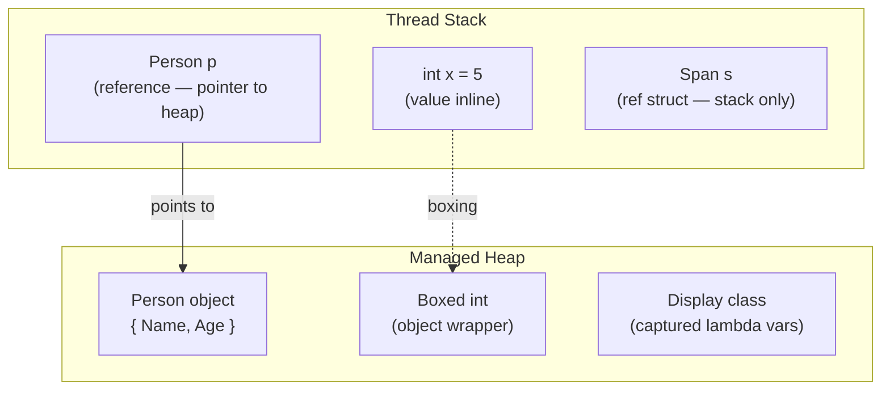

# 1. Language Fundamentals & Type System

> **TL;DR:** C# types are either value types (copied on assignment, usually stack-allocated) or reference types (heap-allocated, pointer semantics). Boxing, `struct` design, `Span<T>`, nullable, and pattern matching are the interview battlegrounds.

**Interview weight:** P0 — nearly every C# interview starts here; internals questions expose depth quickly.

---

## Core Concepts

- **Value type** — inherits from `System.ValueType`; stored inline; copied on assignment. Examples: `int`, `double`, `bool`, `struct`, `enum`, `record struct`.
- **Reference type** — object on the managed heap; variable holds a pointer. Examples: `class`, `interface`, `delegate`, `record` (class-based), `string`, arrays.
- **Stack** — per-thread, LIFO, typically 1–8 MB; stores local value-type variables and reference-type *pointers*.
- **Heap** — managed by the GC; stores reference-type *objects* and boxed value types.

### The "stack vs heap" myth

The real rule is **lifetime and ownership**, not type. A `struct` field inside a class lives on the heap (inside the class object). A local `int` captured by a lambda lives on the heap (compiler lifts it into a display class). The CLR allocates where it needs to for correctness.



---

## Boxing & Unboxing

- **Boxing** — wraps a value type in a heap-allocated `object`; costs an allocation + copy.
- **Unboxing** — extracts value back; costs a cast check + copy. If cast fails → `InvalidCastException`.
- **Cost:** each boxing = ~10–50 ns + GC pressure. In hot paths (e.g. `ArrayList`, non-generic collections, `string.Format` with value types before .NET 6 interpolation improvements), boxing accumulates.

```csharp
int n = 42;
object o = n;          // boxing — heap alloc
int m = (int)o;        // unboxing — cast + copy
object bad = (long)o;  // InvalidCastException — must match exact type

// Avoid via generics:
List<int> ints = new();  // no boxing
```

---

## struct vs class vs record vs record struct

| Aspect | `struct` | `class` | `record` (class) | `record struct` |
| ------ | -------- | ------- | ---------------- | --------------- |
| Base type | `ValueType` | `object` | `object` | `ValueType` |
| Allocation | inline / stack | heap | heap | inline / stack |
| Copy semantics | copy on assign | copy pointer | copy pointer | copy on assign |
| Default equality | member-by-member | reference | value (synthesized) | value (synthesized) |
| `==` operator | not defined (use `Equals`) unless overloaded | reference | value (auto) | value (auto) |
| Mutable | yes (avoid) | yes | `init`-only by default | yes (or `readonly record struct`) |
| Inheritance | no (can impl interfaces) | yes | yes (record : record) | no |
| `with` expression | .NET 10+ / `record struct` yes | no | yes | yes |
| Pattern matching target | yes | yes | yes + positional | yes + positional |
| Nullable | `T?` = `Nullable<T>` | `T?` (NRT annotation) | `T?` (NRT annotation) | `T?` = `Nullable<T>` |
| Primary constructors (.NET 8+) | yes | yes | built-in | built-in |

### When to use `struct`

- Size ≤ 16 bytes (rule of thumb; larger structs can hurt passing by value).
- Immutable or short-lived value semantics (coordinates, RGB, `DateOnly`).
- Avoid virtual dispatch on hot paths.
- Mark as `readonly struct` to prevent defensive copies when passed to `in` params.

```csharp
readonly record struct Point(double X, double Y); // immutable, value equality, Deconstruct free

// .NET 8 primary constructor on class:
public class OrderService(IRepository repo, ILogger<OrderService> logger)
{
    public async Task ProcessAsync(Order order) => await repo.SaveAsync(order);
}
```

---

## ref / out / in / ref readonly / ref struct

| Modifier | Direction | Null allowed | Notes |
| -------- | --------- | ------------ | ----- |
| `ref` | in + out | no (must be init'd) | Alias to caller's variable |
| `out` | out only | no (must be set before return) | Common for Try-patterns |
| `in` | in only (readonly ref) | no | Avoids copy; compiler inserts defensive copy if struct isn't `readonly` |
| `ref readonly` (.NET 7+) | in only | no | Return readonly ref from method |
| `ref struct` | — | no heap | Type may not escape stack; contains `ref` fields |

```csharp
static bool TryParse(ReadOnlySpan<char> input, out int value)
{
    value = 0;
    return int.TryParse(input, out value);
}

// ref return — return alias to array slot:
ref int Find(int[] arr, int i) => ref arr[i];
```

---

## Span\<T\> / Memory\<T\> / ReadOnlySpan\<T\>

- **`Span<T>`** — stack-only (`ref struct`) view over contiguous memory (array, stack, native). Zero-copy slicing; cannot be stored on heap or captured in lambdas.
- **`ReadOnlySpan<T>`** — `Span<T>` but read-only; accepted by most BCL parsing APIs.
- **`Memory<T>`** — heap-safe wrapper; can be stored as a field, passed across `await` boundaries; slightly more overhead.
- Use `stackalloc` + `Span<T>` for small temporary buffers to eliminate heap allocations.

```csharp
void Process(ReadOnlySpan<byte> data)
{
    var header = data[..4];     // no allocation
    var payload = data[4..];
}

// stackalloc — stack buffer, no GC:
Span<int> buf = stackalloc int[128];
```

---

## String Interning, Immutability & StringBuilder

- `string` is **immutable** reference type; every "modification" creates a new object.
- **Interning** — CLR maintains a string intern pool; identical string *literals* at compile time are the same reference. `string.Intern(s)` forces runtime interning.
- `string.IsInterned` returns null if not interned.
- **`StringBuilder`** — mutable buffer; use when building strings in a loop (> ~5 concatenations). Pre-size with `new StringBuilder(capacity)` to avoid internal resizing.

```csharp
string a = "hello";
string b = "hello";
Console.WriteLine(ReferenceEquals(a, b)); // true — interned literals

string c = new string(new[] {'h','e','l','l','o'});
Console.WriteLine(ReferenceEquals(a, c)); // false — runtime allocation, not interned
Console.WriteLine(ReferenceEquals(a, string.Intern(c))); // true after intern
```

---

## Nullable Reference Types (NRT) & Null Operators

- Enabled by `<Nullable>enable</Nullable>` in project file (default in .NET 8 templates).
- `T?` on reference types is a *compile-time annotation*, not runtime; no Nullable<T> wrapper.
- `!` — null-forgiving operator; silences the warning; does nothing at runtime.
- `?.` — null-conditional; returns null if left is null.
- `??` — null-coalescing; returns right if left is null.
- `??=` — null-coalescing assignment; assigns only if left is null.

```csharp
string? name = GetName();         // nullable annotation
int len = name?.Length ?? 0;      // safe access + default
name ??= "default";               // assign if null
string forced = name!;            // suppress warning — you assert non-null
```

---

## Pattern Matching

```csharp
// Switch expression with property, relational, and list patterns (.NET 8):
string Classify(object obj) => obj switch
{
    int n when n < 0         => "negative int",
    int n                    => $"int {n}",
    string { Length: 0 }     => "empty string",
    string s                 => $"string '{s}'",
    IEnumerable<int> [var first, ..] => $"starts with {first}",
    null                     => "null",
    _                        => "unknown"
};

// Type pattern + deconstruction:
if (shape is Rectangle { Width: var w, Height: var h })
    Console.WriteLine(w * h);
```

- **List patterns** (.NET 7+): `[first, second, ..]`, `[.., last]`, `[1, 2, 3]` exact.
- **Relational patterns**: `> 0`, `<= 100`.
- **Property patterns**: `{ Property: pattern }`.

---

## Equality

| Method | Semantic | Overridable | Notes |
| ------ | -------- | ----------- | ----- |
| `==` | Depends on type | via `operator ==` | Reference eq for classes by default; value eq for structs/records |
| `Equals(object)` | Logical equality | override in class | `record` auto-generates |
| `ReferenceEquals(a,b)` | Physical pointer equality | no | Always reference; never use for value types |
| `IEquatable<T>.Equals(T)` | Typed logical equality | implement | Avoids boxing; used by collections |

**`GetHashCode` contract:**
1. If `a.Equals(b)` is true → `a.GetHashCode() == b.GetHashCode()` **must** be true.
2. Hash must not change while object is in a hash-based collection.
3. Unequal objects *should* (but need not) have different hashes.

```csharp
record Product(int Id, string Name);  // GetHashCode & Equals auto-generated
// For manual: HashCode.Combine(Id, Name)
```

---

## const vs readonly vs static readonly

| | `const` | `readonly` | `static readonly` |
| - | ------- | ---------- | ----------------- |
| Evaluation time | Compile time | Runtime (constructor) | Runtime (type init) |
| Type allowed | Primitives + string | Any | Any |
| `static` | Implicitly static | Instance or static | Static |
| Inlined by compiler | Yes — IL literal | No | No |
| Versioning risk | Yes — recompile consumers | No | No |

---

## Implicit/Explicit Conversions, dynamic, var, object

- **`var`** — compile-time type inference; strongly typed; no runtime overhead.
- **`dynamic`** — resolved at runtime via DLR; loses IntelliSense; boxing for value types; use for interop (COM, JSON dynamic).
- **`object`** — base of all types; requires cast to use members.

---

## Tuples & Deconstruction

```csharp
(string Name, int Age) person = ("Alice", 30);
var (name, age) = person;  // deconstruct

// Value tuple in method return:
(int Min, int Max) Range(int[] arr) => (arr.Min(), arr.Max());
```

---

## Extension Methods

- `static` method in `static` class; first parameter prefixed with `this`.
- Resolved at compile time — no polymorphism, no access to private members.

```csharp
public static class StringExtensions
{
    public static bool IsNullOrEmpty(this string? s) => string.IsNullOrEmpty(s);
}
```

---

## params, Iterators & yield return

```csharp
// params — variable-length argument list:
int Sum(params int[] values) => values.Sum();

// yield return — compiler generates a state machine implementing IEnumerator<T>:
IEnumerable<int> Evens(int max)
{
    for (int i = 0; i <= max; i += 2)
        yield return i;  // pauses here, resumes on next MoveNext()
}
```

**State machine:** compiler transforms iterator method into a class with a `state` field and a `MoveNext()` switch. First call runs up to first `yield return`; subsequent calls resume from `state`.

---

## Interview Questions

**Q1. What is boxing and when does it occur?**
A: Wrapping a value type in a heap `object`. Occurs when assigning `int` to `object`/`interface` variable, passing to non-generic API (`ArrayList.Add(42)`), or using `string.Format` with value-type args pre-.NET 6. Cost: allocation + copy.

**Q2. Difference between `readonly` field and `const`?**
A: `const` is inlined by the compiler at call sites — changing it requires recompiling all consumers (versioning hazard). `readonly` is evaluated at runtime in the constructor; safe to update in a library without recompiling consumers.

**Q3. Why is `readonly struct` important with `in` parameters?**
A: Without `readonly`, the JIT emits a *defensive copy* before calling any method on an `in` struct (because it can't verify the method won't mutate it). `readonly struct` tells the compiler no mutation occurs → no copy → zero-overhead pass-by-reference.

**Q4. When would you pick `record struct` over `record`?**
A: `record struct` when you need value semantics + value equality + `with`-expressions but *also* stack allocation / no heap pressure — e.g., a hot-path coordinate or a small message envelope. Drawback: `record struct` is mutable by default; use `readonly record struct` to enforce immutability.

**Q5. How does `Span<T>` differ from `Memory<T>`?**
A: `Span<T>` is a `ref struct` — stack only; cannot be stored in class fields or cross `await`/`yield`. `Memory<T>` is a heap-safe wrapper; can be stored and passed across async boundaries. Use `Span<T>` for synchronous parsing; `Memory<T>` when you need async pipeline.

**Q6. Explain the `GetHashCode` contract and what breaks if you violate it.**
A: Equal objects must have equal hashes. If violated, `Dictionary<K,V>` and `HashSet<T>` silently lose items — they hash to bucket A, but `Equals` is never called because the item lands in bucket B. Rule 2: hash must be stable while object is in a collection — mutating a key after insertion permanently loses the entry.

**Q7. What does the compiler do with an iterator method (`yield return`)?**
A: Transforms it into a state-machine class implementing `IEnumerator<T>`/`IEnumerable<T>`. Each `yield return` is a numbered state; `MoveNext()` contains a switch over states; local variables become class fields. The method body does not execute until `MoveNext()` is first called (deferred execution).

**Q8. What are the risks of `dynamic`?**
A: No compile-time type safety; runtime `RuntimeBinderException` on bad member access; DLR reflection overhead (~100–1000× slower than static dispatch in tight loops); loses refactoring/rename support. Justified for COM interop, `ExpandoObject`, or deserializing loosely-typed JSON where shape is truly unknown.

**Q9. Pattern matching: how do list patterns work and what's the CLR representation?**
A: `[1, 2, ..]` checks `Length >= 2` and `[0]==1`, `[1]==2` — the compiler generates `IndexerLength`/`Index` calls, not a new collection. `..` is a range discard that matches zero or more elements. The type must implement a `Length`/`Count` property and indexer, or implement `IEnumerable<T>` with `Count()`.

**Q10. What is the null-forgiving operator `!` and when is it safe to use?**
A: Compile-time annotation only — the `!` operator emits *no* IL; it just suppresses the nullable warning. Safe when you have external knowledge the value is non-null (e.g., after a guard check in a different code path, or calling a legacy API known to never return null). Dangerous if the assumption is wrong — you get `NullReferenceException` with no warning.

**Q11. Senior — trade-off: struct vs class for a high-frequency event message (1M/s)?**
A: With `struct`, 1M messages/s = no heap allocations, no GC pressure, cache-friendly if stored in `T[]` or `Span<T>`. However, structs > 16 bytes cost more to copy than passing a reference. If the struct is `readonly` and passed by `in`/`ref`, no copy occurs. For a value-like message (OrderId, Timestamp, Price), `readonly record struct` is ideal. If messages carry variable-length data (arrays, strings), `class` is necessary — but consider `ArrayPool<T>` and object pooling.

**Q12. Senior — explain NRT's limitations at runtime.**
A: NRT is a *static analysis* feature — all annotations are erased in IL (as `[Nullable]` attributes for tooling, but not enforced). At runtime, `string?` and `string` are identical. Reflection-based deserialization (JSON, EF Core) can still set non-nullable properties to null. Guard with `ArgumentNullException.ThrowIfNull` in public APIs. NRT's value is shift-left: catching nulls at compile time in your own code, not protecting against external input.

**Q13. Senior — how does `ref readonly return` improve performance in a hot ECS (Entity Component System)?**
A: In game-style ECS, components are stored in `T[]` arrays for cache locality. `ref readonly` returns a reference to the array element, not a copy. Caller gets read-only access with zero copy cost. Without it, returning a 64-byte `Transform` struct copies 64 bytes per access — at 100K entities × 60 fps = 384 MB/s of unnecessary copying.

**Q14. Senior — string interning: when is it a memory leak?**
A: `string.Intern` keeps the string alive for the process lifetime in the intern pool (a GC root). Interning dynamic/user-generated strings (e.g. player usernames, request IDs) = unbounded heap growth, never collected. Use interning only for a fixed-cardinality set of well-known strings (enum-like identifiers, protocol verbs).

**Q15. Senior — primary constructors (.NET 8) vs constructor-injected fields: what's the risk?**
A: Primary constructor parameters are captured directly — they become hidden compiler-generated fields with no access modifier. If you accidentally use a parameter name that shadows a property, you may reference the original injected value instead of a modified property. Also, primary constructor params are implicitly `private` captured fields, not properties — they won't serialize or appear in debugger "auto" view by default. Explicitly expose as properties if needed.

---

## Quick Recap

- Value types live inline; reference types live on heap — but *location depends on lifetime*, not just type category.
- Boxing = heap alloc + copy; avoid in hot paths with generics.
- `readonly struct` + `in` param = zero-copy pass-by-reference for structs.
- `Span<T>` = stack-only zero-alloc slice; `Memory<T>` = heap-safe async-capable version.
- `record` = value equality + `with` on class; `record struct` = same but value-type.
- NRT is compile-time only — guard public APIs with `ArgumentNullException.ThrowIfNull`.
- `GetHashCode` contract: equal objects must hash equal; hash must be stable during collection membership.
- `const` inlined by compiler = recompile risk; prefer `static readonly` for public library constants.
