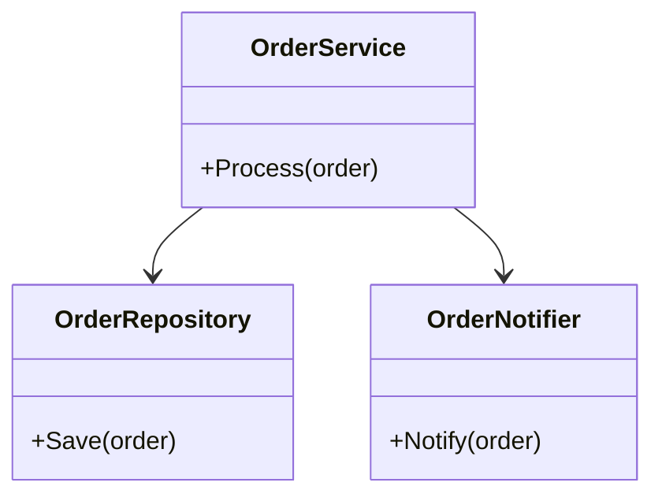
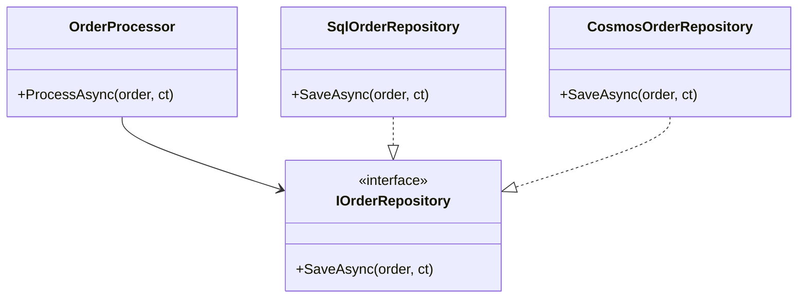

# 2. OOP & SOLID

> **TL;DR:** Four pillars (encapsulation, inheritance, polymorphism, abstraction) are table stakes; SOLID is the real interview battleground — every violation you name should come with a before/after example.

**Interview weight:** P0 — heavily probed at senior/lead level; interviewers expect you to relate every principle to production code, not textbook definitions.

---

## The Four Pillars

- **Encapsulation** — bundle data + behaviour; hide implementation behind access modifiers. Protect invariants (`private set`, `init`, property validation).
- **Inheritance** — share and specialise behaviour through an is-a hierarchy. Overuse leads to fragile base class problem.
- **Polymorphism** — one interface, multiple implementations. Runtime (virtual dispatch) vs compile-time (overloading, generics).
- **Abstraction** — expose *what*, hide *how*. Interfaces and abstract classes are the primary C# tools.

---

## Abstract Class vs Interface

| Aspect | `abstract class` | `interface` |
| ------ | ---------------- | ----------- |
| Instantiation | No | No |
| Multiple inheritance | No (single base class) | Yes (multiple interfaces) |
| State (fields) | Yes | No (properties only) |
| Access modifiers on members | Yes | All public by default (.NET 8); `private`/`protected` allowed in default methods |
| Default implementations | Yes | Yes (.NET 8 default interface methods — DIM) |
| Constructor | Yes (called via `base()`) | No |
| `static abstract` members | No | Yes (.NET 7+ — for generic math `INumber<T>`) |
| Best use | Shared implementation + is-a hierarchy | Contract/capability without coupling to hierarchy |
| Versioning | Adding members is non-breaking | Adding members *without* default impl is breaking |

**Default Interface Methods (DIM)** — allow adding new methods to an interface without breaking existing implementors. Accessed only through the interface type, not the concrete class (unless explicitly cast). Use sparingly; can create confusion about where behaviour lives.

```csharp
public interface ISerializer
{
    byte[] Serialize(object obj);

    // DIM — default impl so existing classes don't break:
    string SerializeToJson(object obj) => System.Text.Json.JsonSerializer.Serialize(obj);
}
```

---

## virtual / override / new / sealed

```csharp
class Animal
{
    public virtual string Speak() => "...";
    public string Name => "Animal";           // non-virtual
}

class Dog : Animal
{
    public override string Speak() => "Woof"; // runtime polymorphism
    public new string Name => "Dog";           // METHOD HIDING — hides base, breaks polymorphism!
}

Animal a = new Dog();
Console.WriteLine(a.Speak()); // "Woof"   — override dispatches to Dog
Console.WriteLine(a.Name);    // "Animal" — new/hide does NOT dispatch; uses compile-time type!
```

- **`override`** — replaces base in vtable; polymorphic dispatch works.
- **`new`** — hides base member; NOT in vtable; declared type determines which is called. **Gotcha:** easy to introduce by accident when base class adds a member with the same name.
- **`sealed override`** — prevents further overriding; also a JIT perf hint (allows devirtualisation).

---

## static abstract Members in Interfaces

```csharp
// Generic math (.NET 7+):
interface IAddable<T> where T : IAddable<T>
{
    static abstract T operator +(T left, T right);
    static abstract T Zero { get; }
}

static T Sum<T>(IEnumerable<T> items) where T : IAddable<T>
    => items.Aggregate(T.Zero, (a, b) => a + b);
```

---

## SOLID

### S — Single Responsibility Principle

> A class should have one reason to change.

```csharp
// BAD — OrderService serialises AND persists AND sends email:
class OrderService
{
    public void Process(Order o)
    {
        var json = JsonSerializer.Serialize(o);
        File.WriteAllText("order.json", json);
        SmtpClient.Send(o.CustomerEmail, "Confirmed");
    }
}

// GOOD — each concern in its own class:
class OrderSerializer  { public string Serialize(Order o) => JsonSerializer.Serialize(o); }
class OrderRepository  { public void Save(Order o) { /* DB */ } }
class OrderNotifier    { public void Notify(Order o) { /* SMTP */ } }
class OrderService
{
    public void Process(Order o)
    {
        _repo.Save(o);
        _notifier.Notify(o);
    }
}
```



---

### O — Open/Closed Principle

> Open for extension, closed for modification. Add behaviour without editing existing code.

```csharp
// BAD — switch on type = modify class for every new discount:
decimal CalcDiscount(Customer c)
{
    if (c.Type == "Gold")   return 0.20m;
    if (c.Type == "Silver") return 0.10m;
    return 0;
}

// GOOD — strategy/polymorphism; new discount = new class, no change to CalcDiscount:
interface IDiscountStrategy { decimal Calculate(Customer c); }
class GoldDiscount   : IDiscountStrategy { public decimal Calculate(Customer c) => 0.20m; }
class SilverDiscount : IDiscountStrategy { public decimal Calculate(Customer c) => 0.10m; }

class PricingEngine
{
    private readonly IEnumerable<IDiscountStrategy> _strategies;
    public decimal GetDiscount(Customer c)
        => _strategies.FirstOrDefault(s => s.Applies(c))?.Calculate(c) ?? 0;
}
```

---

### L — Liskov Substitution Principle

> Subtypes must be substitutable for their base type without altering correctness.

```csharp
// BAD — Square "is-a" Rectangle violates LSP:
class Rectangle { public virtual int Width { get; set; } public virtual int Height { get; set; } }
class Square : Rectangle
{
    public override int Width  { set => base.Width = base.Height = value; }
    public override int Height { set => base.Width = base.Height = value; }
}

void SetWidth(Rectangle r) { r.Width = 5; }
var s = new Square();
SetWidth(s); // also sets height — surprises caller!

// GOOD — use interface abstraction or composition; don't force the hierarchy.
interface IShape { int Area(); }
record RectangleShape(int W, int H) : IShape { public int Area() => W * H; }
record SquareShape(int Side)        : IShape { public int Area() => Side * Side; }
```

---

### I — Interface Segregation Principle

> Clients should not depend on methods they don't use.

```csharp
// BAD — fat interface forces no-op implementations:
interface IWorker { void Work(); void Eat(); void Sleep(); }
class Robot : IWorker
{
    public void Work() { /* fine */ }
    public void Eat()  => throw new NotImplementedException(); // robots don't eat
    public void Sleep()=> throw new NotImplementedException();
}

// GOOD — split interfaces:
interface IWorkable  { void Work(); }
interface IRestable  { void Eat(); void Sleep(); }
class Robot : IWorkable { public void Work() { } }
class Human : IWorkable, IRestable { public void Work() { } public void Eat() { } public void Sleep() { } }
```

---

### D — Dependency Inversion Principle

> High-level modules should not depend on low-level modules. Both should depend on abstractions.

```csharp
// BAD — high-level OrderProcessor depends on concrete SqlOrderRepository:
class OrderProcessor
{
    private readonly SqlOrderRepository _repo = new SqlOrderRepository();
    public void Process(Order o) => _repo.Save(o);
}

// GOOD — depend on interface; inject via DI container:
interface IOrderRepository { Task SaveAsync(Order o, CancellationToken ct); }
class SqlOrderRepository   : IOrderRepository { /* impl */ }
class CosmosOrderRepository: IOrderRepository { /* impl */ }

class OrderProcessor
{
    private readonly IOrderRepository _repo;
    public OrderProcessor(IOrderRepository repo) => _repo = repo;  // injected
    public Task ProcessAsync(Order o, CancellationToken ct) => _repo.SaveAsync(o, ct);
}
```



---

## Composition over Inheritance

Prefer assembling behaviour from small collaborators over deep class hierarchies.

```csharp
// Inheritance — fragile base class, can't reuse without the hierarchy:
class FileLogger : BaseLogger { ... }
class DatabaseLogger : BaseLogger { ... }

// Composition — inject the sink; logger reusable with any sink:
class Logger
{
    private readonly ILogSink _sink;
    public Logger(ILogSink sink) => _sink = sink;
    public void Log(string msg) => _sink.Write(msg);
}
```

---

## DRY / KISS / YAGNI

- **DRY** (Don't Repeat Yourself) — single authoritative source of knowledge. Violation: copy-pasted business rules diverge silently.
- **KISS** (Keep It Simple, Stupid) — prefer simplest solution that works. Over-engineering for non-existent requirements = maintenance burden.
- **YAGNI** (You Aren't Gonna Need It) — don't add flexibility "just in case". Add it when needed; the requirements you anticipate rarely arrive.

---

## Law of Demeter (Principle of Least Knowledge)

A method should talk only to its immediate friends (its own fields, parameters, objects it creates).

```csharp
// Violation — chain navigation exposes internal structure:
decimal tax = order.Customer.Address.Country.TaxRate;

// Fix — add a method that encapsulates the chain:
decimal tax = order.GetApplicableTaxRate();
```

---

## Coupling vs Cohesion

| | Coupling | Cohesion |
| - | -------- | -------- |
| Definition | How much a module depends on others | How related the responsibilities within a module are |
| Goal | Low coupling | High cohesion |
| Bad sign | Change in A forces changes in B, C, D | Class does ordering, emailing, AND payment |
| Fix | Program to interfaces; event-driven; DI | SRP — split into focused classes |

---

## Interview Questions

**Q1. What is the difference between an abstract class and an interface in C#?**
A: Abstract class: single inheritance, can have fields/constructors/non-public members, shared implementation. Interface: multiple implementation, contract only (methods/properties/events), default implementations allowed (.NET 8+). Choose abstract class for is-a + shared state; interface for can-do contract across unrelated types.

**Q2. What does `new` keyword do on a method and how is it different from `override`?**
A: `new` hides the base member — it is NOT in the vtable. If you call via base-typed reference, base implementation executes. `override` replaces the vtable slot — polymorphic dispatch routes to derived class regardless of reference type. `new` is almost always a design smell.

**Q3. Explain the Liskov Substitution Principle with a concrete example from a codebase.**
A: Classic violation: `ReadOnlyCollection` inheriting from mutable `Collection` and throwing on `Add`. Fix: split by interface. In production, the symptom is `NotSupportedException` / `NotImplementedException` in subtypes, or consumers having to `is`-check before using a "base type". Every contract (preconditions, postconditions, invariants) of the base must hold in the subtype.

**Q4. What is the Dependency Inversion Principle and how does ASP.NET Core's DI enforce it?**
A: DIP says high-level modules depend on abstractions, not concretes. ASP.NET Core's `IServiceCollection` enforces constructor injection of interfaces; concrete implementations are registered separately. This means `OrderProcessor` never `new`s a repository — the container resolves it. Benefit: swap `SqlOrderRepository` for `CosmosOrderRepository` in one registration line.

**Q5. Give an example of an Interface Segregation violation in a real API.**
A: `IDisposable` being implemented on objects that have nothing to dispose (common in test doubles) — technically fine, but the real issue is fat `IRepository` interfaces forcing 12 methods onto read-only repositories. Fix: split into `IReadRepository<T>` and `IWriteRepository<T>`.

**Q6. What is a "fragile base class" problem?**
A: When a base class change breaks derived classes without changing their code. A base adds a `virtual` method; derived overrides it; base later calls the method in a new code path derived didn't expect. Composition is the remedy — if derived classes hold a reference to base rather than inheriting, base changes don't silently alter derived behaviour.

**Q7. How do default interface methods (DIM) affect versioning?**
A: DIM lets library authors add methods without breaking implementors — existing classes inherit the default body. Risk: DIM creates dual dispatch confusion. If a class implements two interfaces with conflicting default implementations, the compiler errors. DIM is best used for opt-in extension behaviour (e.g., `IHealthCheck.CheckHealthAsync` default just calls `CheckAsync`), not core contracts.

**Q8. Senior — composition vs inheritance: when would inheritance still be the right call?**
A: When the is-a relationship is stable, the hierarchy is shallow (≤2 levels), and shared state/template-method pattern genuinely reduces duplication without creating coupling. Example: `Stream` → `BufferedStream` → `GZipStream` — each layer adds a capability that makes no sense standalone. In contrast, domain entities should almost never inherit from each other; prefer composition.

**Q9. Senior — Open/Closed Principle in a microservice context: how does event-driven architecture embody it?**
A: A service publishes events without knowing consumers. Adding a new downstream consumer (e.g. new analytics service) never modifies the publisher — it subscribes to the existing event. The publisher is "closed for modification"; the system is "open for extension" via new subscribers. Contrast with synchronous HTTP calls where adding a new consumer requires changing the orchestrator.

**Q10. Senior — how does DIP relate to testability? Provide a concrete scenario.**
A: Without DIP, `OrderProcessor` creates `new SqlOrderRepository()` — you cannot unit test without a database. With DIP, inject `IOrderRepository`; tests provide `Mock<IOrderRepository>`. Testability is not the goal but is a forcing function: if you cannot test a class in isolation, it violates DIP (or SRP). At scale (Xbox 5K RPS, 600+ microservices), a class that is hard to test is also hard to replace — DIP enables the `CosmosOrderRepository` swap that delivered the 4× p99 latency improvement.

**Q11. Senior — Law of Demeter and microservices: what does chain navigation look like at service level?**
A: `Order.GetCustomer() → CustomerService.GetAddress() → GeoService.GetTaxRate()` across HTTP calls. Each hop exposes internal service structure; breaking `CustomerService` breaks `OrderService` too. Fix: `OrderService` asks its own `TaxService` (which it directly depends on) for the rate by `CountryCode` — not by following a chain of service calls. Reduces coupling, improves resilience.

**Q12. Senior — sealed classes and devirtualisation: when does `sealed` matter for performance?**
A: JIT can devirtualise calls to `sealed` types — inline the method body rather than vtable lookup. In hot loops (game tick, event processing at 5K RPS), virtual dispatch costs ~2–5 ns per call + missed branch prediction. Sealing widely-used leaf classes (e.g. `sealed class CachedPlayerProfile`) allows the JIT to inline. Also prevents unintended inheritance in library code.

---

## Quick Recap

- Abstract class = is-a + shared state/impl; interface = can-do contract across hierarchies.
- `override` = vtable (polymorphic); `new` = hiding (compile-time type wins) — almost always wrong.
- SOLID: S-cohesion, O-strategy/events, L-no throwing on base contract, I-split fat interfaces, D-inject abstractions.
- Composition over inheritance: assemble small collaborators rather than deep hierarchies.
- Law of Demeter: one dot; don't navigate internal structures of collaborators.
- Coupling low + cohesion high = the objective in every design decision.
- DIM (.NET 8): safe interface versioning but use sparingly.
