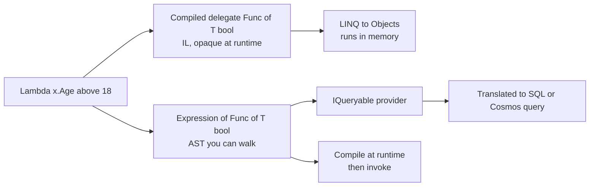

# 3. Generics, Delegates, Events & Expression Trees

> **TL;DR:** Generics eliminate boxing and enable type-safe reuse. Delegates/events are typed function pointers; know the memory-leak pattern. Expression trees are ASTs used by EF Core to translate LINQ to SQL.

**Interview weight:** P0 — generics variance, delegate vs event, closures-in-loops, and expression tree usage in EF Core are senior essentials.

---

## Core Concepts

- **Generic type** — parameterised by one or more type parameters; instantiated at JIT time.
- **Constraint** — restricts what `T` may be; enables members/operators on `T`.
- **Variance** — whether a generic type can be implicitly converted when its type argument is substituted.
- **Delegate** — type-safe function pointer; `Func<>`, `Action<>`, `Predicate<>` are built-in generic delegates.
- **Event** — a multicast delegate wrapped with `add`/`remove` accessors; the publisher owns invocation.
- **Expression tree** — in-memory AST (`Expression<Func<T,bool>>`); can be inspected, compiled, or translated to SQL.

---

## Generics

### Constraints

| Constraint | Meaning |
| ---------- | ------- |
| `where T : class` | T is a reference type (or interface) |
| `where T : struct` | T is a non-nullable value type |
| `where T : notnull` | T is non-nullable reference or value type |
| `where T : unmanaged` | T is blittable value type (no managed refs) — enables `Span<T>`, `stackalloc` |
| `where T : new()` | T has a public parameterless constructor |
| `where T : SomeBase` | T inherits `SomeBase` |
| `where T : ISomeInterface` | T implements the interface |
| Multiple | `where T : class, ISomething, new()` — all must hold |

```csharp
T[] CreateArray<T>(int size) where T : struct
    => new T[size];  // no boxing possible — T is a value type

T Create<T>() where T : class, new()
    => new T();      // allowed because of new() constraint
```

### Generic Type Instantiation & JIT Specialization

- **Reference types** — JIT generates *one* native code body shared across all reference-type instantiations of `List<T>`. `List<string>` and `List<Order>` share the same machine code; only the GC metadata differs.
- **Value types** — JIT generates a *separate* code body per value type. `List<int>` and `List<double>` have different compiled methods because layout differs.
- Implication: generic code over value types can be larger in code cache but avoids boxing and is more cache-friendly for data.

---

## Generic Variance

| Kind | Keyword | Rule | Example |
| ---- | ------- | ---- | ------- |
| Covariant | `out T` | T used only as output (return) | `IEnumerable<out T>` — `IEnumerable<Dog>` → `IEnumerable<Animal>` |
| Contravariant | `in T` | T used only as input (parameter) | `Action<in T>` — `Action<Animal>` → `Action<Dog>` |
| Invariant | none | T used both ways | `IList<T>`, `List<T>` |

Only interfaces and delegates support variance in C#. Classes are always invariant.

```csharp
IEnumerable<Dog> dogs = GetDogs();
IEnumerable<Animal> animals = dogs;  // OK — covariant (out T)

Action<Animal> feedAnimal = a => a.Feed();
Action<Dog> feedDog = feedAnimal;    // OK — contravariant (in T), safe: Dog IS-A Animal

// WHY covariance is safe: you only READ from IEnumerable — you can't write a Cat into it.
// WHY contravariance is safe: a handler for Animal can handle Dog — Dog is-a Animal.
```

### Array Covariance — Unsafe!

```csharp
Dog[] dogs = new Dog[10];
Animal[] animals = dogs;           // compiles — array covariance (baked into CLR)
animals[0] = new Cat();            // ArrayTypeMismatchException at RUNTIME!
// Arrays are mutable; covariance is unsound — this is a known CLR design mistake.
// Prefer IReadOnlyList<T> (covariant) or IList<T> (invariant, safe) over raw arrays in APIs.
```

---

## Delegates vs Func/Action/Predicate

| | Custom Delegate | `Func<T,...,TResult>` | `Action<T,...>` | `Predicate<T>` |
| - | --------------- | --------------------- | --------------- | -------------- |
| Return type | Any | Non-void | void | `bool` |
| Generic | Manual | Yes (up to 16 params) | Yes | Yes (1 param) |
| When to use | Event patterns, named type clarity | General callbacks | Side-effect callbacks | `List<T>.Find` |

```csharp
Func<int, int, int> add = (a, b) => a + b;
Action<string> log = msg => Console.WriteLine(msg);
Predicate<int> isEven = n => n % 2 == 0;

// Multicast delegate — all registered methods are called in order:
Action<string> pipeline = Log;
pipeline += Audit;
pipeline += Send;
pipeline("event");   // calls Log, then Audit, then Send

// Remove:
pipeline -= Audit;
```

---

## Events vs Delegates

| Aspect | Delegate field | `event` keyword |
| ------ | -------------- | --------------- |
| Who can invoke | Anyone with access | Only declaring class |
| Who can subscribe | Anyone | Anyone |
| Who can reset (=) | Anyone | Only declaring class |
| `+=` / `-=` | Anyone | Anyone |
| Typical use | Internal callback | Observer/notification pattern |
| Thread safety | Not safe by default | Not safe by default |

```csharp
public class Button
{
    // Delegate field — anyone can invoke or reset it (risky):
    public EventHandler? Clicked;

    // Event — only Button can invoke; subscribers use += only:
    public event EventHandler? Clicked2;

    protected virtual void OnClicked2(EventArgs e) => Clicked2?.Invoke(this, e);
}
```

### Event Handler Memory Leak

**Problem:** if a subscriber has a *shorter* lifetime than the publisher, the publisher's event delegate holds a reference to the subscriber → subscriber never collected.

```csharp
// Leak: GameEngine (long-lived) holds ref to Player (short-lived):
engine.Tick += player.Update;  // player never GC'd until unsubscribed or engine dies

// Fix 1: always unsubscribe in Dispose:
public void Dispose() => engine.Tick -= player.Update;

// Fix 2: WeakEventManager (WPF) / WeakReference-based pattern for UI:
// Subscriber is held weakly; handler is removed automatically if collected.
```

---

## Lambdas & Closures

```csharp
// Closure captures the VARIABLE (by reference), not the value at the time of capture:
var funcs = new List<Func<int>>();
for (int i = 0; i < 3; i++)
    funcs.Add(() => i);          // all capture the same 'i' variable
funcs.ForEach(f => Console.Write(f() + " ")); // 3 3 3 — NOT 0 1 2!

// Fix: capture a copy:
for (int i = 0; i < 3; i++)
{
    int copy = i;
    funcs.Add(() => copy);       // each lambda captures its own 'copy'
}
```

**Closure cost:** compiler generates a "display class" on the heap per closure scope. In hot paths, allocate explicitly (static lambdas `.NET 9+` or `[MethodImpl(AggressiveInlining)]`).

```csharp
// Static lambda — cannot capture; zero allocation:
Func<int, int> doubler = static x => x * 2;
```

---

## Expression Trees vs Delegates



| | Lambda as `Func<T,bool>` | Lambda as `Expression<Func<T,bool>>` |
| - | ------------------------ | ------------------------------------- |
| Type | Compiled delegate | AST (data structure) |
| Can invoke directly | Yes | Yes (after `.Compile()`) |
| Can inspect/translate | No | Yes — EF Core translates to SQL |
| Compile-time support | Full | Full (same C# syntax) |
| Runtime cost | Call overhead only | `.Compile()` = reflection cost |

### How EF Core Uses Expression Trees

```csharp
// This is an Expression<Func<Order,bool>>, NOT a delegate:
IQueryable<Order> query = db.Orders.Where(o => o.Total > 1000);

// EF Core's query provider inspects the expression tree:
// BinaryExpression: (o.Total) GreaterThan (1000)
// Translates to SQL: WHERE Total > 1000 — executed on the server

// If you use IEnumerable<Order>.Where() instead:
var bad = db.Orders.AsEnumerable().Where(o => o.Total > 1000);
// ALL rows loaded into memory first — client-side evaluation!
```

---

## Reflection, Attributes & Custom Attributes

```csharp
[AttributeUsage(AttributeTargets.Class | AttributeTargets.Method)]
public sealed class AuditAttribute : Attribute
{
    public string Category { get; }
    public AuditAttribute(string category) => Category = category;
}

[Audit("Order")]
public class OrderService { }

// Reflection — get attributes at runtime:
var attr = typeof(OrderService)
    .GetCustomAttribute<AuditAttribute>();
Console.WriteLine(attr?.Category); // "Order"
```

**Performance cost of reflection:**
- `Type.GetMethods()` / `GetProperties()` first call: ~1–10 µs (metadata parsing).
- Subsequent calls: cached by CLR but still involves managed/unmanaged transitions.
- `MethodBase.Invoke()`: ~100–300 ns vs ~1 ns for a direct call.
- For high-frequency paths: cache `MethodInfo`/`PropertyInfo`; or use compiled `Expression<T>`.

### Source Generators — Modern Alternative

- Roslyn-based compile-time code generation; zero runtime reflection cost.
- Used by: `System.Text.Json` (JsonSerializerContext), EF Core compiled models, `LoggerMessage.Define`.
- Write an `IIncrementalGenerator` that inspects `SyntaxTree`/`SemanticModel`, outputs source.

```csharp
// Generated by STJ source generator — no reflection at runtime:
[JsonSerializable(typeof(Order))]
internal partial class AppJsonContext : JsonSerializerContext { }
```

---

## Interview Questions

**Q1. What is the difference between covariance and contravariance in C# generics?**
A: Covariance (`out T`) — a generic of a derived type can be used where a generic of the base type is expected (reads only). Contravariance (`in T`) — opposite direction (accepts a more general handler). Only interfaces and delegates support variance in C#. `IEnumerable<Dog>` → `IEnumerable<Animal>` is covariant (safe because you only read). `Action<Animal>` → `Action<Dog>` is contravariant (safe because Dog is-a Animal).

**Q2. Why is array covariance in C# considered a design flaw?**
A: Arrays support covariance (`Dog[]` → `Animal[]`) but are mutable — writing a `Cat` into what the CLR knows is a `Dog[]` throws `ArrayTypeMismatchException` at runtime. The type system fails at compile time. `IReadOnlyList<T>` (covariant) is the safe alternative.

**Q3. Explain the event handler memory leak pattern.**
A: Publisher holds a multicast delegate; each subscriber is a GC root through the delegate. If the subscriber is "short-lived" but never unsubscribes, the publisher keeps it alive. Pattern: always unsubscribe in `Dispose`/`IAsyncDisposable`. Alternative: WeakReference-based event pattern or using `ConditionalWeakTable`.

**Q4. What is the closure-in-loop bug and how do you fix it?**
A: The lambda captures the *variable* `i`, not its value at capture time. All lambdas share the same `i`; by the time they run, `i` has its final value (3). Fix: copy `i` to a new variable inside the loop body; each lambda then captures its own copy.

**Q5. What is the difference between a `Func<T,bool>` lambda and an `Expression<Func<T,bool>>`?**
A: A `Func<T,bool>` is compiled delegate — you can call it, not inspect it. `Expression<Func<T,bool>>` is an AST in memory — you can walk/translate it (EF Core turns it into SQL). Same C# syntax, different declared type. Calling `.Compile()` on an expression creates a delegate, but at reflection-level cost.

**Q6. How does EF Core translate LINQ to SQL using expression trees?**
A: `IQueryable<T>.Where(expr)` takes an `Expression<Func<T,bool>>`. EF Core's query provider walks the tree (visitor pattern), maps `MemberAccess` nodes to column names, binary operators to SQL operators, method calls (`Contains`, `StartsWith`) to SQL equivalents. If a method call cannot be translated, EF Core either throws or falls back to client-side evaluation (the latter is a performance trap).

**Q7. What is a multicast delegate and what happens on exception?**
A: A delegate that holds a linked list of method pointers. Invocation calls each in registration order. If the first delegate throws, subsequent delegates are NOT called (unless you iterate `GetInvocationList()` manually and handle exceptions). `event` uses multicast internally.

**Q8. When would you use a custom attribute vs a dictionary/registry for metadata?**
A: Attributes when: metadata is static, belongs to the type definition, and is needed by frameworks (serialization, routing, validation, authorization). Dictionary/registry when: metadata is dynamic, changes at runtime, or is too complex for attribute constructor parameters. Hybrid: use attributes as keys + a registry for the values.

**Q9. Senior — explain JIT specialization for generic value types and its implications.**
A: For each unique value-type instantiation (`List<int>`, `List<double>`, `List<Point>`), JIT generates separate native code. This avoids boxing but increases code size (code bloat). In a game engine with many component types (`Position`, `Velocity`, `Health`), each generic system generates separate code — good for cache-warm inner loops, potentially bad for cold-start/code size. Contrast with reference types: one shared native code body for all.

**Q10. Senior — source generators vs reflection: when should you prefer each?**
A: Source generators = compile-time, zero runtime cost, works with NativeAOT/trimming, fully type-safe. Use for: serialization, DI registration, logging, mapping. Reflection = runtime flexibility, works on types unknown at compile time. Use for: plugin systems, scripting engines, test frameworks. At 5K RPS, eliminating reflection in hot serialization paths (STJ source gen) can cut 5–15% of total request CPU.

**Q11. Senior — trade-off: Expression trees vs compiled delegates in a rule engine.**
A: Rule engine scenario: rules are stored as strings (DB-driven), compiled to `Expression<Func<Order,bool>>` at startup, then `.Compile()`d to delegates. First-time compilation cost is high (~ms per rule). After that, executing the compiled delegate is near-native speed (~ns). Trade-off: re-compiling on rule change is expensive; cache the compiled delegates by rule hash. At Xbox scale, a rules cache with `ConcurrentDictionary<string, Func<Order,bool>>` pays back the initial reflection cost within 50–100 invocations.

**Q12. Senior — generics and the `unmanaged` constraint: why does it matter for Span/interop?**
A: `where T : unmanaged` guarantees T contains no managed references — it is blittable. Enables `Span<T>` operations (unsafe `MemoryMarshal.Cast<byte,T>`), `stackalloc T[n]`, P/Invoke without marshalling, and SIMD via `Vector<T>`. If T could be a managed type, the GC could move it mid-operation — unsafe. This constraint is what makes high-performance collections like `ArrayPool<T>` safe to implement.

---

## Quick Recap

- Generic value-type instantiations get separate JIT code (performance, no boxing); reference types share one.
- `out T` = covariant (read-only output); `in T` = contravariant (write-only input); classes/arrays = invariant.
- Array covariance is unsafe — prefer `IReadOnlyList<T>`.
- `event` restricts invocation/assignment to the declaring class; `delegate` field does not.
- Closure captures variable reference, not value — copy loop variable to avoid the loop bug.
- `Expression<Func<T>>` is an AST; EF Core walks it to build SQL; never call `.AsEnumerable()` before `.Where()`.
- Reflection ≈ 100–300 ns per invoke; source generators eliminate runtime reflection cost.
- Event handler leak: publisher holds subscriber alive; always unsubscribe in `Dispose`.
