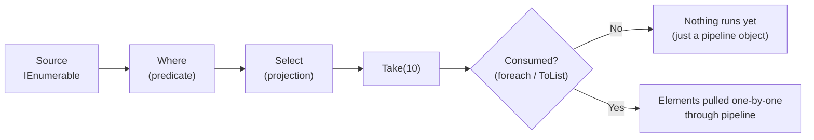

# 4. LINQ

> **TL;DR:** LINQ is a query API with deferred execution; most operators stream lazily over `IEnumerable<T>`. `IQueryable<T>` translates expression trees to SQL — never mix the two accidentally or you get full-table client-side evaluation.

**Interview weight:** P0 — every EF Core project depends on this; N+1 and deferred-execution bugs are real production issues at scale.

---

## Core Concepts

- **Deferred execution** — most LINQ operators return a lazy pipeline; nothing runs until iterated (`foreach`, `ToList()`, `Count()`, etc.).
- **Immediate execution** — operators that materialise results now: `ToList`, `ToArray`, `ToDictionary`, `Count`, `First`, `Single`, `Any`, `All`, `Aggregate`, `Max`, `Sum`.
- **Streaming** — operator produces one element at a time without loading the whole source (e.g. `Where`, `Select`, `Take`).
- **Buffering** — operator must read entire source before producing output (e.g. `OrderBy`, `GroupBy`, `Reverse`).

---

## Deferred Execution Flow



```csharp
var query = Enumerable.Range(1, 1_000_000)
    .Where(n => n % 2 == 0)
    .Select(n => n * n)
    .Take(5);
// Nothing executed yet — query is an IEnumerable object

foreach (var x in query)   // execution starts here, pulls only until Take(5) satisfied
    Console.WriteLine(x);
```

---

## IEnumerable\<T\> vs IQueryable\<T\>

| Aspect | `IEnumerable<T>` | `IQueryable<T>` |
| ------ | ---------------- | --------------- |
| Execution location | In-process (CLR) | Remote (SQL server, etc.) |
| Lambda type | `Func<T,bool>` (compiled delegate) | `Expression<Func<T,bool>>` (AST) |
| Query translation | None — LINQ to objects | Provider translates to SQL / API |
| Extends | `IEnumerable<T>` — yes | Yes |
| Materialise with | `ToList()`, `foreach` | Same + triggers SQL execution |
| Risk | Multiple enumeration, loading all data | Client-side eval trap (see below) |

**Client-side evaluation trap:**

```csharp
// BAD — AsEnumerable() loads ALL orders before filtering:
var result = db.Orders
    .AsEnumerable()               // switches from IQueryable to IEnumerable
    .Where(o => o.Total > 1000)   // runs in-process on ALL rows
    .ToList();

// GOOD — filter in SQL:
var result = db.Orders
    .Where(o => o.Total > 1000)   // translated to WHERE Total > 1000 in SQL
    .ToList();
```

---

## Method Syntax vs Query Syntax

```csharp
// Method syntax (fluent):
var result = orders
    .Where(o => o.CustomerId == id)
    .OrderBy(o => o.Date)
    .Select(o => new { o.Id, o.Total });

// Query syntax (SQL-like, compiled to method syntax):
var result = from o in orders
             where o.CustomerId == id
             orderby o.Date
             select new { o.Id, o.Total };
```

Query syntax has no equivalent for `GroupJoin` results without `into`, and no `Aggregate`. Method syntax is more complete and typically preferred.

---

## Operator Catalogue

| Category | Operators |
| -------- | --------- |
| Filtering | `Where`, `OfType`, `Distinct`, `DistinctBy` |
| Projection | `Select`, `SelectMany`, `Cast` |
| Sorting | `OrderBy`, `OrderByDescending`, `ThenBy`, `ThenByDescending`, `Reverse` |
| Grouping | `GroupBy`, `ToLookup` |
| Joining | `Join`, `GroupJoin`, `Zip` |
| Partitioning | `Take`, `TakeWhile`, `Skip`, `SkipWhile`, `Chunk` |
| Aggregation | `Count`, `LongCount`, `Sum`, `Min`, `Max`, `Average`, `Aggregate` |
| Quantifiers | `Any`, `All`, `Contains`, `SequenceEqual` |
| Element | `First`, `FirstOrDefault`, `Single`, `SingleOrDefault`, `Last`, `LastOrDefault`, `ElementAt` |
| Set | `Union`, `Intersect`, `Except`, `UnionBy`, `IntersectBy`, `ExceptBy` |
| Conversion | `ToList`, `ToArray`, `ToDictionary`, `ToHashSet`, `AsEnumerable`, `AsQueryable` |
| Generation | `Empty`, `Range`, `Repeat`, `DefaultIfEmpty` |

---

## Key Operators in Detail

### Select vs SelectMany

```csharp
// Select — 1:1 projection; result is IEnumerable<IEnumerable<T>> if input has collections:
var nested = orders.Select(o => o.Items);  // IEnumerable<IEnumerable<Item>>

// SelectMany — flatten nested collections into one sequence:
var flat = orders.SelectMany(o => o.Items); // IEnumerable<Item>
```

### GroupBy

```csharp
var byCustomer = orders.GroupBy(o => o.CustomerId);
// IEnumerable<IGrouping<int, Order>>
foreach (var group in byCustomer)
    Console.WriteLine($"{group.Key}: {group.Sum(o => o.Total)}");
```

`GroupBy` is **buffering** — reads all elements before producing any group.

### Join vs GroupJoin

```csharp
// Join — inner join; flat result:
var result = orders.Join(customers,
    o => o.CustomerId, c => c.Id,
    (o, c) => new { o.Id, c.Name });

// GroupJoin — left outer join; preserves all left elements:
var result = customers.GroupJoin(orders,
    c => c.Id, o => o.CustomerId,
    (c, ords) => new { c.Name, Orders = ords });
```

### Aggregate

```csharp
int product = Enumerable.Range(1, 5).Aggregate(1, (acc, x) => acc * x); // 120
string csv = new[] {"a","b","c"}.Aggregate((s, x) => s + "," + x);     // "a,b,c"
```

### First / Single / Any / All — Semantics & Exceptions

| Method | Returns | Throws when |
| ------ | ------- | ----------- |
| `First()` | First element | Sequence empty |
| `FirstOrDefault()` | First or default | Never |
| `Single()` | One element | Empty OR more than one |
| `SingleOrDefault()` | One or null/default | More than one |
| `Any()` | bool | Never |
| `All()` | bool | Never |

`Single` is for enforcing uniqueness constraints (e.g. lookup by primary key — you *expect* exactly one). Use `First` when you don't care about extras.

### OrderBy Stability

`OrderBy` in LINQ to Objects is **stable** (equal elements preserve original order). EF Core SQL `ORDER BY` may not be stable — add a tiebreaker column for deterministic paging.

---

## Common Pitfalls

### Multiple Enumeration Bug

```csharp
IEnumerable<Order> orders = GetOrders();  // might be a lazy DB query or yield
var count = orders.Count();               // first enumeration
var list  = orders.ToList();              // second enumeration — DB queried again!

// Fix: materialise once:
var orders = GetOrders().ToList();
```

### N+1 Problem with EF Core

```csharp
// N+1 — for each order, a separate SQL query loads customer:
foreach (var order in db.Orders.ToList())
    Console.WriteLine(order.Customer.Name);  // lazy load fires per order = N queries

// Fix — eager load with Include:
var orders = db.Orders.Include(o => o.Customer).ToList(); // 1 query with JOIN

// Or use projection (better — select only needed columns):
var result = db.Orders
    .Select(o => new { o.Id, CustomerName = o.Customer.Name })
    .ToList();
```

### AsNoTracking

```csharp
// For read-only queries, skip change tracking (~15-30% faster, less memory):
var orders = db.Orders.AsNoTracking().Where(o => o.Total > 100).ToList();
```

---

## PLINQ

```csharp
// Parallel LINQ — partitions work across thread pool threads:
var results = data.AsParallel()
                  .WithDegreeOfParallelism(4)
                  .Where(x => IsCostly(x))
                  .ToList();
```

**When PLINQ hurts:**
- Short sequences (parallelisation overhead > work).
- Ordered results with `AsOrdered()` — synchronisation kills performance.
- I/O-bound work — use `Task.WhenAll` instead.
- Shared mutable state — races.

---

## LINQ Allocation / Perf Pitfalls

- `ToList()` + `Count` = 2× work; use `Count()` directly on `IQueryable`.
- Boxing value types in `Cast<object>()`.
- Each `Where().Select()` chain on `IEnumerable` = one enumerator allocation each.
- `string.Concat(items.Select(x => x.Name))` = intermediate `IEnumerable<string>` + N allocations. Use `string.Join` or `StringBuilder`.
- For tight loops over arrays, plain `for` with index beats LINQ by 2–5× due to enumerator overhead.

---

## Custom LINQ Operator with yield

```csharp
public static IEnumerable<T> TakeEvery<T>(this IEnumerable<T> source, int step)
{
    ArgumentOutOfRangeException.ThrowIfNegativeOrZero(step);
    int i = 0;
    foreach (var item in source)
    {
        if (i++ % step == 0)
            yield return item;  // lazy — only evaluates items as caller pulls
    }
}

// Usage:
var everyThird = Enumerable.Range(0, 100).TakeEvery(3).ToList();
```

---

## Interview Questions

**Q1. What is deferred execution and why does it matter?**
A: LINQ operators don't execute immediately — they build a pipeline object. Execution happens only when iterated. This means the same query object can be re-executed (with the latest data), and buffering is avoided for large sequences. Matters because re-executing an `IEnumerable` backed by a DB query hits the DB twice (multiple enumeration bug).

**Q2. What is the difference between `IEnumerable<T>` and `IQueryable<T>`?**
A: `IEnumerable` = in-process LINQ to Objects; lambdas are compiled delegates. `IQueryable` = expression tree; provider translates to SQL or another query language. Mixing them (calling `AsEnumerable()` before a `Where`) moves execution to the client — full table scan.

**Q3. When would `Single` throw that `First` would not?**
A: `Single` throws if more than one element matches. `First` takes the first and ignores the rest. Use `Single` when the business rule requires exactly one — it enforces the constraint and surfaces data integrity issues.

**Q4. Explain the N+1 problem and how to fix it in EF Core.**
A: One query to load N parent entities, then N additional queries to load each child via lazy loading = N+1 queries. Fix: `Include()` for eager loading, or projection with `Select()` to pull only needed data in one query. `AsNoTracking()` for read-only paths.

**Q5. Why is `GroupBy` a buffering operation?**
A: To group, it must read every element to determine which group it belongs to. You can't emit a group until all elements that belong to it have been seen. `Where` and `Select` are streaming — they emit one element at a time.

**Q6. What operators materialise LINQ queries immediately?**
A: `ToList`, `ToArray`, `ToDictionary`, `ToHashSet`, `Count`, `Any`, `All`, `First`, `Single`, `Last`, `Max`, `Min`, `Sum`, `Average`, `Aggregate`. All others on `IEnumerable` are deferred (return `IEnumerable`/`IOrderedEnumerable`).

**Q7. What is PLINQ and when does it hurt performance?**
A: PLINQ parallelises LINQ using the thread pool. Hurts when: sequence is short (overhead > benefit), output must be ordered (`AsOrdered` requires merge), work is I/O-bound (use async instead), or shared mutable state causes contention. Best for: CPU-bound transforms over large collections where order doesn't matter.

**Q8. How would you write a custom streaming LINQ operator?**
A: Use `yield return` inside a static extension method. This makes it streaming (deferred + one-at-a-time). Avoid buffering intermediates. Validate arguments before the first `yield` (or in a separate non-iterator method) so exceptions throw at call time, not at enumeration time.

**Q9. Senior — explain how EF Core decides which parts of a LINQ query to evaluate server-side vs client-side.**
A: EF Core's query provider walks the expression tree. Nodes it can translate (comparisons, `Contains`, `StartsWith`, string concatenation) go to SQL. If it encounters a method it can't translate (e.g. a custom C# helper), EF Core (.NET 5+) throws by default (`InvalidOperationException: ... could not be translated`). You can force client evaluation by calling `AsEnumerable()` at the right point — but you must understand where the data cut-off is.

**Q10. Senior — multiple enumeration: how would you detect it in a code review?**
A: Look for parameters or variables typed as `IEnumerable<T>` (not `IReadOnlyList<T>` or `IList<T>`) that are used more than once in the method body. Each use is a potential enumeration. In EF Core, look for `IQueryable<T>` returned from a repository and then used in two separate LINQ chains — each `ToList()` fires a separate SQL query. Static analysis tools (Resharper, `EnumerationMethodsAnalyzer`) can flag this.

**Q11. Senior — `Select` vs `SelectMany` in an event-sourcing scenario: what would you project?**
A: An aggregate has an `IEnumerable<DomainEvent>` per entity. To get a flat stream of all events across all aggregates: `aggregates.SelectMany(a => a.Events)`. This is the right projection before ordering by timestamp for replay. `Select` would give `IEnumerable<IEnumerable<DomainEvent>>` — nested, not usable for chronological replay without further flattening.

**Q12. Senior — perf trade-off: LINQ vs `for` loop at 5K RPS.**
A: LINQ on hot paths allocates enumerator objects (heap), may box value types, and has method call overhead. A plain `for` loop over an array: zero allocation, loop counter in register, JIT can auto-vectorise. At 5K RPS × 50 μs per request, LINQ overhead might be 2–5 μs/request = 10–25 ms/s of CPU wasted. For critical inner loops (pricing, rule evaluation), use `Span<T>` + `for`. For most business logic, LINQ readability > micro-optimisation.

---

## Quick Recap

- Deferred execution: query runs on first iteration, not at declaration. Materialise with `ToList`/`ToArray`.
- Multiple enumeration: `IEnumerable<T>` used twice = two full passes (or two DB queries). Fix: materialise once.
- `IQueryable` = expression tree → SQL translation. Never `AsEnumerable()` before a filter.
- N+1: `Include()` or project with `Select()`. Add `AsNoTracking()` for read-only.
- `Single` enforces uniqueness; `First` is permissive. `Any` is O(1) stop-on-first; never `Count() > 0`.
- `GroupBy` and `OrderBy` buffer; `Where`/`Select`/`Take` stream.
- PLINQ: CPU-bound large collections only; I/O-bound → `Task.WhenAll`.
- Custom operators: `yield return` in extension method = lazy streaming.
