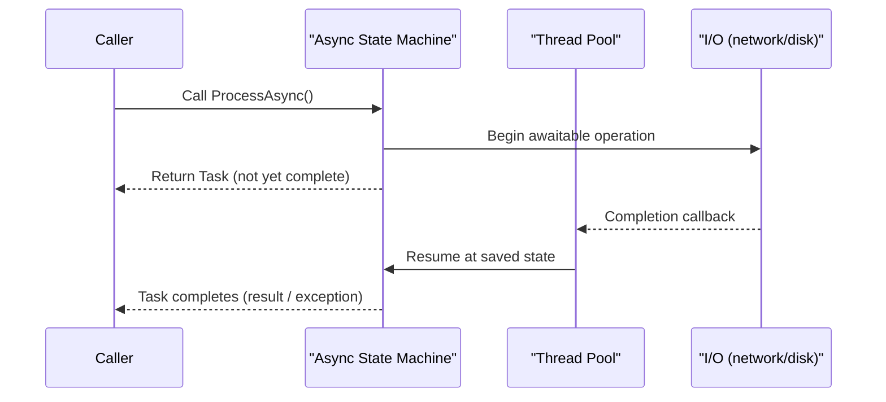

# 5. Async/Await & TPL

> **TL;DR:** `async`/`await` compiles to a state machine; `await` suspends without blocking a thread. Know `ConfigureAwait(false)` for libraries, `ValueTask` for hot paths, and every way async can go wrong (deadlock, `async void`, fire-and-forget).

**Interview weight:** P0 — async is the most misunderstood C# feature; deadlocks and misuse of thread pool are real production bugs at scale.

---

## Core Concepts

- **`async`/`await`** — compiler transforms an async method into a state machine; `await` is a suspension point where the thread is returned to the pool.
- **`Task<T>`** — represents a future value; backed by thread pool or I/O completion ports.
- **`ValueTask<T>`** — struct wrapper; zero-allocation when result is already available (cached hot paths).
- **`SynchronizationContext`** — captures the "current context" (UI thread, ASP.NET Classic request context) and marshals continuations back to it.
- **`ConfigureAwait(false)`** — tells the runtime: after `await`, do NOT marshal back to the captured `SynchronizationContext`; resume on any available thread pool thread.

---

## What async/await Compiles To



**Generated state machine:**

```csharp
// Source:
async Task<int> GetLengthAsync(string url)
{
    var response = await _client.GetAsync(url);
    return response.Content.Headers.ContentLength ?? 0;
}

// Conceptually compiles to:
class GetLengthAsync_StateMachine : IAsyncStateMachine
{
    public int _state = -1;          // -1 = initial, 0 = after first await
    public AsyncTaskMethodBuilder<int> _builder;
    // local variables become fields:
    HttpResponseMessage _response;

    public void MoveNext()
    {
        switch (_state)
        {
            case -1:
                var awaiter = _client.GetAsync(url).GetAwaiter();
                if (!awaiter.IsCompleted)
                {
                    _state = 0;
                    _builder.AwaitUnsafeOnCompleted(ref awaiter, ref this);
                    return;  // yield — return Task to caller
                }
                goto case 0;
            case 0:
                _response = awaiter.GetResult();
                _builder.SetResult((int)(_response.Content.Headers.ContentLength ?? 0));
                break;
        }
    }
}
```

---

## Task vs Thread vs ValueTask

| | `Thread` | `Task` | `ValueTask` |
| - | -------- | ------ | ----------- |
| Abstraction | OS thread | Work item on thread pool | Zero-alloc wrapper for already-available result |
| Cost | ~1 MB stack; OS context switch | ~160 bytes heap; pool-managed | 0 alloc if synchronous; Task otherwise |
| When to use | Long-running CPU work with isolation | General async operations | Hot-path APIs returning cached value (IValueTaskSource) |
| `async` support | No | Yes | Yes |
| Blocking equivalent | `Thread.Join()` | `.Wait()`/`.Result` | Same — dangerous |
| Max practical count | ~few hundred | Thousands | Same as Task |

---

## Thread Pool & Hill-Climbing / Starvation

- Thread pool starts at ~min threads (≈ CPU count), grows on demand with ~500 ms delay per new thread.
- **Starvation** — blocking a thread pool thread (`.Wait()`, `Thread.Sleep`) starves the pool. With min=8 threads and 8 blocked, new work queues for 500 ms each before a new thread is injected.
- **Hill-climbing** — algorithm that adjusts thread count to maximise throughput; tunable via `ThreadPool.SetMinThreads`.
- `ThreadPool.SetMinThreads(Environment.ProcessorCount * 4, 4)` — pre-warm threads for bursty workloads (reduces cold-start latency).

---

## SynchronizationContext & ConfigureAwait

- **WPF/WinForms** — `DispatcherSynchronizationContext` marshals continuations to the UI thread.
- **ASP.NET Classic** — `AspNetSynchronizationContext` marshals back to the request context.
- **ASP.NET Core** — no `SynchronizationContext`; continuations run on any thread pool thread.
- `ConfigureAwait(false)` — removes the capture; continuation runs on pool thread; **required in library code** to avoid deadlocks in non-Core hosts and to avoid unnecessary context switching.

```csharp
// Library code — always ConfigureAwait(false):
public async Task<byte[]> DownloadAsync(string url)
{
    var data = await _client.GetByteArrayAsync(url).ConfigureAwait(false);
    return data;
}

// ASP.NET Core app code — ConfigureAwait(false) optional but still a good habit:
public async Task<IActionResult> Get()
{
    var result = await _service.GetAsync().ConfigureAwait(false);
    return Ok(result);
}
```

---

## async void — Dangers

- `async void` cannot be awaited; exceptions are uncatchable (thrown on `SynchronizationContext`, crash process in some hosts).
- Only justified for event handlers (WPF/WinForms `Button.Click`).

```csharp
// BAD — exception disappears, no way to await:
async void FireAndForget() { await DoSomethingAsync(); }

// GOOD — wrap in Task, use _ discard or fire-and-forget pattern with error handling:
_ = DoSomethingAsync().ContinueWith(
    t => _logger.LogError(t.Exception, "Background task failed"),
    TaskContinuationOptions.OnlyOnFaulted);
```

---

## Sync-Over-Async Deadlock (.Result / .Wait)

```csharp
// Classic deadlock in ASP.NET Classic with SynchronizationContext:
// UI/request thread calls .Result → blocks thread
// async continuation tries to resume on the same thread → deadlock

// BAD:
var data = GetDataAsync().Result;   // DEADLOCK in ASP.NET Classic
var data = GetDataAsync().GetAwaiter().GetResult();  // same deadlock

// GOOD — go async all the way:
var data = await GetDataAsync();
```

In ASP.NET Core there is no `SynchronizationContext` so `.Result` won't deadlock due to context. It can still cause thread pool starvation.

---

## Task.Run Misuse in ASP.NET

```csharp
// BAD — wrapping I/O-bound async in Task.Run wastes a thread:
public async Task<string> GetAsync()
    => await Task.Run(() => _httpClient.GetStringAsync(url)); // extra thread for nothing

// GOOD — I/O-bound: await directly:
public Task<string> GetAsync() => _httpClient.GetStringAsync(url);

// OK — CPU-bound: offload to thread pool so request thread is freed:
public Task<int> ComputeAsync(int n) => Task.Run(() => HeavyCpu(n));
```

---

## WhenAll / WhenAny / Task.WhenEach

```csharp
// WhenAll — wait for all; throws AggregateException if any fails:
var (users, orders) = await (GetUsersAsync(), GetOrdersAsync()); // C# 7 tuple deconstruct
await Task.WhenAll(t1, t2, t3);  // throws on first exception seen

// Capture individual exceptions:
Task[] tasks = { t1, t2, t3 };
await Task.WhenAll(tasks);
foreach (var t in tasks.Where(t => t.IsFaulted))
    log(t.Exception);

// WhenAny — return when any completes (timeout pattern):
var timeoutTask = Task.Delay(TimeSpan.FromSeconds(5));
var winner = await Task.WhenAny(workTask, timeoutTask);
if (winner == timeoutTask) throw new TimeoutException();

// Task.WhenEach (.NET 9) — async stream of tasks as they complete:
await foreach (var t in Task.WhenEach(tasks))
    Console.WriteLine(await t);
```

---

## CancellationToken

```csharp
public async Task ProcessAsync(CancellationToken ct)
{
    ct.ThrowIfCancellationRequested();

    await _db.LoadAsync(ct);           // pass token throughout
    await Task.Delay(1000, ct);        // delay respects cancellation

    using var linked = CancellationTokenSource.CreateLinkedTokenSource(ct);
    linked.CancelAfter(TimeSpan.FromSeconds(30));  // add timeout on top
    await _externalApi.CallAsync(linked.Token);
}

// Caller:
using var cts = new CancellationTokenSource(TimeSpan.FromSeconds(60));
await ProcessAsync(cts.Token);
```

---

## TPL: Parallel.For / ForEach / ForEachAsync

```csharp
// CPU-bound parallelism:
Parallel.For(0, 1000, i => matrix[i] = Compute(i));

Parallel.ForEach(items, new ParallelOptions { MaxDegreeOfParallelism = 4 },
    item => Process(item));

// I/O-bound async parallelism (.NET 6+):
await Parallel.ForEachAsync(items,
    new ParallelOptions { MaxDegreeOfParallelism = 10, CancellationToken = ct },
    async (item, token) => await ProcessItemAsync(item, token));
```

---

## IAsyncEnumerable & await foreach

```csharp
// Producer — streaming results without buffering all in memory:
async IAsyncEnumerable<Order> StreamOrdersAsync(
    [EnumeratorCancellation] CancellationToken ct = default)
{
    await foreach (var batch in _db.GetOrderBatchesAsync(ct))
        foreach (var order in batch)
            yield return order;
}

// Consumer:
await foreach (var order in StreamOrdersAsync(ct))
    await ProcessAsync(order, ct);
```

---

## Channel\<T\> Producer/Consumer

```csharp
var channel = Channel.CreateBounded<WorkItem>(new BoundedChannelOptions(100)
{
    FullMode = BoundedChannelFullMode.Wait,
    SingleWriter = false,
    SingleReader = false
});

// Producer:
await channel.Writer.WriteAsync(item, ct);
channel.Writer.Complete();

// Consumer:
await foreach (var item in channel.Reader.ReadAllAsync(ct))
    await ProcessAsync(item);
```

---

## SemaphoreSlim — Async Throttling

```csharp
// Limit concurrent outbound calls to 10:
var sem = new SemaphoreSlim(10);
var tasks = urls.Select(async url =>
{
    await sem.WaitAsync(ct);
    try   { return await _client.GetAsync(url, ct); }
    finally { sem.Release(); }
});
await Task.WhenAll(tasks);
```

---

## TaskCompletionSource

```csharp
// Bridge callback-based API to Task:
TaskCompletionSource<int> tcs = new(TaskCreationOptions.RunContinuationsAsynchronously);
someLibrary.OnComplete += result => tcs.SetResult(result);
someLibrary.OnError   += ex    => tcs.SetException(ex);
int result = await tcs.Task;
```

---

## IProgress\<T\>

```csharp
// Report progress without coupling producer to UI:
async Task DownloadAsync(IProgress<int>? progress, CancellationToken ct)
{
    for (int i = 0; i < 100; i++)
    {
        await Task.Delay(50, ct);
        progress?.Report(i + 1);  // marshalled to captured SyncContext automatically
    }
}

// UI caller:
var progress = new Progress<int>(pct => progressBar.Value = pct);
await DownloadAsync(progress, ct);
```

---

## Async Best Practices Checklist

- `async` all the way — never block with `.Result`/`.Wait()` in async code.
- `ConfigureAwait(false)` in all library/non-UI code.
- Pass `CancellationToken` to every async method; thread it through.
- Never use `async void` except event handlers; wrap fire-and-forget with error logging.
- Use `ValueTask` only for hot-path APIs that are frequently synchronous (e.g. cached result); not as a general replacement for `Task`.
- Prefer `Task.WhenAll` over sequential `await` for independent concurrent operations.
- Do not use `Task.Run` for I/O-bound work; only for CPU-bound work in ASP.NET.
- Limit concurrency with `SemaphoreSlim` or `Parallel.ForEachAsync(MaxDegreeOfParallelism)`.
- Use `Channel<T>` for producer/consumer pipelines instead of `BlockingCollection` + threads.
- Set `ThreadPool.SetMinThreads` for bursty workloads to avoid 500 ms spin-up delays.

---

## Interview Questions

**Q1. What does `async`/`await` actually compile to?**
A: A state machine class implementing `IAsyncStateMachine`. Local variables become fields. Each `await` becomes a numbered state. `MoveNext()` contains a switch on state. If the awaitable is incomplete, the state is saved and the method returns the incomplete `Task`; the caller resumes when the completion callback fires.

**Q2. What is `ConfigureAwait(false)` and when do you need it?**
A: It tells the runtime not to capture `SynchronizationContext` — the continuation runs on any thread pool thread. Required in library code to: (a) avoid deadlocks in hosts with a synchronisation context (ASP.NET Classic, WPF), (b) avoid unnecessary thread switching. In ASP.NET Core there is no `SynchronizationContext`, so it's optional but still good practice for portable libraries.

**Q3. Explain the sync-over-async deadlock.**
A: Thread A (UI/request thread) calls `task.Result` — blocks. The async continuation needs to marshal back to thread A (captured SynchronizationContext). But thread A is blocked. Deadlock. Fix: go async all the way, or use `ConfigureAwait(false)` in the library so continuation doesn't need thread A.

**Q4. When should you use `ValueTask` instead of `Task`?**
A: When the operation is *very frequently* synchronous (e.g. cache hit, completed I/O). `ValueTask` = struct, zero allocation in the synchronous case. Drawbacks: can only be awaited once; cannot store in a collection; `ValueTask.AsTask()` allocates. Never use as a drop-in for `Task` — only for measured hot paths.

**Q5. What is wrong with `async void`?**
A: Cannot be awaited; exceptions thrown inside propagate to the `SynchronizationContext` and are uncatchable by the caller, often crashing the process. Only valid for event handlers. Use `async Task` everywhere else; for fire-and-forget, capture the `Task` and attach error logging continuation.

**Q6. What is `Task.WhenAll` exception behaviour?**
A: If any task faults, `WhenAll` re-throws the first exception when awaited. To get *all* exceptions, await `WhenAll`, catch `AggregateException`, or inspect each task's `.Exception` after `WhenAll` completes (whether faulted or not).

**Q7. What is `IAsyncEnumerable<T>` and when would you use it over `Task<IEnumerable<T>>`?**
A: `IAsyncEnumerable<T>` streams items asynchronously — consumer processes each item as it arrives, without buffering all in memory. `Task<IEnumerable<T>>` loads all items before returning. Use `IAsyncEnumerable<T>` for: large DB result sets, real-time feeds, streaming API responses, or any scenario where buffering all results would be memory-intensive or would delay time-to-first-result.

**Q8. How does `Channel<T>` differ from `BlockingCollection<T>`?**
A: `Channel<T>` is fully async — no thread blocking. `BlockingCollection<T>` blocks the thread on empty/full — wastes thread pool threads. `Channel<T>` supports backpressure with `BoundedChannel` and `FullMode`. Prefer `Channel<T>` for async producer/consumer pipelines.

**Q9. Senior — explain thread pool starvation and how to detect it.**
A: If all pool threads are blocked (`.Wait()`, `Thread.Sleep`, synchronous I/O), new work sits in the queue. Symptoms: high queue depth in `ThreadPool.PendingWorkItemCount`, latency spikes, timeout failures. Detect with dotnet-counters: `System.Runtime / ThreadPool Queue Length`. Fix: eliminate all `.Result`/`.Wait()` in async code; use `async` I/O primitives.

**Q10. Senior — async/await overhead: when is it measurable and how do you reduce it?**
A: State machine allocation (~100 bytes on heap per async call), JIT/GC overhead. Measurable in tight loops: >100K async calls/sec. Reduce with: `ValueTask` (struct, zero alloc if sync), `PoolingAsyncValueTaskMethodBuilder` attribute (.NET 6+), marking inner helpers as `[MethodImpl(AggressiveInlining)]` if sync path is common. At 5K RPS × 50 awaits/request = 250K allocs/s — relevant for GC but usually not the bottleneck unless LOH is implicated.

**Q11. Senior — design a rate-limited parallel HTTP client using `SemaphoreSlim` vs `Parallel.ForEachAsync`.**
A: `SemaphoreSlim(N)` + `Task.WhenAll` gives fine-grained per-URL control and handles heterogeneous durations. `Parallel.ForEachAsync(MaxDegreeOfParallelism=N)` is simpler and handles backpressure automatically. Prefer `Parallel.ForEachAsync` for uniform work; `SemaphoreSlim` when you need per-operation timeouts or selective re-try without affecting other in-flight calls.

**Q12. Senior — `CancellationToken` propagation: what breaks if you don't pass it.**
A: Without CT, a request timeout/client disconnect does NOT cancel in-flight DB queries, HTTP calls, or processing — they run to completion, wasting CPU/DB RUs/network, potentially backing up the thread pool. At 5K RPS on Azure Cosmos, every un-cancelled request consumes RUs even after the client gave up — directly raising cost and degrading availability during spikes.

---

## Quick Recap

- `async`/`await` = compiler-generated state machine; no thread blocked during `await`.
- `ConfigureAwait(false)` = no context marshal; mandatory in library code.
- `.Result`/`.Wait()` in async stack = deadlock in SynchronizationContext hosts.
- `ValueTask` = zero alloc when sync; use only on measured hot paths, await once only.
- `async void` = uncatchable exceptions; never except event handlers.
- `CancellationToken` must flow through every async call chain.
- `Channel<T>` > `BlockingCollection<T>` for async producer/consumer.
- `IAsyncEnumerable<T>` = streaming results without full buffering.
- `Task.WhenAll` independent tasks > sequential `await` for latency.
- Starvation = `.Wait()` + depleted pool; detect via `ThreadPool.PendingWorkItemCount`.
