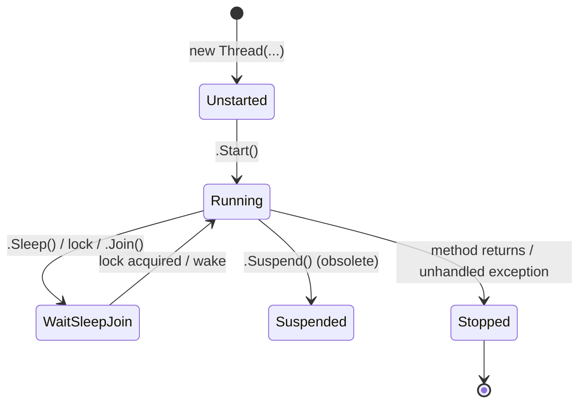
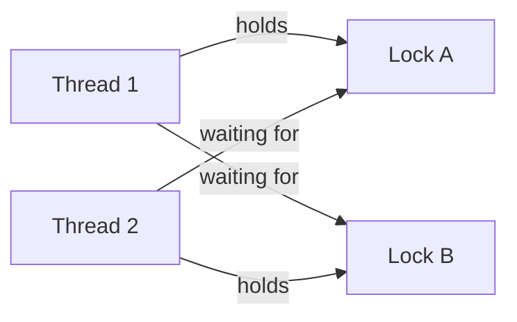

# 6. Threading, Synchronization & Concurrent Collections

> **TL;DR:** Shared mutable state requires synchronisation. Know the right primitive for each scenario, the 4 Coffman deadlock conditions, and why `ConcurrentDictionary.GetOrAdd` factory can run twice.

**Interview weight:** P0 — race conditions, deadlocks, and concurrent collection misuse cause subtle production bugs; interviewers probe these deeply at senior level.

---

## Core Concepts

- **Race condition** — behaviour depends on non-deterministic thread scheduling; two threads read-modify-write the same data without synchronisation.
- **Deadlock** — two or more threads each hold a lock the other needs; none can proceed.
- **Livelock** — threads continuously change state in response to each other but make no progress (like two people dodging the same way in a corridor).
- **Starvation** — a thread is perpetually denied a resource because other threads always take priority.
- **Thread-safe** — a type or method that behaves correctly when accessed concurrently without external synchronisation.

---

## Thread Lifecycle



---

## Lock Primitives Comparison

| Primitive | Async support | Re-entrant | Scope | Best for |
| --------- | ------------- | ---------- | ----- | -------- |
| `lock` (`Monitor`) | No | Yes (same thread) | Process | Short critical sections on shared objects |
| `Mutex` | No | Yes | Cross-process | Inter-process mutual exclusion |
| `Semaphore` | No | No | Cross-process | Limiting concurrent access (N slots) |
| `SemaphoreSlim` | Yes (`WaitAsync`) | No | Process | Async throttling, async-friendly rate limiting |
| `SpinLock` (struct) | No | No | Process | Ultra-short contended sections; avoids OS context switch |
| `ReaderWriterLockSlim` | No | Yes (read re-entrant) | Process | Many readers / infrequent writers |
| `System.Threading.Lock` (.NET 9) | No | Yes | Process | Replacement for `lock`; explicit API |

### lock / Monitor

```csharp
private readonly object _sync = new();

void Increment()
{
    lock (_sync)           // compiles to Monitor.Enter + try/finally Monitor.Exit
    {
        _count++;
    }
}

// Equivalent manual form:
bool taken = false;
try
{
    Monitor.Enter(_sync, ref taken);
    _count++;
}
finally
{
    if (taken) Monitor.Exit(_sync);
}
```

**`System.Threading.Lock` (.NET 9):**

```csharp
private readonly System.Threading.Lock _lock = new();

void Increment()
{
    using (_lock.EnterScope())  // explicit scope, disposable pattern
    {
        _count++;
    }
}
```

---

## Interlocked

```csharp
// Atomic operations — no lock needed for simple counters:
Interlocked.Increment(ref _count);           // atomic ++
Interlocked.Add(ref _count, 5);
long old = Interlocked.Exchange(ref _val, newVal);
long prev = Interlocked.CompareExchange(ref _val, newVal, expected);
// Sets _val = newVal only if _val == expected; returns old _val
```

---

## volatile & Memory Model

- **`volatile`** — prevents compiler/JIT/CPU from reordering reads/writes to that field. Guarantees *acquire semantics* on read and *release semantics* on write.
- Does NOT make operations atomic (reading/writing a 64-bit value on 32-bit CLR still non-atomic without `Interlocked`).
- Use `volatile` for a flag read by one thread and written by another; `Interlocked` for counters.

```csharp
private volatile bool _shutdown = false;

// Worker thread:
while (!_shutdown) { ProcessNext(); }

// Controller thread:
_shutdown = true;  // visible to worker without reordering
```

---

## Deadlock



**4 Coffman Conditions (ALL must hold for deadlock):**
1. **Mutual exclusion** — resource can only be held by one thread.
2. **Hold and wait** — thread holds a resource while waiting for another.
3. **No preemption** — resources can't be forcibly taken.
4. **Circular wait** — chain of threads each waiting for the next thread's resource.

**Prevention strategies:**
- **Lock ordering** — always acquire locks in a consistent global order (breaks circular wait).
- **Try-lock with timeout** — `Monitor.TryEnter(obj, timeout)`.
- **Reduce lock granularity** — hold locks for the minimum time.
- **Lock-free structures** — `ConcurrentDictionary`, `Interlocked`.

```csharp
// Deadlock-prone:
void TransferA() { lock(accountA) { lock(accountB) { Move(A, B); } } }
void TransferB() { lock(accountB) { lock(accountA) { Move(B, A); } } }

// Fixed — consistent ordering:
void Transfer(Account from, Account to)
{
    var first  = from.Id < to.Id ? from : to;
    var second = from.Id < to.Id ? to : from;
    lock(first) { lock(second) { Move(from, to); } }
}
```

---

## Thread-Safety Strategies

| Strategy | Description | When |
| -------- | ----------- | ---- |
| **Immutability** | Immutable objects need no synchronisation | Value objects, configuration, messages |
| **Confinement** | Restrict data to one thread (thread-local or actor) | Per-request state, loop-local vars |
| **Synchronisation** | Explicit lock/Interlocked | Shared counters, caches |
| **Lock-free / CAS** | `Interlocked.CompareExchange` loops | Very hot counters; avoid complex state |

---

## ConcurrentDictionary Internals

- Internally uses **striped locking** — the key space is divided into N segments (default `2 × processorCount`), each with its own lock. Only the segment holding the key is locked, allowing high concurrency.
- **`GetOrAdd(key, factory)` can run the factory twice** — if two threads see a missing key simultaneously, both may call `factory`; only one value is inserted. The other is discarded. The factory must be idempotent/pure.

```csharp
// Safe:
var cache = new ConcurrentDictionary<string, int>();
int value = cache.GetOrAdd("key", key => ExpensiveCompute(key));
// ExpensiveCompute may be called by multiple threads concurrently

// Truly-once: use Lazy<T>:
var cache = new ConcurrentDictionary<string, Lazy<int>>();
int value = cache.GetOrAdd("key", key => new Lazy<int>(() => ExpensiveCompute(key))).Value;
// Lazy<T> guarantees one execution of the factory
```

---

## Concurrent Collections Summary

| Collection | Ordering | Thread-safe ops | Notes |
| ---------- | -------- | --------------- | ----- |
| `ConcurrentDictionary<K,V>` | None | Add/Remove/GetOrAdd | Striped locks; GetOrAdd factory may run >1× |
| `ConcurrentQueue<T>` | FIFO | Enqueue/TryDequeue | Lock-free (linked list) |
| `ConcurrentStack<T>` | LIFO | Push/TryPop | Lock-free |
| `ConcurrentBag<T>` | Unordered | Add/TryTake | Per-thread local queue; best when same thread adds+takes |
| `BlockingCollection<T>` | Depends on backing | Add/Take (blocking) | Wraps any `IProducerConsumerCollection`; supports bounded, blocking, bulk take |

---

## Lazy\<T\> Thread-Safety Modes

| `LazyThreadSafetyMode` | Behaviour | Use when |
| ---------------------- | --------- | -------- |
| `ExecutionAndPublication` (default) | Only one thread executes; others wait | Expensive, must-execute-once initialisation |
| `PublicationOnly` | Multiple threads may execute; first to complete wins | Cheap, idempotent initialisation |
| `None` | No thread safety | Single-threaded only; fastest |

---

## Double-Checked Locking

```csharp
// Correct DCL with volatile (pre-.NET 4):
private static volatile Singleton _instance;
public static Singleton Instance
{
    get
    {
        if (_instance == null)
            lock (_lock)
                if (_instance == null)
                    _instance = new Singleton();
        return _instance;
    }
}

// Modern — prefer Lazy<T>:
private static readonly Lazy<Singleton> _instance =
    new Lazy<Singleton>(() => new Singleton());
public static Singleton Instance => _instance.Value;
```

---

## AsyncLocal\<T\> vs ThreadLocal\<T\>

| | `ThreadLocal<T>` | `AsyncLocal<T>` |
| - | ---------------- | --------------- |
| Scope | Current OS thread | Logical async execution context |
| Flows across `await` | No — different thread after await | Yes — copied into child context |
| Flows into `Task.Run` child | No | Yes (copy-on-write) |
| `IDisposable` | Yes | No |
| Use for | Thread-local state (per-thread caches) | Ambient context in async flows (correlation ID, tenant) |

```csharp
private static readonly AsyncLocal<string> _correlationId = new();

async Task HandleRequest(string id)
{
    _correlationId.Value = id;
    await DoWorkAsync();  // _correlationId.Value still == id after await
}
```

See [Distributed Systems Patterns](../05-System-Design-HLD/09-Distributed-Systems-Patterns.md) for distributed lock patterns (Redlock).

---

## ReaderWriterLockSlim

```csharp
private readonly ReaderWriterLockSlim _rwLock = new();

string Read(string key)
{
    _rwLock.EnterReadLock();
    try   { return _cache[key]; }
    finally { _rwLock.ExitReadLock(); }
}

void Write(string key, string value)
{
    _rwLock.EnterWriteLock();
    try   { _cache[key] = value; }
    finally { _rwLock.ExitWriteLock(); }
}
```

---

## Interview Questions

**Q1. What does the `lock` keyword compile to?**
A: `Monitor.Enter(obj, ref taken)` inside a `try` block, `Monitor.Exit(obj)` in `finally`. The `ref taken` overload ensures `Exit` is only called if `Enter` succeeded, preventing double-exit on exception in Enter itself.

**Q2. What are the 4 Coffman conditions for deadlock?**
A: Mutual exclusion, hold-and-wait, no preemption, circular wait. All four must hold. Breaking any one prevents deadlock. Consistent lock ordering breaks circular wait — the most practical fix in production code.

**Q3. Explain why `ConcurrentDictionary.GetOrAdd` factory can run more than once.**
A: `GetOrAdd` checks if the key exists (under a read). If missing, it calls the factory (outside the lock) then tries to insert the result. A second thread can pass the missing-key check simultaneously, also call the factory, and attempt insert. Only one value is stored; the other is discarded. The factory must be safe to call multiple times.

**Q4. When would you use `ReaderWriterLockSlim` over `lock`?**
A: When reads heavily outnumber writes. `lock` allows only one thread at a time. `RWLS` allows unlimited concurrent readers, but exclusive writer access. Suitable for in-memory caches, configuration snapshots, lookup tables updated rarely but read at high frequency (e.g. 5K RPS read vs once-per-minute write).

**Q5. What is the difference between `ThreadLocal<T>` and `AsyncLocal<T>`?**
A: `ThreadLocal<T>` is scoped to the OS thread — after an `await`, the continuation may run on a different thread, losing the value. `AsyncLocal<T>` flows through the logical async context (ExecutionContext) and persists across `await` boundaries. Use `AsyncLocal<T>` for ambient values in async code (correlation IDs, per-request tenants).

**Q6. What is `volatile` and what does it NOT guarantee?**
A: `volatile` prevents compiler/JIT/CPU reordering of reads/writes to that field; ensures fresh read (no cached register value). Does NOT guarantee atomicity for 64-bit values on 32-bit CLR, and does NOT make compound operations (read-modify-write) atomic. For those, use `Interlocked`.

**Q7. What is `SpinLock` and when is it preferable to `Monitor`?**
A: `SpinLock` (struct) busy-waits (spins) instead of sleeping. Avoids OS context-switch overhead. Preferable only when: contention is very brief (< a few microseconds) AND you have many cores. If contention is long, spinning wastes CPU cycles. Use in low-level, high-frequency internal structures (custom lock-free queue nodes).

**Q8. Explain the double-checked locking pattern and why `volatile` is needed.**
A: Without `volatile`, the CPU/JIT may reorder the write to `_instance` with constructor execution — a thread reading `_instance != null` might get a partially constructed object. `volatile` forces the full constructor write to be visible before `_instance` is written. Modern .NET: prefer `Lazy<T>` which handles all this correctly.

**Q9. Senior — design a thread-safe cache with expiry using `ConcurrentDictionary`.**
A: Use `ConcurrentDictionary<TKey, (TValue Value, DateTime Expiry)>`. On read: check if entry exists and not expired; if expired, `TryRemove` then re-fetch. On `GetOrAdd`, wrap value in `Lazy<T>` to prevent duplicate factory execution. For active expiry, a background `System.Threading.Timer` or `Channel`-based cleanup loop calls `TryRemove` for expired keys. For production: prefer `IMemoryCache` (post-eviction callbacks, sliding expiry, size limits).

**Q10. Senior — explain striped locking in `ConcurrentDictionary` and its tradeoffs.**
A: Keys are hash-partitioned into N segments; each segment has its own lock. Concurrent writers on different segments proceed in parallel — throughput scales with core count. Trade-off: GetOrAdd across segments isn't atomic (two keys can be inserted independently). `Count` acquires ALL segment locks to return a consistent snapshot — avoid calling `Count` in hot paths on a large concurrent dictionary.

**Q11. Senior — `lock` vs `SemaphoreSlim` in async code — why does it matter?**
A: `lock` blocks the thread — in an async method, blocking threads causes starvation on the thread pool. `SemaphoreSlim.WaitAsync()` suspends the continuation (releases the thread to the pool) while waiting. Always use `SemaphoreSlim` for async mutual exclusion. If you need async re-entrancy, use a dedicated per-key semaphore keyed by a `ConcurrentDictionary`.

**Q12. Senior — what is livelock and how do you prevent it in a retry loop?**
A: Two operations each detect conflict, back off, and retry simultaneously — forever. Prevention: randomised exponential backoff with jitter (`TimeSpan.FromMilliseconds(baseDelay * Math.Pow(2, attempt) + Random.Shared.Next(0, jitter))`). At Xbox, Service Bus retry with fixed interval caused livelock on 100-concurrent-consumer startup; switching to jittered backoff resolved it.

**Q13. Senior — `AsyncLocal` in ASP.NET Core for distributed tracing — what is the risk?**
A: `AsyncLocal<T>` copies the context into child tasks, not shares it. If a child task mutates `AsyncLocal.Value`, the parent doesn't see it (copy-on-write). This is correct for read-only ambient context (correlation ID), but surprising if you expect bidirectional writes. For distributed tracing, set the correlation ID at the start of the request, rely on it being copied into every `await` and `Task.Run` that follows — this is safe and the standard pattern (Activity API uses `AsyncLocal` internally).

---

## Quick Recap

- `lock` = `Monitor.Enter/Exit`; `.NET 9` `System.Threading.Lock` = explicit scope API.
- Deadlock = 4 Coffman conditions; break circular wait with consistent lock ordering.
- `ConcurrentDictionary` = striped locks; `GetOrAdd` factory may run >1× — must be idempotent.
- `SemaphoreSlim.WaitAsync()` for async mutual exclusion; never `lock` in async methods.
- `volatile` = visibility/ordering; NOT atomicity for compound operations.
- `AsyncLocal<T>` flows across `await`; `ThreadLocal<T>` does not — use `AsyncLocal` for ambient async context.
- `Lazy<T>` default mode = exactly-once thread-safe init; `Lazy<T>` + `ConcurrentDictionary` = safe per-key init.
- `ConcurrentQueue` = lock-free FIFO; `ConcurrentBag` = best when same thread adds and takes.
