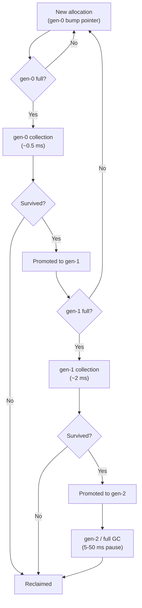

# 7. Memory Management & GC

> **TL;DR:** The GC's generational model keeps most allocations fast; know when it hurts (large objects, gen-2 collections, finalizers), how to avoid it (`Span<T>`, `ArrayPool<T>`, `IDisposable`), and how to diagnose leaks in production.

**Interview weight:** P0 — memory pressure at scale (5K RPS) is a real performance axis; every senior C# interview asks about IDisposable, GC generations, or allocation reduction.

---

## Core Concepts

- **Managed heap** — divided into small-object heap (SOH) and large-object heap (LOH); GC owns all allocation and collection.
- **Generations** — objects graduate from gen-0 to gen-2 if they survive collection; collecting only gen-0 is cheap; gen-2 is expensive.
- **Mark-sweep-compact** — GC marks live objects, sweeps dead ones, compacts survivors (except LOH by default).
- **Pinned Object Heap (POH)** — .NET 5+; objects pinned for interop live here, preventing fragmentation of SOH.

---

## Generational GC Diagram



### Generation & Heap Summary

| Heap | Threshold | Typical collection time | Objects | Compacted? |
| ---- | --------- | ----------------------- | ------- | ---------- |
| gen-0 | ~256 KB | < 1 ms | Short-lived (most) | Yes |
| gen-1 | ~2 MB | 1–5 ms | Medium-lived | Yes |
| gen-2 | No limit | 5–50+ ms | Long-lived (static, cached) | Yes |
| LOH | Objects ≥ 85,000 bytes | With gen-2 | Large arrays, strings | No (fragmentation risk) |
| POH (.NET 5+) | — | With gen-2 | Pinned interop buffers | No (intentionally) |

**Ephemeral segment** — the memory segment holding gen-0 and gen-1 (SOH). Typically 16–256 MB. When it fills, a gen-0 or gen-1 GC fires.

**Card tables** — GC optimisation: track which gen-2 objects contain pointers to gen-0/1 objects. On a gen-0 collection, only card-table-marked gen-2 regions are scanned (not all of gen-2), keeping minor collections fast.

---

## GC Modes

| Mode | Use case | Pause behaviour | Config |
| ---- | -------- | --------------- | ------ |
| Workstation GC | Desktop apps; single-user | Lower throughput; shorter pauses | Default for non-server hosts |
| Server GC | ASP.NET Core / services | Higher throughput; potential longer pauses | `<ServerGarbageCollection>true</ServerGarbageCollection>` |
| Concurrent/Background GC | Gen-2 concurrent with app threads | Minimises pause; most allocations don't stop the world | On by default with Server GC |
| Non-concurrent GC | Legacy; debugging | Fully stop-the-world | `<ConcurrentGarbageCollection>false` |

**At 5K RPS:** a 50 ms gen-2 GC pause = all in-flight requests either delay or timeout if SLO is 100 ms p99. Mitigation: keep gen-2 object count low, use object pooling, avoid large temporary buffers.

---

## IDisposable, using, await using

### Full Dispose Pattern

```csharp
public class ResourceHolder : IDisposable
{
    private bool _disposed = false;
    private SafeHandle _handle = new SafeFileHandle(IntPtr.Zero, true);
    private UnmanagedResource _unmanaged;

    public void Dispose()
    {
        Dispose(disposing: true);
        GC.SuppressFinalize(this);   // don't run finalizer — already cleaned up
    }

    protected virtual void Dispose(bool disposing)
    {
        if (_disposed) return;
        if (disposing)
        {
            _handle.Dispose();       // managed resources
        }
        _unmanaged.Free();           // unmanaged resources — always, regardless of disposing
        _disposed = true;
    }

    ~ResourceHolder()                // finalizer — last resort; avoid if possible
    {
        Dispose(disposing: false);
    }
}
```

- **`GC.SuppressFinalize(this)`** — removes the object from the finaliser queue → avoids promotion to gen-1 or higher just for finalisation.
- **`SafeHandle`** — preferred over raw `IntPtr`; handles CER (Constrained Execution Region) and suppresses finalize automatically.

```csharp
// Async disposable:
await using var conn = await CreateConnectionAsync();
```

---

## Finalizer Queue Cost

1. Object with finalizer is allocated → added to finalizer queue.
2. On GC, if not reachable, moved to **F-reachable queue** (still alive!) and promoted to gen-1.
3. Finalizer thread processes F-reachable queue → runs `~ClassName()`.
4. Next GC collects the object.
- **Cost:** 2 extra GC cycles to collect a finalised object. Avoid finalizers except for unmanaged resource wrappers.

---

## WeakReference\<T\>

```csharp
// Object can be collected; we check before use:
var weak = new WeakReference<ExpensiveObject>(new ExpensiveObject());

if (weak.TryGetTarget(out var obj))
    obj.Use();
else
    Console.WriteLine("Was collected");
```

- `WeakReference<T>` does not prevent GC collection.
- Use for: caches that yield memory under pressure, event-handler leak prevention, observer registries.

---

## Memory Leaks in Managed Code

| Root cause | Example | Fix |
| ---------- | ------- | --- |
| Static event subscriptions | `AppDomain.UnhandledException += handler` — never removed | Unsubscribe; use WeakEvent |
| Static collections with growing data | `static List<LogEntry> _audit` never trimmed | Bound the collection; use `MemoryCache` with TTL |
| Captured closures holding large objects | `Action callback = () => bigObject.Process()` stored in a static | Ensure callback is removed; avoid capturing large scope |
| `System.Timers.Timer` not disposed | Timer holds reference to target | `Dispose()` the timer |
| `HttpClient` misuse | `new HttpClient()` per request | Use `IHttpClientFactory` or static singleton |
| Event handler in long-lived pub + short-lived sub | Player subscribes to global event, never unsubscribes | `Dispose()` unsubscribes; WeakReference pattern |
| `ThreadLocal<T>` holding large objects | Thread pool thread holds `T`; thread never exits | Dispose `ThreadLocal<T>` explicitly |

---

## Allocation Reduction Techniques

| Technique | Savings | Notes |
| --------- | ------- | ----- |
| `Span<T>` / `ReadOnlySpan<T>` | Zero-copy slicing | Stack-only; no GC involvement |
| `stackalloc` | Stack allocation for small buffers | Safe via `Span<T>`; max ~1 KB practical |
| `ArrayPool<T>.Shared` | Rent/return arrays without allocation | Must return; never hold across async if Span used |
| `ObjectPool<T>` (`Microsoft.Extensions.ObjectPool`) | Reuse expensive objects | Thread-safe; configurable max pool size |
| `StringBuilder` pooling | Reduce string alloc | `StringBuilderPool` via `ObjectPool` |
| Struct enumerators | Avoid enumerator heap alloc | `List<T>`, `Span<T>` already use struct enumerators |
| `StringPool` (CommunityToolkit) | Intern dynamic strings | Fixed-size LRU intern pool |
| `[SkipLocalsInit]` | Avoid zeroing local arrays | Only for `unsafe`/performance-critical code |

```csharp
// ArrayPool — borrow and return:
byte[] buffer = ArrayPool<byte>.Shared.Rent(4096);
try
{
    int read = stream.Read(buffer, 0, buffer.Length);
    Process(new ReadOnlySpan<byte>(buffer, 0, read));
}
finally
{
    ArrayPool<byte>.Shared.Return(buffer, clearArray: true);
}
```

---

## GC.Collect Misuse

- `GC.Collect()` forces a full gen-2 collection — 5–50 ms pause; **never call in production hot paths**.
- Valid uses: before a benchmark to start with known state; after releasing a large one-time resource; test teardown.

---

## Diagnosing Memory Issues

| Tool | What it shows | How to use |
| ---- | ------------- | ---------- |
| `dotnet-counters` | Live GC gen sizes, alloc rate, collection counts | `dotnet-counters monitor -p <pid>` |
| `dotnet-dump` | Full heap snapshot; object instances by type | `dotnet-dump collect -p <pid>` → `dotnet-dump analyze` |
| `dotnet-gcdump` | GC heap graph (lighter than dump) | `dotnet-gcdump collect -p <pid>` |
| PerfView | GC events, allocation stacks, generation promotion | GUI; Windows; "GC Heap Alloc Stacks" view |
| Application Insights | Allocation exceptions, GC pause telemetry | Azure Monitor integration |
| `EventPipe` / `DiagnosticSource` | Programmatic in-process GC event listener | `System.Diagnostics.Tracing` |

```bash
# Quick allocation check:
dotnet-counters monitor --process-id 1234 --counters System.Runtime[gen-0-gc-count,gen-2-gc-count,alloc-rate]
```

---

## Interview Questions

**Q1. Explain the three GC generations and why they exist.**
A: Most objects die young (gen-0). Keeping gen-0 small and collecting it frequently (~256 KB threshold) keeps pause times < 1 ms. Survivors promote to gen-1/gen-2 where collections are rarer. The hypothesis: short-lived objects (request allocations, temporaries) never reach gen-2. If they do, it means allocations are too large or objects are accidentally rooted (leak).

**Q2. What is the LOH and why does it fragment?**
A: Objects ≥ 85,000 bytes go to the LOH. Unlike SOH, LOH is not compacted by default (compacting large objects would be too expensive). Dead LOH objects leave holes. If new requests allocate different-sized large arrays, holes don't fit — free list fragmentation grows. Fix: reuse large buffers via `ArrayPool<T>` (rented arrays stay in gen-2 but aren't fragmented further).

**Q3. What is `GC.SuppressFinalize` and when must you call it?**
A: After explicitly cleaning up resources in `Dispose()`, call `GC.SuppressFinalize(this)` to remove the object from the finaliser queue. Without it, the object promotes to gen-1 (at minimum) purely to run the finaliser — wasting a GC cycle. Always call in the public `Dispose()` method.

**Q4. Describe the full `IDisposable` pattern for a class with both managed and unmanaged resources.**
A: Public `Dispose()` calls `Dispose(true)` + `SuppressFinalize`. Protected virtual `Dispose(bool disposing)`: if `disposing`, free managed resources (child `IDisposable`s); always free unmanaged resources. Finalizer calls `Dispose(false)`. `bool _disposed` guard prevents double-dispose. See code example above.

**Q5. What are common managed memory leaks and how do you detect them?**
A: Event handler leaks (publisher outlives subscriber), static collections with unbounded growth, `ThreadLocal<T>` on thread pool threads, captured closures in long-lived delegates, `Timer` not disposed. Detect with `dotnet-gcdump` → look for unexpectedly large gen-2 object counts of known types; PerfView GC heap shows reference paths to roots.

**Q6. When would you use `WeakReference<T>`?**
A: Caches that should yield memory under pressure (cache is nice-to-have, not required). Observer/event patterns where the subscriber may be collected (WeakEvent). Cache policy: on cache miss after `TryGetTarget` fails, re-populate; this is correct eviction behaviour.

**Q7. Explain `ArrayPool<T>` and the rules for safe use.**
A: `ArrayPool<T>.Shared` keeps a per-core pool of arrays by power-of-two sizes. `Rent(n)` returns an array ≥ n (may be larger). `Return(array, clearArray)` returns it to pool; set `clearArray: true` for sensitive data. Rules: never use an array after returning; never return arrays not rented from the pool; do not hold across `await` if using `Span<T>` over the buffer (use `Memory<T>` instead).

**Q8. What is the difference between Workstation GC and Server GC?**
A: Server GC: one heap per logical core, parallel collection threads = higher throughput. Default for ASP.NET Core. Workstation GC: single heap, single collection thread = lower memory usage, suitable for desktop/single-user. At 5K RPS, Server GC is mandatory — without it, GC throughput bottlenecks well before CPU.

**Q9. Senior — why do finalizers promote objects and what is the performance cost?**
A: Objects with finalizers are added to the finalizer queue at allocation time. On GC, if the object is unreachable but has a pending finalizer, it moves to the F-reachable queue and is promoted to gen-1 (not collected yet). Finalizer thread then calls the destructor. Next GC collects it. Cost: 2 extra GC cycles per object + finalizer thread CPU. At high allocation rates, this delays collection of thousands of objects, increasing gen-1/2 pressure.

**Q10. Senior — explain how `Span<T>` reduces GC pressure in a parser at 5K RPS.**
A: Without `Span<T>`: parsing a JSON body → `Substring()` per token = N string allocations per request = N × 5K alloc/s hitting gen-0. With `Span<T>`: `ReadOnlySpan<char>` slices over the original buffer — zero allocations. 5K RPS × 50 substrings = 250K fewer allocs/s → gen-0 collection frequency drops; fewer promotions to gen-1/2; reduced pause frequency. Measured impact: `System.Text.Json` UTF-8 parsing uses `Utf8JsonReader` over `ReadOnlySpan<byte>` — this is why STJ is 2–5× faster than Newtonsoft on throughput benchmarks.

**Q11. Senior — production scenario: p99 latency spikes every 2 minutes. How do you diagnose?**
A: Symptom pattern (periodic spike every 1–5 min) = GC gen-2 collection. Confirm: `dotnet-counters` `gen-2-gc-count` increasing, `gc-pause-time-ratio` elevated during spikes. Root cause hunt: high `alloc-rate` → objects surviving to gen-2 (check gen-1-gc-count too). Use PerfView "GC Heap Alloc Stacks" to find allocation hotspots. Likely culprit at 5K RPS: large dictionary/list allocations per request (should be pooled), cached byte arrays growing to LOH threshold, or a `Lazy<T>` initialised lazily under load that buffers large data.

**Q12. Senior — `stackalloc` safety: when is it dangerous and how does `Span<T>` make it safe?**
A: `stackalloc` in `unsafe` context returns a pointer — dangling pointer risk if returned from the method. In safe context (C# 7.3+), `stackalloc` must be assigned to `Span<T>` or `ReadOnlySpan<T>` — the compiler enforces the span doesn't escape its declaring scope. Dangerous if: `stackalloc` size is runtime-controlled without upper bound (stack overflow risk). Practical limit: 1–4 KB safe; use `ArrayPool<T>` above that.

---

## Quick Recap

- GC generations: gen-0 fast (~1 ms), gen-2 expensive (5–50 ms); keep objects short-lived.
- LOH ≥ 85 KB; not compacted → fragmentation; use `ArrayPool<T>` for large buffers.
- Finalizers: 2 extra GC cycles per object; use `SafeHandle`; always `GC.SuppressFinalize` in `Dispose()`.
- `IDisposable` full pattern: `Dispose(bool)` + finalizer + `_disposed` guard + `SuppressFinalize`.
- Managed leaks: static events, static collections, captured closures, undisposed timers, `HttpClient` misuse.
- `Span<T>` + `ArrayPool<T>` + `stackalloc` = zero/low alloc hot paths.
- Server GC = mandatory for ASP.NET Core at scale; Workstation GC = desktop/single-user.
- Diagnose: `dotnet-counters` → `dotnet-gcdump` → PerfView for allocation stacks.
