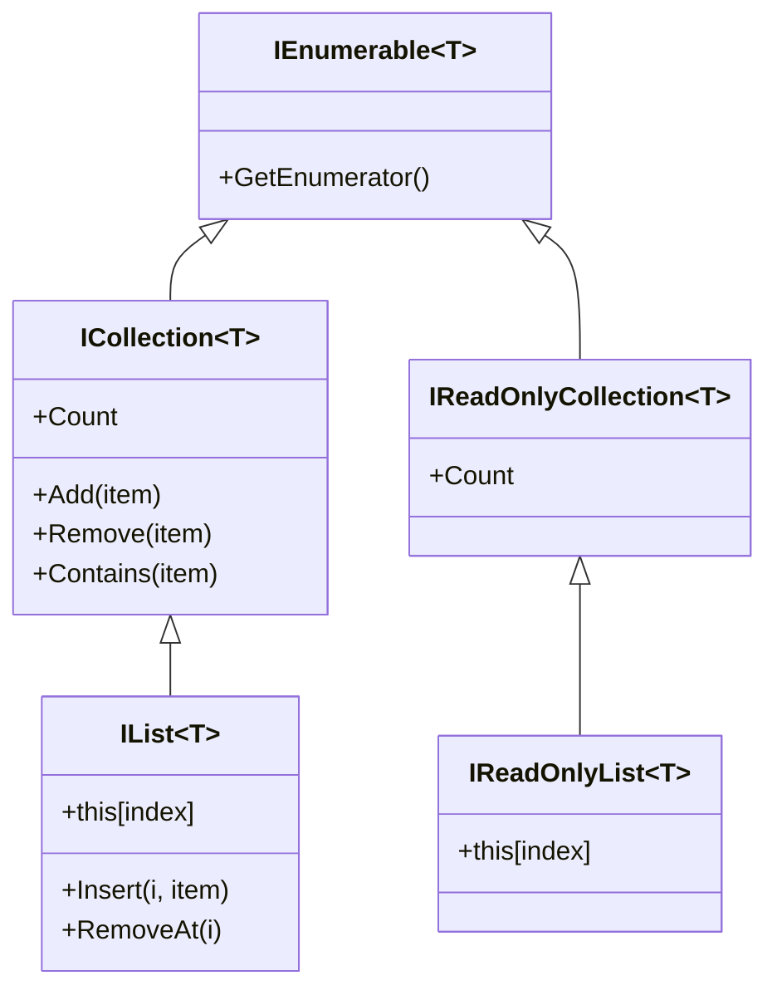

# 8. Collections & Complexity

> **TL;DR:** Pick the right BCL collection by access pattern and complexity. `Dictionary` and `HashSet` are O(1) average; `SortedDictionary` is O(log n); `FrozenDictionary` is read-optimised, immutable-after-creation. Know thread-safety column before using any collection from multiple threads.

**Interview weight:** P0 — collection choice is a constant code-review question; interviewers test Big-O, memory tradeoffs, and thread-safety awareness.

---

## Interface Hierarchy



- **`IEnumerable<T>`** — read-forward only; deferred; minimum contract for LINQ.
- **`ICollection<T>`** — adds `Count`, `Add`, `Remove`, `Contains`.
- **`IList<T>`** — adds index access and insert-at-position.
- **`IReadOnlyList<T>`** — covariant, index + count, no mutation. Prefer for public read-only return types.

---

## Full BCL Collections Reference

| Collection | Add | Remove | Lookup / Index | Notes | Thread-safe | When to use |
| ---------- | --- | ------ | -------------- | ----- | ----------- | ----------- |
| `T[]` | O(1) amortised (copy to resize = O(n)) | O(n) shift | O(1) by index | Fixed size after creation; most cache-friendly | No | Known-size, fixed buffers; SIMD-friendly |
| `List<T>` | O(1) amortised | O(n) shift | O(1) by index | Backed by `T[]`; doubles capacity on resize | No | General ordered list; default sequential collection |
| `Dictionary<K,V>` | O(1) avg | O(1) avg | O(1) avg by key | Hash table; collision → O(n) worst | No | Key-value lookups; most common map |
| `SortedDictionary<K,V>` | O(log n) | O(log n) | O(log n) | Red-Black tree; iteration in key order | No | Ordered map; range queries |
| `SortedList<K,V>` | O(n) | O(n) | O(log n) binary search | Backed by 2 arrays; memory efficient; good for small/infrequent writes | No | Small sorted map; read-heavy |
| `HashSet<T>` | O(1) avg | O(1) avg | O(1) `Contains` | Hash set; no duplicates; set operations | No | Membership test; deduplication |
| `SortedSet<T>` | O(log n) | O(log n) | O(log n) | Red-Black tree; sorted unique elements | No | Sorted unique values; range queries |
| `Queue<T>` | O(1) `Enqueue` | O(1) `Dequeue` | No index | Circular buffer; FIFO | No | Work queues |
| `Stack<T>` | O(1) `Push` | O(1) `Pop` | No index | Array-backed; LIFO | No | DFS, undo, expression evaluation |
| `LinkedList<T>` | O(1) at node | O(1) at node | O(n) find | Doubly-linked; cheap insert/remove at known position | No | Frequent insert/remove in middle; rare by index |
| `PriorityQueue<T,P>` | O(log n) | O(log n) `Dequeue` | No | Binary min-heap; .NET 6+ | No | Dijkstra, task scheduling, top-k |
| `ConcurrentDictionary<K,V>` | O(1) avg | O(1) avg | O(1) avg | Striped locks; `GetOrAdd` factory may run 2× | Yes | Shared concurrent caches |
| `ConcurrentQueue<T>` | O(1) | O(1) | No | Lock-free linked list | Yes | Async producer/consumer queues |
| `ConcurrentBag<T>` | O(1) | O(1) | No | Per-thread local queues; unordered | Yes | Work-stealing patterns; same-thread add+take |
| `BlockingCollection<T>` | O(1) | O(1) blocking | No | Wraps any `IProducerConsumerCollection`; bounded; blocking | Yes | Thread-based producer/consumer; bounded buffer |
| `ImmutableList<T>` | O(log n) | O(log n) | O(log n) | AVL tree; sharing subtrees | Yes | Functional patterns; snapshots |
| `ImmutableDictionary<K,V>` | O(log n) | O(log n) | O(log n) | Hash-array mapped trie | Yes | Immutable maps |
| `FrozenDictionary<K,V>` | N/A (built once) | N/A | O(1) — faster than `Dictionary` | .NET 8+; optimised for read-only after creation; minimal perfect hash | Yes (read-only) | Config, routing tables, static lookup |
| `FrozenSet<T>` | N/A | N/A | O(1) | .NET 8+; same as FrozenDictionary for sets | Yes (read-only) | Static enum-like membership tests |
| `ReadOnlySpan<T>` | N/A | N/A | O(1) by index | Stack-only view; zero alloc | N/A (stack) | Parsing, hot-path zero-copy reads |

---

## Choosing Capacity Up-Front

```csharp
// Without initial capacity — List doubles 13 times for 10,000 items:
var list = new List<Order>();

// With capacity — zero reallocations:
var list = new List<Order>(10_000);

// Dictionary capacity — avoid rehash (prime bucket count is chosen internally):
var dict = new Dictionary<string, Order>(capacity: 5_000);

// Pre-size StringBuilder:
var sb = new StringBuilder(capacity: 256);
```

Rule: if you know the approximate count, provide it. Reallocation cost = copying entire backing array + GC pressure from discarded old arrays.

---

## FrozenDictionary & FrozenSet (.NET 8+)

```csharp
// Build once at startup; use for lifetime of app:
var routes = new Dictionary<string, IHandler>
{
    ["GET /orders"]   = new GetOrdersHandler(),
    ["POST /orders"]  = new CreateOrderHandler(),
};

FrozenDictionary<string, IHandler> frozenRoutes = routes.ToFrozenDictionary();

// At request time — faster than Dictionary (no modifiable-state overhead):
if (frozenRoutes.TryGetValue(requestKey, out var handler))
    await handler.HandleAsync(ctx);
```

- Internally uses a minimal perfect hash; no bucket chaining; lookup ~20–40% faster than `Dictionary` for large sets.
- Immutable after creation — fully thread-safe without any locking.

---

## ImmutableList vs FrozenDictionary vs ReadOnlyDictionary

| | `ImmutableList<T>` | `FrozenDictionary<K,V>` | `ReadOnlyDictionary<K,V>` |
| - | ------------------- | ----------------------- | ------------------------- |
| Mutation | Returns new version (structural sharing) | Not possible | Not possible (wrapper) |
| Thread-safe | Yes | Yes | Yes (reads) |
| Build time | O(n log n) | O(n) | O(1) wrap |
| Lookup | O(log n) | O(1) | O(1) |
| Use for | Functional updates, history | Static read-only after startup | Exposing a private mutable dict as read-only |

---

## Custom Comparers

```csharp
// Case-insensitive dictionary key:
var dict = new Dictionary<string, int>(StringComparer.OrdinalIgnoreCase);
dict["API"] = 1;
Console.WriteLine(dict["api"]); // 1

// Custom equality comparer:
var set = new HashSet<Point>(new PointEqualityComparer());

// StringComparer performance note:
// Ordinal          — byte comparison; fastest; no culture rules
// OrdinalIgnoreCase — fast ASCII case fold
// InvariantCulture  — slower; linguistic rules; culture-neutral
// CurrentCulture    — slowest; varies by machine locale; avoid in keys
```

---

## Array Covariance Pitfall

```csharp
Dog[] dogs = new Dog[3];
Animal[] animals = dogs;         // allowed — array covariance
animals[0] = new Cat();          // ArrayTypeMismatchException at runtime!

// Safe alternatives:
IReadOnlyList<Dog> readOnly = dogs;  // covariant interface — prevents writes
IList<Animal> safe = new List<Animal>(dogs);  // separate list
```

---

## StringComparer: Ordinal vs Culture-Sensitive Performance

- `StringComparer.Ordinal` — pure byte comparison; 3–5× faster than `InvariantCulture` in dictionary lookups.
- `OrdinalIgnoreCase` — fast ASCII fold; ~2× faster than culture-sensitive ignore case.
- Use `Ordinal`/`OrdinalIgnoreCase` for: IDs, keys, paths, URLs, headers.
- Use `CurrentCulture` only for: user-visible sort order, display text comparisons.

---

## IEnumerable vs ICollection vs IList vs IReadOnlyList in API Design

| Return / param type | Consumer can do | Use for |
| ------------------- | --------------- | ------- |
| `IEnumerable<T>` | Iterate only | Lazy streams, internal sequences |
| `IReadOnlyCollection<T>` | Iterate + Count | Count-aware read-only |
| `IReadOnlyList<T>` | Index + Count + iterate; covariant | Public read-only collections; safe to expose |
| `ICollection<T>` | Iterate + mutate + Count | Mutable collection parameter |
| `IList<T>` | Full index + mutate | Rare; exposes implementation detail |

**Guideline:** public APIs should return `IReadOnlyList<T>` (not `List<T>`) — prevents callers from casting and mutating; allows future implementation swap.

---

## Interview Questions

**Q1. What is the time complexity of `Dictionary<K,V>.TryGetValue`?**
A: O(1) average (hash table). Worst case O(n) if all keys hash to the same bucket (deliberate hash-collision DoS — mitigated by .NET's randomised string hash seed). For user-controlled keys in a web API, this risk is real; `StringComparer.OrdinalIgnoreCase` uses a randomised seed by default in .NET Core.

**Q2. When would you use `SortedDictionary` over `Dictionary`?**
A: When you need keys in sorted order (range queries, min/max, ordered iteration) and `O(log n)` ops are acceptable. `Dictionary` = O(1) but unordered. `SortedDictionary` = O(log n) using a Red-Black tree. If the map is small and mostly read, `SortedList` (binary search over arrays) is more memory-efficient.

**Q3. What is the difference between `ConcurrentDictionary` and a `Dictionary` with a `lock`?**
A: `ConcurrentDictionary` uses striped locks (N segments) — parallel reads/writes on different keys proceed without blocking each other. A single `lock` serialises all access. At 5K RPS with a hot shared cache, `ConcurrentDictionary` typically delivers 4–8× higher throughput on multi-core.

**Q4. Why does `List<T>` double its capacity on resize instead of growing by 1?**
A: Amortised O(1) add: each element is "moved" an amortised constant number of times across all doublings. If it grew by 1, each `Add` to a full list copies all N elements → O(n) per add → O(n²) total for N adds. Doubling = total copy work ≈ 2N → O(n) total.

**Q5. What is `FrozenDictionary` and when should you use it instead of `Dictionary`?**
A: `FrozenDictionary<K,V>` (`.NET 8+`) is built once via `.ToFrozenDictionary()` and is immutable thereafter. It uses a minimal perfect hash — no collision chains, no modification overhead. Lookup is 20–40% faster than `Dictionary`. Use for routing tables, feature flags, config maps, and any lookup-heavy dataset that doesn't change after startup. Fully thread-safe without locks.

**Q6. When is `LinkedList<T>` the right choice?**
A: Only when you have a node reference and need O(1) insert/remove at that position — e.g., an LRU cache (doubly-linked list for O(1) move-to-front combined with a `Dictionary` for O(1) lookup). For most other cases, `List<T>` wins due to cache locality. `LinkedList<T>` node access by index is O(n).

**Q7. What is the difference between `ImmutableList<T>` and `FrozenDictionary<K,V>`?**
A: `ImmutableList<T>`: mutating returns a new list sharing structural subtrees (AVL tree) — suitable for functional/persistent data structures. `FrozenDictionary<K,V>`: truly immutable after creation, no update semantics, optimised purely for lookup throughput. `ImmutableList` is for evolving immutable state; `FrozenDictionary` is for read-only reference data.

**Q8. What is array covariance and why is it a runtime trap?**
A: `Dog[]` can be assigned to `Animal[]` (CLR allows covariance on arrays). But writing a `Cat` into what the runtime knows is a `Dog[]` throws `ArrayTypeMismatchException`. The compiler cannot catch this — it's a CLR runtime check. Fix: use `IReadOnlyList<T>` (covariant interface, prevents writes) instead of raw arrays in API contracts.

**Q9. Senior — `ConcurrentBag<T>` internals: when does it perform well and when does it hurt?**
A: `ConcurrentBag<T>` maintains per-thread local queues (work-stealing deque). When the same thread that produces an item also consumes it — O(1) no contention. When producers and consumers are different threads, a stealing operation acquires a lock and takes from another thread's queue. Worst case: many consumer threads stealing from one producer thread = contention. Best scenario: thread-affined pipeline where each worker thread both enqueues and dequeues its own work.

**Q10. Senior — design a high-throughput in-memory lookup for 500K route entries in ASP.NET Core.**
A: Build a `FrozenDictionary<string, RouteHandler>` at startup from the route table. Keys: e.g. `"GET /api/orders/{id}"` normalised. `FrozenDictionary` with `StringComparer.OrdinalIgnoreCase` gives fastest possible lookup. No locking needed. For dynamic routes, keep two sets: a `FrozenDictionary` for static routes (hot path, ~99% of requests) and a `Dictionary` behind a `ReaderWriterLockSlim` for runtime-added routes. Rebuild and swap the frozen dictionary when the dynamic set changes. Atomically swap via `Interlocked.Exchange` on a `volatile` reference.

**Q11. Senior — `PriorityQueue<T,P>` (.NET 6+): how does it compare to `SortedSet<T>` for a scheduler?**
A: `PriorityQueue` = binary min-heap: `Enqueue` O(log n), `Dequeue` O(log n), no enumeration guarantee. `SortedSet` = Red-Black tree: `Add/Remove` O(log n), ordered iteration, supports `Min`/`Max`. For a scheduler: `PriorityQueue` wins — cheaper constant factors, no need for full ordering. Use `SortedSet` when you need range queries or iteration over pending items sorted by priority. `PriorityQueue` doesn't support updating priority of an existing item — you'd use a lazy-deletion pattern.

**Q12. Senior — when should you prefer `T[]` over `List<T>` for a collection returned from a hot-path method?**
A: `T[]` when the size is known and fixed, and callers need index access. Zero overhead versus `List<T>` wrapper object. `Span<T>` over `T[]` in the consuming code to avoid bounds checks (JIT eliminates them in linear scan). `List<T>` when size is dynamic. For public APIs, return `IReadOnlyList<T>` (covariant, prevents casting to `List<T>` and mutating). For internal hot paths measured to allocate heavily, consider `ArrayPool<T>.Shared.Rent()` + explicit return.

---

## Quick Recap

- `Dictionary` / `HashSet` = O(1) avg; unordered. `SortedDictionary` / `SortedSet` = O(log n); ordered.
- `List<T>` = O(1) amortised add; O(n) insert/remove. Pre-size with capacity when count is known.
- `FrozenDictionary` (.NET 8) = ~20–40% faster than `Dictionary`; immutable after creation; perfect for config/routing.
- `ImmutableList` = structural sharing; use for functional update patterns; not for lookup speed.
- `ConcurrentDictionary` = striped locks; `GetOrAdd` factory may run 2×; fastest concurrent map.
- `ConcurrentBag` = best when same thread produces and consumes; stealing adds contention.
- `IReadOnlyList<T>` = correct public return type; covariant; prevents mutation.
- Array covariance = runtime trap; use `IReadOnlyList<T>` in API contracts instead of `T[]`.
- `StringComparer.Ordinal` = fastest for IDs/keys; never `CurrentCulture` for dictionary keys.
