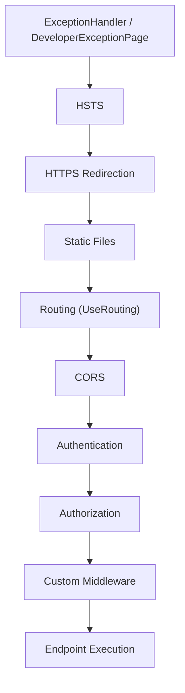
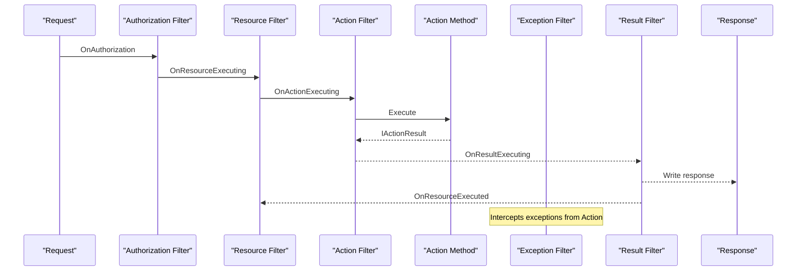

# 1. Request Pipeline, Middleware & Filters

> **TL;DR:** Every ASP.NET Core request flows through an ordered chain of middleware delegates; MVC adds a second pipeline of filters on top. Get the order wrong and you silently break auth, CORS, or error handling at scale.

**Interview weight:** P0 — almost every senior interview asks about middleware ordering, short-circuiting, or filter vs middleware choice.

---

## Core Concepts

- **Kestrel** — cross-platform HTTP server; handles TLS, HTTP/1.1, HTTP/2, HTTP/3; runs in-process with the app. Replaces `HttpSys` (Windows-only) as default. Configurable via `KestrelServerOptions` (max connections, request body size, keep-alive timeout).
- **`WebApplicationBuilder`** — .NET 6+ minimal hosting; wraps `HostBuilder` + `WebHostBuilder` + DI configuration. `builder.Services`, `builder.Configuration`, `builder.Logging` are the three extension points.
- **`WebApplication`** — the built host; `app.Use*()` registers middleware, `app.Run()` starts Kestrel.
- **`RequestDelegate`** — `Func<HttpContext, Task>`; the primitive unit of middleware.
- **Middleware** — a component that receives a `RequestDelegate` for the next step and returns its own `RequestDelegate`. Forms a chain (Russian-doll / matryoshka).
- **Endpoint routing** — two-phase: `UseRouting()` matches the route and stores metadata; `UseEndpoints()` (or implicit with `app.Map*`) executes the matched endpoint.

---

## Middleware Pipeline

### Canonical ordering



> **Rule of thumb:** security middleware (authn/authz) must come after routing (so route metadata is available for policy selection) but before endpoint execution.

### What breaks when order is wrong

| Mistake | Symptom |
|---------|---------|
| Auth before `UseRouting` | `[Authorize]` on endpoint never fires; endpoint metadata unavailable |
| CORS after Auth | CORS preflight returns 401 instead of 200 |
| Static files after routing | Static files never served — routing eats requests first |
| Exception handler not first | Unhandled exceptions escape the try/catch wrapper |
| HTTPS redirect after static files | Static files served over HTTP without redirect |

### `Use` vs `Run` vs `Map`

| Method | Behaviour | Short-circuits? |
|--------|-----------|-----------------|
| `app.Use(next => ...)` | Calls `next` to continue chain | Only if you omit `await next()` |
| `app.Run(ctx => ...)` | Terminal — no `next` parameter | Always |
| `app.Map("/path", branch => ...)` | Forks pipeline on path prefix; `MapWhen` forks on predicate | Branch is independent |

### Writing Custom Middleware

**Convention-based** (preferred):

```csharp
public class TimingMiddleware(RequestDelegate next, ILogger<TimingMiddleware> log)
{
    public async Task InvokeAsync(HttpContext ctx)
    {
        var sw = Stopwatch.StartNew();
        await next(ctx);
        log.LogInformation("Request {Path} took {Ms}ms", ctx.Request.Path, sw.ElapsedMilliseconds);
    }
}
// Registration:
app.UseMiddleware<TimingMiddleware>();
```

**`IMiddleware`** (DI-friendly, factory-activated per request):

```csharp
public class ScopedMiddleware(ISomeScopedService svc) : IMiddleware
{
    public async Task InvokeAsync(HttpContext ctx, RequestDelegate next)
    {
        svc.DoWork();
        await next(ctx);
    }
}
// Must register as service:
builder.Services.AddScoped<ScopedMiddleware>();
app.UseMiddleware<ScopedMiddleware>();
```

> **Key difference:** Convention-based is instantiated once (singleton-like); `IMiddleware` is resolved from DI each request — safe for scoped dependencies.

### `HttpContext` lifetime

- `HttpContext` is valid only for the duration of the request.
- **Never capture it in a field** of a singleton — will reference a recycled/pooled object. Use `IHttpContextAccessor` only when necessary (adds per-request overhead).

---

## Endpoint Routing

- `UseRouting()` + `UseEndpoints()` (pre-.NET 6) or implicit with minimal API `app.Map*` (.NET 6+).
- **Route templates:** `{controller}/{action}/{id?}`, `{id:int}`, `{slug:regex(^[a-z]+$)}`.
- **Route constraints:** `int`, `guid`, `minlength(n)`, `range(min,max)`, `regex(pattern)`.

---

## MVC Filters Pipeline

Filters are MVC-specific hooks that run inside the endpoint execution stage.



### Filter types and scopes

| Filter | Interface | When it runs | Common use |
|--------|-----------|--------------|------------|
| Authorization | `IAuthorizationFilter` | First; can short-circuit | Custom auth logic |
| Resource | `IResourceFilter` | Before/after model binding | Caching, short-circuit |
| Action | `IActionFilter` / `IAsyncActionFilter` | Before/after action | Logging, input mutation |
| Exception | `IExceptionFilter` | On unhandled exception in action | Action-scoped error handling |
| Result | `IResultFilter` | Before/after result execution | Response shaping |

**Scope order (innermost wins):** Global → Controller → Action.
**`IOrderedFilter.Order`** overrides scope order; lower = earlier for Before, later = earlier for After (it's symmetric).

### `IActionFilter` vs `IAsyncActionFilter`

| | `IActionFilter` | `IAsyncActionFilter` |
|-|-----------------|----------------------|
| Methods | `OnActionExecuting` + `OnActionExecuted` | `OnActionExecutionAsync(ctx, next)` |
| Short-circuit | Set `ctx.Result` in `Executing` | Don't await `next` |
| Async support | No native | Yes — required if any async I/O |

---

## Filters vs Middleware

| Concern | Middleware | Filter |
|---------|-----------|--------|
| Scope | Every request (including static files, health checks) | Only MVC/Minimal API endpoints |
| Access to route data | Only after `UseRouting` | Always — filter is inside routing |
| Access to action context | No | Yes (`ActionExecutingContext`, etc.) |
| DI lifetime | Convention = singleton; `IMiddleware` = scoped | Attribute-based: singleton; `ServiceFilter`/`TypeFilter`: DI lifetime |
| Short-circuit mechanism | Don't call `next` | Set `Result` property |
| Best for | Cross-cutting HTTP concerns (CORS, logging, compression, auth) | Action-specific concerns (model validation, audit, result shaping) |

### When to choose what

- **Middleware** — CORS, rate limiting, request logging, compression, global exception page, auth/authz enforcement.
- **Filter** — per-controller audit logging, model-state validation gate, response shaping, action-scoped caching.
- **Attribute** — declarative per-action behaviour (e.g., `[ResponseCache]`, `[ProducesResponseType]`).

---

## Common Pitfalls

- Calling `app.UseAuthentication()` without `app.UseAuthorization()` — auth runs but is never enforced.
- Placing `app.UseCors()` after `app.UseEndpoints()` — CORS headers never added.
- Capturing `HttpContext` in a singleton service — causes data leaks between requests.
- Using convention-based middleware with scoped constructor dependencies — scoped dep resolved at startup becomes singleton-lifetime (captive dependency).
- Forgetting `await next(ctx)` in middleware — silently drops the rest of the pipeline.

---

## Interview Questions

**Q1. What is a `RequestDelegate` and how does middleware use it?**
A: `RequestDelegate = Func<HttpContext, Task>`. Each middleware receives the next delegate, executes logic around it (before/after `await next(ctx)`), and returns its own delegate. The chain forms the pipeline.

**Q2. What is the correct order for auth middleware and why?**
A: `UseRouting` → `UseCors` → `UseAuthentication` → `UseAuthorization`. Auth must come after routing so endpoint metadata (e.g., `[Authorize]` policy name) is resolved; CORS must precede auth so preflight OPTIONS requests aren't rejected with 401.

**Q3. What is the difference between `Use`, `Run`, and `Map`?**
A: `Use` chains to next; `Run` is terminal; `Map` branches the pipeline by path. `MapWhen` branches by arbitrary predicate.

**Q4. When should you use `IMiddleware` over convention-based middleware?**
A: When the middleware needs scoped or transient DI services. Convention-based is activated once (effectively singleton) so injecting a `DbContext` or similar would create a captive dependency. `IMiddleware` is factory-activated each request from DI.

**Q5. What is the difference between an Action filter and an Exception filter?**
A: Action filter wraps action execution (before/after); exception filter handles unhandled exceptions *from the action method only*. Exception middleware (`UseExceptionHandler`) catches everything including filter exceptions.

**Q6. How do you short-circuit a filter pipeline?**
A: In `OnActionExecuting`, set `context.Result` to an `IActionResult`. MVC skips the action and subsequent action filters, jumps to result filters.

**Q7. At 5K RPS, you notice your custom middleware allocates a new object per request. What do you do?**
A: Use `ArrayPool<T>`, `ObjectPool<T>`, or `Span<T>` to avoid heap allocations. Profile with BenchmarkDotNet or dotnet-counters. Consider caching reusable state in the middleware singleton rather than per-request.

**Q8. How does `UseStaticFiles` interact with routing, and why does order matter?**
A: `UseStaticFiles` short-circuits for matching physical files before routing ever runs. If placed after routing, the request has already been matched to an endpoint. Place it before `UseRouting` so static assets don't go through the route-matching overhead.

**Q9. A request for `/api/secure` returns 200 in dev but 401 in prod. What middleware difference is likely?**
A: Development environment typically has `app.UseDeveloperExceptionPage()` and may skip `UseAuthentication`. Check that `UseAuthentication()` and `UseAuthorization()` are present and correctly ordered in the prod pipeline configuration.

**Q10. How would you implement a distributed request-ID correlation across microservices using middleware?**
A: Write middleware that reads `X-Correlation-Id` header (or generates a new GUID), stores it in `HttpContext.Items` and in a scoped `ICorrelationContext` service, adds it to `ILogger` scope, and forwards it via `HttpClient` `DelegatingHandler`. All downstream services propagate the same ID.

**Q11. Explain filter scopes and why a globally registered filter's `OnActionExecuted` runs after a controller-scoped filter's `OnActionExecuted`.**
A: Filters execute in Russian-doll order. Global wraps Controller wraps Action. For the "before" phase: Global → Controller → Action. For the "after" phase (and `OnActionExecuted`): Action → Controller → Global. So the innermost "After" fires first.

**Q12. How does Kestrel compare to IIS in-process hosting for throughput?**
A: Kestrel in-process (`InProcess` hosting model in `web.config`) is the default .NET 6+ model and has lower overhead than IIS out-of-process (no inter-process HTTP transport). For raw throughput on Linux/containers Kestrel alone (without IIS) achieves the highest RPS. IIS adds Windows-specific auth, request filtering, and process management.

---

## Quick Recap

- Middleware = ordered `RequestDelegate` chain; order is security-critical.
- Canonical order: ExceptionHandler → HSTS → HTTPS → StaticFiles → Routing → CORS → Auth/Authz → Endpoint.
- `Use` chains, `Run` terminates, `Map` branches.
- `IMiddleware` for scoped deps; convention-based is singleton-lifetime.
- Never capture `HttpContext` outside request scope.
- MVC filters: Authorization → Resource → Action → (Exception) → Result; scope: Global → Controller → Action.
- Middleware = HTTP-level; Filter = MVC-level with action context access.
