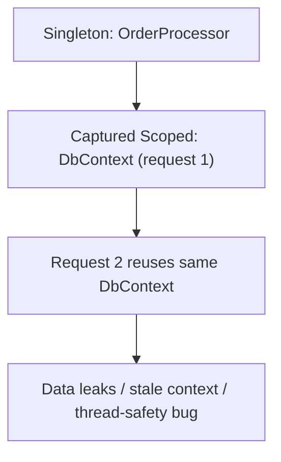

# 2. Dependency Injection & Lifetimes

> **TL;DR:** ASP.NET Core's built-in IoC container is fast and sufficient for most apps; lifetime mismatches (especially captive dependencies) are a top source of subtle production bugs.

**Interview weight:** P0 — lifetime bugs, `IHttpClientFactory`, and the options pattern appear in almost every senior .NET interview.

---

## Core Concepts

- **IoC (Inversion of Control)** — high-level modules depend on abstractions; the container wires concrete types at runtime.
- **DI (Dependency Injection)** — IoC implemented by injecting dependencies via constructor/method/property rather than newing them up.
- **Service descriptor** — the triple `(ServiceType, ImplementationType, Lifetime)` registered in `IServiceCollection`.
- **`IServiceProvider`** — the resolved container. `GetRequiredService<T>()` throws if not registered; `GetService<T>()` returns null.
- **Root provider** — the singleton `IServiceProvider` built at startup from `IServiceCollection`.
- **Scope** — a child `IServiceProvider` created per HTTP request (or manually via `IServiceScopeFactory`).

---

## Registration APIs

```csharp
builder.Services.AddSingleton<ICache, RedisCache>();          // one instance for app lifetime
builder.Services.AddScoped<IUnitOfWork, EfUnitOfWork>();      // one per request scope
builder.Services.AddTransient<IEmailSender, SmtpSender>();    // new instance every resolution
builder.Services.AddTransient(typeof(IRepository<>), typeof(EfRepository<>)); // open generic

// Factory overload — full control
builder.Services.AddSingleton<IConnectionMultiplexer>(sp =>
    ConnectionMultiplexer.Connect(sp.GetRequiredService<IConfiguration>()["Redis:Url"]!));

// TryAdd — only registers if not already registered (safe for defaults)
builder.Services.TryAddScoped<ICurrentUser, HttpCurrentUser>();

// Multiple implementations (resolved as IEnumerable<T>)
builder.Services.AddSingleton<IPlugin, PluginA>();
builder.Services.AddSingleton<IPlugin, PluginB>();
// Injected as IEnumerable<IPlugin>; last registered wins for single-service resolution
```

---

## Singleton vs Scoped vs Transient

| Aspect | Singleton | Scoped | Transient |
|--------|-----------|--------|-----------|
| Instances per app | 1 | 1 per request scope | New on every `GetService` call |
| Lifetime | App lifetime | Request lifetime | Until caller disposes / GC |
| Thread-safety required | **Yes** — shared across all threads | No (single request thread) | No (private per call) |
| Disposal | `IDisposable.Dispose()` at app shutdown | Disposed when scope ends | Disposed when scope ends (tracked by container) |
| Typical uses | `IConnectionMultiplexer`, `IMemoryCache`, `HttpClient` (via `IHttpClientFactory`), config | `DbContext`, `IUnitOfWork`, `ICurrentUser` | Stateless helpers, validators, mappers |
| Risk | Captive dependency; memory if mutable state grows | Accessing outside a scope (BackgroundService) | Overuse → GC pressure |

---

## Captive Dependency Problem

A **singleton that holds a scoped dependency** is a captive: the scoped instance lives as long as the singleton (app lifetime), defeating its per-request isolation.



### Detection & Prevention

- **`ValidateScopes = true`** (set automatically in Development): throws `InvalidOperationException` at startup if a singleton depends on a scoped service.
- **`ValidateOnBuild = true`**: verifies all registrations are resolvable at `Build()` time (catches missing registrations, not just lifetime mismatches).

```csharp
builder.Host.UseDefaultServiceProvider(opts =>
{
    opts.ValidateScopes = true;   // default in Development
    opts.ValidateOnBuild = true;  // recommended always
});
```

---

## Resolving Scoped Services in `BackgroundService`

A `BackgroundService` is singleton-lifetime. Injecting a scoped service directly is a captive dependency.

```csharp
public class QueueWorker(IServiceScopeFactory scopeFactory) : BackgroundService
{
    protected override async Task ExecuteAsync(CancellationToken ct)
    {
        await foreach (var msg in ReadMessagesAsync(ct))
        {
            await using var scope = scopeFactory.CreateAsyncScope();
            var handler = scope.ServiceProvider.GetRequiredService<IMessageHandler>();
            await handler.HandleAsync(msg, ct);
        } // scope disposed here → DbContext flushed/disposed
    }
}
```

---

## `IServiceProvider` Service-Locator Anti-Pattern

Injecting `IServiceProvider` and calling `GetService<T>()` inside business logic hides dependencies, makes testing harder, and bypasses lifetime validation. **Use only for:**
- Framework code (middleware, filters) where the type isn't known at compile time.
- Dynamic/plugin scenarios.
- Factory registrations that need late-binding.

---

## Keyed Services (.NET 8)

```csharp
builder.Services.AddKeyedSingleton<IStorage, BlobStorage>("blob");
builder.Services.AddKeyedSingleton<IStorage, SqlStorage>("sql");

// Injection
public class Uploader([FromKeyedServices("blob")] IStorage storage) { }
```

---

## Decorator Pattern with Scrutor

```csharp
// Scrutor NuGet: Scrutor
builder.Services.AddScoped<IOrderRepository, SqlOrderRepository>();
builder.Services.Decorate<IOrderRepository, CachedOrderRepository>();
// CachedOrderRepository wraps SqlOrderRepository transparently
```

---

## `IEnumerable<T>` Multi-Registration

```csharp
// All registered implementations resolved together
public class Dispatcher(IEnumerable<IEventHandler> handlers)
{
    public async Task DispatchAsync(IEvent e)
    {
        foreach (var h in handlers) await h.HandleAsync(e);
    }
}
```

---

## Options Pattern

| Interface | Reloads? | Singleton? | Best for |
|-----------|----------|------------|----------|
| `IOptions<T>` | No | Yes | Config that doesn't change at runtime |
| `IOptionsSnapshot<T>` | Yes (per request) | No (scoped) | Per-request reloadable config |
| `IOptionsMonitor<T>` | Yes (immediate via `OnChange`) | Yes | Background services, event-driven reload |

```csharp
// Registration with validation
builder.Services.AddOptions<RedisOptions>()
    .BindConfiguration("Redis")
    .ValidateDataAnnotations()
    .ValidateOnStart(); // fail-fast at startup if invalid

// Usage
public class CacheService(IOptionsMonitor<RedisOptions> opts)
{
    void Connect() => ConnectionMultiplexer.Connect(opts.CurrentValue.ConnectionString);
}
```

---

## `IHttpClientFactory` & Socket Exhaustion

**Problem without factory:**
- `new HttpClient()` per request → exhausts OS socket handles (TIME_WAIT state).
- Disposing `HttpClient` doesn't immediately release sockets.
- Long-lived `HttpClient` doesn't pick up DNS changes (stale DNS TTL issue).

**Solution:**

```csharp
// Named client
builder.Services.AddHttpClient("payments", c => c.BaseAddress = new Uri("https://pay.api/"))
    .AddResilienceHandler("default", pipeline =>
    {
        pipeline.AddRetry(new HttpRetryStrategyOptions { MaxRetryAttempts = 3 });
        pipeline.AddCircuitBreaker(new HttpCircuitBreakerStrategyOptions());
    }); // Polly / Microsoft.Extensions.Http.Resilience (.NET 8)

// Typed client (preferred)
builder.Services.AddHttpClient<PaymentClient>();
```

- `IHttpClientFactory` pools and rotates `HttpMessageHandler` instances (default 2-min lifetime) — solves socket exhaustion and DNS staleness.
- **Do not** inject `HttpClient` as singleton directly from factory; inject `IHttpClientFactory` or use typed clients.

---

## Third-Party Containers

- **Autofac** — advanced: named/keyed, property injection, decorator scanning, Modules.
- **Lamar** — fast compilation; built-in ASP.NET Core integration.
- Wire via `ConfigureContainer<T>` on `HostBuilder`.
- Built-in container is sufficient for most services; use Autofac when you need advanced lifetime scenarios or Scrutor can't cover decorator complexity.

---

## Testing with DI

```csharp
// xUnit + WebApplicationFactory
var factory = new WebApplicationFactory<Program>().WithWebHostBuilder(b =>
    b.ConfigureServices(s =>
    {
        s.RemoveAll<IEmailSender>();
        s.AddSingleton<IEmailSender, FakeEmailSender>();
    }));
var client = factory.CreateClient();
```

---

## Trade-offs & When to Use

- **Prefer `AddScoped`** for anything that touches EF Core or request context.
- **`AddSingleton`** only for truly stateless, thread-safe services (cache clients, HTTP clients, config).
- **`AddTransient`** for lightweight, stateless helpers (validators, mappers) — watch GC pressure at high RPS.
- Enable `ValidateOnBuild` + `ValidateScopes` in all environments to catch bugs early.

---

## Common Pitfalls

- Singleton capturing `DbContext` (scoped) → shared state, thread-safety bugs, stale data.
- `AddTransient(IDisposable)` in singleton scope — container tracks but doesn't dispose until app shutdown.
- Registering concrete class directly instead of interface — breaks mocking in tests.
- Using `HttpClient` directly (not via factory) → socket exhaustion at scale.
- `IOptions<T>` won't reflect config file changes at runtime — use `IOptionsMonitor<T>` in background services.

---

## Interview Questions

**Q1. What are the three DI lifetimes and when do you use each?**
A: Singleton (one for app lifetime — stateless, thread-safe), Scoped (one per request — DbContext, UoW), Transient (new per resolve — lightweight, stateless helpers).

**Q2. What is a captive dependency and how do you detect it?**
A: A singleton holding a reference to a shorter-lived (scoped/transient) dependency, extending its lifetime unexpectedly. Detected by `ValidateScopes = true` which throws at startup in Development.

**Q3. How do you use a scoped service inside a `BackgroundService`?**
A: Inject `IServiceScopeFactory`, create a scope per work-item with `CreateAsyncScope()`, resolve the scoped service from `scope.ServiceProvider`, then `await using` ensures proper disposal.

**Q4. What is the difference between `IOptions`, `IOptionsSnapshot`, and `IOptionsMonitor`?**
A: `IOptions` is singleton, never reloads. `IOptionsSnapshot` is scoped, reloads per request. `IOptionsMonitor` is singleton but reloads immediately on file change — use in background services.

**Q5. Why is `IHttpClientFactory` preferred over `new HttpClient()`?**
A: Pools `HttpMessageHandler`, rotates every 2 min to pick up DNS changes, prevents socket exhaustion under high load. Raw `HttpClient` with `using` disposes the client but not the underlying socket immediately (TIME_WAIT).

**Q6. What does `ValidateOnBuild` do and when should you enable it?**
A: Checks that all registered services can be constructed (no missing registrations) at `Build()` time rather than first use. Enable in all environments to catch config errors before the first request.

**Q7. How does the decorator pattern work with the built-in container vs Scrutor?**
A: Built-in container has no native decorator support. With Scrutor: `services.Decorate<IFoo, CachedFoo>()` wraps existing registrations. Manually you can re-register with a factory that resolves the inner type and passes it to the decorator.

**Q8. Your service at 5K RPS is seeing socket exhaustion errors. Walk me through root-causing and fixing it.**
A: Check `dotnet-counters` for socket handle count, or netstat TIME_WAIT entries. Root cause: short-lived `HttpClient` instances created per request. Fix: register all HTTP clients via `IHttpClientFactory` with typed or named clients. Also check connection pool limits (`ServicePointManager.DefaultConnectionLimit` for legacy code).

**Q9. Explain keyed services in .NET 8 and give a use case.**
A: Keyed services allow multiple implementations of the same interface registered under different string/enum keys, resolved via `[FromKeyedServices("key")]`. Use case: multiple storage backends (blob vs SQL), multiple notification providers (email vs SMS), A/B feature variants.

**Q10. How do you mock DI-registered services in integration tests without rebuilding the pipeline?**
A: Use `WebApplicationFactory<Program>.WithWebHostBuilder(b => b.ConfigureServices(...))` to replace specific registrations. `services.RemoveAll<T>()` then `AddSingleton(fake)` overrides. The container rebuilds for each test factory instance.

**Q11. At what point is `IDisposable` called for transient services?**
A: The container tracks disposable transient services and calls `Dispose` when the containing scope is disposed (end of request for scoped, app shutdown for root/singleton scope). This means transients can live longer than expected in a singleton-owned scope — consider manual lifetime management for expensive resources.

**Q12. How would you implement a multi-tenant options system where each tenant has different config?**
A: Use `IOptionsSnapshot<T>` with a custom `IConfigureNamedOptions<T>` that loads tenant-specific config keyed by tenant ID. Or use a custom `IOptionsFactory<T>` that resolves tenant context from `IHttpContextAccessor` and returns tenant-specific instances. Avoid singleton options for tenant-variable values.

---

## Quick Recap

- Lifetimes: Singleton (app) → Scoped (request) → Transient (per-resolve).
- Captive dependency = singleton captures scoped → detected by `ValidateScopes`.
- `IServiceScopeFactory` in `BackgroundService` for scoped services.
- `IHttpClientFactory` = pooled handlers, DNS refresh, no socket exhaustion.
- `IOptionsMonitor` for reloadable config in background services.
- `ValidateOnBuild = true` to catch missing registrations at startup.
- Keyed services (.NET 8) for multiple implementations of same interface.
