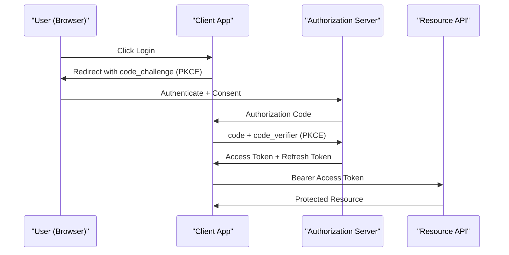

# 3. Authentication — JWT, OAuth 2.0 & OIDC

> **TL;DR:** Authentication proves identity; JWT is the token format; OAuth 2.0 is the delegation protocol; OIDC adds identity layer on top. Get JWT validation wrong and your API is open to the internet.

**Interview weight:** P0 — directly on resume (Managed Identity, RBAC/JIT, service-to-service auth at Xbox scale). Expect deep validation-pitfall questions.

See also: [Security — OAuth2, OIDC & JWT](../09-Security/01-OAuth2-OIDC-JWT-and-Session-Security.md)

---

## Authentication vs Authorization

- **Authentication** — who are you? Establishes identity (populates `ClaimsPrincipal`).
- **Authorization** — what can you do? Checked after identity is known.

---

## Cookie vs Token Auth

| Aspect | Cookie Auth | Token Auth (JWT) |
|--------|------------|------------------|
| Storage | Server-side session or encrypted cookie | Client-side (browser localStorage/memory, mobile keychain) |
| Statefulness | Stateful (session store) or stateless (cookie payload) | Stateless (self-contained) |
| CSRF risk | Yes — automatic cookie inclusion | No (explicit `Authorization` header) |
| CORS | Tricky — cookies require `SameSite`/`AllowCredentials` | Simple — just pass header |
| Revocation | Easy (delete session) | Hard — requires token blacklist or short expiry |
| Best for | Browser-first SPAs with same-origin, server-rendered apps | APIs, microservices, mobile clients, cross-origin |

---

## JWT Structure

A JWT is three Base64URL-encoded parts separated by `.`:

```
eyJhbGciOiJSUzI1NiIsInR5cCI6IkpXVCJ9   <- Header
.eyJzdWIiOiJ1c2VyLTEyMyIsInJvbGVzIjpbIlBsYXllciJdLCJhdWQiOiJteS1hcGkiLCJpc3MiOiJodHRwczovL2xvZ2luLm15YXBwLmNvbSIsImV4cCI6MTcwMDAwMDAwMCwiaWF0IjoxNjk5OTk2NDAwfQ==
.SIG_BYTES
```

**Header:** `{ "alg": "RS256", "typ": "JWT" }`
**Payload (claims):**
```json
{
  "sub": "user-123",
  "roles": ["Player"],
  "aud": "my-api",
  "iss": "https://login.myapp.com",
  "exp": 1700000000,
  "iat": 1699996400
}
```
**Signature:** `RS256(Base64URL(header) + "." + Base64URL(payload), privateKey)`

### Signing: HS256 vs RS256

| | HS256 | RS256 |
|---|-------|-------|
| Algorithm | HMAC-SHA256 (symmetric) | RSA-SHA256 (asymmetric) |
| Key | Shared secret — both issuer and verifier must know it | Private key signs; public key verifies |
| Key distribution | Secret must be securely shared | Public key published via JWKS endpoint |
| Multi-party verification | Risky — any holder can forge tokens | Safe — only issuer has private key |
| Use case | Single-service, internal tokens | Multi-service, third-party IdP (Entra ID, Auth0) |

---

## JWT Validation Parameters

```csharp
builder.Services.AddAuthentication(JwtBearerDefaults.AuthenticationScheme)
    .AddJwtBearer(opts =>
    {
        opts.Authority = "https://login.microsoftonline.com/{tenantId}/v2.0";
        opts.Audience  = "api://my-api-client-id";    // MUST validate
        opts.TokenValidationParameters = new TokenValidationParameters
        {
            ValidateIssuer           = true,
            ValidateAudience         = true,
            ValidateLifetime         = true,
            ValidateIssuerSigningKey = true,
            ClockSkew                = TimeSpan.FromSeconds(30), // default 5 min — reduce!
        };
        opts.MapInboundClaims = false; // don't rename claims (keeps "sub", "roles" as-is)
    });
```

### Common validation pitfalls

| Pitfall | Risk |
|---------|------|
| `alg: none` attack — accepting unsigned tokens | Full auth bypass if server accepts `alg: none` |
| Not validating `aud` | Token issued for service A accepted by service B |
| Long expiry (hours/days) | Stolen token valid for extended window |
| Large `ClockSkew` | Replay window extended |
| No revocation check | Compromised tokens remain valid until expiry |
| Trusting claims without signature verification | Token forgery |

---

## Refresh Tokens + Rotation + Reuse Detection

- **Access token** — short-lived (5–15 min), stateless JWT.
- **Refresh token** — long-lived, opaque, stored server-side; used to get new access tokens.
- **Rotation** — issue a new refresh token on every use; invalidate the old one.
- **Reuse detection** — if an already-used refresh token is presented, it was likely stolen → revoke entire token family (all descended tokens for that session).

**Token storage (clients):**
- Browser: memory (best) > `httpOnly` cookie (good — immune to XSS) > localStorage (bad — XSS risk).
- Mobile: OS secure keychain (iOS Keychain, Android Keystore).

---

## OAuth 2.0

### Roles

| Role | Description |
|------|-------------|
| Resource Owner | End user who owns the data |
| Client | App requesting access |
| Authorization Server | Issues tokens (Entra ID, Auth0, custom) |
| Resource Server | API that accepts access tokens |

### Grant Types



| Grant Type | Use case | Still recommended? |
|------------|----------|--------------------|
| Authorization Code + PKCE | Interactive user login (web, SPA, mobile) | **Yes** — gold standard |
| Client Credentials | Machine-to-machine (no user) | **Yes** |
| Device Code | Input-constrained devices (TV, CLI) | Yes |
| Implicit | SPA (token in URL fragment) | **No** — deprecated; token in URL is leaky |
| Resource Owner Password (ROPC) | Legacy username/password direct | **No** — deprecated; client sees credentials |

---

## OIDC on Top of OAuth 2.0

- **OAuth 2.0** = authorization (access delegation). Doesn't define who the user is.
- **OIDC** = authentication layer on OAuth 2.0; adds `id_token` (JWT with user identity) + `/userinfo` endpoint + discovery document (`/.well-known/openid-configuration`).

| | `id_token` | `access_token` |
|--|-----------|----------------|
| Purpose | Proves identity to client | Grants access to resource server |
| Format | Always JWT | JWT or opaque |
| Audience | Client (the `aud` claim = client_id) | Resource API |
| Validated by | Client app | Resource API |
| Contains | `sub`, `name`, `email`, auth claims | Scopes, roles, expiry |

### JWKS / Key Rotation

- IdP publishes public keys at `/.well-known/jwks` (JSON Web Key Set).
- `AddJwtBearer` with `Authority` auto-discovers and caches JWKS, refreshes on cache miss with unknown `kid`.
- **Key rotation:** IdP rotates keys periodically; JWT `kid` header identifies the key used. If unknown `kid`, middleware re-fetches JWKS. Force manual refresh: update `opts.BackchannelHttpHandler`.

---

## Multiple Authentication Schemes

```csharp
builder.Services.AddAuthentication()
    .AddJwtBearer("Entra", opts => { opts.Authority = "https://login.microsoftonline.com/..."; })
    .AddJwtBearer("Internal", opts => { opts.Authority = "https://internal-sts/"; });

// Endpoint-specific scheme
app.MapGet("/external", () => "ok").RequireAuthorization(
    new AuthorizeAttribute { AuthenticationSchemes = "Entra" });
```

---

## Microsoft Entra ID & Managed Identity

- **Entra ID (AAD)** — cloud IdP; supports both user and service identities.
- **Managed Identity** — Azure-assigned identity for compute resources; no secrets to manage. Gets tokens via `ManagedIdentityCredential` (Azure SDK).
- **Service-to-service auth pattern:**

```csharp
// Downstream API obtains token via Managed Identity
var credential = new DefaultAzureCredential(); // tries MI, then dev env
var token = await credential.GetTokenAsync(
    new TokenRequestContext(["https://cosmos.azure.com/.default"]));
```

> At Xbox scale: all service-to-service calls used Managed Identity. Zero shared secrets in config. Certificate-based or token-based validation at the API layer.

---

## mTLS (Mutual TLS)

- Client and server exchange certificates during TLS handshake — bidirectional identity.
- Used in zero-trust networks, service mesh (Istio/Linkerd), API gateways.
- ASP.NET Core: `app.UseAuthentication()` with `AddCertificate()` scheme; extract thumbprint/SAN from `context.Connection.ClientCertificate`.

---

## Trade-offs & When to Use

- **JWT for APIs** — stateless, scales horizontally, no session store needed.
- **Cookie auth for server-rendered** — simpler, automatic, but needs CSRF protection.
- **Opaque tokens** — easier revocation but require introspection call on every request (latency).
- **Short access token + refresh** — best balance; rotate refresh tokens to detect theft.
- **Managed Identity** over shared secrets — eliminates a whole class of credential leaks.

---

## Common Pitfalls

- Not calling `app.UseAuthentication()` before `app.UseAuthorization()` — 401 on everything.
- `MapInboundClaims = true` (default before .NET 6) renames `sub` to `http://schemas.xmlsoap.org/ws/2005/05/identity/claims/nameidentifier` — breaks claim lookups.
- Storing access tokens in localStorage — XSS can exfiltrate them.
- Using HS256 with a weak/short secret — brute-force offline attack possible.
- Not setting `ValidateAudience = true` — token issued to another app accepted here.

---

## Interview Questions

**Q1. What are the three parts of a JWT and what does each contain?**
A: Header (alg, typ), Payload (claims: sub, iss, aud, exp, iat, custom), Signature (crypto over header+payload). Only the signature provides integrity; the payload is base64-encoded, not encrypted.

**Q2. What is the `alg: none` attack?**
A: An attacker strips the signature and sets `"alg": "none"`. If the server accepts unsigned tokens, full auth bypass. Prevention: whitelist allowed algorithms in `TokenValidationParameters`; never allow `none`.

**Q3. Why should you validate `aud` in JWT validation?**
A: Without audience validation a token issued to service A (e.g., your mobile app) can be replayed against service B (your API). Each resource server must enforce its own `aud` value.

**Q4. What is the difference between OAuth 2.0 and OIDC?**
A: OAuth 2.0 = authorization (access delegation). It says "this client can access your data" but says nothing about who the user is. OIDC = adds authentication layer on OAuth 2.0; issues `id_token` (JWT with user identity claims) and defines `/userinfo`, discovery, and session endpoints.

**Q5. Why is the Implicit grant deprecated?**
A: The access token is returned in the URL fragment, which can appear in browser history, referrer headers, and server logs. PKCE solves the same problem (public client auth code) without token exposure in URLs.

**Q6. Explain PKCE and why it matters for SPAs.**
A: PKCE (Proof Key for Code Exchange): client generates a `code_verifier` (random), hashes it to `code_challenge`, sends challenge with auth request. When exchanging code for token, sends `code_verifier`. Auth server verifies hash matches. Prevents authorization code interception attacks in public clients where client_secret can't be kept secret.

**Q7. What is refresh token rotation and reuse detection?**
A: Rotation: issue new refresh token on each use, invalidate old. Reuse detection: if old (already rotated) token is presented again, someone has a copy → revoke entire token family for that session as a security response.

**Q8. How does `IHttpClientFactory` pick up JWKS key rotation?**
A: `AddJwtBearer` with `Authority` fetches the discovery document and JWKS. Keys are cached. On unknown `kid` in an incoming JWT, middleware automatically re-fetches JWKS. The backchannel `HttpClient` (created by `IHttpClientFactory`) is short-lived by default to pick up DNS/endpoint changes.

**Q9. At Xbox, how would you implement service-to-service auth for 600+ microservices without managing secrets?**
A: Managed Identity on every Azure compute resource (App Service, AKS pod via workload identity). Each service acquires tokens for its downstream dependency via `DefaultAzureCredential` — no connection strings, no certs in config. APIs validate `aud` matching their own resource URI. This is what we actually built.

**Q10. What is `ClockSkew` and what is the production-safe value?**
A: Clock skew is tolerance added/subtracted to `exp` and `nbf` to account for clock drift between servers. Default in .NET is 5 minutes — dangerously large for short-lived tokens (could accept a 5-min-expired token for 5 more minutes). Set to 30–60 seconds in production; ensure NTP sync across services.

**Q11. How would you implement token revocation without a distributed blacklist?**
A: Options: (1) Short access token lifetime (5 min) + refresh token store with revocation. (2) OAuth introspection endpoint (opaque tokens — every request validates with auth server; adds latency). (3) Versioned claim in token (`tokenVersion`); bump user's version in DB; middleware checks claim vs DB. Trade-off: (3) adds DB call per request — cache the version with short TTL.

**Q12. Explain mTLS and when you'd choose it over JWT for inter-service auth.**
A: mTLS authenticates both sides at the transport layer using X.509 certs — no application-level token needed. Choose mTLS for zero-trust networks, service mesh (Istio), or where you need mutual auth without an auth server in the path. JWT is better for user delegation, flexible claims, and cross-org federation. At high RPS, mTLS offloaded to a sidecar proxy adds ~0.1ms vs JWT validation in app code adding ~0.05ms.

---

## Quick Recap

- JWT = header.payload.signature; payload is readable, not encrypted; signature provides integrity.
- RS256 > HS256 for multi-service — public key published via JWKS, private key stays with IdP.
- Always validate: issuer, audience, lifetime, signature, algorithm.
- OAuth 2.0 = delegation; OIDC = identity layer on top; `id_token` for client identity, `access_token` for API.
- Auth code + PKCE = gold standard; Implicit and ROPC = deprecated.
- Refresh token rotation + reuse detection = theft detection.
- Managed Identity = zero-secret service auth on Azure.
- `ClockSkew` default 5 min is too large — set to 30 s.
