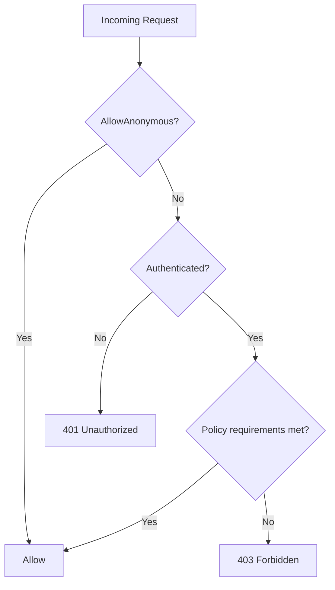

# 4. Authorization — Policies, Roles & Claims

> **TL;DR:** Role-based is fast but coarse; claims-based is flexible; policy-based is composable and testable; resource-based is the only correct choice when decisions depend on the resource's data.

**Interview weight:** P0 — RBAC/JIT/least-privilege is explicitly on the Xbox resume. Interviewers at Staff/TL level probe the full spectrum from `[Authorize]` to multi-tenant authz.

---

## Core Concepts

- **`ClaimsPrincipal`** — the authenticated identity; contains one or more `ClaimsIdentity`, each holding `Claim` key-value pairs.
- **`IAuthorizationService`** — evaluates requirements against a principal and optional resource. Central engine for policy evaluation.
- **`IAuthorizationRequirement`** — marker interface; a rule that must be satisfied.
- **`AuthorizationHandler<TRequirement>`** — evaluates one requirement against a principal (and optionally a resource).
- **Policy** — named collection of requirements; all must succeed.

---

## Authorization Styles Compared

| Style | Mechanism | Granularity | Testability | Use case |
|-------|-----------|-------------|-------------|----------|
| Role-based | `[Authorize(Roles="Admin")]`, `User.IsInRole("Admin")` | Coarse | Easy | Simple admin/user split |
| Claims-based | `[Authorize(Policy="HasVerifiedEmail")]`, `User.HasClaim(...)` | Medium | Easy | Feature flags, subscription tier |
| Policy-based | Named policy with `IAuthorizationRequirement` | Fine | Very easy — inject handler | Complex business rules, composable |
| Resource-based | `IAuthorizationService.AuthorizeAsync(user, resource, policy)` | Per-object | Easy with mock | "Can user edit *this* order?" |
| ABAC | Attribute-based on subject + resource + environment | Finest | Harder | Enterprise, multi-tenant, row-level security |

---

## `[Authorize]` / `[AllowAnonymous]`

```csharp
[Authorize]                                // any authenticated user
[Authorize(Roles = "Admin,Moderator")]     // role-based
[Authorize(Policy = "MinimumAge")]         // policy-based
[AllowAnonymous]                           // override on action within authorized controller
```

- Applied globally via `builder.Services.AddAuthorization(opts => opts.FallbackPolicy = new AuthorizationPolicyBuilder().RequireAuthenticatedUser().Build())`.
- `DefaultPolicy` applies to `[Authorize]` with no args (default: `RequireAuthenticatedUser`).

---

## Policy Definition & Requirements

```csharp
builder.Services.AddAuthorization(opts =>
{
    opts.AddPolicy("CanPublishContent", policy =>
        policy.RequireAuthenticatedUser()
              .RequireClaim("subscription", "premium", "enterprise")
              .AddRequirements(new MinimumPlayerLevelRequirement(10)));
});

// Requirement
public record MinimumPlayerLevelRequirement(int Level) : IAuthorizationRequirement;

// Handler
public class MinimumPlayerLevelHandler(IPlayerService players)
    : AuthorizationHandler<MinimumPlayerLevelRequirement>
{
    protected override async Task HandleRequirementAsync(
        AuthorizationHandlerContext ctx,
        MinimumPlayerLevelRequirement req)
    {
        var userId = ctx.User.FindFirstValue("sub");
        var level  = await players.GetLevelAsync(userId!);
        if (level >= req.Level)
            ctx.Succeed(req);
        // ctx.Fail() — optional; prevents other handlers succeeding same requirement
    }
}

builder.Services.AddScoped<IAuthorizationHandler, MinimumPlayerLevelHandler>();
```

---

## Resource-Based Authorization

```csharp
// In controller / endpoint
public class OrderController(IAuthorizationService authz) : ControllerBase
{
    [HttpPut("{id}")]
    public async Task<IActionResult> Update(int id, [FromBody] OrderDto dto)
    {
        var order = await _repo.GetAsync(id);
        var result = await authz.AuthorizeAsync(User, order, "CanEditOrder");
        if (!result.Succeeded) return Forbid();
        // proceed
    }
}

// Resource handler
public class OrderEditHandler : AuthorizationHandler<EditRequirement, Order>
{
    protected override Task HandleRequirementAsync(
        AuthorizationHandlerContext ctx,
        EditRequirement req,
        Order order)
    {
        if (order.OwnerId == ctx.User.FindFirstValue("sub"))
            ctx.Succeed(req);
        return Task.CompletedTask;
    }
}
```

---

## Authorization Decision Flowchart



---

## Combining Requirements

- All requirements in a policy must succeed (AND logic).
- For OR logic: add multiple handlers for the same requirement type — requirement succeeds if **any** handler calls `ctx.Succeed`.
- For NOT logic: call `ctx.Fail()` in a handler — prevents success even if other handlers succeed (use sparingly).

---

## Fallback & Default Policies

```csharp
opts.DefaultPolicy     = new AuthorizationPolicyBuilder()
    .RequireAuthenticatedUser().Build();   // applies to [Authorize] with no args
opts.FallbackPolicy    = new AuthorizationPolicyBuilder()
    .RequireAuthenticatedUser().Build();   // applies to endpoints with no auth attribute
// Fallback effectively makes all endpoints require auth unless [AllowAnonymous]
```

---

## RBAC vs ABAC

| Aspect | RBAC | ABAC |
|--------|------|------|
| Decision basis | User role (static group membership) | Subject + resource + environment attributes |
| Flexibility | Low — coarse-grained | High — fine-grained, contextual |
| Performance | Fast — role is a claim, no DB call | Can be expensive — may need resource fetch |
| Admin burden | Low — assign roles | High — author and maintain attribute rules |
| Best for | Fixed permission sets, small role count | Multi-tenant, row-level, time-based, IP-based access |

---

## Scopes vs Roles in Tokens

- **Scopes** — OAuth2 concept; represent *what the client app is allowed to do* (e.g., `orders.read`). Client consents to scopes. Checked by resource server to control API surface.
- **Roles** — represent *what the user is allowed to do*. Checked by app business logic.
- Both appear as claims in the JWT; validate scope for API-level gates, roles for business-logic gates.

---

## Multi-Tenant Authorization

- **Tenant ID in claims** — `tid` claim (Entra ID) or custom claim.
- **Row-level isolation** — every query appends `WHERE tenant_id = @tid`; extracted from `ICurrentUser` (scoped, populated from claim).
- **Cross-tenant admin** — separate elevated token with explicit cross-tenant role claim; JIT elevation.
- **Policy approach:** `RequireClaim("tid")` ensures only tokens with a tenant context are accepted; handler validates tenant matches resource.

---

## JIT Elevation & Least-Privilege

- **JIT (Just-In-Time) access** — elevated role granted on-demand for a limited window (e.g., PIM in Entra ID) rather than standing privilege.
- **Least-privilege pattern:** normal ops via scoped token; admin ops require a new token with elevated claims, time-limited.
- At Xbox scale: all production-data writes required JIT elevation through Entra PIM; normal service tokens were read-only.

---

## Authorization in Minimal APIs

```csharp
app.MapGet("/admin", () => "secret")
   .RequireAuthorization("AdminPolicy");

app.MapPost("/orders", CreateOrder)
   .RequireAuthorization(); // requires any authenticated user
```

---

## Testing Authorization

```csharp
// xUnit — test policy in isolation
var policy = new AuthorizationPolicyBuilder().AddRequirements(new MinimumPlayerLevelRequirement(10)).Build();
var user = new ClaimsPrincipal(new ClaimsIdentity([new Claim("sub", "user-1")]));
var mockPlayers = Mock.Of<IPlayerService>(s => s.GetLevelAsync("user-1") == Task.FromResult(15));
var handler = new MinimumPlayerLevelHandler(mockPlayers);
var ctx = new AuthorizationHandlerContext([policy.Requirements.First()], user, null);
await handler.HandleAsync(ctx);
Assert.True(ctx.HasSucceeded);
```

---

## Common Pitfalls

- Checking roles instead of policies — tight coupling to role names, hard to extend.
- Missing `AddScoped<IAuthorizationHandler, MyHandler>()` — requirement silently never evaluated.
- Resource-based auth in filter/attribute — you don't have the resource there; use `IAuthorizationService` in action body.
- `ctx.Fail()` in one handler blocks all other handlers for that requirement — only use to hard-fail regardless of other conditions.
- Not setting `FallbackPolicy` — endpoints without `[Authorize]` are open to anonymous traffic.

---

## Interview Questions

**Q1. What is the difference between role-based and policy-based authorization?**
A: Role-based uses static string role membership (`[Authorize(Roles="Admin")]`). Policy-based composes named requirements evaluated at runtime — more flexible, testable, and expressive. Policy can include roles as one of many requirements.

**Q2. When should you use resource-based authorization instead of a policy?**
A: When the authorization decision depends on data in the resource itself (e.g., "is the current user the owner of this order?"). Policies are evaluated before the resource is loaded; resource-based auth is called in the action body after loading the resource.

**Q3. How do you implement OR logic in an authorization policy?**
A: Register multiple `IAuthorizationHandler<TRequirement>` implementations. A requirement succeeds if ANY handler calls `ctx.Succeed`. The default behavior is to succeed if at least one handler succeeds and none calls `ctx.Fail`.

**Q4. What is the difference between `DefaultPolicy` and `FallbackPolicy`?**
A: `DefaultPolicy` applies when `[Authorize]` is used with no arguments. `FallbackPolicy` applies to endpoints with NO authorization attribute at all — it's the "lock everything by default" mechanism.

**Q5. How would you implement row-level security for a multi-tenant API?**
A: Extract `tid` from JWT claims in a scoped `ICurrentUser` service. Middleware or a `IQueryable` global filter in EF Core automatically appends `WHERE tenant_id = @tenantId` to all queries. Authorization policy ensures `tid` claim is present and non-empty.

**Q6. What is the difference between scopes and roles in OAuth2/JWT?**
A: Scopes express what the *client app* can do (delegated permission, consented by user). Roles express what the *user* can do (direct permission). Resource API checks scopes to validate the request type; business logic checks roles for fine-grained access control.

**Q7. Explain JIT elevation and why standing privilege is dangerous at scale.**
A: Standing privilege means a service account always has elevated permissions — a compromised token grants immediate high-privilege access indefinitely. JIT elevation (Entra PIM) grants privilege on-demand for a time-limited window with an approval workflow. Blast radius of a credential leak is bounded by the JIT window.

**Q8. How do you test an `AuthorizationHandler` in isolation?**
A: Construct `AuthorizationHandlerContext` with the requirement, a `ClaimsPrincipal`, and optional resource. Call `handler.HandleAsync(ctx)`. Assert `ctx.HasSucceeded`. No ASP.NET Core infrastructure needed — pure unit test.

**Q9. At Xbox with 7M+ users, how did you handle authorization without a per-request DB call?**
A: Claims-embedded authorization — roles and subscription-tier claims were baked into the JWT at login time. Resource-level checks (e.g., content ownership) used a short-TTL cache keyed on user+resource. Cache miss triggered a DB call. This eliminated 95%+ of per-request auth DB queries.

**Q10. How would you handle authorization for a multi-tenant SaaS where tenant admins configure roles?**
A: Separate the role definition (tenant-specific, stored in DB) from enforcement. At token issuance, embed tenant-specific roles as claims. Resource handler validates role claim against tenant context. For highly dynamic permissions, use a policy evaluation service (OPA, or custom) queried per request with TTL caching.

**Q11. What happens if you forget to register `IAuthorizationHandler` in DI?**
A: The requirement is never evaluated — `AuthorizationHandlerContext` will have no successes, causing the policy to fail with a 403. No exception is thrown; this is a silent failure. Always register handlers with `AddScoped<IAuthorizationHandler, MyHandler>()`.

**Q12. Compare RBAC and ABAC for a game platform with complex entitlement rules.**
A: RBAC: `Player`, `Moderator`, `Admin` roles — fast, simple for coarse gates. ABAC: rules like "can edit if owned AND subscription=premium AND not suspended AND within territory" — combines resource and environment attributes. For a game platform at scale, hybrid: RBAC for static permission gates (admin portal), ABAC-style claims for dynamic entitlement (content ownership, region, age rating). Pure ABAC at 5K RPS requires aggressive caching of attribute lookups.

---

## Quick Recap

- Role → `[Authorize(Roles="X")]`; claims → `RequireClaim`; policy → named `IAuthorizationRequirement`.
- Resource-based authz via `IAuthorizationService.AuthorizeAsync(user, resource, policy)` — call in action body.
- Multiple handlers for same requirement = OR logic; `ctx.Fail()` = hard block.
- `FallbackPolicy` = deny-by-default for all endpoints.
- Scopes = client permissions; roles = user permissions.
- JIT elevation + least-privilege = bounded blast radius.
- Register `IAuthorizationHandler` in DI or requirements silently never succeed.
