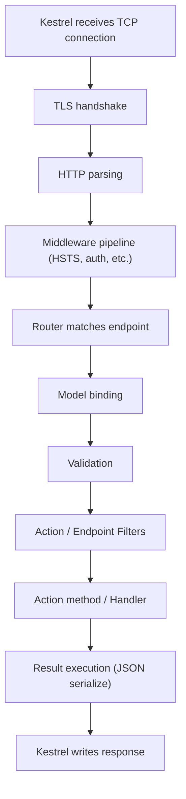

# 5. API Design — Routing, Binding, Validation & Versioning

> **TL;DR:** Good API design is idiomatic, predictable, and evolvable. At 5K RPS, validation failures, unhandled exceptions, and unbounded payloads are reliability risks — not just bad UX.

**Interview weight:** P0 — REST conventions, Problem Details, rate limiting, and versioning are core to any senior API design interview.

---

## REST Maturity & Conventions

- **Level 0** — single HTTP endpoint, all data in body.
- **Level 1** — resources (separate URLs).
- **Level 2** — HTTP verbs + correct status codes.
- **Level 3** — HATEOAS (links in responses). Rarely implemented fully; know the concept.

**Resource naming:** plural nouns, hierarchical, lowercase, hyphens over underscores.
`GET /api/orders/{orderId}/items/{itemId}` — not `/getOrderItem`.

### HTTP Verbs, Status Codes, Idempotency

| Verb | Operation | Idempotent | Safe | Common codes |
|------|-----------|-----------|------|--------------|
| GET | Read | Yes | Yes | 200, 404 |
| HEAD | Metadata only | Yes | Yes | 200, 404 |
| POST | Create / action | No | No | 201 + Location, 200, 202, 409, 422 |
| PUT | Full replace | Yes | No | 200, 201, 204, 404 |
| PATCH | Partial update | No (by spec) | No | 200, 204, 409, 422 |
| DELETE | Delete | Yes | No | 204, 404, 409 |

- **Idempotency key for POST** — client generates UUID, sends in `Idempotency-Key` header. Server stores result for the key; replays cached response on retry. Prevents duplicate charges/orders on retries.

---

## Pagination

| Strategy | How | Pros | Cons |
|---------|-----|------|------|
| Offset / page | `?page=3&pageSize=20` | Simple, SQL `OFFSET` | Skips/dupes on concurrent writes; slow for large offsets (scan cost) |
| Keyset / cursor | `?after=cursor_opaque_token` | O(1) regardless of page depth; stable on writes | Can't jump to arbitrary page; cursor must be sort-key-based |

> Prefer keyset for high-volume feeds (news feed, activity logs); offset for admin UIs where total count and random-page navigation matter.

---

## Minimal APIs vs Controllers

| Aspect | Minimal APIs | Controllers |
|--------|-------------|-------------|
| Boilerplate | Minimal — `app.MapGet(...)` | More — inherit `ControllerBase`, actions |
| Performance | Slightly faster (less reflection) | Slightly more overhead |
| Model binding | `AsParameters`, `[FromBody]`, etc. | Same + complex binders |
| Filters | `IEndpointFilter` (simpler); no MVC filter pipeline | Full filter pipeline |
| Validation | Manual or endpoint filter; no automatic `ModelState` | Auto `ModelState` validation |
| Grouping | `RouteGroupBuilder` | `[ApiController]`, `[Route]` on class |
| Best for | Greenfield microservices, simple CRUD, high performance | Large apps with shared filters, conventions, complex binding |

```csharp
// Minimal API
var orders = app.MapGroup("/api/orders").RequireAuthorization();
orders.MapGet("/{id:int}", async (int id, IOrderService svc) =>
    await svc.GetAsync(id) is { } o ? Results.Ok(o) : Results.NotFound());

orders.MapPost("/", async ([FromBody] CreateOrderDto dto, IOrderService svc,
    IValidator<CreateOrderDto> validator) =>
{
    var validation = await validator.ValidateAsync(dto);
    if (!validation.IsValid)
        return Results.ValidationProblem(validation.ToDictionary());
    var created = await svc.CreateAsync(dto);
    return Results.CreatedAtRoute("GetOrder", new { id = created.Id }, created);
});
```

---

## Model Binding Sources

| Attribute | Source | Notes |
|-----------|--------|-------|
| `[FromBody]` | Request body (JSON/XML) | One per action; uses `System.Text.Json` by default |
| `[FromQuery]` | Query string | Auto for simple types in minimal APIs |
| `[FromRoute]` | URL route segment | Auto-bound by name match |
| `[FromHeader]` | HTTP header | Case-insensitive |
| `[FromServices]` | DI container | Inject without putting in route signature |
| `[FromForm]` | Form data / multipart | File uploads with `IFormFile` |
| `AsParameters` (minimal API) | Struct/record unpacked from route+query+header | Avoids long parameter lists |

---

## Validation

```csharp
// DataAnnotations (simple)
public record CreateOrderDto(
    [Required][MaxLength(100)] string ProductName,
    [Range(1, 1000)] int Quantity);

// FluentValidation (preferred for complex rules)
public class CreateOrderDtoValidator : AbstractValidator<CreateOrderDto>
{
    public CreateOrderDtoValidator(IProductRepository repo)
    {
        RuleFor(x => x.ProductName).NotEmpty().MaximumLength(100);
        RuleFor(x => x.Quantity).InclusiveBetween(1, 1000);
        RuleFor(x => x.ProductId).MustAsync(async (id, ct) => await repo.ExistsAsync(id))
            .WithMessage("Product not found");
    }
}
builder.Services.AddFluentValidationAutoValidation();
```

- `IValidatableObject` — model implements `Validate(ValidationContext)` for cross-property rules.
- `[ApiController]` auto-returns 400 + `ValidationProblemDetails` on `ModelState` failure.
- Minimal APIs: call `validator.ValidateAsync()` manually or use `IEndpointFilter`.

---

## Problem Details — RFC 7807

Standard error contract for HTTP APIs:

```json
{
  "type": "https://tools.ietf.org/html/rfc7807",
  "title": "Validation Failed",
  "status": 422,
  "detail": "One or more validation errors occurred.",
  "instance": "/api/orders",
  "errors": { "Quantity": ["Must be between 1 and 1000"] }
}
```

```csharp
// .NET 8 — globally enabled
builder.Services.AddProblemDetails();

// Custom exception handler
builder.Services.AddExceptionHandler<GlobalExceptionHandler>();
app.UseExceptionHandler();

public class GlobalExceptionHandler(IProblemDetailsService pds) : IExceptionHandler
{
    public async ValueTask<bool> TryHandleAsync(
        HttpContext ctx, Exception ex, CancellationToken ct)
    {
        ctx.Response.StatusCode = ex is NotFoundException ? 404 : 500;
        await pds.WriteAsync(new ProblemDetailsContext
        {
            HttpContext = ctx,
            Exception   = ex,
            ProblemDetails = new ProblemDetails
            {
                Title  = ex is NotFoundException ? "Not Found" : "Internal Server Error",
                Detail = ex.Message
            }
        }, ct);
        return true;
    }
}
```

---

## API Versioning

| Strategy | Example | Pros | Cons |
|---------|---------|------|------|
| URL path | `/api/v2/orders` | Visible, cacheable, easy routing | URL proliferation; versions become forever resources |
| Query string | `?api-version=2.0` | Non-breaking, easy to add | Less discoverable; pollutes query params |
| Header | `Api-Version: 2.0` | Clean URLs | Requires custom header knowledge; harder to test in browser |
| Media type | `Accept: application/vnd.myapi.v2+json` | True content negotiation | Complex; rarely used outside large public APIs |

```csharp
// Asp.Versioning (.NET 8)
builder.Services.AddApiVersioning(opts =>
{
    opts.DefaultApiVersion = new ApiVersion(1, 0);
    opts.AssumeDefaultVersionWhenUnspecified = true;
    opts.ReportApiVersions = true;
}).AddApiExplorer(opts =>
{
    opts.GroupNameFormat = "'v'VVV";
    opts.SubstituteApiVersionInUrl = true;
});

[ApiVersion("2.0")]
[Route("api/v{version:apiVersion}/orders")]
public class OrdersV2Controller : ControllerBase { }
```

- **Deprecation:** Use `[ApiVersion("1.0", Deprecated = true)]`; response headers `api-supported-versions` and `api-deprecated-versions` inform clients.
- **Breaking change policy:** Additive changes (new optional fields, new endpoints) are non-breaking. Remove/rename fields or change semantics = breaking = new major version.

---

## OpenAPI / Swagger

- **Swashbuckle** — community, full-featured, XML doc support.
- **`Microsoft.AspNetCore.OpenApi`** (.NET 9 native) — lightweight, built-in, incremental.
- Annotate with `[ProducesResponseType]` / `Produces<T>()` (minimal API) for accurate schema generation.

---

## Request Lifecycle (End-to-End)



---

## Response Compression & Output Caching

- `app.UseResponseCompression()` — gzip/Brotli; add before static files and endpoints. Saves ~60–80% on JSON payloads.
- **Response caching** (`[ResponseCache]`) — HTTP cache headers (`Cache-Control`); client-side caching only.
- **Output caching** (`.NET 7+`, `app.UseOutputCache()`) — server-side cache of response bytes; respects `Vary` headers; supports tag-based invalidation.

```csharp
builder.Services.AddOutputCache(opts =>
    opts.AddPolicy("CatalogCache", b => b.Expire(TimeSpan.FromMinutes(5)).Tag("catalog")));
app.MapGet("/catalog", GetCatalog).CacheOutput("CatalogCache");
// Invalidate: OutputCacheStore.EvictByTagAsync("catalog")
```

---

## Rate Limiting (.NET 8)

```csharp
builder.Services.AddRateLimiter(opts =>
{
    opts.AddFixedWindowLimiter("fixed", o => {
        o.PermitLimit = 100; o.Window = TimeSpan.FromSeconds(1);
        o.QueueProcessingOrder = QueueProcessingOrder.OldestFirst;
        o.QueueLimit = 10;
    });
    opts.AddSlidingWindowLimiter("sliding", o => {
        o.PermitLimit = 100; o.Window = TimeSpan.FromSeconds(1);
        o.SegmentsPerWindow = 4; o.QueueLimit = 10;
    });
    opts.AddTokenBucketLimiter("burst", o => {
        o.TokenLimit = 200; o.ReplenishmentPeriod = TimeSpan.FromSeconds(1);
        o.TokensPerPeriod = 100; o.AutoReplenishment = true;
    });
    opts.AddConcurrencyLimiter("concurrent", o => { o.PermitLimit = 50; o.QueueLimit = 100; });
    opts.RejectionStatusCode = StatusCodes.Status429TooManyRequests;
    opts.OnRejected = async (ctx, ct) => {
        ctx.HttpContext.Response.Headers.RetryAfter = "1";
        await ctx.HttpContext.Response.WriteAsync("Rate limit exceeded", ct);
    };
});
app.UseRateLimiter();
app.MapGet("/feed", GetFeed).RequireRateLimiting("fixed");
```

| Algorithm | Characteristics | Best for |
|-----------|----------------|---------|
| Fixed window | Hard limit per window; burst at window boundary | Simple per-API-key limits |
| Sliding window | Smoothed; no boundary burst | General API throttling |
| Token bucket | Allows burst up to bucket size; refills at rate | APIs tolerant of short bursts |
| Concurrency | Limits simultaneous in-flight requests | Protect slow downstream, DB |

---

## Common Pitfalls

- Returning 200 with `{ "success": false }` — use correct HTTP status codes.
- Unbounded `FromBody` payload — set `options.MaxRequestBodySize` in Kestrel to prevent OOM.
- Swallowing exceptions and returning 200 — hides errors from monitoring; breaks retry logic.
- Missing idempotency keys on payment/creation endpoints — retries cause duplicates.
- Offset pagination on large datasets — `OFFSET 50000` scans 50K rows on every page; use keyset.
- No rate limiting on public endpoints — one bad actor can DoS the service.

---

## Interview Questions

**Q1. What HTTP status code do you return when creating a resource?**
A: 201 Created with a `Location` header pointing to the new resource URL.

**Q2. What is the difference between idempotent and safe HTTP methods?**
A: Safe = no side effects (GET, HEAD). Idempotent = multiple identical requests have the same effect as one (GET, PUT, DELETE). POST is neither safe nor idempotent. PATCH is not idempotent by spec (though specific implementations may be).

**Q3. When would you use keyset pagination over offset?**
A: Keyset (cursor-based) for large datasets, high-traffic feeds, or content that changes frequently. Offset is O(n) — `OFFSET 50000` scans 50K rows. Keyset uses an index seek (O(log n)). Tradeoff: keyset can't jump to arbitrary pages and cursor must be derived from the sort key.

**Q4. What is Problem Details (RFC 7807) and why use it?**
A: Standardized JSON error format with `type`, `title`, `status`, `detail`, `instance`. Clients and APM tools can parse errors uniformly. `AddProblemDetails()` in .NET 8 enables it globally; `IExceptionHandler` customizes it per exception type.

**Q5. How does `IExceptionHandler` differ from the exception filter?**
A: `IExceptionHandler` is middleware-level — catches ALL exceptions including those from middleware, filters, and endpoints. Exception filter is MVC-level — only catches exceptions from action methods. Use `IExceptionHandler` for global error handling.

**Q6. Compare the four API versioning strategies.**
A: URL path: visible and cacheable but pollutes URL space. Query string: easy to add but less discoverable. Header: clean URLs but requires knowledge of custom headers. Media type: true content negotiation but complex. URL path is most common; header for internal APIs where URL cleanliness matters.

**Q7. How does the Token Bucket rate limiter differ from Fixed Window?**
A: Fixed window hard-stops at the limit per window; clients at the boundary can send 2x rate in a short period (end of window + start of next). Token bucket allows bursting up to bucket size while enforcing average rate via token replenishment. Better for APIs that tolerate short spikes from legitimate users.

**Q8. At 5K RPS your output cache hit rate drops to 10% because query params vary per user. How do you fix it?**
A: Vary the cache by specific claims/headers rather than all query params. Separate user-specific data from shared catalog data — cache the catalog globally, compose per-user data at the edge. Use `CacheOutput` with `VaryByHeader` or custom vary policy. For truly per-user dynamic data, skip output caching and rely on in-memory/Redis caching inside the service.

**Q9. What is an idempotency key and how do you implement it?**
A: Client-generated UUID sent in `Idempotency-Key` header. On first request, process and store `(key, response)` in Redis/DB with TTL. On retry with same key, return stored response without processing again. Critical for payment, order-creation, and any non-idempotent operation exposed to retry-happy clients.

**Q10. How does `AsParameters` work in Minimal APIs and when is it useful?**
A: `AsParameters` unpacks a record/struct from the request — route, query, header, and service parameters are mapped by name to record properties. Avoids bloated method signatures for endpoints with many query params. Useful for paginated list endpoints: `record GetOrdersQuery([FromRoute] int shopId, [FromQuery] int page, [FromQuery] int size)`.

**Q11. A client reports duplicate orders during retries. Walk through the fix.**
A: Add `Idempotency-Key: <UUID>` header contract. Server: on receipt, hash the key, check Redis. If exists, return cached 201. If not, run business logic, store result in Redis with `SET NX EX 86400`, return 201. Test: send same key twice under load — second should return identical response with no DB write.

**Q12. Explain the Minimal API vs Controller tradeoff for a high-throughput service.**
A: Minimal APIs have lower overhead (fewer allocations, no controller activation, no filter pipeline unless opted in). At 5K RPS this difference is measurable (~5–10% throughput improvement in benchmarks). Controller advantages: `[ApiController]` auto-validation, full filter pipeline, built-in `ModelState` error shaping, easier convention application across many actions. For a new microservice with 5–10 endpoints, Minimal API. For a large app with 50+ endpoints, shared filters, and team conventions, Controllers.

---

## Quick Recap

- REST: plural nouns, correct verbs+codes, idempotency by design.
- Keyset pagination > offset for large tables.
- Minimal API = lower overhead; Controllers = full filter pipeline and conventions.
- Binding: `[FromBody]`, `[FromQuery]`, `[FromRoute]`, `[FromHeader]`, `[FromServices]`, `AsParameters`.
- Problem Details (RFC 7807) = standard error contract; `IExceptionHandler` = global catch-all.
- Version via URL (default), query, header, or media type; mark deprecated with `Deprecated = true`.
- Rate limiting: Fixed (hard), Sliding (smooth), Token Bucket (burst-tolerant), Concurrency (in-flight).
- Idempotency keys for POST operations that must be retry-safe.
