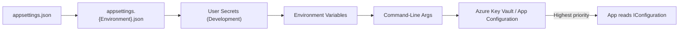

# 6. Configuration, Logging, Health & Background Services

> **TL;DR:** Config providers layer in priority order; structured logging + OpenTelemetry + health probes are non-negotiable for K8s production; background services own their own scopes and must handle exceptions or the host silently dies.

**Interview weight:** P0 — health checks, hosted services, and observability come up constantly for Staff/TL level; graceful shutdown and distributed scheduling are real production war stories.

---

## Configuration Providers & Precedence

Providers are evaluated last-registered-wins. Default order in `WebApplication.CreateBuilder`:



> Each layer overrides keys from the previous. Key Vault / App Configuration is added last manually — gives it highest priority for production secrets.

```csharp
// Key Vault wired in Program.cs
builder.Configuration.AddAzureKeyVault(
    new Uri($"https://{kvName}.vault.azure.net/"),
    new DefaultAzureCredential());
```

---

## IOptions Binding & Validation

```csharp
// Bind, validate, fail-fast
builder.Services.AddOptions<CosmosOptions>()
    .BindConfiguration("Cosmos")
    .ValidateDataAnnotations()    // enforces [Required], [Range], etc.
    .ValidateOnStart();           // throws at startup, not first use

public class CosmosOptions
{
    [Required] public string ConnectionString { get; set; } = "";
    [Range(400, 50000)] public int DefaultRu { get; set; } = 400;
}
```

---

## Reloadable Config & Feature Flags

- `IOptionsMonitor<T>` — subscribes to `OnChange`; host-lifetime singleton that reflects live config.
- **Azure App Configuration** — centralized, reloadable config with feature flags (`IFeatureManager`).
- **Feature flags pattern:**

```csharp
if (await featureManager.IsEnabledAsync("NewFeedAlgorithm"))
    return await newFeedService.GetFeedAsync(userId);
return await legacyFeedService.GetFeedAsync(userId);
```

---

## Structured Logging

```csharp
// ILogger<T> — never use string interpolation
logger.LogInformation("Order {OrderId} created for user {UserId}", orderId, userId);
// NOT: logger.LogInformation($"Order {orderId}..."); — loses structure, allocates string
```

### Log Levels

| Level | Use | Example |
|-------|-----|---------|
| Trace | Very detailed, dev-only | Method enter/exit |
| Debug | Diagnostic, not production | Variable values |
| Information | Normal flow | Request received, order created |
| Warning | Recoverable unexpected | Retry attempt, cache miss storm |
| Error | Operation failed, request handled | DB timeout, serialization error |
| Critical | System-level failure, requires immediate action | Out of memory, process crash |

### High-Performance `LoggerMessage` Source Generators

```csharp
// Avoids boxing, allocation-free at non-active log levels
public static partial class Log
{
    [LoggerMessage(Level = LogLevel.Warning, Message = "Cache miss for key {Key}")]
    public static partial void CacheMiss(ILogger logger, string key);
}
// Usage:
Log.CacheMiss(logger, cacheKey);
```

> At 5K RPS, naive `LogInformation($"...")` allocates strings even when log level filters them out. Source-generated `LoggerMessage` checks level first, zero-alloc if filtered.

---

## Log Scopes & Correlation IDs

```csharp
// Middleware adds correlation ID to all logs within the request
using (logger.BeginScope(new Dictionary<string, object>
{
    ["CorrelationId"] = ctx.Request.Headers["X-Correlation-Id"].FirstOrDefault() ?? Guid.NewGuid().ToString(),
    ["UserId"]        = ctx.User.FindFirstValue("sub") ?? "anon"
}))
{
    await next(ctx);
}
```

All log entries within the scope carry `CorrelationId` as structured field — searchable in Application Insights / Seq / Kibana.

---

## Serilog vs Built-in

| Aspect | Built-in `ILogger` | Serilog |
|--------|-------------------|---------|
| Sinks | Console, Debug, EventLog, custom | 100+ sinks (Seq, Elastic, File, SQL, Datadog) |
| Enrichers | Via scope dictionary | Rich built-ins: machine name, env, process, HTTP context |
| Performance | Good (source generators) | Comparable; async sinks add small overhead |
| Config | `appsettings.json` `Logging` section | `LoggerConfiguration` fluent API |
| Structured output | JSON with `UseJsonConsole` | Native structured (Serilog's core design) |

```csharp
// Serilog setup
builder.Host.UseSerilog((ctx, config) =>
    config.ReadFrom.Configuration(ctx.Configuration)
          .Enrich.FromLogContext()
          .Enrich.WithMachineName()
          .WriteTo.Console(new CompactJsonFormatter())
          .WriteTo.ApplicationInsights(TelemetryConverter.Traces));
```

---

## OpenTelemetry — Traces, Metrics, Logs

```csharp
builder.Services.AddOpenTelemetry()
    .WithTracing(t => t
        .AddAspNetCoreInstrumentation()
        .AddHttpClientInstrumentation()
        .AddEntityFrameworkCoreInstrumentation()
        .AddSource("MyApp.*")
        .AddOtlpExporter())      // to Jaeger, Tempo, Application Insights
    .WithMetrics(m => m
        .AddAspNetCoreInstrumentation()
        .AddRuntimeInstrumentation()
        .AddMeter("MyApp.Orders")
        .AddPrometheusExporter())
    .WithLogging(l => l.AddOtlpExporter());
```

**W3C Trace Context** — `traceparent: 00-{traceId}-{spanId}-01` propagated in HTTP headers automatically by `AddHttpClientInstrumentation`. Enables distributed traces across microservices.

```csharp
// Custom activity (span)
private static readonly ActivitySource Source = new("MyApp.Orders");
using var activity = Source.StartActivity("CreateOrder");
activity?.SetTag("order.id", orderId);
activity?.SetTag("user.id", userId);
```

---

## Health Checks

| Probe type | Purpose | Kubernetes action on failure |
|------------|---------|------------------------------|
| Liveness | Is the process alive? Deadlocked → restart | Kill and restart pod |
| Readiness | Is the process ready to serve traffic? | Remove from load balancer pool |
| Startup | Has the app finished initial startup? | Wait; don't start liveness checks yet |

```csharp
builder.Services.AddHealthChecks()
    .AddSqlServer(connStr, tags: ["readiness"])
    .AddCosmosDb(cosmosClient, tags: ["readiness"])
    .AddCheck<RedisHealthCheck>("redis", tags: ["readiness", "liveness"]);

app.MapHealthChecks("/health/live",
    new HealthCheckOptions { Predicate = c => c.Tags.Contains("liveness") });
app.MapHealthChecks("/health/ready",
    new HealthCheckOptions { Predicate = c => c.Tags.Contains("readiness") });
```

```csharp
// Custom health check
public class RedisHealthCheck(IConnectionMultiplexer redis) : IHealthCheck
{
    public async Task<HealthCheckResult> CheckHealthAsync(
        HealthCheckContext ctx, CancellationToken ct)
    {
        try
        {
            await redis.GetDatabase().PingAsync();
            return HealthCheckResult.Healthy();
        }
        catch (Exception ex)
        {
            return HealthCheckResult.Unhealthy("Redis unreachable", ex);
        }
    }
}
```

---

## `IHostedService` vs `BackgroundService`

| Aspect | `IHostedService` | `BackgroundService` |
|--------|-----------------|---------------------|
| Interface | `StartAsync(CancellationToken)` + `StopAsync(CancellationToken)` | Abstract class wrapping `IHostedService`; override `ExecuteAsync` |
| Complexity | Full control | Simpler for long-running loops |
| `ExecuteAsync` | Must manage manually | Called once; loop inside |
| Exception handling | Manual try/catch in `StartAsync` | Unhandled exception in `ExecuteAsync` stops service silently (pre-.NET 6) |
| Use when | Start/stop coordination, non-loop work | Continuous background loops, queue consumers |

```csharp
public class OrderProcessingWorker(IServiceScopeFactory scopeFactory,
    ILogger<OrderProcessingWorker> log) : BackgroundService
{
    protected override async Task ExecuteAsync(CancellationToken ct)
    {
        while (!ct.IsCancellationRequested)
        {
            try
            {
                await using var scope = scopeFactory.CreateAsyncScope();
                var processor = scope.ServiceProvider.GetRequiredService<IOrderProcessor>();
                await processor.ProcessNextBatchAsync(ct);
            }
            catch (Exception ex) when (ex is not OperationCanceledException)
            {
                log.LogError(ex, "Error processing orders; retrying in 5 s");
                await Task.Delay(5_000, ct); // backoff
            }
        }
    }
}
```

### Graceful Shutdown

- `IHostApplicationLifetime` — `ApplicationStopping` token fires when SIGTERM received; `ApplicationStopped` after all hosted services stop.
- `StopAsync(CancellationToken)` timeout defaults to 5 seconds (configurable via `builder.Host.ConfigureHostOptions(o => o.ShutdownTimeout = TimeSpan.FromSeconds(30))`).
- In K8s: `terminationGracePeriodSeconds` should be longer than `ShutdownTimeout` + inflight request drain time.

```csharp
// PeriodicTimer (.NET 6+) — preferred over Task.Delay in loops
using var timer = new PeriodicTimer(TimeSpan.FromMinutes(1));
while (await timer.WaitForNextTickAsync(ct))
{
    await DoWorkAsync(ct);
}
// Stops cleanly on cancellation without an extra wake-up
```

---

## Singleton Scheduling Problem Across Replicas

Running a `BackgroundService` in multiple pods means the same job fires N times simultaneously → duplicate processing, race conditions.

**Solutions:**

| Approach | How | Latency | Complexity |
|---------|-----|---------|-----------|
| Distributed lock (Redis `SET NX EX`) | Only one instance acquires lock per tick | ~1 ms | Low |
| Leader election (Kubernetes lease) | K8s `Lease` object; only leader runs the job | ~1–5 s | Medium |
| Dedicated job pod (single replica) | `Deployment.replicas=1` for worker deployment | 0 ms | Low; single point of failure |
| Azure Durable Functions / Hangfire | External scheduler with exactly-once semantics | External | Medium/High |

See [Distributed Systems Patterns](../05-System-Design-HLD/09-Distributed-Systems-Patterns.md) for leader election details.

---

## Performance Tuning for High RPS

- **Kestrel limits:** `KestrelServerOptions.Limits.MaxConcurrentConnections`, `MaxRequestBodySize`, `Http2.MaxStreamsPerConnection`.
- **Server GC:** `<ServerGarbageCollection>true</ServerGarbageCollection>` in `.csproj` (default in ASP.NET Core) — uses one GC thread per CPU core vs workstation single-thread.
- **`AsNoTracking()`** on EF Core read-only queries — skips change-tracker overhead; ~30% faster for read-heavy paths.
- **Response buffering** — disable `AllowSynchronousIO` (default off in .NET 3+); use `IAsyncEnumerable<T>` for streaming.
- **`HttpClient` reuse** via `IHttpClientFactory` — prevents socket exhaustion; recycles handlers.
- **Connection pooling** — EF Core uses ADO.NET pool; Cosmos SDK connection pool; Redis `ConnectionMultiplexer` is a singleton.

---

## Common Pitfalls

- `BackgroundService` swallowing exceptions silently — process stays up but does no work.
- `IHostedService.StartAsync` doing blocking work — delays app startup; move to `ExecuteAsync`.
- `IOptions<T>` in a background service — never reloads; use `IOptionsMonitor<T>`.
- Running scheduled jobs on every replica without distributed locking — duplicate side effects.
- Health check endpoint hitting the database on every request — throttle to every N seconds or use a cached result.
- Not configuring `ShutdownTimeout` — default 5 s may not be enough to drain inflight requests at 5K RPS.

---

## Interview Questions

**Q1. What is the configuration provider precedence order and why does it matter?**
A: appsettings.json → env-specific appsettings → user secrets → env vars → command-line → Key Vault. Later providers override earlier ones. Key Vault / App Configuration is registered last to ensure production secrets override any file-based defaults.

**Q2. What is the difference between `IOptions`, `IOptionsSnapshot`, and `IOptionsMonitor`?**
A: `IOptions` = singleton, no reload. `IOptionsSnapshot` = scoped, reloads per request. `IOptionsMonitor` = singleton, subscribes to live change events. Use `IOptionsMonitor` in background services.

**Q3. Why should you never use string interpolation with `ILogger`?**
A: Interpolation allocates a string regardless of log level. Structured logging with message templates defers parameter evaluation, preserves structure (searchable fields), and the source-generated `LoggerMessage` approach incurs zero allocation when filtered out.

**Q4. What are the three Kubernetes health probe types and what happens on failure?**
A: Liveness — process dead/deadlocked → restart pod. Readiness — not ready to serve → remove from load balancer. Startup — still starting up → delay liveness checks. Configure separate endpoints per probe type; tag health checks appropriately.

**Q5. How do you prevent a `BackgroundService` exception from silently killing the worker?**
A: Wrap the `ExecuteAsync` loop body in `try/catch`; on non-cancellation exception, log the error and add a delay before retrying. In .NET 6+ unhandled exceptions in `BackgroundService.ExecuteAsync` propagate to the host — configure `HostOptions.BackgroundServiceExceptionBehavior` to `StopHost` (noisy, fast fail) or `Ignore` (continue). `StopHost` is safer so the health probe fails and K8s restarts the pod.

**Q6. How do you run a scheduled job reliably across multiple Kubernetes replicas?**
A: Use a distributed lock (Redis `SET key value NX EX <seconds>` before each run). Only the instance that acquires the lock executes. All others skip. TTL on the lock prevents deadlock if the holder crashes. Alternative: use leader election via K8s `Lease` object; only leader runs jobs. See Distributed Systems Patterns.

**Q7. Explain W3C Trace Context and why it's important in microservices.**
A: `traceparent` header carries `traceId` (16-byte), `spanId` (8-byte), and flags across HTTP calls. All services attach spans to the same `traceId`. In Jaeger/Tempo/Application Insights you can see the full call graph across 10 microservices for a single request. Without it, debugging a latency spike at 5K RPS is guesswork.

**Q8. At 5K RPS, your health check endpoint is adding 200ms to average response time. What's wrong?**
A: The health check is likely making synchronous DB calls on every probe (K8s probes every 5–10 s across hundreds of pods). Fix: cache health check result with `HealthCheckOptions.ResultStatusCodes` and a `HealthCheckPublisherOptions.Delay`, or implement `IHealthCheck` with a background cached ping rather than a per-check DB round-trip.

**Q9. What is `ValidateOnStart` for options and why use it?**
A: Runs validation (DataAnnotations or custom `IValidateOptions<T>`) at app startup rather than first access. Fail-fast: misconfigured connection strings crash the app before it starts serving traffic, rather than failing on first request. Critical for containers where a misconfigured deploy should be caught at startup by the orchestrator.

**Q10. How does OpenTelemetry differ from Application Insights SDK?**
A: OpenTelemetry is vendor-neutral (CNCF standard). With OTLP exporter you can send to any backend (Jaeger, Grafana Tempo, Prometheus, Datadog). Application Insights SDK is Azure-specific with richer AI-specific features (Live Metrics, Profiler). In .NET 8 you can use OpenTelemetry for instrumentation and export to Application Insights via the `AzureMonitorExporter` — best of both.

**Q11. What happens if `StopAsync`'s cancellation token fires before inflight requests complete?**
A: By default, `StopAsync` waits up to `ShutdownTimeout` (5 s). After timeout, `IHostedService.StopAsync` is forcibly cancelled and the process exits — dropping inflight requests. Solution: increase `ShutdownTimeout`, implement drain logic in middleware (drain counter), and ensure K8s `terminationGracePeriodSeconds` > shutdown timeout + max request duration.

**Q12. Design an observability stack for the News Feed API (7M users, 5K RPS, 99.99% SLO).**
A: Traces: OpenTelemetry → Azure Monitor / Jaeger — track per-request latency across Redis, Cosmos, Service Bus calls. Metrics: Prometheus/`dotnet-counters` — RPS, p50/p95/p99 latency, cache hit rate, error rate; alert at p99 > 50ms. Logs: Serilog + Application Insights — structured, correlation-ID scoped, 30-day retention. Health checks: `/health/live` (Redis ping) + `/health/ready` (Cosmos + Redis); K8s readiness gate. Dashboards: Grafana with 4 golden signals (latency, traffic, errors, saturation). On-call: alert on error rate > 0.01% for 5 min → PagerDuty. This mirrors what was built for the Xbox News Feed.

---

## Quick Recap

- Config precedence: appsettings → env-specific → user secrets → env vars → CLI → Key Vault (last wins).
- `ValidateOnStart` for options = fail-fast misconfiguration.
- `LoggerMessage` source generators = zero-alloc structured logging.
- Correlation ID in log scope = end-to-end traceability.
- Health probes: liveness (alive?) vs readiness (ready for traffic?) vs startup (done initializing?).
- `BackgroundService`: use `IServiceScopeFactory` for scoped deps; catch all exceptions; use `PeriodicTimer`.
- Distributed scheduling problem: Redis lock or K8s leader election to prevent duplicate runs.
- OpenTelemetry W3C trace context = distributed tracing across services without vendor lock-in.
- `ShutdownTimeout` + K8s `terminationGracePeriodSeconds` must account for inflight request drain.
