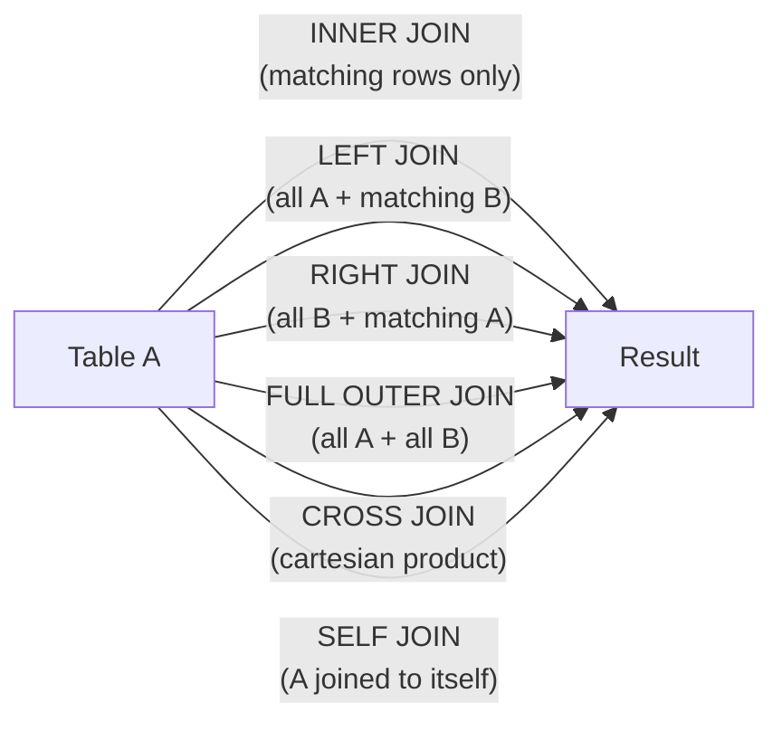
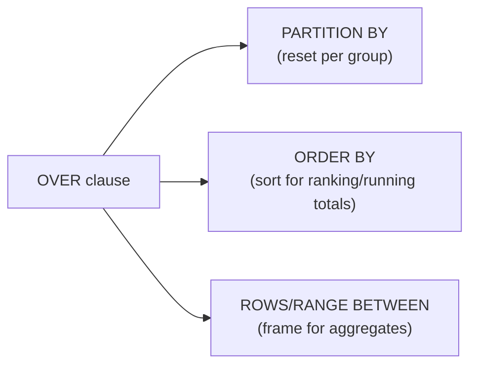

# 1. SQL — Joins, Subqueries, CTEs & Window Functions

> **TL;DR:** Master the relational algebra behind SQL, the nine join variants, logical query-processing order, and the window-function / CTE toolbox — these appear in every SQL interview round.

**Interview weight:** P0 — every SQL interview tests join semantics, NULL behaviour, and window functions. Senior rounds add recursive CTEs, MERGE, and puzzle-solving.

---

## Core Concepts

- **Relational model** — data stored in relations (tables); each row is a tuple; columns are typed attributes; primary key uniquely identifies a row.
- **Logical query processing order** — FROM → (ON) → JOIN → WHERE → GROUP BY → HAVING → SELECT → DISTINCT → ORDER BY → OFFSET/FETCH. This governs when aliases and filters are available.
- **Three-valued logic (3VL)** — SQL predicates return TRUE / FALSE / **UNKNOWN** because any comparison with NULL yields UNKNOWN. `WHERE col = NULL` never matches; use `IS NULL`.
- **NULL propagation** — arithmetic/concatenation with NULL → NULL; aggregate functions (`SUM`, `AVG`, `COUNT`) ignore NULLs except `COUNT(*)`.

---

## Join Types



| Join Type | Rows Returned | NULL-fills? | Typical Use |
| --------- | ------------- | ----------- | ----------- |
| `INNER JOIN` | Only matching rows from both sides | No | Default join |
| `LEFT [OUTER] JOIN` | All from left + matching right | Right side NULLs when no match | Find unmatched in right |
| `RIGHT [OUTER] JOIN` | All from right + matching left | Left side NULLs when no match | Rare — rewrite as LEFT |
| `FULL [OUTER] JOIN` | All from both sides | Both sides can be NULL | Full outer reconciliation |
| `CROSS JOIN` | Cartesian product (M × N rows) | No | Test data, date-spine generation |
| `SELF JOIN` | Table joined to alias of itself | Depends on type | Hierarchies, comparing rows |
| `LEFT ANTI JOIN` | Left rows with NO match in right | — | `LEFT JOIN … WHERE B.key IS NULL` |
| `SEMI JOIN` | Left rows WHERE EXISTS match | — | `EXISTS`/`IN` subquery pattern |

### WHERE vs ON vs HAVING — filter placement in outer joins

```sql
-- ON filter: applied BEFORE the join — right-side filter in LEFT JOIN does NOT exclude left rows
SELECT o.id, p.name
FROM Orders o
LEFT JOIN Products p ON o.product_id = p.id AND p.active = 1;   -- inactive products → NULL, order kept

-- WHERE filter: applied AFTER the join — turns LEFT into effective INNER if it filters out NULLs
SELECT o.id, p.name
FROM Orders o
LEFT JOIN Products p ON o.product_id = p.id
WHERE p.active = 1;   -- rows where p.active IS NULL are removed → same as INNER JOIN

-- HAVING: filters after GROUP BY on aggregated values
SELECT dept_id, COUNT(*) AS cnt
FROM Employees
GROUP BY dept_id
HAVING COUNT(*) > 5;
```

---

## Join Algorithms

| Algorithm | When optimizer picks it | Memory | Handles unsorted? | Equi-join only? |
| --------- | ----------------------- | ------ | ----------------- | --------------- |
| **Nested Loop** | Small outer input, index on inner | O(1) | Yes | No |
| **Hash Join** | Large inputs, no useful index, equi-join | O(smaller table) | Yes | Yes |
| **Merge Join** | Both inputs pre-sorted (index or sort node), equi-join | O(1) | No (needs sort) | Yes |

- Nested loop with an index seek on the inner table = most efficient for OLTP point lookups.
- Hash join spills to `tempdb` if memory is insufficient — causes slowdown.
- Merge join is ideal when both sides have a matching clustered index.

---

## Aggregates & GROUP BY

```sql
-- Non-aggregated SELECT columns must appear in GROUP BY (or be functionally dependent on PK)
SELECT dept_id, job_title, COUNT(*) AS cnt
FROM Employees
GROUP BY dept_id, job_title
HAVING COUNT(*) > 2;

-- ROLLUP — adds subtotals and grand total
SELECT COALESCE(dept_id, 'All') AS dept, SUM(salary)
FROM Employees
GROUP BY ROLLUP(dept_id);

-- GROUPING SETS — combine multiple groupings in one pass
SELECT dept_id, job_title, COUNT(*)
FROM Employees
GROUP BY GROUPING SETS ((dept_id), (job_title), ());
```

---

## Subqueries

| Type | Description | Performance note |
| ---- | ----------- | ---------------- |
| **Scalar subquery** | Returns single value; appears in SELECT or WHERE | Executed once if not correlated |
| **Correlated subquery** | References outer query row; re-executed per outer row | O(N) executions — watch for large tables |
| `EXISTS` | Short-circuits on first match | Preferred over `IN` when subquery has NULLs or is large |
| `IN` | Compiles to semi-join or in-list | Beware: `IN (SELECT … NULL)` returns nothing; `NOT IN` with NULLs is a trap |
| `JOIN` equivalent | Optimizer often rewrites anyway | Most readable for set-based operations |

```sql
-- EXISTS vs IN NULL trap
SELECT * FROM A WHERE id NOT IN (SELECT id FROM B);  -- returns 0 rows if ANY B.id IS NULL!
SELECT * FROM A WHERE NOT EXISTS (SELECT 1 FROM B WHERE B.id = A.id);  -- safe
```

---

## CTEs & Recursive CTEs

```sql
-- Non-recursive CTE — name a subexpression for readability/reuse
WITH ranked AS (
    SELECT *, DENSE_RANK() OVER (PARTITION BY dept_id ORDER BY salary DESC) AS dr
    FROM Employees
)
SELECT * FROM ranked WHERE dr = 1;

-- Recursive CTE — org hierarchy traversal
WITH OrgTree AS (
    SELECT id, manager_id, name, 0 AS depth
    FROM Employees WHERE manager_id IS NULL              -- anchor: root nodes

    UNION ALL

    SELECT e.id, e.manager_id, e.name, t.depth + 1
    FROM Employees e
    INNER JOIN OrgTree t ON e.manager_id = t.id          -- recursive member
)
SELECT * FROM OrgTree ORDER BY depth, name;
-- OPTION (MAXRECURSION 100) to cap depth; default is 100; 0 = unlimited
```

---

## Window Functions



| Function | Category | Description |
| -------- | -------- | ----------- |
| `ROW_NUMBER()` | Ranking | Unique sequential integer — no ties |
| `RANK()` | Ranking | Ties get same rank; next rank skips (1,1,3) |
| `DENSE_RANK()` | Ranking | Ties get same rank; next rank is consecutive (1,1,2) |
| `NTILE(n)` | Ranking | Divides rows into n equal buckets |
| `LAG(col, offset)` | Offset | Previous row value — avoid self-join |
| `LEAD(col, offset)` | Offset | Next row value |
| `SUM/AVG/COUNT OVER` | Aggregate | Running/moving aggregate over a frame |
| `FIRST_VALUE / LAST_VALUE` | Offset | First/last value in the window frame |

```sql
-- Running total with explicit frame
SELECT order_date, amount,
       SUM(amount) OVER (ORDER BY order_date
                         ROWS BETWEEN UNBOUNDED PRECEDING AND CURRENT ROW) AS running_total
FROM Orders;

-- Month-over-month delta using LAG
SELECT month, revenue,
       revenue - LAG(revenue, 1) OVER (ORDER BY month) AS delta
FROM MonthlySales;

-- Top-N per group (no subquery needed)
SELECT * FROM (
    SELECT *, ROW_NUMBER() OVER (PARTITION BY dept_id ORDER BY salary DESC) AS rn
    FROM Employees
) t WHERE rn <= 3;
```

---

## PIVOT / UNPIVOT

```sql
-- PIVOT: rows to columns
SELECT *
FROM (SELECT dept, month, sales FROM SalesData) src
PIVOT (SUM(sales) FOR month IN ([Jan],[Feb],[Mar])) pvt;

-- UNPIVOT: columns to rows (reverse)
SELECT dept, month, sales
FROM SalesData
UNPIVOT (sales FOR month IN ([Jan],[Feb],[Mar])) upvt;
```

---

## Set Operators

| Operator | Duplicates | Description |
| -------- | ---------- | ----------- |
| `UNION` | Removed | All rows from both, deduplicated |
| `UNION ALL` | Kept | All rows from both, no dedup — faster |
| `INTERSECT` | Removed | Rows in both result sets |
| `EXCEPT` | Removed | Rows in first but not second |

---

## MERGE / Upsert

```sql
MERGE TargetTable AS t
USING SourceTable AS s ON t.id = s.id
WHEN MATCHED THEN
    UPDATE SET t.value = s.value, t.updated_at = GETUTCDATE()
WHEN NOT MATCHED BY TARGET THEN
    INSERT (id, value, updated_at) VALUES (s.id, s.value, GETUTCDATE())
WHEN NOT MATCHED BY SOURCE THEN
    DELETE;
-- Caution: MERGE has known race-condition bugs under concurrent load (KB2979759).
-- For upserts: prefer INSERT … ON CONFLICT (Postgres) or IF EXISTS/ELSE pattern in T-SQL.
```

---

## Classic SQL Puzzles

### Nth Highest Salary
```sql
-- Dense rank approach (handles ties correctly)
SELECT salary FROM (
    SELECT salary, DENSE_RANK() OVER (ORDER BY salary DESC) AS dr
    FROM Employees
) t WHERE dr = 3;  -- change 3 to N
```

### Deduplicate (keep latest)
```sql
-- Delete duplicate rows keeping highest id
WITH cte AS (
    SELECT *, ROW_NUMBER() OVER (PARTITION BY email ORDER BY id DESC) AS rn
    FROM Users
)
DELETE FROM cte WHERE rn > 1;
```

### Gaps & Islands (consecutive date ranges)
```sql
WITH numbered AS (
    SELECT date, ROW_NUMBER() OVER (ORDER BY date) AS rn
    FROM ActiveDays
),
grouped AS (
    SELECT date, DATEADD(day, -rn, date) AS grp  -- constant within an island
    FROM numbered
)
SELECT MIN(date) AS island_start, MAX(date) AS island_end, COUNT(*) AS days
FROM grouped
GROUP BY grp ORDER BY island_start;
```

### Top-N Per Group
```sql
SELECT dept_id, name, salary
FROM (
    SELECT dept_id, name, salary,
           ROW_NUMBER() OVER (PARTITION BY dept_id ORDER BY salary DESC) AS rn
    FROM Employees
) t WHERE rn <= 2;
```

---

## Trade-offs & When to Use

- Prefer `LEFT JOIN … IS NULL` (anti-join) over `NOT EXISTS` or `NOT IN` — same semantics, often same plan, but `NOT IN` is dangerous with NULLs.
- Recursive CTEs are readable but can be slow on deep hierarchies — consider closure table (see `04-Data-Modeling-…`).
- Window functions avoid self-joins and correlated subqueries — always prefer them for per-row ranking/running totals.
- `UNION ALL` over `UNION` whenever duplicates are acceptable — avoids a sort/hash dedup step.

---

## Common Pitfalls

- Forgetting `GROUP BY` includes all non-aggregated SELECT columns.
- Using `WHERE` instead of `HAVING` on aggregated values (syntax error or logical error).
- `NOT IN` with NULLs in the subquery — returns zero rows silently.
- Assuming `ROW_NUMBER()` is deterministic without a fully deterministic `ORDER BY`.
- `FULL OUTER JOIN` in high-volume queries without index awareness — can generate huge intermediate sets.

---

## Interview Questions

**Q1. What is the difference between `WHERE` and `HAVING`?**  
A: `WHERE` filters rows before grouping (operates on individual rows). `HAVING` filters groups after `GROUP BY` (operates on aggregated values). You cannot use aggregate functions in `WHERE`.

**Q2. Explain the logical query processing order in SQL.**  
A: FROM → JOIN (with ON) → WHERE → GROUP BY → HAVING → SELECT → DISTINCT → ORDER BY → OFFSET/FETCH. Aliases defined in SELECT are not available in WHERE because WHERE is processed before SELECT.

**Q3. Why does `NOT IN (SELECT … )` return zero rows when the subquery has a NULL?**  
A: SQL uses three-valued logic. `x NOT IN (1, 2, NULL)` expands to `x<>1 AND x<>2 AND x<>NULL`. Any comparison with NULL is UNKNOWN, so the whole expression is UNKNOWN — never TRUE. Use `NOT EXISTS` instead.

**Q4. When would you use `ROW_NUMBER` vs `RANK` vs `DENSE_RANK`?**  
A: `ROW_NUMBER` when you need a unique sequential id per group (pagination, deduplicate). `RANK` when ties should share rank and the next rank skips (leaderboard with gaps). `DENSE_RANK` when ties share rank and no gaps are desired (Nth highest salary).

**Q5. What is a correlated subquery and what's its performance concern?**  
A: A subquery that references a column from the outer query. The database re-executes it once per outer row, making it O(N) — functionally a nested loop. Often rewritable as a JOIN or window function.

**Q6. Explain recursive CTEs and give a use case.**  
A: A recursive CTE has an anchor member (base case) and a recursive member joined to the CTE itself via `UNION ALL`. Use cases: org hierarchies, bill-of-materials, file-system trees, path enumeration. Must set `MAXRECURSION` to avoid infinite loops.

**Q7. How does `ON` vs `WHERE` behave differently in a `LEFT JOIN`?**  
A: `ON` is evaluated during the join — filtering the right table in a LEFT JOIN still preserves all left rows (NULLs for unmatched right). `WHERE` filters the result after the join — a filter on a right-side non-nullable column turns the LEFT JOIN into an INNER JOIN effectively.

**Q8. When would the optimizer choose a hash join vs a nested loop join?**  
A: Nested loop when the outer table is small and the inner table has an index (low I/O). Hash join when both tables are large, no useful index exists, and memory is available. Merge join when both sides are sorted on the join key (e.g., clustered indexes) and the join is equi-join.

**Q9. Design a query to find "gaps" in a sequence of daily login events (islands-and-gaps problem).**  
A: Use the `date - ROW_NUMBER()` trick (or `DATEDIFF` with row number) to group consecutive dates. Each contiguous island shares the same computed constant. `GROUP BY` on that constant to get island start/end. See code above.

**Q10. What is the difference between `UNION` and `UNION ALL`? When would you never use `UNION`?**  
A: `UNION` deduplicates (adds a sort/hash step); `UNION ALL` keeps all rows. Never use `UNION` when duplicates across branches are logically impossible (different IDs, non-overlapping dates) — it wastes CPU/memory for no gain.

**Q11. You have a table `Orders(id, customer_id, status, created_at)` with 50M rows. A query `SELECT customer_id, COUNT(*) FROM Orders WHERE status='pending' GROUP BY customer_id` is slow. Walk me through diagnosing and fixing it.**  
A: Check execution plan — likely a full table scan. Create a filtered index on `status='pending'` including `customer_id` (covering index). Alternatively, a composite index on `(status, customer_id)` allows an index scan limited to pending rows and covers the GROUP BY without a key lookup. Verify statistics are fresh. If the query is called frequently, consider a materialized/indexed view of pending order counts.

**Q12. Explain window function frames — `ROWS BETWEEN` vs `RANGE BETWEEN`.**  
A: `ROWS BETWEEN` uses physical row positions (deterministic for running totals). `RANGE BETWEEN` uses logical values — ties in ORDER BY are included in the same frame, which can produce non-intuitive results (e.g., all rows with the same date included in CURRENT ROW's range). Use `ROWS` for running totals; `RANGE` is the default when ORDER BY is specified and can cause surprises.

**Q13. Your `MERGE` statement on a high-traffic table occasionally deadlocks. How do you fix it?**  
A: MERGE acquires locks in unpredictable order under concurrent load (MS KB2979759). Solutions: (1) use explicit `IF EXISTS … UPDATE ELSE INSERT` with `UPDLOCK`/`HOLDLOCK` hints under a transaction; (2) use `INSERT … ON CONFLICT` (Postgres); (3) serialize upserts through an application-level distributed lock or queue; (4) use optimistic concurrency with a retry loop.

**Q14. What is `GROUPING SETS` and when is it better than multiple `UNION ALL` queries?**  
A: `GROUPING SETS` computes multiple groupings in a single pass over the table. `UNION ALL` of separate aggregations hits the table once per query. For aggregating a large fact table at multiple rollup levels (e.g., by day, by week, by region), `GROUPING SETS` / `ROLLUP` / `CUBE` is 2–10× faster.

---

## Quick Recap

- Logical order: FROM → WHERE → GROUP BY → HAVING → SELECT → ORDER BY. Aliases not available in WHERE.
- `NULL` comparisons → UNKNOWN; `NOT IN` with NULLs returns nothing. Always use `NOT EXISTS`.
- `ON` filter in LEFT JOIN preserves left rows; `WHERE` on right side converts to INNER JOIN.
- `DENSE_RANK` for Nth-highest; `ROW_NUMBER` for dedup and pagination.
- Recursive CTE = anchor `UNION ALL` recursive member; needs `MAXRECURSION`.
- Window functions eliminate correlated subqueries and self-joins for per-row calculations.
- `UNION ALL` > `UNION` whenever logical dedup is unnecessary.
- Gaps-and-islands: `date - ROW_NUMBER()` groups consecutive sequences.
