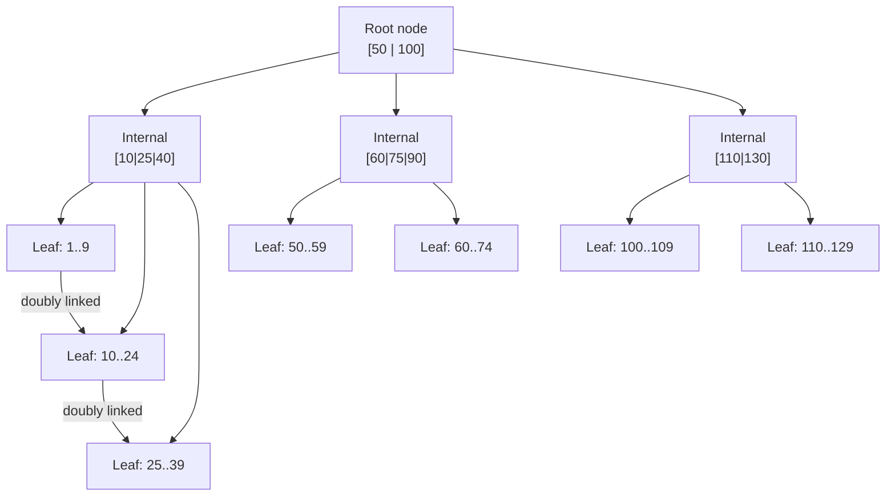

# 2. Indexing & Query Optimization

> **TL;DR:** Indexes are read accelerators with a write tax; understanding seek vs scan, SARGability, covering indexes, and execution-plan reading is the difference between a fast query and a full-table scan at 50M rows.

**Interview weight:** P0 — "why is this query slow?" is the most common senior SQL round question. Expect execution-plan walk-throughs and index-design trade-offs.

---

## Core Concepts

- **B+Tree index** — balanced tree; internal nodes hold separator keys; leaf nodes hold (key, row pointer/data). Depth ≈ log_B(N) — typically 3–4 levels for millions of rows.
- **Clustered index** — leaf pages **are** the table data rows, ordered by the key. One per table.
- **Non-clustered index** — separate structure; leaf nodes hold key + row locator (RID for heap, clustered key for clustered table).
- **Selectivity** — fraction of rows a predicate matches. High selectivity (few rows) = good index candidate. Low selectivity (e.g., boolean) = full scan often cheaper.
- **Cardinality** — number of distinct values. Optimizer uses statistics histograms to estimate rows.

---

## B+Tree Structure



- Leaf pages are **doubly linked** → efficient range scans.
- Insert/delete rebalances (splits/merges) → fragmentation over time.

---

## Clustered vs Non-Clustered

| Aspect | Clustered Index | Non-Clustered Index |
| ------ | --------------- | ------------------- |
| Storage | Leaf = data rows | Separate B+Tree; leaf has key + row locator |
| Count per table | 1 | Up to 999 (SQL Server) |
| Row locator | N/A (IS the row) | Heap: 8-byte RID; Clustered table: clustered key |
| Range scan | Fastest — no extra lookup | May require many key lookups |
| Insert cost | Rows must maintain order | Additional write per index |
| Best key | Monotonically increasing (identity, sequence) to avoid page splits | Equality predicates on frequently-queried columns |

### Heap vs Clustered Table

| | Heap (no clustered index) | Clustered Table |
| - | ------------------------- | --------------- |
| Insert | Append-only, fast | Must maintain order |
| Point lookup | Full scan or RID lookup via NCI | Index seek via clustered key |
| Range scan | Full scan | Efficient (ordered leaf pages) |
| Fragmentation | Forward pointers on row moves | Page splits on out-of-order inserts |
| When to use | Staging/bulk load tables | Default for all OLTP tables |

---

## Composite Index & Leftmost-Prefix Rule

```sql
-- Index on (last_name, first_name, hire_date)
-- Can seek on: last_name; last_name + first_name; last_name + first_name + hire_date
-- CANNOT seek on: first_name alone; hire_date alone
SELECT * FROM Employees WHERE last_name = 'Smith' AND first_name = 'John';  -- seek
SELECT * FROM Employees WHERE first_name = 'John';                          -- scan (no leftmost)
SELECT * FROM Employees WHERE last_name = 'Smith' AND hire_date > '2020';   -- seek on last_name, scan hire_date (first_name skipped)
```

- Put **equality columns first**, then **range columns** last.
- Include high-cardinality columns earlier for better filtering.

---

## Covering Indexes & INCLUDE

```sql
-- Query needs: customer_id (filter), order_date (sort), total_amount (select)
CREATE NONCLUSTERED INDEX IX_Orders_CoveredLookup
ON Orders (customer_id, order_date)
INCLUDE (total_amount);
-- All needed data lives in the index leaf — no key lookup to the base table
```

- **Key columns** participate in seeks/scans (appear in WHERE/JOIN/ORDER BY).
- **INCLUDE columns** only appear in the leaf — no seek benefit, no sort benefit, but avoids key lookup.
- Too many includes = index bloat. Balance read benefit vs write overhead.

---

## Index Seek vs Scan vs Key Lookup

| Operation | Description | Cost | When |
| --------- | ----------- | ---- | ---- |
| **Index Seek** | Navigate B+Tree to matching leaf pages | O(log N + result rows) | SARGable predicate on leading key column(s) |
| **Index Scan** | Read all index pages | O(index pages) | Non-SARGable predicate, or covering index full read |
| **Table Scan** | Read all heap pages | O(table pages) | No usable index |
| **Key Lookup** | For each NCI leaf row, lookup clustered index (or heap) for non-included columns | O(result rows × log N) | NCI doesn't cover; expensive if many rows |
| **RID Lookup** | Same as key lookup but on heap | O(result rows) | NCI on heap table |

- **Key lookup** with > ~1% of table rows → optimizer may prefer table scan. Fix with covering index.

---

## SARGability (Search ARGument Able)

A predicate is SARGable when it **can use an index seek**. The following **kill SARGability**:

```sql
-- Function on indexed column -- non-SARGable
WHERE YEAR(created_at) = 2024
-- Fix:
WHERE created_at >= '2024-01-01' AND created_at < '2025-01-01'

-- Leading wildcard -- non-SARGable
WHERE name LIKE '%Smith%'
-- Fix: full-text search or trigram index

-- Implicit type conversion -- non-SARGable (SQL Server converts indexed col to match literal type)
WHERE varchar_col = 42        -- int literal vs varchar column → scan
WHERE nvarchar_col = 'value'  -- varchar literal vs nvarchar → implicit CONVERT

-- OR on different columns (can sometimes use index union)
WHERE col_a = 1 OR col_b = 2  -- may scan; rewrite as UNION ALL of two seeks

-- Arithmetic on indexed column
WHERE salary * 1.1 > 50000    -- non-SARGable; rewrite as: salary > 50000 / 1.1
```

---

## Index Types Comparison

| Type | Structure | Best For | Drawbacks |
| ---- | --------- | -------- | --------- |
| **B+Tree (default)** | Balanced tree | Range scans, equality, ORDER BY | Write overhead, fragmentation |
| **Hash** | Hash table (memory-optimized tables) | Exact equality only | No range; fixed bucket count |
| **Columnstore** | Column-oriented, compressed | Analytics, aggregations (OLAP) | Not for single-row lookups; row-group overhead |
| **Filtered** | B+Tree on a subset of rows | Sparse columns, partial data | Only useful if WHERE matches filter |
| **Unique** | B+Tree with uniqueness enforcement | Uniqueness constraints | Duplicate insert fails |
| **Full-Text** | Inverted word index | `CONTAINS`, `FREETEXT` on text | Complex setup, async population |
| **Spatial** | R-Tree / tessellation | Geo queries (`STDistance`) | Limited to spatial types |
| **Bitmap** | Bit array (Oracle/Postgres) | Low-cardinality columns in DW | Write locks entire bitmap |

---

## Filtered Indexes

```sql
-- Only index active users — 5% of table, makes index tiny and fast
CREATE NONCLUSTERED INDEX IX_Users_Active
ON Users (email)
WHERE is_active = 1;

-- Useful for: soft-delete patterns, sparse flags, pending queue items
-- Queries must include the filter predicate to use the index
SELECT * FROM Users WHERE email = 'a@b.com' AND is_active = 1;  -- uses index
SELECT * FROM Users WHERE email = 'a@b.com';                    -- may not use it
```

---

## Index Fragmentation & Maintenance

- **Internal fragmentation** — pages are not full (wasted space). Caused by random-key inserts.
- **External fragmentation** — page logical order != physical order (slow sequential scan).
- `sys.dm_db_index_physical_stats` to measure; `avg_fragmentation_in_percent`.
- `REORGANIZE` (online, incremental, < 30% fragmentation) vs `REBUILD` (offline or online Enterprise, > 30%).
- Use monotonically increasing keys (IDENTITY, sequences) to minimize page splits.

### Write Amplification

Each write (INSERT/UPDATE/DELETE) must update every index on the table. A table with 10 indexes = ~10× write I/O. Design write-heavy tables with minimal indexes; read-heavy tables can afford more.

---

## Reading an Execution Plan


Key signals in a plan:
- **Fat arrows** — wide arrow = many rows flowing between operators (unexpected row count = stale stats).
- **Estimated vs Actual rows** — large gap → stale statistics or parameter sniffing; run `UPDATE STATISTICS`.
- **Key Lookup** — indicates NCI doesn't cover; add INCLUDE columns.
- **Sort** — expensive; often resolved by index ORDER BY alignment.
- **Hash Match** — large memory grant; check for missing join index.
- **Warnings** — missing index suggestions, implicit conversions, spills to `tempdb`.

---

## Parameter Sniffing

```sql
-- First call with @status = 'pending' (10K rows) — plan uses table scan
-- Second call with @status = 'closed' (50M rows) — reuses cached scan plan — fast
-- Third call with @status = 'new' (5 rows) — reuses scan plan — should have used seek!

-- Fixes:
OPTION (RECOMPILE)        -- recompile each execution (CPU cost), eliminates sniffing
OPTION (OPTIMIZE FOR (@status = 'pending'))  -- pin to a representative value
OPTION (OPTIMIZE FOR UNKNOWN)                -- use average density instead of sniffed value
-- Or: split into multiple procs by expected selectivity
```

---

## Temp Tables vs Table Variables vs CTEs

| | Temp Table (`#t`) | Table Variable (`@t`) | CTE |
| - | ----------------- | --------------------- | --- |
| Statistics | Yes (full stats) | Single-row estimate (SQL Server <2019) | Inlined — optimizer sees through it |
| Indexes | Explicit CREATE INDEX | Only constraint-based | None |
| Scope | Session / child scope | Batch / procedure | Single statement |
| Transactions | Participates | Does not rollback on ROLLBACK | N/A |
| Best for | Large intermediate sets, multiple references | Small rowsets, TVP params | Named subexpression, single-use readability |

---

## N+1 Problem with EF Core

```csharp
// N+1: loads all Orders then fires 1 SQL per order to load Customer
var orders = db.Orders.ToList();
foreach (var o in orders)
    Console.WriteLine(o.Customer.Name);  // lazy load per row → N+1 queries

// Fix: eager load with Include
var orders = db.Orders.Include(o => o.Customer).ToList();  // single JOIN query

// Fix: explicit load with projection (avoids loading entire entities)
var result = db.Orders
    .Select(o => new { o.Id, CustomerName = o.Customer.Name })
    .ToList();  // single query, minimal columns
```

---

## Slow Query Triage Checklist

```
1. Check execution plan (actual, not estimated):
   - Index seeks or scans? Key lookups?
   - Estimated vs actual row counts (stale stats?)
   - Implicit conversion warnings?

2. Check indexes:
   - Missing index recommendations in plan?
   - Is the predicate SARGable?
   - Does a composite index exist in the right column order?
   - Is the index fragmented (>30%)?

3. Check statistics:
   - sp_updatestats or UPDATE STATISTICS <table>

4. Check for parameter sniffing:
   - Run with OPTION(RECOMPILE) — is it faster? If yes → sniffing issue.

5. Check tempdb / spills:
   - Hash/sort spill warnings in plan → insufficient memory grant → update stats / rewrite

6. Check blocking:
   - sys.dm_exec_requests, sys.dm_os_waiting_tasks
   - Long-running transactions holding locks?

7. Check query structure:
   - DISTINCT / ORDER BY without LIMIT → full sort
   - Functions on columns in WHERE (non-SARGable)
   - OR across columns (consider UNION ALL)

8. Check table design:
   - Heap instead of clustered table?
   - Too many indexes slowing writes and inflating cache pressure?
```

---

## Interview Questions

**Q1. What is a covering index?**  
A: An index that includes all columns needed by the query (filter, join, sort, and SELECT list) so the engine never has to go back to the base table. Achieved by adding `INCLUDE` columns to a non-clustered index.

**Q2. Explain the leftmost-prefix rule.**  
A: A composite index `(A, B, C)` can be used to seek on `A`, `A+B`, or `A+B+C`. It cannot seek on `B` or `C` alone because the B+Tree is sorted by A first. Skipping a column in the middle degrades the seek to a scan on the non-leading portion.

**Q3. What is SARGability and what breaks it?**  
A: A predicate is SARGable when SQL can use an index seek. Non-SARGable: function on indexed column (`YEAR(col)`), leading wildcard (`LIKE '%x'`), implicit type conversion, arithmetic on the column. Fix by transforming the predicate to isolate the column.

**Q4. What is parameter sniffing and how do you handle it?**  
A: On first execution, SQL Server "sniffs" the parameter value and caches a plan optimized for that value. If later calls have very different data distributions, the cached plan is suboptimal. Fixes: `OPTION(RECOMPILE)`, `OPTION(OPTIMIZE FOR UNKNOWN)`, or splitting procedures by selectivity profile.

**Q5. When does a non-clustered index key lookup become more expensive than a table scan?**  
A: Roughly when the NCI returns > 1–5% of table rows. Each key lookup is a random I/O to the clustered index leaf. Random I/Os at scale exceed the cost of a sequential full scan. The optimizer usually switches to a scan at this threshold.

**Q6. What is the difference between `REORGANIZE` and `REBUILD` for index maintenance?**  
A: `REORGANIZE` compacts index pages in-place (always online, low resource). `REBUILD` drops and recreates the index (faster for high fragmentation, requires more space, offline by default unless Enterprise/online rebuild). Rule: < 10% = do nothing; 10–30% = REORGANIZE; > 30% = REBUILD.

**Q7. Explain columnstore indexes and when to use them.**  
A: Columnstore indexes store data column-by-column with compression, enabling batch-mode execution over large result sets. Ideal for OLAP aggregations (SUM/AVG over billions of rows). Poor for single-row OLTP lookups (must decompress an entire row group ≈ 100K rows). Clustered columnstore = entire table is columnar (fact tables). Non-clustered columnstore overlaid on a clustered table enables "HTAP" patterns.

**Q8. You have a query `WHERE email LIKE '%@company.com'` that runs daily on a 10M-row table. How do you optimize it?**  
A: Leading wildcard kills B+Tree seek. Options: (1) Store a `reversed_email` column and query `LIKE 'moc.ynapmoc@%'` on a regular index; (2) Add a `domain` computed/persisted column + index; (3) Full-text search on the email column; (4) Application-level: store domain as a separate indexed column at write time.

**Q9. What is write amplification and how do you balance index count?**  
A: Every DML operation must update all indexes. A table with 12 indexes = 12 B+Tree writes per INSERT. For write-heavy tables (event logs, telemetry), minimize indexes to 1–3. For read-heavy tables (product catalog, user profiles), afford 5–10 covering indexes. Monitor using `sys.dm_db_index_usage_stats` — drop indexes with zero `user_seeks + user_scans` in the last N days.

**Q10. Walk me through diagnosing a slow stored procedure in production.**  
A: (1) Capture actual execution plan from prod via Query Store or `SET STATISTICS IO ON`. (2) Check estimated vs actual rows — large gap = stale stats, run `UPDATE STATISTICS`. (3) Look for key lookups → add covering index. (4) Check for implicit conversion warnings → fix data types. (5) Check for parameter sniffing → `OPTION(RECOMPILE)` test. (6) Check blocking via `sys.dm_os_waiting_tasks`. (7) Review index fragmentation.

**Q11. How does EF Core generate N+1 queries, and how do you detect and fix it in production?**  
A: Lazy loading proxies issue a SELECT per navigation property access inside a loop. Detect with Application Insights SQL dependency tracking or EF Core logging — look for hundreds of identical queries differing only by PK. Fix: `Include()` for eager loading, or `Select()` projections to avoid loading entire entity graphs. For bulk reads, consider raw SQL or Dapper.

**Q12. Your Azure SQL database is hitting 90% DTU during peak. What's your investigation plan?**  
A: (1) Query Performance Insight (Azure portal) → top CPU/I/O queries. (2) Check Query Store for plan regressions. (3) For each hot query: get actual plan, check for full scans, key lookups, high-cost sorts. (4) Add covering indexes or fix SARGability issues. (5) Check for lock wait times — may need isolation-level tuning (RCSI). (6) If index-optimized and still pegged: scale up DTU/vCore, or shard/read-replica for read traffic.

---

## Quick Recap

- B+Tree: leaf pages ordered + doubly linked → efficient seeks and range scans.
- Clustered index = table data ordered by key. One per table. Non-clustered = separate structure, up to 999.
- Covering index = NCI + `INCLUDE` for SELECT columns → eliminates key lookup.
- SARGability killers: functions on column, leading wildcard, implicit conversion, OR across columns.
- Key lookup > ~1–5% rows → optimizer prefers table scan → add covering index.
- Parameter sniffing: plan cached for first parameter value. Fix with `OPTION(RECOMPILE)` or `OPTIMIZE FOR UNKNOWN`.
- Fragmentation: < 10% ignore; 10–30% REORGANIZE; > 30% REBUILD.
- N+1 in EF Core: use `Include()` or projection queries; detect via SQL logging.
