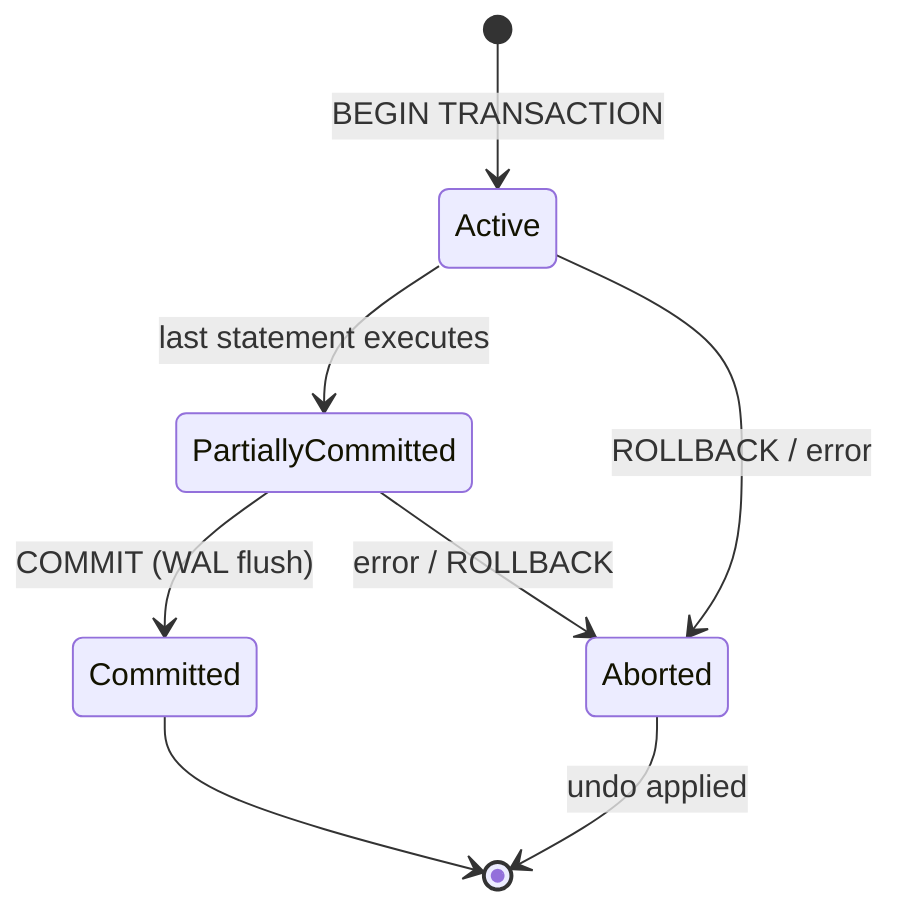
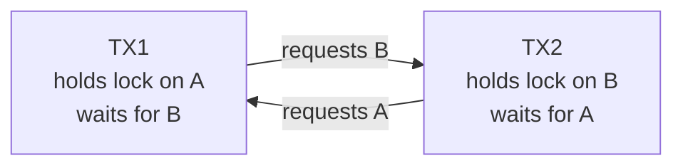
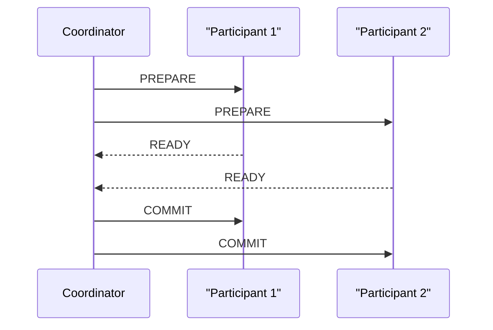

# 3. Transactions, ACID, Isolation & Locking

> **TL;DR:** ACID guarantees correctness; isolation levels trade consistency for concurrency; understanding lock types, deadlocks, and MVCC separates engineers who write correct concurrent code from those who don't.

**Interview weight:** P0 — isolation levels + deadlocks appear in every senior DB round. Distributed transaction alternatives (saga, outbox, idempotency) are critical for microservices design questions.

---

## Core Concepts

- **Transaction** — a unit of work that either fully commits or fully rolls back.
- **ACID** — Atomicity, Consistency, Isolation, Durability — the four database guarantees.
- **Read phenomenon** — anomaly observable when a transaction reads data modified by a concurrent transaction.
- **MVCC** (Multi-Version Concurrency Control) — each write creates a new row version; readers see a snapshot, avoiding read locks.
- **RCSI** (Read Committed Snapshot Isolation) — SQL Server feature that makes READ COMMITTED non-blocking by using row versioning in `tempdb`/`tempdb`-equivalent.

---

## ACID Explained

| Letter | Guarantee | Mechanism |
| ------ | --------- | --------- |
| **A**tomicity | All-or-nothing: partial writes never visible | Undo log / WAL rollback |
| **C**onsistency | Transaction takes DB from one valid state to another | Constraints, triggers, app logic |
| **I**solation | Concurrent transactions behave as if serial | Locks or MVCC |
| **D**urability | Committed data survives crashes | Write-ahead log (WAL) flushed to disk before commit ACK |

---

## Transaction Lifecycle



---

## The Four Read Phenomena

| Phenomenon | Description | Example |
| ---------- | ----------- | ------- |
| **Dirty Read** | Read uncommitted data from a concurrent transaction that may roll back | T1 reads salary updated by T2 before T2 commits; T2 rolls back — T1 read phantom data |
| **Non-Repeatable Read** | Same row read twice gives different values (another TX committed an UPDATE between reads) | T1 reads row, T2 updates + commits, T1 reads same row — different value |
| **Phantom Read** | Same range query returns different sets of rows (another TX committed an INSERT/DELETE) | T1 reads `WHERE dept=5`, T2 inserts new employee in dept 5 + commits, T1 re-reads — extra row |
| **Lost Update** | Two TXs read the same value, both update it — one update overwrites the other silently | Two users both increment a counter from 10; both write 11 instead of 12 |

---

## Isolation Levels vs Read Phenomena

| Isolation Level | Dirty Read | Non-Rep. Read | Phantom Read | Lost Update | Notes |
| --------------- | :--------: | :-----------: | :----------: | :---------: | ----- |
| **READ UNCOMMITTED** | ✅ possible | ✅ possible | ✅ possible | ✅ possible | Never use in production |
| **READ COMMITTED** (lock-based) | ❌ prevented | ✅ possible | ✅ possible | ✅ possible | SQL Server default |
| **READ COMMITTED (RCSI)** | ❌ | ✅ possible | ✅ possible | ✅ possible | Non-blocking; row versions in tempdb |
| **REPEATABLE READ** | ❌ | ❌ prevented | ✅ possible | ❌ prevented | Holds shared locks until TX end |
| **SNAPSHOT** | ❌ | ❌ | ❌ prevented | ❌ (write conflict detected) | MVCC; writers conflict at commit |
| **SERIALIZABLE** | ❌ | ❌ | ❌ | ❌ | Highest isolation; range locks / predicate locks |

- **RCSI** is the recommended default for OLTP in SQL Server — eliminates reader-writer blocking.
- **SNAPSHOT** prevents anomalies via MVCC but adds conflict detection overhead and `tempdb` pressure.
- **SERIALIZABLE** is correct but heavily concurrent; use only for critical financial operations.

---

## MVCC vs Pessimistic Locking

| Aspect | MVCC (Snapshot / RCSI) | Pessimistic Locking |
| ------ | ---------------------- | ------------------- |
| Read blocking | Readers never block writers | Readers block on exclusive locks |
| Write blocking | Writers conflict at commit (snapshot) | Writers block immediately |
| Storage overhead | Row versions in tempdb / undo segments | None |
| Deadlock risk | Lower (no read locks) | Higher |
| Best for | Read-heavy OLTP, reporting | Write-heavy with strict serializability needs |
| Example DBs | SQL Server RCSI/Snapshot, Postgres, MySQL InnoDB | SQL Server default READ COMMITTED (lock-based) |

---

## Lock Types & Granularity

| Lock Mode | Abbrev | Compatible With | Description |
| --------- | ------ | --------------- | ----------- |
| Shared | S | S, IS | Read; released immediately (RC) or held to TX end (RR/S) |
| Exclusive | X | None | Write (UPDATE/DELETE/INSERT); held to TX end |
| Update | U | S, IS | Pre-exclusive for `WHERE … UPDATE`; prevents deadlock between two S→X upgrades |
| Intent Shared | IS | IS, S, IX, U | "I intend to lock shared at lower granularity" |
| Intent Exclusive | IX | IS, IX | "I intend to lock exclusive at lower granularity" |
| Schema Stability | Sch-S | Most | Prevents schema changes during query |
| Schema Modification | Sch-M | None | DDL; blocks everything |

**Lock granularity:** Row → Page → Table → Database. **Lock escalation** in SQL Server: if > 5000 row/page locks are held by one statement, escalates to table lock to save memory → can cause blocking spikes. Prevent with `ROWLOCK` hint or partitioning.

---

## Deadlocks



- SQL Server detects cycles every **5 seconds** via a lock monitor (deadlock monitor thread).
- **Victim selection**: transaction with least rollback cost (smallest log) is killed; receives error 1205.
- **Detection**: trace flag 1222 or Extended Events `deadlock_graph` event.

### Deadlock Prevention Strategies

1. **Consistent locking order** — always acquire locks on tables/rows in the same alphabetical or PK order across all transactions.
2. **Keep transactions short** — minimize time holding locks; never do I/O or user interaction inside a transaction.
3. **Low isolation level** — use RCSI/Snapshot to eliminate read locks.
4. **Retry with exponential backoff** — catch SQL error 1205 and retry.
5. **Update locks** — use `WITH (UPDLOCK)` hint when a SELECT is immediately followed by UPDATE in the same TX (prevents S→X upgrade race).

---

## Optimistic vs Pessimistic Concurrency in C#

```csharp
// Pessimistic: lock the row for the duration (SQL Server UPDLOCK)
using var tx = await db.Database.BeginTransactionAsync(IsolationLevel.RepeatableRead);
var user = await db.Users
    .FromSqlRaw("SELECT * FROM Users WITH (UPDLOCK) WHERE Id = {0}", id)
    .FirstAsync();
user.Balance -= amount;
await db.SaveChangesAsync();
await tx.CommitAsync();

// Optimistic: rowversion / ETag — no locks; conflict detected at save
// In EF Core: add [Timestamp] / rowversion column
public class Account
{
    public int Id { get; set; }
    public decimal Balance { get; set; }
    [Timestamp] public byte[] RowVersion { get; set; }  // maps to rowversion in SQL Server
}
// EF Core automatically adds WHERE RowVersion = @original in UPDATE statement
// Throws DbUpdateConcurrencyException if 0 rows updated → caller retries
try
{
    await db.SaveChangesAsync();
}
catch (DbUpdateConcurrencyException ex)
{
    // reload and retry or surface conflict to user
}
```

---

## Distributed Transactions: 2PC / 3PC



| Protocol | Rounds | Blocks on coordinator failure? | Notes |
| -------- | ------ | ------------------------------ | ----- |
| 2PC | 2 | Yes — participants block waiting for COMMIT/ABORT | DTC in SQL Server; rarely used in microservices |
| 3PC | 3 | Reduced (adds pre-commit phase) | Complex; still blocks in some network partitions |

- **Why avoided in microservices**: coordinator becomes SPOF; participants hold locks during prepare phase; network partition → indefinite blocking. Use saga pattern instead.
- See [Distributed Systems Patterns](../05-System-Design-HLD/09-Distributed-Systems-Patterns.md) for saga, outbox, and choreography vs orchestration.

---

## Saga Pattern (brief)

- Break a distributed transaction into a sequence of local transactions, each publishing an event.
- On failure, execute compensating transactions in reverse order.
- **Choreography** — each service reacts to events autonomously.
- **Orchestration** — a saga orchestrator issues commands and handles compensations.
- Key requirement: each step must be **idempotent** and compensatable.

---

## Idempotency & Exactly-Once Writes

```csharp
// Idempotent upsert using an idempotency key
// Client sends a unique IdempotencyKey with each request
// Server stores (IdempotencyKey, ResponseBody) in a table with TTL
await db.Database.ExecuteSqlInterpolatedAsync($"""
    INSERT INTO IdempotencyLog (Key, CreatedAt, Response)
    SELECT {key}, GETUTCDATE(), {response}
    WHERE NOT EXISTS (SELECT 1 FROM IdempotencyLog WHERE Key = {key})
""");
// If duplicate → skip processing, return cached response
```

- Exactly-once = idempotent processing + at-least-once delivery.
- Outbox pattern: write to local DB and outbox table in one ACID transaction; relay publishes events.

---

## Long-Running Transaction Dangers

- Holds locks → blocks other transactions → queue builds up.
- In MVCC databases: prevents old row-version cleanup → `tempdb` / undo segment bloat.
- SQL Server: `DBCC OPENTRAN` / `sys.dm_tran_active_transactions` to find long-open transactions.
- Set `LOCK_TIMEOUT` to avoid indefinite blocking: `SET LOCK_TIMEOUT 5000` (5 s then error).

---

## Connection Pooling & Transaction Scope Pitfalls

```csharp
// WRONG: TransactionScope with async/await — may resume on different thread → MarshalByRefObject issue
using var scope = new TransactionScope();  // ambient transaction (old pattern)
await DoSomethingAsync();  // deadlock risk on sync-over-async
scope.Complete();

// CORRECT: use explicit EF Core transactions with async
await using var tx = await db.Database.BeginTransactionAsync();
try
{
    await DoSomethingAsync();
    await tx.CommitAsync();
}
catch
{
    await tx.RollbackAsync();
    throw;
}

// TransactionScope safe only with: TransactionScopeAsyncFlowOption.Enabled
using var scope = new TransactionScope(TransactionScopeAsyncFlowOption.Enabled);
```

- **Connection pool starvation**: transactions hold connections; long transactions exhaust the pool under load. Keep transactions < 100 ms in OLTP.
- **Distributed transaction escalation**: `TransactionScope` with two different connection strings → DTC → slow and fragile.

---

## Interview Questions

**Q1. What does Atomicity mean in ACID?**  
A: All operations in a transaction succeed or none of them are applied. Partial writes are never visible. Implemented via undo logs — on rollback, all changes are reversed.

**Q2. What is the difference between READ COMMITTED and REPEATABLE READ?**  
A: READ COMMITTED prevents dirty reads by releasing shared locks immediately after a read. REPEATABLE READ prevents non-repeatable reads by holding shared locks until transaction end, so a re-read of the same row always returns the same value. REPEATABLE READ still allows phantom reads (new rows inserted by concurrent TX).

**Q3. What is RCSI and why is it preferred in Azure SQL?**  
A: Read Committed Snapshot Isolation stores row versions in `tempdb` so readers see the last committed version instead of waiting for a shared lock. Eliminates reader-writer blocking without changing application code. Azure SQL Database has RCSI on by default.

**Q4. Explain how MVCC prevents reader-writer blocking.**  
A: Writers create a new row version; readers access the appropriate snapshot version based on their transaction start time. No shared lock is needed to read — reader and writer never block each other. Storage cost: version store grows until old versions are garbage-collected.

**Q5. What is a deadlock and how does SQL Server resolve it?**  
A: A deadlock is a cycle of transactions where each holds a lock the other needs. SQL Server's lock monitor detects cycles every ~5 s, selects the transaction with smallest rollback cost as the victim, rolls it back, and raises error 1205. Prevention: consistent lock ordering, short transactions, UPDLOCK hints, RCSI.

**Q6. What is the lost update problem and how do you prevent it?**  
A: Two transactions both read a value, then both write an updated value — the second write silently overwrites the first. Prevention: optimistic concurrency (rowversion/ETag — detect conflict at save, retry), pessimistic locking (UPDLOCK/REPEATABLE READ), or atomic compare-and-swap (`UPDATE … WHERE val = @original`).

**Q7. Why are distributed transactions (2PC) avoided in microservices?**  
A: 2PC requires a coordinator that can block all participants during the COMMIT phase. If the coordinator crashes after PREPARE, participants hold locks indefinitely. It also tightly couples services and prevents independent deployments. Use the saga pattern with compensating transactions instead.

**Q8. Explain the difference between optimistic and pessimistic concurrency. When would you choose each?**  
A: Pessimistic locks the resource upfront, preventing conflicts but reducing throughput. Optimistic allows concurrent reads, detects conflicts at write time (via rowversion/ETag), and retries. Choose pessimistic for high-contention resources (account balances) where conflict rate is high and retries are expensive. Choose optimistic for read-heavy, low-conflict scenarios (profile updates, CMS edits) where throughput matters.

**Q9. How do you implement idempotency for an API that processes payments?**  
A: Client includes a unique `Idempotency-Key` header. Server stores `(key, status, response)` in a DB table within the same transaction as the payment. On duplicate request: return cached response without re-processing. Use a partial unique index on `(key, status='completed')` or `UNIQUE(key)` with TTL cleanup. This gives exactly-once semantics with at-least-once HTTP delivery.

**Q10. What happens to long-running transactions in an MVCC database?**  
A: Old row versions cannot be garbage-collected while any open transaction could still need them. The version store (tempdb in SQL Server, undo tablespace in Oracle) grows unboundedly. In Postgres, `pg_stat_activity` shows `xmin` horizon. In SQL Server, `sys.dm_tran_active_snapshot_database_transactions` shows blocking snapshots. Long transactions also hold locks in non-MVCC levels.

**Q11. You see periodic blocking spikes every few hours on a SQL Server table. How do you diagnose?**  
A: (1) Check `sys.dm_os_waiting_tasks` and `sys.dm_exec_requests` during a spike. (2) Enable Extended Events session capturing `lock_acquired`/`lock_released` or use Query Store wait stats. (3) Look for lock escalation events (row locks → table lock). (4) Check if a batch job or scheduled report runs at that time, holding a long transaction. Fixes: break batch into smaller transactions; use RCSI to eliminate read locks; add `ROWLOCK` hint to prevent escalation; schedule batch during off-peak.

**Q12. Describe the saga pattern and how you'd implement compensating transactions for an order placement flow.**  
A: Order placement: (1) Reserve inventory → (2) Charge payment → (3) Send confirmation. Each step is a local transaction + event. If step 2 fails, compensating transactions reverse step 1 (release inventory). Implement as orchestrated saga: a saga orchestrator stores state machine in DB (`OrderSaga` table), issues commands to services via message bus, and handles failure → compensation. Each command handler is idempotent. See [Distributed Systems Patterns](../05-System-Design-HLD/09-Distributed-Systems-Patterns.md).

---

## Quick Recap

- ACID: Atomicity (all or nothing), Consistency (valid states), Isolation (concurrent = serial appearance), Durability (WAL flush before commit ACK).
- Read phenomena: dirty < non-repeatable < phantom < lost update — each solved by stricter isolation.
- RCSI: READ COMMITTED without blocking — use as default on SQL Server/Azure SQL.
- MVCC: readers never block writers; version store grows until GC — long transactions are dangerous.
- Deadlocks: SQL Server detects in ~5 s, kills cheapest victim. Prevention: consistent lock order + short TX + RCSI.
- 2PC in microservices = anti-pattern. Use saga + compensating transactions + idempotency.
- Optimistic concurrency: rowversion/ETag + `DbUpdateConcurrencyException` + retry.
- Keep OLTP transactions < 100 ms; never do I/O or user input inside a transaction.
