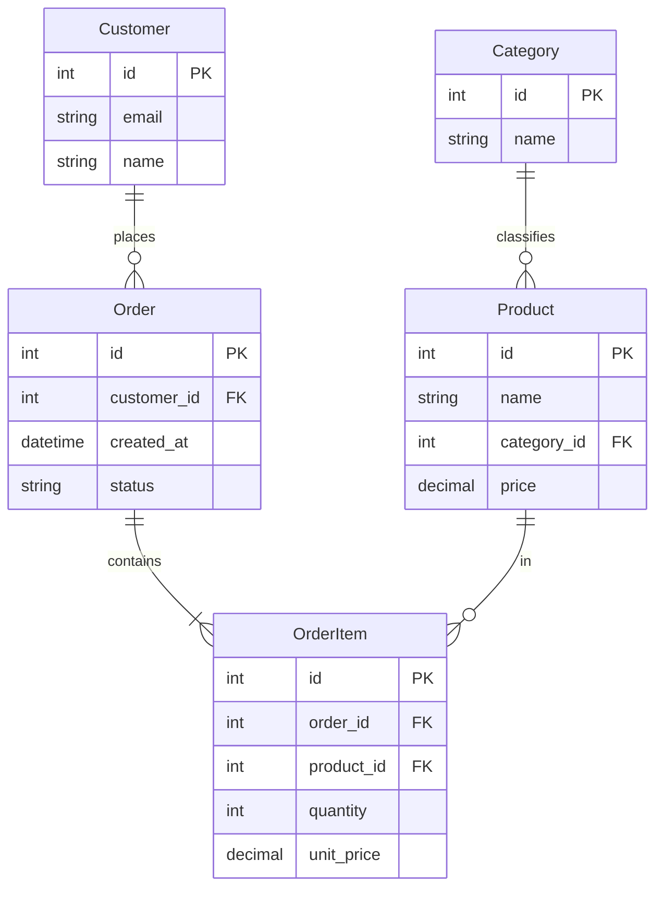
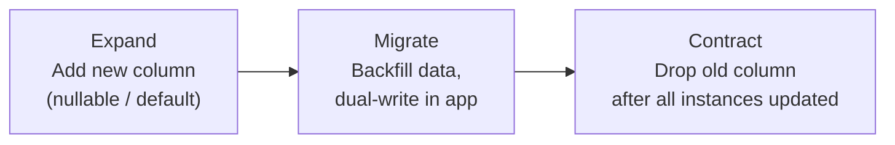

# 4. Data Modeling, Normalization & Denormalization

> **TL;DR:** Model for correctness (normal forms), then denormalize deliberately for read performance. Every schema decision is a trade-off between write complexity, read speed, and migration risk.

**Interview weight:** P0 — schema design questions appear in system design rounds. Senior interviewers probe normalization trade-offs, multi-tenancy models, and zero-downtime migration patterns.

---

## Core Concepts

- **Entity-Relationship (ER) model** — entities (tables), attributes (columns), and relationships (foreign keys).
- **Normal form** — a set of constraints reducing redundancy and update anomalies.
- **Surrogate key** — system-generated identifier (IDENTITY, GUID) with no business meaning.
- **Natural key** — has business meaning (email, SSN, ISBN).
- **Composite key** — primary key spanning multiple columns.

---

## ER Diagram (sample domain: e-commerce)



---

## Keys Comparison

| Key Type | Business meaning | Stability | Index impact | Notes |
| -------- | ---------------- | --------- | ------------ | ----- |
| **Primary (surrogate IDENTITY)** | None | Stable | Monotonic inserts → no page splits | Default choice for OLTP |
| **Primary (natural key)** | Yes | Can change (e.g., email) | Risk of cascading FK updates | Avoid on mutable business attributes |
| **GUID (random)** | None | Stable | Random inserts → page splits, fragmentation | Use only with `NEWSEQUENTIALID()` or ULID |
| **ULID / Snowflake** | None | Stable | Roughly monotonic → low fragmentation | Best of GUID + IDENTITY |
| **Composite** | Depends | Depends | Multi-column index | Use for junction tables |
| **Foreign Key** | Ref to parent PK | Parent-dependent | Index FK column for joins | Essential for integrity |

---

## Normal Forms — Worked Example

**Unnormalized** `Orders` table (violations in bold):

| order_id | customer_name | **customer_email** | product_list | **prices** |
| -------- | ------------- | ------------------ | ------------ | ---------- |
| 1 | Alice | a@a.com | "Pen, Book" | "1.99, 9.99" |

### 1NF — Atomic values, no repeating groups

```sql
-- Split multi-valued columns; one value per cell
Orders(order_id, customer_name, customer_email)
OrderItems(order_id, product_name, price)  -- FK order_id
```

### 2NF — 1NF + No partial dependency on composite PK

```sql
-- If PK is (order_id, product_id), product_name must not depend on product_id alone
Products(product_id, product_name, base_price)
OrderItems(order_id, product_id, quantity, unit_price)  -- unit_price = at time of order
```

### 3NF — 2NF + No transitive dependency (non-key → non-key)

```sql
-- customer_city depends on customer_zip (transitive via customer_id → zip → city)
Customers(customer_id, email, name, zip_id)
ZipCodes(zip_id, zip_code, city, state)  -- extracted to remove transitive dep
```

### BCNF (Boyce-Codd NF) — Every determinant is a candidate key

- Stronger than 3NF. Handles edge cases with multiple overlapping candidate keys.
- Rarely needed in practice; 3NF suffices for most OLTP schemas.

---

## When to Denormalize — Trade-off Table

| Scenario | Denormalization approach | Read gain | Write cost |
| -------- | ------------------------ | --------- | ---------- |
| Frequently read computed value | Store `total_amount` on `Order` | Eliminate SUM join | Update on every OrderItem change |
| Repeated JOIN across 3+ tables | Embed `customer_name` on `Order` | Single-table query | Update when customer name changes |
| OLAP reporting | Star schema (fact + dims) | Fast aggregations | ETL overhead |
| Hot read path (feed, leaderboard) | Denormalized Redis/Cosmos document | Sub-ms reads | Dual write or change-feed sync |
| Search | Copy columns into Elasticsearch document | Full-text search | Sync pipeline needed |

**Rule of thumb**: Normalize to 3NF first, then denormalize only where read performance is proven to be a bottleneck.

---

## Relational vs Document Modeling (same domain)

| Aspect | Relational (Azure SQL) | Document (Cosmos DB) |
| ------ | ---------------------- | -------------------- |
| Order data | `Orders` + `OrderItems` tables + JOINs | Single JSON document containing items array |
| Consistency | ACID multi-row | Atomic within a single document |
| Query flexibility | Any JOIN/GROUP BY | Efficient only if querying within document |
| Update | Update specific column in any row | Replace/patch entire document or use patch API |
| Schema | Enforced by DDL | Flexible — add fields freely |
| Best for | Normalized reporting, complex queries | Read-your-own-writes, denormalized per-entity reads |

---

## One-to-Many & Many-to-Many

```sql
-- One-to-Many: FK on the "many" side
Customer(id)
Order(id, customer_id FK → Customer.id)  -- many orders per customer

-- Many-to-Many: junction table
Student(id, name)
Course(id, title)
Enrollment(student_id FK, course_id FK, enrolled_at)  -- PK: (student_id, course_id)
```

---

## Hierarchical Data Patterns

| Pattern | Description | Query depth | Insert | Move subtree | Storage |
| ------- | ----------- | ----------- | ------ | ------------ | ------- |
| **Adjacency list** | Each row has `parent_id` | Recursive CTE required | O(1) | O(1) update | Minimal |
| **Path enumeration** | Store path string `/1/3/7/` | LIKE prefix O(n) | O(1) | O(subtree size) | Path column |
| **Nested sets** | Left/right bounds (preorder traversal numbers) | O(1) range query | O(n) rewrite | O(n) rewrite | 2 int columns |
| **Closure table** | All ancestor-descendant pairs in separate table | O(1) join | O(depth) inserts | O(subtree) delete + insert | Extra table, can be large |

- **Adjacency list** — default; use recursive CTE for traversal. Simple and flexible.
- **Closure table** — best query performance when hierarchy is read-heavy and deep.

```sql
-- Adjacency list org chart
CREATE TABLE Employee (id INT PK, name NVARCHAR(100), manager_id INT REFERENCES Employee(id));
-- Query full subtree with recursive CTE (see file 01)
```

---

## Soft Deletes

| Approach | Pros | Cons |
| -------- | ---- | ---- |
| `is_deleted` flag | Simple, recoverable | All queries need `WHERE is_deleted = 0`; FK integrity issues |
| `deleted_at` timestamp | Recoverable + timestamp | Same query overhead |
| Move to archive table | Clean active table; FKs remain valid | More complex; reads across tables for audit |
| Filtered index on `is_deleted = 0` | Active queries still use index | Index only covers active rows |

- Soft deletes break UNIQUE constraints — email uniqueness fails if deleted users exist. Partial unique index or `WHERE deleted_at IS NULL` index.

---

## Audit Tables & Temporal Tables

```sql
-- SQL Server temporal table (system-versioned)
CREATE TABLE dbo.Product (
    Id       INT PRIMARY KEY,
    Name     NVARCHAR(100),
    Price    DECIMAL(10,2),
    -- system-versioned columns added automatically:
    SysStart DATETIME2 GENERATED ALWAYS AS ROW START,
    SysEnd   DATETIME2 GENERATED ALWAYS AS ROW END,
    PERIOD FOR SYSTEM_TIME (SysStart, SysEnd)
) WITH (SYSTEM_VERSIONING = ON (HISTORY_TABLE = dbo.ProductHistory));

-- Query as of a point in time
SELECT * FROM dbo.Product FOR SYSTEM_TIME AS OF '2024-01-01T00:00:00';
```

- Alternative: trigger-based audit table (`AuditLog(table_name, pk, old_value, new_value, changed_by, changed_at)` — flexible but slower.

---

## Schema Versioning & Migrations

### Expand-Contract Pattern (zero-downtime)



1. **Expand**: add new column as nullable or with default. Old app still works.
2. **Dual-write**: new app version writes both old and new column.
3. **Backfill**: background job populates new column for existing rows.
4. **Cut over**: remove reads from old column.
5. **Contract**: drop old column after all instances are on new version.

- Never rename a column in one step — breaks old instances still running during deploy.
- Use tools: EF Core Migrations, Flyway, Liquibase.

---

## Slowly Changing Dimensions (brief)

| Type | Behavior | Use case |
| ---- | -------- | -------- |
| SCD Type 1 | Overwrite old value | Correcting errors |
| SCD Type 2 | Insert new row with effective date range | Full history (e.g., customer address history) |
| SCD Type 3 | Add `previous_value` column | Single prior value only |

- SCD Type 2 is what SQL Server temporal tables implement automatically.

---

## Choosing Primary Keys

| Key Type | Monotonic? | Globally unique? | Index fragmentation | Size | Notes |
| -------- | :--------: | :--------------: | ------------------- | ---- | ----- |
| `INT IDENTITY` | ✅ | ❌ (DB-scoped) | Minimal — append-only | 4 bytes | Best OLTP default |
| `BIGINT IDENTITY` | ✅ | ❌ | Minimal | 8 bytes | When > 2B rows expected |
| `NEWID()` (random GUID) | ❌ | ✅ | High — random page splits | 16 bytes | Avoid as clustered key |
| `NEWSEQUENTIALID()` | ✅ (per server) | ✅ | Low | 16 bytes | GUID without fragmentation |
| **ULID** | ✅ | ✅ | Low | 16 bytes (sortable) | Best for distributed systems |
| **Snowflake ID** | ✅ | ✅ | Low | 8 bytes | Time-ordered; needs generator service |

---

## Multi-Tenancy Models

| Model | Isolation | Cost | Schema change complexity | Notes |
| ----- | --------- | ---- | ------------------------ | ----- |
| **Shared schema** (tenant_id column) | Low — logical only | Cheapest | Migrate all tenants at once | Default for SaaS at scale; add RLS |
| **Schema-per-tenant** | Medium | Medium | Migrate each schema independently | Complex connection routing |
| **DB-per-tenant** | High — physical | Expensive (N × DB cost) | Independent migration per tenant | Regulated industries, enterprise |

```sql
-- Shared schema with Row-Level Security (SQL Server)
CREATE SECURITY POLICY TenantFilter
ADD FILTER PREDICATE dbo.fn_TenantFilter(TenantId) ON dbo.Orders
WITH (STATE = ON);
-- fn_TenantFilter returns 1 only if SESSION_CONTEXT(N'TenantId') matches
```

---

## Interview Questions

**Q1. What is the difference between 2NF and 3NF?**  
A: 2NF eliminates partial dependencies — every non-key attribute must depend on the whole composite primary key, not just part of it. 3NF eliminates transitive dependencies — non-key attributes must depend only on the PK, not on another non-key attribute.

**Q2. When would you deliberately denormalize a relational schema?**  
A: When profiling shows that a hot query joins many tables and denormalization eliminates the join cost. Concrete cases: storing `order_total` on `Orders` to avoid `SUM(OrderItems)`, embedding `customer_name` on `Orders` for a read-heavy feed. Always measure first; denormalize the minimum needed.

**Q3. What are the pros and cons of using UUID/GUID as a primary key?**  
A: Pros: globally unique (safe for distributed generation, merging databases, public IDs). Cons: random GUIDs cause index fragmentation and page splits, are 16 bytes vs 4 for INT (more storage, larger FK references, larger index). Mitigation: use `NEWSEQUENTIALID()` or ULID to preserve monotonic order.

**Q4. Explain the expand-contract migration pattern for a zero-downtime column rename.**  
A: (1) Add new column as nullable. (2) Deploy new version that writes both old + new columns. (3) Backfill new column for existing rows. (4) Deploy version that reads from new column only. (5) Deploy version that stops writing old column. (6) Drop old column. Each step is independently deployable with no downtime.

**Q5. What are soft deletes and what pitfalls do they introduce?**  
A: Soft deletes mark rows as deleted (`is_deleted=1`) instead of physical deletion. Pitfalls: every query must filter `WHERE is_deleted = 0`; UNIQUE constraints break (deleted email can't be reused); FKs still reference "deleted" rows; table grows unboundedly. Partial unique index on active rows and periodic archival mitigate these.

**Q6. Compare adjacency list vs closure table for storing a category hierarchy.**  
A: Adjacency list: simple, cheap to insert/move, but requires recursive CTE to traverse — slow for deep hierarchies. Closure table: stores all ancestor-descendant pairs, so any subtree query is a single JOIN — O(1) per level depth. Cost: extra table with O(N×depth) rows; insert must add all ancestors.

**Q7. What is Row-Level Security and when would you use it for multi-tenancy?**  
A: RLS adds a server-side predicate that automatically filters rows based on session context (e.g., `TenantId`). Applications never need to include `WHERE TenantId = X` — the DB enforces it. Use for shared-schema multi-tenancy as a defence-in-depth layer. Limitation: complex predicates add CPU overhead; doesn't help with cross-tenant admin queries.

**Q8. When would you choose DB-per-tenant over shared schema?**  
A: DB-per-tenant for: regulated industries (HIPAA, GDPR data residency), enterprise customers requiring dedicated resources, tenants with very different schema versions. Shared schema for: hundreds or thousands of small tenants where per-DB cost is prohibitive and regulatory requirements allow shared storage.

**Q9. How would you design an audit trail for a financial application?**  
A: Use SQL Server temporal tables (system-versioned) for automatic history tracking with zero application code change. Alternatively, trigger-based `AuditLog(table, pk, column, old, new, changed_by, changed_at)`. For Cosmos DB: store previous version in a `_history` array and sync to audit container via change feed. Immutability: append-only audit table with no UPDATE/DELETE grants.

**Q10. What is SCD Type 2 and how does SQL Server temporal tables implement it?**  
A: SCD Type 2 tracks full history by adding a new row for each change with `valid_from`/`valid_to` timestamps. SQL Server temporal tables do this automatically — every UPDATE inserts the old row into a history table with the SysEnd timestamp. Query `FOR SYSTEM_TIME AS OF` to reconstruct any past state.

**Q11. Your Cosmos DB partition key was `userId` and you're seeing hot partitions for power users. How would you redesign?**  
A: This was the exact migration I led. Options: (1) Synthetic partition key = `userId + "_" + bucket` where bucket = hash(itemId) % N — spreads writes across N logical partitions. (2) Hierarchical partition keys (Cosmos SDK v3.18+): `/userId/categoryId` — queries scoped to a user still hit one physical partition, but partition space is expanded. (3) Change the entity boundary — store per-activity documents keyed by `activityId` instead of `userId`. The p99 improvement (4x) came from eliminating the cross-partition fan-out by aligning partition key with the most frequent query pattern.

---

## Quick Recap

- 1NF: atomic values. 2NF: no partial dep on composite PK. 3NF: no transitive dep between non-keys.
- Denormalize only after profiling — store computed values or copies when JOIN cost is proven.
- INT IDENTITY > random GUID for clustered keys. Use ULID/NEWSEQUENTIALID for distributed unique IDs.
- Expand-contract = safe zero-downtime column rename: add → dual-write → backfill → cut over → drop.
- Adjacency list for simple hierarchies; closure table for read-heavy deep hierarchies.
- Soft deletes: filter every query, break UNIQUE constraints, grow table — handle with RLS + filtered index.
- Multi-tenancy: shared schema (cheapest) → schema-per-tenant → DB-per-tenant (most isolated, most expensive).
- Temporal tables = automatic SCD Type 2 with `FOR SYSTEM_TIME AS OF` queries.
