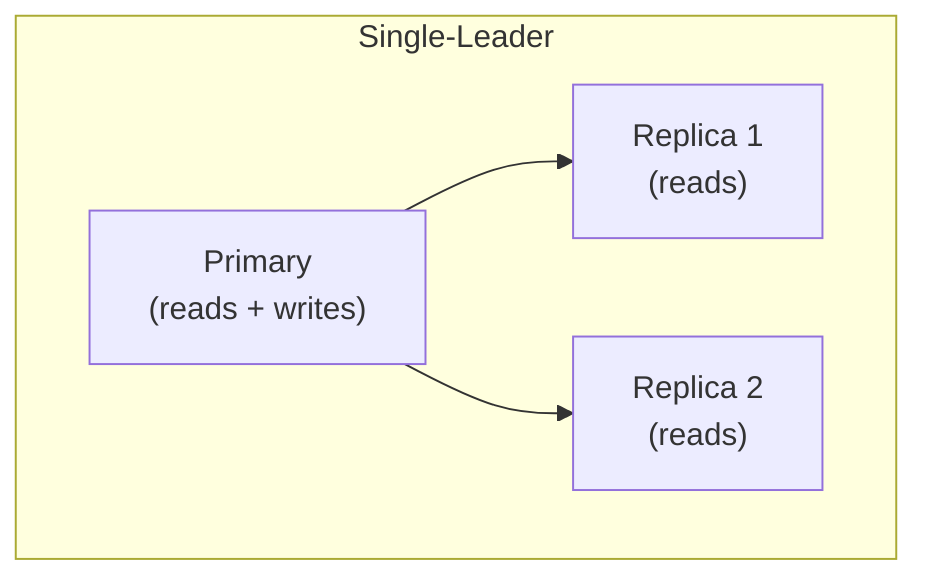
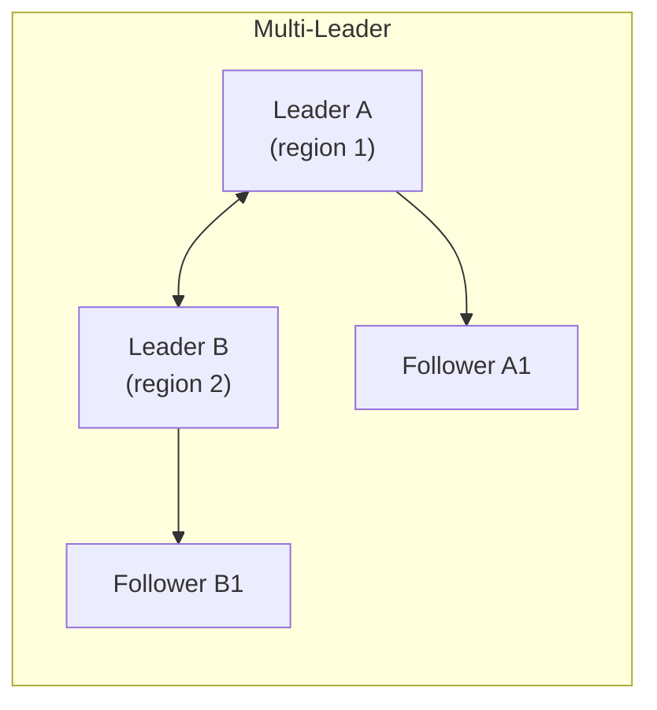
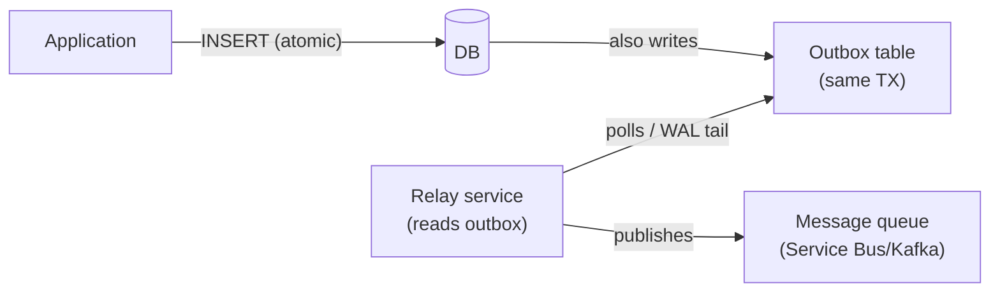

# 5. Sharding, Partitioning & Replication

> **TL;DR:** Partitioning splits data within one DB for manageability; sharding splits across multiple DBs for scale. Replication copies data for availability and read scale. Each introduces consistency and operational complexity.

**Interview weight:** P0 — horizontal scaling, partition-key design, and replication lag are constant system-design topics. Critical for justifying Cosmos DB architectural choices.

---

## Core Concepts

- **Vertical partitioning** — split a wide table by columns (e.g., move blob columns to a separate table).
- **Horizontal partitioning (table partitioning)** — split rows of one table by range/hash/list within the same DB instance.
- **Sharding** — horizontal partitioning **across multiple DB nodes**. Requires application or middleware awareness.
- **Replication** — copying data to additional nodes for availability and/or read scale.
- **Shard key** (partition key) — the attribute that determines which shard a row belongs to.

---

## Vertical vs Horizontal Partitioning

| Aspect | Vertical Partitioning | Horizontal Partitioning |
| ------ | --------------------- | ----------------------- |
| Split by | Columns | Rows |
| Scope | Within one table/DB | Within one DB or across DBs |
| Use case | Separate hot columns (metadata) from cold blobs | Scale row count; archival |
| Query impact | JOIN needed to reassemble full row | Partition pruning for ranged queries |

---

## Sharding Strategies

| Strategy | How it works | Pros | Cons | Hotspot risk |
| -------- | ------------ | ---- | ---- | ------------ |
| **Range sharding** | Key range → shard (e.g., A–M / N–Z, date ranges) | Simple; range scans stay on one shard | Adjacent keys → hotspot; uneven if data skewed | High for time-series (latest shard gets all writes) |
| **Hash sharding** | `shard = hash(key) % N` | Even distribution | No range queries across shards; resharding hard | Low (if key is high-cardinality) |
| **Directory / Lookup** | Metadata table maps key → shard | Flexible; easy re-shard individual keys | Lookup table = SPOF; extra hop | Low |
| **Geo / Zone sharding** | User region → shard | Low latency; data residency | Uneven if regions grow differently | Medium |
| **Consistent hashing** | Keys and shards on a ring; add/remove nodes → few key moves | Minimal resharding | More complex; need virtual nodes | Low |

---

## Consistent Hashing (brief)

- Place N shards at positions on a 0–2³²ring; each key maps to the nearest shard clockwise.
- Adding a shard moves only 1/N of keys. Removing a shard moves only its keys to the next shard.
- Virtual nodes (vnodes): each physical node has K virtual positions → better balance.
- See [Distributed Systems Patterns](../05-System-Design-HLD/09-Distributed-Systems-Patterns.md) for full detail.

---

## Cross-Shard Challenges

| Challenge | Impact | Mitigation |
| --------- | ------ | ---------- |
| **Cross-shard JOIN** | Cannot do DB-level JOIN across shards | Denormalize; do joins in application layer; use a distributed query layer (Spark, Presto) |
| **Cross-shard transactions** | No ACID across shards | Saga + compensating transactions; avoid by colocating related data on same shard |
| **Cross-shard aggregation** | Must fan-out to all shards, aggregate in app | Map-reduce; materialized aggregate table updated by CDC |
| **Distributed sort/ORDER BY** | Each shard sorts locally; merge sort in app | Limit result sets; avoid large cross-shard sorts |

---

## Shard Key Selection Checklist

```
✅ High cardinality — enough distinct values to spread load evenly
✅ Even write distribution — avoid monotonic timestamps (all writes hit one shard)
✅ Aligned with access pattern — most queries filter by this key → stays on one shard
✅ Immutable — changing the shard key requires moving the document/row
✅ Not a hot identity — single famous user / hot event should not own a partition
✅ Consider composite / synthetic key if natural key has low cardinality or skew
```

---

## Replication Topologies





| Topology | Write availability | Conflict handling | Latency | Use case |
| -------- | ------------------ | ----------------- | ------- | -------- |
| **Single-leader** | Primary only; failover needed | None (single writer) | Write: primary; Read: replica lag | OLTP default |
| **Multi-leader** | Any leader | Conflict resolution required (LWW, CRDT) | Low cross-region write latency | Geo-distributed active-active |
| **Leaderless (Dynamo-style)** | Any node | Quorum; anti-entropy repair | Tunable (W + R > N) | High availability, eventual consistency |

---

## Sync vs Async Replication & Replication Lag

| Mode | Durability | Latency impact | Failure risk |
| ---- | ---------- | -------------- | ------------ |
| **Synchronous** | Commit only after replica ACKs | Higher (waits for replica) | Replica failure stalls writes |
| **Asynchronous** | Commit when primary writes WAL | Lower | Data loss window = replica lag on primary failure |
| **Semi-sync** | At least one replica ACKs | Balanced | One replica failure tolerated |

- **Replication lag** = how far behind replica is from primary. Azure SQL readable secondaries: typically < 1 s, but can spike under load.
- **Lag measurement**: `sys.dm_database_replica_states` in SQL Server; `pg_stat_replication` in Postgres.

---

## Read-Your-Writes / Monotonic Reads

- **Read-your-writes**: after a write on primary, a read on a replica may not yet reflect it (lag). Fix: route reads that must see own writes to the primary or use session-level consistency (wait for replica to catch up to last LSN).
- **Monotonic reads**: if a client reads from different replicas, it might see values go backwards in time. Fix: route each client session to the same replica, or use consistent read token (LSN/watermark).

---

## Failover & Split-Brain

- **Automatic failover**: monitoring detects primary failure, promotes replica. Risk: if primary is only partitioned (not crashed) and replica is also promoted → **split-brain** (two primaries accepting writes).
- Prevention: STONITH (Shoot The Other Node In The Head) — fencing to forcibly isolate the old primary before promoting new one.
- Azure SQL uses `sys.dm_hadr_*` DMVs; failover group handles promotion automatically.

---

## Quorum Reads/Writes (W + R > N)

| Parameter | Meaning |
| --------- | ------- |
| N | Total replicas |
| W | Write quorum — min acks for write to succeed |
| R | Read quorum — min replicas to consult on read |

- `W + R > N` → at least one replica returned in a read must have the latest write → **strong consistency**.
- `W=1, R=1` → fastest, weakest (eventual).
- `W=N, R=1` → any read sees latest, but write requires all N available.
- `W=N/2+1, R=N/2+1` → balanced quorum — tolerate `(N-1)/2` failures.

---

## CDC & Outbox Pattern



- **Outbox pattern**: write business data + outbox event in one ACID transaction. Relay publishes events and marks them processed. Guarantees at-least-once event delivery without distributed transactions.
- **CDC (Change Data Capture)**: SQL Server CDC captures INSERT/UPDATE/DELETE in `cdc.*` tables from the transaction log. Azure Event Hubs / Kafka Connect can tail CDC to stream changes downstream.

---

## Backup / Restore / PITR

| Backup type | What it captures | Frequency | RTO | RPO |
| ----------- | ---------------- | --------- | --- | --- |
| Full backup | Entire DB | Weekly/daily | Slow restore | Up to 1 week |
| Differential | Changes since last full | Daily | Faster | Up to 1 day |
| Transaction log backup | All committed transactions | Every 5–15 min | Fast incremental | Up to 15 min |
| PITR (Point-in-Time Restore) | Any point within retention | Continuous (log chain) | Minutes to hours | Near-zero (to the second) |

- Azure SQL: 1–35 day PITR retention (LRS/ZRS/GRS); automatic full + differential + log backups.

---

## HA vs DR / RPO vs RTO

| Concern | Definition | Azure SQL solution |
| ------- | ---------- | ------------------ |
| **HA** (High Availability) | Minimize downtime from infrastructure failure | Always On AG / Business Critical tier; automatic failover < 30 s |
| **DR** (Disaster Recovery) | Recover from region-level failure | Geo-replication / Failover groups; RPO < 5 s async |
| **RPO** (Recovery Point Objective) | Max acceptable data loss | Sync replication → RPO = 0; Async → RPO = lag |
| **RTO** (Recovery Time Objective) | Max acceptable downtime | HA: < 30 s; DR: 1–5 min with failover group |

---

## Interview Questions

**Q1. What is the difference between partitioning and sharding?**  
A: Partitioning splits a table's rows across multiple physical storage units within the same DB server (e.g., SQL Server table partitioning by month). Sharding splits data across multiple independent DB servers, requiring application-level routing. Sharding is horizontal partitioning at the infrastructure level.

**Q2. What are the risks of range-based sharding with timestamps?**  
A: All new writes go to the "current" shard (the latest time range), creating a hot partition. Older shards receive only reads and become cold. Fix: use hash sharding for write-heavy time-series, or add a hash suffix to the timestamp range key (synthetic key).

**Q3. How does consistent hashing minimize data movement when adding a shard?**  
A: In modulo hashing (`hash(key) % N`), adding a shard changes the modulus — nearly all keys move. In consistent hashing, shards are placed on a ring; adding one shard only moves the keys that fall between the new shard and its predecessor — approximately `1/N` of all keys.

**Q4. What is replication lag and how does it affect application design?**  
A: Replication lag is the delay between a write being committed on the primary and becoming visible on a replica. It can range from milliseconds to seconds. Effects: read-your-writes failures (user writes then reads, gets stale data); stale cache on replica. Fixes: sticky sessions to one replica, primary reads for own-writes, waiting for LSN/watermark.

**Q5. Explain W+R>N quorum and how you'd configure it for strong consistency on a 3-node cluster.**  
A: With N=3 nodes, W=2 writes must succeed and R=2 nodes must be read. W+R=4 > 3, so any read overlaps with at least one write node — guaranteed to see the latest value. Tolerates 1 node failure. For eventual consistency: W=1, R=1 — fastest but may return stale data.

**Q6. What is split-brain and how do you prevent it?**  
A: Split-brain occurs when two nodes both believe they are the primary (e.g., primary is partitioned, replica is promoted, then partition heals). Both accept writes → divergent data. Prevention: STONITH/fencing to forcibly disable old primary before promoting new one; use a quorum-based consensus system (Paxos/Raft) for leader election.

**Q7. Describe the outbox pattern and why it guarantees exactly-once event delivery.**  
A: Write the business entity and the outbox event in the same DB transaction — atomically. A relay process reads committed outbox rows and publishes them to a message queue, then marks them as sent. If the relay crashes mid-way, it retries — producing at-least-once delivery to the queue. Consumers must be idempotent. Combining idempotent consumers with at-least-once delivery gives exactly-once semantics.

**Q8. When would you use multi-leader replication and what conflicts can arise?**  
A: Multi-leader for geo-distributed active-active writes (e.g., users in EU and US both write to their local region). Conflicts arise when two leaders concurrently modify the same record. Resolution strategies: LWW (last-write-wins by timestamp — can lose data), CRDT (conflict-free data types), application-level merge function, custom conflict handler. Cosmos DB supports LWW (timestamp-based) and custom stored-procedure conflict resolution.

**Q9. How would you handle cross-shard transactions in a sharded order system?**  
A: Avoid them by design: colocate all order data for a customer on the same shard using `customerId` as the shard key. If unavoidable (e.g., inventory is on a different shard): use saga pattern — reserve inventory (local TX shard A) → create order (local TX shard B) → commit both events via message bus. Compensate if either fails.

**Q10. What is CDC and how would you use it to sync Cosmos DB data to a search index?**  
A: CDC (Change Data Capture) captures row-level changes from the transaction log. In Cosmos DB, the equivalent is the **change feed** — an ordered, persistent log of all inserts/updates per partition. A change feed processor reads this stream and indexes documents into Azure AI Search. Advantages: decoupled, near-real-time, exactly-once per processor instance. See [Cosmos DB Deep Dive](07-Cosmos-DB-Deep-Dive.md).

---

## Quick Recap

- Partitioning = within one DB; sharding = across multiple DB nodes.
- Range sharding → hot latest shard for time-series. Hash sharding → even distribution but no range queries.
- Consistent hashing: add shard → only 1/N keys move. Virtual nodes = better balance.
- Shard key: high cardinality, even distribution, immutable, aligned with query pattern.
- Replication lag: async = data loss window on failover; sync = write latency. Use semi-sync for balance.
- W+R>N = strong consistency quorum. N=3, W=2, R=2 = tolerates 1 failure.
- Outbox pattern: business write + event in one ACID transaction → at-least-once event delivery.
- RPO = data loss window; RTO = downtime window. HA for node failures; DR for region failures.
