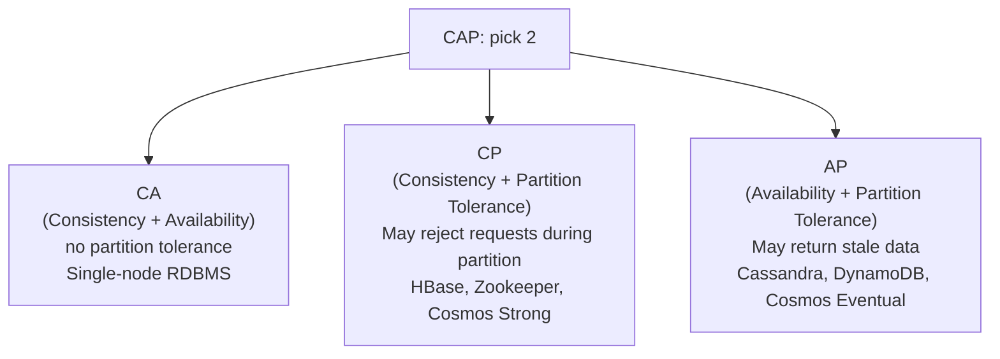

# 6. NoSQL Landscape & CAP

> **TL;DR:** NoSQL trades relational constraints for horizontal scale and flexible schemas. CAP says you can't have Consistency + Availability + Partition Tolerance simultaneously — in practice partition tolerance is non-negotiable, so the real choice is C vs A. PACELC adds latency to the trade-off.

**Interview weight:** P0 — CAP is a mandatory system design topic. The five NoSQL families and their trade-offs appear in every "which DB would you use" question.

---

## Core Concepts

- **CAP theorem** — A distributed system can guarantee at most two of: Consistency, Availability, Partition Tolerance.
- **Partition Tolerance** — the system continues to operate when network messages between nodes are lost/delayed. Network partitions are inevitable → you must tolerate them → real choice is **C vs A during a partition**.
- **Consistency (CAP)** — every read returns the most recent write or an error (linearizability). Not the same as ACID consistency.
- **Availability (CAP)** — every request receives a non-error response (though it may not contain the most recent write).
- **BASE** — Basically Available, Soft state, Eventually consistent — opposite of ACID; used by eventually consistent systems.

---

## CAP Theorem Diagram



- **CA systems** only exist in theory (single-node, no network between nodes).
- In practice: production distributed DBs are either **CP** (sacrifice availability during partition) or **AP** (sacrifice consistency, serve potentially stale data).
- **Common misinterpretation**: CAP doesn't mean you sacrifice C or A all the time — only during an active network partition.

---

## PACELC

Extends CAP by adding the **latency vs consistency trade-off during normal operation** (when no partition):

| Scenario | Trade-off |
| -------- | --------- |
| Partition (P) | A vs C — same as CAP |
| Else (E) — normal operation | Latency (L) vs Consistency (C) |

- DynamoDB: PA/EL — available during partition; lower latency during normal operation (eventual by default).
- Cosmos DB: configurable — Strong = PC/EC (consistent but higher latency); Eventual = PA/EL.
- Spanner: PC/EC — consistent always, pays cross-region latency.

---

## BASE vs ACID

| Property | ACID | BASE |
| -------- | ---- | ---- |
| **Consistency** | Strong — transaction leaves DB in valid state | Soft state — data may be in flux |
| **Availability** | May block waiting for locks | Basically available — responds even if stale |
| **Staleness** | No — reads always see committed data | Yes — eventually consistent |
| **Transactions** | Multi-row, atomic | Usually single-document / best effort |
| **Use case** | Banking, orders, inventory | Social feeds, analytics, IoT |

---

## Consistency Models Spectrum

From strongest to weakest (lower = more available / lower latency):

| Level | Guarantee | Examples |
| ----- | --------- | -------- |
| **Linearizable** | Read always returns latest write; operations appear atomic and instantaneous | Spanner, Cosmos Strong, Zookeeper |
| **Sequential** | All processes see operations in same order, though not real-time | Raft / Paxos consensus |
| **Causal** | If A causes B, everyone sees A before B | MongoDB causal sessions, Cosmos Consistent Prefix |
| **Read-Your-Writes** | A client always sees its own writes | Cosmos Session, Azure SQL primary |
| **Eventual** | All replicas converge eventually given no new writes | Cassandra (W=1,R=1), Cosmos Eventual |

---

## The Five NoSQL Families

| Family | Data model | Representative products | Strengths | Weaknesses | Use cases |
| ------ | ---------- | ----------------------- | --------- | ---------- | --------- |
| **Key-Value** | Opaque value per key | Redis, DynamoDB (basic), Memcached | O(1) get/put; extreme throughput; simple TTL | No query by value; no range queries (without sorted set) | Sessions, caches, leaderboards, rate-limit counters |
| **Document** | JSON/BSON document per key | Cosmos DB, MongoDB, Firestore | Flexible schema; nested objects; ad-hoc queries | JOINs across collections are expensive; max doc size limits | User profiles, product catalogs, CMS, game state |
| **Wide-Column** | Rows with dynamic columns; partitioned by row key | Cassandra, HBase, BigTable | Write-optimized (LSM tree); massive scale; tunable consistency | No ad-hoc queries (must model for known access patterns); no JOINs | IoT telemetry, time-series, event logs, audit trails |
| **Graph** | Vertices + edges with properties | Neo4j, Amazon Neptune, JanusGraph | Efficient multi-hop traversals; relationship queries | Poor for bulk aggregations; limited ecosystem | Social networks, fraud detection, recommendation, knowledge graphs |
| **Time-Series** | Timestamped measurements, compressed | InfluxDB, TimescaleDB, Azure Data Explorer | High ingest rate; automatic downsampling/retention; time-range queries | Not general-purpose; poor for non-time queries | Metrics, monitoring, IoT sensor data, financial ticks |

---

## When NOT to Use NoSQL

- Complex multi-entity transactions with ACID requirements (use relational DB).
- Ad-hoc query patterns not known at schema design time (NoSQL requires query-driven modeling).
- Strong consistency required everywhere and latency budget allows it.
- Strong reporting / BI / analytical queries across many dimensions (use a data warehouse or columnar DB).
- Existing team expertise is deep in SQL and NoSQL operational overhead isn't justified.

---

## SQL vs NoSQL Decision Table

| Criterion | Choose SQL | Choose NoSQL |
| --------- | ---------- | ------------ |
| Data structure | Tabular, well-defined, relational | Hierarchical, nested, semi-structured, flexible |
| Transaction needs | Multi-row ACID | Single-document or eventual |
| Query patterns | Ad-hoc, complex JOINs, GROUP BY | Known access patterns, key-based |
| Scale axis | Vertical (or limited horizontal via read replicas) | Horizontal sharding native |
| Schema evolution | Controlled migration | Schema-less / additive |
| Team familiarity | SQL expertise | NoSQL tooling investment |

---

## DynamoDB-Style Single-Table Design

- **Single-table design**: store all entities in one table, differentiated by `PK` + `SK` compound key patterns and a `type` attribute.
- **Adjacency list pattern**: for many-to-many — both sides reference each other as items in the same table.
- **GSI (Global Secondary Index)**: index any attribute as a new PK/SK for alternative access patterns (async, eventual).
- **LSI (Local Secondary Index)**: alternative sort key for the same partition key; strongly consistent; must be defined at table creation.

```
PK              SK                type    data
USER#u1         USER#u1           USER    {name, email}
USER#u1         ORDER#o1          ORDER   {total, status}
ORDER#o1        ORDER#o1          ORDER   {total, status}
ORDER#o1        ITEM#i1           ITEM    {product, qty}
```

---

## Cassandra Wide-Column Modeling

- Data model driven by **queries, not entities**.
- Partition key = what you filter by (must be exact match). Clustering key = how data is sorted within a partition.
- Tunable consistency per operation: `QUORUM`, `ONE`, `ALL`, `LOCAL_QUORUM`.
- **Compaction** strategies: STCS (write-optimized) vs TWCS (time-windowed, good for time-series) vs LCS (read-optimized, write amplification).

```cql
-- Model for "get all orders for a user, sorted by date"
CREATE TABLE orders_by_user (
    user_id   UUID,
    order_date TIMESTAMP,
    order_id  UUID,
    status    TEXT,
    PRIMARY KEY (user_id, order_date, order_id)
) WITH CLUSTERING ORDER BY (order_date DESC);
-- Partition key: user_id; clustering: order_date DESC, order_id
```

---

## Redis as Data Store vs Cache

| Aspect | Cache | Data Store |
| ------ | ----- | ---------- |
| Persistence | RDB snapshot / AOF optional | AOF enabled; RDB for backup |
| Eviction | Yes (LRU/LFU) | No eviction (maxmemory-policy = noeviction) |
| Replication | Optional | Sentinel or Cluster mode |
| Data structures used | String, Hash (session) | Sorted Set (leaderboard), List (queue), Stream (event log), HyperLogLog (cardinality) |
| Risk of data loss | Acceptable (cache miss → DB) | Must not lose (enable persistence) |

- Redis GET ≈ 0.1–0.3 ms for in-memory operations.
- Redis Cluster: 16,384 hash slots across N nodes; automatic sharding.

---

## LSM-Tree vs B-Tree Storage Engines

| Aspect | LSM-Tree (Log-Structured Merge) | B-Tree |
| ------ | ------------------------------- | ------ |
| Write | Sequential append to MemTable → flush to SSTable (fast) | In-place update (random write) |
| Read | Potentially multiple SSTables to merge (compensated by bloom filter + cache) | O(log N), single path |
| Write amplification | Low at ingestion; compaction amplifies later | Higher per-write (update in-place) |
| Read amplification | Higher (multi-level SSTables) | Lower |
| Space amplification | Higher (multiple versions until compaction) | Lower |
| Best for | Write-heavy, append-only, time-series | Read-heavy, OLTP, mixed |
| Examples | Cassandra, RocksDB, LevelDB, Cosmos DB internal | InnoDB (MySQL), SQL Server, Postgres |

---

## Polyglot Persistence

- Use different DB technologies for different parts of the system based on each one's strengths.
- Example (Xbox-scale game backend):
  - **Azure SQL** — relational transactions (purchases, entitlements)
  - **Cosmos DB** — player profiles, game state (flexible document, global distribution)
  - **Redis** — leaderboards, session cache, rate limiting
  - **Azure AI Search** — full-text product/achievement search
  - **Azure Data Explorer (Kusto)** — time-series telemetry, A/B test analysis

---

## Interview Questions

**Q1. State the CAP theorem precisely.**  
A: In a distributed system where network partitions can occur, you cannot simultaneously guarantee both that every node returns the most recent write (Consistency) and that every request receives a response (Availability). You must choose one to sacrifice during a partition. Partition tolerance is not optional in real networks.

**Q2. What is the common misinterpretation of CAP?**  
A: Many engineers think CAP means you permanently sacrifice C or A. In reality, you only face the C vs A trade-off **during an active network partition**. When the network is healthy, CP systems are also available and AP systems can serve consistent data. The trade-off is "what do you do when a partition happens?"

**Q3. What is PACELC and why is it a more useful model than CAP?**  
A: CAP only describes behaviour during a partition. PACELC adds the latency vs consistency trade-off during normal operation (no partition). Most systems face this trade-off constantly, not just during failures. Example: even when healthy, a strongly consistent DB (like Spanner) adds cross-region round-trip latency; an eventually consistent DB (DynamoDB) returns faster but with potential staleness.

**Q4. When would you choose a document database over a relational DB?**  
A: When the entity is naturally hierarchical (e.g., an order with embedded items, a user profile with nested preferences), access patterns are mostly by a single entity (get-by-ID), schema evolves frequently, and you don't need JOINs across entities. If you need complex multi-entity queries or ACID multi-row transactions, relational is safer.

**Q5. What is the difference between a GSI and LSI in DynamoDB-style tables?**  
A: LSI (Local Secondary Index) uses the same partition key as the table but a different sort key — allows sorting by an alternative attribute within a partition. Must be defined at table creation; strongly consistent reads possible. GSI (Global Secondary Index) can project any attribute as PK/SK — enables entirely different access patterns; queries are eventually consistent; can be added after creation.

**Q6. Explain Cassandra's tunable consistency and when you'd use `LOCAL_QUORUM`.**  
A: Each read/write can specify a consistency level: `ONE` (fastest, weakest), `QUORUM` (majority of all replicas across DCs), `LOCAL_QUORUM` (majority within local DC only). `LOCAL_QUORUM` is the production default for multi-DC Cassandra — strong consistency within a region without cross-DC round trips. Use `QUORUM` only when cross-DC consistency is required (rarely).

**Q7. What is write amplification in an LSM-tree database and how does compaction cause it?**  
A: Initial writes go to MemTable (memory) → flushed to L0 SSTables → compaction merges L0 into L1 → L1 into L2, etc. Each compaction rewrites data — a record written once may be physically rewritten 10–30× across compaction levels. Mitigation: TWCS (time-windowed compaction) for time-series data that is never updated — each time window forms one SSTable and is compacted once.

**Q8. When would you NOT use NoSQL?**  
A: (1) Complex multi-entity ACID transactions (e.g., double-entry accounting). (2) Highly ad-hoc reporting requiring arbitrary JOINs and GROUP BY. (3) Strong consistency is required system-wide and write latency budget is flexible. (4) Team has deep SQL expertise and NoSQL operational overhead (schema-less discipline, compaction tuning) isn't justified by scale needs.

**Q9. What is single-table design in DynamoDB and what is the trade-off?**  
A: All entity types live in one table with composite `PK+SK` patterns. Advantages: supports all access patterns with minimal GSIs, single read/write path, efficient for co-located entity fetches. Trade-offs: schema is opaque without documentation, hard to query ad-hoc, difficult to onboard new developers, no relational constraints, all filtering logic moves to application layer.

**Q10. How would you design Redis for a real-time leaderboard for 10M users?**  
A: Use a Redis Sorted Set: `ZADD leaderboard <score> <userId>`. `ZREVRANK` for rank lookup (O(log N)); `ZREVRANGE` for top-N (O(log N + K)). Score = total points. For daily/weekly leaderboards: separate keys per time window with TTL. Redis Cluster shards sorted sets across nodes (hash by key) — a single leaderboard key stays on one node, so the node must handle all writes. Mitigation: pre-aggregate scores, shard into multiple regional keys, merge for global view.

**Q11. In your Cosmos DB migration, how did you handle the transition from a relational schema to a document model without breaking existing consumers?**  
A: (1) Designed new document schema aligned to the most frequent query pattern (by `userId`). (2) Used the dual-write phase — new writes went to both SQL and Cosmos simultaneously. (3) Ran shadow reads to compare responses between old and new paths. (4) Used Cosmos change feed to backfill historical data. (5) Gradually shifted read traffic with feature flags, monitoring p99 latency. (6) Cut over after 2 weeks of shadow validation. The partition key redesign eliminated cross-partition fan-out, which was the main source of the p99 4x improvement.

---

## Quick Recap

- CAP: distributed DBs must tolerate partitions → choose CP (reject during partition) or AP (serve stale data).
- PACELC: adds latency vs consistency trade-off during normal operation — more practical than CAP alone.
- BASE = Basically Available, Soft state, Eventually consistent — the NoSQL consistency model.
- Five families: Key-Value (cache/sessions), Document (profiles/CMS), Wide-Column (telemetry/logs), Graph (relationships), Time-Series (metrics).
- LSM-tree: fast writes (sequential append) but read/write amplification during compaction. B-Tree: faster reads, higher write cost.
- Single-table DynamoDB: all entities in one table, access-pattern-driven PK+SK design; powerful but opaque.
- Polyglot persistence: match DB type to access pattern strengths — don't force one DB to do everything.
