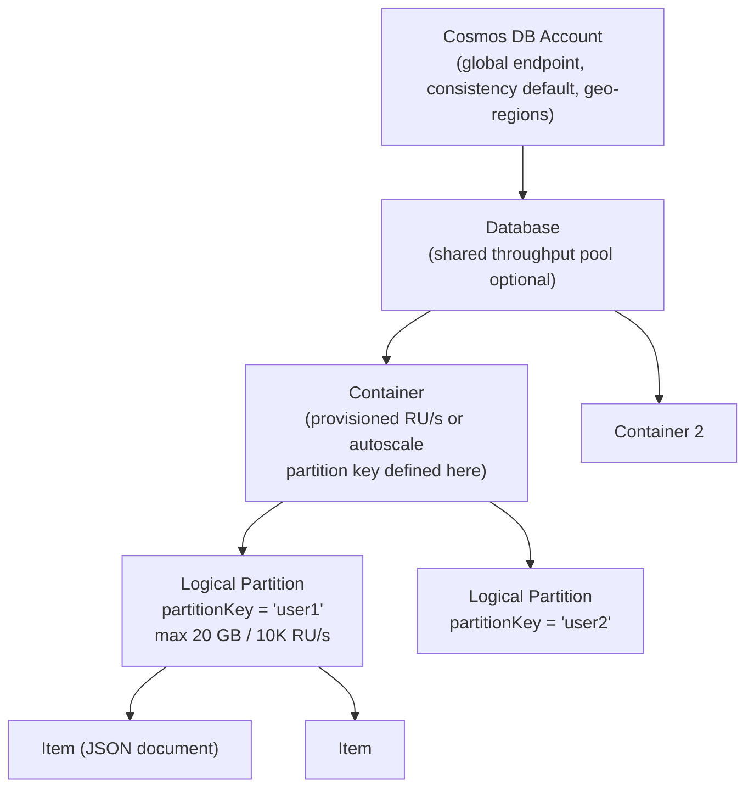
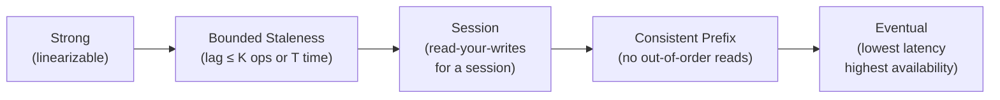
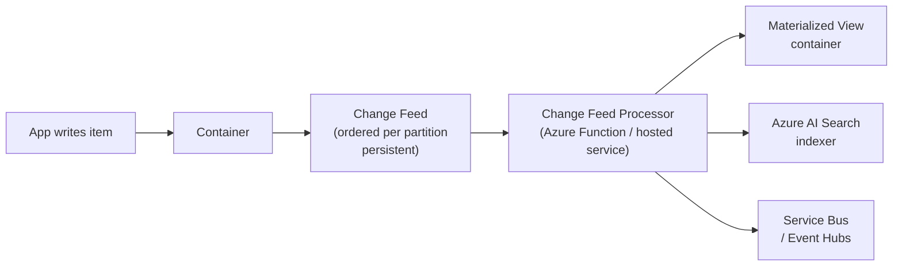
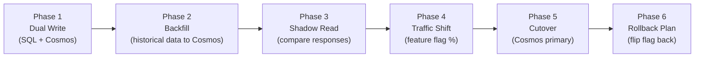

# 7. Cosmos DB Deep Dive

> **TL;DR:** Cosmos DB is a globally distributed, multi-model NoSQL database. Mastering partition-key design, RU budgeting, consistency levels, and the change feed is the difference between a 429-plagued system and one that scales to 5K+ RPS with p99 < 50 ms.

**Interview weight:** P0 — this is the reader's production system. Expect exhaustive questions on partition keys, RU consumption, consistency trade-offs, and migration strategies. Be ready to reference real production experience.

---

## Core Concepts

- **Request Unit (RU)** — the single currency of Cosmos DB throughput. One RU ≈ cost to read a 1 KB item by point read. Every operation has an RU cost visible in the response header (`x-ms-request-charge`).
- **Logical partition** — all items with the same partition key value. Max 20 GB, max 10,000 RU/s per logical partition.
- **Physical partition** — one or more logical partitions mapped to a server group. Cosmos DB manages the mapping transparently.
- **Change feed** — append-only ordered log of all insert/update operations per partition. Core primitive for event-driven patterns.

---

## Resource Model



| Level | Key config | Constraint |
| ----- | ---------- | ---------- |
| Account | Global endpoint, default consistency, geo-regions | Up to 25 regions |
| Database | Optional shared throughput (400–1M RU/s shared across containers) | Shared RU/s split by demand |
| Container | Partition key (immutable after creation); throughput (dedicated or shared) | Max 1M RU/s dedicated; autoscale 10× |
| Logical partition | All items with same PK value | Max 20 GB; max 10,000 RU/s |
| Item | JSON document | Max 2 MB per item |

---

## Logical vs Physical Partitions

- **Logical partition** — defined by partition key value; controlled by developer; unit of atomicity (transactions scoped to one LP).
- **Physical partition** — internal server group; hosts one or more logical partitions; Cosmos transparently splits physical partitions when one grows > ~50 GB or RU/s demand requires it.
- **Hot partition** — one logical partition receiving disproportionate RU/s → throttling (429) for that LP only, even if aggregate throughput is available.

---

## Partition Key Design

### Requirements Checklist

```
✅ High cardinality — thousands to millions of distinct values
✅ Even RU distribution — avoid "celebrity" keys (famous user, hot event)
✅ Even storage distribution — avoid keys whose data grows unboundedly
✅ Aligned with most frequent query — point reads / single-partition queries cost 1 RU
✅ Immutable — Cosmos DB does not support changing a partition key after item creation
✅ Not too fine-grained — avoid per-document keys if batching helps
```

### Hot Partition Symptoms

- Sustained 429 responses with `x-ms-retry-after-ms` on specific partition key values.
- `CosmosPartitionKeyRangeStatistics` shows 1 partition consuming > 80% of RU/s.
- P99 latency spikes correlated with specific user IDs / entity IDs.

### Synthetic / Composite Keys

```csharp
// Low cardinality department ID — combine with a suffix to spread load
item.PartitionKey = $"{departmentId}_{itemId[..4]}";  // e.g., "HR_a3f2"

// Tenant + entity type composite
item.PartitionKey = $"tenant:{tenantId}:type:{entityType}";
```

### Hierarchical Partition Keys (SDK v3.18+, preview)

- Define up to 3 levels: `/tenantId`, `/userId`, `/sessionId`.
- Queries scoped to a tenant hit one sub-partition set. Queries scoped to a user hit an even smaller set.
- Backward-compatible with existing single-partition-key queries.

```csharp
ContainerProperties props = new(containerId, new PartitionKeyDefinition
{
    Version = PartitionKeyDefinitionVersion.V2,
    Paths = ["/tenantId", "/userId"]
});
```

---

## Request Units — What Consumes RUs

| Operation | Typical RU cost | Key factors |
| --------- | --------------- | ----------- |
| **Point read** (by id + PK) | ~1 RU per 1 KB | Item size |
| **Query** (single partition) | 2.5–50+ RU | Filters, index hits, result count, item size |
| **Cross-partition query** | (RU per partition) × fan-out | Scans all physical partitions; multiply by partition count |
| **Insert** | ~5–10 RU per 1 KB | Item size, index count |
| **Upsert** | ~6–12 RU | Read + write |
| **Delete** | ~5 RU | Item size |
| **Stored procedure** | Varies | Sum of operations within |

- Check `x-ms-request-charge` response header to measure actual RU cost.
- Use [Cosmos DB Capacity Calculator](https://cosmos.azure.com/capacitycalculator/) for planning.
- Items with many indexed paths cost more to write — exclude non-queried paths from indexing.

---

## Provisioned vs Autoscale vs Serverless

| Mode | Min throughput | Max throughput | Billing | Best for |
| ---- | -------------- | -------------- | ------- | -------- |
| **Provisioned** | 400 RU/s | Unlimited (scale manually) | Per-hour at provisioned RU | Steady, predictable load |
| **Autoscale** | 10% of max (e.g., 100 RU/s if max=1000) | Up to configured max | Per-hour at highest RU/s in the hour | Spiky workloads; dev/test |
| **Serverless** | 0 | 5,000 RU/s burst | Per actual RU consumed | Infrequent access, dev, tiny workloads |

- Autoscale: scales up in ~6 ms, scales down over 4 hours. No cold start.
- Provisioned: best cost at high steady-state load. Can also manually scale with SDK.
- Serverless: no global distribution, no SLA for high throughput, max 50 GB per container.

---

## 429 Throttling & Retry Policy

```csharp
// SDK v3 default retry: 9 retries, initial wait 1s with exponential backoff
CosmosClientOptions options = new()
{
    MaxRetryAttemptsOnRateLimitedRequests = 9,   // default 9
    MaxRetryWaitTimeOnRateLimitedRequests = TimeSpan.FromSeconds(30)
};

// Check RU charge on response
ItemResponse<MyDoc> response = await container.ReadItemAsync<MyDoc>(id, new PartitionKey(pk));
double ruCharge = response.RequestCharge;  // log this for cost monitoring

// Bulk mode — batch operations efficiently (reduces RU per operation via backend optimization)
CosmosClientOptions bulkOptions = new() { AllowBulkExecution = true };
// Combine with Task.WhenAll for parallel upserts → Cosmos batches automatically
```

- 429 = `TooManyRequests`. Response contains `x-ms-retry-after-ms` — SDK retries automatically.
- Log `RequestCharge` on every operation in production — essential for cost debugging.
- Bulk mode reduces RU/item by ~30–40% for large batch operations.

---

## Consistency Levels



| Level | Guarantee | RU cost | Latency | Use case |
| ----- | --------- | ------- | ------- | -------- |
| **Strong** | Linearizable; read always returns latest write | 2× read RU | Higher (sync replication) | Financial ledgers, inventory counts |
| **Bounded Staleness** | Reads lag behind writes by at most K operations or T seconds | 2× read RU | Slightly lower | Near-real-time leaderboards, feeds with bounded lag |
| **Session** | Read-your-writes within a session token scope | 1× read RU | Low | Default for most apps — user sees own writes |
| **Consistent Prefix** | Reads never see out-of-order writes, but may be stale | 1× read RU | Low | Social feeds — order matters but lag is OK |
| **Eventual** | Replicas converge eventually; reads may be stale | 1× read RU | Lowest | Counters, non-critical aggregates, telemetry |

- **Default recommendation**: **Session consistency** for most OLTP — strong enough (user sees own writes), no extra RU cost, compatible with global distribution.
- Strong consistency requires reading from the primary replica only — cannot be combined with multi-region write.
- Session token is returned per-response; pass it in subsequent requests to maintain session guarantee: `container.ReadItemAsync(..., new ItemRequestOptions { SessionToken = sessionToken })`.

---

## Global Distribution & Multi-Region Writes

- **Single-region write**: one write region; all other regions are read replicas. Failover promotes a read replica. RPO = replication lag.
- **Multi-region write**: all configured regions accept writes. Lower write latency globally. Requires conflict resolution.

### Conflict Resolution

| Strategy | How | When to use |
| -------- | --- | ----------- |
| **LWW (Last-Write-Wins)** | Use `_ts` (timestamp) or a custom timestamp property as tiebreaker | Default; acceptable data loss on rare conflicts |
| **Custom (stored procedure)** | A server-side merge procedure receives conflicting versions; developer writes merge logic | Complex merge needed (e.g., array union, field-level merge) |
| **Conflict feed** | Conflicts written to a feed for manual resolution | Audit-required scenarios |

---

## Indexing Policy

- **Default**: all paths indexed automatically (range index). Writes pay RU cost for every indexed path.
- **Optimization**: exclude non-queried paths, include only what's needed.

```json
{
  "indexingMode": "consistent",
  "automatic": true,
  "includedPaths": [
    { "path": "/userId/?", "indexes": [{"kind": "Range", "dataType": "String"}] },
    { "path": "/createdAt/?", "indexes": [{"kind": "Range", "dataType": "Number"}] }
  ],
  "excludedPaths": [
    { "path": "/largeBlob/*" },
    { "path": "/internalMetadata/*" }
  ],
  "compositeIndexes": [
    [
      { "path": "/userId", "order": "ascending" },
      { "path": "/createdAt", "order": "descending" }
    ]
  ]
}
```

- **Composite indexes** required for `ORDER BY` on multiple properties or `WHERE A AND B ORDER BY C`.
- **Spatial indexes** for `ST_DISTANCE` geo queries.
- Lazy indexing mode: writes don't pay index cost immediately — index is built async. Queries may be inconsistent. Use only for bulk import.

---

## Query Execution

```csharp
// Single-partition query — cheap
QueryDefinition query = new("SELECT * FROM c WHERE c.userId = @uid AND c.type = 'order'")
    .WithParameter("@uid", userId);

FeedIterator<Order> iterator = container.GetItemQueryIterator<Order>(
    query,
    requestOptions: new QueryRequestOptions { PartitionKey = new PartitionKey(userId) }
);

while (iterator.HasMoreResults)
{
    FeedResponse<Order> page = await iterator.ReadNextAsync();
    // page.RequestCharge — log this
    // page.ContinuationToken — for pagination
}

// Cross-partition fan-out — expensive: scans all physical partitions
// Avoid in hot paths; use only for admin/batch queries
FeedIterator<Order> crossPartition = container.GetItemQueryIterator<Order>(query);
// No PartitionKey in options → fan-out
```

- `MaxItemCount` — controls items per page (default -1 = server default ~100). Set explicitly for predictable RU per round-trip.
- Continuation tokens are opaque strings; store for pagination resumption. Do NOT parse them.
- Cross-partition fan-out RU cost = (RU per partition) × (number of physical partitions). Can be 10–100× a single-partition query.

---

## Change Feed



- Change feed captures **inserts and updates** (not deletes by default; enable with `ChangeFeedStartFrom.Beginning` + soft-delete pattern for deletes).
- **Change Feed Processor** (SDK v3): distributes partitions across N processor instances with a lease container. Handles failover automatically.
- **Azure Functions CosmosDBTrigger**: wrapper around change feed processor; good for stateless handlers.

```csharp
// Change Feed Processor
ChangeFeedProcessor processor = container.GetChangeFeedProcessorBuilder<MyDoc>(
    processorName: "myProcessor",
    onChangesDelegate: async (changes, cancellationToken) =>
    {
        foreach (var doc in changes)
            await HandleChange(doc);
    })
    .WithInstanceName(Environment.MachineName)
    .WithLeaseContainer(leaseContainer)
    .Build();

await processor.StartAsync();
```

**Use cases**: materialized views, event-driven pipelines, search index sync, audit log, cache invalidation, aggregation for reporting, fan-out notifications.

---

## TTL (Time to Live)

```csharp
// Container-level default TTL (seconds); -1 = enabled, items use own TTL
ContainerProperties props = new(id, partitionKey) { DefaultTimeToLive = -1 };

// Item-level TTL
item.ttl = 86400;  // expire in 24 hours; set to -1 to override container default (never expire)
```

- Cosmos DB deletes expired items lazily in the background — no RU cost to the container.
- TTL deletion does NOT appear in the change feed.

---

## Optimistic Concurrency with ETags

```csharp
// Read item — response contains ETag
ItemResponse<MyDoc> readResp = await container.ReadItemAsync<MyDoc>(id, new PartitionKey(pk));
string etag = readResp.ETag;

// Update with ETag — fails with 412 if item was modified since read
await container.ReplaceItemAsync(
    item: updatedDoc,
    id: id,
    partitionKey: new PartitionKey(pk),
    requestOptions: new ItemRequestOptions { IfMatchEtag = etag }  // optimistic lock
);
// CosmosException with StatusCode 412 → reload and retry
```

---

## Transactional Batch & Stored Procedures

```csharp
// Transactional batch — all operations on the SAME partition key, atomic
TransactionalBatch batch = container.CreateTransactionalBatch(new PartitionKey(userId));
batch.CreateItem(newProfile);
batch.UpsertItem(updatedStats);
batch.DeleteItem(oldSessionId);

TransactionalBatchResponse batchResp = await batch.ExecuteAsync();
// All succeed or all fail — ACID within the partition
```

- Stored procedures run server-side within a single logical partition — can do multi-document atomic operations.
- JavaScript UDFs for custom query functions.
- Limitation: no cross-partition transactions (use saga or change feed).

---

## Data Modeling: Embed vs Reference

| Scenario | Embed | Reference |
| -------- | ----- | --------- |
| Access pattern | Always read parent + child together | Child accessed independently |
| Update frequency | Child rarely updated | Child updated frequently |
| Relationship cardinality | One-to-few (< ~20 children) | One-to-many (unbounded) |
| Item size | Child collection stays < 2 MB total | No size concern |
| Consistency | Atomic within one document | Eventual (two separate reads) |

```json
// Embed: order with items (read together, bounded count)
{
  "id": "order1",
  "userId": "user1",
  "partitionKey": "user1",
  "items": [
    { "productId": "p1", "qty": 2, "price": 9.99 },
    { "productId": "p2", "qty": 1, "price": 4.99 }
  ]
}

// Reference: order references product (product accessed independently, frequently updated)
{
  "id": "order1",
  "userId": "user1",
  "partitionKey": "user1",
  "lineItems": [
    { "productId": "p1", "qty": 2, "unitPriceAtOrderTime": 9.99 }
  ]
}
// Product lives in a separate container, queried separately when needed
```

### Denormalization + Change Feed Sync

```
Order container → change feed → function → update OrderSummary in UserProfile container
```

- Denormalize `customerName`, `productName` into the document for single-read retrieval.
- When the source changes, use change feed to propagate updates to denormalized copies.

---

## Analytical Store / Synapse Link

- Cosmos DB Analytical Store: column-oriented copy of transactional data, auto-synced.
- Accessed via Azure Synapse Analytics (Spark or SQL Serverless) — no impact on OLTP RUs.
- Use for: BI reporting, ML feature extraction, ad-hoc analytics without affecting production.
- Enable per-container: `AnalyticalStoreTimeToLiveInSeconds = -1` (retain forever).

---

## Cost Optimization Checklist

```
✅ Right-size RU/s — monitor average consumed RU/s; target 60–70% utilization
✅ Use autoscale for spiky workloads (billed at peak per hour)
✅ Exclude non-queried paths from indexing — saves write RUs
✅ Use point reads (by id + PK) instead of queries where possible (~1 RU vs 10+ RU)
✅ Prefer single-partition queries — add PK filter to every query
✅ Paginate large result sets with MaxItemCount — avoid loading 10K items per query
✅ Use TTL for session/ephemeral data — auto-deletes without consuming RUs
✅ Bulk mode for batch ingestion — reduces per-item RU cost ~30–40%
✅ Share throughput at database level for dev/test containers
✅ Analytical Store for reporting — doesn't consume OLTP RUs
✅ Serverless for dev/test/low-traffic containers
```

---

## Cosmos DB vs Azure SQL vs DynamoDB vs MongoDB

| Aspect | Cosmos DB | Azure SQL | DynamoDB | MongoDB Atlas |
| ------ | --------- | --------- | -------- | ------------- |
| Model | Multi-model (document, key-value, graph, table API) | Relational | Key-value / document | Document |
| Global distribution | Native (click to add region) | Geo-replication / failover group | Global Tables | Atlas Global Clusters |
| Consistency levels | 5 tunable levels | Isolation levels (lock / MVCC) | Eventual / strong per-read | Causal sessions |
| Partition key | Mandatory; immutable | Optional (table partitioning) | Mandatory (PK+SK) | Shard key (optional) |
| Multi-document transactions | Same partition only; batch API | Full ACID | Same partition | Full ACID (replica set) |
| Max item size | 2 MB | Row size varies | 400 KB | 16 MB |
| Pricing model | RU/s + storage | DTU / vCore + storage | WCU/RCU + storage | vCPU + storage |
| Managed operational overhead | Fully managed (SLA 99.999%) | Fully managed | Fully managed | Fully managed |
| Best fit | Azure-native; globally distributed; flexible schema | Complex queries; strong ACID | AWS-native; predictable key access | Flexible schema; rich queries |

---

## Zero-Downtime Migration to Cosmos DB Playbook

This mirrors the reader's actual p99 4x improvement migration at Xbox scale.



### Step-by-Step

1. **Design partition key** — analyze query patterns; choose key that covers > 90% of queries within a single partition. For player data: `playerId` (7M distinct values, even distribution, primary access pattern).

2. **Create Cosmos container** — enable change feed, set appropriate indexing policy (exclude large blob fields).

3. **Dual-write phase** — modify write path to write to both SQL (primary) and Cosmos (async, fire-and-forget with retry). Any Cosmos write failure logs to a dead-letter queue for replay. SQL remains the source of truth.

4. **Backfill historical data** — bulk-export from SQL, transform to document model, import via SDK with `AllowBulkExecution = true`. Monitor RU consumption; throttle to stay under provisioned RU/s.

5. **Shadow reads** — deploy shadow-read middleware: read from both sources, compare responses (ignoring expected field differences), log discrepancies. Target: 0 discrepancies at steady state.

6. **Traffic shift** — use feature flags (LaunchDarkly / custom `IConfiguration`) to route X% of reads to Cosmos. Start with 1% internal users, then 5%, 20%, 50%, 100% over days. Monitor p99, error rate, RU consumption.

7. **Cosmos as primary** — flip SQL reads to Cosmos. Stop dual-write to SQL (but keep SQL writes for rollback window of 1–2 weeks).

8. **Rollback plan** — feature flag flips back to SQL within seconds. Cosmos stays warm (writes still going there via change feed / CDC sync) for potential rollback period.

9. **Decommission SQL path** — after validation period, remove SQL write path. Archive SQL table.

### Key Metrics to Monitor

- P99 read latency (target < 50 ms from < 200 ms)
- RU utilization (target < 70% steady state)
- 429 rate (target < 0.1%)
- Change feed processor lag (target < 1 s)
- Discrepancy count in shadow reads (target = 0)

---

## Interview Questions

**Q1. What is the difference between a logical and physical partition in Cosmos DB?**  
A: Logical partition = all items with the same partition key value; developer-visible; atomic transaction scope; max 20 GB / 10,000 RU/s. Physical partition = internal server group; hosts one or more logical partitions; Cosmos manages splitting transparently when physical partition grows or RU demand increases. Developers should think in logical partitions; Cosmos handles physical.

**Q2. What happens when a single logical partition exceeds 20 GB?**  
A: Cosmos returns a 413 (`RequestEntityTooLarge`) error — the partition is full. Items can no longer be inserted with that partition key. This is a hard limit. Prevention: choose a partition key with high cardinality and bounded growth per key. If a single entity genuinely grows > 20 GB, use a synthetic key that spreads the entity across multiple logical partitions (e.g., append a time-bucket suffix).

**Q3. Explain the five consistency levels and which you'd use as default.**  
A: Strong (linearizable, 2× RU), Bounded Staleness (lag ≤ K ops / T sec, 2× RU), Session (read-your-writes per session, 1× RU), Consistent Prefix (ordered but stale, 1× RU), Eventual (any order, 1× RU). Default recommendation: **Session** — strong enough for most UX (user sees own writes), no extra RU cost, compatible with multi-region writes.

**Q4. What is a cross-partition fan-out query and why is it expensive?**  
A: A query without a partition key filter is routed to all physical partitions — each executes the query and returns partial results, which Cosmos aggregates. Cost multiplies by the number of physical partitions. At 5K RPS with 10 physical partitions, a fan-out query that costs 10 RU/partition costs 100 RU total per call. Fix: always include partition key in WHERE; redesign partition key to colocate query data.

**Q5. How does autoscale differ from provisioned throughput? When would you use each?**  
A: Provisioned: you set a fixed RU/s, billed regardless of actual usage — best for predictable steady-state load where you want cost predictability. Autoscale: you set a max RU/s; Cosmos scales from 10% of max to max dynamically — best for spiky or unpredictable load. Autoscale is billed at the highest RU/s reached per hour. For 5K RPS steady traffic: provisioned. For event-driven batch jobs: autoscale or serverless.

**Q6. Describe how you'd use the change feed to build a materialized view.**  
A: Source container: `Orders`. Target container: `OrderSummaryByUser`. Change feed processor reads each new/updated order and upserts a summary document (total spend, order count) into the target container. Processor is deployed as a hosted service with a lease container for distributed coordination. On startup, processor resumes from last processed position — no data loss on restart. Idempotency: use `order.id` as idempotency key; upsert is safe to reprocess.

**Q7. How does Cosmos DB handle conflicts in multi-region write configurations?**  
A: Two writes to different regions with the same item ID → conflict. Resolution options: (1) LWW (Last-Write-Wins) using `_ts` timestamp — whichever write has the higher timestamp wins. Risk: two writes within the same second could have equal `_ts`; configure a custom timestamp property with higher precision. (2) Custom merge procedure — server-side JS function receives both versions and produces a merged result. (3) Conflict feed — conflicts written to a separate feed for manual resolution.

**Q8. What is the RU cost difference between a point read and a query on the same item?**  
A: Point read (by `id` + partition key) = ~1 RU for a 1 KB item. Single-partition query (`SELECT * FROM c WHERE c.id = 'x'`) = ~2.5–5 RU minimum, even for one result — the query engine adds overhead. Use `container.ReadItemAsync` for known-ID lookups, not `GetItemQueryIterator`. At scale (5K RPS), the difference is 5K–20K extra RU/s.

**Q9. How do you implement optimistic concurrency in Cosmos DB?**  
A: Read the item — capture the `ETag` from the response. On replace/upsert, pass `IfMatchEtag = etag` in `ItemRequestOptions`. If the item was modified since the read, Cosmos returns HTTP 412 (`PreconditionFailed`) instead of overwriting. Application catches `CosmosException` with 412, reloads the item, re-applies the mutation, and retries. Same pattern as `rowversion` in SQL Server.

**Q10. How does the transactional batch work and what are its limits?**  
A: `TransactionalBatch` executes up to 100 operations atomically on items within the same logical partition (same partition key). Operations: create, read, upsert, replace, delete, patch. If any operation fails, all are rolled back. Limit: 100 operations, 2 MB total request size. Cross-partition batches are not supported — use saga for multi-partition atomic workflows.

**Q11. You're seeing sustained 429 throttling at only 30% of provisioned RU/s. What's happening?**  
A: Classic hot partition. Overall RU/s utilization is 30%, but a single logical partition is hitting its 10,000 RU/s limit. Diagnosis: `CosmosPartitionKeyRangeStatistics` metric in Azure Monitor → identify which PK value is hot. Fix: (1) If a specific user/entity is the hot key, redesign partition key (synthetic suffix, hierarchical PK). (2) Cache frequently read hot-partition documents in Redis to redirect RU pressure. (3) For hot-aggregate documents (view counts), use increment-friendly patterns (distributed counter / batch increment).

**Q12. Walk me through your Cosmos DB migration. How did you achieve zero downtime?**  
A: The Xbox Publisher platform migration involved 7M+ player records at 5K RPS. (1) Designed `playerId` as partition key — high cardinality, perfectly aligned with primary access pattern. (2) Dual-write: modified write service to write SQL (primary) + Cosmos (async) simultaneously. (3) Background backfill: exported SQL data via batched queries, imported to Cosmos with bulk execution. (4) Shadow reads: 100% of read traffic went to both SQL and Cosmos; compared responses; fixed 23 discrepancies from schema differences. (5) Gradual traffic shift via feature flags: 1% → 5% → 20% → 50% → 100% over 5 days, monitoring p99 and error rate. (6) Cosmos became primary after p99 dropped from 200 ms to 50 ms (4x). SQL writes continued for 2 weeks as rollback fallback. The key insight: the p99 improvement came from eliminating cross-partition fan-out queries that existed in the old design.

**Q13. What is the Cosmos DB analytical store and how does Synapse Link work?**  
A: Analytical store is a column-oriented replica of the transactional container, auto-synced from the row store. Synapse Link connects it to Azure Synapse Analytics — queries via Spark or SQL Serverless read from the analytical store directly, consuming zero OLTP RUs. Enables HTAP (hybrid transactional/analytical processing). Typical latency from write to analytical store availability: ~2 minutes. Use for BI dashboards, ML feature generation, audit reporting.

**Q14. What session token is in Cosmos DB and how do you use it for consistency?**  
A: Session consistency guarantees read-your-writes within a session. The session token is an opaque string returned in every response. Pass it in subsequent request options (`SessionToken = lastToken`) to tell Cosmos "I need to see at least this version." In practice, the SDK manages session tokens automatically within a client instance. For distributed systems where different service instances serve the same user, pass the session token via HTTP headers or store it in a short-lived cache keyed by userId.

---

## Quick Recap

- Resource hierarchy: Account → Database → Container → Logical Partition (max 20 GB / 10K RU/s) → Item (max 2 MB).
- Partition key: high cardinality, even RU distribution, immutable, aligned with query access pattern.
- Hot partition = one PK value consuming > 10K RU/s → 429. Fix with synthetic key or hierarchical PK.
- RU costs: point read ≈ 1 RU; single-partition query ≈ 2.5–50+ RU; cross-partition query × N partitions.
- Consistency default: **Session** — read-your-writes, 1× RU cost, works with multi-region write.
- Strong consistency: 2× RU, linearizable, single-region write only.
- Change feed: ordered insert/update log per partition; use for materialized views, search sync, event pipelines.
- Autoscale: use for spiky load (scales 10×); provisioned for steady-state cost predictability.
- Zero-downtime migration: dual-write → backfill → shadow-read → feature-flag traffic shift → cutover → rollback window.
- ETag + `IfMatchEtag` = optimistic concurrency; 412 = conflict; reload + retry.
