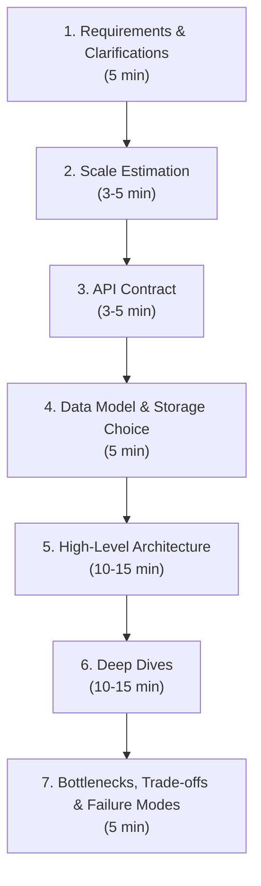
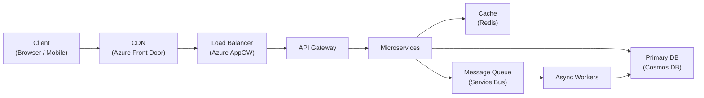

# 1. System Design Interview Framework

> **TL;DR:** A repeatable 7-step process that structures any 45–60 min system design round. The interviewer wants to see structured thinking, proactive trade-off reasoning, and depth — not a "correct" answer.

**Interview weight:** P0 — system design is the single biggest differentiator at Senior/Staff/Tech Lead level; candidates fail most often by jumping to architecture before clarifying requirements.

---

## Core Concepts

- **Functional requirements** — what the system does (user-facing features).
- **Non-functional requirements (NFRs)** — scale, latency, availability, durability, consistency, security.
- **Scale estimation** — rough numbers that drive architecture choices.
- **API contract** — external interface; pins scope and prevents ambiguity drift.
- **Data model** — schema, storage choice, access patterns.
- **High-level architecture** — the boxes-and-arrows diagram every interviewer expects.
- **Deep dives** — the part that separates senior from mid-level: push into internals, failure modes, and trade-offs.

---

## The 7-Step Framework



### Step 1 — Requirements & Clarifications (5 min)

**Why:** Every design decision flows from requirements. Rushing past this is the #1 candidate mistake.

**Functional — ask:**
- Who are the users? What are the core user actions?
- Read-heavy or write-heavy? Read:write ratio?
- Are there priorities (e.g., writes must not be lost; reads can be stale)?
- Any real-time requirements (WebSockets, SSE, polling OK)?
- Mobile, web, or both?

**Non-functional — always cover:**
- Scale: DAU, MAU, peak RPS, data volume per day/year.
- Latency: p99 target for reads? writes?
- Availability: 99.9%, 99.99%, 99.999%?
- Durability: can we lose data? (usually no)
- Consistency: strong vs eventual acceptable?
- Geographic footprint: single region, multi-region, global?
- Compliance/security constraints?

**How to state assumptions out loud:**
> *"I'll assume 50 M DAU, 10:1 read-to-write ratio, p99 read latency under 200 ms, 99.99% availability, single region initially. Let me know if any of those are off."*

Always write your assumptions on the whiteboard/doc before moving on.

---

### Step 2 — Scale Estimation (3–5 min)

- Derive RPS (DAU × avg requests/day ÷ 86,400; ×2–3 for peak).
- Storage per year = records/day × bytes/record × 365 × replication factor.
- Bandwidth = peak RPS × average payload size.
- State how many servers needed (throughput/server ≈ 1–5 K RPS depending on workload).

> See [`04-Back-of-the-Envelope-Estimation.md`](04-Back-of-the-Envelope-Estimation.md) for the full estimation recipe.

---

### Step 3 — API Contract (3–5 min)

- Define 3–5 core endpoints (REST) or RPC methods (gRPC).
- Include request/response shape and key fields.
- Name pagination, auth, and rate-limiting headers.
- Example for a feed system:
  ```
  GET /v1/feed?userId={id}&cursor={cursor}&limit=20
  POST /v1/posts  { authorId, content, mediaUrls[] }
  ```

---

### Step 4 — Data Model & Storage Choice (5 min)

- Sketch the key entities and relationships.
- Pick storage with justification: SQL for ACID + complex queries; NoSQL for scale/flexible schema; blob for large objects; time-series for metrics; search engine for full-text.
- State the partition/shard key explicitly and why.
- Note indexing strategy (primary + secondary indexes).

Storage choice cheat-sheet:

| Need | Storage |
|------|---------|
| ACID transactions, complex joins | Azure SQL / PostgreSQL |
| Massive scale, flexible schema | Cosmos DB (NoSQL) / DynamoDB |
| In-memory cache / leaderboards | Redis / Azure Cache for Redis |
| Blob/media/files | Azure Blob Storage / S3 |
| Event streams | Azure Event Hubs / Kafka |
| Full-text search | Azure AI Search / Elasticsearch |
| Time-series metrics | Azure Monitor / InfluxDB / TimescaleDB |

---

### Step 5 — High-Level Architecture (10–15 min)

Draw the reference architecture. Talk while drawing — narrate data flow.



- Call out every arrow: *"The client calls Front Door for CDN + WAF, which routes to App Gateway, which performs auth and rate limiting..."*
- Use numbered swimlanes for read path vs write path separately.
- Name the Azure service and the OSS/AWS equivalent.

---

### Step 6 — Deep Dives (10–15 min)

The interviewer will pick 1–3 areas to go deep. Be ready to drive or follow. Common deep dives:

| Area | What they want to hear |
|------|------------------------|
| **Caching** | Cache-aside vs write-through, invalidation strategy, stampede protection, Redis cluster vs single-node |
| **Database** | Sharding/partition strategy, hot partitions, consistency level, indexing |
| **Messaging** | At-least-once + idempotency, DLQ, ordering, consumer lag |
| **Availability** | Active-active vs active-passive, health checks, circuit breakers, multi-AZ |
| **Scalability** | Horizontal scaling, stateless services, autoscaling triggers |
| **Security** | Auth/authz, managed identity, secret management |
| **Observability** | Metrics, tracing, alerting, SLO dashboard |

Offer to deep-dive proactively: *"I think the trickiest part here is the fan-out write path for a user with 10 M followers — should I go deeper on that?"*

---

### Step 7 — Bottlenecks, Trade-offs & Failure Modes (5 min)

- **Single points of failure** — which components fail silently? What's the failover path?
- **Hotspots** — hot partitions, celebrity users, traffic spikes.
- **Cost vs performance** — e.g., in-process cache is faster but loses data on restart.
- **Failure scenarios:** *"If the cache goes down, DB load spikes 10×. We mitigate with circuit breaker + load shedding."*
- **Future scaling:** *"With 10× traffic, we'd add read replicas and split the monolith into separate read/write services."*

How to present trade-offs out loud (template):
> *"Option A (X) gives us [benefit] but costs us [downside]. Option B (Y) is simpler but doesn't scale past [limit]. Given the 99.99% SLO and 5 K RPS requirement, I'd choose A because [reason], and mitigate [downside] by [mitigation]."*

---

## Clarifying Questions Bank

```
Scale:
  - How many daily/monthly active users?
  - What's the expected read:write ratio?
  - Any bursty traffic patterns (e.g., game launch, live event)?

Latency/SLA:
  - What p99 latency target for reads? Writes?
  - What availability SLO? (99.9 / 99.99 / 99.999?)
  - What's the RPO and RTO for disaster recovery?

Data:
  - How long must data be retained?
  - Any compliance/GDPR/PII concerns?
  - Strong consistency required or eventual OK?

Features:
  - Prioritize core use cases — which 2-3 matter most?
  - Any existing systems we must integrate with?
  - Mobile app or web or both? Offline capability?
```

---

## Scoring Rubric

| Dimension | Senior SWE answer | Staff/Tech Lead answer |
|-----------|-------------------|----------------------|
| **Requirements** | Covers functional + NFRs | Uncovers hidden constraints; asks about failure modes upfront |
| **Estimation** | Does the math correctly | Derives which numbers actually change the architecture |
| **Architecture** | Draws a coherent diagram | Explains *why* each component, names alternatives and why rejected |
| **Trade-offs** | Acknowledges trade-offs when prompted | Proactively surfaces trade-offs; quantifies them |
| **Failure modes** | Lists failure modes | Has mitigation for each; discusses operational runbook |
| **Deep dives** | Answers the interviewer's deep-dive | Drives the deep dive; anticipates follow-ups |
| **Communication** | Clear explanation | Teaches the interviewer something; adjusts depth to audience |

---

## Common Candidate Mistakes

- **Jumping to architecture without clarifying scale** — your sharding strategy changes entirely at 1 K vs 1 M RPS.
- **Over-engineering from the start** — start simple, evolve; say *"v1 could be a single Postgres instance, then we shard when we hit X."*
- **Treating "exactly-once" as free** — it requires idempotent consumers + dedupe store; say so.
- **Ignoring failure modes** — interviewers at senior level *always* ask "what happens if X goes down."
- **Passive design** — not driving the conversation; waiting for the interviewer to ask questions.
- **No numbers** — vague answers ("it'll scale") instead of concrete estimates.
- **Inconsistent consistency** — choosing strong consistency but designing a system that clearly requires eventual (fan-out writes to 10 M followers in < 1 s is not linearizable).

---

## Interview Questions

**Q1. Walk me through how you approach a system design question.**
A: Requirements (functional + NFRs) → scale estimation → API contract → data model → HLD → deep dives → trade-offs. I always write assumptions explicitly and ask about the SLO upfront because it drives every architectural decision.

**Q2. How do you decide between SQL and NoSQL?**
A: SQL when I need ACID, complex joins, or ad-hoc queries. NoSQL when I need massive horizontal scale, flexible schema, or key-value/document access patterns. The partition/shard key design is the most important NoSQL decision — get it wrong and you get hot partitions that kill performance.

**Q3. What does 99.99% availability actually mean for your design?**
A: 52 minutes downtime/year. Requires active-active multi-AZ at minimum, no single deployment gate that can fail, automated failover < 30 s, and a tested runbook. Every dependency must also be ≥ 99.99% or be treated as unreliable (circuit breaker + fallback).

**Q4. How do you handle a celebrity/hot-key problem in a distributed cache?**
A: Local in-process cache (L1) in front of Redis; read replicas for the hot shard; key sharding by appending a random suffix (fan-out reads); or pre-warming for known events. The right choice depends on the read:write ratio and whether the hot key is static or dynamic.

**Q5. A service is timing out. How do you diagnose it?**
A: Check p99 latency metrics → look at downstream dependency latency (DB, cache, external APIs) → check thread pool saturation / connection pool exhaustion → check GC pauses → check error rates (timeouts hiding as 200s?) → correlate with deployment timestamps.

**Q6. How would you design for 10× traffic growth?**
A: Stateless services behind autoscaling groups; read replicas or read-only Cosmos DB replicas; move expensive fan-out to async workers; add CDN for static/semi-static content; caching layer in front of DB; partition/shard data by access locality; multi-AZ active-active.

**Q7. What is the trade-off between strong and eventual consistency in your News Feed system?**
A: Strong consistency requires synchronous replication — every write waits for acknowledgement from all replicas, adding 10–50 ms latency and reducing write throughput. For a news feed, stale reads are acceptable (showing a post 100 ms late is fine); so we use eventual consistency (Cosmos DB "Session" level on read replicas), get higher throughput, and tolerate lag. If it were a financial ledger, we'd accept the latency penalty for strong consistency.

**Q8. How do you present a "this will fail" scenario in an interview without seeming negative?**
A: Frame it as trade-off ownership: *"One failure mode I want to call out is X. If it happens, Y is the impact. We mitigate with Z, and the residual risk is acceptable because..."* Identifying failure modes proactively signals maturity.

**Q9. When would you choose a message queue over a direct HTTP call?**
A: When the consumer can be slower than the producer (decoupling throughput), when you need durability (message survives consumer restart), when multiple consumers need the same event (fan-out), or when you need retry/DLQ without burdening the caller. HTTP is simpler for synchronous request-reply where latency matters and the caller needs an immediate result.

**Q10. How do you ensure idempotency in a distributed system?**
A: Assign a unique idempotency key to every mutating request. The consumer stores (key → result) in a dedupe store (Redis or DB) with TTL. On retry, detect the duplicate and return the cached result without re-processing. Critical for at-least-once delivery semantics.

**Q11. Design a rate limiter for 10 K RPS across 100 nodes.**
A: Token bucket or sliding window counter stored in Redis (single source of truth). Each node calls `DECR` / `EVAL` Lua script atomically before forwarding the request. Redis cluster with low latency (< 1 ms) keeps overhead acceptable. For very high RPS, use local token bucket per node with periodic sync to Redis (approximate but avoids per-request network hop). DDoS protection at edge (Azure Front Door WAF) before requests hit the app layer.

**Q12. What separates a good system design from a great one at Staff level?**
A: Great designs (a) surface hidden requirements the interviewer didn't mention, (b) quantify trade-offs rather than just naming them, (c) reason about operational concerns (deployability, observability, runbooks), (d) explicitly consider cost, and (e) show evolution: what's the v1 simple design, what triggers the move to v2, what's the headroom at each stage.

**Q13. How do you design for zero-downtime deployments?**
A: Blue-green or canary deployments; backward-compatible schema migrations (expand-contract pattern); feature flags; circuit breakers to shed traffic back to stable version; health-check gates in CI/CD pipeline. We used this approach for the Cosmos DB partition-key migration — traffic cut over gradually with a feature flag, old and new partition keys both readable during the transition window.

---

## Quick Recap

- 7 steps: Requirements → Estimation → API → Data Model → HLD → Deep Dives → Trade-offs.
- Always write assumptions on the board; always ask about SLO and scale first.
- Drive the conversation; don't wait to be asked.
- Trade-off template: *"Option A gives [benefit] but costs [downside]; I choose A because [reason], mitigate [downside] by [mitigation]."*
- Staff level = proactively surfaces failure modes, drives deep dives, reasons about operations and cost.
- Common pitfalls: no requirements, no numbers, no failure modes, passive posture.
- Every component needs a failure scenario and a mitigation.
