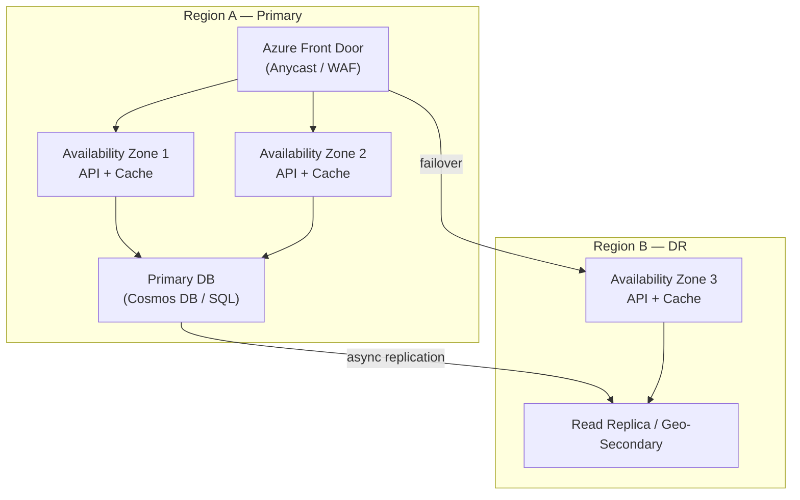

# 2. Scalability, Availability and Reliability

> **TL;DR:** Scalability = handle more load. Availability = stay up. Reliability = produce correct results consistently. All three are in tension with each other and with cost.

**Interview weight:** P0 — every system design question requires you to reason about these three properties with concrete numbers. Directly maps to your 99.99% SLO and 5 K RPS experience.

---

## Core Concepts

- **Scalability** — system capacity grows proportionally with resources added.
- **Availability** — fraction of time the system is operational: `uptime / (uptime + downtime)`.
- **Reliability** — probability of correct operation over time; encompasses availability + correctness.
- **Fault tolerance** — system continues operating despite component failures.
- **Resilience** — ability to recover quickly after a failure.
- **Latency** — time for a single request to complete.
- **Throughput** — requests/operations completed per unit time.

---

## Vertical vs Horizontal Scaling

| Aspect | Vertical (Scale-Up) | Horizontal (Scale-Out) |
|--------|--------------------|-----------------------|
| **Mechanism** | Bigger machine (more CPU, RAM) | More machines |
| **Limit** | Hardware ceiling (~400 vCPUs, ~12 TB RAM on biggest VMs) | Theoretically unlimited |
| **Cost** | Exponential cost curve for top tiers | Linear cost curve |
| **Downtime** | Usually requires restart | Live — add nodes without restart |
| **Complexity** | Low (single node) | Higher (distributed state, coordination) |
| **Failure domain** | One machine = one blast radius | Failures isolated to subset of nodes |
| **Best for** | DB primary node, low-latency stateful workloads | Stateless APIs, read replicas, worker fleets |
| **Azure example** | Cosmos DB serverless → provisioned RU/s, SQL Managed Instance SKU bump | AKS node pool autoscale, VMSS |
| **AWS/GCP equiv** | RDS instance resize, EC2 instance type | ECS / GKE autoscaling |

**Rule of thumb:** Vertical scaling for the stateful data layer (reduces distributed coordination cost). Horizontal scaling for stateless compute (APIs, workers).

---

## Stateless vs Stateful Services

| Aspect | Stateless | Stateful |
|--------|-----------|----------|
| **Definition** | All request state in the request or shared store | Instance holds session/connection/in-memory state |
| **Horizontal scale** | Trivial — any instance handles any request | Requires routing affinity or state migration |
| **Failure recovery** | Drop instance, spin new one | Must restore state or redirect connections |
| **Session handling** | JWT / distributed cache (Redis) | Sticky sessions or server-side session store |
| **Examples** | ASP.NET Core API (no in-process session), Azure Functions | WebSocket servers, stateful game servers, Orleans grains |

**Session handling for stateless services:** Store session in Redis (external state); pass `Authorization: Bearer <JWT>` for stateless auth. Avoid sticky sessions — they create uneven load distribution and complicate rolling deployments.

---

## Scaling Reads vs Writes

| Strategy | For Reads | For Writes |
|----------|-----------|-----------|
| **Caching** | Cache-aside (Redis) — eliminates DB reads for hot data | Write-through — populate cache on write |
| **Replicas** | Read replicas / Cosmos DB read regions | Not applicable directly |
| **Sharding** | Route reads to shard by key | Route writes to correct shard; hot-shard is the problem |
| **CQRS** | Separate read model (optimized queries) | Separate write model (optimized mutations) |
| **CDN** | Static/semi-static content at edge | N/A |
| **Denormalization** | Pre-computed aggregates | Fan-out writes (write to N copies) |

Reads scale more easily because they are idempotent. Write scaling requires coordination (consensus, transactions) which is the hard part.

---

## Latency vs Throughput vs Bandwidth

| Metric | Definition | Concrete Numbers | How to Improve |
|--------|-----------|-----------------|----------------|
| **Latency** | Time for one request end-to-end | Redis GET: 0.5–1 ms; DB indexed read: 1–5 ms; cross-AZ: 2–5 ms; cross-region: 50–150 ms | Caching, co-location, async, read replicas |
| **Throughput** | Requests or bytes per second | Single ASP.NET Core API server: 5–20 K RPS; single Cosmos partition: 10 K RU/s | Horizontal scale, batching, pipelining |
| **Bandwidth** | Max data transfer rate of a link | 10 GbE NIC ≈ 1.25 GB/s; Azure premium storage: 600 MB/s | Compression, CDN offload, chunking |

Latency and throughput are inversely related under load: as throughput approaches capacity, queue depth grows → latency spikes. This is Little's Law.

---

## Tail Latency (p50/p90/p99/p999)

- **p50** — median; 50% of requests are faster than this.
- **p99** — 1 in 100 requests is slower; the number users actually feel.
- **p999** — 1 in 1 000 requests; important for SLO error budget math.

**Why averages lie:** An average of 50 ms could hide a p999 of 10 s. Slow requests come from GC pauses, lock contention, cold starts, or noisy neighbors. Report p99 and p999 in your SLO.

### Tail-Latency Amplification in Fan-Out

If a request fans out to N downstream calls and the caller waits for all:

```
P(response < T) = P(slowest of N calls < T) = p(single < T)^N
```

At p99 per call, 100 parallel calls → p(all return under T) = 0.99^100 = **36.6%**. You have a p63 overall, not p99.

**Mitigations:**
- Hedged requests: send duplicate to second replica after 95th-percentile wait time; take whichever responds first.
- Timeout + partial results: return best-effort answer without slow stragglers.
- Fan-out limit: cap N; paginate or batch.

---

## Little's Law

`L = λ × W`

- **L** = average number of requests in the system (in-flight + queued)
- **λ** = average arrival rate (RPS)
- **W** = average time a request spends in the system (latency in seconds)

**Worked example:** At 5 K RPS with p99 latency 200 ms:
```
L = 5000 × 0.200 = 1000 concurrent in-flight requests
```
If your thread pool has 800 threads, you're already queueing and latency will climb. Either reduce W (faster processing) or scale out to reduce λ per server.

---

## Amdahl's & Universal Scalability Law (brief)

- **Amdahl's Law:** If fraction `p` of a workload is parallelizable, max speedup = `1 / (1 - p)`. A 5% serial section limits speedup to 20× regardless of cores.
- **Universal Scalability Law (USL):** Adds contention (lock wait) and coherency (cross-node sync) penalty terms. Real systems degrade before Amdahl's limit because of coordination overhead. Implication: shared mutable state is the scalability bottleneck; reduce it aggressively (immutable events, sharding, local caches).

---

## Availability Math

### Nines Table

| SLO | Downtime per year | Downtime per month | Downtime per week |
|-----|------------------|--------------------|------------------|
| 99% ("two nines") | 3.65 days | 7.3 hours | 1.68 hours |
| 99.9% ("three nines") | 8.77 hours | 43.8 minutes | 10.1 minutes |
| 99.99% ("four nines") | 52.6 minutes | 4.38 minutes | 1.01 minutes |
| 99.999% ("five nines") | 5.26 minutes | 26 seconds | 6 seconds |

**99.99% = 52 minutes per year.** This means your deployment pipeline, failover time, and recovery procedures must all be under ~5 minutes per incident to stay within budget across ~10 incidents/year.

### Serial vs Parallel Availability

**Serial (components all required):**
```
A_total = A1 × A2 × ... × An
Two services at 99.99% in series: 0.9999 × 0.9999 = 99.98%
```

**Parallel (redundant — any one is sufficient):**
```
A_total = 1 - (1 - A1) × (1 - A2) × ... × (1 - An)
Two services at 99.9% in parallel: 1 - (0.001 × 0.001) = 99.9999%
```

**Design implication:** Every serial dependency degrades your availability. Add redundancy for every critical path component.

---

## SLI vs SLO vs SLA

| Term | Definition | Example |
|------|-----------|---------|
| **SLI** (Indicator) | The actual measured metric | p99 latency of `/feed` endpoint = 145 ms |
| **SLO** (Objective) | Internal target for the SLI | p99 latency ≤ 200 ms, measured over 30-day rolling window |
| **SLA** (Agreement) | External contractual commitment with penalty | "99.99% of requests succeed; violation triggers service credit" |
| **Error budget** | 1 − SLO; how much failure you can afford | 99.99% SLO → 0.01% error budget = 52.6 min/year downtime |

**Error budget usage:** When error budget is burned > 50% in a month, freeze new feature deploys and focus on reliability. This is the practice that prevents SLO erosion.

**How a 99.99% SLO constrains design (your resume):**
- Deployment: blue-green or canary; rollback in < 5 min.
- Dependencies: all must have ≥ 99.99% SLA or be treated as unreliable (circuit breaker + fallback).
- Multi-AZ: single-AZ Azure availability is ~99.95%; multi-AZ (Availability Zones) needed.
- Health checks: aggressive automated failover, no manual steps in critical path.
- Testing: load test to 2× expected peak before each major release.

---

## Fault Tolerance vs High Availability vs Disaster Recovery

| Concept | Scope | Recovery target | Typical RTO/RPO |
|---------|-------|----------------|-----------------|
| **Fault tolerance** | Single system keeps running despite component failure | Zero visible impact | RTO ≈ 0 |
| **High availability** | System recovers quickly from failure | Minimal downtime | RTO < 1 min |
| **Disaster recovery** | Recovery from catastrophic/regional failure | Data and service restored | RTO: minutes–hours; RPO: seconds–minutes |

---

## Redundancy: Active-Active vs Active-Passive

| Aspect | Active-Active | Active-Passive |
|--------|--------------|----------------|
| **Traffic** | Both nodes serve traffic simultaneously | Primary serves all; secondary is standby |
| **Failover time** | Near-zero (traffic rerouted by LB) | Seconds to minutes (standby promoted) |
| **Resource efficiency** | 50% utilization baseline (can absorb 2× load) | Standby wastes resources |
| **Write conflicts** | Must handle (multi-leader replication, CRDTs) | No conflicts (single writer) |
| **Complexity** | High — conflict resolution, consistency | Low — simple primary promotion |
| **Best for** | Read-heavy global systems, gaming | Write-heavy systems, financial ledgers |
| **Azure example** | Cosmos DB multi-region writes, Azure Front Door | SQL Geo-Replication (readable secondary), Service Bus geo-DR |

---

## Resilience Patterns

- **Graceful degradation** — serve degraded (cached/stale/partial) response rather than error. E.g., return cached feed instead of live feed when DB is slow.
- **Load shedding** — reject low-priority requests when system is saturated (HTTP 429 / 503). Protects core functionality.
- **Backpressure** — producer slows down when consumer queue fills. `Channel<T>` with bounded capacity in C#; Kafka consumer lag alerting; Service Bus credit-based flow control.
- **Bulkhead** — isolate resources per tenant/service so one overloaded path doesn't starve others. Separate thread pools, connection pools, or namespaces.

---

## Autoscaling: Reactive vs Predictive

| Type | Trigger | Lag | Best for |
|------|---------|-----|----------|
| **Reactive** | CPU > 70%, RPS > threshold | 2–5 min scale-out lag | Organic traffic growth |
| **Predictive** | Scheduled rules, ML-based forecasting | No lag | Known peaks (game launch, sale events) |

**Scale-out lag is dangerous:** At 5 K RPS, a 3-min scale-out lag during a traffic spike can exhaust thread pools. Mitigate with: pre-warming, minimum instance count > 0, aggressive CPU threshold (60%, not 80%), and queue-depth-based scaling for worker services.

---

## Capacity Planning and Headroom

- Keep peak utilization < 70% CPU/memory to absorb traffic spikes.
- Model seasonal peaks: game launches may be 5–10× baseline.
- Include replication overhead in storage estimates (3× for triple replication).
- Connection pool sizing: `max_connections = threads_per_server × server_count`. Don't exceed DB max connections.
- PgBouncer / connection proxy for databases with connection limits.

---

## Single Points of Failure Checklist

- [ ] Database: single primary with no replica? → Add read replica, enable geo-redundancy.
- [ ] Load balancer: single LB instance? → Use Azure Front Door (global anycast) or multi-AZ.
- [ ] Message broker: single partition or single namespace? → Partition replication, geo-DR.
- [ ] DNS: single resolver? → Azure Traffic Manager / multiple DNS providers.
- [ ] Authentication service: if it's down, can users log in? → Cache validated tokens locally with short TTL.
- [ ] Config service: hardcoded secrets? → Azure Key Vault with MSI; local fallback config.
- [ ] Deployment: single deployment slot? → Blue-green; canary.

---

## Chaos Engineering

- Deliberately inject failures (node kill, network partition, latency injection) to verify resilience in production-like environments.
- Tools: Azure Chaos Studio, Chaos Monkey (Netflix), Gremlin.
- Run experiments with a steady-state hypothesis: *"p99 latency < 300 ms and error rate < 1% during a single-AZ failure."*
- Outcome: uncovers hidden SPOFs; validates runbooks and alerts.
- Start small: kill a single pod, then escalate to AZ-level failures.

---

## Multi-AZ / Multi-Region Deployment



- Front Door provides global anycast + WAF + health-based routing.
- Multi-AZ within a region gives 99.99% availability (Azure SLA for zone-redundant resources).
- Cross-region replication (async) provides DR; async means RPO > 0 — quantify and state the acceptable data loss window.

---

## Interview Questions

**Q1. What is the difference between availability and reliability?**
A: Availability = fraction of time the system is up and reachable. Reliability = whether the system produces correct results consistently. A system can be available but unreliable (serving stale/corrupted data). Both matter; design for reliability first (correctness), then availability (uptime), then scale.

**Q2. How many nines does 99.99% availability give you per year?**
A: 52.6 minutes downtime per year. Translate: each incident must be < ~5 minutes to stay within budget at ~10 incidents/year. This drives RTO targets and means automated failover is non-negotiable.

**Q3. Your system has two services in series, each at 99.9%. What is the total availability?**
A: 0.999 × 0.999 = 99.8%. Each serial dependency degrades total availability. Either increase each service's availability or decouple with async messaging (removes serial dependency on critical path).

**Q4. Explain the difference between SLI, SLO, and SLA.**
A: SLI is the measured metric (actual p99 latency). SLO is the internal target (p99 ≤ 200 ms). SLA is the external contract with penalty. The error budget is 1 – SLO and governs how much risk you can accept in deployments.

**Q5. How does Little's Law apply to your News Feed system?**
A: At 5 K RPS with 200 ms average latency: L = 5000 × 0.2 = 1000 in-flight. If the thread pool is 800, requests queue and latency climbs. Mitigate by caching (reduce W) or scale out (reduce λ per server).

**Q6. Why do averages lie for latency metrics?**
A: A mean of 50 ms can hide a p999 of 10 s caused by GC pauses or slow DB queries. Users who hit the tail experience a broken product. Always monitor and alert on p99/p999; set your SLO on p99.

**Q7. When would you choose active-active over active-passive?**
A: Active-active for read-heavy global systems where you need both zero-failover time and capacity for 2× load. Active-passive when write conflicts are unacceptable (financial ledger) or the system is too complex for conflict resolution. Active-active requires careful consistency design (multi-leader replication, idempotent writes, conflict resolution).

**Q8. Describe how tail-latency amplification works in a fan-out system.**
A: If p99 per call is T, N parallel calls have P(all < T) = 0.99^N. For N=100 fans-out, that's only 37% — effectively p63. Mitigate with hedged requests (duplicate to second replica at 95th-percentile wait), partial results (return what we have), or hard fan-out limits.

**Q9. How do you handle a sudden 5× traffic spike with reactive autoscaling?**
A: Reactive autoscaling has 2–5 min lag. Mitigations: (1) minimum instance count prevents cold start lag; (2) predictive scaling for known events (game launches); (3) queue-based scaling — if workers scale on queue depth, they expand as messages enqueue; (4) load shedding — reject low-priority requests early to protect core flows; (5) cached responses absorb read load even when backend is saturated.

**Q10. What is backpressure and how do you implement it in C#?**
A: Backpressure signals the producer to slow down when the consumer is overwhelmed. In C#: `Channel<T>` with `BoundedChannelOptions` — when the channel is full, `WriteAsync` blocks. For HTTP: return 429 with `Retry-After`. For Service Bus: stop issuing `CompleteAsync` to pause credit and slow message delivery.

**Q11. How would you design a system to achieve 99.999% availability?**
A: Multi-region active-active with automated failover < 30 s; all dependencies have 99.999% SLA or are replicated/cached locally; zero-downtime deploys with canary + instant rollback; chaos engineering in pre-prod; runbook automation (no manual steps in failover path); error budget policy that halts deploys when budget is 50% consumed. Cost scales significantly — justify with business impact.

**Q12. Explain Amdahl's Law and why it matters for distributed system design.**
A: The serial (non-parallelizable) fraction of a workload is the hard cap on speedup: with 10% serial work, max speedup is 10× regardless of nodes. In practice, USL adds contention and coherency overhead — shared locks and cache invalidation traffic degrade performance before Amdahl's limit. Design implication: minimize shared mutable state; use immutable events and local caches; prefer sharding over global locks.

**Q13. What is chaos engineering and why does it matter for 99.99% SLO?**
A: Chaos engineering deliberately injects failures (kill a pod, drop a network link, inject 500 ms latency) to verify that your system's resilience mechanisms actually work. Without it, you discover SPOFs in production during incidents. For a 99.99% SLO, you have 52 min/year budget — an undiscovered SPOF can burn the entire budget in a single incident.

---

## Quick Recap

- Vertical scales one machine; horizontal scales many — use vertical for stateful, horizontal for stateless.
- 99.99% = 52.6 min/year downtime; multi-AZ + automated failover + blue-green deploys required.
- Serial availability compounds (multiplies); parallel availability compounds toward 1.
- SLI = metric, SLO = target, SLA = contract; error budget = 1 – SLO.
- Little's Law: L = λ × W — size thread/connection pools to in-flight concurrency.
- Fan-out amplifies tail latency: 100 calls at p99 → p37 overall; use hedged requests.
- Autoscaling lag: pre-warm, min instances, predictive rules for known events.
