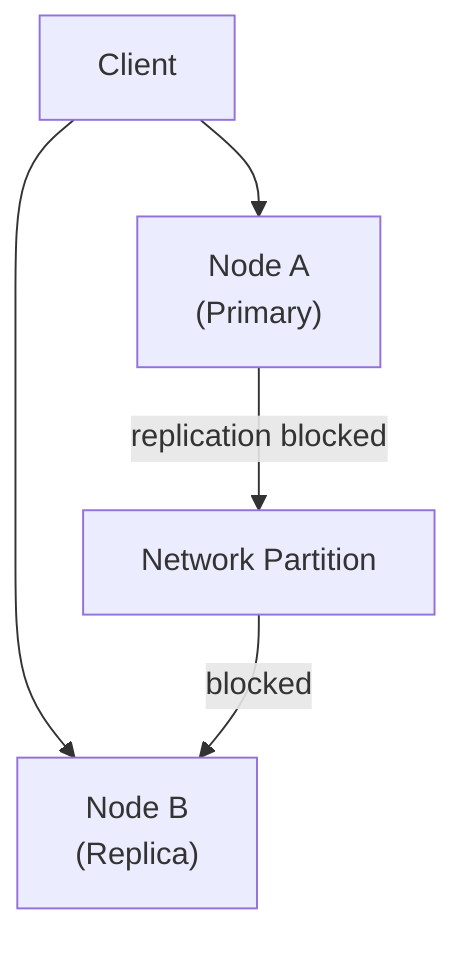
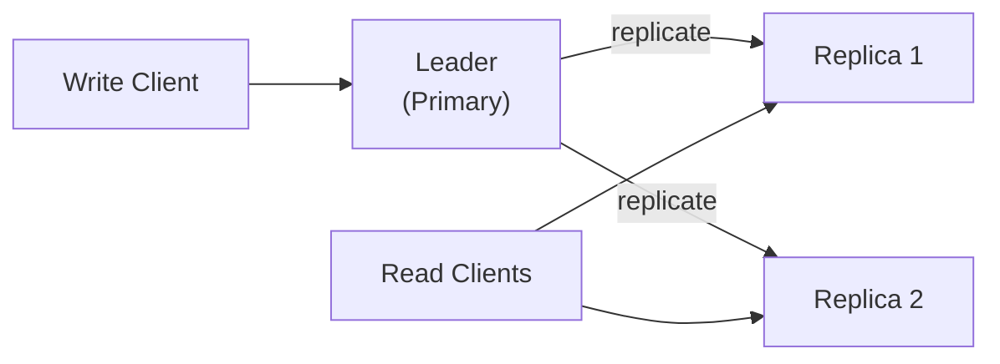
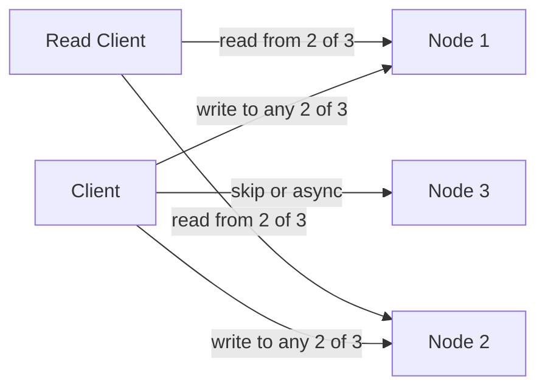

# 3. CAP, Consistency Models and Replication

> **TL;DR:** CAP proves that on a network partition you must choose consistency or availability. PACELC extends this to the no-partition case. Understanding the consistency spectrum lets you pick the right trade-off for each system — critical for Cosmos DB level selection.

**Interview weight:** P0 — every distributed DB question leads here. Directly maps to Cosmos DB consistency levels, Service Bus ordering, and the Redis/DB consistency trade-offs in your News Feed.

---

## Core Concepts

- **Consistency (CAP)** — every read receives the most-recent write or an error.
- **Availability (CAP)** — every request receives a non-error response (may not be the latest data).
- **Partition tolerance** — system continues despite network partitions (message loss/delay between nodes).
- **Partition** — a network split where some nodes cannot communicate with others.
- **Replication** — copying data to multiple nodes for durability and scale.
- **Consensus** — agreement among distributed nodes on a single value (leader, committed log entry).

---

## CAP Theorem — Precise Statement

> In a distributed system, you can only guarantee **two** of: Consistency, Availability, Partition-tolerance — during a network partition.

**Why "CA" is not a real choice:** Partition tolerance is *not optional* — real networks drop packets. All distributed systems must handle partitions. The real choice is **CP vs AP during a partition**.

- **CP (Consistency + Partition-tolerance):** On partition, system rejects reads/writes rather than serve stale data. Example: Zookeeper, HBase, Cosmos DB Strong, etcd.
- **AP (Availability + Partition-tolerance):** On partition, system continues serving possibly stale data. Example: Cassandra, CouchDB, Cosmos DB Eventual/Session, DynamoDB (eventually consistent).

### Partition Scenario



During partition: CP system → N2 returns error or stale-data rejection. AP system → N2 serves last known value.

---

## PACELC

Extends CAP to the no-partition case (most of the time):

> During **P**artition: choose **A**vailability vs **C**onsistency.
> **E**lse (no partition): choose **L**atency vs **C**onsistency.

| System | During Partition | No Partition |
|--------|-----------------|-------------|
| DynamoDB | AP | EL (low latency, eventual) |
| Cosmos DB Strong | CP | EC (strong, higher latency) |
| Cosmos DB Session | AP | EL |
| Cassandra | AP | EL |
| Spanner / TrueTime | CP | EC |
| Zookeeper | CP | EC |

---

## Consistency Model Spectrum

From strongest to weakest:

| Model | Definition | Latency Cost | Example System |
|-------|-----------|-------------|----------------|
| **Linearizability** | Reads/writes appear as if executed on a single node in real-time order | Highest — cross-node sync | etcd, Zookeeper, Cosmos DB Strong, Spanner |
| **Sequential consistency** | All nodes see operations in the same order (not necessarily real-time) | High | Early DB systems |
| **Causal consistency** | Operations that causally depend on each other are seen in order by all nodes | Medium | Cosmos DB Consistent Prefix + causality tracking, MongoDB causal sessions |
| **Read-your-writes** | A client always reads its own writes | Low | Cosmos DB Session (within a session token), most SQL primaries |
| **Monotonic reads** | A client never reads older data after reading newer data | Low | Sticky-session routing to same replica |
| **Monotonic writes** | Writes from a client are serialized in order | Low | Single-leader replication per client |
| **Consistent prefix** | Reads see a prefix of the write log — no causality violations | Low | Cosmos DB Consistent Prefix |
| **Eventual consistency** | All replicas converge given no new writes — no ordering guarantee | Lowest | Cosmos DB Eventual, Cassandra, DynamoDB default |
| **Bounded staleness** | Reads lag primary by at most K writes or T time | Configurable | Cosmos DB Bounded Staleness |

---

## Replication Patterns

### Single-Leader (Master-Replica)



- All writes go to leader; replicated to followers.
- Reads can go to replicas (eventually consistent) or leader (consistent).
- Failover: replica promoted to leader on primary failure.
- **Replication lag** = time for write to appear on replica; typically 10–200 ms async.

### Multi-Leader (Multi-Master)

- Multiple nodes accept writes; each replicates to others.
- Use case: multi-datacenter active-active writes (Cosmos DB multi-region writes), offline-capable clients (CouchDB).
- Challenge: write conflicts — requires conflict resolution (LWW, CRDTs, application merge).

### Leaderless (Dynamo-style)



- Client writes to W nodes; reads from R nodes. No leader.
- Quorum: W + R > N guarantees at least one node has the latest write.

### Replication Comparison

| Aspect | Single-Leader | Multi-Leader | Leaderless |
|--------|--------------|-------------|-----------|
| **Write scalability** | Limited to leader throughput | High (write to any node) | High |
| **Conflict handling** | No conflicts (single writer) | Required | Required |
| **Failover complexity** | Leader promotion process | Automatic (write anywhere) | Automatic |
| **Read scalability** | Read replicas | Read any node | Read any R nodes |
| **Best for** | OLTP, financial systems | Multi-DC writes, offline | Cassandra, Dynamo-style |
| **Azure example** | Cosmos DB (leader region) | Cosmos DB multi-write regions | Cosmos DB Eventual (conceptually) |

---

## Sync vs Async vs Semi-Sync Replication

| Type | How it works | Durability | Latency impact | Use case |
|------|-------------|------------|---------------|----------|
| **Synchronous** | Leader waits for replica ACK before confirming write | Highest — no data loss on failover | High (adds replica RTT) | Financial ledgers, 0 RPO |
| **Asynchronous** | Leader confirms immediately; replicas catch up | Eventual — may lose recent writes on failover | Lowest | Read replicas, most OLTP |
| **Semi-synchronous** | Leader waits for at least one replica; rest async | Good balance | Medium | MySQL semi-sync, Cosmos DB bounded staleness |

---

## Replication Lag Anomalies and Fixes

| Anomaly | What happens | Fix |
|---------|-------------|-----|
| **Read-your-own-writes** | Write to primary, read from replica, see old value | Route reads to primary after a write; use `Session` consistency; pass session token |
| **Monotonic reads** | First read returns v2; second read (different replica) returns v1 | Sticky read to same replica; use `Consistent Prefix` or `Session` |
| **Causal violation** | See a reply before the original post | Causal consistency or read from primary for causally-linked reads |

---

## Quorums (W + R > N)

With N replicas, write quorum W, read quorum R:

- **W + R > N** guarantees overlap — at least one node in read set has the latest write.
- Classic: N=3, W=2, R=2 → always overlap by 1.
- **Availability trade-off:** Higher W = more durable but slower writes; higher R = more consistent reads but slower reads.
- **Weak quorums** (W + R ≤ N) → eventual consistency but lower latency.

Worked example (Cassandra):
```
N=5, W=3, R=3: W+R=6 > 5 → consistent reads
N=5, W=1, R=1: W+R=2 < 5 → eventual, fast
```

---

## Conflict Resolution

| Strategy | How it works | Pros | Cons | Use case |
|----------|-------------|------|------|----------|
| **LWW (Last-Write-Wins)** | Timestamp wins; older write discarded | Simple | Silent data loss; clock skew risk | Cassandra default, Cosmos DB default multi-write |
| **Vector Clocks** | Per-node logical counter tracks causality; conflicts surfaced to app | No silent data loss | Complex; must expose conflict to app | Riak, Dynamo |
| **Version Vectors** | Variant of vector clocks; tracks per-actor versions | Precise conflict detection | Storage overhead | Riak |
| **CRDTs** | Data structures designed to merge deterministically (G-Counter, OR-Set) | Auto-merge without conflict | Limited to CRDT-friendly data types | Redis CRDT, shopping carts, counters |
| **Application merge** | App defines merge logic in conflict handler | Flexible | Complex; requires developer discipline | CouchDB, custom systems |

---

## Consensus Algorithms

### Comparison

| Aspect | Paxos | Raft | ZAB (Zookeeper) |
|--------|-------|------|-----------------|
| **Designed for** | General consensus | Understandability, log replication | Zookeeper's ordered broadcast |
| **Leader** | Any acceptor can propose (multi-Paxos: stable leader) | Explicit elected leader | Explicit leader (ZooKeeper) |
| **Log replication** | Phases of Promise/Accept | Leader appends; replicates; commits on quorum ACK | Leader broadcasts; followers ACK; commit in order |
| **Leader election** | Randomized timeouts (Multi-Paxos) | Randomized election timeout | Fast leader election (FLE) algorithm |
| **Why odd nodes?** | Quorum = ⌊N/2⌋ + 1; even N gives same fault tolerance as N-1 | Same quorum math | Same |
| **Split-brain prevention** | Fencing tokens / lease expiry | Term numbers — older leader's writes rejected | Epoch numbers |
| **Production use** | Google Chubby, Spanner | etcd (Kubernetes), CockroachDB, Kafka KRaft | Apache Zookeeper |

### Leader Election in Raft

1. Follower timeout → becomes Candidate; increments term; votes for self.
2. Candidate sends `RequestVote` to all peers with its term and last log index.
3. Peers vote for first candidate with term ≥ their term and log as up-to-date.
4. Candidate with quorum votes → becomes Leader.
5. Leader sends periodic heartbeats to prevent new elections.

### Split-Brain and Fencing Tokens

- **Split-brain:** Two nodes both believe they are the leader (e.g., after partial partition heals). Can cause double-writes.
- **Fencing token:** A monotonically increasing token issued by the lock/lease service. Storage layer rejects writes with an older token. Raft term numbers serve this role internally.

---

## Two-Phase Commit vs Saga

| Aspect | 2PC | Saga |
|--------|-----|------|
| **Model** | Distributed transaction across all participants | Sequence of local transactions with compensating actions |
| **Coordinator** | Single coordinator (SPOF) | Choreography (events) or orchestrator |
| **Consistency** | ACID across all nodes | Eventual consistency |
| **Failure handling** | Coordinator failure blocks all participants | Compensating transactions roll back completed steps |
| **Performance** | Slow — 2 round trips, holds locks | Fast — async, no distributed locks |
| **Best for** | Financial transactions requiring atomicity | Long-running business processes, microservices |
| **Azure example** | SQL Server distributed transactions (avoid) | Service Bus choreography sagas, Azure Durable Functions orchestrator |
| **AWS equivalent** | — | AWS Step Functions |

---

## Clocks in Distributed Systems

| Clock Type | What it measures | Accuracy | Use case |
|-----------|-----------------|---------|---------|
| **NTP (wall clock)** | Real time, synced over network | ±1–50 ms drift; can go backwards | Timestamps, expiry TTLs |
| **Logical clock (Lamport)** | Causal ordering of events | Not real time; captures happens-before | Ordering events, detecting causality |
| **Vector clock** | Causal relationship between events on N nodes | N-dimensional; captures concurrent vs causal | Conflict detection in multi-leader |
| **TrueTime (Spanner)** | Wall time with bounded uncertainty interval [earliest, latest] | ±7 ms | External consistency (globally linearizable) |

**Lamport timestamps:** Each node increments its counter on each event. On send, include counter. On receive, `counter = max(local, received) + 1`. Establishes total order; does not capture causality between unrelated events.

---

## Cosmos DB Consistency Levels

| Level | CAP choice | Latency | Description |
|-------|-----------|---------|-------------|
| **Strong** | CP | Highest | Linearizable; reads always latest committed write |
| **Bounded Staleness** | CP-ish | High | Reads lag by at most K versions or T seconds |
| **Session** | AP | Medium | Read-your-writes + monotonic reads within a session token; default |
| **Consistent Prefix** | AP | Low | Reads see a causally consistent prefix; no out-of-order reads |
| **Eventual** | AP | Lowest | No ordering guarantee; maximum throughput and geo-distribution |

**Session consistency** is the default and usually right for web/gaming: read-your-writes within a user session, but cross-session reads can be stale. Strong consistency doubles the request charge and adds replication-round-trip latency.

> See [`../04-Databases/07-Cosmos-DB-Deep-Dive.md`](../04-Databases/07-Cosmos-DB-Deep-Dive.md) for Cosmos DB partition design, RU/s modeling, and migration patterns.

---

## Interview Questions

**Q1. What is the CAP theorem?**
A: In a distributed system, during a network partition you can guarantee either consistency (every read sees the latest write or errors) or availability (every request gets a non-error response), but not both. Partition tolerance is not optional — real networks partition. The real choice is CP vs AP.

**Q2. Why can't you choose CA in a distributed system?**
A: CA assumes the network never partitions — impossible in practice (data centers fail, cables are cut). Every distributed system must handle partitions, so you're always choosing between CP and AP during a partition event.

**Q3. What is PACELC and why is it a more practical model than CAP?**
A: PACELC extends CAP: during a Partition (P), choose Availability (A) vs Consistency (C). Else (E), choose Latency (L) vs Consistency (C). Most of the time there's no partition, so the L/C trade-off in normal operation matters more day-to-day. Cassandra is EL (low latency, eventual); Spanner is EC (strong, higher latency).

**Q4. Which Cosmos DB consistency level would you use for a game leaderboard? For a payment record?**
A: Leaderboard: Session or Consistent Prefix — stale reads are acceptable; latency and cost matter. Payment record: Strong — linearizability required; no stale reads allowed; pay the latency/cost premium.

**Q5. Explain the difference between eventual consistency and session consistency.**
A: Eventual: no ordering guarantee; replicas converge eventually; any read may return any version. Session: within a session token, read-your-writes + monotonic reads guaranteed. Cross-session reads are still eventually consistent. Session is the Cosmos DB default — balances correctness for a user's own operations with throughput.

**Q6. What is quorum-based replication? Give a worked example.**
A: N replicas, W write quorum, R read quorum. W+R>N guarantees any read set overlaps any write set by ≥1 node. Example: N=3, W=2, R=2 → overlap = 1 (guaranteed latest read). To maximize write availability: W=1, R=3. To maximize read availability: W=3, R=1. Adjust per workload.

**Q7. How does Raft prevent split-brain?**
A: Term numbers act as fencing tokens. Each election increments the term. A leader with a lower term number than an incoming message knows a new leader has been elected and steps down. Quorum requirement (⌊N/2⌋ + 1 votes) means only one leader can win per term. Storage rejects writes from an old leader term.

**Q8. Why use an odd number of nodes in a Raft/ZAB cluster?**
A: Quorum = ⌊N/2⌋ + 1. With N=4, quorum = 3 — same as N=3 but you're paying for an extra node with no additional fault tolerance. N=5 tolerates 2 failures (quorum=3); N=4 also only tolerates 1 (quorum=3). Odd number maximizes fault tolerance per node count.

**Q9. What is a vector clock and when would you use it over LWW?**
A: A vector clock is a per-node logical counter array that captures happens-before relationships. When two events have non-comparable vector clocks, they are concurrent conflicts — surfaced to the application for resolution. Use instead of LWW when silent data loss is unacceptable (e.g., collaborative editing, shopping cart). LWW is simpler but discards one write silently.

**Q10. Compare two-phase commit and saga for cross-service transactions.**
A: 2PC is synchronous ACID across all nodes but has a coordinator SPOF and holds locks during prepare. Saga splits the transaction into local steps with compensating actions on failure — eventual consistency, no distributed locks, naturally fits microservices. Use saga for long-running business processes (order fulfillment); use 2PC only when strict atomicity is unavoidable and all participants are reliable.

**Q11. Why is Lamport timestamp insufficient for conflict detection?**
A: Lamport timestamps establish a total order of events but cannot determine if two events are causally related or concurrent. If event A and event B have no causal relationship, a Lamport timestamp only tells you which has a higher counter — not whether one caused the other. Vector clocks are needed to distinguish concurrent from causally-ordered events.

**Q12. How did you choose Cosmos DB consistency levels in your News Feed system?**
A: Used Session consistency as the default — read-your-writes within a user session (a user sees their own post immediately), while cross-user reads can be eventually consistent (seeing a post 200 ms late is fine). Used Strong consistency only for idempotency dedupe checks (can't have duplicate posts). Strong consistency in those paths doubled the RU charge but affected < 1% of requests.

---

## Quick Recap

- CAP: partition is not optional; choose CP (reject on partition) or AP (serve stale on partition).
- PACELC extends to no-partition: also choose latency vs consistency in normal operation.
- Consistency levels weakest→strongest: Eventual → Consistent Prefix → Session → Bounded Staleness → Strong.
- Replication: single-leader (no conflicts), multi-leader (conflict resolution required), leaderless (quorum W+R>N).
- Quorum: W+R>N guarantees consistent reads; tune W/R per workload.
- Raft/Paxos: odd node counts; term numbers prevent split-brain.
- LWW = simple but lossy; vector clocks = surfaced conflicts; CRDTs = auto-merge for specific data types.
- 2PC = ACID but blocking; Saga = eventual but async and resilient.
