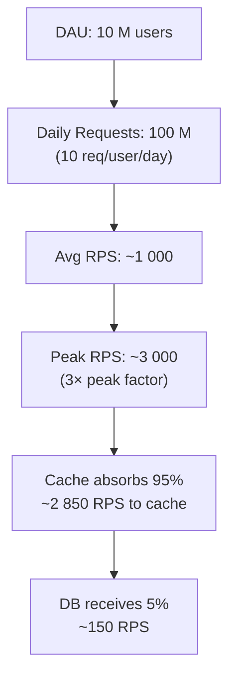

# 4. Back-of-the-Envelope Estimation

> **TL;DR:** Estimation converts vague scale requirements into concrete architecture decisions. Do the math on the whiteboard, narrate every step, and let the numbers drive your choices.

**Interview weight:** P0 — interviewers expect you to produce numbers in < 5 minutes and use them to justify architecture decisions. Guessing "we'll need a lot of servers" without math is a red flag at senior level.

---

## Core Concepts

- **The goal:** produce numbers accurate to within 1 order of magnitude; don't chase false precision.
- **Recipe:** DAU → daily requests → RPS → peak RPS → storage/day → storage/year → bandwidth.
- **Key insight:** estimation errors that change the architecture (e.g., 1 server vs 100 servers) matter; errors that don't (e.g., 80 vs 120 servers) don't.

---

## Powers of Two and Data Sizes

| Unit | Value | Quick reference |
|------|-------|----------------|
| 1 Byte | 8 bits | 1 char (ASCII) |
| 1 KB | 10^3 bytes ≈ 2^10 | Small JSON object |
| 1 MB | 10^6 bytes ≈ 2^20 | Short video clip thumbnail; large JSON blob |
| 1 GB | 10^9 bytes ≈ 2^30 | 30 min HD video; 1 M small records |
| 1 TB | 10^12 bytes ≈ 2^40 | ~1000 HD movies; large DB |
| 1 PB | 10^15 bytes ≈ 2^50 | Hyperscale analytics; video platforms |
| 1 million | 10^6 | — |
| 1 billion | 10^9 | — |
| Seconds/day | 86,400 ≈ 10^5 | Use 100 K for quick math |

---

## Latency Numbers Every Programmer Should Know

| Operation | Latency | Notes |
|-----------|---------|-------|
| L1 cache reference | 0.5 ns | — |
| L2 cache reference | 7 ns | 14× L1 |
| RAM read | 100 ns | 200× L1 |
| SSD random read | 150 µs (0.15 ms) | Flash NAND; Azure Premium SSD |
| HDD seek | 10 ms | Spinning disk; avoid in hot paths |
| Redis GET (same DC) | 0.5–1 ms | Network + in-memory lookup |
| DB indexed read (same DC) | 1–5 ms | PostgreSQL / SQL Server; in-memory buffer pool hit |
| DB read (cold, full scan row) | 10–50 ms | Disk involved |
| Network round-trip (same DC / AZ) | 0.5–2 ms | — |
| Network round-trip (cross-AZ) | 2–5 ms | Same Azure region |
| Network round-trip (cross-region) | 50–150 ms | E.g., East US → West Europe |
| Cosmos DB read (Session, same region) | 2–10 ms | — |
| Cosmos DB write (Session, single region) | 5–15 ms | — |
| HTTP call (same DC, small payload) | 1–5 ms | — |

---

## QPS Math: DAU → RPS → Peak RPS

```
Daily RPS   = (DAU × avg_requests_per_user_per_day) / 86,400
Peak factor = 2–3× (typical); 5–10× for event spikes
Peak RPS    = Daily RPS × peak_factor
```

**Quick rules:**
- 1 M DAU × 10 requests/day ÷ 100 K s/day = **100 RPS average**
- 10 M DAU × 10 req/day ÷ 100 K s/day = **1 000 RPS average** → ~3 000 RPS peak
- 100 M DAU × 10 req/day ÷ 100 K s/day = **10 000 RPS average** → ~30 000 RPS peak

---

## Storage Math

```
Storage/day  = records_per_day × bytes_per_record
Storage/year = storage_per_day × 365
With replication (3×): × 3
With index overhead: × 1.5
```

---

## Bandwidth Math

```
Ingress bandwidth = write_RPS × avg_payload_bytes
Egress bandwidth  = read_RPS × avg_response_bytes
```

---

## Cache Sizing (80/20 Rule)

- 20% of content drives 80% of reads → cache that 20%.
- Cache size = `0.2 × total_content_size` as a baseline.
- **Hit ratio impact on DB load:**

| Cache Hit Ratio | % of reads hitting DB |
|-----------------|----------------------|
| 80% | 20% |
| 90% | 10% |
| 95% | 5% |
| 99% | 1% |

At 99% hit ratio and 5 K RPS reads, DB sees only 50 RPS — enormous relief. A 5% drop in hit ratio (94% → 89%) doubles DB load from 5% to 11%.

**Redis memory sizing:** Each entry ≈ key size + value size + 50 bytes overhead. For 10 M cached objects averaging 200 bytes each: `10 M × 250 bytes = 2.5 GB`. Add 30% headroom → **~3.5 GB Redis cluster**.

---

## Memory, Connection, and Thread Budgets per Server

| Resource | Typical limit | Notes |
|----------|--------------|-------|
| RAM per server | 4–64 GB (common) | D4s_v3 = 16 GB; D8s_v3 = 32 GB |
| Thread pool (ASP.NET Core) | ~200–500 threads | Set via `ThreadPool.SetMinThreads`; async reduces need |
| TCP connections per server | ~65 K ports | Outbound; use connection pooling |
| DB connections per pool | 100–300 | Postgres default max = 100; use PgBouncer |
| Redis connections | 10–50 per pod | StackExchange.Redis uses multiplexed connection |
| RPS per ASP.NET Core server | 5–20 K | Depends on compute per request |

---

## How Many Servers Do I Need?

```
servers = ceil(peak_RPS / RPS_per_server)
```

With 70% utilization target (headroom):
```
servers = ceil(peak_RPS / (RPS_per_server × 0.7))
```

**Example:** 10 K peak RPS, 5 K RPS/server (moderate compute):
```
servers = ceil(10000 / (5000 × 0.7)) = ceil(2.86) = 3 servers minimum
```
With multi-AZ (3 zones), at least 1 per zone + spare = **6 servers**.

---

## Cost Estimation (Rough Azure Unit Costs)

| Resource | Approx monthly cost |
|----------|---------------------|
| D4s_v3 VM (4 vCPU, 16 GB) | ~$140 |
| Azure Cache for Redis C1 (1 GB) | ~$55 |
| Azure Cache for Redis P1 (6 GB) | ~$200 |
| Cosmos DB 100 RU/s (serverless est.) | ~$0.25/M RU |
| Cosmos DB 1000 RU/s provisioned | ~$58 |
| Azure Blob Storage 1 TB | ~$18 |
| Azure Service Bus Standard | ~$0.05/M operations |
| Azure Front Door | ~$35 base + bandwidth |
| AKS (control plane) | Free; pay for nodes |

Use these for order-of-magnitude cost justification, not billing.

---

## Traffic Funnel Diagram



---

## Estimation Worksheet

| Parameter | Formula | Your value |
|-----------|---------|-----------|
| DAU | given | |
| Requests/user/day | estimate by feature | |
| Daily total requests | DAU × req/user/day | |
| Average RPS | daily / 86 400 | |
| Peak RPS | avg × peak factor (2–3×) | |
| Write RPS | peak × write fraction | |
| Read RPS | peak × read fraction | |
| Bytes per record | estimate fields | |
| Records per day | write RPS × 86 400 | |
| Storage per day | records × bytes | |
| Storage per year | per_day × 365 | |
| Replicated storage | × replication factor | |
| Ingress bandwidth | write RPS × payload | |
| Egress bandwidth | read RPS × response | |
| Cache size | 20% of hot content | |
| Servers needed | peak RPS / RPS_per_server / 0.7 | |

---

## Worked Example 1 — Twitter-like Feed

**Given:** 100 M DAU, 5 reads/user/day, 1 write/user/day, ~300 bytes/tweet.

```
Read RPS avg   = 100M × 5 / 86400 ≈ 5 800 RPS → peak ~17 000 RPS
Write RPS avg  = 100M × 1 / 86400 ≈ 1 160 RPS → peak ~3 500 RPS

Tweets/day     = 1 160 RPS × 86400 ≈ 100 M tweets/day
Storage/day    = 100 M × 300 B = 30 GB/day
Storage/year   = 30 × 365 ≈ 11 TB × 3 (replication) = 33 TB/year

Fan-out writes: avg follower count 200 → 200 write ops/tweet
Fan-out RPS    = 1 160 × 200 = 232 000 write RPS → need async queue + worker pool
```

**Architecture implication:** Fan-out at write time for users with < 1 000 followers; fan-out at read time (pull model) for celebrities (10 M+ followers). Hybrid fan-out is the industry standard.

---

## Worked Example 2 — Video Streaming Service

**Given:** 10 M DAU, 1 video watched/day avg, avg video = 500 MB (720p, 60 min), peak concurrent viewers 5 M.

```
Egress bandwidth = 5 M viewers × 1 Mbps (adaptive bitrate floor) = 5 Tbps
Storage new/day  = 500 K uploads/day × 500 MB = 250 TB/day raw
  + transcoding to 3 qualities (360p/720p/1080p) = ~750 TB/day
  + replicated × 3 = ~2.25 PB/day delta

DB: video metadata only → 10 M videos × 1 KB = 10 GB, trivial
Hot content cache: top 0.1% of videos = 10 000 videos × 500 MB = 5 TB CDN
```

**Architecture implication:** CDN is not optional — 5 Tbps egress from origin is impossible; CDN absorbs 95%+. Blob storage (Azure Blob + tiering to cool/archive) for raw video. Async transcoding workers on Service Bus queue. Separate metadata service (lightweight) from media service.

---

## Worked Example 3 — 5 000 RPS REST API, 99.99% SLO

*Directly maps to your News Feed system.*

**Given:** 7 M DAU, 5 K RPS peak, 99.99% SLO, p99 latency ≤ 200 ms.

```
Peak RPS       = 5 000
Write fraction = 10% → 500 write RPS
Read fraction  = 90% → 4 500 read RPS

Servers        = ceil(5 000 / (10 000 × 0.7)) = 1 server mathematically
  But 99.99% SLO + multi-AZ → min 2 AZs × 2 servers = 4 servers minimum
  With headroom for rolling deploy: 6 servers

Cache (Redis):
  Hit ratio target: 95% → DB sees 225 RPS (manageable)
  Cache size: 7 M users × 1 active session (500 B) + top 1% content = ~3.5 GB + 10 GB = ~15 GB Redis cluster

Cosmos DB:
  225 reads × 5 RU = 1 125 RU/s reads
  500 writes × 10 RU = 5 000 RU/s writes
  Total ≈ 6 125 RU/s provisioned → round up to 7 500 RU/s
  With 3× replication factor: cost × 3 for writes, reads cheap from local replica

Storage:
  Feed events: 500 writes/s × 500 B × 86400 × 365 × 3 = ~21 TB/year
  (Fits comfortably in Cosmos DB or Azure SQL with partitioning by userId)

Bandwidth:
  Ingress: 500 × 1 KB = 500 KB/s (trivial)
  Egress: 4 500 × 5 KB = 22.5 MB/s = ~180 Gbps/year (negligible for a CDN-fronted API)
```

**SLO constraint:** 99.99% → multi-AZ, blue-green deploy (< 5 min rollback), all dependencies ≥ 99.99% or circuit-broken.

---

## Interview Questions

**Q1. How do you estimate RPS from DAU?**
A: `avg RPS = DAU × requests_per_user_per_day / 86 400`. Peak RPS = avg × 2–3× for normal traffic, up to 10× for spikes. Always separate read and write RPS.

**Q2. How much storage does a Twitter-like system need per year?**
A: ~100 M tweets/day × 300 bytes × 365 × 3 (replication) ≈ 33 TB/year for tweet text. Add media separately (orders of magnitude larger). DB tier handles text; blob storage handles media.

**Q3. How does cache hit ratio affect DB load?**
A: Dramatically. At 4 500 read RPS and 95% cache hit rate, DB sees only 225 RPS. A drop to 90% doubles DB load to 450 RPS. A cache stampede (all cache entries expire simultaneously) can spike DB to full 4 500 RPS — use jittered TTLs.

**Q4. How many servers do you need for 5 K RPS?**
A: At 10 K RPS/server and 70% utilization target: ceil(5000 / 7000) = 1. But 99.99% SLO requires multi-AZ redundancy: at minimum 2 AZs × 2 servers = 4. Add rolling deploy capacity and monitoring/admin instances → 6 servers is a reasonable starting point.

**Q5. Estimate Cosmos DB RU/s for your News Feed system.**
A: 500 write RPS × 10 RU/write + 225 uncached read RPS × 5 RU/read ≈ 6 100 RU/s. Round up to 7 500 for headroom. With single-region Cosmos, cost ≈ 7 500 RU/s × $0.008/100 RU/hr × 720 hr/month ≈ $430/month.

**Q6. What is the egress bandwidth for a video platform with 5 M concurrent viewers?**
A: 5 M × 1 Mbps (360p adaptive) = 5 Tbps minimum. This is physically impossible from a single origin; CDN is mandatory. CDN PoPs collectively provide this bandwidth; origin serves only cache misses (~5% of requests).

**Q7. How much memory does Redis need to cache 10 M sessions at 500 bytes each?**
A: 10 M × (500 + 50 overhead) = 5.5 GB. Add 30% headroom → ~7 GB. Azure Cache for Redis P2 (13 GB) is appropriate. Use Redis Cluster for scaling beyond single shard.

**Q8. Why is the fan-out write problem critical for a feed system at Twitter scale?**
A: At 1 160 write RPS with average 200 followers, fan-out generates 232 000 write RPS to the feed store. At 10 K write RPS (celebrity with 10 M followers) fan-out alone = 100 B writes/tweet — impossible synchronously. Solution: async fan-out workers via Service Bus; or fan-out at read time for high-follower accounts (hybrid model).

**Q9. How do you estimate the number of DB connections needed?**
A: connections_needed = servers × threads_per_server × DB_connection_fraction. At 6 API servers × 200 threads × 30% hitting DB = 360 connections. Postgres default max is 100 — use PgBouncer (connection proxy) or Cosmos DB (HTTP-based, no persistent connections).

**Q10. How do latency numbers inform architecture choices?**
A: Redis GET at 1 ms vs DB read at 5 ms → for 5 K read RPS, uncached latency would be ~5 ms; cached is 1 ms. Cross-region calls at 100 ms make synchronous fan-out to a remote region impossible in a 200 ms p99 budget. These numbers justify: local caching, async fan-out, CDN for static content, region co-location of services and their data.

---

## Quick Recap

- Daily RPS = DAU × req/user/day ÷ 86 400; peak = avg × 2–3×.
- Latency anchors: Redis 1 ms, DB 5 ms, cross-region 100 ms, SSD 0.15 ms.
- Storage = write RPS × 86 400 × bytes × 365 × replication factor.
- Cache the top 20% of content → achieves 80%+ hit rate; 95%+ hit rate = 20× DB load reduction.
- Servers = peak RPS ÷ (RPS/server × 0.7); min 4 for 99.99% SLO multi-AZ.
- Fan-out math catches scale surprises early (232 K write RPS from naive fan-out).
- Always narrate units and round to 1 significant figure.
