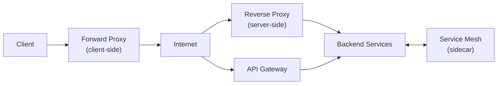
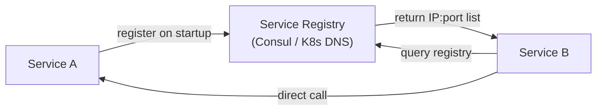

# 5. Load Balancing, API Gateway and Service Discovery

> **TL;DR:** Load balancers distribute traffic; API gateways handle cross-cutting concerns; service discovery lets services find each other. All three are in your critical path — design them wrong and they become bottlenecks.

**Interview weight:** P0 — every distributed system design uses these. Your 87% gateway load reduction is a concrete talking point that signals deep understanding.

---

## Core Concepts

- **Load balancer** — distributes incoming traffic across a pool of backend instances.
- **L4 LB** — routes based on IP/TCP; fast, no content inspection.
- **L7 LB** — routes based on HTTP headers, URL, body; enables content-aware routing.
- **API Gateway** — L7 LB with cross-cutting concerns: auth, rate limiting, routing, aggregation.
- **Service mesh** — infrastructure layer for service-to-service communication (mTLS, retries, observability).
- **Service discovery** — mechanism for services to find each other's addresses dynamically.

---

## L4 vs L7 Load Balancing

| Aspect | L4 (Transport Layer) | L7 (Application Layer) |
|--------|---------------------|----------------------|
| **OSI layer** | 4 (TCP/UDP) | 7 (HTTP/HTTPS/gRPC) |
| **Routing basis** | IP + Port | URL path, headers, cookies, body |
| **TLS** | Pass-through (can't inspect) | Terminate and re-encrypt |
| **Latency** | Very low (no payload parse) | Higher (parse headers/body) |
| **Throughput** | Very high (millions conn/s) | Lower (parsing overhead) |
| **Features** | Basic health check, TCP load balance | Path routing, auth, rate limit, WAF |
| **Sticky sessions** | IP hash (weak) | Cookie-based (strong) |
| **Azure service** | Azure Load Balancer | Azure Application Gateway, Front Door |
| **AWS equivalent** | NLB (Network Load Balancer) | ALB (Application Load Balancer) |
| **Use case** | Non-HTTP traffic, ultra-low latency | REST/gRPC, advanced routing, security |

---

## Load Balancing Algorithms

| Algorithm | How it works | Best for | Pitfall |
|-----------|-------------|---------|---------|
| **Round Robin** | Requests distributed in sequence | Homogeneous servers, uniform request cost | Hot requests go to same-sequence server |
| **Weighted Round Robin** | Round robin with weights per server | Heterogeneous server capacity | Weight tuning is manual |
| **Least Connections** | Route to server with fewest active connections | Long-lived connections (WebSockets) | Stale connection count on crash |
| **Least Response Time** | Route to server with lowest avg latency | Latency-sensitive APIs | Needs periodic latency samples |
| **IP Hash** | Hash client IP → consistent server | Sticky sessions (stateful apps) | Hot IPs; re-hashing on server add/remove |
| **Consistent Hash** | Hash request key → ring → server | Distributed caching, per-user routing | Need virtual nodes to avoid hotspots |
| **Power of Two Choices** | Pick 2 random servers; route to least-loaded | High-throughput, low-overhead | Two samples may both be busy |

**Recommendation:** Use round robin for stateless APIs. Consistent hash for cache-layer routing (same key always hits same cache node). Least connections for WebSocket/gRPC streams.

---

## Health Checks

| Type | Mechanism | Lag to detect failure | Best for |
|------|-----------|----------------------|---------|
| **Active (probe)** | LB periodically calls `/health` endpoint | Fast — interval-based (5–30 s) | HTTP services |
| **Passive (observation)** | LB tracks error rate of real traffic | Depends on traffic rate | High-traffic APIs |

**Best practice:** Combine both. Active check detects dead instances quickly; passive check catches degraded (high error rate) instances that still pass health checks. Azure ALB supports both; ASP.NET Core provides `/health` endpoint via `IHealthCheck`.

---

## Sticky Sessions — Why to Avoid Them

- Routes a client to the same server via cookie or IP hash.
- **Problems:** uneven load distribution (hot server if sticky clients are heavier); complicates rolling deployments (draining sticky connections takes time); masks stateless-design issues.
- **Fix:** Move session state out of the server. Use Redis for session storage. Issue JWT for stateless auth. Reserve sticky sessions only for WebSocket or stateful game server connections where moving is too expensive.

---

## Global Server Load Balancing / Anycast / DNS Routing

| Mechanism | How it works | Use case |
|-----------|-------------|---------|
| **DNS-based routing** | DNS resolves to different IPs by geography or health | Active-passive failover, latency routing |
| **Anycast** | Same IP advertised from multiple PoPs; BGP routes to nearest | DDoS protection, CDN edge, low-latency global routing |
| **GSLB** | Health-aware DNS that removes unhealthy regions | Multi-region active-active |
| **Azure Traffic Manager** | DNS-based GSLB with priority/weighted/geo/performance policies | Multi-region active-passive or active-active |
| **Azure Front Door** | Anycast + HTTP/7 LB + WAF + CDN combined | Global web apps, APIs requiring < 100 ms latency globally |

---

## Azure Load Balancing Services

| Service | OSI Layer | Scope | Key features | Use case |
|---------|-----------|-------|-------------|---------|
| **Azure Load Balancer** | L4 | Regional | TCP/UDP, HA ports, outbound SNAT | Non-HTTP, VM-to-VM, AKS node traffic |
| **Azure Application Gateway** | L7 | Regional | Path routing, SSL termination, WAF, autoscale | Internal or regional HTTP apps |
| **Azure Front Door** | L7 + CDN | Global (anycast) | Anycast, WAF, CDN, health-based routing, custom domains | Global APIs, web apps |
| **Azure Traffic Manager** | DNS | Global | Policy-based DNS routing (priority/geo/performance) | DNS-level failover, multi-region |
| **AWS NLB** | L4 | Regional | — | TCP/UDP equivalent to Azure LB |
| **AWS ALB** | L7 | Regional | — | Equivalent to Application Gateway |
| **AWS CloudFront + Route53** | L7 + DNS | Global | — | Equivalent to Front Door + Traffic Manager |

---

## Proxy and Gateway Patterns

| Type | Position | Visibility | Responsibilities |
|------|----------|------------|-----------------|
| **Forward proxy** | Client-side | Client hides from server | Caching, filtering, anonymization |
| **Reverse proxy** | Server-side | Server hides from client | TLS termination, compression, caching, LB |
| **API Gateway** | Edge of backend | Cross-cutting app concerns | Auth, rate limiting, routing, aggregation, transformation |
| **Service mesh** | Between services (sidecar) | Infrastructure layer | mTLS, retries, circuit breaker, observability |

---

## API Gateway Responsibilities

| Responsibility | Description | Risk if handled poorly |
|---------------|-------------|----------------------|
| **Authentication** | Validate JWT / OAuth token; extract claims | Every request pays token validation; cache validated tokens |
| **Authorization** | Enforce policies (RBAC, claims) | Complexity bloat in gateway vs service |
| **Rate limiting** | Per-client/per-IP/global request limits | Redis-backed counters must be fast; avoid per-request latency spike |
| **Routing** | Path-based, header-based routing to microservices | Complex routing trees → maintenance burden |
| **Request aggregation** | Combine N downstream calls into one response | Gateway as orchestrator anti-pattern |
| **Response transformation** | Shape, filter, version responses | Business logic leak into infrastructure |
| **Caching** | Cache responses at gateway | Stale data if invalidation not handled |
| **TLS termination** | Terminate HTTPS, forward HTTP internally | Must secure internal network separately (mTLS or VNet) |

### Gateway Anti-Patterns

- **God-object gateway:** All business logic in gateway → untestable, deployment bottleneck, blast radius.
- **Aggregation via gateway:** Gateway calls 10 services synchronously → latency compounds; use BFF or async aggregation instead.
- **No circuit breaker:** Single slow downstream blocks gateway threads → cascading failure.

### BFF Pattern (Backend for Frontend)

- Create a purpose-built API gateway per client type (mobile BFF, web BFF, partner BFF).
- Each BFF aggregates and shapes data for its client; no shared gateway becomes a bottleneck.
- Enables independent evolution of client contracts.

---

## Service Discovery

| Pattern | How it works | Pros | Cons | Example |
|---------|-------------|------|------|---------|
| **Client-side discovery** | Client queries registry; load balances itself | Client controls LB algorithm | Client library per language; registry coupling | Netflix Eureka + Ribbon |
| **Server-side discovery** | LB queries registry; routes to service | Client is simple (just calls LB) | LB is a shared SPOF | AWS ALB + ECS service discovery |
| **DNS-based** | Services register SRV/A records; clients resolve via DNS | No special library; TTL-based expiry | DNS TTL caching can be slow to propagate | Kubernetes Services (kube-dns / CoreDNS) |
| **Service mesh** | Sidecar proxies discover each other via control plane | Full observability, mTLS, retries | Complex; resource overhead | Istio, Linkerd, Azure Service Fabric |

**Kubernetes approach:** `ClusterIP` service creates a stable DNS name (`svc.namespace.svc.cluster.local`); kube-proxy handles load balancing at kernel level (iptables/IPVS). No custom registry needed for intra-cluster traffic.

---

## Connection Management

| Concern | Problem | Solution |
|---------|---------|----------|
| **Keep-alive** | Per-request TCP handshake adds 1–2 RTT | HTTP/1.1 keep-alive (default); HTTP/2 multiplexing |
| **Connection pooling** | Exhausting DB/Redis connections | `SocketsHttpHandler` pool in C#; `StackExchange.Redis` multiplexed connection |
| **TLS termination** | TLS handshake CPU overhead at service level | Terminate at gateway/LB; forward HTTP internally over VNet |
| **TLS offloading** | Decrypt once at edge | Azure App Gateway / Front Door handles TLS; internal VNet is trusted |
| **TLS passthrough** | End-to-end encryption required | L4 LB passthrough; service handles its own TLS |

---

## Talking Point: 87% Gateway Load Reduction

*Your resume: "Reduced gateway load by 87% via response caching."*

**Frame it in an interview:**
> *"Our API gateway was calling the same personalization service for 90% of users' feed requests — essentially reading the same 5 K active content items. I introduced response caching at the gateway level with a 30-second TTL, keyed by endpoint + user segment (not per-user, since content was shared). Cache hit ratio reached 92%. Gateway-to-service calls dropped from ~4 000 RPS to ~320 RPS — 87% reduction. The key design decision was choosing a segment-level cache key rather than per-user to maximize hit rate while keeping data fresh enough. We also added jitter to TTLs to prevent stampedes at expiry."*

This demonstrates: cache key design, hit ratio reasoning, stampede awareness, and quantified impact.

---

## Interview Questions

**Q1. What is the difference between L4 and L7 load balancing?**
A: L4 routes on IP/TCP — fast, no content inspection, can't do path-based routing. L7 parses HTTP headers/URL — enables path routing, auth, WAF, TLS termination, but has higher overhead. Use L4 for non-HTTP or ultra-low-latency; L7 (App Gateway / Front Door) for REST/gRPC APIs with cross-cutting concerns.

**Q2. When would you use Azure Front Door vs Application Gateway?**
A: Front Door for global anycast + CDN + WAF — traffic enters the Azure backbone at the nearest PoP worldwide, reducing latency by 20–50 ms for global users. Application Gateway for regional L7 with WAF, especially for internal or single-region apps. Use both together: Front Door at the global edge, App Gateway per region.

**Q3. Why should you avoid sticky sessions for stateless services?**
A: Sticky sessions route a client to a fixed server. This creates uneven load (heavy users overload one server), complicates rolling deploys (drained connections block rollout), and hides state that should be in a shared store. Use Redis for session state and JWT for stateless auth instead.

**Q4. What is consistent hashing and when is it used in load balancing?**
A: Nodes are mapped onto a hash ring; a request key is hashed to the ring and routed to the nearest clockwise node. When a node is added/removed, only ~1/N of keys are remapped. Used for routing requests to cache nodes (same key always hits same shard), stateful session routing, and distributed databases. Without virtual nodes, hotspots form on the ring.

**Q5. Explain the BFF pattern.**
A: Backend for Frontend — a dedicated API gateway per client type (mobile, web, partner). Each BFF aggregates and shapes data specifically for its client, avoiding a shared gateway that serves the lowest common denominator. Enables independent versioning per client and avoids the god-object gateway anti-pattern.

**Q6. What is a service mesh and when do you need one?**
A: A service mesh (Istio, Linkerd) injects sidecar proxies alongside every service pod. The proxies handle mTLS, retries, circuit breaking, and distributed tracing — without changing application code. Justified when you have 20+ microservices and want observability + security without per-service library overhead. Overkill for < 5 services; adds ~50 MB memory per pod and latency (~0.5 ms per hop).

**Q7. How did you reduce API gateway load by 87%?**
A: Introduced response caching at gateway level with segment-level cache keys (endpoint + user segment, not per-user) and 30-second TTL with ±5s jitter. Hit ratio reached 92%, reducing 4 000 RPS downstream to 320 RPS. Key decisions: segment-based key (maximizes hit rate vs per-user), jittered TTL (prevents stampede), and 30s TTL (acceptable staleness for feed content).

**Q8. How does service discovery work in Kubernetes?**
A: Each `Service` object gets a stable DNS name (`<service>.<namespace>.svc.cluster.local`) registered in CoreDNS. kube-proxy programs iptables/IPVS rules on every node to load-balance across the pod IPs in the service's `Endpoints` list. Pods need no discovery library — just call the DNS name. Service mesh adds per-request observability on top.

**Q9. What happens if your API gateway goes down?**
A: Total outage — all traffic stops. Mitigate: (1) multi-AZ gateway deployment (App Gateway v2 is zone-redundant); (2) Front Door with multiple origins provides global fallback; (3) circuit breakers at the edge to fail fast rather than queue; (4) health check probes with automatic node replacement; (5) design for direct service invocation (bypass gateway) for internal service-to-service calls.

**Q10. How do you prevent the API gateway from becoming a bottleneck?**
A: (1) Keep only cross-cutting concerns (auth, rate limit, routing) in the gateway — no business logic. (2) Cache token validation results (5 min TTL for JWT signatures). (3) Response caching for repeatable reads. (4) Horizontal autoscaling of the gateway itself. (5) Use BFF pattern to split traffic across purpose-built gateways. (6) Async gateway aggregation (non-blocking fan-out) instead of synchronous N+1 downstream calls.

**Q11. Compare client-side vs server-side service discovery.**
A: Client-side: client queries registry (Eureka), picks an instance, and load balances itself. Flexible LB algorithm but couples client to registry client library. Server-side: client calls a fixed LB address; LB queries the registry. Simpler client, but LB is a shared component. Kubernetes uses DNS-based (effectively server-side via kube-proxy) — best of both.

---

## Quick Recap

- L4 = fast TCP routing; L7 = content-aware HTTP routing with auth/WAF/caching.
- Azure Front Door = global anycast + CDN (for global); App Gateway = regional L7.
- Algorithms: round robin for stateless; consistent hash for cache affinity; least-connections for long-lived streams.
- Avoid sticky sessions — move state to Redis; use JWT for stateless auth.
- API gateway = cross-cutting concerns only; no business logic (avoid god-object).
- BFF: purpose-built gateway per client type.
- Kubernetes service discovery = CoreDNS + kube-proxy; no library required.
- 87% gateway load reduction = segment-level response cache with jittered TTL.
