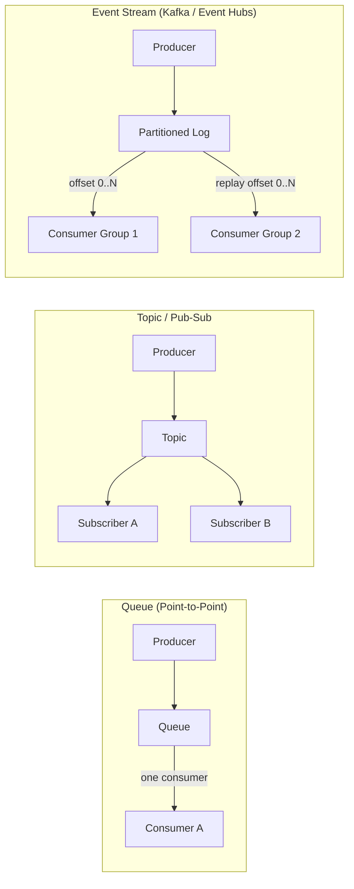
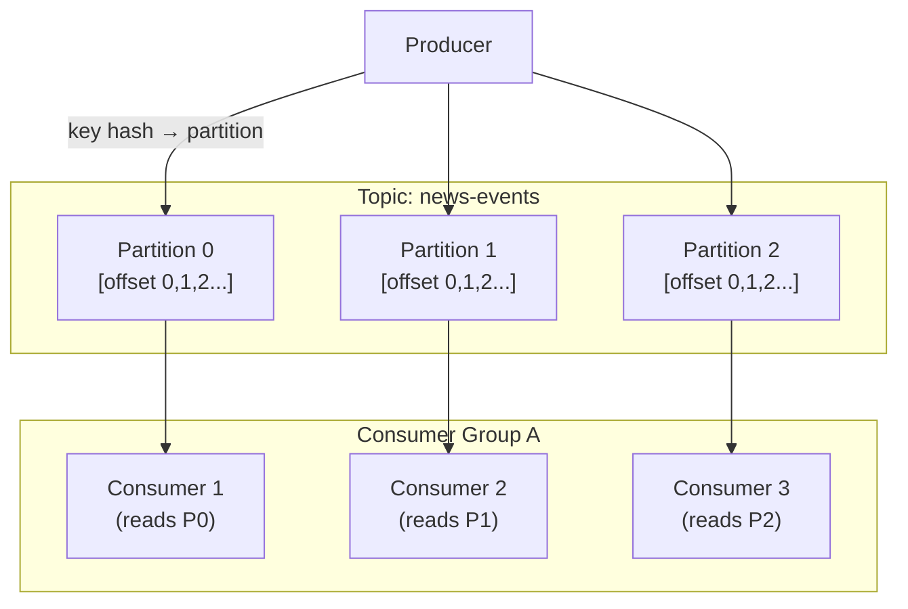
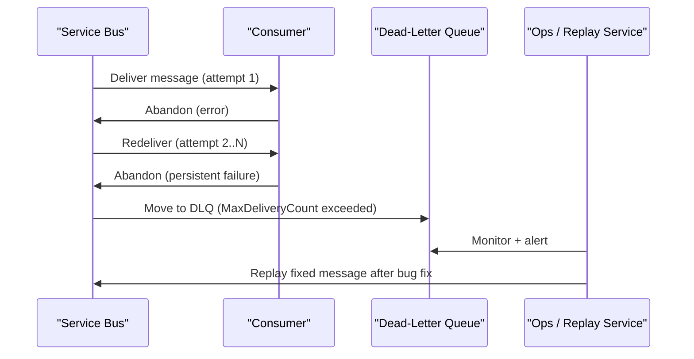
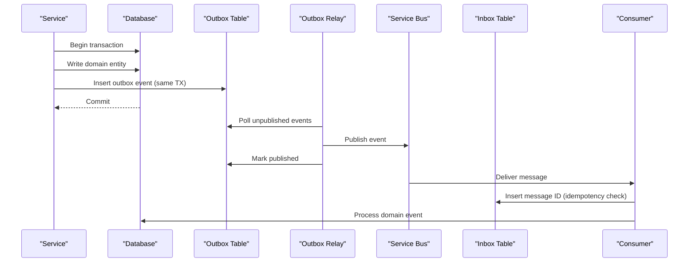

# 6. Message Queues and Pub-Sub

> **TL;DR:** Queues decouple producers from consumers, absorb spikes, and enable async processing. Choosing the right broker and delivery semantics — especially idempotency — is what separates reliable systems from those that lose or double-process data.

**Interview weight:** P0 — directly maps to your AI Content Certification Platform (idempotent Service Bus consumers, retry/backoff, DLQ, 4-stage event-driven engine) and News Feed fan-out. Interviewers will probe delivery semantics and ordering deeply.

---

## Core Concepts

- **Queue** — point-to-point; each message consumed by exactly one consumer. FIFO ordering within partition.
- **Topic/Pub-Sub** — one message delivered to all subscribers (fan-out). Consumers receive independent copies.
- **Event stream** — ordered, durable, replayable log. Consumers can replay from any offset. Fundamentally different from queue (messages are not deleted on read).
- **Producer** — writes messages.
- **Consumer** — reads and processes messages.
- **Dead-letter queue (DLQ)** — holds messages that failed all delivery attempts; awaits human or automated remediation.

---

## Queue vs Topic vs Event Stream



| Aspect | Queue | Topic/Pub-Sub | Event Stream |
|--------|-------|--------------|-------------|
| **Delivery** | One consumer gets each message | All subscribers get each message | Each consumer group reads independently; messages retained |
| **Retention** | Message deleted after ACK | Message deleted after ACK to all | Retained by time/size policy (days–forever) |
| **Replay** | No | No | Yes — consumers can seek to any offset |
| **Ordering** | FIFO (within partition/session) | Not guaranteed across subscribers | Ordered per partition |
| **Best for** | Work distribution, task queue | Fan-out notifications | Audit log, event sourcing, stream processing |
| **Azure** | Service Bus Queue | Service Bus Topic + Subscriptions | Event Hubs, Event Grid |
| **OSS equivalent** | RabbitMQ queue | RabbitMQ exchange (fanout) | Apache Kafka |

---

## Push vs Pull Consumers

| Aspect | Push (broker-initiated) | Pull (consumer-initiated) |
|--------|------------------------|--------------------------|
| **Latency** | Low — broker pushes immediately | Slightly higher — poll interval |
| **Consumer control** | Less — broker can overwhelm slow consumer | Full — consumer controls rate |
| **Backpressure** | Hard — must implement rate limiting | Natural — consumer doesn't poll when busy |
| **Examples** | Service Bus (push with lock), Azure Event Grid webhooks | Kafka, Event Hubs (consumer pulls with offset) |

---

## Broker Comparison Table

| Aspect | Kafka | Azure Service Bus | Azure Event Hubs | RabbitMQ | Azure Storage Queues | AWS SQS |
|--------|-------|-------------------|-----------------|----------|---------------------|---------|
| **Model** | Partitioned event log | Enterprise queue + topic | Partitioned event stream | AMQP queue/exchange | Simple queue | Simple queue |
| **Ordering** | Per partition, total within key | Per session (FIFO), else unordered | Per partition | Per queue | Approximate FIFO | Approximate FIFO (FIFO queue = exact) |
| **Retention** | Configurable (days–forever), log compaction | 14 days max | 7 days default (90 days premium) | Until ACK or TTL | 7 days | 4 days default (14 days max) |
| **Throughput** | Millions msg/s per cluster | ~1–10 K msg/s per namespace | Millions events/s (Event Hubs Dedicated) | ~50 K msg/s | High (simple use) | High |
| **Delivery guarantee** | At-least-once; effectively-once with idempotent producer + transactional consumer | At-least-once (peek-lock); at-most-once (receive-and-delete) | At-least-once (with checkpointing) | At-least-once or at-most-once | At-least-once | At-least-once (standard); exactly-once (FIFO + dedup) |
| **Dead-letter** | Separate DLQ topic (manual) | Built-in DLQ per queue/subscription | No native DLQ; errors to Event Grid or manual | DLX (dead-letter exchange) | No native DLQ | Built-in DLQ |
| **Partitioning** | Core feature (topics partitioned) | Sessions for ordering; partitioned namespaces | Core feature | Plugins (limited) | No | No (FIFO has message groups) |
| **Consumer groups** | Core feature | Competing consumers on queue; subscriptions on topic | Core feature (consumer groups) | Exchange bindings | Multiple queues | Multiple queues |
| **Best use case** | Event streaming, audit log, high-volume analytics | Enterprise messaging, reliable task queue, ordered sessions | High-volume telemetry, Kafka-compatible ingest | Low-latency task queue, complex routing | Simple task queue, low cost | Simple task queue in AWS |
| **Azure-native integration** | Confluent Cloud on Azure / HDInsight | Native Azure; AKS, Functions, Logic Apps | Native Azure; Stream Analytics, Functions | OSS on AKS | Built-in to Azure Storage | — |

---

## Kafka Internals



**Key internals:**
- **Topic** — logical category; physically split into partitions.
- **Partition** — ordered, immutable, append-only log on disk. Unit of parallelism.
- **Offset** — monotonically increasing integer per message per partition. Consumer commits offset to mark progress.
- **Consumer group** — each partition assigned to exactly one consumer in the group; N consumers can process N partitions in parallel.
- **Rebalancing** — triggered when consumer joins/leaves group; reassigns partitions. Brief pause (stop-the-world with eager rebalance; incremental cooperative rebalance is better).
- **ISR (In-Sync Replicas)** — set of replicas caught up to leader. Write considered committed when all ISR replicas ACK (`acks=all`). Leader fails → one ISR promoted.
- **Log compaction** — retains only the latest value per key; enables snapshot-like reads. Useful for change data capture (CDC), state store rebuilds.
- **Retention** — time-based (7 days) or size-based. After expiry, messages deleted (unless compacted).

---

## Azure Service Bus Features

| Feature | Description | Use case |
|---------|-------------|---------|
| **Sessions** | Group messages by session ID; FIFO ordering within a session | Per-order, per-user processing sequences |
| **Peek-lock** | Receiver locks message for processing; calls `CompleteAsync` to remove, `AbandonAsync` to retry | At-least-once with explicit ACK |
| **Receive-and-delete** | Message auto-removed on receive | At-most-once (fast, lossy) |
| **Lock renewal** | Extend lock duration for long-running processing | Prevents message redelivery for slow consumers |
| **Scheduled messages** | Enqueue for delivery at a future time | Deferred processing, retries with delay |
| **Duplicate detection** | Dedup window (30 s–7 days); rejects duplicate `MessageId` | Idempotent producer-side dedupe |
| **DLQ** | Built-in dead-letter sub-queue for poison messages | Failure isolation, replay, alerting |
| **Topics + Subscriptions + SQL filters** | Fan-out with per-subscription filter predicates | Route by content properties |
| **Auto-forwarding** | Subscription auto-forwards to another queue | Chained routing, aggregation |
| **Max delivery count** | After N failed deliveries → DLQ | Poison message containment |

---

## Delivery Semantics

| Semantic | Guarantee | Risk | How to achieve |
|----------|-----------|------|---------------|
| **At-most-once** | Message delivered 0 or 1 times | Data loss on failure | Fire-and-forget; receive-and-delete |
| **At-least-once** | Message delivered ≥ 1 times | Duplicate processing | Peek-lock + ACK after success; Kafka manual commit |
| **Effectively-once (end-to-end)** | Logically processed exactly once | Requires idempotency + dedupe | At-least-once delivery + idempotent consumer |

**Why "exactly-once end-to-end" is a myth without idempotency:**
The broker can guarantee each message is delivered at most once only by accepting loss risk. At-least-once is achievable. True exactly-once requires: (1) idempotent producer (Kafka `enable.idempotence=true` for single-broker atomicity), (2) idempotent consumer (dedupe on processing side), and (3) atomic write of consumer state + output. Kafka transactions enable (1) + (3) within Kafka. But if the consumer writes to an external DB, you still need idempotency on the DB write.

---

## Idempotent Consumers

**Idempotency key:** A unique identifier for a message's logical operation. Stored in a dedupe store after first successful processing. On retry, detected as duplicate → return cached result without reprocessing.

```csharp
public class ContentCertificationConsumer
{
    private readonly IDatabase _redis;
    private readonly ICertificationService _service;

    public async Task ProcessAsync(ServiceBusReceivedMessage message, CancellationToken ct)
    {
        var idempotencyKey = message.MessageId; // unique per logical operation

        // Check dedupe store (Redis, TTL = 24h)
        if (await _redis.KeyExistsAsync($"processed:{idempotencyKey}"))
        {
            await _messageReceiver.CompleteMessageAsync(message, ct);
            return; // already processed — safe to ACK
        }

        await _service.CertifyContentAsync(message.Body.ToObjectFromJson<ContentEvent>(), ct);

        // Mark processed atomically (with expiry)
        await _redis.StringSetAsync($"processed:{idempotencyKey}", "1", TimeSpan.FromHours(24));
        await _messageReceiver.CompleteMessageAsync(message, ct);
    }
}
```

**Dedupe store options:** Redis (TTL-based, fast), Cosmos DB (unique constraint on idempotency key), Azure SQL (unique index). TTL must be longer than your max retry window.

---

## Ordering Guarantees and Per-Key Partitioning

- **Kafka:** Global ordering impossible across partitions. Per-key ordering: set partition key = entity ID (e.g., `userId`). All events for a key land in the same partition → ordered.
- **Service Bus:** Sessions provide FIFO ordering per session ID. Set `SessionId = entityId`.
- **No ordering** is the most scalable choice; design idempotent stateless consumers wherever possible.
- **Fan-out pattern** (celebrity user, broadcast event): ordering not required → no session/partition needed.

---

## Retries, Exponential Backoff, Jitter, and Max Delivery Count

```
retry_delay = min(base_delay × 2^attempt, max_delay) + random_jitter
```

| Parameter | Typical value | Why |
|-----------|--------------|-----|
| Base delay | 1–2 s | Immediate retry often hits same transient error |
| Max delay | 60–300 s | Caps wait time |
| Max attempts | 5–10 | Balance between retrying transient errors and giving up on poison messages |
| Jitter | ±20–50% of delay | Prevents retry storms from synchronized consumer failures |

Service Bus: `MaxDeliveryCount` (default 10); after that → DLQ. Combine with `ScheduledEnqueueTime` for delayed retry.

---

## Poison Messages and DLQ Handling



**DLQ handling checklist:**
- Alert on DLQ depth > 0.
- Every DLQ message includes `DeadLetterReason` and `DeadLetterErrorDescription` — log these.
- Replay process: fix the bug → re-enqueue DLQ messages to original queue (with idempotent consumer, safe to replay).
- Categorize DLQ messages: transient (retry later), schema violation (fix consumer), business error (alert + manual review).

---

## Consumer Lag Monitoring and Scaling

- **Consumer lag** = messages in queue that haven't been processed = producer RPS × processing latency backlog.
- Alert on lag growing monotonically (consumer can't keep up).
- **Scale consumers:** Kafka — add consumers up to partition count (N consumers = N partitions = max parallelism). Service Bus — add competing consumers (multiple instances reading same queue).
- AKS autoscaler with KEDA (Kubernetes Event-driven Autoscaling) scales consumer pods on Service Bus queue depth or Kafka consumer lag.

---

## Message Schema Evolution

| Compatibility type | Meaning | Allowed changes |
|-------------------|---------|----------------|
| **Backward compatible** | New consumer can read old messages | Add optional fields; don't remove/rename required fields |
| **Forward compatible** | Old consumer can read new messages | Add optional fields; old consumer ignores unknown fields |
| **Full compatible** | Both directions | Additive changes only |

**Schema registry:** Confluent Schema Registry (Avro/JSON Schema) or Azure Schema Registry (Event Hubs). Register schema version; producer embeds schema ID in message header; consumer fetches schema by ID and deserializes correctly.

**Versioning for Service Bus:** Embed `ContentType` and `MessageVersion` in message properties. Consumer routes by version.

---

## Transactional Outbox + Inbox Pattern



**Why:** Without outbox, if the service publishes to the bus and then the DB commit fails (or vice versa), you get inconsistency. Outbox ensures the event is published if-and-only-if the DB transaction commits.
**Outbox relay options:** Polling (simple, small lag), Change Data Capture (CDC via Debezium / Azure SQL CDC → Event Hubs), Transaction Log Tailing.

---

## Claim-Check Pattern (Large Payloads)

- Message brokers have payload limits: Service Bus = 256 KB standard / 100 MB premium; Kafka default = 1 MB.
- For large payloads (video frames, AI model outputs, large JSONs): store payload in Azure Blob Storage; put only the blob URL + correlation ID in the message.
- Consumer retrieves payload from blob on processing.
- Delete blob after ACK to avoid orphaned storage (or use TTL lifecycle policy).

---

## Competing Consumers Pattern

- Multiple consumer instances read from the same queue.
- Service Bus: each message delivered to exactly one consumer (competing consumers model automatically).
- Kafka: each partition delivered to one consumer per consumer group; add consumers up to partition count.
- Enables horizontal scaling: double consumers → roughly halve processing lag.
- **Idempotency required** because a message may be redelivered to a different consumer after lock expiry.

---

## Interview Questions

**Q1. What is the difference between a queue and an event stream?**
A: Queue: message deleted after one consumer ACKs it; no replay; point-to-point. Event stream (Kafka/Event Hubs): messages retained by policy (days–forever); multiple consumer groups each read independently; replay from any offset. Use queues for work distribution; streams for audit logs, event sourcing, and multiple independent consumers.

**Q2. Explain at-least-once vs exactly-once delivery.**
A: At-least-once: message guaranteed to be delivered but may be delivered more than once (retry after crash). Exactly-once end-to-end requires at-least-once delivery + idempotent consumer + atomic state commit. Kafka transactions achieve exactly-once within the Kafka cluster (idempotent producer + consumer offset commit in same transaction). Cross-system exactly-once (Kafka → Cosmos DB) requires idempotency key in the DB write.

**Q3. What is the transactional outbox pattern and why do you need it?**
A: Without outbox: service writes to DB and then publishes to Service Bus; if the publish fails after DB commit, the event is lost. Outbox: store the event in an outbox table in the same DB transaction as the domain write. A relay process (polling or CDC) reads uncommitted outbox events and publishes them. Guarantees the event is published if-and-only-if the DB commit succeeded.

**Q4. How do you design an idempotent Service Bus consumer?**
A: Use `MessageId` as idempotency key. Before processing, check a dedupe store (Redis with 24h TTL). If already present, complete the message and return. If not, process, write to dedupe store, then complete. Critical: dedupe check and domain write should be as close to atomic as possible. Service Bus duplicate detection window (on producer side) is a complementary defense.

**Q5. How do Kafka consumer groups work?**
A: A consumer group assigns each partition to exactly one consumer instance. N consumers in a group can process N partitions in parallel. Adding consumers beyond partition count is wasteful (idle consumers). Each group maintains its own committed offsets — multiple groups can independently consume the same topic at different rates.

**Q6. What is ISR in Kafka and why does it matter for durability?**
A: ISR (In-Sync Replicas) = replicas fully caught up to the leader's log. With `acks=all`, a write is only committed when all ISR replicas acknowledge. If a replica falls behind (lag > `replica.lag.time.max.ms`), it's removed from ISR. On leader failure, only an ISR member is elected leader — ensures no committed write is lost. If ISR = {leader only}, setting `min.insync.replicas=2` rejects writes until another replica catches up.

**Q7. How does Service Bus handle poison messages?**
A: Each message has a `DeliveryCount`. On `AbandonAsync`, the count increments. When it reaches `MaxDeliveryCount` (default 10), the broker moves the message to the dead-letter sub-queue with `DeadLetterReason` populated. The DLQ is monitored; after root-cause fix, messages are replayed via a replay process (safe with idempotent consumers).

**Q8. When would you use Service Bus Sessions for ordering?**
A: When you need per-entity ordered processing (e.g., order state machine: created → paid → shipped — must be processed in order for the same order ID). Set `SessionId = orderId`. Service Bus ensures only one consumer holds the session at a time and delivers messages in enqueue order. Without sessions, concurrent consumers would process out-of-order.

**Q9. Kafka vs Azure Service Bus — when to use which?**
A: Kafka/Event Hubs: high-volume event streams, audit logs, event sourcing, stream analytics, replay capability, multiple independent consumers. Service Bus: enterprise messaging, reliable task queues, sessions for FIFO ordering, DLQ, complex routing (subscriptions + SQL filters), .NET-native integration. In your system: Event Hubs for telemetry/game events ingestion; Service Bus for reliable workflow tasks (AI certification pipeline).

**Q10. How does log compaction work in Kafka?**
A: Kafka retains only the latest message per key in a compacted topic. Earlier values for the same key are garbage-collected. Useful for CDC (change data capture): the compacted log represents the current state of each entity. Consumers can rebuild state by reading the compacted log without needing the full history. Null value = tombstone (key deleted).

**Q11. How do you handle schema evolution in a Service Bus message?**
A: Embed `MessageVersion` and `ContentType` in message properties. Consumer routes by version: v1 consumer handles `ContentType: application/json; version=1`, v2 handles v2. During migration, run both versions in parallel; drain old messages before decommissioning old consumer. For Kafka, use Azure Schema Registry or Confluent Schema Registry with Avro — backward-compatible schema changes (add optional fields) allow old and new producers/consumers to coexist.

**Q12. How did your AI Content Certification Platform use Service Bus?**
A: 4-stage event-driven pipeline: content submitted → Service Bus queue → Certification Worker (stage 1: rule engine, stage 2: AI moderation, stage 3: embeddings-based copycat detection, stage 4: final decision). Each stage used peek-lock with idempotency keys (Redis dedupe store). Retry with exponential backoff (1s, 2s, 4s... up to 5 min). Persistent failures → DLQ with alerting. Sessions used for per-content ordering where the rule engine output must precede AI moderation. This ensured zero message loss and replayable failures.

**Q13. Explain the claim-check pattern and when you'd use it.**
A: Store large payloads in blob storage; put only a URL/reference in the message. Consumer fetches payload by reference. Used when payloads exceed broker limits (Service Bus 256 KB standard, 100 MB premium; Kafka 1 MB default). Also useful for audit (blob is immutable evidence of original payload). Risk: blob must exist when consumer reads — use TTL lifecycle policy that's longer than max processing time.

---

## Quick Recap

- Queue = point-to-point, ACK deletes; Topic = fan-out to all subscribers; Stream = retained log, multiple independent consumer groups, replayable.
- Delivery: at-most-once (lossy) → at-least-once (duplicates) → effectively-once (at-least-once + idempotent consumer).
- Idempotent consumer = check `MessageId` in Redis/DB before processing; mark as processed after.
- Service Bus: peek-lock for at-least-once; sessions for per-entity FIFO; DLQ for poison messages.
- Kafka: partition = unit of ordering + parallelism; consumer group per logical consumer; ISR + `acks=all` for durability.
- Transactional outbox: write event to DB table in same transaction as domain change; relay publishes to broker.
- Scale consumers by queue depth (KEDA); alert on monotonically growing consumer lag.
- Schema evolution: backward-compatible changes (add optional fields); use schema registry for Avro/JSON Schema.
