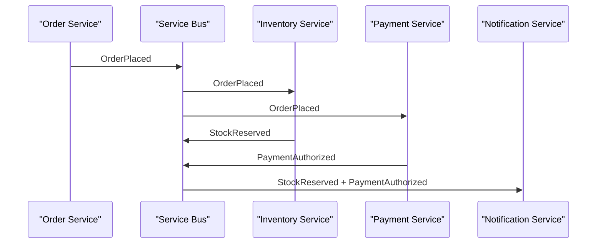
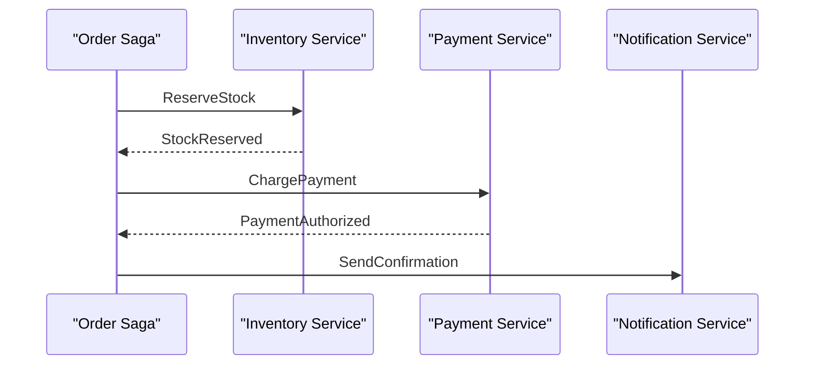
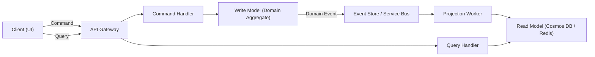
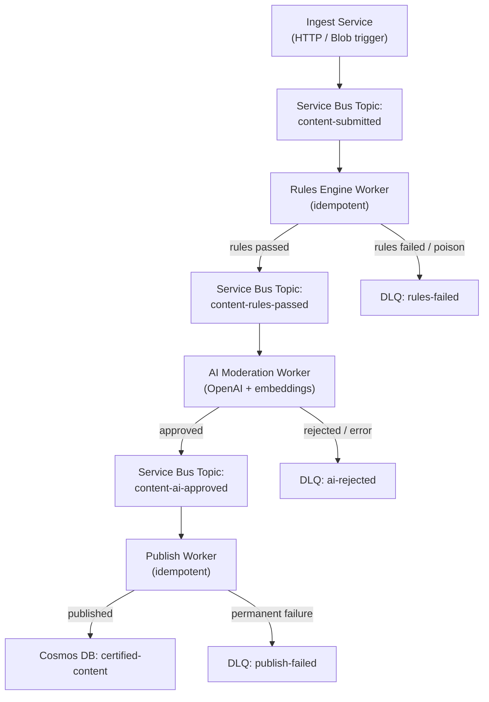

# 7. Event-Driven Architecture, CQRS, and Event Sourcing

> **TL;DR:** Event-driven systems decouple producers from consumers via immutable facts; CQRS separates read and write models for independent scaling; Event Sourcing replaces mutable state with an append-only log of events, enabling temporal queries, audit trails, and rebuild-from-history.

**Interview weight:** P0 — senior interviews probe all three together; knowing when NOT to use them separates principals from juniors.

---

## Core Concepts

- **Event** — immutable fact: "OrderPlaced at 14:03 for $42". Past tense. Not a command.
- **Command** — intent, can be rejected: "PlaceOrder". Present tense.
- **Query** — reads state, no side-effects.
- **Event-driven architecture (EDA)** — services communicate by publishing/consuming events; producers have no knowledge of consumers.
- **CQRS (Command Query Responsibility Segregation)** — separate write model (command handler mutates state) from read model (projections optimised for queries).
- **Event Sourcing (ES)** — state is derived by replaying an ordered sequence of events; no UPDATE/DELETE, only APPEND.

---

## Event-Driven vs Request-Response

| Aspect | Request-Response (REST/gRPC) | Event-Driven |
|---|---|---|
| Coupling | Caller knows callee's address | Producer unaware of consumers |
| Temporal | Synchronous; both parties must be up | Asynchronous; broker buffers |
| Failure isolation | Caller fails if callee is down | Producer unaffected by consumer lag |
| Latency | Low (ms) | Added broker latency (10–100 ms) |
| Discoverability | Simple to trace call chain | Requires event catalog / schema registry |
| Best for | User-facing reads, strong consistency | Workflows, fan-out, audit, decoupling |
| Azure example | App calls downstream via `HttpClient` | Publisher → Service Bus → N subscribers |

---

## Event Patterns Compared

| Pattern | What is carried | Consumer action | Example |
|---|---|---|---|
| **Event Notification** | Minimal: entity ID + event type | Consumer fetches state via API | `OrderPlaced { orderId }` → consumer GETs order |
| **Event-Carried State Transfer** | Full snapshot of entity state | Consumer maintains own read copy; no callback needed | `OrderPlaced { orderId, items[], total, userId }` |
| **Event Sourcing** | Delta/fact that caused the change | Consumers replay sequence to rebuild state | `ItemAddedToCart { cartId, sku, qty }` |

---

## Choreography vs Orchestration

### Choreography — each service reacts to events independently



### Orchestration — central saga coordinator drives the flow



| Aspect | Choreography | Orchestration |
|---|---|---|
| Coupling | Low — services emit/consume events | Moderate — orchestrator knows all steps |
| Visibility | Hard; need distributed tracing | High — state in one saga process |
| Failure handling | Each service handles its own retry | Centralized compensation logic |
| Testing | Complex integration tests needed | Unit-testable saga state machine |
| Dead-letter | Each topic has its own DLQ | One DLQ for the saga |
| Azure fit | Service Bus topics + subscriptions | Durable Functions orchestration |

---

## Commands vs Events vs Queries

| Aspect | Command | Event | Query |
|---|---|---|---|
| Intent | Request an action | Record a fact | Ask for data |
| Tense | Present: `PlaceOrder` | Past: `OrderPlaced` | — |
| Can be rejected | Yes | No (already happened) | N/A |
| Side-effects | Yes (mutates state) | None (read-only to observers) | None |
| Naming convention | `<Verb><Noun>` | `<Noun><PastVerb>` | `Get<Noun>By<Key>` |
| Target | One handler (one receiver) | N consumers (broadcast) | One read model |

---

## CQRS

### Read/Write Model Separation



### When CQRS is Worth It

- Read/write load ratio is highly skewed (reads 100x writes) — scale independently.
- Read model needs a different schema than write model (denormalised, search-optimised).
- Multiple read clients need different projections of the same data.
- You already have an event bus (Service Bus, Kafka); projections are cheap to add.

### When CQRS is Over-Engineering

- Simple CRUD with few consumers; one team owns both sides.
- No audit/history requirement; reads and writes use the same fields.
- Team is small (< 5 devs); operational overhead outweighs benefit.
- Consistency requirements are strict and UI cannot tolerate stale reads.

### Sync vs Async Projections

| Aspect | Synchronous (in same transaction) | Asynchronous (via event/CDC) |
|---|---|---|
| Consistency | Immediate | Eventual (seconds–minutes lag) |
| Coupling | Write and read share DB | Decoupled, independent tech stacks |
| Failure impact | Write fails if projection fails | Projection can lag/retry independently |
| Scalability | Limited by write path | Read model scales independently |

### Read-Your-Own-Write

Problem: user writes, then immediately reads — but async projection not yet updated.

Solutions:
1. **Version token** — write returns event sequence number; query waits until read model ≥ that version.
2. **Sticky session / request header** — route user's subsequent reads to the region/instance that just wrote.
3. **Optimistic local state** — UI applies the change locally (optimistic update) before server confirms.
4. **Short polling** — client polls with `If-Modified-Since` until read model catches up (≤ 2 s typical).
5. **Causal consistency token in Cosmos DB** — `SessionConsistencyToken` guarantees monotonic reads within a session.

---

## Event Sourcing

### Event Store & Append-Only Log

- All state changes are stored as an ordered, immutable sequence of events per aggregate.
- `GET /orders/123/events` returns `[OrderPlaced, ItemAdded, PaymentAuthorized, OrderShipped]`.
- Current state = `fold(initialState, events)`.
- Azure EventStore options: Cosmos DB (partition = aggregateId), Azure Table Storage (rowKey = sequenceNo), Event Store DB (OSS), Event Hubs (sequential log).

### Rebuilding State

```csharp
public Order Rehydrate(IEnumerable<DomainEvent> events)
{
    var order = new Order();
    foreach (var e in events)
        order.Apply(e);   // mutates in-memory state only
    return order;
}
```

### Snapshots

- After N events (e.g. 100), store a snapshot of current state.
- On rehydration: load latest snapshot + events since snapshot sequence number.
- Snapshots are optimisation only — system is correct without them.

### Event Versioning and Upcasting

- Never mutate a published event schema.
- **Additive changes** (new optional field) — safe; old consumers ignore it.
- **Breaking changes** — create `OrderPlacedV2`; register an **upcaster** that transforms V1 → V2 on read.

```csharp
public OrderPlacedV2 Upcast(OrderPlacedV1 v1) =>
    new OrderPlacedV2(v1.OrderId, v1.Total, Currency: "USD"); // add default
```

- Schema registry (Azure Schema Registry, Confluent) enforces compatibility (BACKWARD / FORWARD / FULL).

### Temporal Queries

- Replay events up to a specific `timestamp` or `sequenceNumber` to reconstruct past state.
- Useful for debugging, auditing, "what did the system look like at T?".

### GDPR Deletion Problem

Event sourcing stores facts forever — conflicts with "right to be erased".

Mitigations:
1. **Crypto-shredding** — encrypt PII per user with a per-user key; delete the key. Old events become unreadable.
2. **Reference events** — store PII in a mutable store; events hold a reference (userId); delete from mutable store.
3. **Pseudonymisation** — replace PII with a pseudonym token; delete mapping table.

### When NOT to Use Event Sourcing

- Simple CRUD entities with no history requirement.
- Small teams where operational complexity is prohibitive.
- Very high event frequency with large aggregates (millions of events per aggregate — snapshot cost).
- External systems that cannot receive replayed events (idempotency hard to guarantee).
- Schema evolution across microservices is already painful.

### Event Sourcing vs CRUD vs Audit Log

| Aspect | CRUD | Audit Log | Event Sourcing |
|---|---|---|---|
| Storage | Current state only | Current state + log table | Events only (state is derived) |
| History | No | Yes (manual) | Yes (first-class) |
| Temporal queries | No | Manual | Native |
| Rebuild state | N/A | Partial | Full |
| GDPR | Easy delete | Delete both tables | Crypto-shredding needed |
| Complexity | Low | Medium | High |
| Schema evolution | Simple ALTER | Two places to update | Upcaster pattern |

---

## Aggregates and Consistency Boundaries

- **Aggregate** (DDD) — cluster of domain objects treated as a unit; transactional boundary.
- Events are raised **within** an aggregate boundary; only one aggregate is modified per command.
- Cross-aggregate coordination uses **sagas** or **process managers**.
- See [LLD — DDD and Clean Architecture](../07-LLD-and-Design-Patterns/06-Architecture-Clean-Onion-Hexagonal-and-DDD.md).

---

## Projections and Materialized Views

- **Projection** — event handler that rebuilds a read model by consuming the event stream.
- **Cosmos DB Change Feed** — change feed processor library reads ordered, at-least-once feed of document changes; ideal for building projections from an event-sourced Cosmos container.

```csharp
var processor = container.GetChangeFeedProcessorBuilder<OrderEvent>("projectionWorker", async (changes, ct) =>
{
    foreach (var e in changes)
        await readModelRepo.UpsertAsync(ProjectToReadModel(e), ct);
})
.WithInstanceName("worker-1")
.WithLeaseContainer(leaseContainer)
.Build();
await processor.StartAsync();
```

- Multiple projections can consume the same change feed independently (each has its own lease container).
- **Azure equivalent:** Cosmos DB Change Feed Processor. **AWS:** DynamoDB Streams. **OSS:** Debezium CDC.

---

## Event Schema Design and Versioning

- Include: `eventId` (UUID), `aggregateId`, `eventType`, `schemaVersion`, `timestamp`, `correlationId`, `causationId`, `payload`.
- `correlationId` — trace the original request across services.
- `causationId` — the event that caused this event (enables causal ordering).
- Use **Avro or Protobuf** for compact binary; **JSON** for debuggability with schema registry validation.
- Enforce **BACKWARD compatibility** by default: consumers can always read the latest schema with events written in older schemas.

---

## Ordering and Duplicate Handling

- **Ordering** — Azure Service Bus sessions guarantee FIFO per session (partition). Event Hubs guarantees order per partition key.
- **Deduplication** — Service Bus built-in dedup window (configurable, default 10 min); Cosmos DB `id`-based idempotent upsert; Redis `SET key value NX EX ttl`.
- **At-least-once + idempotent consumer = effectively-once** — process and record processed `eventId`; skip on re-delivery.

---

## Saga and Process Manager Introduction

- **Saga** — long-running business transaction spanning multiple services/aggregates; composed of local transactions + compensating transactions.
- **Process Manager** — stateful saga variant that keeps explicit state and can make routing decisions.
- Detailed coverage: [Distributed Systems Patterns](09-Distributed-Systems-Patterns.md#saga-pattern).

---

## Worked Example: 4-Stage AI Content Certification Pipeline



**Key design decisions:**

| Concern | Design |
|---|---|
| Idempotency | Each worker checks `contentId` in a processed-IDs store (Cosmos or Redis `SET NX`) before processing |
| Retry / backoff | Service Bus built-in: max 10 retries, exponential backoff; worker sets `DeliveryCount` threshold |
| DLQ | Messages exceeding retry count auto-forwarded to DLQ; separate DLQ processor alerts + manual review |
| Ordering | Service Bus sessions keyed on `contentId`; ensures sequential stages per content item |
| Exactly-once publish | Publish worker uses Cosmos DB optimistic concurrency (`_etag`) + transactional outbox for final DB write |
| Observability | `correlationId` flows through all topics; Azure Application Insights distributed trace |
| AI failure | AI worker wraps OpenAI call in Polly retry (3 attempts, exponential); on persistent failure → DLQ |
| Schema versioning | `schemaVersion` field in each message; upcaster in each worker converts V1 → V2 transparently |

```csharp
// Idempotent Service Bus consumer (simplified)
public async Task ProcessMessageAsync(ServiceBusReceivedMessage msg, CancellationToken ct)
{
    var contentId = msg.ApplicationProperties["contentId"].ToString();
    var key = $"processed:{contentId}";

    if (!await _redis.SetNxAsync(key, "1", TimeSpan.FromHours(24)))
    {
        await _receiver.CompleteMessageAsync(msg, ct); // already handled
        return;
    }

    try
    {
        var content = JsonSerializer.Deserialize<ContentSubmittedEvent>(msg.Body);
        var result = await _rulesEngine.EvaluateAsync(content, ct);

        if (result.Passed)
            await _sender.SendMessageAsync(new ServiceBusMessage(JsonSerializer.Serialize(result)), ct);
        else
            await _sender.SendToDeadLetterAsync(msg, "RulesFailed", result.Reason, ct);

        await _receiver.CompleteMessageAsync(msg, ct);
    }
    catch (Exception ex) when (ex is not OperationCanceledException)
    {
        await _receiver.AbandonMessageAsync(msg, ct); // increment delivery count → retry
        throw;
    }
}
```

---

## Trade-offs & When to Use

| Pattern | Use when | Avoid when |
|---|---|---|
| EDA | Fan-out, audit, loose coupling, async workflows | Strict synchronous consistency required |
| CQRS | Read >> write load, multiple projection types | Simple CRUD, small teams |
| Event Sourcing | Full history needed, temporal queries, complex domain | Simple entities, small teams, GDPR-heavy without crypto-shredding plan |

---

## Common Pitfalls

- **Event notification without versioning** — consumers break on schema change silently.
- **Projections that don't handle out-of-order delivery** — always compare sequence numbers before applying.
- **Fat events (too much data)** — creates coupling; prefer event-carried state transfer only when consumers clearly need it.
- **CQRS without an event bus** — manual sync between write and read model → two-phase write problem.
- **Using ES for every entity** — over-engineering; use only for aggregates where history matters.
- **Saga with no compensation logic** — partial failures leave system in inconsistent state.
- **Missing `correlationId`** — distributed traces become impossible.

---

## Interview Questions

**Q1. What is the difference between an event and a command?**
A: A command is an intent directed at one handler; it can be rejected. An event is an immutable fact that has already happened and is broadcast to N consumers; it cannot be rejected.

**Q2. When would you choose choreography over orchestration?**
A: Choreography favours loose coupling when steps are independent and teams own their own services. Orchestration is better when you need explicit visibility into saga state, complex compensation logic, or sequential step dependencies — e.g., Durable Functions orchestration.

**Q3. Explain CQRS. Why split read and write models?**
A: Write model is normalised/consistent for invariant enforcement; read model is denormalised for query performance. Separation allows independent scaling (reads 100x writes), independent tech stacks (Cosmos DB for reads, SQL for writes), and different consistency requirements.

**Q4. How do you handle "read your own write" in a CQRS system with async projections?**
A: Return a version token from the write; client passes it on subsequent reads; query handler waits until read model is at least that version. Alternatively, use optimistic UI update (apply change locally) and eventual reconciliation.

**Q5. What is event sourcing and how does it differ from an audit log?**
A: In ES, events are the primary source of truth — state is always derived by replay. An audit log is a secondary record appended alongside a mutable state table. ES enables temporal queries and rebuild from scratch; audit logs cannot safely rebuild state without the current state table.

**Q6. How do you handle GDPR "right to erasure" in an event-sourced system?**
A: Three approaches — crypto-shredding (encrypt PII with per-user key, delete key), reference model (store PII in separate mutable table, event holds reference), or pseudonymisation (replace PII with token, delete mapping). Crypto-shredding is most common; erased data becomes garbled but event log stays intact.

**Q7. Explain event upcasting. Why is it necessary?**
A: When an event schema changes, stored V1 events cannot be changed. An upcaster is a function that transforms V1 → V2 on read, before the aggregate applies it. This keeps the domain model clean without migrating old events.

**Q8. How does Cosmos DB Change Feed support event-driven projections?**
A: The Change Feed Processor provides an ordered, at-least-once stream of document changes per partition. Multiple independent workers each maintain lease containers and consume the feed in parallel. Ideal as a projection mechanism for CQRS read models.

**Q9. What are the consistency guarantees of Azure Service Bus topics?**
A: At-least-once delivery. Session-enabled topics guarantee FIFO per session. Built-in deduplication window (configurable) detects duplicate message IDs. For exactly-once semantics, combine with idempotent consumers (check processed-IDs store before acting).

**Q10. In your AI Certification Pipeline, how would you prevent a poison message from blocking an entire partition?**
A: Configure `MaxDeliveryCount` (e.g., 5); on exceeding, Service Bus auto-forwards to DLQ. Workers should catch non-transient exceptions and `DeadLetterMessage` explicitly with a reason. DLQ has a dedicated processor for alerting/manual review. For session-based processing, dead-lettering a message unblocks the session.

**Q11. When would you NOT use event sourcing?**
A: Simple CRUD with no audit requirement, very high event frequencies (millions per aggregate), teams without operational maturity to manage schema evolution and snapshot strategies, or systems with heavy GDPR exposure where crypto-shredding is impractical.

**Q12. What is the transactional outbox pattern and when is it needed with CQRS?**
A: Without it, writing to DB and publishing an event are two separate operations — either can fail, leaving them out of sync. The outbox writes both the domain state change and the event to the same DB transaction; a relay process reads unpublished outbox events and publishes to Service Bus. Guarantees at-least-once event delivery without distributed transactions.

**Q13. How do you prevent projection workers from processing the same event twice when using Cosmos DB Change Feed?**
A: Change Feed Processor guarantees at-least-once. Workers must be idempotent — use the Cosmos document `_etag` and `id` for upsert logic (last-write-wins or conditional PUT), or check a processed-events dedupe store keyed on eventId before applying state changes.

**Q14. Compare saga vs 2PC for distributed transactions.**
A: 2PC blocks resources and requires all participants to be available synchronously — fragile at scale, couples services tightly. Sagas use local transactions + compensating transactions; each step is independent and retryable. Sagas are eventually consistent and do not block resources, but compensation logic is your responsibility.

**Q15. You have a CQRS system where the read model is 5 minutes behind due to projection lag. How do you detect and alert on this?**
A: Track the latest processed event timestamp in the projection worker; emit a metric `projection_lag_seconds` to Azure Monitor. Alert when lag > 30s (SLO breach). Also use the event's `timestamp` field vs `DateTime.UtcNow` in the consumer to compute lag per event. For read-your-own-write: expose the max processed sequence number on the query API; clients can pass their write sequence and get a `503 Retry-After` if the model is behind.

---

## Quick Recap

- **Event = immutable fact (past tense); Command = intent (present tense); Query = read-only.**
- **Event notification** (send ID only) vs **event-carried state transfer** (send full snapshot) — choose based on coupling tolerance.
- **Choreography** = decoupled but hard to trace; **Orchestration** = visible but centralised coupling.
- **CQRS** splits read/write models; async projections are eventually consistent — handle read-your-own-write via version tokens.
- **Event Sourcing** = state is a fold over events; snapshots optimise rehydration; upcasters handle schema evolution.
- **GDPR + ES** = crypto-shredding (encrypt PII, delete key) or reference model.
- **Idempotent consumers + at-least-once delivery = effectively-once** — always check processed-IDs before acting.
- **Cosmos DB Change Feed** = at-least-once ordered stream per partition; perfect for CQRS projections.
