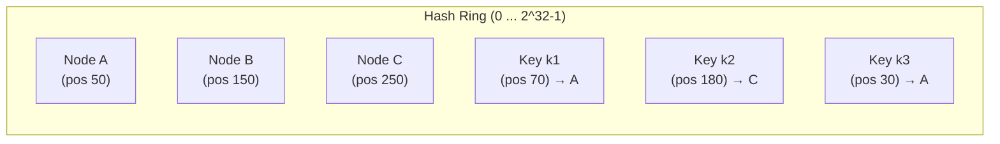
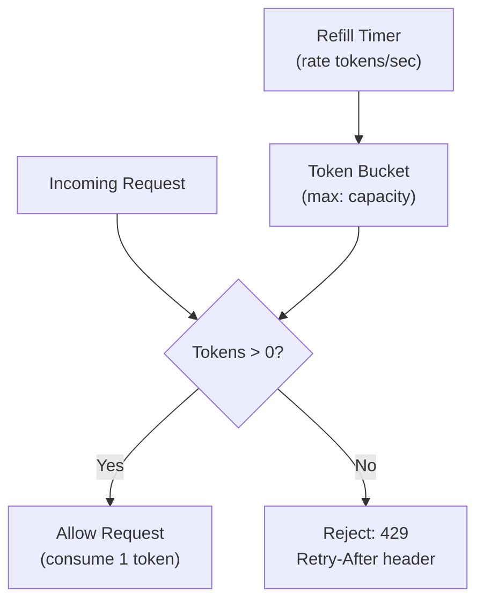

# 8. Consistent Hashing, Sharding, and Rate Limiting

> **TL;DR:** Consistent hashing minimises key redistribution when nodes join/leave (only K/N keys move vs K total); virtual nodes fix hot spots. Rate limiting protects services from abuse and overload — algorithm choice determines burst tolerance and memory cost.

**Interview weight:** P0 — both topics appear in nearly every senior system design interview.

---

## Core Concepts

- **Sharding** — horizontal partitioning of data across multiple nodes.
- **Hash-mod sharding** — `nodeIndex = hash(key) % N`; simple, but adding a node reshuffles `(N-1)/N` keys.
- **Consistent hashing** — maps both keys and nodes onto a hash ring; only K/N keys migrate when a node is added/removed.
- **Virtual nodes (vnodes)** — each physical node owns multiple positions on the ring; improves load balance.
- **Rate limiting** — controls the rate of requests a client can make; protects services from abuse and overload.
- **Token bucket** — tokens accumulate up to a burst capacity; each request consumes a token.
- **Leaky bucket** — requests queue; processed at a constant drain rate; excess overflows.

---

## Hash-Mod Sharding — The Problem

With `N=4` nodes and `hash(key) % 4`:
- Adding a 5th node: `hash(key) % 5` — ~80% of keys map to a different node.
- All clients must be updated simultaneously or serve stale data.
- Forces expensive mass migration/rebalancing.

---

## Consistent Hashing — Step by Step



1. Hash ring spans `[0, 2^32)`.
2. Hash each node name: `hash("NodeA") = 50` → place on ring.
3. Hash each key: `hash("k1") = 70` → walk clockwise → first node encountered owns it.
4. **Add Node D at position 100**: only keys in `(50, 100]` move from A to D — approximately `K/N` keys.
5. **Remove Node B at position 150**: its keys move to C (next clockwise) — again `K/N` keys.

**Math:** With N nodes and K keys, adding/removing one node moves `K/N` keys (optimal). Hash-mod moves `K·(N-1)/N`.

### Virtual Nodes

- Each physical node gets V positions on the ring (e.g. V=150).
- `hash("NodeA-1")`, `hash("NodeA-2")` ... `hash("NodeA-150")`.
- Benefits: even load distribution despite unequal node capacities; smaller segments per node failure.
- Trade-off: more memory for the ring data structure; slightly more routing hops.

---

## Consistent Hashing Alternatives

| Algorithm | How it works | Pros | Cons | Use case |
|---|---|---|---|---|
| **Consistent Hashing** | Ring + clockwise walk | Low key movement on change | Hot spots if few nodes; needs vnodes | General distributed KV, CDN |
| **Rendezvous Hashing** | Score = `hash(node, key)`; pick node with highest score | No ring; deterministic; elegant | O(N) lookup without index | CDN routing, proxy selection |
| **Jump Hash** | `ch(key, N)` — deterministic bucket with minimal migration | O(ln N) time; tiny memory | Only works for fixed N (monotonic add) | Stateless sharding, no removal |
| **Maglev Hashing** | Permutation table per node; consistent preference list | Very low disruption; Google-scale | Complex setup | Google's load balancer, eBPF |

---

## Where Consistent Hashing Is Used

| System | Implementation | Notes |
|---|---|---|
| **Redis Cluster** | 16 384 hash slots; slots assigned to nodes | CRC16(key) % 16384; not pure CH but slot-based |
| **Apache Cassandra** | Virtual nodes on token ring | Murmur3 hash; configurable vnodes |
| **Amazon DynamoDB** | Consistent hashing internally | Abstracted from users; auto-rebalancing |
| **CDNs (Azure Front Door)** | Consistent hashing for origin selection | Sticky requests to same origin |
| **Azure Service Bus** | Partition key → partition mapping | Session-based FIFO per key |

---

## Hot-Key / Celebrity Problem

Problem: popular keys (celebrity user, viral content) overwhelm a single node.

Mitigations:
1. **Key salting** — append a random suffix `1..R` to the key; fan read to R replicas and aggregate: `GET user:123:shard1 ... user:123:shardR`.
2. **Hot-key replication** — replicate hot data to N nearest nodes; read from any, write to all.
3. **Local in-process caching** — L1 cache in each service instance for top-N hot keys with short TTL (e.g. 100 ms). Reduces remote calls by 95%.
4. **Read replicas** — for read-heavy keys, add dedicated read replicas; route reads to them.
5. **Detection** — monitor with Azure Monitor / Application Insights; alert on `cache_miss_rate` per key prefix.

---

## Sharding Strategies Recap

See [Sharding, Partitioning and Replication](../04-Databases/05-Sharding-Partitioning-and-Replication.md) for full coverage.

| Strategy | Distribution | Pros | Cons |
|---|---|---|---|
| Range sharding | By key range | Range scans efficient | Hot ranges (sequential IDs) |
| Hash sharding | `hash(key) % N` | Even distribution | No range scans; reshuffles on resize |
| Consistent hashing | Ring-based | Minimal rebalancing | More complex routing |
| Directory sharding | Lookup table | Flexible routing | Single point of failure (directory) |
| Geo sharding | By geography | Data residency compliance | Cross-region queries slow |

---

## Resharding / Rebalancing Playbook

1. **Double-write** — write to old and new shard mapping simultaneously.
2. **Backfill** — copy existing data to new nodes in background.
3. **Cutover** — atomic switch of routing table (consistent hashing ring or slot assignment).
4. **Verify** — validate checksums; compare sample reads from old vs new.
5. **Drain old nodes** — serve reads from old until TTL/cache expires; then decommission.
6. **Monitor** — watch error rates, latency, CPU during transition.

Redis Cluster slot migration: `CLUSTER SETSLOT <slot> MIGRATING <target>` + `MIGRATE` commands; handled by `redis-cli --cluster rebalance`.

---

## Rate Limiting Algorithms

### Token Bucket

- Bucket holds up to `capacity` tokens. Tokens refill at `rate` per second.
- Each request consumes 1 token (or N for heavier ops).
- If bucket empty → reject with 429.
- Allows bursting up to `capacity` then throttles to `rate`.

### Leaky Bucket

- Requests enter a FIFO queue; processed at fixed `rate`.
- Queue full → reject.
- Smooths out bursts; no burst tolerance past queue size.

### Fixed Window Counter

- Counter per client per window (e.g. 1-minute buckets).
- Simple; but burst attack at window boundary: `2×limit` requests allowed (end of window N + start of window N+1).

### Sliding Window Log

- Store timestamp of each request in sorted set.
- On each request: remove entries outside window; count remaining; if `< limit` → allow.
- Accurate; high memory: `O(requests in window)` per user.

### Sliding Window Counter

- Approximate sliding window using two fixed buckets: `current = current_count + prev_count × (1 - elapsed/window)`.
- Memory: O(1) per user; accuracy ~0.1% error in practice.

### Algorithm Comparison

| Algorithm | Memory cost | Burst handling | Accuracy | Implementation |
|---|---|---|---|---|
| **Token bucket** | O(1) per user | Allows bursts up to capacity | Exact | Refill counter + timestamp |
| **Leaky bucket** | O(queue size) | Queues; smooths burst | Exact | FIFO queue drain |
| **Fixed window** | O(1) per user | Vulnerable to boundary burst | Exact within window | Counter + reset timer |
| **Sliding window log** | O(N) per user | Precise | Exact | Sorted set of timestamps |
| **Sliding window counter** | O(1) per user | Approx. burst handling | ~99.9% | Two counters + interpolation |

---

## C# — Token Bucket

```csharp
public class TokenBucket
{
    private double _tokens;
    private DateTimeOffset _lastRefill;
    private readonly double _capacity;
    private readonly double _refillRate; // tokens per second
    private readonly object _lock = new();

    public TokenBucket(double capacity, double refillRate)
        => (_capacity, _refillRate, _tokens, _lastRefill) = (capacity, refillRate, capacity, DateTimeOffset.UtcNow);

    public bool TryConsume(double requested = 1)
    {
        lock (_lock)
        {
            var now = DateTimeOffset.UtcNow;
            var elapsed = (now - _lastRefill).TotalSeconds;
            _tokens = Math.Min(_capacity, _tokens + elapsed * _refillRate);
            _lastRefill = now;

            if (_tokens < requested) return false;
            _tokens -= requested;
            return true;
        }
    }
}
```

## C# — Sliding Window Counter (Redis-backed)

```csharp
// Uses two Redis keys: current-minute bucket and previous-minute bucket
public async Task<bool> IsAllowedAsync(string clientId, int limitPerMinute)
{
    var now = DateTimeOffset.UtcNow;
    var currentWindow = now.ToString("yyyyMMddHHmm");
    var prevWindow = now.AddMinutes(-1).ToString("yyyyMMddHHmm");
    var elapsed = now.Second / 60.0; // fraction of current minute elapsed

    var current = await _redis.StringIncrementAsync($"rl:{clientId}:{currentWindow}");
    if (current == 1)
        await _redis.KeyExpireAsync($"rl:{clientId}:{currentWindow}", TimeSpan.FromMinutes(2));

    var prev = (long?)await _redis.StringGetAsync($"rl:{clientId}:{prevWindow}") ?? 0;
    var estimated = prev * (1 - elapsed) + current;
    return estimated <= limitPerMinute;
}
```

---

## Distributed Rate Limiting with Redis

### Atomic Lua Script (race-condition safe)

```lua
-- KEYS[1] = rate limit key, ARGV[1] = limit, ARGV[2] = window_seconds
local current = redis.call("INCR", KEYS[1])
if current == 1 then
    redis.call("EXPIRE", KEYS[1], ARGV[2])
end
if current > tonumber(ARGV[1]) then
    return 0  -- rejected
end
return 1  -- allowed
```

- Atomicity of `INCR` + `EXPIRE` in a Lua script prevents the TOCTOU race (`INCR` between two requests before `EXPIRE` is set).
- **Race condition without Lua**: two requests simultaneously see `current=0`, both `INCR` to 1, only one sets `EXPIRE` → key never expires → permanent block.

### Redis INCR + EXPIRE pitfall (non-atomic)

```
T1: GET rl:user1 → 0 (miss)
T2: GET rl:user1 → 0 (miss)
T1: INCR → 1; SET EXPIRE 60
T2: INCR → 2; EXPIRE already set — OK in this case
-- But if T1 crashes between INCR and EXPIRE → key persists forever
```

Solution: always use Lua or `SET key 0 NX EX 60` + `INCR` (conditional set).

---

## Per-User vs Per-IP vs Per-API-Key vs Global Limits

| Scope | Key | Pros | Cons |
|---|---|---|---|
| Per-user | `userId` | Fine-grained; fair | Requires auth before limiting |
| Per-IP | `ip` | No auth needed; stops bots | NAT: many users share IP; IPv6 range attacks |
| Per-API-key | `apiKey` | Good for B2B quotas | Key theft → limit consumed by attacker |
| Global | `service:endpoint` | Protects backend capacity | Noisy neighbours unfairly throttled |

Best practice: **layer all four** — global limit first (shed load), then per-API-key, then per-user.

---

## Response Headers and Client Handling

Standard headers:
- `X-RateLimit-Limit: 1000` — max requests per window.
- `X-RateLimit-Remaining: 42` — remaining in current window.
- `X-RateLimit-Reset: 1718000000` — Unix timestamp when window resets.
- `Retry-After: 30` — seconds until client should retry (on 429).
- HTTP status: `429 Too Many Requests`.

### Exponential Backoff with Full Jitter (client-side)

```csharp
// delay = random(0, min(cap, base * 2^attempt))
double ExponentialBackoffWithJitter(int attempt, double cap = 30, double baseDelay = 0.5)
    => Random.Shared.NextDouble() * Math.Min(cap, baseDelay * Math.Pow(2, attempt));
```

Full jitter prevents retry storms (all clients retrying simultaneously after 429 wave).

---

## Throttling vs Rate Limiting vs Load Shedding vs Quota

| Mechanism | Triggers | Response | Scope |
|---|---|---|---|
| **Rate limiting** | Request rate per client | 429 immediately | Per client |
| **Throttling** | System load / CPU / queue depth | Slow down or queue | System-wide |
| **Load shedding** | Overload; upstream pressure | Drop lowest-priority requests | Service-wide |
| **Quota** | Cumulative usage over period (monthly) | 429 or billing charge | Per tenant / plan |

---

## .NET 8 `AddRateLimiter`

```csharp
// Program.cs
builder.Services.AddRateLimiter(options =>
{
    options.GlobalLimiter = PartitionedRateLimiter.Create<HttpContext, string>(ctx =>
        RateLimitPartition.GetSlidingWindowLimiter(
            partitionKey: ctx.User.Identity?.Name ?? ctx.Request.Headers.Host.ToString(),
            factory: _ => new SlidingWindowRateLimiterOptions
            {
                PermitLimit = 100,
                Window = TimeSpan.FromMinutes(1),
                SegmentsPerWindow = 6,
                QueueProcessingOrder = QueueProcessingOrder.OldestFirst,
                QueueLimit = 10
            }));
    options.RejectionStatusCode = 429;
    options.OnRejected = async (ctx, ct) =>
    {
        ctx.HttpContext.Response.Headers["Retry-After"] = "10";
        await ctx.HttpContext.Response.WriteAsync("Rate limit exceeded.", ct);
    };
});

app.UseRateLimiter();
```

---

## Token Bucket Diagram



---

## Trade-offs & When to Use

- **Token bucket** — default for APIs; allows bursts; use Redis for distributed.
- **Sliding window counter** — better than fixed window; same O(1) memory; use when boundary burst is unacceptable.
- **Sliding window log** — use only when exact accuracy is critical and user count is small (memory cost).
- **Consistent hashing** — use whenever adding/removing nodes must not cause mass cache invalidation (Redis Cluster, CDN, session routing).
- **Virtual nodes** — always enable (V≥100) for even distribution; critical when node capacities differ.

---

## Common Pitfalls

- **Not using atomic Lua** for distributed rate limiting → race condition allows bursts through.
- **Fixed window boundary attacks** — sending `2×limit` requests straddling window boundary.
- **Forgetting `Retry-After` header** — clients retry immediately → amplifies load.
- **Consistent hashing without virtual nodes** — uneven ring segments cause hot nodes.
- **Rate limiting at the application tier only** — bypass by hitting multiple instances; must be at a shared store (Redis) or API gateway layer.
- **Quota vs rate limit confusion** — quota is cumulative (monthly cap); rate limit is instantaneous rate.

---

## Interview Questions

**Q1. Why does hash-mod sharding fail when adding a node?**
A: `hash(key) % N` changes for nearly every key when N changes. Adding a 5th node to 4-node cluster reshuffles `~80%` of keys. Requires mass data migration, coordinated cache invalidation, or downtime.

**Q2. Explain consistent hashing and how it minimises reshuffling.**
A: Keys and nodes are placed on a hash ring. A key maps to the first node clockwise from its position. When a node is added/removed, only `K/N` keys (one slot's worth) need to move — all others stay on their current node.

**Q3. What are virtual nodes and why are they important?**
A: Each physical node gets V positions on the ring. Evens out load (avoids hot sectors), gracefully handles nodes with different capacities (proportional to V), and distributes impact of failures. Trade-off: more memory for ring metadata.

**Q4. How does Redis Cluster implement sharding?**
A: 16 384 hash slots; `slot = CRC16(key) % 16384`. Slots are assigned to nodes. A `MOVED` redirect tells clients the slot's owner. This is a form of consistent hashing where slots (not keys) map to nodes.

**Q5. Compare token bucket and leaky bucket for API rate limiting.**
A: Token bucket allows bursts up to capacity then enforces steady rate — good for most APIs where occasional spikes are acceptable. Leaky bucket enforces a constant output rate — better when downstream systems can't handle any burst (e.g., payment gateway). Token bucket is far more common.

**Q6. What is the sliding window counter approximation and how accurate is it?**
A: `estimated = prev_count × (1 - elapsed_fraction) + current_count`. It interpolates between two fixed windows. Error is ~0.1% in practice under uniform distribution. Requires O(1) memory vs O(N) for exact sliding window log — significant at millions of users.

**Q7. How do you implement distributed rate limiting with Redis without race conditions?**
A: Use an atomic Lua script: `INCR key; if key == 1 then EXPIRE key window end; return count <= limit`. Atomicity is guaranteed by Redis single-threaded execution. Non-atomic `INCR` + `EXPIRE` can leave a key with no expiry if the process crashes between calls.

**Q8. How would you rate limit at 5K RPS with multiple API Gateway instances?**
A: Centralised Redis store with atomic Lua script. Each gateway instance calls Redis on every request — adds ~0.5–1 ms latency. Alternatively, use Azure API Management with built-in rate limiting policies, which handles distributed counting internally. For extremely high throughput, use local approximate counting + periodic sync to Redis.

**Q9. What is the hot-key problem in consistent hashing and how do you solve it?**
A: A single key (e.g. celebrity profile, viral content) generates traffic orders of magnitude above average, overwhelming its single node. Solutions: key salting (shard the key into R sub-keys, fan out reads), local in-process L1 cache for top-N hot keys, or dedicated read replicas for known hot keys.

**Q10. Explain the difference between throttling, rate limiting, and load shedding.**
A: Rate limiting: enforce per-client request rate; reject with 429. Throttling: slow down processing when system is under load (may queue rather than reject). Load shedding: drop lowest-priority requests when at capacity to protect the service and higher-priority traffic.

**Q11. How would you design a rate limiter that differentiates between free and premium tiers?**
A: Partition rate limit keys by `{apiKey}:{tier}`. Store tier metadata in Redis (or look up from auth token). Apply different `PermitLimit` values based on tier. Premium gets higher limits and/or separate Redis key namespace that's not subject to global limits. Track quota (monthly) separately from rate (per-second) in different Redis keys.

**Q12. What are the trade-offs of per-IP vs per-user rate limiting?**
A: Per-IP is easier (no auth required) but breaks behind NAT (many users share one IP) and is bypassable with IPv6 ranges. Per-user is fairer and more accurate but requires authenticated requests, adds auth lookup overhead, and is ineffective against unauthenticated bots. Best practice: layer both.

**Q13. Walk through the resharding playbook for a Redis Cluster adding a node.**
A: 1) Add node to cluster. 2) Use `redis-cli --cluster rebalance` or manual `CLUSTER SETSLOT ... MIGRATING/IMPORTING`. 3) Redis migrates slots one at a time; `ASK` redirects serve migrating keys. 4) Client receives `MOVED` on next access after migration. 5) Monitor latency during migration (brief spikes expected). 6) Verify slot counts are balanced.

---

## Quick Recap

- **Hash-mod sharding**: simple but reshuffles `(N-1)/N` keys on resize — don't use for dynamic clusters.
- **Consistent hashing**: ring + clockwise walk; only `K/N` keys move on node change.
- **Virtual nodes**: V positions per physical node; critical for even distribution and failure isolation.
- **Redis Cluster**: 16 384 hash slots — effectively consistent hashing at the slot level.
- **Hot keys**: salt the key into R shards + L1 in-process cache for top-N; detect via Azure Monitor.
- **Token bucket**: O(1) memory, burst-tolerant, most common for REST APIs.
- **Sliding window counter**: O(1) memory, ~99.9% accurate — better than fixed window for boundary attacks.
- **Distributed rate limiting**: atomic Lua in Redis; always set `Retry-After`; layer global + per-user + per-key.
- **.NET 8**: `AddRateLimiter` with `PartitionedRateLimiter` supports token bucket, fixed window, sliding window, concurrency limiters out of the box.
