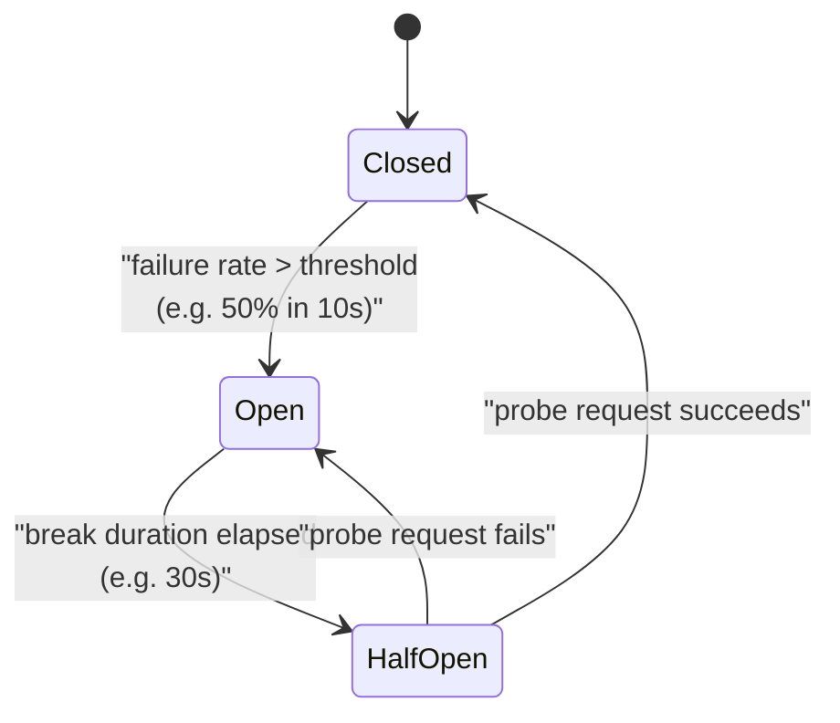
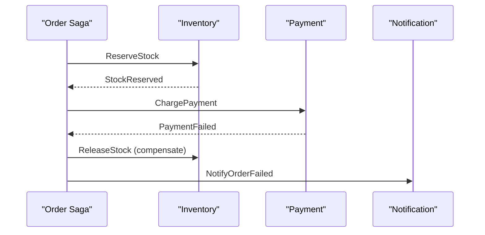
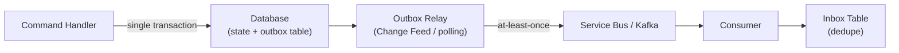

# 9. Distributed Systems Patterns

> **TL;DR:** A catalogue of battle-tested patterns for building resilient distributed systems — each solving a specific failure mode with concrete trade-offs. Master these before any senior system design interview.

**Interview weight:** P0 — distributed systems resilience is the deepest probe at senior/staff level; Polly, Cosmos DB, Service Bus, and Azure Blob lease are all on-resume.

---

## Core Concepts

- **Transient failure** — temporary, retryable: network blip, throttling, server restart.
- **Permanent failure** — non-retryable: 4xx, data corruption, business logic rejection.
- **Idempotency** — applying the same operation multiple times produces the same result.
- **Eventual consistency** — all replicas converge to the same value given enough time and no new writes.
- **Compensating transaction** — undoes the effects of a previous step when a saga fails.
- **Fencing token** — monotonically increasing token preventing stale lock holders from acting.

---

## Retries

**Problem:** Transient failures are inevitable in distributed systems; failing on first error wastes availability.

**Which errors are retryable:**

| Retryable | Not Retryable |
|---|---|
| `503 Service Unavailable` | `400 Bad Request` |
| `429 Too Many Requests` | `401 Unauthorized` |
| `500 Internal Server Error` (idempotent ops) | `404 Not Found` |
| Network timeouts | `409 Conflict` (usually) |
| `HttpRequestException` (transient) | `422 Unprocessable Entity` |

**Exponential Backoff with Full Jitter (recommended):**

`delay = random(0, min(cap, base × 2^attempt))`

```csharp
// Polly v8 — AddResilienceHandler
services.AddHttpClient<ICatalogClient, CatalogClient>()
    .AddResilienceHandler("catalog-pipeline", builder =>
    {
        builder.AddRetry(new HttpRetryStrategyOptions
        {
            MaxRetryAttempts = 4,
            BackoffType = DelayBackoffType.Exponential,
            UseJitter = true,      // full jitter prevents synchronized retry storms
            Delay = TimeSpan.FromMilliseconds(200),
            ShouldHandle = args => args.Outcome switch
            {
                { Exception: HttpRequestException } => PredicateResult.True(),
                { Result.StatusCode: HttpStatusCode.ServiceUnavailable } => PredicateResult.True(),
                { Result.StatusCode: HttpStatusCode.TooManyRequests } => PredicateResult.True(),
                _ => PredicateResult.False()
            }
        });
    });
```

**Retry storms:** All clients retry simultaneously after an outage → amplify load on recovering service.
Mitigations: full jitter, circuit breaker to halt retries, exponential cap (`≤ 30 s`).

**Retry budget:** Limit total retry time per request chain (e.g. overall timeout = 5 s); don't retry when caller's `CancellationToken` is already cancelled.

---

## Timeouts

**Problem:** Without a timeout, a slow downstream holds a thread/connection indefinitely → resource exhaustion.

**Why every network call needs one:**
- A stalled DB connection holds a thread from the thread pool.
- At 5K RPS, even 0.1% hung requests = 5 stuck threads; thread pool exhaustion in seconds.

**Timeout budgets across hops:**
- Set timeouts at every layer: HTTP client, DB command, Redis `connectTimeout`, etc.
- Outer timeout must be > sum of inner timeouts + retry delays; otherwise outer cancels before inner retries finish.
- Typical budget: Client 10 s → API Gateway 8 s → Service A 5 s → DB 2 s.

```csharp
// CancellationToken propagation — chain from HTTP request all the way down
app.MapPost("/orders", async (OrderRequest req, IOrderService svc, CancellationToken ct) =>
{
    using var timeout = CancellationTokenSource.CreateLinkedTokenSource(ct);
    timeout.CancelAfter(TimeSpan.FromSeconds(5));
    var result = await svc.CreateOrderAsync(req, timeout.Token);
    return Results.Ok(result);
});
```

Always pass `CancellationToken` through every `async` call; propagate from the HTTP request token via `CreateLinkedTokenSource` to enforce end-to-end timeout.

---

## Circuit Breaker

**Problem:** Retrying into a broken downstream amplifies load and delays failure detection.

**States:**



- **Closed** — requests pass through; failures tracked.
- **Open** — all requests fail fast (no network call); upstream gets immediate error.
- **Half-Open** — one probe request allowed; determines whether to close or stay open.

**Thresholds:** minimum throughput (e.g. ≥ 20 requests) before evaluating failure rate; avoids tripping on cold start.

```csharp
builder.AddResilienceHandler("catalog-pipeline", pipeline =>
{
    pipeline.AddCircuitBreaker(new HttpCircuitBreakerStrategyOptions
    {
        FailureRatio = 0.5,
        SamplingDuration = TimeSpan.FromSeconds(10),
        MinimumThroughput = 20,
        BreakDuration = TimeSpan.FromSeconds(30)
    });
    pipeline.AddRetry(retryOptions); // retries inside circuit breaker
});
```

---

## Bulkhead Isolation

**Problem:** One slow downstream consumes all shared resources (thread pool, connection pool), starving other paths.

**Solution:** Allocate dedicated resource pools per dependency.

```csharp
// Separate HttpClient per downstream — each has its own connection pool
services.AddHttpClient<IPaymentClient, PaymentClient>(c => c.BaseAddress = new Uri(paymentUrl));
services.AddHttpClient<IInventoryClient, InventoryClient>(c => c.BaseAddress = new Uri(inventoryUrl));
```

For concurrency bulkhead with Polly v8: `AddConcurrencyLimiter(maxConcurrent: 10, queueLimit: 5)`.

---

## Fallback / Graceful Degradation

**Solution:** When primary path fails, return a safe default or cached value rather than an error.

```csharp
pipeline.AddFallback(new FallbackStrategyOptions<IReadOnlyList<Product>>
{
    ShouldHandle = args => args.Outcome.Exception is not null ? PredicateResult.True() : PredicateResult.False(),
    FallbackAction = _ => Outcome.FromResultAsValueTask<IReadOnlyList<Product>>(Array.Empty<Product>())
});
```

Patterns: stale cache, empty collection, feature flag off, read from replica, degrade to simpler algorithm.

---

## Idempotency

**Problem:** At-least-once delivery means consumers may process the same message multiple times.

- **Natural idempotency** — `UPSERT`, `SET key=value`, `DELETE IF EXISTS` — safe to repeat.
- **Non-natural** — `INSERT` with auto-increment, `balance += 10` — not safe without guard.

**Idempotency key pattern:**

```csharp
public async Task<OrderResult> CreateOrderAsync(CreateOrderCommand cmd, CancellationToken ct)
{
    // check dedupe store first
    var existing = await _db.IdempotencyKeys.FindAsync(cmd.IdempotencyKey, ct);
    if (existing is not null) return existing.CachedResult; // replay same response

    var result = await _orderRepo.CreateAsync(cmd, ct);
    await _db.IdempotencyKeys.AddAsync(new IdempotencyRecord(cmd.IdempotencyKey, result), ct);
    await _db.SaveChangesAsync(ct);
    return result;
}
```

- Store `idempotencyKey` + `cachedResponse` in DB (TTL 24 h).
- Dedupe store must be in same transaction as the operation (or use outbox pattern).
- **At-least-once delivery + idempotent consumer = effectively-once**.

---

## Saga Pattern

**Problem:** Long-running transactions span multiple services; no global ACID transaction.

**Solution:** Sequence of local transactions; each failure triggers compensating transactions.

### Order Saga — Orchestration with Failure/Compensation



```csharp
// Durable Functions orchestration (Azure)
[FunctionName("OrderSaga")]
public async Task RunAsync([OrchestrationTrigger] IDurableOrchestrationContext ctx)
{
    var order = ctx.GetInput<Order>();
    try
    {
        await ctx.CallActivityAsync("ReserveStock", order);
        await ctx.CallActivityAsync("ChargePayment", order);
        await ctx.CallActivityAsync("SendConfirmation", order);
    }
    catch (FunctionFailedException)
    {
        await ctx.CallActivityAsync("ReleaseStock", order);   // compensate
        await ctx.CallActivityAsync("NotifyOrderFailed", order);
    }
}
```

### Saga vs 2PC

| Aspect | Saga | 2PC (Two-Phase Commit) |
|---|---|---|
| Consistency | Eventual (compensatable) | Strong (atomic) |
| Availability | High (no resource lock) | Lower (blocks resources) |
| Coupling | Services independent | Requires coordinator |
| Failure handling | Compensating transactions | Abort + rollback |
| Scale | Scales horizontally | Coordinator bottleneck |
| Use case | Microservices, async | Same-DB or strong ACID needs |

**Semantic lock / commutative updates** — design operations to be commutative (order doesn't matter) or use semantic locks (soft reservations) to reduce compensation complexity.

---

## Transactional Outbox and Inbox

**Outbox Problem:** Writing to DB and publishing an event are two operations — either can fail.



- **Outbox**: write domain state + unpublished event in same DB transaction. Relay reads outbox and publishes to bus. Guarantees at-least-once event delivery.
- **Inbox**: consumer writes `messageId` to an inbox table in same transaction as processing. Provides exactly-once processing.
- Azure implementation: Cosmos DB Change Feed (outbox relay) + Redis SET NX / Cosmos upsert (inbox dedupe).

---

## Leader Election

**Problem:** Only one instance should run a job/hold a lock at a time; instances must agree on who the leader is.

| Mechanism | Azure | OSS | Notes |
|---|---|---|---|
| **Blob lease** | Azure Blob Storage `AcquireLeaseAsync` | — | 15–60 s lease; renew on interval; fast fail if renew fails |
| **etcd** | — | etcd `Grant + Put` | Strong consistency (Raft) |
| **ZooKeeper** | — | ZK ephemeral nodes | Mature; complex ops |
| **Redis TTL** | Azure Cache for Redis | Redis `SET NX EX` | Simpler; slightly weaker (no Raft) |

**Fencing tokens** — leader gets monotonically increasing token; storage system rejects writes with older tokens. Prevents split-brain writes from a previous leader that was slow (not dead).

```csharp
// Azure Blob Lease — leader election
var blobClient = container.GetBlobClient("leader-lock");
var lease = blobClient.GetBlobLeaseClient(Guid.NewGuid().ToString());
try
{
    var response = await lease.AcquireAsync(TimeSpan.FromSeconds(30), cancellationToken: ct);
    // We are the leader
    while (!ct.IsCancellationRequested)
    {
        await DoLeaderWorkAsync(ct);
        await lease.RenewAsync(cancellationToken: ct); // renew before expiry
    }
}
catch (RequestFailedException ex) when (ex.Status == 409)
{
    // Another instance holds the lease — follower role
}
```

---

## Distributed Locks

**Problem:** Mutual exclusion across processes.

| Mechanism | Pros | Cons |
|---|---|---|
| **Redis SETNX + TTL** | Simple; fast (~0.5 ms) | Single Redis node = SPOF; no fencing |
| **Redlock** (multi-node) | Tolerates N/2-1 failures | Critique: unsafe under clock skew / GC pauses (Kleppmann) |
| **Azure Blob Lease** | Fully managed; HA; fencing | Slower (HTTP, ~20 ms); 15 s min TTL |
| **etcd/ZooKeeper** | Strong consistency; fencing | Ops complexity |

**Kleppmann's Redlock critique:** GC pause or clock drift can cause a client to believe it holds the lock after the TTL has expired and another client acquired it. Use **fencing tokens** (storage rejects stale-token writes) if lock correctness is critical to data integrity.

**When NOT to use a lock for correctness:** If the locked operation is not idempotent, a lock expiry + retry creates duplicate side-effects. Prefer idempotent design + optimistic concurrency (`_etag` / row version) over locks for data mutations.

---

## Distributed Transactions Alternatives

Prefer over 2PC:
- **Saga** — for multi-service workflows with compensations.
- **Outbox + idempotent consumer** — for event publishing + DB write atomicity.
- **Optimistic concurrency** (`ETag`, `rowVersion`) — for single-entity concurrent writes.
- **CRDTs** — for commutative merge (shopping cart, counters).
- **Event sourcing** — append-only; conflicts resolved at projection time.

---

## Heartbeats and Failure Detection

- **Heartbeat** — periodic signal from a node confirming it is alive; absence → suspect failure.
- **Phi Accrual** — assigns a continuous suspicion level φ based on heartbeat inter-arrival distribution; threshold triggers failure declaration. More adaptive than fixed timeout.
- **Gossip protocol** — nodes randomly exchange state with peers; O(log N) rounds to propagate membership changes. Used in Cassandra, Redis Cluster, Consul.

---

## Quorum

- N total replicas; write quorum W; read quorum R.
- Strong consistency: `R + W > N` (e.g. N=3, W=2, R=2).
- Tunable: lower W for write performance (W=1), raise R for read consistency.
- Cosmos DB consistency levels map to quorum settings internally.

---

## Write-Ahead Log (WAL)

- Changes written to a durable sequential log before being applied to data structures.
- Enables crash recovery: replay log to reconstruct state.
- Used in: SQL Server transaction log, Postgres WAL, Cosmos DB, Kafka (its own log is the source of truth).

---

## Checkpointing

- Periodically save current state so replay only needs log entries after the checkpoint.
- Used in: Durable Functions (state checkpointed after each activity), stream processing (Kafka consumer offsets), event sourcing snapshots.

---

## Backpressure and Load Shedding

**Backpressure:** Signal from consumer to producer to slow down.
- `Channel<T>` with bounded capacity in .NET — `WriteAsync` blocks when full.
- HTTP: 503 + `Retry-After`; gRPC: flow control built in.
- Service Bus: message TTL, max delivery count as a natural back-pressure valve.

**Load shedding:** Drop requests when system is overloaded; prioritise high-value traffic.
- `.NET 8 RateLimiter` with `QueueLimit = 0` — immediate rejection when at capacity.
- Distinguish critical (payment) vs non-critical (analytics) traffic; shed non-critical first.

---

## Fan-Out / Fan-In and Scatter-Gather

- **Fan-out** — one request spawns N parallel sub-requests.
- **Fan-in / Scatter-Gather** — collect and aggregate results from N parallel calls.

```csharp
// Scatter-Gather with timeout
var tasks = shards.Select(s => _client.QueryAsync(s, query, ct)).ToList();
var results = await Task.WhenAll(tasks); // fan-in; throws if any fails
// or with WhenEach / partial results using Task.WhenAny loop
```

---

## Sidecar / Ambassador

- **Sidecar** — auxiliary container (same pod) handling cross-cutting concerns: logging, mTLS, retries, metrics.
- **Ambassador** — a specialised sidecar proxy (Envoy/Nginx) that manages outbound communication.
- Used in service mesh (Istio/Linkerd); see [Microservices Architecture](10-Microservices-Architecture.md).

---

## Strangler Fig Migration

- Incrementally migrate a monolith: route new traffic to new services while old routes remain.
- Use a facade/router to decide old vs new.
- See [Microservices Architecture](10-Microservices-Architecture.md#strangler-fig-migration).

---

## Anti-Corruption Layer (ACL)

- Translates between two domain models (e.g. legacy SOAP schema ↔ modern REST DTO).
- Prevents a legacy model's concepts from leaking into the new domain.
- Implemented as a translation service or adapter layer.

---

## Change Data Capture (CDC)

- Reads the DB write-ahead log or change feed to capture row-level changes in real time.
- Azure: **Cosmos DB Change Feed**, **Azure SQL CDC** (`sys.fn_cdc_get_all_changes_*`).
- OSS: **Debezium** (Kafka connector that reads Postgres/MySQL WAL).
- Use cases: outbox relay, event sourcing, real-time sync to search index, audit log.

---

## Cache Stampede Protection

See [Caching Strategies and Patterns](../08-Caching/01-Caching-Strategies-and-Patterns.md) for full coverage.

Summary: mutex/lock on cache miss (only one fetch), probabilistic early revalidation (PER — refresh before TTL expires probabilistically), background refresh, or request coalescing.

---

## Failure Symptom → Pattern Mapping

| Symptom | Pattern(s) to Apply |
|---|---|
| Downstream timeout / 503 | Retry + exponential backoff + circuit breaker |
| Thread pool exhaustion from one dependency | Bulkhead isolation (separate pools) |
| Cascading failure when downstream is slow | Circuit breaker + timeout + bulkhead |
| Duplicate message processing | Idempotency key + inbox pattern |
| DB write + event publish out of sync | Transactional outbox |
| Two services need same row at same time | Distributed lock (blob lease) or optimistic concurrency |
| Only one instance should run a job | Leader election (blob lease or etcd) |
| Multi-service business transaction failing midway | Saga + compensating transactions |
| All retrying clients overwhelm recovering service | Full jitter + circuit breaker |
| Hot partition / celebrity key | Key salting + local L1 cache |
| Slow consumer blocks producer | Backpressure (`Channel<T>` bounded) |
| Read model stale from projection lag | Version token + poll until caught up |
| Split-brain: two leaders writing | Fencing tokens + single writer principle |
| Legacy service coupling new domain | Anti-corruption layer |
| Gradual monolith migration | Strangler fig |

---

## Common Pitfalls

- **Retrying non-idempotent operations** — payment charged twice.
- **No jitter on retries** — thundering herd at recovery.
- **Circuit breaker without minimum throughput threshold** — trips on first cold-start error.
- **Distributed lock without fencing token** — stale leader writes after lease expires.
- **Saga without compensation** — partial state left in system.
- **Outbox without relay** — events never published despite being written.
- **CancellationToken not propagated** — timeout at outer layer doesn't cancel inner DB calls.
- **Bulkhead not configured** — all HttpClient instances share default connection pool.

---

## Interview Questions

**Q1. What is exponential backoff with full jitter and why is jitter important?**
A: `delay = random(0, min(cap, base × 2^attempt))`. Without jitter, all clients that failed simultaneously retry at the same intervals — synchronized retry storms re-amplify load. Full jitter spreads retries uniformly over the window, smoothing the recovery curve.

**Q2. Explain the circuit breaker pattern and its three states.**
A: Closed (normal operation), Open (fail fast — no network calls, based on failure rate threshold), Half-Open (one probe after break duration — if succeeds, close; if fails, reopen). Prevents retry storms into a broken downstream and enables fast failure detection.

**Q3. How does the transactional outbox pattern solve the dual-write problem?**
A: Write domain state and an unpublished event record to the same DB transaction — atomically. A relay process (Cosmos DB Change Feed / polling) reads the outbox and publishes to Service Bus. If the relay crashes, it replays from the last checkpoint. Guarantees at-least-once event delivery without distributed transactions.

**Q4. What is a fencing token and why do you need it with distributed locks?**
A: A monotonically increasing number issued with each lock grant. Downstream systems reject writes from lock holders presenting a lower token than the current maximum seen. Prevents a slow-network or GC-paused former leader from writing stale data after the lock was re-granted to a new leader.

**Q5. Compare saga pattern with 2PC for distributed transactions.**
A: 2PC requires a coordinator, locks resources across all participants until commit or abort — fragile, couples services, scales poorly. Sagas use local transactions + compensating transactions; each step is independent; services remain available during the saga. Trade-off: eventual consistency (not atomic) and compensation logic burden.

**Q6. How do you implement leader election in Azure without ZooKeeper?**
A: Azure Blob Lease: `AcquireLeaseAsync(duration: 30s)` — only one instance succeeds (409 if already held). Winner renews the lease on an interval; if renewal fails (node crashed), lease expires and another instance acquires it. Use fencing token (lease ETag or sequence number) if correctness requires preventing stale writes.

**Q7. What is Redlock and why is it controversial?**
A: Redlock acquires locks on N independent Redis nodes; succeeds if quorum `(N/2)+1` acquired within validity time. Kleppmann argues it's unsafe: GC pause or clock drift can cause the validity window to expire before the lock holder realises; another client acquires the lock → two clients act simultaneously. The counter: use fencing tokens, not just the lock, for write safety.

**Q8. How would you propagate CancellationToken across a multi-hop request chain?**
A: Thread the HTTP request's `CancellationToken` through `CreateLinkedTokenSource` at each layer, adding a layer-specific timeout. Pass to every `await` — `HttpClient.SendAsync`, `dbContext.SaveChangesAsync`, `redis.GetAsync`. When the outermost token fires, all inner operations cancel, freeing resources immediately rather than waiting for downstream timeouts.

**Q9. Describe backpressure in a producer-consumer pipeline and how you implement it in .NET.**
A: Backpressure signals the producer to slow when the consumer can't keep up. In .NET, `Channel.CreateBounded<T>(capacity)` — `WriteAsync` blocks (or throws `ChannelFullException`) when full, naturally pausing the producer. For HTTP, respond with `503 + Retry-After`. For gRPC, flow control is built into the protocol.

**Q10. What is the scatter-gather pattern and what are its failure modes?**
A: Fan out a query to N shards/services in parallel; aggregate results. Failure modes: if `Task.WhenAll` is used, a single failure aborts all results — consider partial result tolerance with timeout + `Task.WhenAny` loop or `CancellationTokenSource` deadline. Tail latency: the slowest shard dominates response time — use hedged requests (fire a second request if first hasn't responded within P99).

**Q11. You have a saga where payment succeeds but inventory reservation fails. What happens?**
A: The saga's compensation step fires: reverse the payment (issue refund or void the charge). If compensation itself fails, it is retried with exponential backoff. If compensation is permanently unavailable, the saga enters a "stuck" state — requires manual intervention or a dedicated compensation retry queue (dead-letter + alert). Design compensating transactions to be idempotent.

**Q12. How do you prevent a circuit breaker from tripping on a service cold start?**
A: Set `MinimumThroughput` (e.g. 20 requests in the sampling window) before the failure rate is evaluated. Polly v8's `HttpCircuitBreakerStrategyOptions.MinimumThroughput` prevents the breaker from opening based on 1 request failing during warm-up.

**Q13. Explain the difference between bulkhead isolation and circuit breaker.**
A: Circuit breaker detects failure rates over time and stops calls to a broken service. Bulkhead prevents one slow service from consuming all resources — it partitions resource pools (threads, connections, semaphore slots) per dependency. You need both: bulkhead limits blast radius while the circuit breaker is still closed; circuit breaker halts calls once failure is detected.

---

## Quick Recap

- **Retries**: full jitter exponential backoff; only retry transient/idempotent errors; respect `CancellationToken`.
- **Timeouts**: mandatory on every network call; budget outward > sum of inner calls + retry delays.
- **Circuit breaker**: Closed → Open (failure rate) → Half-Open (probe) → Closed; use `MinimumThroughput`.
- **Bulkhead**: separate `HttpClient` / connection pool per dependency; prevents cross-contamination.
- **Idempotency**: store idempotency key + cached response; at-least-once + idempotent = effectively-once.
- **Saga**: local transactions + compensating transactions; orchestration (Durable Functions) preferred for visibility.
- **Outbox**: write state + event in one DB transaction; relay publishes asynchronously — at-least-once guaranteed.
- **Leader election**: Azure Blob Lease is the simplest Azure-native option; always use fencing tokens.
- **Distributed lock**: prefer optimistic concurrency (`_etag`) over locks for data mutations; use blob lease when you need true mutual exclusion.
- **Failure → pattern**: timeout/503 → retry+CB; duplicate messages → idempotency; dual write → outbox; one-leader → lease+fencing; multi-service TX → saga.
