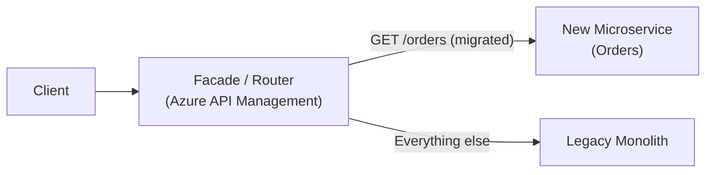
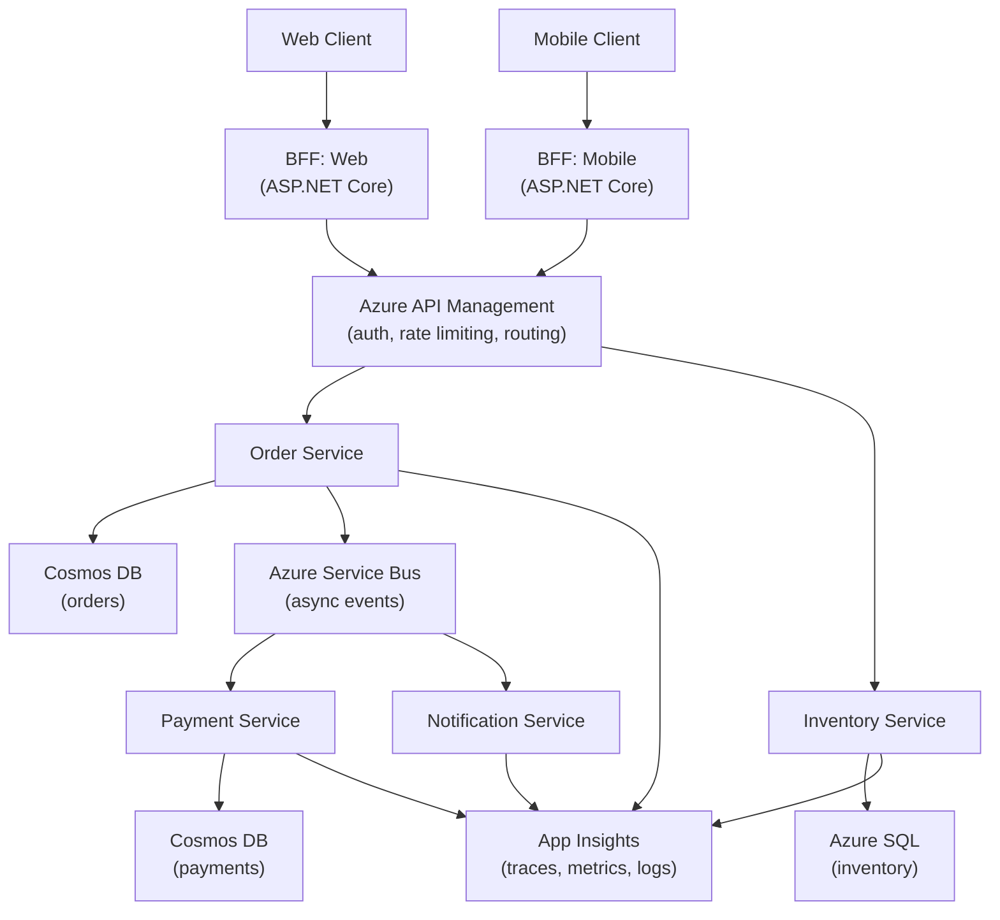

# 10. Microservices Architecture

> **TL;DR:** Microservices trade operational complexity for independent deployability, team autonomy, and targeted scaling. The hard problems are data consistency across services, inter-service communication resilience, and avoiding the distributed monolith anti-pattern.

**Interview weight:** P0 — your 600+ microservice org and News Feed platform are direct proof points; interviewers will probe decomposition, data consistency, and communication trade-offs.

---

## Core Concepts

- **Microservice** — independently deployable unit owning a single bounded context and its data.
- **Bounded context (DDD)** — explicit boundary within which a domain model is consistent.
- **Database per service** — each service owns its schema/DB; no shared tables.
- **Service mesh** — infrastructure layer handling mTLS, retries, load balancing, observability between services.
- **BFF (Backend for Frontend)** — API gateway variant tailored to a specific client type.
- **Strangler fig** — incremental migration: route new traffic to new service while old route remains.

---

## Monolith vs Modular Monolith vs Microservices vs SOA

| Aspect | Monolith | Modular Monolith | Microservices | SOA |
|---|---|---|---|---|
| Deployment unit | One binary | One binary, modules separated | Many binaries | Many services (often SOAP) |
| Team coupling | High | Moderate | Low | Moderate |
| Data isolation | Shared DB | Shared DB, separate schemas | DB per service | Often shared DB |
| Independent scaling | No | No | Yes | Partial |
| Network overhead | None | None | High | High |
| Operational complexity | Low | Low | Very high | High |
| Fault isolation | Poor | Moderate | Strong (if designed well) | Moderate |
| Best for | Early product, small team | Growing team, clear domains | Large org, autonomous teams | Enterprise integration |

### When a Monolith is the Right Answer

- < 5 engineers or < 3 clear domains.
- Speed of iteration matters more than independent scalability.
- Distributed transactions would dominate the codebase.
- Domain boundaries are not yet understood — split prematurely = wrong cuts.
- Rule of thumb: start with a modular monolith; extract to services when you feel the boundaries.

---

## Service Decomposition

**By business capability** — align service boundaries with what the business does (Orders, Inventory, Payments, Notifications). Stable, team-friendly.

**By DDD bounded context** — explicit language boundary; a "Customer" in Billing ≠ "Customer" in Shipping. Each context owns its model and vocabulary.

**By subdomain:**
- **Core** — competitive advantage; invest most engineering here.
- **Supporting** — needed but not differentiating; can use simpler patterns.
- **Generic** — commodity (auth, email); buy/use off-the-shelf.

### Sizing and the Distributed Monolith Anti-Pattern

**Distributed monolith** symptoms:
- Services must deploy together (shared libraries, DB schema coupling).
- Synchronous chains: A → B → C → D — latency adds up; cascading failures.
- Chatty: 100s of calls between services per user request.
- Shared database across services.

**Right size**: service should be changeable and deployable by one team without coordinating with others. Size by team ownership, not lines of code.

---

## Database per Service vs Shared Database

| Aspect | DB per Service | Shared Database |
|---|---|---|
| Data isolation | Strong | None |
| Independent scaling | Yes | No |
| Cross-service queries | Via API composition or CQRS | Direct SQL join |
| Consistency | Eventual (saga/outbox) | ACID joins available |
| Schema changes | Independent | Requires coordination |
| Operational cost | High (N databases) | Low |
| Anti-pattern risk | — | Integration database (tight coupling) |

---

## Data Consistency Across Services

| Pattern | How | Consistency | Complexity |
|---|---|---|---|
| **Saga** | Choreography or orchestration + compensation | Eventual | High |
| **Transactional Outbox** | Write state + event in same DB TX | At-least-once event delivery | Medium |
| **CDC (Change Data Capture)** | Debezium/Change Feed reads DB log | Near-real-time eventual | Medium |
| **API Composition** | Orchestrating service queries N services, merges | Eventual | Medium |
| **CQRS Read Model** | Projection from events; optimised for reads | Eventual | High |

---

## Querying Across Services

| Pattern | How | Pros | Cons |
|---|---|---|---|
| **API Composition** | Caller queries multiple services, merges in memory | Simple; no extra infra | Latency adds; caller couples to N services |
| **CQRS Materialized View** | Event-driven projection builds a denormalised read store | Fast queries; decoupled | Eventual consistency; projection maintenance |
| **GraphQL Federation** | Schema stitching across services | Flexible client queries | Complex gateway; schema governance |
| **Direct DB read (read replica)** | Read-only cross-service DB access | Simple | Tight coupling; breaks DB-per-service |

---

## Inter-Service Communication Comparison

| Aspect | REST (HTTP/1.1) | gRPC (HTTP/2) | GraphQL | Messaging (Service Bus/Kafka) |
|---|---|---|---|---|
| Transport | HTTP/1.1 | HTTP/2 (binary frames) | HTTP/1.1 or 2 | AMQP / proprietary |
| Contract | OpenAPI (optional) | Protobuf (mandatory) | GraphQL schema | Schema registry (optional) |
| Streaming | No (WebSockets separate) | 4 modes (unary, server, client, bidi) | Subscriptions (WS) | Native (Kafka, Event Hubs) |
| Browser support | Yes | No (grpc-web needed) | Yes | No |
| Latency | ~10–50 ms (connection overhead) | ~2–10 ms (multiplexed) | ~10–50 ms | 10–100 ms (broker) |
| Versioning | URL or header | Proto field numbering | Schema evolution (additive) | Message schema versioning |
| Payload size | JSON (verbose) | Protobuf (~5–10× smaller) | JSON | JSON / Avro / Protobuf |
| Load balancing | L7; any LB | L7; requires gRPC-aware LB | L7 | Broker handles |
| Tooling | Excellent; universal | Good; growing | Good; Apollo | Excellent (Service Bus Explorer) |
| When to use | Public API, simple sync | Internal sync, high-freq, mobile | Client-specific queries | Async workflows, fan-out |

---

## gRPC Details

- **Protobuf** — binary IDL; defines messages and services; generates client/server code.
- **4 call types**: Unary, Server Streaming, Client Streaming, Bidirectional Streaming.
- **Deadlines** — every gRPC call should set a deadline; no default timeout.
- **Interceptors** — middleware for logging, auth, retry, correlation ID propagation.

```csharp
// gRPC client with deadline and interceptor (C#)
var channel = GrpcChannel.ForAddress("https://inventory:5001");
var client = new Inventory.InventoryClient(channel);

var deadline = DateTime.UtcNow.AddSeconds(3);
var response = await client.CheckStockAsync(
    new StockRequest { ProductId = "abc" },
    deadline: deadline,
    cancellationToken: ct);
```

```protobuf
// inventory.proto
syntax = "proto3";
service Inventory {
    rpc CheckStock (StockRequest) returns (StockResponse);
    rpc WatchStock (StockRequest) returns (stream StockUpdate);
}
message StockRequest { string product_id = 1; }
message StockResponse { int32 quantity = 1; }
message StockUpdate { string product_id = 1; int32 delta = 2; }
```

---

## Synchronous Chains and Cascading Failures

- A → B → C → D: if D has P(failure)=1%, chain failure = ~4%.
- Each hop multiplies latency; P99 tail latency dominates.
- Mitigations: circuit breaker at each hop, timeout budget, bulkhead, async where possible.

---

## Service Mesh vs Library-Based Resilience

| Aspect | Service Mesh (Istio/Linkerd) | Library-Based (Polly) |
|---|---|---|
| Language agnostic | Yes (sidecar proxy) | No (per language/framework) |
| Deployment complexity | High (sidecar injection, control plane) | Low (NuGet package) |
| mTLS | Automatic | Manual certificate management |
| Traffic shifting | Built in (canary, A/B) | Not available |
| Observability | Automatic metrics/traces | Manual instrumentation |
| Retry/CB | Configured at mesh level | Configured in code |
| When to use | Large multi-language org, K8s-native | Single-language teams, simpler ops |

Azure equivalent: **Azure Service Mesh** (preview) or Dapr (application-level service mesh, OSS).

---

## API Gateway vs BFF

| Aspect | API Gateway | BFF |
|---|---|---|
| Purpose | Unified entry point; auth, routing, rate limiting | Tailored API for one client type |
| Clients served | All clients | One client (mobile, web, TV) |
| Aggregation | Basic | Heavy (composes multiple services) |
| Schema | Generic | Client-optimised |
| Azure | Azure API Management | Custom ASP.NET Core + APIM |
| When to use | Public API surface, governance | Multiple clients with very different needs |

---

## Contract Testing and Consumer-Driven Contracts

- **Consumer-driven contract (CDC)** — consumer publishes what it expects; provider tests its API against all consumer contracts.
- Prevents providers from breaking consumers silently.
- Tool: **Pact** (OSS); Azure DevOps pipeline integration.
- Alternative: **OpenAPI diff** in CI to detect breaking changes.

---

## Versioning and Backward Compatibility

Rules for non-breaking changes:
- **Add** new optional fields (never remove or rename).
- **Never change** field types or semantics.
- **Version** breaking changes: `/api/v2/orders` or `Accept: application/vnd.myapp.v2+json`.
- **Deprecation window**: support old version for ≥ 6 months; add `Deprecated: true` header.

---

## Distributed Tracing and Correlation IDs

- **OpenTelemetry** — vendor-neutral SDK for traces, metrics, logs; instrument once, export anywhere.
- **W3C `traceparent` header** — `00-{traceId}-{spanId}-{flags}`; propagated across all HTTP/gRPC calls.
- **Azure Application Insights** — native OTel support; end-to-end transaction search by `operationId`.

```csharp
// Automatic propagation in .NET — just add the packages:
services.AddOpenTelemetry()
    .WithTracing(t => t
        .AddAspNetCoreInstrumentation()
        .AddHttpClientInstrumentation()
        .AddAzureMonitorTraceExporter());
```

---

## Observability Three Pillars

| Pillar | What | Azure tooling | OSS |
|---|---|---|---|
| **Metrics** | Aggregated numeric measurements (RPS, latency p99, error rate) | Azure Monitor / Metrics | Prometheus + Grafana |
| **Logs** | Discrete structured events | Log Analytics / App Insights | ELK (Elastic) |
| **Traces** | End-to-end distributed request spans | Application Insights | Jaeger, Zipkin |

Key metrics per service: request rate, error rate, p50/p99/p999 latency (RED method). System metrics: CPU, memory, GC time, connection pool saturation (USE method).

---

## Deployment Strategies

| Strategy | How | Zero-downtime | Rollback | Risk |
|---|---|---|---|---|
| **Rolling update** | Gradually replace instances | Yes | Slow | Medium (mixed versions temporarily) |
| **Blue-green** | Two identical envs; swap traffic | Yes | Instant (flip DNS) | Higher infra cost |
| **Canary** | Route small % to new version; ramp up | Yes | Instant (redirect traffic) | Low risk; requires monitoring |
| **Feature flags** | Deploy code off; enable per-user | Yes | Instant (toggle off) | Code complexity; flag debt |

Azure: **Azure Deployment Slots** (blue-green), **Azure Front Door traffic splitting** (canary), **Azure App Configuration / LaunchDarkly** (feature flags).

---

## Service Ownership at Scale (600+ Services)

- **Team owns a service end-to-end**: on-call, SLO, deployment pipeline.
- **Service catalog** — register every service with owner, SLO, dependencies (Azure API Management developer portal or custom).
- **SLO-based alerting** — alert on error budget burn rate, not raw error rate.
- **Dependency map** — track which services call which; prevent undeclared dependencies.
- **CVE remediation at scale** — automated dependency scanning in CI (Dependabot, OWASP Dependency Check); SLA for critical CVEs (24 h fix); pipeline gates prevent deploying with known critical CVEs.

---

## Strangler Fig Migration



Steps:
1. Put a facade (API Management / reverse proxy) in front of the monolith.
2. Extract one capability to a new service.
3. Update facade routing to point to the new service.
4. Run old and new in parallel for validation.
5. Retire the old code path.
6. Repeat for the next capability.

---

## Microservices Reference Architecture



---

## Microservices Anti-Patterns Checklist

- [ ] **Distributed monolith** — services deploy together or share DB schema.
- [ ] **Chatty services** — hundreds of synchronous calls per request.
- [ ] **Shared database** across services — tight coupling, schema coordination hell.
- [ ] **Synchronous chain** A→B→C→D without timeouts/circuit breakers.
- [ ] **No service ownership** — orphan services with no on-call owner.
- [ ] **Premature decomposition** — extracted before domain boundaries are understood.
- [ ] **Too fine-grained** — services smaller than a function (nanoservices) — overhead > benefit.
- [ ] **No contract testing** — providers break consumers silently.
- [ ] **Missing correlation ID** — unable to trace a request across services.
- [ ] **Hardcoded service URLs** — breaks when services move; use service discovery.

---

## Common Pitfalls

- **Not handling partial failures** in API composition — if one of 5 downstream calls fails, what does the user see?
- **gRPC without deadline** — hangs indefinitely; always set deadline on every call.
- **Rolling deployment with DB schema changes** — old instances don't understand new schema; use expand-contract pattern.
- **Feature flag debt** — flags accumulate and are never cleaned up; treat them as technical debt with expiry dates.
- **Correlation ID not propagated through message consumers** — trace breaks at the Service Bus boundary; set `correlationId` property on message; read it in consumer before starting a new span.

---

## Interview Questions

**Q1. When should you NOT use microservices?**
A: Small team (< 5 engineers), unclear domain boundaries, strong ACID transaction requirements across the domain, or when speed of iteration matters more than independent scaling. Start with a modular monolith; extract services when team/scale demands it.

**Q2. What is the distributed monolith anti-pattern?**
A: Services look separate but are tightly coupled — deploy together (shared library versions), share a database, or call each other synchronously in long chains. You get all the operational complexity of microservices with none of the benefits. Fix by enforcing DB per service, async communication, and contract-based APIs.

**Q3. How do you maintain data consistency across services without distributed transactions?**
A: Use saga (choreography or orchestration) for multi-step workflows with compensations. Use transactional outbox for DB-write + event-publish atomicity. Use CDC (Change Feed) for near-real-time data sync. Use CQRS read models for cross-service query aggregation.

**Q4. Compare REST and gRPC for internal service communication.**
A: gRPC uses HTTP/2 (multiplexed, binary frames), protobuf (~5–10× smaller payload), mandatory typed contract, streaming support, and ~2–10 ms latency. REST uses HTTP/1.1, JSON (verbose, flexible), optional schema (OpenAPI). Choose gRPC for high-frequency internal calls, mobile bandwidth, or streaming. Choose REST for public APIs, browser access, or when simplicity matters.

**Q5. How would you migrate a monolith to microservices at scale (600+ services org)?**
A: Strangler fig pattern: put a facade (API Management) in front of the monolith. Extract by bounded context, highest-value capability first. Route new traffic to new service while old route remains. Validate with side-by-side comparison. Retire old code after confidence builds. Never do a "big bang" rewrite — it fails at scale.

**Q6. How do you implement distributed tracing across 600 microservices?**
A: Instrument with OpenTelemetry SDK; propagate W3C `traceparent` header on all outbound HTTP/gRPC calls. For Service Bus, set `correlationId` message property and create a linked span in the consumer. Export to Azure Application Insights. Alert on p99 latency and error rate per operation. Use `operationId` for end-to-end transaction search.

**Q7. What is consumer-driven contract testing and why is it important at scale?**
A: Consumers publish their expectations (Pact contracts); providers run their CI pipelines against all consumer contracts. Prevents providers from silently breaking consumers. Critical in large orgs where a service has 20+ consumers and no one tracks all callers manually.

**Q8. How do you do zero-downtime deployments with DB schema changes?**
A: Use the expand-contract pattern: (1) Expand — add new column/table while keeping old schema; deploy new code that writes both old and new. (2) Migrate — backfill data. (3) Contract — remove old column after all instances run new code. Never remove a column in the same deploy that adds the replacement.

**Q9. Explain the BFF pattern and when you'd use it.**
A: Backend for Frontend is a dedicated API layer per client type (web, mobile, TV). Each BFF aggregates data from multiple services and shapes it for that client's specific needs. Use when clients have very different data requirements (mobile wants compact payloads; web needs richer data) or when a generic API forces clients to do too much aggregation.

**Q10. How do you handle versioning in a 600-microservice organisation?**
A: URI versioning (`/v2/`) for breaking changes; additive changes (new optional fields) don't need versioning. Enforce backward compatibility rules in CI (OpenAPI diff, Pact contract tests). Maintain old version for deprecation window (6+ months). Use `Deprecated` header to signal clients. At scale, a schema registry (Azure Schema Registry) + governance process prevents rogue breaking changes.

**Q11. What are the three pillars of observability and how do they differ?**
A: Metrics: aggregated numeric measurements for alerting and dashboards (RPS, p99). Logs: discrete structured events for debugging specifics. Traces: end-to-end request journeys across services for latency attribution. You need all three — metrics to know something is wrong, traces to find where, logs to understand why.

**Q12. How would you design the News Feed service to handle 7M+ players at 5K RPS with 99.99% SLO?**
A: Separate CQRS read (Redis-cached feed per user, Cosmos DB materialised view) from write (Service Bus events from all publishers). Feed is pre-computed on write (fan-out on write for active users, fan-out on read for mega-publishers). Redis L1 cache + Cosmos DB L2. Circuit breaker + retry on every downstream. Multi-region active-active for 99.99% SLO. See also [Scalability and Availability](02-Scalability-Availability-and-Reliability.md).

---

## Quick Recap

- **Microservices = autonomous teams + DB per service + independent deployment.** Cost: operational complexity.
- **Monolith first** — extract when team size, scale, or domain clarity demands it.
- **Distributed monolith** = worst of both worlds; watch for shared DB, co-deployment, synchronous chains.
- **REST vs gRPC**: REST for public/browser; gRPC for internal high-freq; messaging for async/fan-out.
- **Data consistency**: saga + outbox + CDC — no distributed transactions.
- **Service mesh** (Istio/Dapr) for large multi-lang orgs; Polly for .NET-only teams.
- **Observability**: OpenTelemetry traces (W3C traceparent) + Azure App Insights + RED metrics per service.
- **Deployment**: canary + feature flags = safest path to zero-downtime.
- **At 600 services**: service catalog, SLO-based alerting, contract testing, and CVE pipeline gates are non-negotiable.
