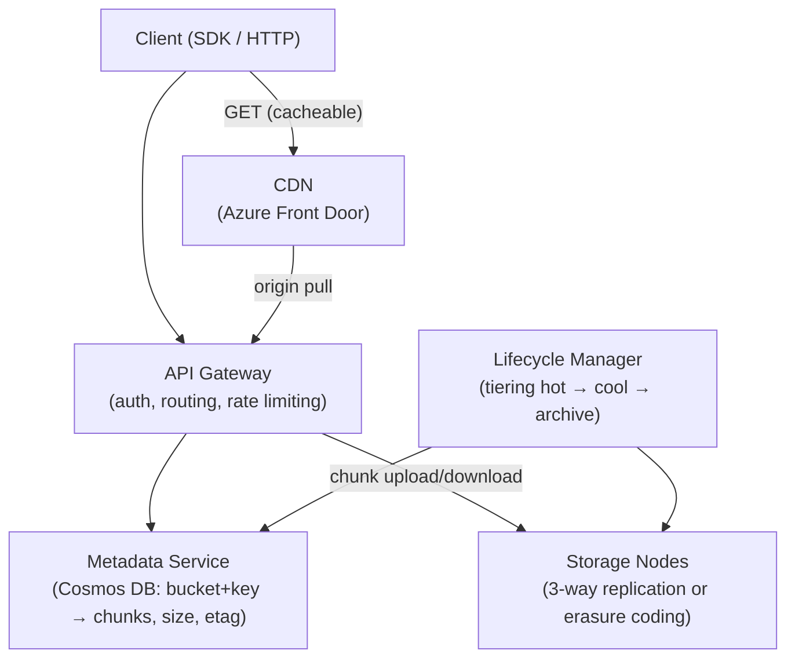
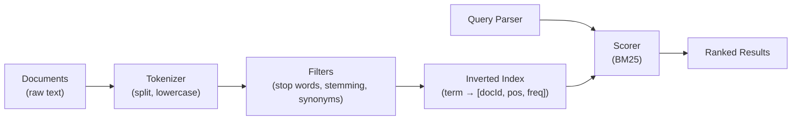
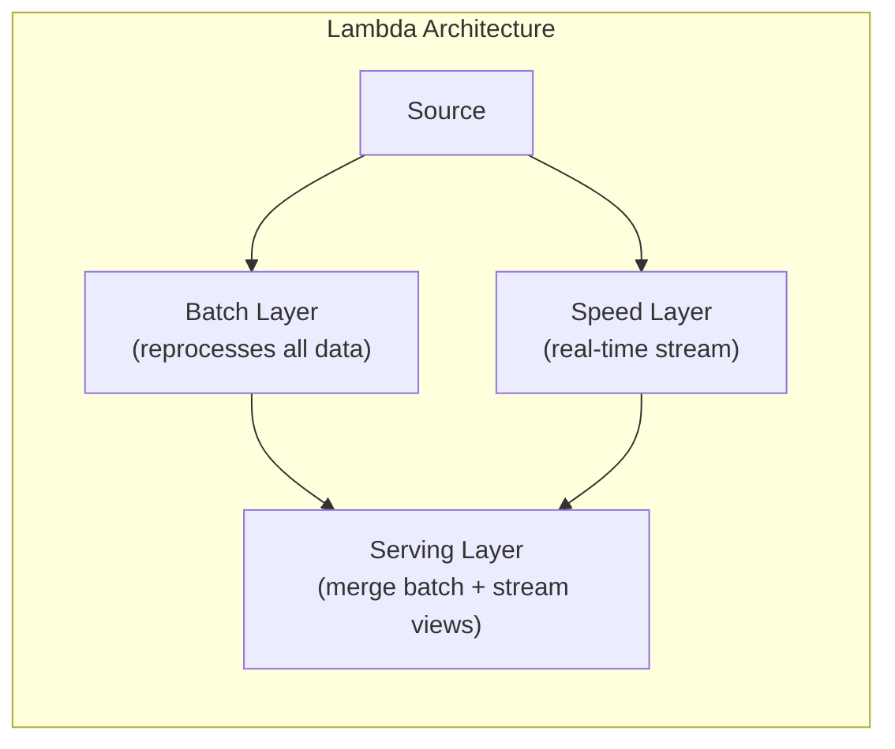
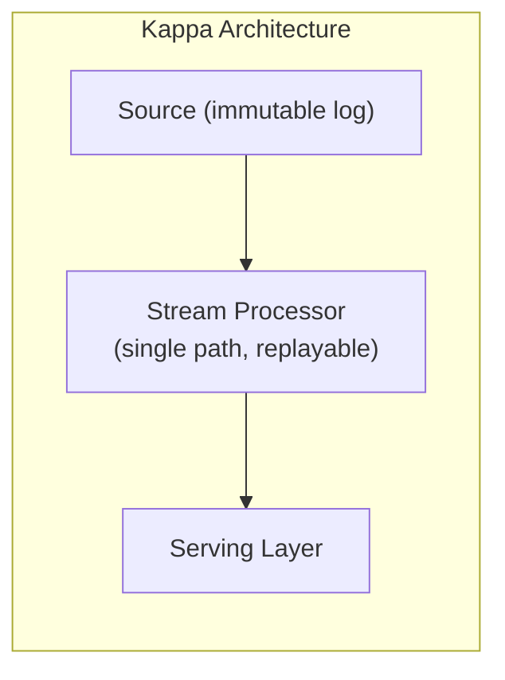

# 11. Storage, Search, and Job Scheduling

> **TL;DR:** Block/file/object storage serve fundamentally different access patterns; object stores like Azure Blob underpin most cloud-scale data platforms. Elasticsearch and Azure AI Search power full-text and faceted search via inverted indexes. Distributed job schedulers solve "exactly-once" and priority execution at scale.

**Interview weight:** P1 — object store design and search internals appear frequently at senior level; scheduler design is a strong differentiator.

---

## Core Concepts

- **Block storage** — raw addressable blocks; OS mounts as a disk; low-latency random I/O.
- **File storage** — POSIX filesystem semantics; directory tree; shared network access.
- **Object storage** — flat key-value namespace; HTTP; unlimited scale; no random-write.
- **Inverted index** — maps term → list of document IDs containing that term; core of every search engine.
- **Sharding an index** — split documents across N shards; each shard is a self-contained inverted index.
- **Distributed scheduler** — ensures a job runs exactly once across a fleet of workers.

---

## Storage Taxonomy

| Aspect | Block Storage | File Storage | Object Storage |
|---|---|---|---|
| Access model | Raw blocks (sector-level) | POSIX filesystem (files/dirs) | HTTP REST (GET/PUT key) |
| Sharing | One VM (or clustered block) | Many VMs simultaneously | Unlimited clients |
| Latency | < 1 ms (NVMe) | ~1–10 ms | ~10–100 ms (first byte) |
| Throughput | Very high (GBps) | High (GBps on premium) | High (parallel requests) |
| Max size | Volume size limit (~64 TB) | Share size limit | Effectively unlimited |
| Random write | Yes | Yes | No (put/overwrite only) |
| Use cases | OS disk, DB files, VM disk | Shared config, media, ERP | Backups, media CDN, data lake, logs |
| Azure | **Azure Managed Disks** | **Azure Files** (SMB/NFS) | **Azure Blob Storage** |
| AWS | EBS | EFS | S3 |
| OSS | Ceph RBD | Ceph CephFS | MinIO |

---

## Designing an S3 / Azure Blob-Like Object Store

### Architecture



### Key Components

- **Buckets / containers** — logical namespace; each has access policy, versioning flag, lifecycle rules.
- **Object key** — flat string (e.g. `images/2024/cat.jpg`); no true directories — prefix is the convention.
- **Metadata service** — maps `(bucket, key)` → `{ chunkList, size, etag, contentType, replicationFactor }`. Stored in Cosmos DB (partition key = bucketId for even distribution).
- **Chunking** — large files split into fixed-size chunks (e.g. 64 MB). Each chunk stored independently; enables parallel upload/download and partial retries.
- **Replication / erasure coding** — 3-way replication for hot data (simple, fast recovery). Erasure coding (e.g. Reed-Solomon 6+3) for cold/archive: stores 6 data + 3 parity chunks; tolerates 3 failures; ~1.5× overhead vs 3× for full replication.
- **Consistency** — Azure Blob: strong consistency within a region (single-writer, last-write-wins with ETags). Cross-region: eventual with geo-redundant storage (GRS).
- **Multipart upload** — split upload into parts; upload in parallel; server assembles on `CompleteMultipartUpload`. Enables resumable uploads (retry failed parts only).
- **Presigned URLs** — time-limited HMAC-signed URL; client uploads/downloads directly to storage, bypassing the application server (reduces cost and latency).

```csharp
// Azure Blob presigned URL (SAS token)
var blobClient = containerClient.GetBlobClient("uploads/video.mp4");
var sasUri = blobClient.GenerateSasUri(BlobSasPermissions.Write | BlobSasPermissions.Read,
    DateTimeOffset.UtcNow.AddMinutes(30));
return Results.Ok(new { uploadUrl = sasUri });
```

### Lifecycle Tiering

- **Hot** — frequently accessed; highest storage cost, lowest access cost.
- **Cool** — infrequently accessed (≥ 30 days); lower storage cost.
- **Archive** — rarely accessed; lowest storage cost; hours to rehydrate.
- Lifecycle policies trigger automatic tiering: "move to cool after 30 days, archive after 365 days, delete after 2555 days."

### CDN and Large-File Download

- CDN caches object at edge after first origin pull.
- For large files (> 100 MB): use **range requests** (`Range: bytes=0-10485759`) — enables parallel segment download.
- For video streaming: use CDN + byte-range + HLS/DASH chunked manifests.

---

## Search Systems

### Inverted Index Construction



**Term-document postings example:**

| Term | Posting list (docId: freq) |
|---|---|
| `game` | [1:3, 4:1, 7:2] |
| `player` | [1:1, 2:4, 5:1] |
| `score` | [2:2, 4:3] |

**Analysis pipeline:** tokenize → lowercase → remove stop words (`the`, `is`) → stem (`running` → `run`) → apply synonyms (`auto` = `car`).

### TF-IDF and BM25

- **TF-IDF** — term frequency × inverse document frequency; rewards rare terms.
- **BM25** — probabilistic variant; adds field length normalisation; standard in Elasticsearch and Azure AI Search.
- Tuning: `b` (length normalisation, 0–1), `k1` (term saturation, 1.2–2.0).

### Index Sharding and Replication

- Documents distributed across N primary shards by `hash(docId) % N`.
- Each shard has R replicas for read scaling and fault tolerance.
- Elasticsearch default: 1 primary + 1 replica per shard. Azure AI Search: replicas configurable (1–12).
- **Search request**: fan out to N shards, each returns top-K; coordinator merges, global top-K returned.
- **Shard rebalancing** — Elasticsearch moves shards automatically on node join/leave.

### Near-Real-Time Indexing

- In-memory write buffer (Lucene segment) flushed every ~1 s → visible to search.
- Segment merging in background reduces query overhead.
- Cosmos DB Change Feed → Azure AI Search indexer (pull model, near-real-time).

### Azure AI Search Architecture

- **Index** — equivalent to a table; define fields, types, searchable/filterable/sortable flags.
- **Indexer** — polls a data source (Cosmos DB, Blob, SQL) and incremental-updates the index.
- **Semantic ranker** — reranks top-50 BM25 results using a language model (cross-encoder).
- **Vector search** — HNSW approximate nearest-neighbour for embedding similarity.
- **Skillset** — enrichment pipeline during indexing (OCR, entity extraction, embedding generation).

### Autocomplete — Tries and Prefix Indexes

- **Trie** — prefix tree; each node = one character; fast prefix lookup O(L) where L = prefix length.
- **Prefix index** — Elasticsearch `edge_ngram` tokeniser: stores `"gam"`, `"game"` as separate terms → prefix query is exact term match on `"gam"`.
- For suggestions: store top-N completions at each trie node (sorted by frequency).

### Search vs Database Query

| Aspect | Search Engine | Relational DB |
|---|---|---|
| Primary index | Inverted index (text matching) | B-tree (exact/range) |
| Text relevance | Native (BM25, semantic ranking) | Limited (`LIKE '%term%'` — no index) |
| Fuzzy matching | Native (edit distance, phonetic) | Not native |
| Aggregations/facets | Optimised (term buckets) | Requires full scan |
| Consistency | Near-real-time (seconds) | Strong (ACID) |
| Update model | Indexed (async) | Immediate |
| Best for | Free-text search, faceting, autocomplete | Exact lookups, joins, transactions |

---

## Job Scheduling and Batch

### Cron vs Distributed Scheduler

| Aspect | Single-server Cron | Distributed Scheduler |
|---|---|---|
| SPOF | Yes | No |
| Exactly-once | No | Yes (with distributed lock) |
| Visibility | None | Dashboard, history, retry |
| Priority | No | Yes |
| Azure | Azure Functions Timer trigger (single instance) | Durable Functions, Azure Logic Apps |
| OSS | Quartz.NET | Hangfire, NCronJob, Temporal |

### Exactly-Once Job Execution

Problem: multiple workers check "is this job due?" simultaneously → double-execution.

Solutions:
1. **Leader election** — only the leader dequeues/executes jobs (blob lease / etcd).
2. **Distributed lock** — acquire `SET job:12345 worker-id NX EX 300` before executing; release on completion.
3. **Database atomic claim** — `UPDATE jobs SET status='running', worker_id=@w WHERE id=@id AND status='pending'`; only one UPDATE wins.
4. **Azure Durable Functions** — orchestration guarantees single-instance execution per `instanceId`.

### Delayed / Scheduled Messages

- **Azure Service Bus scheduled messages** — `ScheduledEnqueueTime` property; message delivered at future time.
- **Redis sorted set** — `ZADD delay_queue score=unix_timestamp value=jobId`; poll with `ZRANGEBYSCORE 0 now` — efficient O(log N + M) dequeue.

### Priority Queues

- Azure Service Bus: session-based priority (separate queues per priority; consumers drain high-priority first).
- Redis sorted set: score = priority (lower = higher priority); `ZPOPMIN` atomically dequeues highest priority.

### At-Least-Once Execution and Idempotency

- Workers must be idempotent: record `jobId` + result in a dedupe store; skip re-execution if already done.
- Use `UPDATE ... WHERE status='pending'` + row-level lock for atomic claim-and-mark.

### Long-Running Workflows

| Tool | Model | State | Azure | Timeout |
|---|---|---|---|---|
| **Durable Functions** | Code-based orchestration | Checkpointed in storage | Native Azure | Months |
| **Temporal** | Code-based, OSS | Replays history | Self-hosted / Temporal Cloud | Months |
| **Azure Logic Apps** | Visual designer, no-code | Managed | Azure-native | Hours-days |
| **Azure Data Factory** | Data pipeline orchestration | Managed | Azure-native | Hours |

Durable Functions: orchestration replays from checkpointed history on restart — code must be deterministic (no `DateTime.Now`, no random without seeding from context).

---

## Batch vs Stream Processing

| Aspect | Batch | Stream |
|---|---|---|
| Latency | Minutes to hours | Milliseconds to seconds |
| Throughput | Very high | High |
| Reprocessing | Easy (replay file) | Requires offset replay |
| Complexity | Low | High (state management, watermarks) |
| Use case | Reports, ETL, ML training | Fraud detection, real-time metrics |
| Azure | Azure Data Factory, HDInsight, Synapse | Event Hubs + Stream Analytics, Flink |

---

## Lambda vs Kappa Architecture





| Aspect | Lambda | Kappa |
|---|---|---|
| Paths | Two (batch + stream) | One (stream only) |
| Accuracy | Batch layer corrects stream errors | Stream must be accurate enough |
| Reprocessing | Re-run batch on full history | Replay stream from offset |
| Complexity | High (two code paths) | Lower (single pipeline) |
| When to use | Batch accuracy critical (finance) | Append-only log, event-sourced data |

**Azure Kappa example:** Event Hubs (immutable log, 90-day retention) → Azure Stream Analytics or Flink → Cosmos DB serving layer. Reprocessing = reset consumer group offset to beginning.

---

## Trade-offs & When to Use

- **Object storage** — for any unstructured data > a few KB; not for random-write workloads.
- **Inverted index** — whenever you need full-text relevance, fuzzy match, or facets; not for strict relational queries.
- **Distributed scheduler** — any job that must run exactly once across a fleet; single-server cron fails at scale.
- **Kappa over Lambda** — when your data pipeline can tolerate stream-only accuracy and you want to reduce code duplication.

---

## Common Pitfalls

- **Object store for random writes** — use block storage; object store is immutable after PUT.
- **Single shard for search** — can't scale reads; always configure replicas for read throughput.
- **No deduplication in job scheduler** — cron on multiple instances → double-execution.
- **No lifecycle tiering** — data accumulates in hot tier; costs balloon.
- **Determinism violations in Durable Functions** — `DateTime.Now`, `Guid.NewGuid()` produce different values on replay → use `context.CurrentUtcDateTime` and `context.NewGuid()`.
- **Segment oversharding in Elasticsearch** — too many shards → overhead dominates; aim for shard size 10–50 GB.

---

## Interview Questions

**Q1. What is the difference between block, file, and object storage?**
A: Block = raw addressable sectors, mounted as disk, best for random I/O (DBs, VMs). File = POSIX filesystem, shareable across VMs (NFS/SMB), best for shared config/media. Object = HTTP key-value, unlimited scale, no random write, best for backups/CDN/data lakes. Never use object store for DB files — no random write support.

**Q2. How does multipart upload work and why is it important?**
A: Client splits file into N parts (e.g. 64 MB each); uploads parts in parallel; server assembles after `CompleteMultipartUpload`. Benefits: parallel throughput (GBps on fast networks), resumability (retry only failed parts), and large file support without loading entire file into memory. Azure equivalent: `BlockBlobClient.StageBlockAsync` + `CommitBlockListAsync`.

**Q3. Explain how an inverted index works.**
A: Analysis pipeline tokenizes and normalises text. For each term, a posting list records `(docId, positions, frequency)`. At query time, retrieve posting lists for all query terms; intersect/union based on AND/OR; score with BM25; return top-K. Enables O(1) term lookup vs O(N) full scan.

**Q4. How would you design an autocomplete system for a game search with 10M titles?**
A: Edge-ngram indexer in Elasticsearch (or Azure AI Search) generates `"dra"`, `"drag"`, `"drag"` tokens at index time. Autocomplete query is a simple term match on the prefix token — fast (index lookup, not scan). Cache top-100 queries per prefix in Redis (TTL 60s). For suggestions ranked by popularity, store `searchCount` field; sort by score × count. Update search counts asynchronously via event stream.

**Q5. What is the difference between TF-IDF and BM25?**
A: Both score term relevance. TF-IDF: `score = TF × log(N/DF)`. BM25 adds field-length normalisation (`b`) and term saturation (`k1`) — a document with 100 occurrences of a term is not 100× more relevant than one with 10. BM25 is more accurate for real-world text; it's the default in Elasticsearch and Azure AI Search.

**Q6. How do you ensure a scheduled job runs exactly once across 10 worker instances?**
A: Use atomic DB claim: `UPDATE jobs SET status='running' WHERE id=@id AND status='pending'`. Only one UPDATE succeeds (row-level lock or Cosmos DB optimistic concurrency). Alternatively, Redis `SET job:{id} worker NX EX 300` — only the first setter wins. For Azure-native: Durable Functions `instanceId`-based singleton orchestration.

**Q7. What is erasure coding and when would you use it over 3-way replication?**
A: Erasure coding (e.g. RS 6+3) stores 6 data chunks + 3 parity chunks; can reconstruct data from any 6 of 9. Storage overhead: 1.5× vs 3× for full replication. Use for cold/archive tiers where latency is less critical and storage cost dominates. Downside: reconstruction is CPU-intensive; not suitable for hot data requiring sub-millisecond access.

**Q8. Compare Lambda and Kappa architectures.**
A: Lambda has two paths — batch (high accuracy, slow) and streaming (fast, approximate); serving layer merges them. Two code paths = double maintenance. Kappa has one streaming path; reprocessing is done by replaying the log from offset. Use Kappa when data is on an immutable log (Event Hubs, Kafka) and the stream processor is accurate enough. Lambda still makes sense when batch accuracy is mandatory (financial reconciliation).

**Q9. How does Azure AI Search handle near-real-time indexing from Cosmos DB?**
A: The AI Search indexer polls the Cosmos DB Change Feed (using a high-watermark checkpoint). Changes are batched and submitted to the indexer; typically visible in search within 1–10 seconds. For lower latency: push-mode indexing (call the AI Search REST API directly from your Change Feed processor). For semantic search, combine BM25 with the semantic ranker which reranks top-50 BM25 results.

**Q10. What are the failure modes of a distributed job scheduler and how do you handle them?**
A: (1) Worker crashes mid-job — use heartbeat + job timeout: if no heartbeat within T seconds, another worker re-claims (must be idempotent). (2) Clock skew causing missed schedule — use a single authoritative clock or NTP-corrected scheduler. (3) Scheduler node failure — use leader election (blob lease) so a standby takes over. (4) Poison job causing repeated failures — max retry count + DLQ + alert.

**Q11. How do you handle backfills and reprocessing in a stream processing pipeline?**
A: With Kappa (Event Hubs/Kafka): reset consumer group offset to the desired timestamp; the stream processor replays all events from that point. New output overwrites existing serving layer (idempotent upserts). Parallelise by assigning multiple consumer instances. For very old data: if log retention expired, replay from a cold archive (Blob Storage) by publishing events back to the bus.

**Q12. Design a presigned URL system for secure user uploads to Azure Blob.**
A: Client requests upload URL from API. API validates permissions, generates a SAS token with `Write` permission, 30-minute expiry, specific blob path (prevents upload to arbitrary paths). Client uploads directly to Azure Blob using the SAS URL (bypasses API server). On completion, client calls API to confirm; API validates blob exists and queues a processing event. Benefits: zero server-side upload bandwidth, reduced cost, no file size limit at the API layer.

---

## Quick Recap

- **Block < 1 ms, File ~5 ms, Object ~50 ms** — choose by access pattern (random write → block; share → file; scale → object).
- **Object store**: flat key-value, chunked upload, presigned URLs, lifecycle tiering (hot→cool→archive), 3-way replication or erasure coding.
- **Inverted index**: term → posting list; analysis = tokenise + stem + stop words; BM25 scoring.
- **Elasticsearch / Azure AI Search**: shards for scale, replicas for read throughput; near-real-time via segment flush (~1 s).
- **Exactly-once scheduler**: atomic DB claim or distributed lock (Redis SETNX / blob lease); idempotent jobs are mandatory.
- **Durable Functions**: checkpointed orchestration; deterministic code required (no `DateTime.Now`).
- **Lambda = two paths (batch + stream), Kappa = one path (stream + replay)** — prefer Kappa with an immutable log.
- **Autocomplete**: edge-ngram at index time → exact term match at query time; cache top queries in Redis.
