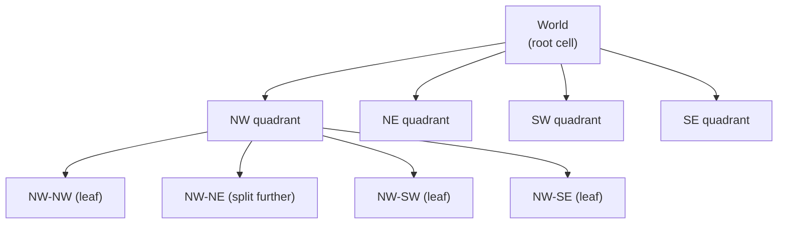
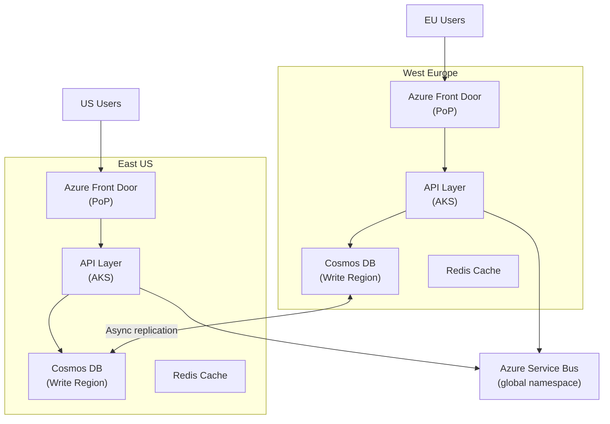

# 12. Geo-Distributed and Location-Based Systems

> **TL;DR:** Multi-region deployment is the only path to 99.99%+ SLO and data residency compliance. Geospatial systems index the physical world to answer "find nearby X" in milliseconds — the choice of geohash vs quadtree vs S2 determines precision, query performance, and update cost.

**Interview weight:** P1 — multi-region design is asked at staff level; location-based design (Uber, nearby restaurants) is a classic senior system design question.

---

## Core Concepts

- **Active-passive** — one region serves traffic; second on standby (warm or cold). Failover = manual or DNS flip.
- **Active-active** — multiple regions serve traffic simultaneously; each is a full replica.
- **Cell-based architecture** — divide the world into independent cells (zones); isolate blast radius.
- **GeoDNS** — DNS responses vary by client IP geography → routes users to nearest region.
- **Anycast** — single IP address advertised from multiple locations; routing protocol selects nearest.
- **Geohash** — encodes a lat/lng pair as a base-32 string; shared prefix = spatial proximity.
- **Quadtree** — recursive 4-way subdivision of a 2D space into cells until each cell has ≤ N points.

---

## Why Multi-Region

| Reason | Detail |
|---|---|
| **Latency** | Users 10 000 km from single region: ~150 ms extra. Multi-region: < 20 ms from nearest. |
| **Availability** | Single region P(outage in 1 yr) ≈ 0.01–0.1%. Two active-active regions: P(simultaneous) ≈ 0.0001%. |
| **Compliance / data residency** | GDPR requires EU personal data stays in EU. CCPA, Brazil LGPD, China PIPL all have residency rules. |
| **Disaster recovery** | Regional AZ outage (e.g. power, flood) should not cause global downtime. |
| **Regulatory** | Gaming: certain content ratings locked to regions; financial: transaction data must stay in country. |

---

## Multi-Region Deployment Models

| Model | How | RTO | RPO | Complexity | Cost | Use case |
|---|---|---|---|---|---|---|
| **Single region** | All traffic to one region | N/A | N/A | Low | Low | Dev, non-critical |
| **Active-passive (warm)** | Standby region replicates data; DNS failover | 5–30 min | Seconds–minutes | Medium | Medium | Standard DR |
| **Active-passive (cold)** | Standby spun up from backups only | Hours | Minutes–hours | Low | Low | Low-budget DR |
| **Active-active** | Both regions serve live traffic; data replicated | < 1 min | ~0 (sync) or seconds (async) | High | High | 99.99%+ SLO |
| **Cell-based** | N independent cells; each serves a user segment | Per-cell isolation | Per-cell | Very high | High | Ultra-scale, blast radius reduction |

**RTO** = Recovery Time Objective (how long to recover). **RPO** = Recovery Point Objective (how much data can be lost).

---

## Traffic Routing

- **GeoDNS** — Azure Traffic Manager: routes DNS responses based on client geography (performance, geographic, priority routing policies). TTL = 60–300 s (failover lag).
- **Anycast** — Azure Front Door: single anycast IP; traffic routed to nearest Azure PoP via BGP; sub-second failover. Better than GeoDNS TTL lag.
- **Latency-based routing** — route to region with lowest measured latency (Azure Front Door latency routing profile).

**Azure Front Door** combines CDN, anycast global LB, WAF, and origin health probes in one managed service — the preferred routing layer for active-active at Xbox/Azure scale.

---

## Data Replication and Conflict Handling

| Strategy | How | Conflicts | Use case |
|---|---|---|---|
| **Single-master / active-passive** | One region writes; others read replicas | None (only one writer) | Read-heavy, tolerate write latency |
| **Multi-master (active-active)** | Any region writes; async replication | Yes — need resolution | Low-latency writes globally |
| **Cosmos DB multi-region writes** | Cosmos DB built-in; LWW (last-write-wins) or custom conflict resolution | LWW / merge procedure | Active-active with Cosmos |
| **CRDT** | Commutative data structures (counters, sets) — merge without coordination | None by design | Counters, shopping carts |
| **Event sourcing + region merge** | Append-only events per region; merge on read | Ordering handled at query time | Audit logs, high-write systems |

**Cosmos DB multi-region writes:**
- Configure "multi-region writes" in the account; each region is a write region.
- Conflict feed captures concurrent writes to the same document; resolve via LWW (on `_ts`) or a stored merge procedure.
- Strong consistency not available with multi-region writes (Bounded Staleness or Session is typical).

---

## Region Failover and Failback Playbook

**Failover:**
1. Health probe detects region unhealthy (Azure Front Door: 3 consecutive probe failures).
2. Traffic Manager / Front Door reroutes traffic to secondary region (< 60 s).
3. If DB is active-passive: promote read replica to write (Cosmos DB failover or SQL geo-replication failover).
4. Alert on-call; validate secondary is healthy; monitor error rates.

**Failback:**
1. Restore failed region; validate data consistency (check replication lag).
2. Sync any writes made to secondary back to primary (replication must catch up).
3. Gradually shift traffic back (canary — 5% → 25% → 100%).
4. Post-mortem within 48 hours.

---

## Data Residency and GDPR Partitioning

- Partition user data by geography at write time: EU users → EU Cosmos DB account; US users → US account.
- Store a user-region mapping in a global routing DB (lightweight, no PII).
- On each request: look up user's home region → route to correct regional endpoint.
- Cross-region queries (for aggregation/analytics): use anonymised/pseudonymised exports.
- Audit log must also respect residency: events for EU users stored in EU Log Analytics workspace.

---

## Latency Budgets Across Continents

| Route | Round-trip latency (approx.) |
|---|---|
| Same datacenter (same AZ) | < 1 ms |
| Same region (different AZ) | 1–5 ms |
| West Europe → East US | 80–100 ms |
| West Europe → East Asia | 150–200 ms |
| West US → East US | 60–80 ms |
| West US → Australia | 150–180 ms |
| Speed of light minimum (Earth circumference) | ~66 ms |

Rule of thumb: every 100 km ≈ 1 ms speed-of-light; real networks add 2–5× due to routing and processing.

---

## Geospatial Indexing Systems

### Comparison Table

| System | Shape | Precision | Hierarchy | Nearest-neighbour | Use case |
|---|---|---|---|---|---|
| **Geohash** | Rectangular cells | Variable (1–12 chars) | Shared prefix | Approximate (8 neighbours) | Simple proximity, Redis GEO |
| **Quadtree** | Recursive squares | Dynamic depth | Parent-child tree | Exact via tree traversal | Dynamic density (few points in rural, many in city) |
| **S2 (Google)** | Spherical cap cells | 31 levels (cell size 1 cm² to 85 M km²) | Hilbert curve hierarchy | Exact, efficient | Google Maps, ride-sharing dispatch |
| **H3 (Uber)** | Hexagons | 16 resolutions | Parent-child | 6 equal neighbours | Equal-distance neighbours, routing, density analysis |
| **R-tree** | Arbitrary rectangles | Exact | Balanced tree | Exact range query | PostGIS, spatial DBs, polygon search |

**Geohash grid** — 4-character geohash ≈ 39 × 20 km. 6-char ≈ 1.2 × 0.6 km. Encode: `gh = geohash(lat, lng, precision=6)`. Query neighbours: get the 8 adjacent cells + self (9 cells total) to avoid boundary edge cases.

**Quadtree subdivision** — splits a tile into 4 equal quadrants; recurse until each leaf has ≤ `capacity` points. Depth adapts to data density: shallow in rural, deep in urban.



---

## "Find Nearby Drivers / Restaurants within X km" Query Design

**Step 1 — Index write (driver location update):**
- Driver app sends GPS update every 5 s.
- Update stored in Redis GEO set: `GEOADD drivers:london lng lat driverId`.
- Also update Cosmos DB for durable persistence (async, via Service Bus).

**Step 2 — Proximity query:**
```
GEORADIUS drivers:london -0.1276 51.5074 5 km ASC COUNT 20
```
Returns up to 20 drivers within 5 km, sorted nearest first. Latency: ~1 ms in Redis.

**Step 3 — Handle high write rate (write amplification):**
- 10 000 active drivers updating every 5 s = 2 000 writes/s to Redis — manageable.
- Partition Redis by geohash prefix (region): `drivers:london`, `drivers:manchester`. Horizontal scale.
- Filter stale drivers: TTL on driver key; if no update in 30 s → mark offline.

**Cosmos DB spatial query (persistent store):**
```sql
SELECT * FROM drivers d
WHERE ST_DISTANCE(d.location, {"type":"Point","coordinates":[-0.1276,51.5074]}) < 5000
```
Cosmos DB spatial index automatically created when field is GeoJSON `Point` type.

**PostGIS (OSS alternative):**
```sql
SELECT id FROM drivers
WHERE ST_DWithin(location::geography, ST_MakePoint(-0.1276, 51.5074)::geography, 5000);
```
R-tree spatial index on `location` column.

---

## Real-Time Location at High Write Rate

- At 7M players each updating location every 10 s: 700 000 writes/s — too high for a single Redis node.
- **Sampling** — reduce update frequency for stationary users (exponential backoff on movement delta < threshold).
- **In-memory grid / geohash sharding** — partition by geohash prefix across Redis cluster; each node owns a geographic region.
- **Push vs pull** — only send location updates when movement > N metres; saves 60–80% write volume.
- **Eventual persistence** — buffer in-memory; flush to Cosmos DB in micro-batches (every 5 s) via background worker.

---

## Proximity Service Sharding

- Shard by `geohash(lat, lng, precision=4)` (≈ 156 km × 78 km cell) → consistent hashing ring of shards.
- Each shard is a Redis Cluster node owning a geographic cell.
- Cross-cell queries (driver near cell boundary): query the current cell + all 8 neighbours.
- Re-sharding: when a cell exceeds capacity, split at higher precision (precision=5); update routing table.

---

## Multi-Region Active-Active Topology



---

## Worked Design: Compact Proximity Service

**Requirements:** find available drivers within 5 km; update location every 5 s; 100K active drivers; p99 < 50 ms.

| Layer | Choice | Rationale |
|---|---|---|
| Location write | Redis GEO (primary) + Cosmos DB (async) | Redis for speed; Cosmos for durability |
| Proximity query | `GEORADIUS` on Redis | ~1 ms; handles 100K drivers easily on single node |
| Redis sharding | Cluster partitioned by geohash prefix | Scale to 1M+ drivers |
| Staleness | TTL 30 s on driver key; `GEOADD` refreshes | Removes offline drivers automatically |
| API | gRPC streaming to mobile clients | Low overhead, streaming for real-time updates |
| Consistency | Eventual (Redis primary, Cosmos async) | Acceptable: 5 s location lag is fine for ride dispatch |
| Geo-fencing | S2 cells for region-based rules | Compute cell membership at write time; store as metadata |
| Multi-region | Active-active with geohash region ownership | EU drivers on EU Redis; US drivers on US Redis |

---

## Trade-offs & When to Use

- **Geohash** — simplest; Redis built-in; use for proximity queries where rectangular cells are fine.
- **Quadtree** — use when data density varies enormously (urban vs rural); dynamic depth avoids over/under-splitting.
- **S2** — use when accuracy and hierarchical cell operations matter (routing, coverage analysis).
- **H3** — use when you need equal-distance neighbours (routing, density maps, ML features).
- **Active-active** — use only when 99.99%+ SLO and < 20 ms global latency are required; otherwise active-passive is simpler.

---

## Common Pitfalls

- **GeoDNS TTL lag** — failover takes 60–300 s; use Azure Front Door anycast for sub-second failover.
- **Geohash boundary problem** — two points very close but in different geohash cells; always query 9 cells (self + 8 neighbours).
- **No conflict resolution in multi-master** — last-write-wins silently drops updates; design for conflict detection or use CRDTs.
- **Writing every GPS tick** — 700K writes/s at 7M users with 10s interval; apply movement threshold sampling.
- **Not partitioning data by residency** — EU PII leaked to US region; GDPR violation.
- **Quadtree too deep** — O(depth) insertion; cap max depth and fallback to a list for very dense cells.

---

## Interview Questions

**Q1. Why would you choose active-active over active-passive multi-region?**
A: Active-active serves traffic from multiple regions simultaneously — lower latency for users in each region (no cross-continent hop) and zero-RPO failover (traffic is already routed away from a failing region). Active-passive requires failover time (5–30 min DNS propagation) and accepts RPO of seconds–minutes. Active-active costs more and requires conflict resolution for multi-master writes.

**Q2. How does Azure Front Door improve on GeoDNS for global routing?**
A: GeoDNS has TTL-based lag (60–300 s to propagate failover). Azure Front Door uses anycast — a single IP advertised from multiple PoPs via BGP; traffic routed to nearest healthy PoP in < 1 s. Also combines CDN, WAF, and origin health probes. Front Door is the right choice for gaming at 7M players.

**Q3. Explain the geohash boundary problem and how to solve it.**
A: Two points very close to each other (e.g. 1 m apart) can be in adjacent geohash cells with different prefix strings. A proximity query using only `WHERE geohash LIKE 'prefix%'` would miss them. Solution: always query the target cell + its 8 surrounding cells (3×3 grid). Redis `GEORADIUS` handles this internally.

**Q4. Compare geohash, quadtree, S2, and H3 for a ride-sharing proximity service.**
A: Geohash: simple, rectangular, Redis built-in — good for quick proximity queries. Quadtree: variable depth adapts to data density (deep in cities, shallow in countryside) — good for dynamic load distribution. S2: spherical cells with Hilbert curve hierarchy — better accuracy for global coverage; used by Google for ride-dispatch. H3: hexagons with equal-distance neighbours — better for density analysis and ML features (Uber's choice). At Xbox scale for player proximity: geohash + Redis GEO is the simplest starting point.

**Q5. How do you handle 700 000 location writes per second from 7M players updating every 10 s?**
A: Partition Redis Cluster by geohash prefix (regional cells); each node owns a set of cells. Apply movement-threshold sampling: only write if player moved > N metres (reduces volume 60–80% for stationary/slow users). Batch micro-writes to Cosmos DB asynchronously via a background Service Bus consumer. Use `GEOADD` which is atomic and O(log N) per write.

**Q6. What is the cell-based architecture and why does Netflix/Microsoft use it?**
A: A cell is an independent, isolated stack (compute + data) serving a fixed subset of users. Failures are bounded to one cell (blast radius isolation). Rollouts deploy to one cell first. Cells scale independently. Trade-off: cross-cell queries are harder; data residency per cell is a natural fit. Xbox uses AZ-based isolation within regions as a simpler cell model.

**Q7. How do you implement data residency compliance for GDPR with active-active?**
A: Route EU users to EU region at write time (GeoDNS + Front Door profile). All PII for EU users stored exclusively in EU Cosmos DB account. Non-PII metadata (game scores, aggregates) can replicate globally. Maintain a user-region mapping table (global, no PII) to route subsequent requests. Analytics pipelines use anonymised exports. Audit logs for EU users stored in EU Log Analytics workspace.

**Q8. How would you handle Cosmos DB conflict resolution in multi-master active-active?**
A: Default: LWW (last-write-wins) on `_ts` (server timestamp). Custom: register a conflict resolution stored procedure in JavaScript that implements domain-specific merge logic (e.g. for a player's inventory, take the union of items rather than LWW). Monitor the conflict feed (`conflicts` container) for unexpected conflicts. For high-conflict scenarios, prefer single-master for that entity type and accept write latency.

**Q9. What are the latency implications of a synchronous chain across regions?**
A: A request from West Europe hitting a service that synchronously calls East US adds ~80–100 ms per hop. With 3 hops, total latency = 240–300 ms — unacceptable for a game API. Solutions: serve from the user's nearest region for all synchronous calls; use async messaging for cross-region data sync; replicate read data to all regions (CQRS materialised views).

**Q10. Design a geo-fence notification system — alert when a player enters a restricted zone.**
A: At write time: encode player's location as S2 cell at level 15 (~1 km²). Precompute restricted zone boundaries as S2 cell covers. On each location update: check if any of the player's S2 cells intersect the restricted zone cells (set membership lookup — O(1) with a hash set). If intersection: enqueue a notification event to Service Bus → Notification Service. Store geo-fence rules in Redis (fast lookup) with Cosmos DB as durable backing store.

**Q11. How do you implement a rolling failover back to the primary region after recovery?**
A: (1) Wait for primary replication lag to reach zero (Cosmos DB shows "0 s" lag in metrics). (2) Shift 1% of traffic from secondary to primary via Front Door weight routing. (3) Monitor error rate and latency for 5 min. (4) Ramp: 5% → 25% → 50% → 100% over 30 min. (5) Once 100% on primary, demote secondary back to read replica. (6) Never do a hard cutover — gradual ramp catches regressions.

**Q12. What is the H3 advantage over geohash for a delivery service surge pricing model?**
A: Geohash cells are rectangular with varying widths at different latitudes — distances between cell centroids are inconsistent. H3 hexagons have equal distance to all 6 neighbours (~the same edge-to-centre distance at a given resolution). This uniformity makes density calculations and ML feature engineering for surge pricing more accurate. Uber's production surge pricing uses H3 resolution 9 (~174 m × 174 m cells).

---

## Quick Recap

- **Active-active** = lowest RTO/RPO, highest cost/complexity; use Azure Front Door anycast not GeoDNS.
- **Cosmos DB multi-region writes** = built-in; use LWW or custom conflict resolution; no strong consistency.
- **GDPR**: partition user data by region at write time; user-region routing table (no PII) directs requests.
- **Geohash boundary problem**: always query 9 cells (self + 8 neighbours); Redis GEO handles internally.
- **Geohash** = simple/rectangular, **Quadtree** = density-adaptive, **S2** = spherical precision, **H3** = equal hexagons for density/routing.
- **High-frequency location writes**: movement-threshold sampling + Redis GEO cluster partitioned by geohash prefix.
- **Latency reality**: West Europe → East US ≈ 80–100 ms; never put synchronous cross-continent calls in a user-facing path.
- **Cell-based architecture** = blast-radius isolation; deploy one cell at a time; Netflix and Xbox both use this model.
