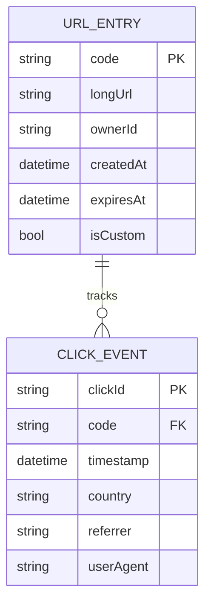
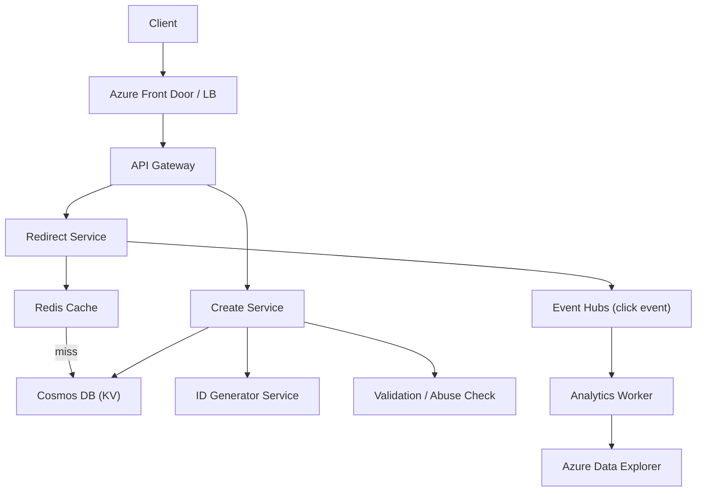
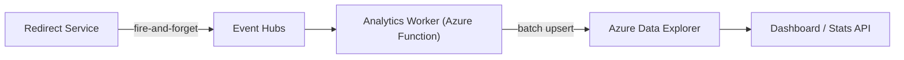

# 1. Design a URL Shortener

> **TL;DR:** Map long URLs to short 6–8 character codes; serve 301/302 redirects at < 10 ms from a distributed KV store backed by a write-once, read-many access pattern with aggressive caching.

**Interview weight:** P0 — tests ID generation, hashing, caching, sharding and abuse prevention in a tight, estimable system.

---

## 1. Requirements

### Functional
- Shorten a URL; optionally specify a custom alias and TTL.
- Redirect short URL → original URL (301 or 302).
- Click analytics (count, geo, referrer) — async, non-blocking.
- URL expiry and deletion.

### Non-Functional
- Read-heavy (redirect : create ≈ 100 : 1).
- Redirect p99 < 10 ms (cache-served); creation < 100 ms.
- Short codes are unique globally, unguessable (no sequential IDs).
- 99.99% availability on the redirect path.

### Out of Scope
- ML spam scoring (flag only), full web crawler, user accounts / dashboards.

---

## 2. Scale Estimation

| Metric | Calculation | Value |
|--------|-------------|-------|
| DAU (creators) | 10 M / month ÷ 30 | ~333 K/day |
| Write RPS | 333 K ÷ 86 400 | ~4 RPS |
| Peak write RPS | 4 × 5 | ~20 RPS |
| Read RPS (100:1) | 20 × 100 | ~2 000 RPS |
| Peak read RPS | 2 000 × 5 | ~10 K RPS |
| Storage/year | 4 RPS × 86 400 × 365 × 500 B | ~63 GB/yr |
| Cache size (20% hot) | top 20% URLs serve 80% reads → cache 20% of daily entries | ~12 M entries × 500 B ≈ 6 GB |
| Bandwidth (read) | 10 K RPS × 500 B response | ~5 MB/s |

---

## 3. API Design

| Method | Endpoint | Request | Response |
|--------|----------|---------|----------|
| `POST` | `/api/v1/shorten` | `{ longUrl, alias?, ttlDays? }` | `{ shortUrl, code, expiresAt }` |
| `GET` | `/{code}` | — | `HTTP 301/302 Location: <longUrl>` |
| `DELETE` | `/api/v1/urls/{code}` | — | `204 No Content` |
| `GET` | `/api/v1/urls/{code}/stats` | — | `{ clicks, geo[], referrers[] }` |

---

## 4. Data Model



**Storage choice:**

| Requirement | Choice | Why |
|-------------|--------|-----|
| Short code → long URL lookup | **Redis** (L1) + **Azure Cosmos DB** (KV, key=code) | Sub-ms reads; Cosmos handles durability |
| Click analytics (append-only, high write) | **Azure Event Hubs** → **Cosmos DB / Azure Data Explorer** | Decouple analytics writes from redirect path |
| Custom alias uniqueness check | Cosmos DB unique index on `code` | Single point of truth |

Cosmos DB partition key = `code` (uniform distribution, point reads O(1)).

---

## 5. High-Level Architecture



**Request path (redirect):**
1. Client hits `/{code}` via Azure Front Door.
2. API Gateway routes to Redirect Service.
3. Redis lookup: cache hit → return 301/302 immediately (< 1 ms).
4. Cache miss: read Cosmos DB point-read (~5 ms) → populate Redis with TTL → return redirect.
5. Fire-and-forget: publish click event to Event Hubs.
6. Analytics Worker batches events into Azure Data Explorer (Kusto).

**Request path (create):**
1. Create Service calls ID Generator to get a unique code.
2. Validate long URL (format, safe-browsing blocklist check).
3. Write to Cosmos DB; set Redis entry with same TTL.
4. Return `shortUrl` to caller.

---

## 6. Deep Dives

### 6.1 ID Generation — Comparison Table

| Strategy | Uniqueness | Guessability | Complexity | Collision risk |
|----------|------------|--------------|------------|----------------|
| **MD5/SHA256 + take first 6 chars** | High | Low | Simple | ~1% at 1 B entries (birthday paradox) — retry loop needed |
| **Base62 of auto-increment counter** | Perfect | **High** (sequential) | Simple DB counter | None if single writer; SPOF if DB is down |
| **Snowflake-style 64-bit ID → Base62** | Perfect | Low (time-based, opaque) | Medium — need epoch + worker ID | None |
| **Pre-generated key range (ticket server)** | Perfect | Low | Each service grabs a range (e.g. 1 M codes), works offline | None during batch; must handle range exhaustion |
| **Redis INCR → Base62** | Perfect in single Redis | Low | Very simple | Redis SPOF without replication |
| **ZooKeeper range assignment** | Perfect | Low | Complex ops | None |

**Recommended:** Snowflake-style ID from a dedicated ID Generator service (epoch 41 bits + datacenter 5 bits + worker 5 bits + seq 12 bits). Base62-encode the lower 36 bits → 6-char code. No DB round-trip for uniqueness.

Base62 alphabet: `0-9A-Za-z` → 62^6 ≈ 56 billion codes.

```csharp
// Base62 encode
private static readonly char[] Alphabet =
    "0123456789ABCDEFGHIJKLMNOPQRSTUVWXYZabcdefghijklmnopqrstuvwxyz".ToCharArray();

public static string ToBase62(long id)
{
    var sb = new StringBuilder();
    while (id > 0) { sb.Insert(0, Alphabet[id % 62]); id /= 62; }
    return sb.ToString().PadLeft(6, '0');
}
```

### 6.2 301 vs 302 Redirect

| Aspect | 301 Permanent | 302 Temporary |
|--------|---------------|---------------|
| Browser caching | Browser caches; **no future request to our server** | Browser re-requests each time |
| Analytics accuracy | **Clicks lost** after first visit per browser | Every click hits our server → accurate counts |
| CDN behaviour | Edge may cache indefinitely | Edge does not cache |
| URL update possible? | No — browser won't re-check | Yes |
| **Use when** | Static, never-expiring short links, maximum perf | Any link with analytics or that may change |

**Decision:** Use 302 for analytics-enabled links (default); 301 only for verified-static no-analytics links.

### 6.3 Cache Design

- **L1:** Redis (Azure Cache for Redis) — key: `url:{code}`, value: serialized `longUrl + expiresAt`.
- TTL on Redis entry = min(URL TTL, 24 h) — auto-evicts when URL expires.
- **Hot-key problem:** A viral short link can hammer one Redis slot. Mitigate with local in-process cache (IMemoryCache, 30 s TTL) on each Redirect Service pod before hitting Redis.
- **Cache invalidation:** On URL deletion, issue a `DEL url:{code}` to Redis; eventual consistency acceptable for a 302 redirect.

### 6.4 Click Analytics Pipeline (Async)



- Redirect Service publishes `{ code, ts, ip, referrer, ua }` to Event Hubs (partition key = `code`).
- Analytics Worker processes micro-batches every 5 s; writes to Kusto (ADX) for fast aggregation.
- Stats API queries ADX — completely decoupled from the hot redirect path.

### 6.5 Rate Limiting and Abuse Prevention

- Per-IP rate limit: 10 creates/min (token bucket in Redis — see [02-Rate-Limiter](02-Rate-Limiter.md)).
- Safe-browsing API check (Google Safe Browsing / Microsoft Defender) before persisting URL.
- Block reserved aliases (`api`, `admin`, `health`, etc.).
- Blocklist table in Cosmos DB (partition key = `domain`); checked on creation.
- CAPTCHA challenge above 5 creates/hour per unauthenticated IP.

### 6.6 Expiry and Cleanup

- Cosmos DB TTL feature: set document TTL = `ttlDays × 86400`. Cosmos auto-deletes expired docs.
- Redis entry also carries TTL matching document TTL.
- Soft-delete flag for audit: `isDeleted=true` for owner-deleted URLs (retain 30 days for reporting).
- Background sweeper job (Azure Function Timer) for custom expiry edge cases not covered by Cosmos TTL.

---

## 7. Bottlenecks, Failure Modes & Trade-offs

| Bottleneck | Symptom | Mitigation |
|------------|---------|------------|
| Redis cache miss storm on startup or eviction | Redirect latency spike | Stagger pod restarts; pre-warm cache from Cosmos on startup |
| Hot single short code (viral link) | Redis single-key saturation | Pod-local `IMemoryCache` + Redis read replicas |
| Cosmos DB hot partition | High RU consumption, throttling | Partition key = `code` is ideal; no range scans |
| ID Generator SPOF | No new URLs can be created | Deploy ≥ 2 ID Generator instances; each has disjoint worker IDs |
| Analytics Event Hubs consumer lag | Stale click counts | Scale out Analytics Worker; add partitions |
| Malicious URL bypass | Short link points to phishing page | Safe-browsing check + async periodic re-scan of stored URLs |

---

## 8. Scaling the Design

- **Geo-distribution:** Deploy Redirect Services in multiple Azure regions behind Azure Front Door (anycast). Cosmos DB multi-region writes with eventual consistency; Redis replicated per region.
- **Read scaling:** Azure CDN layer in front of the Redirect Service can cache 302 responses for 5–60 s (configurable per analytics requirement).
- **Write scaling:** ID Generator is stateless after initialization; add instances freely. Cosmos DB auto-scales RU/s.
- **Storage growth:** ~63 GB/yr — trivial for Cosmos. Archive cold entries (> 1 yr old, 0 clicks) to Azure Blob Storage + remove from Cosmos.

---

## 9. Follow-up Extensions

- **Custom domain support:** Owner maps `short.mybrand.com` → DNS CNAME to our Front Door; we route by domain+alias.
- **QR code generation:** Render on demand via Image Service; cache in Blob Storage.
- **A/B testing links:** One short code → weighted fan-out to multiple long URLs.
- **Dashboard with real-time updates:** SignalR WebSocket push from Analytics Worker on click event.
- **Link-in-bio pages:** Aggregate multiple links under one profile short URL.

---

## Interview Questions

**Q1. Why Base62 instead of Base64?**
A: Base64 uses `+` and `/` which are URL-unsafe. Base62 (`0-9A-Za-z`) needs no URL encoding, is case-sensitive, and gives 62^6 ≈ 56 B combinations — sufficient for years of traffic.

**Q2. What's the simplest ID generation approach and what's wrong with it?**
A: Auto-increment counter in a DB. Simple, zero collisions. Problems: single writer bottleneck, counter is guessable (competitors can scan your traffic volume), and it's a SPOF if the DB is down.

**Q3. How do you handle a collision with the MD5-truncation approach?**
A: On write conflict (Cosmos unique constraint violation), append a salt (e.g. `longUrl + attempt`) and retry hashing. Cap retries at 5; after that fall back to Snowflake ID. In practice collision rate is low enough that one retry suffices.

**Q4. Why use 302 rather than 301 by default?**
A: 301 causes browsers and CDNs to cache the redirect permanently, so subsequent clicks never reach our servers — click analytics become inaccurate. 302 ensures every request reaches us.

**Q5. How do you prevent the cache from serving a deleted/expired URL?**
A: On deletion, issue synchronous `DEL url:{code}` to Redis before returning 204. Redis TTL auto-handles expiry. The pod-local cache has a short (30 s) TTL so stale entries clear quickly. Accept up to 30 s eventual consistency on deletion — serving one extra redirect to a deleted URL is not a correctness violation.

**Q6. Describe the hot-link problem and how to solve it.**
A: A single viral short code (e.g. a Super Bowl ad URL) can receive millions of requests/second, all hashing to the same Redis key on the same shard. Solution: add a pod-local `IMemoryCache` with 5–30 s TTL so the Redis hit rate drops 99%+. Additionally, use Redis read replicas and spread reads across them.

**Q7. How does Cosmos DB TTL work for URL expiry?**
A: Set `DefaultTimeToLive` on the container and per-document `ttl` (seconds). Cosmos deletes expired documents in the background at no additional RU cost. This is reliable, serverless, and requires zero application-side cleanup logic.

**Q8. How would you scale the creation path to 10 000 writes/sec?**
A: The Cosmos DB write path easily handles this with auto-scale RU/s. The bottleneck would be the ID Generator — scale it horizontally (each node has a unique `workerId`). The abuse-check (safe-browsing API) is the real latency concern — move it async: persist the URL immediately with `status=pending`, serve the short link, and reject/delete asynchronously if flagged.

**Q9. Design the analytics schema for "top 10 most clicked links in the last hour."**
A: Use Azure Data Explorer (Kusto) with a streaming ingestion from Event Hubs. Query: `ClickEvents | where timestamp > ago(1h) | summarize count() by code | top 10 by count_`. Kusto handles this in milliseconds on billions of rows. Alternative: Redis sorted set `ZINCR clicks:hourly {code} 1` + `ZREVRANGE` — simpler but requires TTL management.

**Q10. What's the read:write ratio and how does it influence design?**
A: 100:1 read-heavy. Drives: (a) invest heavily in caching (Redis + pod-local), (b) Cosmos DB chosen for sub-ms point reads not relational queries, (c) write path complexity (ID generation, abuse checks) can be slower (< 100 ms) without impacting the majority of traffic.

**Q11. How would you implement custom aliases with collision prevention?**
A: Custom aliases are user-supplied strings. Insert into Cosmos with the alias as the `code` partition key — Cosmos unique constraint on `code` will reject duplicates. On `409 Conflict`, return "alias taken" to the user. Reserved aliases are pre-populated in a blocklist checked before the Cosmos write.

**Q12. Single point of failure analysis — what are the SPOFs and how do you mitigate them?**
A:
- **Redis:** Use Azure Cache for Redis with zone-redundant replication + automatic failover. On Redis outage, the Redirect Service falls back to direct Cosmos DB reads (higher latency but available).
- **Cosmos DB:** Multi-region replicas with automatic failover. 99.999% SLA.
- **ID Generator:** Deploy ≥ 2 instances with disjoint worker ID ranges. Creates fail gracefully to secondary.
- **API Gateway / Azure Front Door:** Managed service with Microsoft SLA — not a SPOF in practice.

**Q13. How would you add a "preview before redirect" feature to prevent phishing complaints?**
A: Add a query param `?preview=1`. Redirect Service renders a simple HTML interstitial (served from CDN) showing the destination URL and a "Proceed" button. Only the button performs the actual redirect. Cache the interstitial HTML at the CDN edge.

---

## Quick Recap

- **Base62** of Snowflake ID = 6-char code; 56 B capacity; globally unique, unguessable, no DB round-trip.
- **302 by default** (analytics accuracy); 301 only for static, never-changing, analytics-free links.
- **Cache hierarchy:** pod-local `IMemoryCache` (30 s) → Redis (URL TTL) → Cosmos DB point-read.
- **Cosmos DB TTL** handles expiry serverlessly; partition key = `code` for uniform O(1) point reads.
- **Click analytics** fully decoupled via Event Hubs → Analytics Worker → Azure Data Explorer; redirect path never blocks on analytics.
- **Abuse prevention:** safe-browsing API on create + per-IP rate limiting (token bucket in Redis).
- **Hot-link mitigation:** pod-local cache absorbs viral traffic before it reaches Redis.
- **SPOF hardening:** Redis zone-redundant replica + Cosmos multi-region + ≥ 2 ID Generator nodes.
